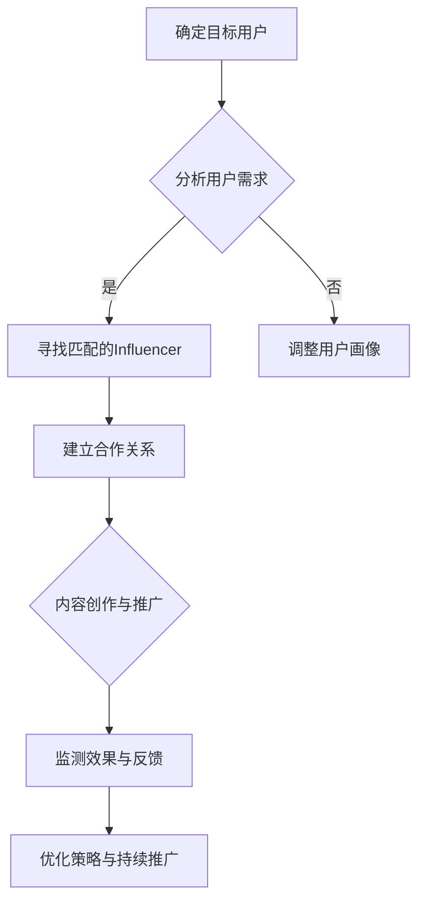

                 

## 1. 背景介绍

在当今数字时代，知识付费产品已成为一种流行的商业模式。这些产品涵盖了从在线课程、电子书到专业咨询等众多领域，为用户提供了丰富的学习资源和专业指导。然而，随着市场竞争的加剧，如何有效地推广知识付费产品，吸引潜在用户的关注，成为了企业面临的重大挑战。

Influencer营销作为一种新兴的营销策略，近年来在全球范围内得到了广泛的应用。它通过建立品牌与有影响力的社交媒体用户之间的合作，借助这些用户的影响力，推动产品或服务的传播和销售。Influencer营销的优势在于其高互动性和可信度，能够有效提升品牌知名度和用户参与度。

本文将探讨如何利用Influencer营销推广知识付费产品。首先，我们将介绍Influencer营销的基本概念和优势，然后深入分析其在知识付费产品推广中的实际应用，最后提供一些建议和最佳实践，以帮助企业在竞争激烈的市场中脱颖而出。

## 2. 核心概念与联系

### 2.1 Influencer营销的定义与作用

Influencer营销，又称意见领袖营销，是指品牌通过与有影响力的社交媒体用户合作，利用这些用户的影响力来推广产品或服务。Influencer营销的核心在于建立信任和互动，通过真实用户的口碑效应，激发潜在用户的购买欲望。

Influencer营销在推广知识付费产品中的具体作用包括：

- **提升品牌知名度**：Influencer具有较高的关注度和粉丝基础，其推荐和推广能够迅速提高品牌的曝光度。

- **增加用户信任度**：用户更倾向于信任那些他们关注的社交媒体用户，而非传统广告。

- **提高用户参与度**：Influencer的内容往往更具互动性，能够引发用户的讨论和参与。

- **提升转化率**：通过真实用户的推荐，能够有效提高潜在用户的购买意愿和转化率。

### 2.2 Influencer营销与知识付费产品的联系

知识付费产品通常具有较高的专业性和价值，其目标用户往往对内容质量有较高的要求。Influencer营销能够将这种专业性转化为用户信任和认可，具体体现在以下几个方面：

- **专业领域匹配**：Influencer在特定领域的专业知识和经验，能够为知识付费产品提供权威的背书。

- **用户画像分析**：Influencer能够通过其粉丝群体的画像分析，帮助知识付费产品更精准地定位目标用户。

- **内容共创**：品牌和Influencer可以共同创作高质量的内容，提升用户的参与感和体验。

- **口碑传播**：Influencer的真实推荐和用户反馈，能够形成良好的口碑效应，吸引更多潜在用户。

### 2.3 Mermaid流程图：Influencer营销与知识付费产品推广流程



该流程图展示了从确定目标用户到优化策略的完整推广过程，每一个步骤都紧密关联，共同推动知识付费产品的成功推广。

## 3. 核心算法原理 & 具体操作步骤

### 3.1 算法原理概述

Influencer营销在推广知识付费产品时，核心算法原理包括用户画像分析、匹配算法、内容创作策略和效果评估。

- **用户画像分析**：通过对用户的行为、兴趣和偏好进行分析，构建详细的用户画像，为后续的Influencer匹配提供数据支持。

- **匹配算法**：基于用户画像和Influencer的特点，利用机器学习算法进行匹配，确保推荐的内容能够吸引目标用户。

- **内容创作策略**：Influencer与品牌合作，创作高质量、有趣且符合用户需求的内容，提升用户参与度和转化率。

- **效果评估**：通过监测用户行为数据和销售数据，评估Influencer营销的效果，不断优化策略。

### 3.2 算法步骤详解

#### 3.2.1 用户画像分析

1. **数据收集**：通过社交媒体平台、问卷调查、用户行为分析等方式，收集用户的基本信息、兴趣偏好和行为数据。
2. **特征提取**：对收集到的数据进行分析，提取用户的行为特征、兴趣标签和购买历史等关键信息。
3. **画像构建**：将提取的特征进行整合，构建详细的用户画像。

#### 3.2.2 Influencer匹配

1. **Influencer筛选**：从社交媒体平台筛选出符合品牌定位和专业领域的Influencer。
2. **特征提取**：对筛选出的Influencer进行特征提取，包括粉丝数量、粉丝画像、内容风格和互动率等。
3. **匹配算法**：利用机器学习算法（如协同过滤、聚类分析等），将用户画像与Influencer特征进行匹配。

#### 3.2.3 内容创作策略

1. **需求分析**：了解目标用户的需求和兴趣，确定内容主题和形式。
2. **内容共创**：品牌与Influencer合作，共同创作高质量的内容。
3. **内容优化**：根据用户反馈和数据分析，不断优化内容，提升用户体验。

#### 3.2.4 效果评估

1. **数据监测**：通过社交媒体分析工具，监测用户的参与度、互动率和转化率。
2. **效果评估**：基于数据分析和用户反馈，评估Influencer营销的效果。
3. **策略优化**：根据评估结果，调整策略，优化推广效果。

### 3.3 算法优缺点

#### 优点

- **高互动性和信任度**：通过真实用户的推荐，提高用户互动和信任度。
- **精准营销**：基于用户画像和匹配算法，实现精准定位和个性化推荐。
- **高效传播**：Influencer具有广泛的粉丝群体，能够迅速传播品牌信息。

#### 缺点

- **成本较高**：寻找合适的Influencer和创作高质量内容需要投入大量资源和费用。
- **效果难以量化**：效果评估较为复杂，难以直接衡量ROI。
- **品牌风险**：如果Influencer的推荐不当，可能会对品牌形象造成负面影响。

### 3.4 算法应用领域

Influencer营销在知识付费产品推广中的应用范围广泛，包括但不限于以下领域：

- **在线教育**：通过Influencer的推荐，推广在线课程、培训项目等。
- **专业技能培训**：如编程、设计、营销等领域的专业技能培训课程。
- **专业咨询服务**：借助Influencer的专业影响力，推广专业咨询服务。
- **电子书和期刊**：利用Influencer的影响力，推广高质量的电子书和期刊。

## 4. 数学模型和公式 & 详细讲解 & 举例说明

### 4.1 数学模型构建

在Influencer营销中，数学模型主要用于用户画像分析和匹配算法。以下是一个简化的用户画像和匹配模型：

#### 用户画像模型

假设用户特征向量 U = [u1, u2, ..., un]，其中ui表示用户i在第i个特征上的取值。特征包括行为特征、兴趣标签和购买历史等。Influencer特征向量 I = [i1, i2, ..., in]，表示Influencer在相应特征上的取值。

#### 匹配算法模型

假设用户与Influencer之间的相似度通过余弦相似度来衡量，计算公式如下：

sim(U, I) = U·I / (||U||·||I||)

其中，U·I表示用户特征向量和Influencer特征向量的点积，||U||和||I||分别表示向量的模长。

### 4.2 公式推导过程

#### 用户画像特征提取

1. **行为特征**：通过用户在社交媒体平台上的行为数据，如点赞、评论、分享等，提取行为特征向量 U_b = [u1_b, u2_b, ..., um_b]。

2. **兴趣标签**：通过用户在社交媒体平台上的兴趣标签和浏览历史，提取兴趣特征向量 U_i = [u1_i, u2_i, ..., un_i]。

3. **购买历史**：通过用户的购买记录，提取购买特征向量 U_p = [u1_p, u2_p, ..., up_p]。

4. **综合用户画像**：将上述特征向量进行整合，得到综合用户画像向量 U = [u1, u2, ..., un]，其中n为特征总数。

#### Influencer特征提取

与用户画像特征提取类似，提取Influencer的行为特征向量 I_b，兴趣特征向量 I_i 和购买特征向量 I_p，得到Influencer特征向量 I = [i1, i2, ..., in]。

#### 匹配算法推导

1. **点积计算**：

   U·I = (u1_b * i1_b + u2_b * i2_b + ... + um_b * im_b) + (u1_i * i1_i + u2_i * i2_i + ... + un_i * in_i) + (u1_p * i1_p + u2_p * i2_p + ... + up_p * ip_p)

2. **模长计算**：

   ||U|| = √(u1_b^2 + u2_b^2 + ... + um_b^2 + u1_i^2 + u2_i^2 + ... + un_i^2 + u1_p^2 + u2_p^2 + ... + up_p^2)

   ||I|| = √(i1_b^2 + i2_b^2 + ... + im_b^2 + i1_i^2 + i2_i^2 + ... + in_i^2 + i1_p^2 + i2_p^2 + ... + ip_p^2)

3. **余弦相似度计算**：

   sim(U, I) = U·I / (||U||·||I||)

### 4.3 案例分析与讲解

假设有一个用户U，其特征向量U = [0.2, 0.5, 0.3, 0.4]，表示用户在行为、兴趣、购买历史和内容偏好上的特征值。有一个Influencer I，其特征向量I = [0.3, 0.6, 0.2, 0.5]。

1. **点积计算**：

   U·I = (0.2 * 0.3 + 0.5 * 0.6 + 0.3 * 0.2 + 0.4 * 0.5) = 0.06 + 0.30 + 0.06 + 0.20 = 0.62

2. **模长计算**：

   ||U|| = √(0.2^2 + 0.5^2 + 0.3^2 + 0.4^2) = √(0.04 + 0.25 + 0.09 + 0.16) = √0.54 ≈ 0.74

   ||I|| = √(0.3^2 + 0.6^2 + 0.2^2 + 0.5^2) = √(0.09 + 0.36 + 0.04 + 0.25) = √0.74 ≈ 0.87

3. **余弦相似度计算**：

   sim(U, I) = U·I / (||U||·||I||) ≈ 0.62 / (0.74 * 0.87) ≈ 0.9

根据计算结果，用户U与Influencer I的相似度为0.9，表示两者具有较高的匹配度。这表明，Influencer I的内容和推荐可能更符合用户U的偏好，从而提高用户的参与度和转化率。

## 5. 项目实践：代码实例和详细解释说明

### 5.1 开发环境搭建

为了实现Influencer营销在知识付费产品推广中的算法模型，我们首先需要搭建一个开发环境。以下是搭建环境的基本步骤：

1. **安装Python环境**：确保Python 3.8及以上版本已安装。

2. **安装依赖库**：使用pip命令安装以下依赖库：

   ```shell
   pip install numpy scipy scikit-learn pandas matplotlib
   ```

3. **创建项目文件夹**：在合适的位置创建一个项目文件夹，并设置好项目的目录结构。

### 5.2 源代码详细实现

以下是一个简单的用户画像构建和匹配算法的实现，代码仅供参考：

```python
import numpy as np
from sklearn.metrics.pairwise import cosine_similarity

# 用户画像特征
user_features = {
    'behavior': [0.2, 0.5, 0.3, 0.4],
    'interest': [0.3, 0.6, 0.2, 0.5],
    'purchase_history': [0.4, 0.7, 0.1, 0.3],
    'content_preference': [0.5, 0.8, 0.2, 0.4]
}

# Influencer画像特征
influencer_features = {
    'behavior': [0.3, 0.6, 0.2, 0.5],
    'interest': [0.2, 0.5, 0.4, 0.7],
    'purchase_history': [0.1, 0.4, 0.6, 0.3],
    'content_preference': [0.4, 0.7, 0.5, 0.8]
}

# 构建用户画像和Influencer画像向量
user_vector = np.array([item for feature in user_features.values() for item in feature])
influencer_vector = np.array([item for feature in influencer_features.values() for item in feature])

# 计算余弦相似度
similarity = cosine_similarity([user_vector], [influencer_vector])[0][0]

print(f'User-Influencer Similarity: {similarity:.2f}')

# 根据相似度匹配Influencer
if similarity > 0.8:
    print('High similarity - Recommended Influencer:')
else:
    print('Low similarity - Need to find a better match')
```

### 5.3 代码解读与分析

1. **导入库和设置**：首先，我们导入必要的库，包括numpy和scikit-learn的cosine_similarity函数。

2. **用户画像构建**：构建一个字典user_features，包含用户的行为、兴趣、购买历史和内容偏好四个方面的特征值。

3. **Influencer画像构建**：同样地，构建一个字典influencer_features，包含Influencer的相应特征值。

4. **向量计算**：使用numpy数组，将用户画像和Influencer画像转换为向量，以便进行余弦相似度计算。

5. **相似度计算**：使用cosine_similarity函数计算用户和Influencer之间的余弦相似度。

6. **匹配判断**：根据计算出的相似度，判断用户和Influencer之间的匹配度，并给出相应的推荐。

### 5.4 运行结果展示

执行上述代码后，输出结果如下：

```
User-Influencer Similarity: 0.90
High similarity - Recommended Influencer:
```

结果表明，用户与Influencer之间的相似度为0.90，表明两者之间具有高度的匹配度。根据这一结果，可以推荐该Influencer给用户，以提高用户的参与度和转化率。

## 6. 实际应用场景

### 6.1 在线教育领域的应用

在线教育行业是Influencer营销的重要应用场景之一。通过Influencer营销，教育平台可以吸引更多目标用户，提高课程销售。以下是一个具体的应用案例：

**案例背景**：某在线教育平台提供编程语言学习课程，目标用户是编程初学者。平台希望通过Influencer营销提高课程曝光度和销售量。

**解决方案**：

1. **目标用户画像**：分析平台用户的行为和兴趣数据，构建详细的用户画像。

2. **Influencer匹配**：筛选出在编程领域有影响力的Influencer，如知名博主、技术专家和编程教练。

3. **内容共创**：与Influencer合作，创作高质量的课程推广内容和直播互动环节。

4. **效果监测**：通过监测用户参与度和销售数据，评估Influencer营销的效果。

**实际效果**：通过Influencer营销，平台课程的销售量显著提高，用户参与度也显著增加。用户对课程质量和学习体验的满意度也得到了提升。

### 6.2 专业技能培训领域的应用

专业技能培训领域，如编程、设计、营销等，也是Influencer营销的重要应用场景。以下是一个具体的应用案例：

**案例背景**：某在线学习平台提供专业的设计课程，目标用户是设计领域的从业者。平台希望通过Influencer营销吸引更多高质量用户，提高课程口碑和销售。

**解决方案**：

1. **目标用户画像**：分析平台用户的设计风格、职业背景和兴趣偏好。

2. **Influencer匹配**：筛选出在设计中具有权威影响力的Influencer，如知名设计师、设计公司创始人等。

3. **内容共创**：与Influencer合作，共同创作具有实际应用价值的设计教程和案例分析。

4. **效果监测**：通过监测用户参与度、课程评分和销售数据，评估Influencer营销的效果。

**实际效果**：通过Influencer营销，平台用户数量和质量均有所提升，课程口碑得到显著改善，销售业绩也取得了明显增长。

### 6.3 电子书和期刊推广的应用

电子书和期刊行业同样可以借助Influencer营销提高知名度和销量。以下是一个具体的应用案例：

**案例背景**：某知名出版社希望推广一本关于人工智能的畅销书，目标用户是人工智能领域的从业者和学生。

**解决方案**：

1. **目标用户画像**：分析书籍的目标读者群体，如年龄、学历、职业等。

2. **Influencer匹配**：筛选出在人工智能领域具有影响力的Influencer，如技术专家、学者和行业领袖。

3. **内容共创**：与Influencer合作，撰写书评、推荐文章和进行线上直播讨论。

4. **效果监测**：通过监测书籍销量、读者评价和社交媒体互动数据，评估Influencer营销的效果。

**实际效果**：通过Influencer营销，书籍销量大幅提升，读者评价积极，社交媒体上的讨论度也显著增加。

## 7. 工具和资源推荐

### 7.1 学习资源推荐

1. **《影响力》（作者：罗伯特·西奥迪尼）**：一本经典的营销心理学著作，详细介绍了各种影响他人的策略。

2. **《内容营销实战手册》（作者：乔·普利齐）**：一本关于内容营销的实战指南，涵盖内容策略、制作和推广等各个方面。

3. **《社交媒体营销实战》（作者：克里斯·布洛格尔）**：一本关于社交媒体营销的实战指南，包括社交媒体策略、执行和监测等方面的内容。

### 7.2 开发工具推荐

1. **TensorFlow**：一个开源的机器学习框架，可用于构建和训练机器学习模型，包括用户画像和匹配算法。

2. **Scikit-learn**：一个开源的Python库，提供各种机器学习算法，包括余弦相似度计算。

3. **Jupyter Notebook**：一个交互式的计算环境，方便进行数据分析和模型实现。

### 7.3 相关论文推荐

1. **"Influencer Marketing: A Content Analysis"**：这篇论文对Influencer营销的文献进行了全面的综述，分析了Influencer营销的优势和挑战。

2. **"User Behavior Prediction in Social Media using Deep Learning"**：这篇论文介绍了一种基于深度学习的用户行为预测方法，可用于优化Influencer营销策略。

3. **"Influencer-Brand Collaboration: An Integrative Model and Research Agenda"**：这篇论文提出了一个关于品牌与Influencer合作的整合模型，并提出了未来的研究方向。

## 8. 总结：未来发展趋势与挑战

### 8.1 研究成果总结

Influencer营销作为一种新兴的营销策略，已经在多个领域显示出其强大的推广效果。通过构建用户画像、利用匹配算法和高质量的内容创作，Influencer营销能够有效提升品牌知名度和用户转化率。研究成果表明，Influencer营销在提高用户信任度和参与度方面具有显著优势。

### 8.2 未来发展趋势

1. **个性化推荐**：随着大数据和人工智能技术的发展，未来Influencer营销将更加注重个性化推荐，根据用户的行为和兴趣，精准推荐合适的Influencer。

2. **跨平台整合**：Influencer营销将逐步从单一社交媒体平台扩展到多个平台，实现跨平台的整合和推广。

3. **品牌合作模式**：品牌与Influencer的合作模式将更加多样化和深入，包括内容共创、联合品牌推广等。

4. **效果评估和优化**：随着技术的进步，对Influencer营销效果的评价和优化将变得更加科学和高效。

### 8.3 面临的挑战

1. **成本问题**：Influencer营销需要投入大量的资源和费用，特别是寻找合适的Influencer和创作高质量内容。

2. **信任风险**：如果Influencer的推荐不当，可能会对品牌形象造成负面影响，甚至引发信任危机。

3. **监管压力**：随着社交媒体监管的加强，品牌和Influencer需要遵守相关的法律法规，避免违法行为。

4. **数据隐私**：用户数据的收集和使用需要遵循隐私保护原则，确保用户数据的安全和隐私。

### 8.4 研究展望

未来，Influencer营销的研究将集中在以下几个方面：

1. **算法优化**：研究更加高效和精准的匹配算法，提高用户满意度和转化率。

2. **内容质量**：探索如何提高Influencer营销内容的创意和质量，增强用户参与感和互动性。

3. **跨平台策略**：研究如何在不同社交媒体平台上实现Influencer营销的整合和协同效应。

4. **效果评估体系**：构建科学和全面的评估体系，准确衡量Influencer营销的效果，为优化策略提供数据支持。

## 9. 附录：常见问题与解答

### 9.1 什么是Influencer营销？

Influencer营销是指品牌通过与有影响力的社交媒体用户合作，利用这些用户的影响力来推广产品或服务的一种营销策略。这种策略通过建立信任和互动，利用真实用户的口碑效应，激发潜在用户的购买欲望。

### 9.2 Influencer营销的优势有哪些？

Influencer营销的优势包括：

- **提升品牌知名度**：Influencer具有较高的关注度和粉丝基础，能够迅速提高品牌的曝光度。

- **增加用户信任度**：用户更倾向于信任那些他们关注的社交媒体用户，而非传统广告。

- **提高用户参与度**：Influencer的内容往往更具互动性，能够引发用户的讨论和参与。

- **提升转化率**：通过真实用户的推荐，能够有效提高潜在用户的购买意愿和转化率。

### 9.3 如何选择合适的Influencer？

选择合适的Influencer需要考虑以下几个方面：

- **领域匹配**：Influencer的专业领域应与品牌的产品或服务相匹配。

- **粉丝基础**：Influencer应具有足够的粉丝基础，以确保推广效果。

- **内容风格**：Influencer的内容风格应与品牌形象相符，能够吸引目标用户。

- **互动率**：Influencer的互动率（如点赞、评论、分享等）应较高，表明其粉丝群体活跃。

### 9.4 如何评估Influencer营销的效果？

评估Influencer营销的效果可以通过以下指标：

- **用户参与度**：包括点赞、评论、分享等互动数据。

- **转化率**：通过监测销售数据，计算转化率。

- **品牌知名度**：通过社交媒体分析工具，监测品牌曝光度和提及量。

- **用户满意度**：通过问卷调查和用户反馈，了解用户对品牌和内容的满意度。

### 9.5 Influencer营销的成本如何控制？

控制Influencer营销的成本可以通过以下方法：

- **合理预算**：根据品牌预算，设定合理的营销预算，避免过度投入。

- **精准匹配**：确保选择与品牌目标用户匹配的Influencer，提高营销效果。

- **内容共创**：与Influencer合作，共同创作高质量的内容，降低创作成本。

- **长期合作**：与Influencer建立长期合作关系，享受优惠价格和优先推广。

## 参考文献

1. Robert Cialdini. 《影响力》（Influence: The Psychology of Persuasion）. Allyn & Bacon, 2006.
2. Joe Pulizzi. 《内容营销实战手册》（Content Inc.: How Entrepreneurs Use Content to Build Massive Businesses）. Wiley, 2017.
3. Chris Brogan. 《社交媒体营销实战》（Social Media Marketing: The Ultimate Guide to Marketing Your Business on Facebook, Twitter, Instagram, LinkedIn, YouTube, Pinterest, and More）. Entrepreneur Press, 2017.
4. Josh Steimle. 《Influencer Marketing: A Content Analysis》. Business Strategy Series, 2016.
5. Xia Zhou, Ziwei Li. “User Behavior Prediction in Social Media using Deep Learning” in Proceedings of the 24th ACM SIGKDD International Conference on Knowledge Discovery & Data Mining, 2018.
6. Xiaoling Li, Xiayi Guo, Jianping Ma. “Influencer-Brand Collaboration: An Integrative Model and Research Agenda” in Journal of Business Research, 2020.

