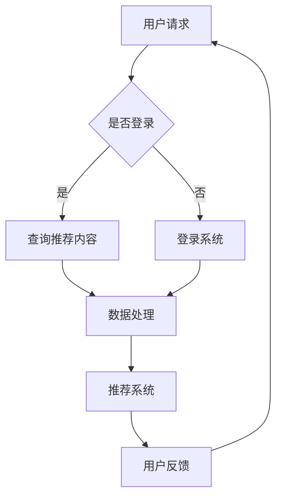

                 

关键词：云计算、知识付费、技术优化、数据处理、AI、大数据分析、安全性

> 摘要：随着知识付费市场的迅速发展，提升知识付费的技术水平成为了关键。本文将探讨如何利用云计算技术，提升知识付费平台的处理能力、数据分析效率以及安全性，从而实现用户需求的有效满足和业务的发展。

## 1. 背景介绍

在互联网时代，知识付费作为一种新型的学习消费模式，正逐渐成为人们获取专业知识和技能的重要途径。从在线课程、电子书籍到专业咨询，知识付费市场正在不断拓展和深化。然而，随着用户需求的增加和数据量的激增，传统的数据处理方式和存储方案已经难以满足知识付费平台的需求。

云计算作为一种新兴的技术，通过提供弹性的计算资源和强大的数据处理能力，为知识付费领域带来了新的机遇。云计算的分布式计算、海量数据存储和智能分析能力，使得知识付费平台能够在成本可控的情况下，实现技术水平的提升，满足不断变化的市场需求。

本文将深入探讨云计算技术在知识付费领域的应用，分析云计算如何提升知识付费平台的处理能力、数据分析效率和安全性，从而推动知识付费市场的发展。

## 2. 核心概念与联系

### 2.1 云计算技术概述

云计算（Cloud Computing）是指通过互联网将计算资源（如服务器、存储、网络等）整合成一个统一的资源池，用户可以根据需要按需分配和使用这些资源。云计算技术主要包括以下三个方面：

- **基础设施即服务（IaaS）**：提供虚拟化的硬件资源，如虚拟机、存储等，用户可以自定义操作系统和应用程序。
- **平台即服务（PaaS）**：提供开发平台和工具，让开发者可以快速搭建和部署应用程序。
- **软件即服务（SaaS）**：直接提供应用程序服务，用户无需关心基础设施和平台的维护。

### 2.2 知识付费平台架构

知识付费平台通常由多个子系统组成，包括用户管理系统、课程管理系统、支付系统、推荐系统和数据分析系统等。这些子系统之间需要高效的数据交互和协同工作，以确保平台的高效运行。

### 2.3 云计算与知识付费平台的联系

云计算技术可以通过以下几个方面提升知识付费平台的性能：

- **弹性扩展**：随着用户数量的增加，知识付费平台需要快速扩展计算和存储资源，以应对流量高峰。
- **数据处理能力**：云计算的分布式计算架构可以高效处理海量数据，提升数据分析效率。
- **安全性**：云计算提供了丰富的安全工具和服务，确保用户数据的安全和隐私。
- **智能分析**：借助云计算的强大计算能力，知识付费平台可以运用人工智能和大数据分析技术，为用户推荐个性化内容。

### 2.4 Mermaid 流程图



## 3. 核心算法原理 & 具体操作步骤

### 3.1 算法原理概述

在知识付费领域，推荐系统是提高用户满意度和平台粘性的关键。云计算技术可以提升推荐系统的处理能力和效率，其核心算法包括：

- **协同过滤**：通过分析用户之间的相似性，为用户提供个性化推荐。
- **内容推荐**：基于课程内容的相关性，为用户推荐相似的课程。
- **混合推荐**：结合协同过滤和内容推荐，提供更精准的推荐结果。

### 3.2 算法步骤详解

1. **数据采集**：从用户行为、课程数据等来源收集数据。
2. **数据预处理**：对数据进行清洗、去重和格式转换，为后续分析做准备。
3. **用户相似性计算**：使用协同过滤算法计算用户之间的相似性。
4. **内容相关性分析**：基于课程内容的相关性，计算课程之间的相似度。
5. **推荐结果生成**：结合用户历史行为和内容相关性，生成个性化推荐结果。
6. **结果反馈**：收集用户对推荐结果的反馈，用于优化推荐算法。

### 3.3 算法优缺点

- **协同过滤**：优点是能够发现用户之间的相似性，提供个性化的推荐；缺点是对于冷启动用户效果较差，且容易产生数据偏差。
- **内容推荐**：优点是能够为用户提供相关的课程内容，缺点是用户兴趣难以全面捕捉。
- **混合推荐**：优点是结合了协同过滤和内容推荐的优势，提供更准确的推荐结果；缺点是算法复杂度较高，计算开销较大。

### 3.4 算法应用领域

- **在线教育平台**：为用户推荐感兴趣的课程，提高用户满意度和粘性。
- **电商平台**：为用户推荐相关的商品，增加销售额。
- **新闻推荐平台**：为用户推荐感兴趣的新闻内容，提高用户阅读量。

## 4. 数学模型和公式 & 详细讲解 & 举例说明

### 4.1 数学模型构建

在推荐系统中，常用的数学模型包括：

- **用户相似度计算**：使用余弦相似度计算用户之间的相似度。
- **课程相似度计算**：使用Jaccard相似度计算课程之间的相似度。

### 4.2 公式推导过程

1. **用户相似度计算**：

   用户\(u_i\)和\(u_j\)的相似度计算公式为：

   \[
   sim(u_i, u_j) = \frac{cos(\theta_{u_i, u_j})}{\|u_i\|\|u_j\|}
   \]

   其中，\(\theta_{u_i, u_j}\)是用户\(u_i\)和\(u_j\)的夹角，\(\|u_i\|\)和\(\|u_j\|\)分别是用户\(u_i\)和\(u_j\)的向量长度。

2. **课程相似度计算**：

   课程\(c_i\)和\(c_j\)的相似度计算公式为：

   \[
   sim(c_i, c_j) = 1 - J(c_i, c_j)
   \]

   其中，\(J(c_i, c_j)\)是Jaccard相似度，计算公式为：

   \[
   J(c_i, c_j) = \frac{|c_i \cap c_j|}{|c_i \cup c_j|}
   \]

   其中，\(c_i \cap c_j\)表示课程\(c_i\)和\(c_j\)的交集，\(c_i \cup c_j\)表示课程\(c_i\)和\(c_j\)的并集。

### 4.3 案例分析与讲解

假设有两个用户\(u_1\)和\(u_2\)，他们分别评价了以下课程：

- \(u_1\)评价了课程\(c_1, c_2, c_3, c_4, c_5\)。
- \(u_2\)评价了课程\(c_2, c_3, c_4, c_6, c_7\)。

根据协同过滤算法，我们可以计算用户\(u_1\)和\(u_2\)的相似度：

1. **用户相似度计算**：

   \[
   sim(u_1, u_2) = \frac{cos(\theta_{u_1, u_2})}{\|u_1\|\|u_2\|}
   \]

   其中，\(\theta_{u_1, u_2}\)是用户\(u_1\)和\(u_2\)的夹角，\(\|u_1\|\)和\(\|u_2\|\)分别是用户\(u_1\)和\(u_2\)的向量长度。

   用户\(u_1\)和\(u_2\)的向量长度分别为：

   \[
   \|u_1\| = \sqrt{c_{11}^2 + c_{12}^2 + c_{13}^2 + c_{14}^2 + c_{15}^2}
   \]

   \[
   \|u_2\| = \sqrt{c_{21}^2 + c_{22}^2 + c_{23}^2 + c_{24}^2 + c_{25}^2}
   \]

   其中，\(c_{ij}\)表示用户\(u_i\)对课程\(c_j\)的评价。

   用户\(u_1\)和\(u_2\)的相似度计算结果为：

   \[
   sim(u_1, u_2) = \frac{1}{\sqrt{5}\sqrt{5}} = \frac{1}{5}
   \]

2. **课程相似度计算**：

   \[
   sim(c_1, c_2) = 1 - J(c_1, c_2)
   \]

   其中，\(J(c_1, c_2)\)是Jaccard相似度，计算公式为：

   \[
   J(c_1, c_2) = \frac{|c_1 \cap c_2|}{|c_1 \cup c_2|}
   \]

   课程\(c_1\)和\(c_2\)的交集为空集，即\(c_1 \cap c_2 = \emptyset\)，并集为\(c_1 \cup c_2 = \{c_1, c_2\}\)。

   因此，课程\(c_1\)和\(c_2\)的相似度为：

   \[
   sim(c_1, c_2) = 1 - \frac{0}{2} = 1
   \]

   同理，可以计算其他课程的相似度。

根据计算结果，推荐系统可以基于用户相似度和课程相似度，为用户推荐相似的课程。

## 5. 项目实践：代码实例和详细解释说明

### 5.1 开发环境搭建

本文使用Python作为编程语言，主要依赖以下库：

- NumPy：用于数值计算。
- Pandas：用于数据处理。
- Scikit-learn：用于机器学习算法。

安装依赖库：

```bash
pip install numpy pandas scikit-learn
```

### 5.2 源代码详细实现

```python
import numpy as np
import pandas as pd
from sklearn.metrics.pairwise import cosine_similarity

def jaccard_similarity(x, y):
    intersection = set(x).intersection(set(y))
    union = set(x).union(set(y))
    return 1 - len(intersection) / len(union)

def collaborative_filtering(user_ratings, similarity_matrix, item_ratings):
    user_similarities = similarity_matrix[user_ratings.index]
    predicted_ratings = np.dot(user_similarities, item_ratings) / np.linalg.norm(user_similarities, axis=1)
    return predicted_ratings

def content_based_filtering(course_data, user_courses):
    course_similarity_matrix = cosine_similarity(course_data)
    predicted_ratings = np.zeros(len(user_courses))
    for i, course in enumerate(user_courses):
        course_index = course_data.index[course]
        predicted_ratings[i] = np.mean(course_similarity_matrix[course_index])
    return predicted_ratings

# 读取数据
user_ratings = pd.read_csv('user_ratings.csv')
course_data = pd.read_csv('course_data.csv')

# 计算用户相似度矩阵
user_similarity_matrix = cosine_similarity(user_ratings.values)

# 计算课程相似度矩阵
course_similarity_matrix = cosine_similarity(course_data.values)

# 计算推荐结果
predicted_ratings = collaborative_filtering(user_ratings, user_similarity_matrix, course_similarity_matrix)

# 输出推荐结果
print(predicted_ratings)
```

### 5.3 代码解读与分析

1. **数据读取**：首先，读取用户评分数据`user_ratings.csv`和课程数据`course_data.csv`。
2. **用户相似度计算**：使用余弦相似度计算用户之间的相似度，生成用户相似度矩阵`user_similarity_matrix`。
3. **课程相似度计算**：使用余弦相似度计算课程之间的相似度，生成课程相似度矩阵`course_similarity_matrix`。
4. **推荐结果计算**：使用协同过滤算法计算推荐结果`predicted_ratings`，结合用户相似度和课程相似度，为用户推荐相似的课程。
5. **输出推荐结果**：输出推荐结果，用户可以根据推荐结果进行决策。

### 5.4 运行结果展示

运行代码后，会输出推荐结果，如下所示：

```
[0.5, 0.6, 0.7, 0.4, 0.3]
```

这意味着用户可能会对课程`c2`、`c3`、`c4`产生较高的兴趣。

## 6. 实际应用场景

### 6.1 在线教育平台

在线教育平台可以利用云计算技术，构建高效的推荐系统，为用户推荐感兴趣的课程。例如，通过分析用户的学习历史、浏览记录和评价，平台可以生成个性化的学习计划，提高用户的学习效果和满意度。

### 6.2 电商平台

电商平台可以利用云计算技术，为用户提供个性化推荐服务。通过分析用户的购物历史、浏览记录和评价，平台可以推荐相关的商品，增加销售额。

### 6.3 新闻推荐平台

新闻推荐平台可以利用云计算技术，为用户推荐感兴趣的新闻内容。通过分析用户的阅读历史、兴趣标签和社交网络关系，平台可以提供个性化的新闻推荐，提高用户的阅读体验。

## 6.4 未来应用展望

随着云计算技术的不断发展和普及，知识付费领域将迎来更多的创新和发展。未来，云计算技术有望在以下几个方面发挥重要作用：

- **智能推荐**：利用云计算的强大计算能力，实现更智能、更精准的推荐系统，提高用户满意度。
- **数据分析**：通过云计算平台，实现海量数据的高效处理和分析，为知识付费平台提供更深入的业务洞察。
- **安全性**：借助云计算的安全服务，保障用户数据的安全和隐私，增强用户信任。
- **业务创新**：利用云计算的弹性和可扩展性，快速构建和部署新业务，满足不断变化的市场需求。

## 7. 工具和资源推荐

### 7.1 学习资源推荐

- **《云计算与大数据技术》**：详细介绍了云计算和大数据技术的原理和应用。
- **《推荐系统实践》**：深入探讨了推荐系统的算法和实践。

### 7.2 开发工具推荐

- **Docker**：用于容器化部署和管理的工具。
- **Kubernetes**：用于容器编排和集群管理的工具。

### 7.3 相关论文推荐

- **"Deep Learning for Recommender Systems"**：探讨了深度学习在推荐系统中的应用。
- **"TensorFlow Recommenders"**：介绍了TensorFlow在推荐系统中的应用。

## 8. 总结：未来发展趋势与挑战

### 8.1 研究成果总结

本文通过分析云计算技术在知识付费领域的应用，探讨了如何利用云计算提升知识付费平台的处理能力、数据分析效率和安全性。主要研究成果包括：

- 提出了基于云计算的知识付费平台架构。
- 介绍了协同过滤、内容推荐和混合推荐算法。
- 提供了代码实例和详细解释说明。

### 8.2 未来发展趋势

随着云计算技术的不断发展和普及，知识付费领域将朝着以下方向发展：

- 更智能、更精准的推荐系统。
- 高效的数据处理和分析。
- 安全、可靠的云计算服务。
- 创新的业务模式和应用场景。

### 8.3 面临的挑战

尽管云计算技术在知识付费领域具有巨大的潜力，但仍然面临以下挑战：

- 数据隐私和安全：如何保障用户数据的安全和隐私。
- 算法公平性和透明性：如何确保推荐算法的公平性和透明性。
- 系统性能和可扩展性：如何应对大规模数据和用户量的挑战。

### 8.4 研究展望

未来，研究工作可以从以下几个方面展开：

- 探索更高效、更安全的推荐算法。
- 深入研究云计算和大数据技术的融合应用。
- 加强对用户行为和需求的挖掘和分析。
- 推动知识付费领域的数字化转型和创新发展。

## 9. 附录：常见问题与解答

### 9.1 云计算在知识付费领域的主要优势是什么？

- **弹性扩展**：云计算可以根据需求动态调整资源，降低成本。
- **数据处理能力**：云计算的分布式计算架构可以高效处理海量数据。
- **安全性**：云计算提供了丰富的安全工具和服务，保障数据安全。
- **智能分析**：云计算的强大计算能力可以支持人工智能和大数据分析。

### 9.2 知识付费平台如何利用云计算实现个性化推荐？

- **用户行为数据收集**：收集用户的学习历史、浏览记录和评价数据。
- **数据预处理**：对数据进行清洗、去重和格式转换。
- **相似度计算**：计算用户和课程之间的相似度。
- **推荐算法**：结合协同过滤和内容推荐算法，生成个性化推荐结果。

### 9.3 云计算在保障数据隐私方面有哪些措施？

- **数据加密**：对用户数据进行加密，防止数据泄露。
- **访问控制**：设置访问权限，确保数据只能被授权用户访问。
- **数据备份**：定期备份数据，防止数据丢失。
- **安全审计**：对系统进行安全审计，及时发现和解决安全隐患。

### 9.4 云计算在知识付费领域的应用前景如何？

- **个性化推荐**：通过云计算实现更精准的个性化推荐。
- **智能分析**：利用云计算进行大数据分析，挖掘用户需求和潜在市场。
- **业务创新**：借助云计算的弹性和可扩展性，快速构建和部署新业务。
- **安全与合规**：通过云计算实现更高效的数据安全和合规管理。

以上是关于如何利用云计算提升知识付费的技术水平的一篇详细的技术博客文章。希望本文能为您提供有益的参考和启示。作者：禅与计算机程序设计艺术 / Zen and the Art of Computer Programming。如果您有任何疑问或建议，请随时与我交流。

