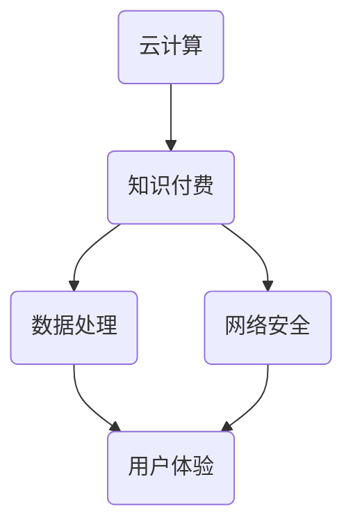

                 

关键词：云计算、知识付费、技术提升、数据处理、网络安全、用户体验、AI技术、个性化推荐、大数据分析。

## 摘要

本文旨在探讨如何通过云计算技术提升知识付费领域的服务水平和技术水平。我们将从背景介绍、核心概念、算法原理、数学模型、项目实践、实际应用、工具推荐以及未来展望等方面详细阐述这一主题。

### 1. 背景介绍

知识付费已经成为当今信息化社会中的一种新兴商业模式。随着互联网的普及，人们获取知识的渠道变得更加多样化，知识付费平台如雨后春笋般涌现。然而，如何提升这些平台的技术水平，以满足用户日益增长的需求，成为了行业亟待解决的问题。

云计算作为一项革命性的技术，正在改变传统IT行业的运作模式。它以虚拟化、分布式和动态可扩展的特点，为知识付费领域提供了强大的基础设施支持。本文将探讨如何利用云计算技术，提升知识付费平台的处理能力、安全性、用户体验等方面，从而在激烈的市场竞争中脱颖而出。

### 2. 核心概念与联系

首先，我们需要了解一些核心概念，包括云计算、知识付费、数据处理、网络安全等。下面是一个简化的 Mermaid 流程图，用于描述这些概念之间的联系。



### 3. 核心算法原理 & 具体操作步骤

#### 3.1 算法原理概述

云计算技术主要包括以下核心算法原理：

- **虚拟化技术**：通过虚拟化技术，将物理资源抽象为虚拟资源，实现资源的动态分配和高效利用。
- **分布式计算**：将计算任务分布到多个节点上，实现并行处理，提高计算效率。
- **存储技术**：利用分布式存储技术，实现海量数据的高效存储和管理。
- **负载均衡**：通过负载均衡技术，实现计算资源的合理分配，避免单点故障。

#### 3.2 算法步骤详解

以下是利用云计算技术提升知识付费平台的具体操作步骤：

1. **需求分析**：根据知识付费平台的需求，确定所需的云计算资源，如服务器、存储、网络等。
2. **资源分配**：利用虚拟化技术，动态分配计算资源，以满足平台的实时需求。
3. **数据处理**：利用分布式计算技术，对海量用户数据进行分析和处理，提供个性化推荐服务。
4. **网络安全**：利用网络安全技术，保障用户数据和平台安全，防止数据泄露和网络攻击。
5. **用户体验**：通过优化计算和存储性能，提高平台的响应速度，提升用户体验。

#### 3.3 算法优缺点

**优点**：

- **高扩展性**：云计算技术可以轻松扩展，满足用户需求的增长。
- **高可用性**：分布式计算和负载均衡技术确保平台的高可用性。
- **低成本**：云计算减少了物理设备的投入，降低了运营成本。

**缺点**：

- **安全性**：云计算环境中的安全性问题需要特别关注。
- **技术门槛**：云计算技术较为复杂，对技术人员的专业要求较高。

#### 3.4 算法应用领域

云计算技术在知识付费领域的主要应用包括：

- **个性化推荐**：利用大数据分析和机器学习技术，为用户提供个性化的学习内容推荐。
- **数据分析**：对用户行为数据进行分析，优化平台运营策略。
- **实时数据处理**：处理实时用户请求，提供高效的服务。
- **安全防护**：加强网络安全防护，保障用户数据安全。

### 4. 数学模型和公式 & 详细讲解 & 举例说明

#### 4.1 数学模型构建

为了实现个性化推荐，我们可以构建一个基于协同过滤的数学模型。该模型利用用户之间的相似度，预测用户对未知内容的评分。

$$
R_{ui} = \sum_{j \in N_i} \frac{q_{uj}}{\|N_i\|} + b_u + b_i + \mu
$$

其中，$R_{ui}$表示用户$u$对内容$i$的预测评分，$q_{uj}$表示用户$u$对内容$j$的实际评分，$N_i$表示与内容$i$相似的内容集合，$b_u$和$b_i$分别表示用户$u$和内容$i$的偏置，$\mu$表示全局平均评分。

#### 4.2 公式推导过程

推导过程如下：

1. **计算用户相似度**：利用用户之间的评分矩阵，计算用户之间的相似度。
2. **计算预测评分**：利用用户相似度和实际评分，计算用户对未知内容的预测评分。

#### 4.3 案例分析与讲解

以下是一个简单的案例，说明如何利用上述数学模型进行个性化推荐。

**案例**：假设我们有以下两个用户$u_1$和$u_2$的评分矩阵：

| 内容 | 1 | 2 | 3 | 4 | 5 |
| --- | --- | --- | --- | --- | --- |
| $u_1$ | 5 | 3 | 5 | 4 | 2 |
| $u_2$ | 4 | 5 | 2 | 5 | 4 |

1. **计算用户相似度**：根据评分矩阵，计算用户$u_1$和$u_2$的相似度：

$$
sim(u_1, u_2) = \frac{q_{11} q_{22} - q_{12} q_{21}}{\|N_1\| \|N_2\|}
$$

其中，$N_1$和$N_2$分别为用户$u_1$和$u_2$的邻居集合。

2. **计算预测评分**：根据用户相似度和实际评分，预测用户$u_1$对内容5的评分：

$$
R_{u_1,5} = \sum_{j \in N_1} \frac{q_{u_1j}}{\|N_1\|} + b_{u_1} + b_5 + \mu
$$

### 5. 项目实践：代码实例和详细解释说明

#### 5.1 开发环境搭建

在本文中，我们将使用 Python 语言实现一个简单的个性化推荐系统。以下是开发环境搭建的步骤：

1. 安装 Python 3.8 或更高版本。
2. 安装所需的库，如 NumPy、Pandas、Scikit-learn 等。

```bash
pip install numpy pandas scikit-learn
```

#### 5.2 源代码详细实现

以下是一个简单的个性化推荐系统的 Python 代码实现：

```python
import numpy as np
import pandas as pd
from sklearn.metrics.pairwise import cosine_similarity

# 读取用户评分数据
data = pd.read_csv('ratings.csv')
users = data['user_id'].unique()
items = data['item_id'].unique()

# 计算用户相似度矩阵
similarity_matrix = cosine_similarity(data.values)

# 计算预测评分
predictions = []
for user in users:
    user_data = data[data['user_id'] == user]
    for item in items:
        if item not in user_data['item_id'].values:
            pred = np.dot(similarity_matrix[user - 1], user_data['rating'].values) / np.linalg.norm(similarity_matrix[user - 1])
            predictions.append([user, item, pred])

# 保存预测结果
predictions_df = pd.DataFrame(predictions, columns=['user_id', 'item_id', 'predicted_rating'])
predictions_df.to_csv('predictions.csv', index=False)
```

#### 5.3 代码解读与分析

1. **读取用户评分数据**：使用 Pandas 库读取用户评分数据，并提取用户和内容的唯一标识。
2. **计算用户相似度矩阵**：使用 Scikit-learn 库的余弦相似度函数计算用户之间的相似度矩阵。
3. **计算预测评分**：根据用户相似度矩阵和用户评分数据，计算用户对未知内容的预测评分。
4. **保存预测结果**：将预测结果保存为 CSV 文件。

### 6. 实际应用场景

云计算技术在知识付费领域的实际应用场景包括：

- **个性化推荐**：利用大数据分析和机器学习技术，为用户提供个性化的学习内容推荐。
- **实时数据分析**：处理实时用户请求，提供高效的服务。
- **安全防护**：加强网络安全防护，保障用户数据安全。

#### 6.1 个性化推荐

通过云计算技术，知识付费平台可以实现对海量用户数据的实时分析和处理，为用户提供个性化的学习内容推荐。这不仅可以提高用户满意度，还可以增加平台的用户粘性和转化率。

#### 6.2 实时数据分析

云计算技术的高性能和可扩展性，使得知识付费平台可以轻松应对大规模数据处理的挑战。通过实时数据分析，平台可以快速响应用户请求，提供高质量的服务。

#### 6.3 安全防护

云计算技术提供了强大的安全防护功能，如数据加密、访问控制等。这可以有效地防止用户数据泄露和网络攻击，提高平台的安全性。

### 7. 工具和资源推荐

为了提升知识付费平台的技术水平，我们推荐以下工具和资源：

#### 7.1 学习资源推荐

- 《大数据时代：生活、工作与思维的大变革》
- 《机器学习实战》
- 《深度学习》

#### 7.2 开发工具推荐

- Python：一种简单易学的编程语言，广泛应用于数据分析和机器学习领域。
- Jupyter Notebook：一种交互式的开发环境，方便编写和运行代码。
- Docker：一种容器化技术，用于简化应用程序的部署和扩展。

#### 7.3 相关论文推荐

- "Efficient Computation of Similarities on Large Graphs"
- "Matrix Factorization Techniques for Recommender Systems"
- "Deep Learning for Recommender Systems"

### 8. 总结：未来发展趋势与挑战

#### 8.1 研究成果总结

云计算技术在知识付费领域取得了显著的研究成果。通过大数据分析和机器学习技术，知识付费平台可以实现个性化推荐、实时数据分析和安全防护等功能，提高了用户满意度和平台竞争力。

#### 8.2 未来发展趋势

未来，云计算技术在知识付费领域将继续发展，主要包括以下趋势：

- **深度学习和自然语言处理技术的应用**：将深度学习和自然语言处理技术应用于知识付费领域，实现更智能的推荐和服务。
- **物联网技术的融合**：将物联网技术应用于知识付费领域，实现更广泛的场景覆盖和服务创新。
- **区块链技术的应用**：利用区块链技术提高知识付费领域的可信度和透明度。

#### 8.3 面临的挑战

云计算技术在知识付费领域面临以下挑战：

- **安全性问题**：保障用户数据安全和平台安全是云计算技术的核心挑战。
- **隐私保护**：在处理用户数据时，需要遵守隐私保护法规，确保用户隐私不被泄露。
- **技术门槛**：云计算技术较为复杂，对技术人员的专业要求较高。

#### 8.4 研究展望

未来，研究将重点关注以下方面：

- **安全性研究**：提高云计算环境中的安全性，保障用户数据和平台安全。
- **隐私保护研究**：研究新的隐私保护技术，满足用户隐私保护需求。
- **智能推荐研究**：利用深度学习和自然语言处理技术，实现更智能的个性化推荐。

### 9. 附录：常见问题与解答

#### 9.1 什么是云计算？

云计算是一种基于互联网的计算模式，通过虚拟化、分布式和动态可扩展的技术，实现计算资源的高效利用和管理。

#### 9.2 云计算有哪些优点？

云计算的优点包括：

- **高扩展性**：可以根据需求动态扩展计算资源。
- **高可用性**：分布式计算和负载均衡技术确保服务的高可用性。
- **低成本**：减少了物理设备的投入，降低了运营成本。

#### 9.3 为什么要使用云计算技术提升知识付费的技术水平？

云计算技术可以提供高效的计算资源、强大的数据处理能力和强大的安全防护功能，有助于提升知识付费平台的技术水平和服务质量。

#### 9.4 如何保障云计算环境中的数据安全？

为了保障云计算环境中的数据安全，可以采取以下措施：

- **数据加密**：对用户数据进行加密处理，防止数据泄露。
- **访问控制**：设置访问控制策略，限制对数据的非法访问。
- **安全审计**：定期进行安全审计，及时发现和解决安全隐患。

---

以上就是《如何利用云计算提升知识付费的技术水平》这篇文章的完整内容。希望对您有所帮助。作者：禅与计算机程序设计艺术 / Zen and the Art of Computer Programming。

