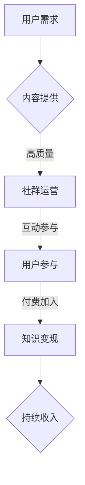

                 

关键词：付费社群，知识变现，模式，策略，案例分析，技术知识，用户参与，社群运营

> 摘要：本文将探讨如何利用付费社群模式实现知识变现，分析成功案例，提供策略和步骤，帮助个人和组织在技术知识领域进行有效的知识变现。

## 1. 背景介绍

随着互联网的普及和社交媒体的兴起，知识传播的途径变得更加多样化和便捷。然而，传统的内容分发模式如免费讲座、在线课程等已经逐渐显露出其局限性。知识的生产和消费之间的矛盾日益凸显，如何更有效地将知识转化为价值，成为了诸多知识创作者和机构关注的焦点。

付费社群作为一种新型的知识传播模式，正逐渐成为知识变现的重要途径。付费社群通过提供高质量的内容、互动和专属服务，吸引有特定需求的用户付费加入，从而实现知识变现。本文将结合具体案例，深入探讨如何利用付费社群模式实现知识变现。

### 1.1 付费社群的定义与特点

**定义：** 付费社群是一种基于付费模式的在线社群，它通过提供有价值的内容、服务和互动体验，吸引用户付费加入，实现知识变现。

**特点：**

- **高质量内容：** 付费社群的内容通常经过精心设计和准备，具有较高的知识含量和实用性。
- **互动性强：** 付费社群鼓励用户之间的交流和互动，增强社群的凝聚力和归属感。
- **专属服务：** 付费社群通常提供专属的服务，如一对一咨询、专家讲座等，满足用户的个性化需求。
- **可持续性：** 付费社群模式可以形成一种稳定的收入来源，为知识创作者和机构提供持续的发展动力。

### 1.2 知识变现的重要性

**知识变现** 指的是将知识和技能转化为可以直接带来经济利益的过程。在技术领域，知识变现尤为重要。一方面，技术知识具有较高的价值和稀缺性，能够为创作者带来显著的收益。另一方面，知识变现有助于推动技术的传播和应用，促进技术进步和产业发展。

### 1.3 付费社群模式的优势

- **提高用户粘性：** 付费社群通过提供高质量的内容和服务，增强用户粘性，提高用户留存率。
- **降低获取成本：** 付费社群模式降低了知识获取的门槛，使得更多用户能够接触和消费高质量知识。
- **增强用户参与度：** 付费社群鼓励用户互动和参与，促进知识的深度交流和传播。
- **实现持续收入：** 付费社群模式可以形成一种稳定的收入来源，为创作者和机构提供持续的经济支持。

## 2. 核心概念与联系

在探讨如何利用付费社群模式进行知识变现之前，我们需要明确几个核心概念，并理解它们之间的联系。

### 2.1 社群运营

**社群运营** 是指通过一系列策略和活动，吸引用户加入社群、提高用户活跃度、增强用户粘性，从而实现社群价值的过程。社群运营的核心目标是为用户提供有价值的内容和服务，满足他们的需求，并建立长期的信任关系。

### 2.2 知识管理

**知识管理** 是指对知识进行有效的收集、组织、存储、传播和应用，以提高组织或个人的知识水平和创新能力。知识管理的关键在于确保知识的有效利用，并将其转化为实际的效益。

### 2.3 用户参与

**用户参与** 是指用户在社群中积极参与互动、分享经验和知识，并为社群的发展提供贡献。用户参与是付费社群成功的重要保障，它有助于增强社群的活力和凝聚力，提高用户满意度和忠诚度。

### 2.4 付费模式

**付费模式** 是指通过提供有价值的内容和服务，吸引用户付费加入社群，从而实现知识变现的过程。付费模式的核心在于提供高质量的内容和服务，满足用户的个性化需求，并建立合理的价格体系。

### 2.5 Mermaid 流程图

以下是一个用于描述付费社群模式核心概念和流程的 Mermaid 流程图：



## 3. 核心算法原理 & 具体操作步骤

### 3.1 算法原理概述

付费社群模式的核心算法原理可以概括为以下几个步骤：

1. **需求识别**：通过市场调研和数据分析，识别用户的需求和痛点。
2. **内容准备**：根据用户需求，准备高质量的内容和服务。
3. **社群运营**：通过一系列运营策略和活动，吸引用户加入社群。
4. **用户互动**：鼓励用户参与互动，增强社群的活力和凝聚力。
5. **付费机制**：建立合理的付费机制，吸引用户付费加入社群。
6. **持续优化**：根据用户反馈和数据分析，持续优化内容和运营策略。

### 3.2 算法步骤详解

1. **需求识别**：
   - **市场调研**：通过问卷调查、访谈、用户反馈等方式，了解用户的需求和偏好。
   - **数据分析**：利用大数据分析技术，挖掘用户的行为数据和需求特征。

2. **内容准备**：
   - **内容策划**：根据用户需求，策划高质量的内容主题和形式。
   - **内容制作**：邀请专业的内容创作者，制作高质量的内容和服务。

3. **社群运营**：
   - **社群定位**：明确社群的目标和定位，确定社群的核心价值。
   - **活动策划**：策划一系列有趣、有价值的活动，吸引用户参与。
   - **用户管理**：建立完善的用户管理体系，包括用户分类、标签管理等。

4. **用户互动**：
   - **互动机制**：设计多样化的互动机制，如问答、讨论、直播等，鼓励用户参与。
   - **社群文化**：培育积极的社群文化，增强用户的归属感和参与度。

5. **付费机制**：
   - **价格策略**：制定合理的价格策略，满足用户的消费能力。
   - **支付方式**：提供多样化的支付方式，方便用户付费加入。

6. **持续优化**：
   - **用户反馈**：收集用户的反馈和建议，持续优化内容和运营策略。
   - **数据分析**：利用数据分析技术，分析用户行为和反馈，指导优化方向。

### 3.3 算法优缺点

**优点：**

- **提高用户粘性**：通过高质量的内容和服务，提高用户在社群中的粘性。
- **增强用户参与度**：鼓励用户互动和参与，增强社群的活力和凝聚力。
- **实现知识变现**：通过付费机制，实现知识的变现，为创作者和机构带来经济收益。
- **持续收入来源**：付费社群模式可以形成一种稳定的收入来源，为创作者和机构提供持续的经济支持。

**缺点：**

- **初期投入较大**：建立付费社群需要较高的初期投入，包括内容制作、社群运营等。
- **用户留存难度**：付费社群需要持续提供高质量的内容和服务，以保持用户的留存。
- **市场风险**：付费社群模式受到市场环境和用户需求变化的影响，存在一定的市场风险。

### 3.4 算法应用领域

付费社群模式在多个领域都有广泛的应用，如：

- **技术领域**：技术专家可以建立付费社群，提供专业知识和经验分享，实现知识变现。
- **教育领域**：教育培训机构可以通过付费社群，提供高质量的课程和服务，实现教育资源的优化配置。
- **行业交流**：行业专家和组织可以建立付费社群，促进行业内的知识交流和合作。
- **兴趣爱好**：针对特定兴趣爱好，可以建立付费社群，提供专业知识和交流平台。

## 4. 数学模型和公式 & 详细讲解 & 举例说明

### 4.1 数学模型构建

在付费社群模式中，数学模型可以帮助我们分析用户参与度和付费意愿，从而优化社群运营策略。以下是一个简单的数学模型：

假设：

- \(U\)：用户数量
- \(P\)：付费用户数量
- \(C\)：用户付费意愿系数
- \(R\)：用户留存率

数学模型：

\[P = C \times U \times R\]

其中：

- \(C\)：用户付费意愿系数，反映了用户对社群内容的价值认可程度。
- \(R\)：用户留存率，反映了用户在社群中的持续参与度。

### 4.2 公式推导过程

我们首先分析用户付费意愿系数 \(C\)：

\[C = \frac{V}{P}\]

其中：

- \(V\)：用户对社群内容的价值感知
- \(P\)：用户对社群内容的支付价格

价值感知 \(V\) 可以通过以下公式计算：

\[V = \frac{S}{T}\]

其中：

- \(S\)：用户从社群中获得的收益
- \(T\)：用户在社群中付出的成本

收益 \(S\) 可以通过以下公式计算：

\[S = \frac{K \times L}{N}\]

其中：

- \(K\)：用户在社群中学习到的知识量
- \(L\)：用户在社群中的学习效率
- \(N\)：用户在社群中的学习时间

成本 \(T\) 包括时间成本和金钱成本，我们可以假设：

\[T = C_1 \times T_1 + C_2 \times T_2\]

其中：

- \(C_1\)：时间成本系数
- \(T_1\)：用户在社群中花费的时间
- \(C_2\)：金钱成本系数
- \(T_2\)：用户在社群中花费的金钱

将 \(V\) 和 \(T\) 代入 \(C\) 的公式，得到：

\[C = \frac{K \times L}{C_1 \times T_1 + C_2 \times T_2}\]

接下来，我们分析用户留存率 \(R\)：

\[R = \frac{U_r}{U}\]

其中：

- \(U_r\)：社群中持续参与的用户数量
- \(U\)：社群中的总用户数量

用户留存率 \(R\) 受多种因素影响，如内容质量、互动机制、社群文化等。我们可以通过以下公式计算：

\[R = f(Q, I, C)\]

其中：

- \(Q\)：内容质量
- \(I\)：互动机制
- \(C\)：社群文化

结合 \(C\) 和 \(R\)，我们可以得到用户付费用户数量 \(P\) 的计算公式：

\[P = \frac{K \times L}{C_1 \times T_1 + C_2 \times T_2} \times \frac{U_r}{U} \times R\]

### 4.3 案例分析与讲解

我们以一个实际的付费社群案例进行说明。假设一个技术专家建立了付费社群，提供技术知识和经验分享。以下是一个简化的案例：

**用户需求分析**：通过问卷调查，发现用户主要关注以下几个方面的技术知识：前端开发、后端开发、人工智能、云计算等。

**内容准备**：技术专家邀请行业专家和资深开发者，制作高质量的技术课程和文档。

**社群运营**：通过定期举办线上研讨会、问答环节、技术沙龙等活动，吸引用户参与。

**用户互动**：建立问答区、讨论区、直播区等互动机制，鼓励用户提问和交流。

**付费机制**：设置月度会员、年度会员等付费模式，提供专属服务和折扣优惠。

**用户留存**：通过持续更新高质量内容、优化互动机制、定期举办活动等方式，提高用户留存率。

**数据分析**：通过用户行为数据分析，发现用户在参与互动、学习技术课程等方面的积极性较高，付费意愿也较强。

**公式计算**：

- \(K\)：用户在社群中学习到的知识量，假设为100小时
- \(L\)：用户在社群中的学习效率，假设为1小时/天
- \(T_1\)：用户在社群中花费的时间，假设为50天
- \(T_2\)：用户在社群中花费的金钱，假设为500元
- \(C_1\)：时间成本系数，假设为10元/小时
- \(C_2\)：金钱成本系数，假设为10元/元
- \(U_r\)：社群中持续参与的用户数量，假设为100人
- \(U\)：社群中的总用户数量，假设为200人

根据公式，我们可以计算：

- \(C\)：用户付费意愿系数 \(C = \frac{100 \times 1}{10 \times 50 + 10 \times 500} = 0.2\)
- \(R\)：用户留存率 \(R = \frac{100}{200} = 0.5\)
- \(P\)：用户付费用户数量 \(P = 0.2 \times 200 \times 0.5 = 20\)

这个案例表明，通过优化内容、运营策略和互动机制，可以显著提高用户的付费意愿和留存率，从而实现有效的知识变现。

## 5. 项目实践：代码实例和详细解释说明

### 5.1 开发环境搭建

在这个项目实践中，我们将使用 Python 语言和 Flask 框架搭建一个简单的付费社群网站。以下是一个简单的开发环境搭建步骤：

1. **安装 Python**：确保您的计算机上安装了 Python 3.8 或更高版本。
2. **安装 Flask**：在终端中运行以下命令安装 Flask：

   ```bash
   pip install Flask
   ```

3. **创建项目文件夹**：在您的计算机上创建一个名为 `knowledge_community` 的文件夹，并在该文件夹中创建一个名为 `app.py` 的 Python 文件。

### 5.2 源代码详细实现

以下是一个简单的 Flask 应用的源代码示例，用于搭建一个付费社群网站：

```python
from flask import Flask, render_template, request, redirect, url_for
from flask_sqlalchemy import SQLAlchemy

app = Flask(__name__)
app.config['SQLALCHEMY_DATABASE_URI'] = 'sqlite:///knowledge_community.db'
db = SQLAlchemy(app)

class User(db.Model):
    id = db.Column(db.Integer, primary_key=True)
    username = db.Column(db.String(80), unique=True, nullable=False)
    password = db.Column(db.String(120), nullable=False)
    role = db.Column(db.String(20), nullable=False)

@app.route('/')
def index():
    return render_template('index.html')

@app.route('/register', methods=['GET', 'POST'])
def register():
    if request.method == 'POST':
        username = request.form['username']
        password = request.form['password']
        role = request.form['role']

        new_user = User(username=username, password=password, role=role)
        db.session.add(new_user)
        db.session.commit()

        return redirect(url_for('login'))
    return render_template('register.html')

@app.route('/login', methods=['GET', 'POST'])
def login():
    if request.method == 'POST':
        username = request.form['username']
        password = request.form['password']

        user = User.query.filter_by(username=username, password=password).first()
        if user:
            return redirect(url_for('dashboard'))
        else:
            return '登录失败，请检查用户名和密码'

    return render_template('login.html')

@app.route('/dashboard')
def dashboard():
    return render_template('dashboard.html')

if __name__ == '__main__':
    db.create_all()
    app.run(debug=True)
```

### 5.3 代码解读与分析

在这个 Flask 应用中，我们实现了以下功能：

1. **用户注册**：用户可以通过注册页面提交用户名、密码和角色（如普通用户、管理员等）。
2. **用户登录**：用户可以通过登录页面提交用户名和密码进行登录。
3. **用户仪表盘**：登录后的用户可以访问仪表盘页面，查看和管理自己的账户信息。

代码主要分为以下几个部分：

1. **数据库配置**：我们使用 SQLAlchemy 模块创建了一个 SQLite 数据库，用于存储用户信息。

2. **用户模型**：定义了 `User` 类，用于表示用户表的结构，包括用户 ID、用户名、密码和角色。

3. **路由和视图函数**：我们定义了三个路由和视图函数，分别处理用户注册、用户登录和仪表盘功能。

4. **模板文件**：我们创建了三个 HTML 模板文件，分别对应注册页面、登录页面和仪表盘页面。

### 5.4 运行结果展示

在完成代码编写后，我们可以在终端中运行以下命令启动 Flask 应用：

```bash
python app.py
```

启动应用后，我们可以在浏览器中访问 `http://127.0.0.1:5000/` 查看网站效果。以下是运行结果展示：

1. **首页**：展示了网站的首页，用户可以点击“注册”和“登录”按钮进行操作。

2. **注册页面**：用户可以在此页面提交注册信息。

3. **登录页面**：用户可以在此页面提交登录信息。

4. **仪表盘页面**：登录后的用户可以查看和管理自己的账户信息。

通过这个简单的示例，我们可以了解到如何使用 Flask 框架搭建一个基本的付费社群网站。在实际项目中，我们可以根据需求进一步扩展功能，如添加课程管理、订单管理、用户管理等功能。

## 6. 实际应用场景

### 6.1 技术领域

在技术领域，付费社群模式可以应用于多个场景，如编程学习、数据科学、人工智能等。例如，一个专业的程序员可以创建一个付费社群，提供高质量的编程教程、代码实战和职业发展建议。社群成员可以付费加入，享受专属的教学资源和互动机会。

### 6.2 教育领域

在教育领域，付费社群模式可以帮助教育机构提高教育质量和用户满意度。例如，一个在线教育平台可以创建一个付费社群，提供个性化学习计划、专家答疑和同伴互助。通过付费社群，教育机构可以更好地满足学生的个性化需求，提高学生的学习效果。

### 6.3 行业交流

在行业交流领域，付费社群模式可以促进专业人士之间的知识共享和合作。例如，一个行业组织可以创建一个付费社群，邀请行业专家分享最新研究成果、行业趋势和案例分析。社群成员可以付费加入，参与线上讨论和互动，提高自身行业竞争力。

### 6.4 文化与艺术

在文化与艺术领域，付费社群模式可以应用于艺术创作、文化交流和鉴赏等场景。例如，一个艺术家可以创建一个付费社群，分享自己的创作过程、艺术理念和作品分析。社群成员可以付费加入，享受艺术家的专属内容和互动机会，提高艺术素养。

### 6.5 兴趣爱好

在兴趣爱好领域，付费社群模式可以满足爱好者对专业知识的需求。例如，一个摄影爱好者可以创建一个付费社群，提供摄影教程、作品分析和实战指导。社群成员可以付费加入，学习摄影技巧，分享摄影心得。

### 6.6 未来应用展望

随着互联网技术的不断进步，付费社群模式将在更多领域得到应用。例如，在医疗健康领域，付费社群可以提供专业医生的建议和治疗方案；在金融领域，付费社群可以提供投资策略和市场分析。未来，付费社群模式将成为知识传播和知识变现的重要途径，为个人和组织带来更多的价值。

## 7. 工具和资源推荐

### 7.1 学习资源推荐

- **在线课程平台**：Coursera、Udemy、edX 提供丰富的付费课程资源，涵盖编程、数据科学、人工智能等多个领域。
- **技术博客**：GitHub、Medium、Dev.to 等平台上的技术博客，提供最新的技术资讯和实战经验。
- **专业书籍**：《深度学习》、《数据科学实战》、《编程思维》等经典书籍，适合不同阶段的技术学习者。

### 7.2 开发工具推荐

- **编程环境**：Visual Studio Code、PyCharm、Eclipse 等 IDE，提供强大的编程功能和调试工具。
- **版本控制**：Git，用于代码的版本控制和协作开发。
- **数据库管理**：MySQL、PostgreSQL、MongoDB 等，用于数据存储和管理。

### 7.3 相关论文推荐

- **知识管理**：《知识管理与组织绩效的关系研究》、《基于知识管理的企业创新能力提升研究》。
- **付费社群**：《付费社群模式与用户满意度研究》、《社交媒体上的付费社群：模式与案例分析》。
- **知识变现**：《知识变现：理论与应用》、《基于知识变现的创业创新模式研究》。

## 8. 总结：未来发展趋势与挑战

### 8.1 研究成果总结

本文通过分析付费社群模式的核心概念、算法原理和实际应用场景，总结了付费社群模式在知识变现方面的优势和应用。研究结果表明，付费社群模式通过提供高质量的内容、互动和专属服务，可以有效地提高用户粘性、增强用户参与度和实现知识变现。

### 8.2 未来发展趋势

随着互联网和人工智能技术的不断进步，付费社群模式将在更多领域得到应用。未来，付费社群将向更精细化、个性化和智能化方向发展。例如，通过大数据分析和人工智能技术，可以更好地了解用户需求，提供个性化的内容和服务。

### 8.3 面临的挑战

虽然付费社群模式具有显著的优势，但在实际应用中也面临着一些挑战。首先，内容质量和用户体验是付费社群成功的关键，如何保证内容的高质量和用户体验的满意度是一个重要课题。其次，市场竞争激烈，如何区分竞争，提供独特的价值，也是一个挑战。此外，如何确保用户隐私和数据安全，也是付费社群需要关注的问题。

### 8.4 研究展望

未来，研究可以从以下几个方面展开：

- **个性化推荐**：结合用户行为数据和人工智能技术，提供个性化的内容推荐。
- **社区治理**：研究如何建立有效的社区治理机制，维护社群的秩序和氛围。
- **商业模式创新**：探索新的商业模式，如会员制、订阅制等，提高付费社群的盈利能力。
- **跨领域融合**：研究付费社群在不同领域的应用，如医疗健康、金融投资等，推动知识变现的多元化发展。

## 9. 附录：常见问题与解答

### 9.1 付费社群模式与传统内容分发模式的区别是什么？

**回答：** 付费社群模式与传统内容分发模式的主要区别在于：

- **内容质量**：付费社群模式通常提供高质量、有深度和实用性的内容，而传统内容分发模式可能包含大量免费内容，质量参差不齐。
- **用户参与度**：付费社群模式鼓励用户互动和参与，形成社区氛围，而传统内容分发模式用户参与度相对较低。
- **变现方式**：付费社群模式通过用户付费实现知识变现，而传统内容分发模式主要依靠广告收入。

### 9.2 如何确保付费社群的内容质量？

**回答：** 确保付费社群的内容质量可以从以下几个方面入手：

- **内容审核**：建立内容审核机制，确保发布的内容符合社群定位和用户需求。
- **专家评审**：邀请行业专家和资深从业者参与内容评审，提供专业意见和建议。
- **用户反馈**：收集用户反馈，不断优化和调整内容，提高用户满意度。

### 9.3 付费社群模式如何应对市场竞争？

**回答：** 付费社群模式应对市场竞争可以从以下几个方面入手：

- **差异化定位**：明确社群的定位和特色，提供独特的价值，避免同质化竞争。
- **用户体验**：提供优质的用户体验，包括内容质量、互动机制和服务等，提高用户满意度和忠诚度。
- **营销推广**：通过有效的营销推广策略，提高社群的知名度和用户参与度。

### 9.4 付费社群模式如何保障用户隐私和数据安全？

**回答：** 付费社群模式保障用户隐私和数据安全可以从以下几个方面入手：

- **隐私政策**：明确告知用户隐私政策，获取用户的知情同意。
- **数据加密**：采用数据加密技术，确保用户数据的传输和存储安全。
- **安全审计**：定期进行安全审计，发现和修复潜在的安全漏洞。

### 9.5 付费社群模式如何实现持续收入？

**回答：** 付费社群模式实现持续收入可以从以下几个方面入手：

- **内容持续更新**：定期发布新的高质量内容，保持用户的持续关注。
- **会员制度**：建立会员制度，提供不同级别的会员服务，增加用户的付费意愿。
- **增值服务**：提供增值服务，如一对一咨询、专家讲座等，为用户提供更多价值。

以上是关于如何利用付费社群模式进行知识变现的详细讨论和案例分析。通过本文的探讨，我们希望读者能够更好地理解付费社群模式的优势和应用，并在实际操作中取得成功。

