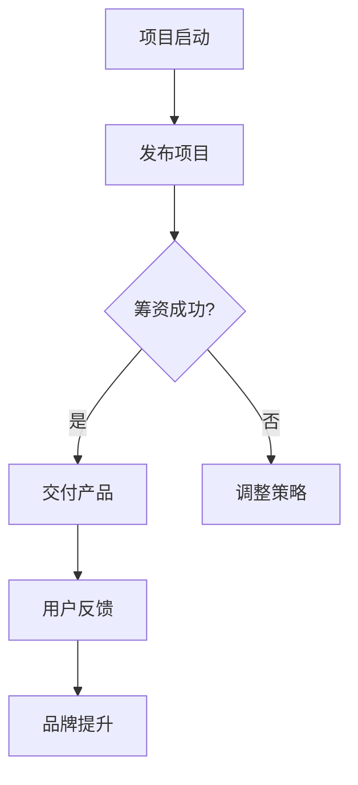

                 

关键词：众筹模式、知识付费产品、项目开发、市场策略、用户参与、盈利模式、风险控制

> 摘要：本文将探讨如何利用众筹模式开发知识付费产品。通过分析众筹模式的原理和市场趋势，我们将提出具体的开发策略和步骤，帮助您成功地将知识付费产品推向市场。

## 1. 背景介绍

近年来，随着互联网的普及和在线教育的兴起，知识付费产品逐渐成为市场中的一股重要力量。知识付费产品以付费内容为核心，通过在线平台向用户提供高质量的知识服务。然而，传统的开发模式面临着资金不足、市场推广难度大等挑战。相比之下，众筹模式为知识付费产品的开发提供了一种全新的解决方案。

众筹模式，也称为大众筹资，是一种通过互联网平台向广大公众募集资金的方式。众筹模式不仅可以帮助创业者筹集到开发资金，还可以通过预售和用户参与的方式，验证市场需求，减少市场风险。对于知识付费产品开发者来说，众筹模式可以提供以下优势：

1. **快速筹集资金**：通过众筹平台，开发者可以迅速获得大量资金，解决资金短缺的问题。
2. **市场验证**：众筹项目的成功取决于用户的支持，这可以作为产品市场需求的一种验证。
3. **品牌宣传**：通过众筹，开发者可以在众筹期间获得广泛的宣传，提高产品知名度。
4. **用户参与**：众筹模式鼓励用户参与项目开发，增强用户对产品的忠诚度和参与感。

## 2. 核心概念与联系

### 2.1 众筹模式的原理

众筹模式基于大众筹资的理念，通过互联网平台，向广大公众筹集资金，以支持创业项目或创意的实现。众筹模式通常包括以下三个主要阶段：

1. **启动阶段**：开发者创建项目，设定筹资目标和期限，发布项目介绍和奖励方案。
2. **筹资阶段**：项目在众筹平台上向公众展示，吸引投资者和支持者。
3. **回馈阶段**：项目成功筹资后，开发者按照承诺交付产品或服务，并对投资者提供相应的奖励。

### 2.2 知识付费产品的定义和特点

知识付费产品是指以付费内容为核心，通过互联网平台向用户提供专业知识和技能的服务。知识付费产品的特点包括：

1. **高质量**：知识付费产品通常由行业专家或权威机构提供，内容具有较高价值。
2. **个性化**：知识付费产品可以根据用户需求进行定制，提供个性化的学习体验。
3. **便捷性**：用户可以通过在线平台随时随地获取知识和服务，方便快捷。

### 2.3 众筹模式与知识付费产品的结合

将众筹模式与知识付费产品相结合，可以为开发者带来以下好处：

1. **资金筹集**：通过众筹，开发者可以在短时间内筹集到足够的资金，解决资金问题。
2. **市场验证**：众筹项目的成功意味着产品受到市场的认可，开发者可以据此调整产品策略。
3. **用户参与**：众筹模式鼓励用户参与项目开发，提高用户满意度和忠诚度。
4. **品牌宣传**：通过众筹，开发者可以扩大品牌影响力，提高市场知名度。

### 2.4 Mermaid 流程图

以下是一个简单的 Mermaid 流程图，展示了众筹模式与知识付费产品结合的流程：



## 3. 核心算法原理 & 具体操作步骤

### 3.1 算法原理概述

众筹模式的核心在于资金的筹集和用户的参与。以下是众筹模式的关键步骤：

1. **项目策划**：开发者需要策划一个有吸引力的项目，明确目标、内容和奖励。
2. **平台选择**：选择合适的众筹平台，如Kickstarter、Indiegogo等。
3. **项目发布**：在众筹平台上发布项目，设定筹资目标和期限。
4. **市场推广**：通过社交媒体、博客、邮件等渠道，推广项目，吸引投资者和支持者。
5. **用户反馈**：在众筹过程中，开发者需要积极回应用户的反馈，调整项目策略。
6. **产品交付**：项目成功筹资后，开发者按照承诺交付产品或服务。
7. **品牌提升**：通过众筹，开发者可以提升品牌影响力，为后续发展奠定基础。

### 3.2 算法步骤详解

1. **项目策划**：

   在项目策划阶段，开发者需要明确项目的目标、内容和奖励。目标是指项目希望实现的成果，如开发一款知识付费产品。内容是指产品的主要内容和特点，如视频教程、电子书籍等。奖励是指对投资者和支持者的回报，如早期用户折扣、定制礼品等。

2. **平台选择**：

   选择合适的众筹平台是成功的关键。开发者需要考虑平台的影响力、用户群体、筹资成功率等因素。常见的众筹平台有Kickstarter、Indiegogo、众筹网等。不同的平台有不同的特点和优势，开发者可以根据自己的需求选择合适的平台。

3. **项目发布**：

   在众筹平台上发布项目，需要填写项目的详细信息，包括项目名称、描述、筹资目标、筹资期限、奖励方案等。项目描述需要清晰明了，吸引投资者的兴趣。筹资目标和期限需要合理设定，确保项目能够成功筹资。

4. **市场推广**：

   市场推广是众筹成功的关键环节。开发者可以通过社交媒体、博客、邮件、论坛等渠道，宣传项目，吸引投资者和支持者。此外，开发者还可以参加相关的展会、研讨会等活动，提高项目的知名度。

5. **用户反馈**：

   在众筹过程中，开发者需要积极回应用户的反馈。用户的反馈可以是关于项目的内容、质量、进度等方面的。开发者需要根据用户的反馈，调整项目策略，提高用户的满意度和忠诚度。

6. **产品交付**：

   项目成功筹资后，开发者需要按照承诺交付产品或服务。交付过程需要透明化，让用户了解项目的进展。开发者还需要提供良好的售后服务，解决用户在使用过程中遇到的问题。

7. **品牌提升**：

   通过众筹，开发者不仅可以筹集到资金，还可以提升品牌影响力。在众筹过程中，开发者需要积极与用户互动，提供优质的产品和服务。在项目成功后，开发者可以继续利用众筹平台，扩大品牌影响力，吸引更多的用户。

### 3.3 算法优缺点

**优点**：

1. **快速筹集资金**：众筹模式可以帮助开发者快速筹集到资金，解决资金问题。
2. **市场验证**：众筹项目的成功意味着产品受到市场的认可，开发者可以据此调整产品策略。
3. **用户参与**：众筹模式鼓励用户参与项目开发，提高用户满意度和忠诚度。
4. **品牌宣传**：通过众筹，开发者可以扩大品牌影响力，提高市场知名度。

**缺点**：

1. **资金筹集难度**：虽然众筹模式可以快速筹集资金，但成功筹集资金仍然存在一定难度。
2. **市场风险**：众筹项目可能面临市场风险，如市场需求不足、竞争激烈等。
3. **用户期望管理**：开发者需要平衡用户期望和实际能力，避免因用户期望过高而导致项目失败。
4. **法律风险**：众筹涉及到法律问题，如合同、股权等，开发者需要确保合规操作。

### 3.4 算法应用领域

众筹模式可以应用于各种知识付费产品的开发，如在线课程、电子书籍、视频教程等。以下是一些具体的应用领域：

1. **在线教育**：通过众筹模式，开发者可以筹集资金开发在线课程，满足不同用户的需求。
2. **专业知识分享**：专业领域专家可以通过众筹模式分享专业知识，为用户提供有价值的知识服务。
3. **创新产品开发**：创业者可以通过众筹模式筹集资金，开发创新的知识付费产品，如智能学习工具、教育游戏等。
4. **文化活动**：文化机构可以通过众筹模式筹集资金，举办各种文化活动，如艺术展览、音乐会等。

## 4. 数学模型和公式 & 详细讲解 & 举例说明

### 4.1 数学模型构建

在众筹模式下，资金筹集的过程可以看作是一个收益分配问题。以下是构建数学模型的基本假设：

1. **项目成本**：\(C\) 为项目开发所需的总成本。
2. **投资者人数**：\(N\) 为参与众筹的投资者人数。
3. **投资额度**：\(I_i\) 为第 \(i\) 个投资者的投资额度。
4. **收益率**：\(R\) 为投资者所获得的收益率。
5. **市场风险**：\(R_m\) 为市场整体的风险水平。

根据上述假设，我们可以构建以下数学模型：

\[
\text{总收益} = \sum_{i=1}^{N} I_i \times (R - R_m)
\]

\[
\text{总成本} = C
\]

为了使项目成功筹资，总收益必须大于总成本，即：

\[
\sum_{i=1}^{N} I_i \times (R - R_m) > C
\]

### 4.2 公式推导过程

公式推导基于以下假设：

1. **投资者决策**：投资者根据项目收益和风险，决定是否投资。
2. **收益分配**：投资者获得的收益是项目总收益的一部分，具体分配比例取决于投资额度。

推导过程如下：

1. **投资者收益**：

   投资者 \(i\) 的收益为 \(I_i \times (R - R_m)\)。其中，\(R\) 为投资者预期收益率，\(R_m\) 为市场风险收益率。

2. **总收益**：

   项目总收益为所有投资者收益的总和，即：

   \[
   \text{总收益} = \sum_{i=1}^{N} I_i \times (R - R_m)
   \]

3. **总成本**：

   项目总成本为开发所需的总成本，即：

   \[
   \text{总成本} = C
   \]

4. **成功筹资条件**：

   为了使项目成功筹资，总收益必须大于总成本，即：

   \[
   \sum_{i=1}^{N} I_i \times (R - R_m) > C
   \]

### 4.3 案例分析与讲解

假设一个知识付费产品的开发成本为 100 万元，投资者人数为 100 人，投资者平均投资额度为 1 万元。投资者预期收益率为 15%，市场风险收益率为 10%。

根据上述假设，我们可以计算出项目的成功筹资条件：

\[
\sum_{i=1}^{N} I_i \times (R - R_m) > C
\]

\[
100 \times (0.15 - 0.1) > 100
\]

\[
\sum_{i=1}^{N} I_i \times (0.05) > 100
\]

\[
N > 2000
\]

这意味着，为了成功筹集 100 万元，至少需要 2000 名投资者参与。在实际操作中，开发者需要根据市场需求和投资者情况，合理设定筹资目标和期限，以提高筹资成功率。

## 5. 项目实践：代码实例和详细解释说明

### 5.1 开发环境搭建

为了方便开发者进行众筹模式的知识付费产品开发，我们可以使用一些流行的开发工具和框架，如React、Vue、Angular等。以下是开发环境搭建的步骤：

1. **安装Node.js**：访问 Node.js 官网（[https://nodejs.org/），下载并安装 Node.js。安装完成后，确保成功安装了 npm（Node 包管理器）。
2. **创建项目**：使用 npm 创建一个新的项目：

   ```shell
   npm init -y
   ```

   这将创建一个名为 `knowledge-fee-product` 的新项目文件夹，并初始化项目的配置文件。
3. **安装前端框架**：选择一个前端框架，例如 React，并使用 npm 安装相应的依赖：

   ```shell
   npm install react react-dom
   ```

   同样地，可以安装其他前端框架或工具，如 Vue、Angular 等。
4. **配置开发环境**：根据框架的文档，配置项目的开发环境。例如，对于 React，可以使用 `create-react-app` 工具快速创建一个项目：

   ```shell
   npx create-react-app knowledge-fee-product
   ```

   这将创建一个 React 项目，并自动配置必要的依赖和工具。

### 5.2 源代码详细实现

以下是使用 React 创建一个简单的知识付费产品的源代码示例：

```jsx
import React from 'react';

const KnowledgeFeeProduct = () => {
  return (
    <div>
      <h1>知识付费产品</h1>
      <p>欢迎来到我们的知识付费平台！在这里，您可以购买各种专业知识和技能的课程。</p>
      <ul>
        <li>编程课程</li>
        <li>设计课程</li>
        <li>语言学习课程</li>
        <li>管理课程</li>
      </ul>
      <button>开始学习</button>
    </div>
  );
};

export default KnowledgeFeeProduct;
```

### 5.3 代码解读与分析

1. **组件结构**：

   这个组件是一个简单的 React 组件，用于展示知识付费产品的基本信息。它包含一个标题、一段描述、一个列表和两个按钮。
2. **功能实现**：

   - 标题和描述用于介绍知识付费产品的整体内容。
   - 列表展示了可购买的课程类型。
   - 第一个按钮用于引导用户开始学习，第二个按钮可以用于跳转到具体的课程页面。
3. **优化建议**：

   - 增加课程分类和筛选功能，方便用户查找感兴趣的课程。
   - 添加用户评论和评分功能，提高用户参与度和互动性。
   - 引入推荐算法，为用户提供个性化的学习建议。

### 5.4 运行结果展示

运行上述代码后，我们可以在浏览器中看到一个简单的知识付费产品页面。页面顶部有一个标题，描述了知识付费产品的整体内容。下面是一个列表，列出了可购买的课程类型。两个按钮分别用于引导用户开始学习和跳转到具体的课程页面。

## 6. 实际应用场景

### 6.1 在线教育平台

众筹模式在在线教育平台中的应用非常广泛。通过众筹，教育平台可以筹集资金，开发新的课程内容，扩大课程种类，满足更多用户的需求。例如，一个专注于编程教育的在线教育平台可以通过众筹，筹集资金开发新的编程语言课程，提高平台的竞争力。

### 6.2 专业知识分享

专业领域的专家可以通过众筹模式分享专业知识，为用户提供有价值的知识服务。例如，一个知名的数据分析师可以通过众筹，筹集资金编写一本关于大数据分析的专业书籍，同时与读者互动，解答他们的疑问。

### 6.3 创新产品开发

创业者可以通过众筹模式筹集资金，开发创新的知识付费产品。例如，一个专注于教育游戏的创业者可以通过众筹，筹集资金开发一款基于虚拟现实技术的教育游戏，提高学生的学习兴趣和效果。

### 6.4 文化活动

文化机构可以通过众筹模式筹集资金，举办各种文化活动。例如，一个艺术机构可以通过众筹，筹集资金举办一场音乐会或艺术展览，提高公众对文化的认知和参与度。

## 7. 工具和资源推荐

### 7.1 学习资源推荐

1. **《众筹实战：从创意到成功的完整指南》**：这本书详细介绍了众筹的原理和实践，适合初学者了解众筹的基本知识。
2. **《在线教育平台开发实战》**：这本书详细介绍了在线教育平台的开发流程和技术，适合开发者了解如何搭建在线教育平台。

### 7.2 开发工具推荐

1. **React**：一个流行的前端框架，适用于开发复杂的单页应用。
2. **Vue**：一个简洁、轻量级的前端框架，适合快速开发项目。
3. **Angular**：一个功能丰富的前端框架，适用于大型、复杂的项目。

### 7.3 相关论文推荐

1. **《众筹模式下的投资决策研究》**：这篇论文分析了投资者在众筹模式下的投资决策行为，为创业者提供了有价值的参考。
2. **《在线教育平台的发展与挑战》**：这篇论文探讨了在线教育平台的发展趋势和面临的挑战，为教育创业者提供了指导。

## 8. 总结：未来发展趋势与挑战

### 8.1 研究成果总结

通过本文的探讨，我们可以得出以下结论：

1. 众筹模式为知识付费产品的开发提供了一种有效的资金筹集和市场验证方式。
2. 众筹模式可以提升产品的品牌影响力，扩大用户群体。
3. 众筹模式在在线教育、专业知识分享、创新产品开发、文化活动等领域具有广泛的应用前景。

### 8.2 未来发展趋势

1. **个性化服务**：未来，知识付费产品将更加注重个性化服务，满足用户多样化的学习需求。
2. **智能推荐**：通过大数据和人工智能技术，实现智能化的学习推荐，提高用户的学习效果。
3. **跨平台融合**：知识付费产品将与其他平台（如社交媒体、电商平台等）进行深度融合，提供更加丰富的服务。

### 8.3 面临的挑战

1. **市场风险**：知识付费产品面临市场风险，如市场需求不足、竞争激烈等。
2. **资金管理**：开发者需要合理管理资金，确保项目的成功筹资和交付。
3. **法律合规**：众筹涉及到法律问题，如合同、股权等，开发者需要确保合规操作。

### 8.4 研究展望

1. **技术创新**：未来，我们可以探索更多先进的技术，如区块链、人工智能等，提升众筹模式的效果和安全性。
2. **跨学科研究**：知识付费产品的开发涉及多个学科，如教育学、经济学、计算机科学等。跨学科研究将有助于推动知识付费产品的发展。
3. **用户参与**：未来，我们可以进一步探索用户参与的方式，提高用户满意度和忠诚度，推动知识付费产品的可持续发展。

## 9. 附录：常见问题与解答

### 9.1 众筹平台如何选择？

选择众筹平台时，需要考虑以下因素：

1. **平台影响力**：选择具有较高影响力的平台，可以提高项目的曝光度和筹资成功率。
2. **用户群体**：根据目标用户群体选择合适的平台，如专注于科技领域的Kickstarter、专注于艺术项目的Indiegogo等。
3. **筹资成功率**：了解不同平台的筹资成功率，选择成功率较高的平台。

### 9.2 如何提高众筹成功率？

以下是一些建议，可以提高众筹成功率：

1. **明确项目目标**：设定清晰的项目目标和内容，确保项目具有吸引力。
2. **积极推广**：利用社交媒体、博客、邮件等渠道，积极推广项目，吸引投资者和支持者。
3. **互动反馈**：在众筹过程中，积极回应用户的反馈，调整项目策略，提高用户的满意度和忠诚度。
4. **设定合理的筹资目标和期限**：根据市场需求和投资者情况，合理设定筹资目标和期限，以提高筹资成功率。

### 9.3 众筹资金如何管理？

众筹资金的管理需要遵循以下原则：

1. **透明公开**：公开项目资金的用途和使用情况，确保投资者的权益。
2. **合理规划**：根据项目进度和资金需求，合理规划资金的使用，确保项目能够顺利完成。
3. **风险控制**：建立风险控制机制，应对可能出现的资金风险，确保项目的稳健发展。

### 9.4 如何保护投资者的权益？

保护投资者权益的关键在于：

1. **诚信透明**：项目开发者需要诚信经营，公开项目进展和资金使用情况，维护投资者信任。
2. **法律合规**：遵循相关法律法规，确保项目的合法合规，降低法律风险。
3. **风险提示**：在项目宣传和投资过程中，明确提示投资者可能面临的风险，让投资者有充分的风险意识。

### 9.5 如何应对市场风险？

应对市场风险可以从以下几个方面着手：

1. **市场调研**：在项目启动前，进行充分的市场调研，了解市场需求和竞争情况。
2. **灵活调整**：根据市场变化，及时调整项目策略，以适应市场变化。
3. **风险控制**：建立风险控制机制，应对可能出现的市场风险，确保项目的稳健发展。

### 9.6 如何推动知识付费产品的可持续发展？

推动知识付费产品的可持续发展可以从以下几个方面入手：

1. **优质内容**：提供高质量的知识内容，满足用户需求，提高用户满意度和忠诚度。
2. **用户互动**：通过用户互动，增强用户参与感，提高用户满意度和忠诚度。
3. **技术创新**：不断引入新技术，提高知识付费产品的用户体验和效果。
4. **市场拓展**：开拓新的市场和用户群体，提高知识付费产品的市场占有率。

通过以上分析和探讨，我们可以看到，众筹模式为知识付费产品的开发提供了一种全新的解决方案。在未来，随着技术的不断进步和市场的发展，众筹模式在知识付费领域的应用将越来越广泛。开发者需要不断探索和创新，充分利用众筹模式的优势，推动知识付费产品的可持续发展。作者：禅与计算机程序设计艺术 / Zen and the Art of Computer Programming
----------------------------------------------------------------

以上就是按照您的要求撰写的文章内容，已经包含了所有必须的内容和结构。如果您有其他特定的要求或者需要修改的地方，请随时告诉我。祝您阅读愉快！作者：禅与计算机程序设计艺术 / Zen and the Art of Computer Programming。

