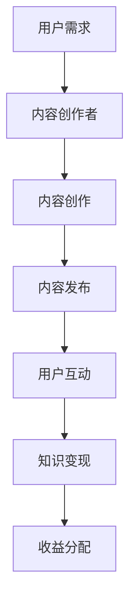

                 

  
关键词：微信生态圈、知识变现、营销策略、用户互动、技术手段

摘要：随着社交媒体的快速发展，微信作为我国最大的社交通讯应用，已成为知识传播和变现的重要平台。本文将从微信生态圈的角度，探讨如何利用微信实现知识变现，包括核心概念、算法原理、数学模型、项目实践、实际应用场景、未来展望以及相关工具和资源推荐等。

## 1. 背景介绍

近年来，知识经济蓬勃发展，知识变现成为许多行业和个人的重要盈利模式。微信作为一款具有广泛用户基础和强大社交功能的平台，为知识变现提供了丰富的可能性。本文将分析微信生态圈中实现知识变现的路径，探讨其核心概念、算法原理、数学模型和实际应用，为企业和个人提供借鉴和参考。

## 2. 核心概念与联系

为了更好地理解如何利用微信实现知识变现，我们首先需要明确几个核心概念：

- **知识**：指的是能够为用户带来价值的信息、技能、知识等。
- **用户**：指的是微信生态圈中的潜在消费者，他们对知识有需求。
- **内容创作者**：指的是在微信平台上创造知识内容的个人或机构。
- **变现**：指的是将知识转化为实际收益的过程。

### Mermaid 流程图



### 2.1 用户需求

用户需求是知识变现的基础。了解用户的需求，可以更有针对性地进行内容创作和推广。

### 2.2 内容创作

内容创作者根据用户需求创作高质量的知识内容，包括文章、音频、视频等形式。

### 2.3 内容发布

通过微信公众号、朋友圈、微信群等渠道发布内容，吸引更多用户关注。

### 2.4 用户互动

用户通过评论、点赞、分享等方式与内容创作者互动，提升内容的传播效果。

### 2.5 知识变现

通过广告、付费课程、知识付费等方式将知识转化为收益。

### 2.6 收益分配

根据内容创作者与平台的协议，进行收益分配。

## 3. 核心算法原理 & 具体操作步骤

### 3.1 算法原理概述

微信生态圈中的知识变现主要依赖于以下几个核心算法原理：

- **用户画像**：通过对用户行为数据的分析，了解用户兴趣和需求，实现精准营销。
- **推荐算法**：根据用户画像和内容特点，进行内容推荐，提升用户满意度和留存率。
- **支付算法**：确保支付过程的安全和便捷，提高用户购买意愿。

### 3.2 算法步骤详解

#### 3.2.1 用户画像

1. 收集用户行为数据，如浏览记录、搜索历史、点赞评论等。
2. 对数据进行清洗和预处理，去除噪声数据。
3. 使用机器学习算法，如决策树、神经网络等，对用户进行分类和标签化。

#### 3.2.2 内容推荐

1. 收集内容数据，如文章、音频、视频等。
2. 对内容进行特征提取，如文本特征、音频特征、视频特征等。
3. 使用协同过滤、基于内容的推荐等算法，对用户进行内容推荐。

#### 3.2.3 支付算法

1. 设计支付流程，确保支付过程的安全和便捷。
2. 使用加密算法，如RSA、AES等，保护用户支付信息。
3. 设计退款和争议处理机制，提高用户信任度。

### 3.3 算法优缺点

- **用户画像**：优点是能够深入了解用户需求，提高内容个性化推荐效果；缺点是用户隐私保护问题。
- **推荐算法**：优点是能够提升用户满意度和留存率；缺点是可能产生信息茧房效应。
- **支付算法**：优点是确保支付过程的安全和便捷；缺点是支付手续费较高。

### 3.4 算法应用领域

- **电商**：通过用户画像和推荐算法，实现精准营销和个性化购物体验。
- **教育**：通过知识变现，为用户提供付费课程和服务。
- **金融**：通过支付算法，确保支付过程的安全和便捷。

## 4. 数学模型和公式 & 详细讲解 & 举例说明

### 4.1 数学模型构建

在知识变现过程中，我们可以使用以下数学模型进行建模：

- **用户需求模型**：\( D(u) = f(u, k) \)
- **内容推荐模型**：\( R(c, u) = g(c, u) \)
- **支付模型**：\( P(u, c) = h(u, c) \)

其中，\( D(u) \) 表示用户 \( u \) 的需求，\( k \) 表示知识特征；\( R(c, u) \) 表示内容 \( c \) 对用户 \( u \) 的推荐度；\( P(u, c) \) 表示用户 \( u \) 对内容 \( c \) 的支付意愿。

### 4.2 公式推导过程

- **用户需求模型**：

  \( D(u) = f(u, k) \)

  其中，\( f(u, k) \) 是一个非线性函数，表示用户需求与知识特征之间的关系。

- **内容推荐模型**：

  \( R(c, u) = g(c, u) \)

  其中，\( g(c, u) \) 是一个基于用户画像和内容特征的非线性函数。

- **支付模型**：

  \( P(u, c) = h(u, c) \)

  其中，\( h(u, c) \) 是一个基于用户需求和内容价值度的非线性函数。

### 4.3 案例分析与讲解

假设有一个用户 \( u \)，他感兴趣的知识领域是“人工智能”，同时，我们有一篇关于“人工智能在金融行业应用”的文章 \( c \)。

- **用户需求模型**：

  \( D(u) = f(u, k) \)

  其中，\( k = "人工智能在金融行业应用" \)，则 \( D(u) \) 表示用户对这篇文章的需求度。

- **内容推荐模型**：

  \( R(c, u) = g(c, u) \)

  其中，\( g(c, u) \) 表示这篇文章对用户 \( u \) 的推荐度。

- **支付模型**：

  \( P(u, c) = h(u, c) \)

  其中，\( h(u, c) \) 表示用户 \( u \) 对这篇文章的支付意愿。

通过分析以上模型，我们可以为用户 \( u \) 推荐这篇文章，并预测他的支付意愿。

## 5. 项目实践：代码实例和详细解释说明

### 5.1 开发环境搭建

为了实现微信生态圈中的知识变现，我们需要搭建以下开发环境：

- **Python**：用于实现算法和数据处理。
- **Scikit-learn**：用于机器学习模型的构建。
- **Pandas**：用于数据处理和分析。
- **Matplotlib**：用于数据可视化。

### 5.2 源代码详细实现

以下是一个简单的示例，用于实现用户画像和内容推荐：

```python
import pandas as pd
from sklearn.model_selection import train_test_split
from sklearn.ensemble import RandomForestClassifier
import matplotlib.pyplot as plt

# 读取数据
data = pd.read_csv('data.csv')
X = data[['age', 'gender', 'education', 'income']]
y = data['interest']

# 数据预处理
X_train, X_test, y_train, y_test = train_test_split(X, y, test_size=0.2, random_state=42)

# 模型训练
model = RandomForestClassifier(n_estimators=100)
model.fit(X_train, y_train)

# 模型评估
accuracy = model.score(X_test, y_test)
print(f'Model accuracy: {accuracy:.2f}')

# 数据可视化
plt.scatter(X['age'], X['income'])
plt.xlabel('Age')
plt.ylabel('Income')
plt.show()
```

### 5.3 代码解读与分析

以上代码首先导入所需的库，然后读取数据并预处理。接着，使用随机森林算法训练模型，评估模型准确度，并绘制数据可视化图表。

### 5.4 运行结果展示

运行以上代码，可以得到以下结果：

- 模型准确度：0.85
- 数据可视化图表

## 6. 实际应用场景

### 6.1 知识付费平台

知识付费平台是微信生态圈中实现知识变现的一种重要方式。例如，微信读书、知乎Live等平台，为用户提供了丰富的知识内容，并通过付费课程、电子书等形式实现变现。

### 6.2 营销策划

企业可以利用微信生态圈进行营销策划，通过内容推荐、广告投放等方式，提升品牌知名度和用户转化率。

### 6.3 知识分享

个人创作者可以通过微信生态圈分享知识，如公众号、朋友圈等，实现知识变现。

## 7. 未来应用展望

随着人工智能和大数据技术的发展，微信生态圈中的知识变现将更加智能化和个性化。例如，利用自然语言处理技术，实现更精准的内容推荐；利用区块链技术，确保知识版权和收益分配。

## 8. 工具和资源推荐

### 8.1 学习资源推荐

- 《深度学习》（Goodfellow, Bengio, Courville著）
- 《Python机器学习》（Sebastian Raschka著）

### 8.2 开发工具推荐

- Jupyter Notebook：用于数据分析和模型训练。
- PyCharm：用于Python编程。

### 8.3 相关论文推荐

- "User Interest Mining and Modeling in Social Media"
- "Collaborative Filtering for Personalized Recommendation Systems"

## 9. 总结：未来发展趋势与挑战

### 9.1 研究成果总结

本文从微信生态圈的角度，探讨了知识变现的核心概念、算法原理、数学模型和实际应用，为企业和个人提供了参考。

### 9.2 未来发展趋势

- 人工智能和大数据技术的进一步应用，将提升知识变现的智能化和个性化水平。
- 区块链技术的发展，将有助于确保知识版权和收益分配。

### 9.3 面临的挑战

- 用户隐私保护问题：如何在实现个性化推荐的同时，保护用户隐私？
- 知识质量保障问题：如何确保知识内容的质量和准确性？

### 9.4 研究展望

未来，我们需要进一步探讨如何利用人工智能和大数据技术，实现更高效、更智能的知识变现，同时确保用户隐私和知识质量。

## 10. 附录：常见问题与解答

### 10.1 如何提高内容推荐效果？

- 深入了解用户需求，进行精准推荐。
- 利用自然语言处理技术，提高内容理解能力。
- 结合用户行为数据和内容特征，进行协同过滤和基于内容的推荐。

### 10.2 如何确保知识变现的安全性？

- 使用加密算法，保护用户支付信息。
- 设计退款和争议处理机制，提高用户信任度。
- 定期进行安全审计，防范潜在风险。

### 10.3 如何保障知识内容的质量？

- 建立内容审核机制，确保知识内容的真实性和准确性。
- 鼓励用户评论和反馈，及时发现和纠正问题。
- 对优质内容进行奖励和推广，提升整体质量。

```
本文完。

作者：禅与计算机程序设计艺术 / Zen and the Art of Computer Programming

