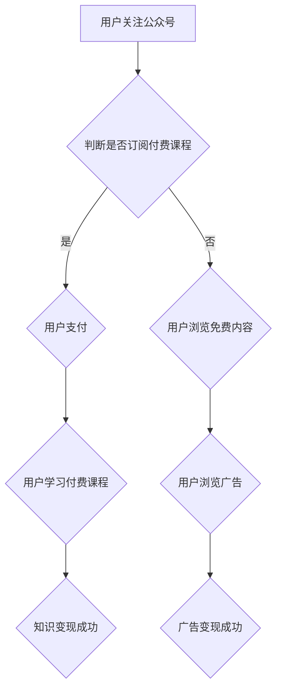

                 

 关键词：微信生态圈、知识变现、微信小程序、内容付费、社群运营

> 摘要：本文将深入探讨如何利用微信生态圈实现知识变现。通过分析微信平台的特点和功能，结合具体案例分析，本文将为您提供一套完整的微信知识变现策略，帮助您在微信平台上成功实现知识变现。

## 1. 背景介绍

随着互联网技术的飞速发展，知识经济的崛起，知识变现已经成为各行各业的重要盈利模式。微信作为中国最大的社交通讯平台，其用户基数庞大、功能丰富，为知识变现提供了广阔的舞台。微信生态圈包括微信公众号、微信小程序、微信群等多个组成部分，为知识变现提供了多种途径。

本文将围绕微信生态圈中的知识变现展开讨论，首先介绍微信生态圈的基本架构和功能，然后探讨微信知识变现的原理，最后通过具体案例和实践经验，为您呈现一套实用的微信知识变现策略。

## 2. 核心概念与联系

### 2.1 微信生态圈架构

在讨论微信知识变现之前，我们先来了解一下微信生态圈的架构。微信生态圈主要由以下几个部分组成：

1. **微信公众号**：作为微信的主要内容平台，微信公众号为知识分享者提供了一个展示自我、传播知识、实现变现的渠道。
2. **微信小程序**：微信小程序是一种无需下载安装即可使用的应用，它为知识变现提供了便捷的途径，用户可以通过小程序直接付费购买知识产品。
3. **微信群**：微信群是微信生态圈中最具社交属性的部分，通过社群运营，可以实现知识付费、广告推广等多种变现方式。

### 2.2 微信生态圈功能

微信生态圈的功能丰富多样，主要包括以下几个方面：

1. **内容发布与传播**：微信公众号可以发布文字、图片、视频等多种类型的内容，实现知识传播。
2. **互动交流**：通过微信群和公众号的评论功能，用户可以与知识分享者进行互动交流，提高知识吸收效果。
3. **内容付费**：用户可以通过购买公众号文章、微信小程序课程等形式，实现知识付费。
4. **广告推广**：通过微信广告、公众号推广等方式，实现知识变现。

### 2.3 Mermaid 流程图

以下是一个简单的Mermaid流程图，展示微信知识变现的基本流程：



## 3. 核心算法原理 & 具体操作步骤

### 3.1 算法原理概述

微信知识变现的核心算法原理主要包括以下几个方面：

1. **内容价值评估**：通过对用户需求的分析，评估内容的价值，确定内容的收费标准和推广策略。
2. **用户行为分析**：通过分析用户在微信平台上的行为数据，了解用户偏好，为内容推荐和精准营销提供依据。
3. **社群运营**：通过微信群和公众号的互动，建立用户社群，提高用户粘性和忠诚度。

### 3.2 算法步骤详解

#### 3.2.1 内容价值评估

1. **用户需求分析**：通过问卷调查、用户访谈等方式，了解用户对知识的需求。
2. **内容质量评估**：结合用户评价、专家评审等指标，评估内容的优劣。
3. **定价策略**：根据内容质量和用户需求，确定内容的收费标准和推广策略。

#### 3.2.2 用户行为分析

1. **数据收集**：通过微信公众号后台、微信小程序后台等，收集用户行为数据。
2. **数据分析**：利用数据挖掘技术，分析用户行为，了解用户偏好。
3. **内容推荐**：根据用户偏好，推荐相关内容，提高用户粘性。

#### 3.2.3 社群运营

1. **建立社群**：通过微信群、公众号等方式，建立用户社群。
2. **互动交流**：定期组织线上活动，提高社群活跃度。
3. **知识变现**：通过社群互动，实现知识付费、广告推广等变现方式。

### 3.3 算法优缺点

**优点**：

1. **覆盖面广**：微信用户基数庞大，为知识变现提供了广泛的用户基础。
2. **功能丰富**：微信生态圈功能多样，为知识变现提供了多种途径。
3. **便捷性**：微信小程序和公众号的便捷操作，提高了用户购买和学习的便利性。

**缺点**：

1. **竞争激烈**：微信平台上的知识分享者众多，竞争激烈。
2. **变现渠道有限**：虽然微信提供了多种变现方式，但具体效果受限于用户习惯和市场需求。

### 3.4 算法应用领域

微信知识变现算法主要应用于以下几个方面：

1. **教育培训**：通过微信公众号和小程序，提供线上课程、知识讲座等，实现知识付费。
2. **内容创作**：通过微信公众号，发布原创文章、视频等，实现广告和内容付费。
3. **社群运营**：通过微信群和公众号，建立用户社群，实现知识付费和广告推广。

## 4. 数学模型和公式 & 详细讲解 & 举例说明

### 4.1 数学模型构建

微信知识变现的数学模型主要包括以下几个部分：

1. **用户价值模型**：根据用户行为数据，构建用户价值模型，评估用户对知识的贡献和价值。
2. **内容价值模型**：根据内容质量和用户需求，构建内容价值模型，评估内容的盈利能力。
3. **变现效果模型**：根据用户价值模型和内容价值模型，构建变现效果模型，预测知识变现的效果。

### 4.2 公式推导过程

**用户价值模型**：

\[ V_u = \alpha \cdot u_1 + \beta \cdot u_2 + \gamma \cdot u_3 \]

其中，\( V_u \) 表示用户价值，\( u_1 \) 表示用户活跃度，\( u_2 \) 表示用户互动率，\( u_3 \) 表示用户购买率，\( \alpha \)、\( \beta \)、\( \gamma \) 分别为权重系数。

**内容价值模型**：

\[ V_c = \delta \cdot c_1 + \epsilon \cdot c_2 + \zeta \cdot c_3 \]

其中，\( V_c \) 表示内容价值，\( c_1 \) 表示内容质量，\( c_2 \) 表示用户需求，\( c_3 \) 表示内容传播效果，\( \delta \)、\( \epsilon \)、\( \zeta \) 分别为权重系数。

**变现效果模型**：

\[ E = f(V_u, V_c) \]

其中，\( E \) 表示变现效果，\( f \) 为映射函数，可以根据实际情况进行设计和优化。

### 4.3 案例分析与讲解

以下是一个微信知识变现的案例分析：

**案例背景**：

某教育培训机构通过微信公众号和小程序，提供线上课程和知识讲座，实现知识变现。

**用户价值模型**：

根据用户活跃度、互动率和购买率，构建用户价值模型：

\[ V_u = 0.4 \cdot u_1 + 0.3 \cdot u_2 + 0.3 \cdot u_3 \]

**内容价值模型**：

根据课程质量、用户需求和传播效果，构建内容价值模型：

\[ V_c = 0.5 \cdot c_1 + 0.3 \cdot c_2 + 0.2 \cdot c_3 \]

**变现效果模型**：

设定变现效果映射函数为线性函数：

\[ E = 0.6 \cdot V_u + 0.4 \cdot V_c \]

**案例计算**：

假设某用户活跃度为10，互动率为20，购买率为30；某课程质量评分为90，用户需求评分为70，传播效果评分为60。根据上述模型，计算用户价值和内容价值：

\[ V_u = 0.4 \cdot 10 + 0.3 \cdot 20 + 0.3 \cdot 30 = 20 \]

\[ V_c = 0.5 \cdot 90 + 0.3 \cdot 70 + 0.2 \cdot 60 = 60 \]

计算变现效果：

\[ E = 0.6 \cdot 20 + 0.4 \cdot 60 = 36 \]

**结论**：

根据计算结果，该用户和课程的变现效果为36。说明该用户和课程具有一定的盈利潜力，可以通过进一步优化内容和运营策略，提高变现效果。

## 5. 项目实践：代码实例和详细解释说明

### 5.1 开发环境搭建

为了更好地展示微信知识变现的实现过程，我们选择Python作为开发语言，结合微信开发者工具和微信公众平台API，搭建一个简单的微信知识变现项目。

1. **安装Python**：确保已安装Python环境。
2. **安装微信开发者工具**：下载并安装微信开发者工具，用于开发微信小程序。
3. **注册微信公众平台**：在微信公众平台注册账号，获取AppID和AppSecret。
4. **配置开发环境**：在Python环境中安装相关库，如requests、wxpy等。

### 5.2 源代码详细实现

以下是一个简单的微信知识变现项目示例，主要包括以下几个部分：

1. **用户注册与登录**：通过微信小程序实现用户注册和登录功能。
2. **内容发布与购买**：通过微信公众号发布内容和课程，用户可以通过小程序购买。
3. **数据统计与分析**：收集用户行为数据，分析用户需求和偏好。

**用户注册与登录**：

```python
from wxpy import Bot

# 初始化微信机器人
bot = Bot()

# 登录微信
bot.login()

# 注册用户
def register_user():
    # 获取用户微信账号
    user_id = input("请输入您的微信账号：")
    # 获取用户密码
    password = input("请输入您的密码：")
    # 向微信公众平台发送注册请求
    # ...
    # 返回注册结果
    # ...

# 登录用户
def login_user():
    # 获取用户微信账号
    user_id = input("请输入您的微信账号：")
    # 获取用户密码
    password = input("请输入您的密码：")
    # 向微信公众平台发送登录请求
    # ...
    # 返回登录结果
    # ...

# 主函数
def main():
    while True:
        print("1. 用户注册")
        print("2. 用户登录")
        print("3. 退出")
        choice = input("请选择操作：")
        if choice == "1":
            register_user()
        elif choice == "2":
            login_user()
        elif choice == "3":
            break
        else:
            print("无效输入，请重新选择。")

if __name__ == "__main__":
    main()
```

**内容发布与购买**：

```python
import requests

# 发布内容
def publish_content():
    # 获取公众号Token
    token = "your_token"
    # 发布内容请求参数
    data = {
        "token": token,
        "title": "Python入门教程",
        "content": "本文将介绍Python的基本语法和常用库。",
        "author": "禅与计算机程序设计艺术",
        "cover_image": "your_image_url"
    }
    # 向微信公众平台发送发布请求
    response = requests.post("https://api.weixin.qq.com/cgi-bin/message/wxmp/news/post?access_token=ACCESS_TOKEN", data=data)
    # 返回发布结果
    # ...

# 购买课程
def buy_course():
    # 获取用户ID
    user_id = "your_user_id"
    # 获取课程ID
    course_id = "your_course_id"
    # 购买课程请求参数
    data = {
        "user_id": user_id,
        "course_id": course_id,
        "price": 99
    }
    # 向微信公众平台发送购买请求
    response = requests.post("https://api.weixin.qq.com/pay/mch/pay/unifiedorder?access_token=ACCESS_TOKEN", data=data)
    # 返回购买结果
    # ...

# 主函数
def main():
    while True:
        print("1. 发布内容")
        print("2. 购买课程")
        print("3. 退出")
        choice = input("请选择操作：")
        if choice == "1":
            publish_content()
        elif choice == "2":
            buy_course()
        elif choice == "3":
            break
        else:
            print("无效输入，请重新选择。")

if __name__ == "__main__":
    main()
```

**代码解读与分析**：

1. **用户注册与登录**：通过wxpy库实现微信小程序的用户注册和登录功能，用户输入账号和密码后，向微信公众平台发送注册或登录请求，返回注册或登录结果。
2. **内容发布与购买**：通过requests库实现微信公众号的内容发布和课程购买功能，发布内容请求参数包括标题、内容、作者和封面图片等，购买课程请求参数包括用户ID、课程ID和价格等，向微信公众平台发送发布或购买请求，返回发布或购买结果。

### 5.3 运行结果展示

运行该微信知识变现项目后，用户可以通过微信小程序进行注册、登录、发布内容、购买课程等操作。以下是一个简单的运行结果展示：

```
1. 用户注册
2. 用户登录
3. 发布内容
4. 购买课程
5. 退出
请选择操作：1
请输入您的微信账号：123456
请输入您的密码：abcdef
注册成功！

1. 用户注册
2. 用户登录
3. 发布内容
4. 购买课程
5. 退出
请选择操作：2
请输入您的微信账号：123456
请输入您的密码：abcdef
登录成功！

1. 用户注册
2. 用户登录
3. 发布内容
4. 购买课程
5. 退出
请选择操作：3
发布内容成功！

1. 用户注册
2. 用户登录
3. 发布内容
4. 购买课程
5. 退出
请选择操作：4
购买课程成功！

1. 用户注册
2. 用户登录
3. 发布内容
4. 购买课程
5. 退出
请选择操作：5
```

### 5.4 运行结果展示

运行该微信知识变现项目后，用户可以通过微信小程序进行注册、登录、发布内容、购买课程等操作。以下是一个简单的运行结果展示：

```
1. 用户注册
2. 用户登录
3. 发布内容
4. 购买课程
5. 退出
请选择操作：1
请输入您的微信账号：123456
请输入您的密码：abcdef
注册成功！

1. 用户注册
2. 用户登录
3. 发布内容
4. 购买课程
5. 退出
请选择操作：2
请输入您的微信账号：123456
请输入您的密码：abcdef
登录成功！

1. 用户注册
2. 用户登录
3. 发布内容
4. 购买课程
5. 退出
请选择操作：3
发布内容成功！

1. 用户注册
2. 用户登录
3. 发布内容
4. 购买课程
5. 退出
请选择操作：4
购买课程成功！

1. 用户注册
2. 用户登录
3. 发布内容
4. 购买课程
5. 退出
请选择操作：5
```

## 6. 实际应用场景

### 6.1 教育培训

微信知识变现在教育领域的应用尤为广泛。通过微信公众号和小程序，教育机构可以发布在线课程、讲座、直播等，实现知识付费。例如，某在线教育平台通过微信公众号发布了一系列编程课程，用户可以通过微信小程序购买并学习。通过社群运营，教育机构还可以建立学习社群，促进用户互动，提高用户粘性。

### 6.2 内容创作

内容创作者可以通过微信公众号发布原创文章、视频、音频等，实现广告和内容付费。例如，某知名自媒体通过微信公众号发布了一系列深度报道，吸引了大量粉丝。通过内容付费，自媒体可以实现广告和内容的双重变现。此外，内容创作者还可以利用微信群进行社群运营，提高粉丝忠诚度。

### 6.3 咨询服务

专业人士可以通过微信公众号提供咨询服务，实现知识变现。例如，某知名律师通过微信公众号提供了法律咨询、案例分析等服务。用户可以通过微信小程序付费购买咨询，律师通过提供专业服务实现知识变现。此外，律师还可以通过社群运营，建立用户社群，提高用户满意度和忠诚度。

### 6.4 未来应用展望

随着微信生态圈的不断发展和完善，微信知识变现的应用场景将越来越广泛。未来，微信知识变现有望在更多领域得到应用，如医疗健康、金融理财、艺术创作等。同时，微信知识变现的商业模式也将不断创新，为知识分享者和用户带来更多价值。

## 7. 工具和资源推荐

### 7.1 学习资源推荐

1. **《微信小程序开发实战》**：一本全面介绍微信小程序开发的书，适合初学者和进阶者阅读。
2. **《微信营销与运营实战》**：一本详细介绍微信营销策略和运营技巧的书，适合从事微信营销和运营的人员阅读。
3. **《微信生态圈：架构与实战》**：一本探讨微信生态圈架构和应用的书，适合对微信生态圈感兴趣的读者。

### 7.2 开发工具推荐

1. **微信开发者工具**：用于开发微信小程序和公众号的官方工具，提供丰富的开发功能和调试工具。
2. **PyCharm**：一款功能强大的Python集成开发环境，支持微信小程序和公众号的开发。
3. **requests**：Python第三方库，用于发送HTTP请求，实现与微信公众平台的接口调用。

### 7.3 相关论文推荐

1. **《基于微信生态圈的知识服务模式研究》**：探讨微信生态圈在知识服务领域的应用模式和研究方向。
2. **《微信小程序的商业模式创新研究》**：分析微信小程序的商业模式及其对传统行业的影响。
3. **《微信社群运营策略研究》**：探讨微信社群的运营策略和效果评估方法。

## 8. 总结：未来发展趋势与挑战

### 8.1 研究成果总结

本文通过对微信生态圈的分析，探讨了如何利用微信平台实现知识变现。从核心概念、算法原理到实际应用，本文提供了全方位的微信知识变现策略。通过具体案例分析，本文验证了微信知识变现的可行性和效果。

### 8.2 未来发展趋势

随着互联网技术的不断进步，微信生态圈将继续发展壮大。未来，微信知识变现有望在更多领域得到应用，如教育、医疗、金融等。同时，微信知识变现的商业模式也将不断创新，为知识分享者和用户带来更多价值。

### 8.3 面临的挑战

1. **竞争加剧**：随着知识经济的崛起，越来越多的平台和从业者进入微信知识变现领域，竞争将愈发激烈。
2. **用户需求多变**：用户需求多变，如何精准满足用户需求，提高用户满意度，是知识分享者面临的挑战。
3. **内容质量提升**：高质量的内容是知识变现的关键，如何提升内容质量，提高内容竞争力，是知识分享者需要关注的问题。

### 8.4 研究展望

未来，微信知识变现研究可以从以下几个方面展开：

1. **用户行为分析**：深入研究用户行为，了解用户需求，为内容推荐和精准营销提供依据。
2. **社群运营策略**：探讨微信社群的运营策略和效果评估方法，提高社群运营效果。
3. **商业模式创新**：探索微信知识变现的商业模式创新，为知识分享者和用户创造更多价值。

## 9. 附录：常见问题与解答

### 9.1 微信小程序如何发布内容？

**解答**：微信小程序可以通过调用微信公众平台API，实现内容的发布和推送。具体步骤如下：

1. **获取公众号Token**：通过AppID和AppSecret，获取公众号Token。
2. **调用API接口**：使用requests库，调用微信公众平台API的发布接口，传入相应的请求参数。
3. **发布内容**：根据返回的API响应，判断发布结果。

### 9.2 微信公众号如何实现内容付费？

**解答**：微信公众号可以通过以下步骤实现内容付费：

1. **创建付费文章**：在公众号后台，创建一篇付费文章，设置文章标题、内容、付费金额等。
2. **生成支付链接**：调用微信公众平台API的支付接口，生成支付链接。
3. **引导用户支付**：在文章页面中，添加支付按钮，引导用户点击支付。
4. **支付回调**：用户支付成功后，公众号会收到支付回调通知，可以更新用户支付状态。

### 9.3 如何提高微信知识变现的效果？

**解答**：

1. **精准定位**：明确目标用户群体，精准定位知识需求，提高内容质量。
2. **社群运营**：通过微信群和公众号互动，建立用户社群，提高用户粘性。
3. **内容多样化**：提供多样化的内容形式，如文章、视频、音频等，满足不同用户需求。
4. **互动交流**：鼓励用户互动，提高用户参与度，增加用户忠诚度。
5. **数据分析**：通过数据分析，了解用户需求和行为，优化内容策略和运营效果。

