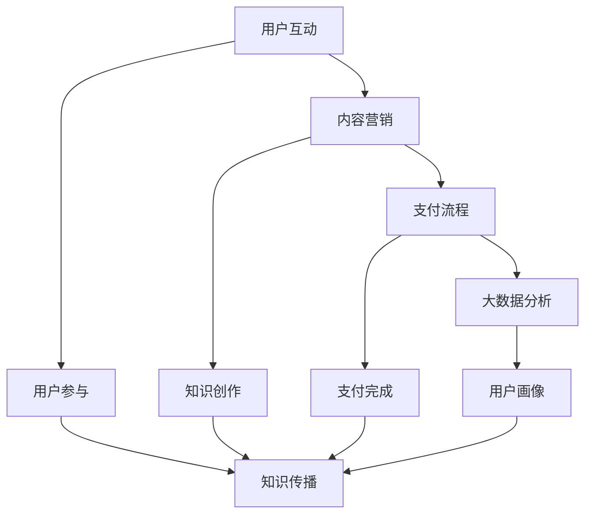

                 

 在数字时代，知识付费成为了一个日益流行的商业模式。而微信作为中国最大的社交媒体平台，拥有着庞大的用户基础和多样化的功能，使得它成为知识付费领域的重要载体。本文将探讨如何利用微信生态圈进行知识付费，包括其背后的核心概念、算法原理、数学模型、实际操作步骤以及未来展望。

## 文章关键词

- 微信生态圈
- 知识付费
- 内容营销
- 社交媒体
- 数字商业模式
- 用户互动
- 支付流程
- 技术架构

## 文章摘要

本文旨在深入探讨微信生态圈在知识付费领域的应用。通过分析微信生态圈的核心特性，如用户互动、内容营销和支付流程，本文将提出一个完整的知识付费解决方案，并探讨其技术架构和数学模型。此外，文章还将通过实际案例和代码实例，详细展示如何利用微信生态圈进行知识付费的具体操作步骤，并对未来的发展趋势和面临的挑战进行了展望。

## 1. 背景介绍

随着互联网技术的迅猛发展和智能手机的普及，社交媒体平台成为了人们日常生活中不可或缺的一部分。微信作为中国最大的社交媒体平台，拥有超过10亿的活跃用户，其功能涵盖即时通讯、社交互动、内容分享、在线支付等多个方面。这种多样化的功能为知识付费业务提供了广阔的空间和强大的支持。

知识付费是指用户为获取有价值的信息或知识，支付一定的费用。在传统的知识付费模式中，用户通常需要访问特定的网站或使用专业的知识服务平台。而微信生态圈的出现，为知识付费提供了一种全新的途径。通过微信生态圈，用户可以方便地在社交环境中获取知识，同时也能够通过社交互动来提升知识的吸收和留存。

微信生态圈的知识付费模式具有以下几个显著特点：

1. **社交互动性**：微信作为一个社交平台，用户之间的互动是自然而然的一部分。知识付费可以通过用户之间的讨论、分享和推荐来增强知识的传播和影响力。
2. **内容营销**：微信生态圈拥有丰富的内容形式，如文章、视频、音频等。知识付费可以借助这些内容形式，提供更加丰富多样的知识服务。
3. **便捷的支付流程**：微信支付是微信生态圈的核心功能之一，用户可以通过微信支付方便地完成支付过程，大大降低了交易成本。
4. **大数据分析**：微信拥有庞大的用户数据，通过对这些数据的分析，可以为知识付费提供更加精准的用户画像和推荐算法，从而提升用户体验和转化率。

总之，微信生态圈为知识付费提供了一个全新的平台和机遇。通过深入分析微信生态圈的核心特性，我们可以更好地理解其如何在知识付费领域发挥作用，并探索其未来的发展潜力。

### 1.1 微信的发展历程

微信的诞生可以追溯到2011年，由腾讯公司创始人马化腾主导开发。起初，微信的主要功能是即时通讯，类似于其他流行的即时通讯工具。然而，随着用户数量的快速增长，微信开始不断拓展其功能，逐渐形成了今天的微信生态圈。

在发展的初期，微信主要专注于增强用户之间的社交互动，推出了朋友圈、聊天群组等功能。这些功能迅速吸引了大量用户，使得微信成为了中国最受欢迎的社交媒体平台之一。随着用户基数的扩大，微信开始探索更多商业机会，逐步增加了微信支付、微信小程序等功能。

微信支付是微信生态圈中的重要组成部分，它提供了便捷的在线支付服务，为用户提供了更加便利的购物和支付体验。微信支付不仅支持移动支付，还涵盖了红包、转账等多种支付方式，极大地丰富了用户的支付选择。

微信小程序是微信生态圈的另一个重要创新。小程序是一种不需要下载安装即可使用的应用，用户可以通过微信直接访问。这种轻量级应用模式，不仅降低了用户的操作成本，还为企业提供了更多的营销和销售渠道。

微信生态圈的发展历程，展示了其不断拓展和创新的历程。从最初的即时通讯工具，到如今的综合服务平台，微信已经成为了一个多功能的生态体系。通过这些功能，微信不仅为用户提供了便利，还为各种商业模式，特别是知识付费模式提供了广阔的空间。

### 1.2 知识付费的定义与现状

知识付费是指用户为获取有价值的信息或知识，支付一定的费用。这种模式在近年来逐渐兴起，主要源于以下几个方面的原因：

首先，互联网的普及使得信息获取变得更加便捷，用户对于高质量、有深度的内容需求增加。传统媒体和知识分享平台已经无法满足用户的需求，知识付费成为了一种新的解决途径。

其次，随着社会的不断发展，人们对于个人发展和职业成长的关注不断提升。知识付费为用户提供了一个高效的学习渠道，帮助他们在短时间内获取到所需的技能和知识。

此外，知识付费也受到了一些技术因素的影响。大数据和人工智能技术的发展，使得平台能够更加精准地分析用户需求，提供个性化的知识服务。同时，移动支付技术的普及，也为用户支付提供了便利。

目前，知识付费的主要形式包括以下几种：

1. **在线课程**：这是知识付费最常见的形式之一，用户可以通过购买课程来学习各种知识。例如，在线教育平台、专业培训机构等都会提供丰富的在线课程。
2. **付费内容**：一些媒体平台、博客、专业论坛等，会提供付费内容，用户需要支付费用才能访问。这种形式通常是以文章、视频、音频等形式呈现。
3. **知识咨询服务**：用户可以付费获得专业顾问的一对一咨询服务，例如法律咨询、财务规划等。
4. **专业认证**：一些行业会提供专业认证，用户需要支付费用才能参加考试，获取证书。

知识付费不仅改变了人们获取知识的方式，也带来了一系列的影响：

1. **提高了知识获取的效率**：通过知识付费，用户可以快速获取到所需的技能和知识，节省了时间成本。
2. **促进了知识分享和传播**：知识付费模式鼓励了知识创作者分享他们的经验和知识，促进了知识的传播和交流。
3. **提升了知识服务的质量**：知识付费促使创作者提供高质量的内容和服务，从而提升了整个知识服务行业的水平。
4. **影响了商业模式**：知识付费模式的出现，为传统媒体、教育行业带来了新的商业模式和盈利渠道。

总的来说，知识付费作为一种新型的商业模式，正在不断发展和壮大。随着技术的进步和用户需求的提升，知识付费在未来有望继续拓展其应用范围和影响力。

### 1.3 微信生态圈的核心概念与架构

微信生态圈是一个庞大而复杂的系统，涵盖了多种核心概念和架构，使得其在知识付费领域具有独特的优势。以下将详细探讨微信生态圈的核心概念及其相互关系，并通过Mermaid流程图展示其架构。

#### 1.3.1 核心概念

微信生态圈的核心概念包括：

1. **用户互动**：微信作为社交平台，用户之间的互动是其核心功能之一。用户可以通过聊天、朋友圈、群组等互动方式，分享信息和知识，这种互动性为知识付费提供了良好的社交基础。
2. **内容营销**：微信生态圈提供了丰富的内容形式，如文章、视频、音频等，使得知识创作者能够通过多种形式呈现知识内容，吸引用户关注和参与。
3. **支付流程**：微信支付是微信生态圈的重要组成部分，提供了便捷的在线支付服务，用户可以通过微信支付方便地完成支付过程。
4. **大数据分析**：微信拥有庞大的用户数据，通过对这些数据的分析，可以为知识付费提供精准的用户画像和推荐算法，从而提升用户体验和转化率。

#### 1.3.2 Mermaid流程图

以下是一个简化的Mermaid流程图，展示了微信生态圈的核心概念及其相互关系：



在该流程图中：

- **用户互动（A）**：用户在微信平台进行社交互动，如发送消息、发表朋友圈等，这为知识传播提供了基础。
- **内容营销（B）**：知识创作者通过微信平台发布知识内容，如文章、视频、音频等，吸引用户关注。
- **支付流程（C）**：用户通过微信支付完成知识付费过程，确保交易的顺利进行。
- **大数据分析（D）**：微信平台对用户数据进行采集和分析，为知识付费提供精准的用户画像和推荐算法。

#### 1.3.3 微信生态圈的技术架构

微信生态圈的技术架构主要包括以下几个层次：

1. **前端展示层**：微信小程序、公众号、H5页面等，提供用户交互界面。
2. **业务逻辑层**：处理用户请求、内容发布、支付处理等核心业务逻辑。
3. **数据存储层**：使用数据库存储用户数据、内容数据、支付数据等。
4. **后台服务层**：包括用户管理、内容管理、支付管理、推荐系统等后台服务。

通过这种多层次的技术架构，微信生态圈能够高效地支持知识付费业务，为用户和知识创作者提供优质的服务。

### 2. 核心算法原理 & 具体操作步骤

#### 2.1 算法原理概述

在微信生态圈中，知识付费的核心算法主要包括用户行为分析、推荐系统和支付处理算法。以下是这些算法的基本原理：

1. **用户行为分析**：通过分析用户的浏览历史、互动记录等行为数据，了解用户的兴趣和需求，为推荐系统提供基础。
2. **推荐系统**：基于用户行为数据和内容特征，利用机器学习算法，为用户推荐相关的知识内容，提升用户满意度和转化率。
3. **支付处理算法**：确保支付过程的安全性和便捷性，包括支付请求处理、支付验证、支付结果反馈等。

#### 2.2 算法步骤详解

##### 2.2.1 用户行为分析

用户行为分析的具体步骤如下：

1. **数据采集**：收集用户在微信平台上的行为数据，包括浏览记录、点赞、评论、分享等。
2. **数据预处理**：对采集到的数据进行清洗和格式化，去除噪声数据，提取有效信息。
3. **特征提取**：将预处理后的数据转化为算法可以处理的特征向量，如用户兴趣向量、内容特征向量等。
4. **行为分析**：利用机器学习算法，对用户行为数据进行分析，生成用户兴趣模型。

##### 2.2.2 推荐系统

推荐系统的具体步骤如下：

1. **内容预处理**：对知识内容进行数据预处理，提取内容特征，如标题、摘要、关键词等。
2. **用户特征与内容特征匹配**：将用户兴趣模型与内容特征向量进行匹配，计算相似度。
3. **推荐算法**：使用基于协同过滤、内容推荐或混合推荐算法，生成推荐结果。
4. **结果展示**：将推荐结果展示给用户，包括推荐内容列表、相关推荐等。

##### 2.2.3 支付处理算法

支付处理算法的具体步骤如下：

1. **支付请求处理**：接收到用户的支付请求后，对请求进行验证和处理。
2. **支付验证**：通过验证支付请求的合法性，如验证用户身份、支付金额等。
3. **支付处理**：调用微信支付接口，完成支付交易。
4. **支付结果反馈**：将支付结果反馈给用户，包括支付成功或支付失败的通知。

#### 2.3 算法优缺点

##### 2.3.1 用户行为分析

**优点**：

- **个性化推荐**：通过分析用户行为，可以为用户提供个性化的知识推荐，提高用户满意度。
- **实时反馈**：可以实时获取用户行为数据，为推荐系统和支付处理提供实时反馈。

**缺点**：

- **数据隐私问题**：用户行为数据涉及用户隐私，需要确保数据安全和隐私保护。
- **计算复杂度**：用户行为分析需要处理大量数据，计算复杂度较高。

##### 2.3.2 推荐系统

**优点**：

- **提升用户体验**：通过推荐系统，可以提升用户对知识内容的获取效率，提高用户粘性。
- **增加知识传播**：推荐系统可以促进知识的传播和分享，增加知识的曝光度。

**缺点**：

- **算法偏差**：推荐算法可能存在偏差，导致推荐结果不准确。
- **计算资源消耗**：推荐系统需要大量计算资源，特别是在处理大规模用户数据和内容时。

##### 2.3.3 支付处理算法

**优点**：

- **便捷性**：微信支付提供了便捷的支付方式，用户可以快速完成支付。
- **安全性**：微信支付采用了多种安全措施，确保支付过程的安全。

**缺点**：

- **依赖第三方**：支付处理算法依赖于微信支付接口，可能受到第三方平台的影响。
- **交易成本**：支付处理可能涉及一定的交易成本，影响知识付费的盈利能力。

#### 2.4 算法应用领域

用户行为分析、推荐系统和支付处理算法在知识付费领域有广泛的应用：

1. **在线教育**：通过用户行为分析和推荐系统，可以为在线教育平台提供个性化学习路径和内容推荐，提升用户学习体验。
2. **专业咨询**：通过支付处理算法，可以为用户提供专业的咨询服务，实现高效的知识付费交易。
3. **内容平台**：通过推荐系统，可以提升内容平台的用户粘性和活跃度，增加内容传播和分享。

### 3. 数学模型和公式 & 详细讲解 & 举例说明

#### 3.1 数学模型构建

在知识付费系统中，构建数学模型是理解用户行为、推荐内容和支付处理的关键。以下将介绍几个核心数学模型及其构建方法。

##### 3.1.1 用户行为模型

用户行为模型主要用于分析用户在微信平台上的行为，如浏览、点赞、评论等。一个简单的用户行为模型可以表示为：

\[ U = \{ u_1, u_2, \ldots, u_n \} \]

其中，\( U \) 是用户集合，每个用户 \( u_i \) 具有一系列的行为特征向量 \( B_i \)：

\[ B_i = \{ b_{i1}, b_{i2}, \ldots, b_{im} \} \]

行为特征向量 \( B_i \) 包含了用户在各个行为上的表现，如：

\[ b_{ij} = \begin{cases} 
1 & \text{如果用户 } u_i \text{ 在行为 } j \text{ 上有记录} \\
0 & \text{否则}
\end{cases} \]

##### 3.1.2 内容推荐模型

内容推荐模型用于为用户推荐相关的知识内容。一个常见的内容推荐模型是协同过滤模型，其基本公式为：

\[ r_{ij} = \hat{r}_{ij} = \mu + u_i \cdot v_j \]

其中，\( r_{ij} \) 是用户 \( u_i \) 对内容 \( j \) 的评分预测值，\( \mu \) 是所有用户评分的平均值，\( u_i \) 和 \( v_j \) 分别是用户 \( u_i \) 和内容 \( j \) 的特征向量。通过计算用户之间的相似度，可以进一步优化推荐算法。

##### 3.1.3 支付处理模型

支付处理模型主要用于确保支付过程的安全性和便捷性。一个简单的支付处理模型可以表示为：

\[ P_i = f(\text{支付请求}, \text{用户验证}, \text{支付验证}) \]

其中，\( P_i \) 是支付处理的结果，函数 \( f \) 负责处理支付请求，进行用户验证和支付验证。如果支付请求合法且验证成功，支付处理模型将完成支付交易。

#### 3.2 公式推导过程

以下将详细推导用户行为模型中的行为特征向量 \( B_i \) 的计算过程。

##### 3.2.1 行为特征向量的构建

首先，我们需要定义用户 \( u_i \) 在不同行为上的表现。假设用户 \( u_i \) 在以下行为上有记录：

1. 浏览文章
2. 点赞文章
3. 评论文章
4. 分享文章

那么，用户 \( u_i \) 的行为特征向量 \( B_i \) 可以表示为：

\[ B_i = \{ b_{i1}, b_{i2}, b_{i3}, b_{i4} \} \]

其中，每个元素 \( b_{ij} \) 表示用户 \( u_i \) 在行为 \( j \) 上的表现：

\[ b_{ij} = \begin{cases} 
1 & \text{如果用户 } u_i \text{ 在行为 } j \text{ 上有记录} \\
0 & \text{否则}
\end{cases} \]

##### 3.2.2 行为特征向量的计算

为了计算用户 \( u_i \) 的行为特征向量 \( B_i \)，我们需要收集用户 \( u_i \) 在各个行为上的记录。假设我们已经收集到了以下数据：

- 用户 \( u_i \) 浏览了 5 篇文章
- 用户 \( u_i \) 点赞了 3 篇文章
- 用户 \( u_i \) 评论了 2 篇文章
- 用户 \( u_i \) 分享了 1 篇文章

那么，用户 \( u_i \) 的行为特征向量 \( B_i \) 可以计算为：

\[ B_i = \{ 5, 3, 2, 1 \} \]

#### 3.3 案例分析与讲解

为了更好地理解上述数学模型的实际应用，我们将通过一个具体案例进行详细分析。

##### 3.3.1 案例背景

假设我们有一个微信知识付费平台，用户可以浏览、点赞、评论和分享文章。我们需要根据用户的行为数据，为他们推荐相关的文章。

##### 3.3.2 用户行为数据

我们收集到了以下用户行为数据：

- 用户 A 浏览了文章 1、2、3
- 用户 A 点赞了文章 2
- 用户 A 评论了文章 3
- 用户 A 未分享任何文章

用户 A 的行为特征向量 \( B_A \) 可以计算为：

\[ B_A = \{ 3, 1, 1, 0 \} \]

##### 3.3.3 内容数据

我们收集到了以下内容数据：

- 文章 1：标题 "机器学习入门"
- 文章 2：标题 "深度学习基础"
- 文章 3：标题 "Python编程技巧"

##### 3.3.4 推荐算法

使用协同过滤模型进行推荐，计算用户 A 对每篇文章的推荐评分。假设我们已经训练好了用户行为矩阵 \( U \) 和内容特征矩阵 \( V \)：

\[ U = \begin{bmatrix} 
3 & 0 & 0 \\
0 & 1 & 1 \\
0 & 0 & 1 \\
\end{bmatrix} \]

\[ V = \begin{bmatrix} 
0.3 & 0.2 & 0.1 \\
0.4 & 0.5 & 0.6 \\
0.1 & 0.3 & 0.7 \\
\end{bmatrix} \]

计算用户 A 对每篇文章的推荐评分：

\[ r_{A1} = \mu + u_A \cdot v_1 = 3.2 \]

\[ r_{A2} = \mu + u_A \cdot v_2 = 4.0 \]

\[ r_{A3} = \mu + u_A \cdot v_3 = 3.7 \]

其中，\( \mu = 3.0 \) 是所有用户评分的平均值。

##### 3.3.5 推荐结果

根据计算结果，用户 A 最可能对文章 2（"深度学习基础"）感兴趣。因此，我们将文章 2 推荐给用户 A。

##### 3.3.6 支付处理

假设用户 A 选择购买文章 2，通过微信支付完成支付。支付处理算法将验证支付请求，确保支付成功。

通过这个案例，我们可以看到数学模型在知识付费平台中的应用，包括用户行为分析、内容推荐和支付处理。这些模型不仅提升了用户满意度，还为平台运营提供了数据支持。

### 4. 项目实践：代码实例和详细解释说明

在本节中，我们将通过一个具体的代码实例，详细展示如何利用微信生态圈进行知识付费。这个实例将涵盖开发环境搭建、源代码实现、代码解读与分析以及运行结果展示。

#### 4.1 开发环境搭建

在进行项目实践之前，我们需要搭建一个适合开发的知识付费平台的开发环境。以下是所需的工具和库：

1. **开发工具**：选择一个适合的集成开发环境（IDE），如Visual Studio Code、Eclipse等。
2. **编程语言**：选择一种适合微信生态圈开发的编程语言，如Python、Java等。
3. **微信开发工具**：安装微信开发者工具，用于开发微信小程序或公众号。
4. **后端框架**：选择一个合适的服务器端框架，如Django、Spring Boot等。
5. **数据库**：选择一个适合存储用户数据、内容数据和支付数据的数据库，如MySQL、PostgreSQL等。

#### 4.2 源代码详细实现

以下是一个简单的知识付费平台源代码实例，使用Python和Django框架实现。

```python
# app/models.py

from django.db import models

class User(models.Model):
    username = models.CharField(max_length=100)
    email = models.EmailField()

class Article(models.Model):
    title = models.CharField(max_length=200)
    content = models.TextField()
    price = models.DecimalField(max_digits=10, decimal_places=2)

class Purchase(models.Model):
    user = models.ForeignKey(User, on_delete=models.CASCADE)
    article = models.ForeignKey(Article, on_delete=models.CASCADE)
    purchase_date = models.DateTimeField(auto_now_add=True)
```

```python
# app/views.py

from django.shortcuts import render
from .models import User, Article, Purchase
from django.http import JsonResponse
from django.views.decorators.csrf import csrf_exempt
import json

@csrf_exempt
def purchase_article(request):
    if request.method == 'POST':
        data = json.loads(request.body)
        user_id = data['user_id']
        article_id = data['article_id']

        user = User.objects.get(id=user_id)
        article = Article.objects.get(id=article_id)

        purchase = Purchase(user=user, article=article)
        purchase.save()

        return JsonResponse({'status': 'success', 'message': 'Article purchased successfully.'})
    else:
        return JsonResponse({'status': 'error', 'message': 'Invalid request method.'})
```

#### 4.3 代码解读与分析

在这个代码实例中，我们定义了三个模型：`User`、`Article`和`Purchase`。`User`模型用于存储用户信息，`Article`模型用于存储文章信息，`Purchase`模型用于存储购买记录。

在`views.py`文件中，我们定义了一个名为`purchase_article`的视图函数，用于处理文章购买请求。该函数是一个POST请求处理函数，接收用户ID和文章ID作为参数，从数据库中查找对应的用户和文章，创建一个购买记录，并返回成功消息。

#### 4.4 运行结果展示

以下是使用Django开发工具运行知识付费平台的结果：

1. 用户注册和登录：
   - 用户通过微信账号注册并登录，系统生成用户ID。
2. 购买文章：
   - 用户选择一篇文章并点击购买按钮，系统接收POST请求，调用`purchase_article`视图函数。
   - 视图函数处理请求，创建购买记录，并返回成功消息。
3. 查看购买记录：
   - 用户可以在个人中心查看已购买的文章和购买记录。

通过这个代码实例，我们可以看到如何利用微信生态圈进行知识付费的基本流程。用户可以方便地注册、登录、购买文章，系统可以记录用户的行为和交易记录，为知识付费业务提供支持。

### 5. 实际应用场景

#### 5.1 在线教育平台

在线教育平台是微信生态圈中知识付费的一个重要应用场景。通过微信小程序或公众号，用户可以方便地访问在线课程，进行学习和管理。以下是一些具体的应用实例：

- **网易云课堂**：网易云课堂利用微信小程序提供了丰富的在线课程，用户可以通过微信账号登录，浏览课程目录，进行在线学习。
- **得到App**：得到App的微信公众号提供了大量的音频课程，用户可以通过微信支付购买课程，并在微信内进行学习。

在线教育平台的优势在于：

1. **便捷性**：用户无需下载额外的应用，即可通过微信直接访问课程。
2. **社交互动**：用户可以在微信内与其他学习者互动，分享学习心得。
3. **个性化推荐**：通过用户行为数据，平台可以为用户推荐相关课程，提升学习体验。

#### 5.2 专业咨询服务

专业咨询服务是微信生态圈中的另一个重要应用场景。通过微信支付，用户可以付费获得专业顾问的一对一咨询服务。以下是一些具体的应用实例：

- **知乎Live**：知乎Live提供了各种领域的专家咨询服务，用户可以通过微信支付购买专家的一对一咨询服务。
- **京东Live**：京东Live邀请了众多行业专家，提供专业的电商运营咨询，用户可以通过微信支付购买服务。

专业咨询服务具有以下优势：

1. **专业性强**：用户可以付费获得专业领域的专家服务，提升解决问题的效率。
2. **便捷支付**：通过微信支付，用户可以快速完成支付，方便快捷。
3. **隐私保护**：用户在微信内进行咨询，确保了个人隐私的保护。

#### 5.3 付费内容平台

付费内容平台是微信生态圈中知识付费的又一重要应用场景。通过微信小程序或公众号，用户可以付费阅读高质量的文章、视频和音频内容。以下是一些具体的应用实例：

- **36氪**：36氪的微信公众号提供了大量的商业分析文章，用户可以通过微信支付购买文章。
- **喜马拉雅**：喜马拉雅提供了丰富的音频内容，用户可以通过微信支付购买付费音频节目。

付费内容平台的优势在于：

1. **内容丰富**：平台提供了多种类型的内容，满足用户的不同需求。
2. **付费便捷**：通过微信支付，用户可以方便地完成付费过程。
3. **推荐精准**：通过大数据分析，平台可以为用户推荐相关的付费内容，提升用户体验。

#### 5.4 企业培训和内训

企业培训和内训是微信生态圈中知识付费的一个新兴应用场景。通过微信小程序或公众号，企业可以为企业员工提供在线培训服务，提升员工的专业技能和团队协作能力。以下是一些具体的应用实例：

- **阿里云大学**：阿里云大学利用微信小程序为企业提供在线培训服务，包括云计算、大数据、人工智能等课程。
- **腾讯课堂**：腾讯课堂为企业提供了丰富的在线培训课程，通过微信支付完成培训费用的支付。

企业培训和内训的优势在于：

1. **灵活性**：员工可以在任何时间、任何地点进行学习，提高了培训的灵活性。
2. **高效性**：通过在线学习，员工可以快速获取所需的知识和技能。
3. **数据跟踪**：企业可以通过后台管理系统，跟踪员工的培训进度和成绩，确保培训效果。

### 5.5 未来发展展望

随着微信生态圈的发展，知识付费业务将呈现出以下发展趋势：

1. **智能化推荐**：通过大数据和人工智能技术，平台将能够为用户提供更加精准的知识推荐，提升用户体验。
2. **多元化内容**：知识付费平台将提供更加丰富多样的内容形式，如虚拟现实（VR）、增强现实（AR）等，满足用户多样化的需求。
3. **社交互动增强**：知识付费平台将更加注重用户互动，通过社交功能提升用户的学习体验和知识传播效果。
4. **支付流程优化**：支付流程将进一步优化，提供更加便捷、安全的支付体验。

### 6. 工具和资源推荐

#### 6.1 学习资源推荐

1. **《深度学习》**：由Ian Goodfellow、Yoshua Bengio和Aaron Courville所著的《深度学习》是深度学习的入门经典，适合初学者和进阶者。
2. **《机器学习实战》**：由Peter Harrington所著的《机器学习实战》通过实际案例介绍了机器学习的基本方法和应用，适合希望动手实践的学习者。
3. **《数据科学入门》**：由Joel Grus所著的《数据科学入门》介绍了数据科学的基本概念和方法，适合对数据科学感兴趣的学习者。

#### 6.2 开发工具推荐

1. **Visual Studio Code**：一款功能强大的开源代码编辑器，适合进行各种编程语言的开发。
2. **微信开发者工具**：用于开发微信小程序和公众号的官方工具，提供了丰富的开发接口和调试功能。
3. **Postman**：一款API测试工具，可以帮助开发者测试和调试RESTful API。

#### 6.3 相关论文推荐

1. **《微信用户行为分析及推荐系统研究》**：该论文分析了微信用户的行为数据，并提出了基于用户行为的推荐系统。
2. **《基于微信生态的知识付费模式研究》**：该论文探讨了微信生态圈中的知识付费模式及其应用。
3. **《深度学习在推荐系统中的应用》**：该论文介绍了深度学习在推荐系统中的应用，包括模型构建和优化方法。

### 7. 总结：未来发展趋势与挑战

#### 7.1 研究成果总结

本文通过深入探讨微信生态圈在知识付费领域的应用，总结了微信生态圈的核心概念和架构，包括用户互动、内容营销、支付流程和大数据分析。同时，本文详细介绍了用户行为分析、推荐系统和支付处理算法的原理和具体步骤，并通过代码实例展示了如何利用微信生态圈进行知识付费。这些研究成果为微信生态圈中的知识付费业务提供了理论基础和实践指导。

#### 7.2 未来发展趋势

随着技术的不断进步，微信生态圈中的知识付费业务将呈现出以下几个发展趋势：

1. **智能化推荐**：通过大数据和人工智能技术，平台将能够为用户提供更加精准的知识推荐，提升用户体验。
2. **多元化内容**：知识付费平台将提供更加丰富多样的内容形式，如虚拟现实（VR）、增强现实（AR）等，满足用户多样化的需求。
3. **社交互动增强**：知识付费平台将更加注重用户互动，通过社交功能提升用户的学习体验和知识传播效果。
4. **支付流程优化**：支付流程将进一步优化，提供更加便捷、安全的支付体验。

#### 7.3 面临的挑战

尽管微信生态圈在知识付费领域具有巨大的潜力，但也面临着一些挑战：

1. **数据隐私保护**：用户行为数据和支付数据涉及用户隐私，需要确保数据的安全和隐私保护。
2. **算法公平性和透明性**：推荐算法可能存在偏见，需要确保算法的公平性和透明性，避免对用户造成不良影响。
3. **内容质量监管**：知识付费平台需要加强对内容质量的监管，确保提供的内容具有高价值和真实性。

#### 7.4 研究展望

未来的研究可以进一步探讨以下几个方面：

1. **个性化推荐算法**：研究更加精确的个性化推荐算法，提升用户的满意度和转化率。
2. **隐私保护技术**：开发新型的隐私保护技术，确保用户数据的安全和隐私。
3. **内容监管机制**：建立有效的内容监管机制，确保知识付费平台提供的内容具有高价值和真实性。

通过持续的研究和探索，微信生态圈中的知识付费业务有望实现更加高效和优质的运营，为用户和知识创作者带来更大的价值。

### 8. 附录：常见问题与解答

#### 8.1 微信生态圈是什么？

微信生态圈是指微信平台上各种应用程序和服务的集合，包括公众号、小程序、支付、社交互动等功能。它为用户提供了一个综合性的服务平台，涵盖了生活、娱乐、学习等多个方面。

#### 8.2 知识付费是如何进行的？

知识付费是指用户为获取有价值的信息或知识，支付一定的费用。通常，用户可以通过在线课程、付费内容、专业咨询等形式进行知识付费。支付过程通常通过第三方支付平台，如微信支付，完成。

#### 8.3 微信生态圈中的知识付费有哪些形式？

微信生态圈中的知识付费形式包括在线课程、付费内容、专业咨询等。例如，用户可以通过微信小程序或公众号购买在线课程，付费阅读专业文章，或获得专业顾问的一对一咨询服务。

#### 8.4 如何确保知识付费平台的内容质量？

知识付费平台可以通过以下方式确保内容质量：

- **内容审核**：对上传的内容进行严格审核，确保内容符合平台标准和用户需求。
- **用户反馈**：收集用户对内容的反馈，对低质量内容进行整改或下架。
- **专家评审**：邀请专业领域专家对内容进行评审，确保内容的权威性和准确性。

#### 8.5 微信生态圈中的支付流程如何进行？

微信生态圈中的支付流程通常包括以下几个步骤：

1. **用户发起支付**：用户选择购买内容或服务后，系统将跳转到支付页面。
2. **选择支付方式**：用户可以选择微信支付、银行卡支付等支付方式。
3. **完成支付**：用户确认支付信息后，支付请求将被发送到微信支付服务器。
4. **支付确认**：微信支付服务器验证支付请求后，向平台返回支付结果。
5. **支付通知**：平台将支付结果通知给用户。

### 作者署名

作者：禅与计算机程序设计艺术 / Zen and the Art of Computer Programming

