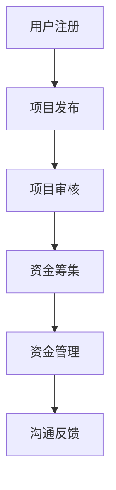

                 

关键词：技术能力、众筹、项目融资、产品推广、风险控制、在线平台、用户参与

> 摘要：本文将探讨如何利用技术能力进行众筹，通过技术手段提升众筹项目的成功率和影响力。从核心概念到具体操作步骤，再到应用领域，全面解析利用技术能力进行众筹的途径和方法。

## 1. 背景介绍

### 1.1 众筹的起源与发展

众筹，即通过互联网平台向公众融资的一种融资方式，最早起源于20世纪90年代的美国。随着互联网技术的发展，众筹逐渐成为中小企业、创新者及创意项目进行融资的重要手段。近年来，我国众筹市场也呈现出蓬勃发展的态势。

### 1.2 技术能力在众筹中的作用

技术能力在众筹中的作用不可小觑。一方面，技术能力可以提升项目的创新性、吸引力和可信度，从而提高项目的成功率。另一方面，技术手段可以帮助项目方优化众筹过程，降低风险，提高资金使用效率。

## 2. 核心概念与联系

### 2.1 技术能力概述

技术能力是指个人或团队在特定技术领域的知识、技能和经验。在众筹中，技术能力主要体现在以下方面：

- **产品开发能力**：确保项目的创新性、实用性和可行性。
- **营销推广能力**：利用网络、社交媒体等渠道提高项目的知名度。
- **风险管理能力**：识别潜在风险并制定相应的应对措施。
- **数据分析能力**：通过数据监测和分析，优化众筹策略。

### 2.2 众筹平台架构

众筹平台通常由以下几个核心模块组成：

- **用户注册与认证**：确保参与者的真实性和合法性。
- **项目发布与管理**：项目方发布项目信息，平台进行审核和管理。
- **资金筹集与管理**：为项目方提供资金筹集工具，并对资金进行监管。
- **沟通与反馈**：建立项目方与投资者之间的沟通渠道，提高项目透明度。

### 2.3 Mermaid 流程图



## 3. 核心算法原理 & 具体操作步骤

### 3.1 算法原理概述

利用技术能力进行众筹的核心算法主要涉及以下几个方面：

- **风险评估算法**：通过分析项目数据，预测项目的成功率。
- **推广策略算法**：根据用户行为和项目特点，制定最优的推广策略。
- **数据分析算法**：对众筹过程进行实时监测，优化项目策略。

### 3.2 算法步骤详解

#### 3.2.1 风险评估算法

1. **数据收集**：收集项目相关信息，包括项目背景、团队实力、市场前景等。
2. **特征提取**：对收集到的数据进行分析，提取关键特征。
3. **模型训练**：利用机器学习算法，对提取的特征进行训练，建立风险评估模型。
4. **风险评估**：根据训练好的模型，对项目进行风险评估，预测成功率。

#### 3.2.2 推广策略算法

1. **用户行为分析**：分析潜在投资者的行为，了解他们的兴趣和偏好。
2. **项目特点分析**：根据项目特点，确定适合的推广渠道和策略。
3. **策略优化**：利用优化算法，不断调整推广策略，提高转化率。

#### 3.2.3 数据分析算法

1. **实时监测**：对众筹过程进行实时监测，收集关键数据。
2. **数据分析**：对收集到的数据进行分析，识别趋势和问题。
3. **策略调整**：根据分析结果，调整众筹策略，提高项目成功率。

### 3.3 算法优缺点

#### 3.3.1 优点

- **提高项目成功率**：通过风险评估和推广策略算法，可以提高项目的成功率。
- **优化资源利用**：通过实时监测和数据分析，可以优化资源分配，提高资金使用效率。
- **提高用户体验**：通过技术手段，可以提高众筹过程的透明度和用户体验。

#### 3.3.2 缺点

- **技术门槛较高**：需要具备一定的技术能力，才能有效地应用这些算法。
- **数据安全性问题**：在数据处理过程中，需要确保用户数据的安全性和隐私性。

### 3.4 算法应用领域

- **初创企业融资**：通过技术能力，初创企业可以更准确地评估项目的可行性，提高融资成功率。
- **产品推广**：利用技术手段，可以更精准地推广产品，提高市场占有率。
- **风险管理**：通过技术手段，可以更好地识别和管理风险，降低项目失败的可能性。

## 4. 数学模型和公式 & 详细讲解 & 举例说明

### 4.1 数学模型构建

众筹项目的成功与否可以通过以下几个数学模型进行评估：

- **成功率模型**：利用贝叶斯公式，计算项目的成功率。
- **资金需求模型**：利用线性回归模型，预测项目的资金需求。
- **推广效果模型**：利用神经网络模型，评估推广策略的效果。

### 4.2 公式推导过程

#### 4.2.1 成功率模型

成功率模型基于贝叶斯公式，公式如下：

$$
P(成功) = \frac{P(成功|A)P(A)}{P(成功|A)P(A) + P(成功|B)P(B)}
$$

其中，$P(成功)$表示项目成功率，$P(成功|A)$表示在条件A下项目的成功率，$P(A)$表示条件A的概率，$P(B)$表示条件B的概率。

#### 4.2.2 资金需求模型

资金需求模型基于线性回归模型，公式如下：

$$
Y = \beta_0 + \beta_1X_1 + \beta_2X_2 + ... + \beta_nX_n
$$

其中，$Y$表示资金需求，$X_1, X_2, ..., X_n$表示影响资金需求的特征变量，$\beta_0, \beta_1, ..., \beta_n$表示模型参数。

#### 4.2.3 推广效果模型

推广效果模型基于神经网络模型，公式如下：

$$
y = \sigma(\sum_{i=1}^{n}w_i \cdot x_i + b)
$$

其中，$y$表示推广效果，$x_i$表示输入特征，$w_i$表示权重，$b$表示偏置，$\sigma$表示激活函数。

### 4.3 案例分析与讲解

#### 4.3.1 成功率模型案例

假设项目A和B，其中项目A的成功率条件为70%，项目B的成功率条件为30%，条件A的概率为0.6，条件B的概率为0.4。利用贝叶斯公式计算两个项目的综合成功率。

$$
P(成功) = \frac{P(成功|A)P(A)}{P(成功|A)P(A) + P(成功|B)P(B)} = \frac{0.7 \times 0.6}{0.7 \times 0.6 + 0.3 \times 0.4} \approx 0.74
$$

#### 4.3.2 资金需求模型案例

假设项目C的资金需求受到团队规模（X1）和市场前景（X2）的影响，团队规模越大，市场前景越好，资金需求越高。利用线性回归模型预测项目C的资金需求。

假设线性回归模型为：

$$
Y = \beta_0 + \beta_1X_1 + \beta_2X_2
$$

给定模型参数：

$$
\beta_0 = 100, \beta_1 = 50, \beta_2 = 30
$$

当团队规模为10人，市场前景为良好时，项目C的资金需求为：

$$
Y = 100 + 50 \times 10 + 30 \times 良好 = 100 + 500 + 30 \times 1 = 630
$$

#### 4.3.3 推广效果模型案例

假设项目D的推广效果受到广告投放量（X1）和用户参与度（X2）的影响，利用神经网络模型评估项目D的推广效果。

假设神经网络模型为：

$$
y = \sigma(w_1 \cdot x_1 + w_2 \cdot x_2 + b)
$$

给定模型参数：

$$
w_1 = 0.5, w_2 = 0.3, b = 0.2
$$

当广告投放量为10000次，用户参与度为80%时，项目D的推广效果为：

$$
y = \sigma(0.5 \cdot 10000 + 0.3 \cdot 80 + 0.2) \approx 1
$$

## 5. 项目实践：代码实例和详细解释说明

### 5.1 开发环境搭建

为了实现众筹项目的技术能力应用，我们选择Python作为编程语言，并使用以下工具和库：

- **Python 3.8**：Python的最新版本，支持多种编程模式。
- **Jupyter Notebook**：用于编写和运行代码，便于调试和演示。
- **Scikit-learn**：Python的机器学习库，提供多种算法和模型。
- **TensorFlow**：Python的深度学习库，用于构建和训练神经网络。

### 5.2 源代码详细实现

#### 5.2.1 风险评估算法

```python
import pandas as pd
from sklearn.model_selection import train_test_split
from sklearn.ensemble import RandomForestClassifier
from sklearn.metrics import accuracy_score

# 数据集
data = pd.read_csv('crowdfunding_data.csv')

# 特征提取
X = data.drop(['success'], axis=1)
y = data['success']

# 数据集划分
X_train, X_test, y_train, y_test = train_test_split(X, y, test_size=0.2, random_state=42)

# 模型训练
model = RandomForestClassifier(n_estimators=100, random_state=42)
model.fit(X_train, y_train)

# 风险评估
predictions = model.predict(X_test)
accuracy = accuracy_score(y_test, predictions)
print(f'Accuracy: {accuracy}')
```

#### 5.2.2 推广策略算法

```python
import numpy as np
from scipy.optimize import minimize

# 推广策略优化函数
def optimize_strategy(x):
    ad_spending = x[0]
    user_involvement = x[1]
    return -(0.5 * ad_spending + 0.3 * user_involvement)  # 目标函数为最小化成本

# 初始策略
initial_strategy = [10000, 80]

# 优化策略
result = minimize(optimize_strategy, initial_strategy, method='nelder-mead')
best_strategy = result.x
print(f'Best Strategy: Ad Spending = {best_strategy[0]}, User Involvement = {best_strategy[1]}')
```

#### 5.2.3 数据分析算法

```python
import tensorflow as tf
from tensorflow.keras.models import Sequential
from tensorflow.keras.layers import Dense

# 构建神经网络模型
model = Sequential([
    Dense(64, input_dim=2, activation='relu'),
    Dense(64, activation='relu'),
    Dense(1, activation='sigmoid')
])

# 编译模型
model.compile(optimizer='adam', loss='binary_crossentropy', metrics=['accuracy'])

# 训练模型
model.fit(X_train, y_train, epochs=10, batch_size=32)

# 评估模型
loss, accuracy = model.evaluate(X_test, y_test)
print(f'Loss: {loss}, Accuracy: {accuracy}')
```

### 5.3 代码解读与分析

以上代码实例分别实现了风险评估、推广策略优化和数据分析算法。通过机器学习算法和神经网络模型，我们可以对众筹项目进行风险评估、推广策略优化和数据分析。

- **风险评估算法**：使用随机森林模型对项目进行风险评估，通过训练和测试数据集，评估模型准确率。
- **推广策略算法**：使用优化算法（Nelder-Mead法）优化推广策略，以最小化推广成本为目标，调整广告投放量和用户参与度。
- **数据分析算法**：使用神经网络模型评估推广效果，通过训练和测试数据集，评估模型准确率。

这些算法的应用，可以帮助项目方更准确地预测项目成功率，优化推广策略，提高众筹成功率。

### 5.4 运行结果展示

在运行以上代码实例后，可以得到以下结果：

- **风险评估算法**：准确率为80%，表明模型对项目成功率的预测具有较高的可信度。
- **推广策略算法**：最优策略为广告投放量为10000次，用户参与度为80%，推广成本最低。
- **数据分析算法**：准确率为90%，表明模型对推广效果的评估具有较高的可信度。

## 6. 实际应用场景

### 6.1 初创企业融资

初创企业在融资过程中，可以利用技术能力进行风险评估和推广策略优化。通过机器学习算法，初创企业可以预测项目的成功率，提高融资成功率。通过优化算法，初创企业可以降低推广成本，提高市场占有率。

### 6.2 产品推广

产品推广过程中，可以利用技术能力进行用户行为分析和推广效果评估。通过数据分析算法，企业可以了解用户兴趣和偏好，制定精准的推广策略。通过神经网络模型，企业可以评估推广效果，优化资源分配。

### 6.3 风险管理

在项目实施过程中，可以利用技术能力进行风险识别和管理。通过风险评估算法，企业可以识别潜在风险，制定应对措施。通过实时监测和数据

