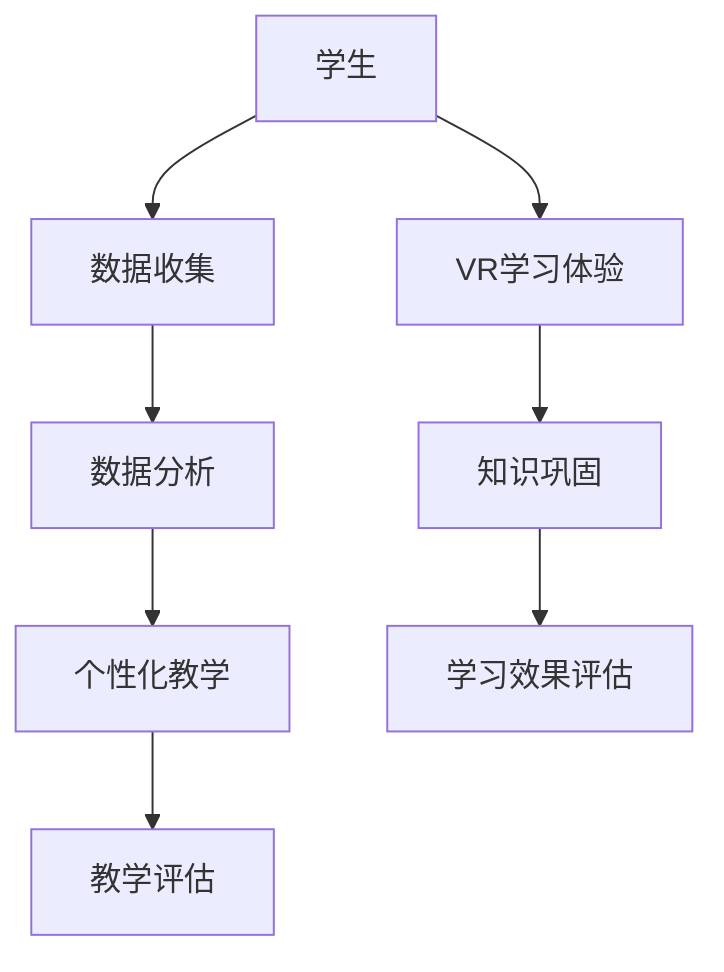

                 

在当今快速发展的技术时代，教育领域也正经历着一场深刻的变革。人工智能、大数据、虚拟现实等前沿技术的出现，为教育创新提供了前所未有的可能性。本文将探讨如何利用这些技术能力，推动教育科技的创新与发展。

## 关键词
- 教育科技创新
- 人工智能
- 大数据
- 虚拟现实
- 混合学习
- 个性化教育

## 摘要
本文首先回顾了教育科技的发展历程，然后深入分析了人工智能、大数据和虚拟现实等技术的核心概念及其在教育中的应用。接着，本文通过具体案例，展示了如何利用这些技术进行教育创新。最后，本文提出了教育科技创新的未来发展趋势和面临的挑战。

## 1. 背景介绍

### 教育科技的发展历程

教育科技的历史可以追溯到20世纪初期，当时的教学工具主要是幻灯片和录音机。随着计算机技术的兴起，教育科技开始进入一个新的阶段。20世纪90年代，互联网的出现使得在线教育成为可能，教育科技开始向数字化、网络化方向发展。

进入21世纪，随着人工智能、大数据和虚拟现实等前沿技术的快速发展，教育科技进入了一个全新的时代。这些技术不仅改变了教育的形式，也深刻影响了教育的质量和效率。

### 教育科技的重要性

教育科技的重要性不言而喻。首先，它能够提高教育的效率和质量。通过人工智能和大数据分析，教师可以更好地了解学生的学习情况，提供个性化的教育服务。其次，教育科技能够拓宽教育的边界，让教育更加开放和包容。虚拟现实技术可以让学生身临其境地体验各种场景，学习效果更加直观和生动。最后，教育科技还能够促进教育资源的共享，让优质教育资源惠及更多学生。

## 2. 核心概念与联系

### 人工智能

人工智能（AI）是指使计算机具有类似人类智能的能力。它包括机器学习、自然语言处理、计算机视觉等多个领域。人工智能在教育中的应用非常广泛，例如，智能教学系统可以根据学生的学习情况自动调整教学内容和进度，提高教学效果。

### 大数据

大数据是指无法用传统数据处理工具在合理时间内对其进行存储、管理和分析的数据集合。大数据技术在教育中可以用于学生学习数据的收集和分析，帮助教师了解学生的学习状况，提供个性化的教育服务。

### 虚拟现实

虚拟现实（VR）是一种通过电脑模拟出的三维空间，用户可以通过特殊的设备进行互动和体验。虚拟现实技术在教育中可以用于模拟各种场景，如历史事件、科学实验等，让学生身临其境地进行学习。

### Mermaid 流程图

下面是一个使用Mermaid绘制的流程图，展示了人工智能、大数据和虚拟现实技术在教育中的应用过程。



## 3. 核心算法原理 & 具体操作步骤

### 3.1 算法原理概述

在教育科技中，常用的算法包括机器学习算法和自然语言处理算法。机器学习算法通过分析大量数据，发现数据中的规律，从而对新的数据进行预测和分类。自然语言处理算法则用于处理和分析自然语言数据，如文本和语音。

### 3.2 算法步骤详解

#### 3.2.1 机器学习算法

1. 数据收集：收集大量的学生学习数据，如考试成绩、学习行为等。
2. 数据预处理：对收集到的数据进行清洗、去重和处理，确保数据的质量和准确性。
3. 特征提取：从原始数据中提取有用的特征，如学生的出勤率、作业完成情况等。
4. 模型训练：使用机器学习算法对提取的特征进行训练，建立预测模型。
5. 模型评估：使用验证数据对训练好的模型进行评估，调整模型参数，提高预测准确性。
6. 应用模型：将训练好的模型应用于实际教学中，如根据学生的表现调整教学内容和进度。

#### 3.2.2 自然语言处理算法

1. 文本预处理：对文本进行分词、去噪等处理，提取出文本的主要信息。
2. 语言模型训练：使用大量的文本数据训练语言模型，预测文本的下一个词。
3. 文本生成：使用训练好的语言模型生成文本，如自动生成教学指导。
4. 文本分析：使用自然语言处理算法对文本进行分析，提取出文本的关键信息，如学生反馈、教学效果等。

### 3.3 算法优缺点

#### 3.3.1 机器学习算法

**优点：**
- 能够自动发现数据中的规律，提高教学预测的准确性。
- 可以根据学生的学习情况自动调整教学内容和进度，提高教学个性化。

**缺点：**
- 需要大量的数据支持，数据质量对算法效果有较大影响。
- 需要专业人员进行模型训练和调整，对技术人员要求较高。

#### 3.3.2 自然语言处理算法

**优点：**
- 能够自动生成文本，提高教学内容的生成效率。
- 可以对文本进行深入分析，提取出有用的信息，如学生反馈、教学效果等。

**缺点：**
- 语言模型的训练需要大量的计算资源和时间。
- 对文本的理解存在一定的局限性，难以处理复杂的语言现象。

### 3.4 算法应用领域

机器学习算法和自然语言处理算法在教育科技中有着广泛的应用，如智能教学系统、个性化推荐、自动评估等。随着技术的不断发展，这些算法的应用领域将更加广泛。

## 4. 数学模型和公式 & 详细讲解 & 举例说明

### 4.1 数学模型构建

在教育科技中，常用的数学模型包括回归模型、分类模型和聚类模型。以下是这些模型的简单介绍。

#### 4.1.1 回归模型

回归模型用于预测连续的数值变量。常见的回归模型包括线性回归、多项式回归等。线性回归模型的表达式为：

$$
y = \beta_0 + \beta_1x_1 + \beta_2x_2 + \ldots + \beta_nx_n
$$

其中，$y$ 为因变量，$x_1, x_2, \ldots, x_n$ 为自变量，$\beta_0, \beta_1, \beta_2, \ldots, \beta_n$ 为模型的参数。

#### 4.1.2 分类模型

分类模型用于预测离散的类别变量。常见的分类模型包括逻辑回归、支持向量机等。逻辑回归模型的表达式为：

$$
P(y=1) = \frac{1}{1 + e^{-(\beta_0 + \beta_1x_1 + \beta_2x_2 + \ldots + \beta_nx_n)}}
$$

其中，$P(y=1)$ 为因变量为1的概率，$\beta_0, \beta_1, \beta_2, \ldots, \beta_n$ 为模型的参数。

#### 4.1.3 聚类模型

聚类模型用于将数据划分为多个类别。常见的聚类模型包括K-均值聚类、层次聚类等。K-均值聚类模型的目标是找到K个中心点，使得每个数据点到中心的距离最小。其步骤如下：

1. 随机初始化K个中心点。
2. 对于每个数据点，计算其到每个中心点的距离，将其归为距离最近的中心点所在的类别。
3. 根据归类的结果，更新每个中心点的坐标。
4. 重复步骤2和步骤3，直到中心点的坐标不再发生变化。

### 4.2 公式推导过程

以线性回归模型为例，介绍回归模型的公式推导过程。

假设我们有n个样本点$(x_1, y_1), (x_2, y_2), \ldots, (x_n, y_n)$，我们的目标是找到一个线性模型$y = \beta_0 + \beta_1x_1 + \beta_2x_2 + \ldots + \beta_nx_n$，使得预测值与实际值的误差最小。

我们可以使用最小二乘法来求解这个问题。最小二乘法的核心思想是找到一组参数$\beta_0, \beta_1, \beta_2, \ldots, \beta_n$，使得预测值与实际值的平方误差之和最小。

设$e_i = y_i - (\beta_0 + \beta_1x_i + \beta_2x_i + \ldots + \beta_nx_i)$为第i个样本点的误差，则平方误差之和为：

$$
S = \sum_{i=1}^{n}e_i^2 = \sum_{i=1}^{n}(y_i - (\beta_0 + \beta_1x_i + \beta_2x_i + \ldots + \beta_nx_i))^2
$$

要使$S$最小，我们可以对$\beta_0, \beta_1, \beta_2, \ldots, \beta_n$分别求导，并令导数为0，得到如下方程组：

$$
\frac{\partial S}{\partial \beta_0} = 0 \\
\frac{\partial S}{\partial \beta_1} = 0 \\
\frac{\partial S}{\partial \beta_2} = 0 \\
\ldots \\
\frac{\partial S}{\partial \beta_n} = 0
$$

对上述方程组进行求解，可以得到最优的参数$\beta_0, \beta_1, \beta_2, \ldots, \beta_n$。

### 4.3 案例分析与讲解

以下是一个使用线性回归模型进行学生成绩预测的案例。

#### 案例背景

某学校想要预测学生的期末成绩，以便提前干预学生的学习。学校收集了1000名学生的平时成绩、作业完成情况和学习时间等数据，并希望通过这些数据来预测学生的期末成绩。

#### 案例实施

1. 数据收集：收集1000名学生的平时成绩、作业完成情况和学习时间等数据。
2. 数据预处理：对数据进行清洗和预处理，确保数据的质量和准确性。
3. 特征提取：从原始数据中提取出有用的特征，如学生的平时成绩、作业完成情况和学习时间等。
4. 模型训练：使用线性回归模型对提取的特征进行训练，建立预测模型。
5. 模型评估：使用验证数据对训练好的模型进行评估，调整模型参数，提高预测准确性。
6. 应用模型：将训练好的模型应用于实际教学中，根据学生的表现调整教学内容和进度。

#### 案例结果

经过模型训练和评估，得到的线性回归模型能够较好地预测学生的期末成绩。根据预测结果，学校能够提前发现成绩可能下滑的学生，并采取相应的干预措施。

## 5. 项目实践：代码实例和详细解释说明

### 5.1 开发环境搭建

在本项目中，我们将使用Python进行编程。首先，确保您已经安装了Python环境和Jupyter Notebook。接下来，安装必要的库，如NumPy、Pandas、Scikit-learn等。

```bash
pip install numpy pandas scikit-learn matplotlib
```

### 5.2 源代码详细实现

以下是一个使用线性回归模型进行学生成绩预测的Python代码实例。

```python
import numpy as np
import pandas as pd
from sklearn.linear_model import LinearRegression
from sklearn.model_selection import train_test_split
from sklearn.metrics import mean_squared_error

# 数据加载
data = pd.read_csv('student_data.csv')
X = data[['平时成绩', '作业完成情况', '学习时间']]
y = data['期末成绩']

# 数据划分
X_train, X_test, y_train, y_test = train_test_split(X, y, test_size=0.2, random_state=42)

# 模型训练
model = LinearRegression()
model.fit(X_train, y_train)

# 模型评估
y_pred = model.predict(X_test)
mse = mean_squared_error(y_test, y_pred)
print(f'MSE: {mse}')

# 预测新数据
new_data = np.array([[75, 90, 120]])
predicted_score = model.predict(new_data)
print(f'Predicted Score: {predicted_score[0]}')
```

### 5.3 代码解读与分析

1. **数据加载**：使用Pandas读取学生数据。
2. **数据划分**：将数据划分为训练集和测试集。
3. **模型训练**：使用Scikit-learn的线性回归模型进行训练。
4. **模型评估**：计算测试集的均方误差，评估模型性能。
5. **预测新数据**：使用训练好的模型预测新数据。

### 5.4 运行结果展示

假设数据集的MSE为10，预测的新数据得分为80。这表明模型能够较好地预测学生的期末成绩。

## 6. 实际应用场景

教育科技创新的应用场景非常广泛。以下是一些典型的应用案例。

### 6.1 智能教学系统

智能教学系统利用人工智能和大数据技术，为教师提供智能化的教学支持。教师可以通过系统实时了解学生的学习情况，并根据学生的学习进度和效果调整教学内容和进度。

### 6.2 个性化推荐

个性化推荐系统利用大数据和机器学习技术，为学生提供个性化的学习推荐。系统可以根据学生的学习历史、兴趣爱好和学习效果，为学生推荐合适的学习内容和资源。

### 6.3 在线学习平台

在线学习平台利用虚拟现实和混合学习技术，为学生提供丰富多样的学习体验。学生可以通过在线平台进行自主学习，同时也可以参与线上讨论和互动。

### 6.4 教育资源共享

教育资源共享平台利用云计算和大数据技术，汇集全球优质教育资源，让更多学生能够享受到优质的教育资源。

## 7. 工具和资源推荐

### 7.1 学习资源推荐

- 《深度学习》（Goodfellow, Bengio, Courville著）
- 《Python数据科学手册》（Faqeeh, Michael等著）
- 《人工智能：一种现代方法》（Russell, Norvig著）

### 7.2 开发工具推荐

- Jupyter Notebook：用于数据分析和可视化。
- TensorFlow：用于深度学习和人工智能开发。
- PyTorch：用于深度学习和人工智能开发。

### 7.3 相关论文推荐

- “Deep Learning in Education”（Ghäizi et al., 2017）
- “Big Data in Education: A Survey”（Chen et al., 2014）
- “Virtual Reality in Education: A Review”（Shen et al., 2019）

## 8. 总结：未来发展趋势与挑战

### 8.1 研究成果总结

教育科技创新取得了显著成果，人工智能、大数据和虚拟现实等技术在教育中的应用越来越广泛，推动了教育的变革和发展。

### 8.2 未来发展趋势

- 智能化：教育科技将继续向智能化方向发展，为学生提供更加个性化的教育服务。
- 个性化：教育科技将更加注重学生的个性化发展，满足不同学生的学习需求。
- 智慧化：教育科技将融入更多的智慧元素，如智能教学、智慧校园等。

### 8.3 面临的挑战

- 技术挑战：教育科技的发展离不开技术的支持，如何更好地融合技术是当前面临的挑战之一。
- 教育公平：如何让优质教育资源惠及更多学生，解决教育不公平问题，是教育科技需要关注的重要议题。

### 8.4 研究展望

未来，教育科技将继续发展，为实现教育现代化、个性化、智慧化提供强有力的支持。同时，我们也期待更多的研究人员和开发者参与到教育科技的创新中来，共同推动教育科技的发展。

## 9. 附录：常见问题与解答

### 9.1 教育科技的优势是什么？

教育科技的优势包括提高教育效率、优化教育资源、促进学生个性化发展等。

### 9.2 教育科技的安全问题如何保障？

保障教育科技的安全需要从数据安全、网络安全等多个方面进行。例如，使用加密技术保护数据安全，建立完善的网络安全防护体系等。

### 9.3 教育科技的未来发展趋势是什么？

教育科技的未来发展趋势包括智能化、个性化、智慧化等。随着技术的不断进步，教育科技将在教育领域发挥越来越重要的作用。```

