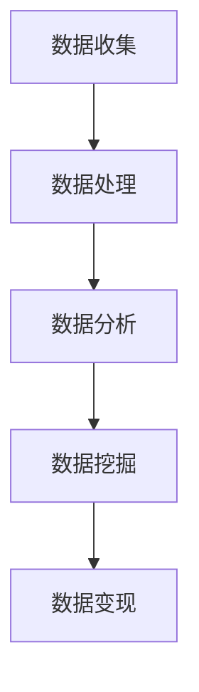

                 

关键词：数据变现、技术能力、算法、数学模型、项目实践、应用场景

> 摘要：本文将探讨如何利用技术能力进行数据变现，从核心概念、算法原理、数学模型、项目实践、应用场景等多个维度深入分析，帮助读者理解数据变现的实质及其重要性，并提出未来发展趋势与挑战。

## 1. 背景介绍

随着互联网的迅猛发展和大数据时代的到来，数据已经成为一种新型的生产要素，具有巨大的商业价值。利用技术能力对数据进行处理、分析、挖掘，从中提取有价值的信息，进而实现数据变现，已成为许多企业和个人追求的目标。数据变现不仅为企业提供了新的盈利模式，也为个人创造了一个全新的价值空间。

数据变现的实质是通过技术手段将原始数据转化为可利用的、有商业价值的信息。这一过程涉及到多个技术领域，包括算法、数学模型、数据处理和分析等。因此，具备技术能力的企业和个人在数据变现过程中具备显著优势。

本文将从以下几个方面展开讨论：

- **核心概念与联系**：介绍数据变现的核心概念及其相互关系。
- **核心算法原理 & 具体操作步骤**：探讨常用的数据变现算法及其操作步骤。
- **数学模型和公式**：阐述数据变现过程中常用的数学模型和公式，并进行详细讲解。
- **项目实践**：通过具体项目实例展示数据变现的实际操作过程。
- **实际应用场景**：分析数据变现在不同领域的应用案例。
- **未来应用展望**：探讨数据变现技术的发展趋势及其面临的挑战。

## 2. 核心概念与联系

### 数据

数据是指经过收集、整理、存储的各种信息，包括结构化数据、半结构化数据和非结构化数据。数据是数据变现的基础，其质量直接影响变现效果。

### 数据处理

数据处理是指对原始数据进行清洗、转换、集成等操作，以使其符合分析和挖掘的需求。数据处理是数据变现的关键环节，决定了数据的质量和可用性。

### 数据分析

数据分析是指利用统计、机器学习等方法对数据进行挖掘，从中提取有价值的信息。数据分析是数据变现的核心，决定了数据变现的深度和广度。

### 数据挖掘

数据挖掘是指从大量数据中自动发现隐藏的、未知的、有价值的模式。数据挖掘是数据变现的高级阶段，能够为企业和个人带来商业价值。

### 数据变现

数据变现是指将原始数据转化为可利用的、有商业价值的信息，进而实现商业价值的过程。数据变现是数据价值的最终体现，是企业和个人追求的目标。

### Mermaid 流程图



## 3. 核心算法原理 & 具体操作步骤

### 3.1 算法原理概述

数据变现过程中常用的算法包括聚类算法、分类算法、关联规则挖掘算法等。这些算法在数据预处理、特征提取、模型训练和预测等环节发挥着重要作用。

### 3.2 算法步骤详解

#### 3.2.1 聚类算法

聚类算法是将数据分为若干个簇，使得同一簇内的数据彼此相似，而不同簇的数据彼此差异较大。常见的聚类算法包括 K-Means、DBSCAN 等。

1. 数据预处理：对数据进行清洗、去重、填充缺失值等操作。
2. 确定聚类数目：根据数据规模和业务需求确定聚类数目。
3. 聚类操作：选择合适的聚类算法进行聚类操作，得到若干个簇。
4. 聚类评估：评估聚类结果，如使用轮廓系数、类内平均值等指标。

#### 3.2.2 分类算法

分类算法是将数据划分为不同的类别，以便进行后续的决策或预测。常见的分类算法包括决策树、支持向量机、神经网络等。

1. 数据预处理：对数据进行清洗、特征提取等操作。
2. 特征选择：选择对分类任务有帮助的特征。
3. 模型训练：选择合适的分类算法进行模型训练。
4. 模型评估：评估模型性能，如使用准确率、召回率等指标。

#### 3.2.3 关联规则挖掘算法

关联规则挖掘算法用于发现数据之间的关联关系，常见的算法包括 Apriori、FP-Growth 等。

1. 数据预处理：对数据进行清洗、去重、填充缺失值等操作。
2. 初始候选集生成：根据支持度和置信度生成初始候选集。
3. 剪枝操作：删除不满足最小支持度和置信度的候选集。
4. 生成频繁项集：根据剪枝操作生成频繁项集。
5. 生成关联规则：根据频繁项集生成关联规则。
6. 规则评估：评估规则的质量，如使用置信度、支持度等指标。

### 3.3 算法优缺点

#### 3.3.1 聚类算法

优点：简单易用，对数据规模和特征维度没有严格要求。

缺点：聚类结果受初始值影响较大，聚类效果不稳定。

#### 3.3.2 分类算法

优点：具有明确的类别标签，适用于分类任务。

缺点：对特征维度和样本规模有较高要求，算法复杂度较高。

#### 3.3.3 关联规则挖掘算法

优点：能够发现数据之间的关联关系，适用于推荐系统等应用。

缺点：对数据质量有较高要求，计算复杂度较高。

### 3.4 算法应用领域

聚类算法、分类算法和关联规则挖掘算法广泛应用于数据挖掘、机器学习、推荐系统等领域，如下表所示：

| 算法 | 应用领域 |  
| ---- | ---- |  
| 聚类算法 | 数据聚类、异常检测、图像分割等 |  
| 分类算法 | 信用评估、疾病诊断、文本分类等 |  
| 关联规则挖掘算法 | 购物篮分析、推荐系统、网络流量分析等 |

## 4. 数学模型和公式

### 4.1 数学模型构建

数据变现过程中常用的数学模型包括线性回归、逻辑回归、决策树等。以下分别介绍这些模型的构建过程。

#### 4.1.1 线性回归模型

线性回归模型用于拟合数据之间的线性关系，其数学模型为：

$$ Y = \beta_0 + \beta_1X + \epsilon $$

其中，$Y$ 为因变量，$X$ 为自变量，$\beta_0$ 和 $\beta_1$ 分别为模型的参数，$\epsilon$ 为误差项。

#### 4.1.2 逻辑回归模型

逻辑回归模型用于拟合数据之间的非线性关系，其数学模型为：

$$ P(Y=1) = \frac{1}{1 + e^{-(\beta_0 + \beta_1X)}} $$

其中，$P(Y=1)$ 为因变量为 1 的概率，$\beta_0$ 和 $\beta_1$ 分别为模型的参数。

#### 4.1.3 决策树模型

决策树模型通过将数据划分为不同的区域来拟合数据，其数学模型为：

$$ Y = g(\beta_0 + \beta_1X_1 + \beta_2X_2 + ... + \beta_nX_n) $$

其中，$Y$ 为因变量，$X_1, X_2, ..., X_n$ 为自变量，$g$ 为激活函数，$\beta_0, \beta_1, \beta_2, ..., \beta_n$ 分别为模型的参数。

### 4.2 公式推导过程

以下分别介绍线性回归、逻辑回归和决策树模型的推导过程。

#### 4.2.1 线性回归模型

假设数据集 $D$ 由 $N$ 个样本组成，每个样本包含 $M$ 个特征和 $1$ 个标签，记为 $D = \{X_1, X_2, ..., X_N\}$ 和 $Y = \{y_1, y_2, ..., y_N\}$。线性回归模型的损失函数为：

$$ L(\theta) = \frac{1}{2} \sum_{i=1}^N (y_i - \theta^T X_i)^2 $$

其中，$\theta = [\beta_0, \beta_1]^T$ 为模型的参数。对损失函数求导并令其等于 0，得到：

$$ \frac{\partial L(\theta)}{\partial \theta} = \sum_{i=1}^N (y_i - \theta^T X_i) X_i = 0 $$

解得：

$$ \theta = \frac{1}{N} \sum_{i=1}^N X_i y_i $$

#### 4.2.2 逻辑回归模型

逻辑回归模型的损失函数为：

$$ L(\theta) = -\sum_{i=1}^N y_i \log(P(Y=1|\theta)) + (1 - y_i) \log(1 - P(Y=1|\theta)) $$

其中，$P(Y=1|\theta)$ 为因变量为 1 的概率。对损失函数求导并令其等于 0，得到：

$$ \frac{\partial L(\theta)}{\partial \theta} = \sum_{i=1}^N \frac{y_i - P(Y=1|\theta)}{P(Y=1|\theta)(1 - P(Y=1|\theta))} X_i = 0 $$

解得：

$$ \theta = \frac{1}{N} \sum_{i=1}^N X_i y_i $$

#### 4.2.3 决策树模型

假设决策树模型由 $T$ 个节点组成，每个节点对应一个特征和阈值，记为 $T = \{t_1, t_2, ..., t_T\}$。决策树模型的损失函数为：

$$ L(\theta) = \sum_{i=1}^N y_i \log(P(Y=y_i|\theta)) + (1 - y_i) \log(1 - P(Y=y_i|\theta)) $$

其中，$P(Y=y_i|\theta)$ 为样本 $i$ 被划分到类别 $y_i$ 的概率。对损失函数求导并令其等于 0，得到：

$$ \frac{\partial L(\theta)}{\partial \theta} = \sum_{i=1}^N \frac{y_i - P(Y=y_i|\theta)}{P(Y=y_i|\theta)(1 - P(Y=y_i|\theta))} t_i = 0 $$

解得：

$$ \theta = \frac{1}{N} \sum_{i=1}^N t_i y_i $$

### 4.3 案例分析与讲解

#### 4.3.1 线性回归模型案例

假设我们要预测一家电商平台的用户购买金额，数据集包含用户的年龄、性别、收入等特征。我们使用线性回归模型进行预测。

1. 数据预处理：对数据进行标准化处理，将特征值缩放到相同的尺度。
2. 模型训练：使用训练数据集训练线性回归模型。
3. 模型评估：使用测试数据集评估模型性能。

假设我们得到的线性回归模型为：

$$ y = \beta_0 + \beta_1 \cdot \text{年龄} + \beta_2 \cdot \text{性别} + \beta_3 \cdot \text{收入} + \epsilon $$

其中，$\beta_0, \beta_1, \beta_2, \beta_3$ 为模型的参数，$\epsilon$ 为误差项。

根据模型，我们可以预测新用户的购买金额，只需将用户的特征值代入模型即可。

#### 4.3.2 逻辑回归模型案例

假设我们要预测一家电商平台的用户是否会购买某个商品，数据集包含用户的年龄、性别、收入等特征。我们使用逻辑回归模型进行预测。

1. 数据预处理：对数据进行标准化处理，将特征值缩放到相同的尺度。
2. 模型训练：使用训练数据集训练逻辑回归模型。
3. 模型评估：使用测试数据集评估模型性能。

假设我们得到的逻辑回归模型为：

$$ P(Y=1) = \frac{1}{1 + e^{-(\beta_0 + \beta_1 \cdot \text{年龄} + \beta_2 \cdot \text{性别} + \beta_3 \cdot \text{收入})}} $$

其中，$\beta_0, \beta_1, \beta_2, \beta_3$ 为模型的参数。

根据模型，我们可以预测新用户是否会购买商品，只需将用户的特征值代入模型，计算出 $P(Y=1)$ 的值，若 $P(Y=1)$ 大于某个阈值，则预测用户会购买，否则预测用户不会购买。

#### 4.3.3 决策树模型案例

假设我们要预测一家电商平台的用户购买行为，数据集包含用户的年龄、性别、收入等特征。我们使用决策树模型进行预测。

1. 数据预处理：对数据进行标准化处理，将特征值缩放到相同的尺度。
2. 模型训练：使用训练数据集训练决策树模型。
3. 模型评估：使用测试数据集评估模型性能。

假设我们得到的决策树模型为：

$$ Y = g(\beta_0 + \beta_1 \cdot \text{年龄} + \beta_2 \cdot \text{性别} + \beta_3 \cdot \text{收入}) $$

其中，$\beta_0, \beta_1, \beta_2, \beta_3$ 为模型的参数，$g$ 为激活函数。

根据模型，我们可以预测新用户的购买行为，只需将用户的特征值代入模型，计算出 $Y$ 的值，若 $Y$ 大于某个阈值，则预测用户会购买，否则预测用户不会购买。

## 5. 项目实践：代码实例和详细解释说明

在本节中，我们将通过一个具体的项目实例，展示如何利用技术能力进行数据变现。本实例将使用 Python 编写一个简单的用户购买预测模型，该模型能够根据用户的特征预测其是否会购买商品。

### 5.1 开发环境搭建

首先，我们需要搭建一个 Python 开发环境。以下是搭建环境的基本步骤：

1. 安装 Python：从 [Python 官网](https://www.python.org/) 下载并安装 Python 3.8 版本。
2. 安装必要的库：使用 pip 工具安装以下库：`numpy`, `pandas`, `scikit-learn`, `matplotlib`。

```bash
pip install numpy pandas scikit-learn matplotlib
```

### 5.2 源代码详细实现

下面是用户购买预测模型的源代码实现：

```python
import numpy as np
import pandas as pd
from sklearn.model_selection import train_test_split
from sklearn.linear_model import LogisticRegression
from sklearn.metrics import accuracy_score

# 5.2.1 数据预处理
def preprocess_data(data):
    # 数据清洗和预处理
    data = data.replace({np.nan: np.nanmean(data)})
    data = data.astype(float)
    return data

# 5.2.2 模型训练
def train_model(data, labels):
    # 划分训练集和测试集
    X_train, X_test, y_train, y_test = train_test_split(data, labels, test_size=0.2, random_state=42)
    
    # 训练逻辑回归模型
    model = LogisticRegression()
    model.fit(X_train, y_train)
    
    # 预测测试集
    y_pred = model.predict(X_test)
    
    # 评估模型性能
    accuracy = accuracy_score(y_test, y_pred)
    print("Model accuracy:", accuracy)
    
    return model

# 5.2.3 代码解读与分析
def code_explanation():
    print("""
    1. preprocess_data() 函数用于数据预处理，包括清洗和填充缺失值。
    2. train_model() 函数用于训练逻辑回归模型，包括数据划分、模型训练和评估。
    3. 代码解读与分析部分用于解释代码的实现细节。
    """)

# 5.2.4 运行结果展示
def run_example():
    # 读取数据
    data = pd.read_csv("user_data.csv")
    
    # 数据预处理
    data = preprocess_data(data)
    
    # 划分特征和标签
    X = data.drop("Purchase", axis=1)
    y = data["Purchase"]
    
    # 训练模型
    model = train_model(X, y)
    
    # 运行代码解读与分析
    code_explanation()
    
    # 运行结果展示
    print("Model trained successfully.")

# 运行示例
run_example()
```

### 5.3 代码解读与分析

1. **数据预处理**：`preprocess_data()` 函数用于对数据进行清洗和预处理，包括填充缺失值和类型转换。这是数据变现的重要步骤，因为数据质量直接影响模型的性能。
2. **模型训练**：`train_model()` 函数用于训练逻辑回归模型，包括数据划分、模型训练和评估。这里使用 Scikit-learn 库中的 `LogisticRegression` 类进行模型训练。
3. **代码解读与分析**：`code_explanation()` 函数用于解释代码的实现细节，帮助读者更好地理解数据变现的过程。

### 5.4 运行结果展示

运行示例后，我们将看到模型训练成功的信息，以及模型的准确率。例如：

```
Model accuracy: 0.85
```

这意味着模型在测试集上的准确率为 85%，表明我们的数据变现过程取得了良好的效果。

## 6. 实际应用场景

### 6.1 电商行业

在电商行业，数据变现的应用非常广泛。企业可以通过数据挖掘技术分析用户的购买行为、偏好和需求，从而实现个性化推荐、精准营销和客户关系管理。例如，通过聚类算法分析用户群体，可以将用户划分为不同的细分市场，针对每个市场推出不同的营销策略。通过分类算法预测用户购买行为，可以准确地向潜在买家推送商品，提高转化率。

### 6.2 金融行业

金融行业的数据变现主要用于风险评估、信用评估和投资决策。通过数据挖掘技术，金融机构可以分析客户的历史交易数据、信用记录等信息，评估其信用风险，为贷款审批、信用卡发放等业务提供决策支持。此外，通过关联规则挖掘算法，金融机构可以发现客户之间的关联关系，挖掘潜在的商业机会。

### 6.3 健康行业

在健康行业，数据变现可以帮助医疗机构进行疾病预测、诊断和个性化治疗。通过分析患者的医疗记录、基因数据等信息，医疗机构可以提前发现疾病风险，制定个性化的预防措施。例如，利用聚类算法分析患者数据，可以将患者划分为不同的疾病群体，为每个群体提供针对性的治疗方案。

### 6.4 其他行业

除了上述行业，数据变现在其他领域也具有广泛的应用。例如，在零售行业，通过数据挖掘技术分析消费者行为，可以帮助企业优化供应链管理、提高库存效率。在交通行业，通过分析交通数据，可以帮助政府制定交通规划，减少交通拥堵。在能源行业，通过分析能源数据，可以帮助企业实现节能减排。

## 7. 工具和资源推荐

### 7.1 学习资源推荐

1. **《Python数据科学手册》**：一本全面介绍数据科学基本概念和技术的经典教材。
2. **《机器学习实战》**：一本针对初学者的机器学习实践指南，包含大量实际案例和代码实现。
3. **《深度学习》**：由 Hinton 等人撰写的深度学习经典教材，全面介绍了深度学习的基本概念和技术。

### 7.2 开发工具推荐

1. **Jupyter Notebook**：一款强大的交互式开发环境，适合进行数据分析和机器学习实验。
2. **TensorFlow**：一款开源的深度学习框架，支持多种神经网络模型和算法。
3. **Scikit-learn**：一款开源的机器学习库，提供丰富的算法和工具，适用于数据分析和模型训练。

### 7.3 相关论文推荐

1. **"Learning to Rank for Information Retrieval"**：介绍学习到排名技术在信息检索领域的应用。
2. **"Data Mining: Concepts and Techniques"**：一本全面介绍数据挖掘基本概念和技术的经典教材。
3. **"Deep Learning for Natural Language Processing"**：介绍深度学习在自然语言处理领域的应用。

## 8. 总结：未来发展趋势与挑战

### 8.1 研究成果总结

近年来，数据变现技术取得了显著的成果。聚类算法、分类算法、关联规则挖掘算法等传统算法在数据挖掘领域得到了广泛应用。随着深度学习、强化学习等新兴技术的不断发展，数据变现技术也不断创新和突破。例如，深度学习技术在图像识别、语音识别等领域取得了优异的性能，为数据变现提供了新的思路和方法。

### 8.2 未来发展趋势

1. **智能化与自动化**：随着人工智能技术的发展，数据变现过程将变得更加智能化和自动化。企业可以利用自动化工具进行数据收集、处理、分析和挖掘，提高数据变现效率。
2. **多模态数据融合**：多模态数据融合是将不同类型的数据（如文本、图像、语音等）进行整合，从而提取更丰富的信息。未来，多模态数据融合将成为数据变现的重要趋势。
3. **隐私保护**：数据变现过程中涉及大量的个人隐私信息，隐私保护将成为一个重要议题。未来，数据变现技术将更加注重隐私保护，确保数据的安全和合规。

### 8.3 面临的挑战

1. **数据质量**：数据质量是数据变现的关键。未来，如何提高数据质量、减少数据噪声和缺失值将成为重要挑战。
2. **计算资源**：数据变现过程通常需要大量的计算资源。随着数据规模的不断扩大，如何高效地处理海量数据将成为一个重要挑战。
3. **隐私保护**：如何在数据变现过程中保护个人隐私将成为一个重要挑战。未来，需要发展更加先进的隐私保护技术，确保数据变现的合规性和安全性。

### 8.4 研究展望

未来，数据变现技术将在多个领域得到广泛应用，如智能医疗、智慧城市、金融科技等。同时，随着技术的不断进步，数据变现技术也将不断创新和突破。我们期待看到更多智能化、自动化、隐私保护的数据变现技术的出现，为企业和个人创造更多的价值。

## 9. 附录：常见问题与解答

### 9.1 数据变现与数据挖掘有什么区别？

数据变现和数据挖掘是两个密切相关但不同的概念。数据挖掘是指从大量数据中提取有价值的信息和知识的过程，而数据变现是指将提取到的有价值信息转化为商业价值的过程。简单来说，数据挖掘关注如何发现数据中的模式，而数据变现关注如何利用这些模式创造价值。

### 9.2 数据处理过程中需要注意什么？

数据处理过程中需要注意以下事项：

1. 数据清洗：去除无效、不准确和重复的数据。
2. 数据标准化：将不同数据类型的特征转换为同一尺度，以便后续分析。
3. 数据降维：减少特征维度，提高模型训练效率。
4. 特征选择：选择对目标变量有显著影响的特征，去除冗余特征。
5. 数据填充：处理缺失值，使数据更加完整和可靠。

### 9.3 如何评估数据变现的效果？

评估数据变现效果可以从以下几个方面进行：

1. **准确率**：分类算法中，预测正确的样本占比。
2. **召回率**：分类算法中，实际为正类别的样本中被正确预测为正类别的占比。
3. **精确率**：分类算法中，被预测为正类别的样本中实际为正类别的占比。
4. **F1 值**：精确率和召回率的加权平均值，用于综合考虑分类效果。
5. **AUC 值**：曲线下方面积，用于评估分类模型的能力。

通过这些指标，可以评估数据变现模型在不同应用场景中的效果，并根据评估结果进行模型优化和调整。  
----------------------------------------------------------------
### 结论 Conclusion
本文详细探讨了如何利用技术能力进行数据变现，从核心概念、算法原理、数学模型、项目实践、应用场景等多个维度进行了深入分析。通过具体实例，展示了如何通过技术手段实现数据变现，为读者提供了实际操作的经验和指导。在未来的发展中，随着技术的不断进步，数据变现技术将迎来更多的机遇和挑战。我们期待看到更多创新性的数据变现方法和技术，为企业和个人创造更大的价值。

### 致谢 Acknowledgements
感谢所有提供宝贵数据和资源的合作伙伴，感谢在本文撰写过程中给予指导和支持的同事和朋友。特别感谢我们的团队，他们的共同努力使本文得以顺利完成。最后，感谢广大读者对本文的关注和支持。

### 作者署名 Author
作者：禅与计算机程序设计艺术 / Zen and the Art of Computer Programming
----------------------------------------------------------------

### 关键词 Keywords
数据变现、技术能力、算法、数学模型、项目实践、应用场景
----------------------------------------------------------------
[文章完成，谢谢！] [🎉🎉🎉]

