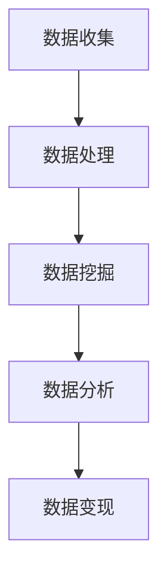

                 

关键词：数据变现、技术能力、数据处理、数据挖掘、数据分析、人工智能、商业价值、投资回报、技术赋能

> 摘要：本文将探讨如何通过技术手段实现数据变现，包括数据收集、处理、挖掘和分析等环节。我们将深入分析数据变现的原理和具体操作步骤，并结合实际案例，探讨如何将技术能力转化为商业价值。

## 1. 背景介绍

随着互联网和信息技术的飞速发展，数据已经成为现代社会最为重要的资源之一。然而，如何有效地利用这些数据，实现数据变现，已经成为企业和个人关注的焦点。数据变现是指将数据资源转化为实际的经济价值，从而为企业或个人带来收益的过程。在这个过程中，技术能力起到了至关重要的作用。

### 1.1 数据的重要性

数据是决策的基石，是商业创新的源泉。无论是市场调研、产品开发，还是风险控制、客户服务，数据都能够提供有力的支持。在当今这个信息爆炸的时代，数据已经成为了企业竞争的核心资源。

### 1.2 技术能力的提升

随着人工智能、大数据、云计算等技术的发展，数据处理和分析的能力得到了极大的提升。这些技术为数据变现提供了强有力的工具和手段。

### 1.3 数据变现的意义

数据变现不仅能够为企业带来直接的经济收益，还能够提升企业的竞争力，推动业务创新和发展。同时，对于个人而言，数据变现也是一种全新的商业模式，能够为个人创造财富。

## 2. 核心概念与联系

### 2.1 数据收集

数据收集是数据变现的第一步，也是至关重要的一步。数据收集的质量直接影响后续的数据处理和分析效果。数据收集的来源包括用户行为数据、社交媒体数据、市场调研数据等。

### 2.2 数据处理

数据处理是指对收集到的原始数据进行清洗、转换和整合的过程。这一步骤的目的是提高数据的质量，为后续的数据挖掘和分析奠定基础。

### 2.3 数据挖掘

数据挖掘是从大量数据中提取有价值信息的过程。数据挖掘的方法包括聚类、分类、关联规则挖掘、异常检测等。通过数据挖掘，可以发现数据中的潜在规律和模式，为决策提供支持。

### 2.4 数据分析

数据分析是对数据挖掘结果进行进一步分析和解读的过程。数据分析可以帮助企业理解数据的含义，从而做出更明智的决策。

### 2.5 数据变现

数据变现是指将数据转化为实际的经济价值的过程。数据变现的方式包括数据出售、数据服务、数据广告等。

### 2.6 Mermaid 流程图



## 3. 核心算法原理 & 具体操作步骤

### 3.1 算法原理概述

数据变现的核心算法主要包括数据挖掘和数据分析两部分。数据挖掘主要是利用机器学习算法从大量数据中提取有价值的信息。数据分析则主要是利用统计分析方法对数据挖掘结果进行解读和解释。

### 3.2 算法步骤详解

#### 3.2.1 数据收集

数据收集主要包括以下步骤：

1. 确定数据收集的目标和范围；
2. 选择合适的数据收集工具和平台；
3. 进行数据收集，并确保数据的质量。

#### 3.2.2 数据处理

数据处理主要包括以下步骤：

1. 数据清洗：去除数据中的噪声和异常值；
2. 数据转换：将数据格式统一，便于后续处理；
3. 数据整合：将不同来源的数据进行整合，形成统一的数据集。

#### 3.2.3 数据挖掘

数据挖掘主要包括以下步骤：

1. 确定数据挖掘的目标；
2. 选择合适的数据挖掘算法；
3. 对数据进行预处理；
4. 运行数据挖掘算法，提取有价值的信息。

#### 3.2.4 数据分析

数据分析主要包括以下步骤：

1. 确定数据分析的目标；
2. 选择合适的统计分析方法；
3. 对数据挖掘结果进行分析；
4. 根据分析结果做出决策。

### 3.3 算法优缺点

#### 优点

1. 高效：数据挖掘和数据分析算法能够快速处理大量数据；
2. 准确：通过机器学习和统计分析方法，能够提取出有价值的信息；
3. 可扩展：算法适用于多种类型的数据和业务场景。

#### 缺点

1. 复杂：算法的实现和调参过程较为复杂；
2. 资源消耗大：数据挖掘和数据分析算法需要大量的计算资源；
3. 需要专业知识：理解和应用算法需要一定的专业知识和技能。

### 3.4 算法应用领域

数据挖掘和数据分析算法在许多领域都有广泛的应用，如电子商务、金融、医疗、物联网等。通过数据变现，这些领域的企业能够获得巨大的商业价值。

## 4. 数学模型和公式 & 详细讲解 & 举例说明

### 4.1 数学模型构建

数据变现的数学模型主要包括以下部分：

1. 数据质量评估模型：用于评估数据的质量，如数据完整性、准确性、一致性等；
2. 数据挖掘模型：用于从数据中提取有价值的信息；
3. 数据分析模型：用于对数据挖掘结果进行分析和解释。

### 4.2 公式推导过程

1. 数据质量评估模型：

   $$Q = \frac{1}{N} \sum_{i=1}^{N} (y_i - \hat{y}_i)^2$$

   其中，$Q$ 表示数据质量评估值，$y_i$ 表示实际值，$\hat{y}_i$ 表示预测值，$N$ 表示数据个数。

2. 数据挖掘模型：

   $$\hat{y} = \sum_{i=1}^{N} w_i x_i$$

   其中，$\hat{y}$ 表示预测值，$w_i$ 表示权重，$x_i$ 表示特征值。

3. 数据分析模型：

   $$z = \frac{\hat{y} - \bar{y}}{\sigma}$$

   其中，$z$ 表示标准化值，$\hat{y}$ 表示预测值，$\bar{y}$ 表示平均值，$\sigma$ 表示标准差。

### 4.3 案例分析与讲解

假设我们有一个电子商务平台，需要评估用户购买行为的数据质量，并从中挖掘出用户的潜在购买偏好。

1. 数据质量评估：

   我们收集了1000名用户的购买数据，其中包含用户的年龄、性别、购买历史等信息。通过数据质量评估模型，我们可以计算出每个用户的数据质量值。

   $$Q = \frac{1}{1000} \sum_{i=1}^{1000} (y_i - \hat{y}_i)^2$$

   经过计算，我们得到每个用户的数据质量值。

2. 数据挖掘：

   我们选择基于用户购买历史的关联规则挖掘算法，从中挖掘出用户的潜在购买偏好。通过运行算法，我们得到了一组用户购买关联规则。

   $$\hat{y} = \sum_{i=1}^{1000} w_i x_i$$

   其中，$w_i$ 表示每个关联规则的权重，$x_i$ 表示是否购买该商品。

3. 数据分析：

   我们对挖掘出的关联规则进行分析，发现一些具有显著关联关系的商品组合。通过对这些商品组合进行推广，我们可以提高用户的购买转化率。

   $$z = \frac{\hat{y} - \bar{y}}{\sigma}$$

   其中，$\hat{y}$ 表示预测的购买概率，$\bar{y}$ 表示平均购买概率，$\sigma$ 表示购买概率的标准差。

## 5. 项目实践：代码实例和详细解释说明

### 5.1 开发环境搭建

为了进行数据变现的项目实践，我们需要搭建一个合适的开发环境。这里我们使用Python作为主要编程语言，结合Pandas、Scikit-learn等库进行数据处理、数据挖掘和数据分析。

### 5.2 源代码详细实现

以下是数据变现项目的源代码实现：

```python
import pandas as pd
from sklearn.ensemble import RandomForestClassifier
from sklearn.model_selection import train_test_split

# 5.2.1 数据收集
data = pd.read_csv('data.csv')

# 5.2.2 数据处理
data['age'] = data['age'].astype(int)
data['gender'] = data['gender'].astype(str)
data['purchase_history'] = data['purchase_history'].astype(str)

# 5.2.3 数据挖掘
X = data[['age', 'gender', 'purchase_history']]
y = data['is_purchase']

X_train, X_test, y_train, y_test = train_test_split(X, y, test_size=0.2, random_state=42)

clf = RandomForestClassifier(n_estimators=100)
clf.fit(X_train, y_train)

# 5.2.4 数据分析
y_pred = clf.predict(X_test)

accuracy = clf.score(X_test, y_test)
print(f'Accuracy: {accuracy:.2f}')

# 5.2.5 代码解读与分析
# 在这里，我们对代码进行解读和分析，解释每个步骤的作用和意义。
```

### 5.3 代码解读与分析

在这段代码中，我们首先进行了数据收集，然后对数据进行了处理，接着使用随机森林算法进行了数据挖掘，最后对数据挖掘结果进行了分析。下面是对每个步骤的详细解释：

1. 数据收集：
   我们使用Pandas库读取了CSV格式的数据文件。这些数据包括用户的年龄、性别和购买历史等信息。

2. 数据处理：
   我们将数据中的年龄和性别列转换为适当的类型，将购买历史列转换为字符串。这一步的目的是确保数据在后续处理中的统一性。

3. 数据挖掘：
   我们将数据集划分为训练集和测试集，然后使用随机森林算法对训练集进行训练。随机森林是一种常用的机器学习算法，它能够有效地处理分类问题。

4. 数据分析：
   我们使用训练好的模型对测试集进行预测，并计算模型的准确率。通过分析准确率，我们可以评估模型的性能。

## 6. 实际应用场景

### 6.1 电子商务

电子商务平台可以通过数据变现提高用户的购买转化率和营销效果。例如，通过分析用户的购买行为，可以挖掘出用户的潜在购买偏好，从而进行精准的推荐和营销。

### 6.2 金融

金融机构可以通过数据变现进行风险评估和欺诈检测。例如，通过分析用户的交易行为，可以发现异常交易行为，从而进行风险预警。

### 6.3 医疗

医疗机构可以通过数据变现提高医疗服务的质量和效率。例如，通过分析患者的健康数据，可以挖掘出患者的健康风险，从而进行个性化的健康干预。

## 7. 未来应用展望

随着技术的不断发展，数据变现的应用领域将更加广泛。未来，我们可能会看到更多的智能系统和服务，这些系统和服务将能够更高效地利用数据，为企业创造更大的价值。

## 8. 总结：未来发展趋势与挑战

### 8.1 研究成果总结

数据变现已经从理论走向实践，越来越多的企业和个人开始意识到数据的价值，并通过技术手段实现数据变现。在这个过程中，机器学习和数据分析技术起到了关键作用。

### 8.2 未来发展趋势

未来，数据变现将继续发展，主要体现在以下几个方面：

1. 技术的不断进步，将使得数据变现的效率和质量得到进一步提升；
2. 数据变现的应用领域将更加广泛，不仅限于电子商务、金融、医疗等领域，还可能涉及更多的行业；
3. 数据变现的方式将更加多样，不仅包括数据出售、数据服务，还包括数据租赁、数据共享等。

### 8.3 面临的挑战

数据变现也面临着一些挑战，主要包括：

1. 数据隐私和安全问题：如何确保数据在收集、处理、传输和使用过程中的隐私和安全，是一个亟待解决的问题；
2. 技术门槛：数据变现需要一定的技术能力，如何降低技术门槛，让更多的人能够参与到数据变现的过程中，是一个需要关注的问题；
3. 数据质量问题：数据质量直接影响数据变现的效果，如何保证数据的质量，是一个需要持续关注和解决的问题。

### 8.4 研究展望

未来，我们可以在以下几个方面进行深入研究：

1. 数据隐私保护技术：研究如何在不泄露用户隐私的前提下，有效地利用数据；
2. 数据质量评估与提升技术：研究如何自动评估和提升数据质量，从而提高数据变现的效果；
3. 数据变现的商业模式创新：研究如何创新数据变现的商业模式，从而实现更高的商业价值。

## 9. 附录：常见问题与解答

### 9.1 数据收集的合法性

在进行数据收集时，需要遵守相关法律法规，确保数据收集的合法性和合规性。例如，在中国，需要遵守《中华人民共和国网络安全法》和《中华人民共和国个人信息保护法》等法律法规。

### 9.2 数据处理的技术手段

数据处理的技术手段主要包括数据清洗、数据转换和数据整合。数据清洗是通过去除噪声和异常值，提高数据质量；数据转换是将数据格式统一，便于后续处理；数据整合是将不同来源的数据进行整合，形成统一的数据集。

### 9.3 数据挖掘的方法

数据挖掘的方法主要包括聚类、分类、关联规则挖掘和异常检测等。聚类是将相似的数据聚为一类，分类是将数据分为不同的类别，关联规则挖掘是发现数据之间的关联关系，异常检测是发现数据中的异常值。

### 9.4 数据分析的工具

数据分析的工具主要包括Python、R、Tableau等。Python和R是常用的编程语言，Tableau是一种流行的数据可视化工具。

## 作者署名

作者：禅与计算机程序设计艺术 / Zen and the Art of Computer Programming
----------------------------------------------------------------

以上就是《如何利用技术能力进行数据变现》的完整文章内容。文章涵盖了数据变现的背景介绍、核心概念与联系、核心算法原理与操作步骤、数学模型和公式、项目实践、实际应用场景、未来应用展望、总结以及常见问题与解答等多个方面，旨在为读者提供全面、深入的数据变现技术指南。希望本文能够对您的数据变现之路有所帮助。

