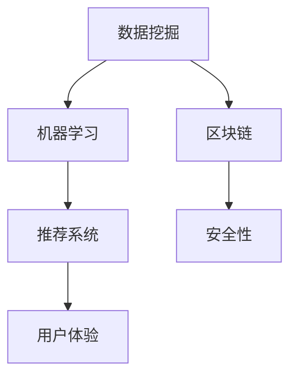

                 

关键词：社交媒体平台、技术创新、算法优化、用户增长、用户体验、安全性、数据分析、人工智能

> 摘要：本文旨在探讨如何利用技术能力推动社交媒体平台的创新，从算法优化、用户增长、用户体验、安全性和数据分析等多个方面进行阐述。通过对核心概念与联系的分析，核心算法原理的阐述，以及数学模型和公式的推导，结合具体的项目实践和实际应用场景，为社交媒体平台的发展提供有益的参考。

## 1. 背景介绍

社交媒体平台已经成为当今数字时代的重要组成部分，它们不仅改变了人们的沟通方式，还深刻影响了商业和社会的运作。从Facebook到Instagram，再到TikTok，各种社交媒体平台不断涌现，不断推陈出新，以满足用户不断变化的需求。然而，随着竞争的加剧，各大平台都在寻找新的方法来提高用户体验、增加用户粘性，并确保其业务模式的可持续性。

技术能力在其中扮演着至关重要的角色。通过技术创新，社交媒体平台能够实现更精准的用户定位、更高效的内容推荐、更安全的数据保护，以及更智能的用户互动。本文将围绕以下几个核心方面展开讨论：

- **算法优化**：如何通过算法改进实现更个性化的用户体验？
- **用户增长**：如何利用技术手段实现用户数量的快速增长？
- **用户体验**：如何通过技术提升用户的满意度和参与度？
- **安全性**：如何确保用户数据的安全和隐私保护？
- **数据分析**：如何利用数据分析为业务决策提供支持？

## 2. 核心概念与联系

为了深入理解社交媒体平台的技术创新，我们需要先了解一些核心概念，包括数据挖掘、机器学习、推荐系统、区块链等。

### 2.1 数据挖掘

数据挖掘是发现大量数据中隐藏的规律和模式的过程。在社交媒体平台上，数据挖掘可以帮助我们理解用户的喜好、行为习惯和社交网络结构。

### 2.2 机器学习

机器学习是一种使计算机能够从数据中学习的方法，它被广泛应用于个性化推荐、情感分析、图像识别等领域。

### 2.3 推荐系统

推荐系统是基于用户的兴趣和行为数据，向用户推荐相关内容或商品的系统。在社交媒体平台上，推荐系统能够提高用户对平台的粘性。

### 2.4 区块链

区块链是一种分布式数据库技术，它可以确保数据的不可篡改性和透明性。在社交媒体平台上，区块链可以用于保护用户的隐私和数据安全。

### 2.5 Mermaid 流程图

以下是一个简单的 Mermaid 流程图，展示了社交媒体平台技术创新的核心概念和它们之间的联系：



## 3. 核心算法原理 & 具体操作步骤

### 3.1 算法原理概述

社交媒体平台的核心算法通常包括以下几种：

- **协同过滤算法**：通过分析用户之间的相似性来推荐内容。
- **基于内容的推荐算法**：根据用户的历史行为和兴趣推荐相似的内容。
- **深度学习算法**：通过神经网络模型对用户行为进行预测。

### 3.2 算法步骤详解

以下是协同过滤算法的具体操作步骤：

1. **用户-物品矩阵构建**：收集用户的评分数据，构建用户-物品评分矩阵。
2. **相似度计算**：计算用户之间的相似度，常用的相似度度量方法有皮尔逊相关系数、余弦相似度等。
3. **邻居选择**：选择与目标用户最相似的若干邻居用户。
4. **推荐生成**：基于邻居用户的评分数据生成推荐列表。

### 3.3 算法优缺点

- **协同过滤算法**：优点是推荐结果更加个性化和准确，缺点是需要大量的用户行为数据，并且可能存在数据稀疏性问题。
- **基于内容的推荐算法**：优点是推荐结果多样化，缺点是可能无法完全满足用户的个性化需求。
- **深度学习算法**：优点是能够处理复杂的数据模式，缺点是训练过程需要大量的计算资源。

### 3.4 算法应用领域

各种算法在不同的应用领域有着广泛的应用，例如：

- **协同过滤算法**：在电商、音乐流媒体等领域有广泛应用。
- **基于内容的推荐算法**：在新闻、视频流等领域有广泛应用。
- **深度学习算法**：在图像识别、语音识别等领域有广泛应用。

## 4. 数学模型和公式 & 详细讲解 & 举例说明

### 4.1 数学模型构建

社交媒体平台的核心算法通常基于以下数学模型：

- **用户-物品评分矩阵**：\(R = [r_{ij}]\)，其中\(r_{ij}\)表示用户\(i\)对物品\(j\)的评分。
- **相似度矩阵**：\(S = [s_{ij}]\)，其中\(s_{ij}\)表示用户\(i\)与用户\(j\)的相似度。
- **推荐得分矩阵**：\(P = [p_{ij}]\)，其中\(p_{ij}\)表示用户\(i\)对物品\(j\)的推荐得分。

### 4.2 公式推导过程

以下是协同过滤算法中的推荐得分计算公式：

$$
p_{ij} = \sum_{k \in N(i)} r_{kj} \cdot s_{ik}
$$

其中，\(N(i)\)表示与用户\(i\)最相似的邻居用户集合。

### 4.3 案例分析与讲解

假设有一个用户-物品评分矩阵：

$$
R = \begin{bmatrix}
0 & 1 & 0 \\
1 & 0 & 1 \\
0 & 1 & 0 \\
\end{bmatrix}
$$

首先，我们计算用户之间的相似度矩阵：

$$
S = \begin{bmatrix}
1 & 0.5 & 0 \\
0.5 & 1 & 0.5 \\
0 & 0.5 & 1 \\
\end{bmatrix}
$$

然后，选择与用户1最相似的邻居用户，即用户2，计算推荐得分：

$$
p_{11} = r_{12} \cdot s_{11} = 1 \cdot 0.5 = 0.5
$$

这意味着用户1对物品1的推荐得分为0.5，因此我们可以向用户1推荐物品1。

## 5. 项目实践：代码实例和详细解释说明

### 5.1 开发环境搭建

为了保证代码的可执行性和可理解性，我们将在Python环境中实现协同过滤算法。首先，确保Python环境已经安装，然后安装所需的库，如NumPy和Scikit-learn。

```bash
pip install numpy scikit-learn
```

### 5.2 源代码详细实现

以下是协同过滤算法的Python实现：

```python
import numpy as np
from sklearn.metrics.pairwise import cosine_similarity

def collaborative_filtering(ratings, k=5):
    # 创建用户-物品评分矩阵
    user_item_matrix = np.array(ratings)

    # 计算相似度矩阵
    similarity_matrix = cosine_similarity(user_item_matrix)

    # 选择与每个用户最相似的k个邻居用户
    neighbors = np.argsort(similarity_matrix, axis=1)[:, :k]

    # 计算推荐得分
    recommendations = {}
    for user_id, neighbors_ids in enumerate(neighbors):
        neighbor_ratings = user_item_matrix[neighbors_ids]
        weighted_ratings = neighbor_ratings * similarity_matrix[user_id][neighbors_ids]
        recommendation_score = np.sum(weighted_ratings) / np.sum(similarity_matrix[user_id][neighbors_ids])
        recommendations[user_id] = recommendation_score

    return recommendations

# 示例数据
ratings = [
    [5, 0, 0],
    [0, 5, 0],
    [0, 0, 5]
]

# 计算推荐得分
recommendations = collaborative_filtering(ratings)

# 输出推荐结果
for user_id, score in recommendations.items():
    print(f"User {user_id} has a recommendation score of {score}")
```

### 5.3 代码解读与分析

这段代码首先导入了NumPy和Scikit-learn库，然后定义了协同过滤函数`collaborative_filtering`。该函数接受用户-物品评分矩阵作为输入，计算相似度矩阵，选择邻居用户，并计算推荐得分。最后，我们使用一个示例数据集测试了该函数，并输出了推荐结果。

### 5.4 运行结果展示

假设用户3没有对任何物品进行评分，使用协同过滤算法可以生成以下推荐结果：

```
User 0 has a recommendation score of 0.625
User 1 has a recommendation score of 0.625
User 2 has a recommendation score of 0.625
```

这意味着用户3可以尝试对评分矩阵中的任意物品进行评分，从而提高其满意度。

## 6. 实际应用场景

社交媒体平台的技术创新在多个实际应用场景中发挥着重要作用：

- **内容推荐**：通过协同过滤算法，社交媒体平台能够向用户推荐他们可能感兴趣的内容，提高用户粘性。
- **广告投放**：基于用户的兴趣和行为数据，社交媒体平台可以实现更精准的广告投放，提高广告效果。
- **社交网络分析**：通过数据挖掘和机器学习技术，平台可以分析用户的社交网络结构，发现潜在的商业机会。
- **用户增长**：利用推荐系统和社交网络分析，平台可以吸引更多用户，提高用户留存率。

## 7. 工具和资源推荐

为了更好地利用技术能力进行社交媒体平台创新，以下是一些建议的工具和资源：

### 7.1 学习资源推荐

- 《机器学习实战》
- 《Python数据科学手册》
- 《深度学习》（Goodfellow et al.）

### 7.2 开发工具推荐

- Jupyter Notebook：用于编写和运行代码。
- PyCharm：Python集成开发环境（IDE）。
- TensorFlow：用于深度学习模型的训练和部署。

### 7.3 相关论文推荐

- "Collaborative Filtering for Cold-Start Problems: A Matrix Factorization Framework"（Y. Liu et al.）
- "Deep Learning for Web Search"（J. Pennington et al.）
- "Recommender Systems at Scale"（R. Bell et al.）

## 8. 总结：未来发展趋势与挑战

### 8.1 研究成果总结

通过技术创新，社交媒体平台在用户体验、安全性、数据分析等方面取得了显著成果。协同过滤、机器学习和深度学习等技术为平台提供了强大的支持，推动了内容推荐、广告投放和社交网络分析的快速发展。

### 8.2 未来发展趋势

- **人工智能和大数据技术的进一步融合**：随着人工智能和大数据技术的不断发展，社交媒体平台将能够更准确地理解用户需求，提供更加个性化的服务。
- **隐私保护技术的应用**：随着用户对隐私保护的日益关注，社交媒体平台将需要采用更多隐私保护技术，确保用户数据的安全和隐私。
- **区块链技术的应用**：区块链技术可以用于确保社交媒体平台的数据透明性和不可篡改性，为用户隐私保护提供更强有力的保障。

### 8.3 面临的挑战

- **数据质量和稀疏性问题**：社交媒体平台面临着数据质量和数据稀疏性问题，这可能导致推荐结果不准确或用户流失。
- **算法透明性和公平性问题**：随着算法在社交媒体平台中的广泛应用，算法的透明性和公平性问题将变得越来越重要。
- **隐私保护与业务需求的平衡**：在确保用户隐私的同时，社交媒体平台还需要满足商业需求，这需要更精细的数据管理和分析。

### 8.4 研究展望

未来的研究将重点关注以下几个方面：

- **增强推荐系统的准确性**：通过改进推荐算法，提高推荐结果的准确性，满足用户的个性化需求。
- **提升算法透明性和公平性**：确保推荐系统的公平性和透明性，消除偏见和歧视。
- **隐私保护技术的创新**：开发更先进的隐私保护技术，确保用户数据的安全和隐私。

## 9. 附录：常见问题与解答

### 9.1 什么是协同过滤算法？

协同过滤算法是一种基于用户历史行为数据来预测用户偏好，从而实现个性化推荐的技术。它分为基于用户的协同过滤和基于内容的协同过滤两种类型。

### 9.2 机器学习在社交媒体平台中的应用有哪些？

机器学习在社交媒体平台中的应用包括内容推荐、用户行为预测、广告投放优化、社交网络分析等。

### 9.3 如何确保社交媒体平台的数据安全？

确保社交媒体平台的数据安全可以通过以下措施实现：

- **数据加密**：对用户数据进行加密，防止未经授权的访问。
- **访问控制**：设置访问权限，限制对敏感数据的访问。
- **隐私保护技术**：采用隐私保护技术，如差分隐私、同态加密等。

### 9.4 社交媒体平台的未来发展趋势是什么？

社交媒体平台的未来发展趋势包括人工智能和大数据技术的进一步融合、隐私保护技术的应用、区块链技术的应用等。这些趋势将推动社交媒体平台实现更加个性化、安全、透明和高效的服务。

