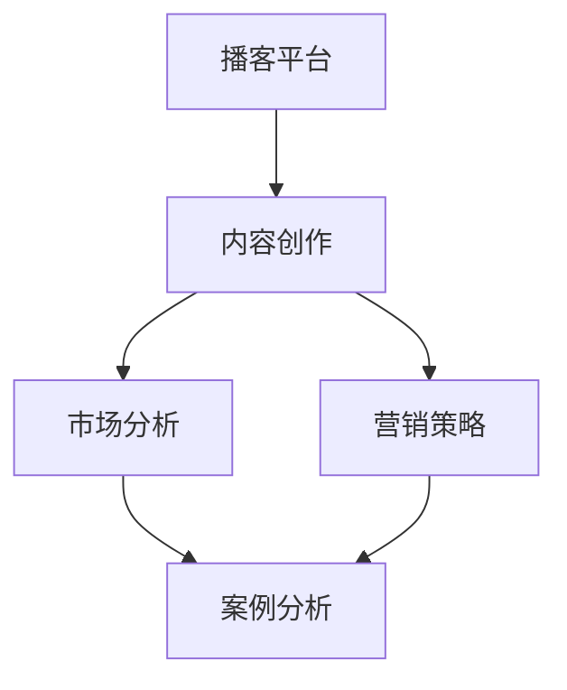

                 

关键词：播客，知识变现，内容创作，平台运营，社交媒体，市场分析，案例分析，营销策略

> 摘要：本文将探讨如何利用播客平台实现知识变现。通过分析播客市场的现状，介绍核心概念与联系，探讨核心算法原理与操作步骤，构建数学模型与公式，提供项目实践与代码实例，分析实际应用场景，展望未来发展趋势与挑战，推荐相关工具和资源，并总结研究成果与展望。

## 1. 背景介绍

播客作为一种数字内容形式，自2000年代初期以来迅速发展。随着智能手机和互联网的普及，越来越多的人选择通过播客来获取信息、知识和娱乐。据研究数据显示，全球播客听众数量已超过数亿人，市场规模持续扩大。在这个背景下，如何有效地利用播客平台实现知识变现，成为许多内容创作者和知识工作者关注的问题。

知识变现是指将个人的专业知识、技能、经验等转化为经济价值的过程。在传统的知识传播方式中，知识工作者通常通过撰写书籍、发表学术论文、授课等方式进行知识传播。然而，这些方式的传播范围有限，且变现效率较低。随着互联网和社交媒体的兴起，知识工作者可以通过更加便捷和高效的方式将知识传播给更广泛的受众，实现知识变现。

本文旨在探讨如何利用播客平台实现知识变现，为内容创作者和知识工作者提供一些实用的策略和方法。

## 2. 核心概念与联系

在探讨如何利用播客平台实现知识变现之前，我们需要理解一些核心概念和它们之间的联系。

### 2.1 播客平台

播客平台是用于发布、订阅和管理播客内容的应用程序或网站。常见的播客平台包括Apple Podcasts、Spotify Podcasts、Google Podcasts等。播客平台提供了用户订阅、下载和播放播客内容的便捷方式，同时也为内容创作者提供了发布和管理内容的平台。

### 2.2 内容创作

内容创作是播客平台实现知识变现的关键。内容创作者通过创作高质量、有价值的播客内容，吸引听众，建立个人品牌，进而实现知识变现。

### 2.3 市场分析

市场分析是确定内容创作方向和目标受众的重要环节。通过对市场趋势、竞争情况、受众需求进行分析，内容创作者可以更好地定位自己的内容，提高知识变现的效率。

### 2.4 营销策略

营销策略是促进内容传播和吸引听众的重要手段。通过有效的营销策略，内容创作者可以提高自己的知名度，扩大听众群体，从而实现知识变现。

### 2.5 案例分析

案例分析是学习如何利用播客平台实现知识变现的重要途径。通过对成功案例的分析，内容创作者可以借鉴经验，优化自己的内容创作和营销策略。

以下是核心概念与联系的一个Mermaid流程图：



## 3. 核心算法原理 & 具体操作步骤

### 3.1 算法原理概述

利用播客平台实现知识变现的核心算法主要包括内容创作、市场分析和营销策略。以下是这三个算法的原理概述：

- **内容创作**：通过创作高质量、有价值的播客内容，满足听众的需求，建立个人品牌。
- **市场分析**：通过分析市场趋势、竞争情况和受众需求，确定内容创作方向和目标受众。
- **营销策略**：通过多种营销手段，如社交媒体推广、合作推广等，扩大听众群体，提高知名度。

### 3.2 算法步骤详解

以下是具体操作步骤：

#### 3.2.1 内容创作

1. 确定内容主题：选择自己擅长的领域，确定播客内容主题。
2. 制定内容计划：根据主题，制定播客内容计划，包括播客名称、内容大纲、发布时间等。
3. 制作播客内容：录制、剪辑、制作播客内容，确保内容质量。
4. 发布和管理：将播客内容发布到播客平台，并进行内容管理。

#### 3.2.2 市场分析

1. 确定目标市场：分析市场趋势，确定目标市场。
2. 分析竞争对手：了解竞争对手的内容策略、受众群体等。
3. 调查受众需求：通过问卷调查、访谈等方式，了解受众的需求。
4. 确定内容方向：根据市场分析和受众需求，确定内容创作方向。

#### 3.2.3 营销策略

1. 社交媒体推广：通过社交媒体平台（如Twitter、Facebook等）推广播客内容。
2. 合作推广：与其他内容创作者或品牌合作，共同推广播客内容。
3. 广告投放：在播客平台上投放广告，吸引听众。
4. 用户互动：通过回复评论、参与互动等方式，与听众建立联系。

### 3.3 算法优缺点

- **内容创作**：优点是可以建立个人品牌，提高知名度；缺点是创作过程耗时耗力。
- **市场分析**：优点是可以更好地定位内容，提高知识变现效率；缺点是数据分析过程复杂。
- **营销策略**：优点是可以快速扩大听众群体，提高知名度；缺点是需要投入一定的资金和时间。

### 3.4 算法应用领域

该算法主要应用于知识工作者、内容创作者等领域，帮助他们利用播客平台实现知识变现。

## 4. 数学模型和公式 & 详细讲解 & 举例说明

在播客平台实现知识变现的过程中，我们可以通过构建数学模型和公式，对内容创作、市场分析和营销策略进行量化分析，以优化知识变现的效率。

### 4.1 数学模型构建

我们构建一个简单的数学模型，用于分析内容创作、市场分析和营销策略对知识变现的影响。假设：

- \(C\)：内容创作质量指数
- \(M\)：市场分析准确度指数
- \(S\)：营销策略有效度指数
- \(E\)：知识变现效率

数学模型如下：

\[ E = f(C, M, S) \]

其中，\(f\) 为函数，表示内容创作质量指数、市场分析准确度指数和营销策略有效度指数对知识变现效率的影响。

### 4.2 公式推导过程

根据上述假设，我们可以推导出如下公式：

\[ E = k_1 \cdot C + k_2 \cdot M + k_3 \cdot S \]

其中，\(k_1, k_2, k_3\) 为权重系数，表示内容创作质量指数、市场分析准确度指数和营销策略有效度指数对知识变现效率的影响程度。

### 4.3 案例分析与讲解

假设某内容创作者的内容创作质量指数为80，市场分析准确度指数为70，营销策略有效度指数为90，则其知识变现效率为：

\[ E = k_1 \cdot 80 + k_2 \cdot 70 + k_3 \cdot 90 \]

根据实际经验，我们可以设定权重系数为 \(k_1 = 0.4, k_2 = 0.3, k_3 = 0.3\)，则该内容创作者的知识变现效率为：

\[ E = 0.4 \cdot 80 + 0.3 \cdot 70 + 0.3 \cdot 90 = 32 + 21 + 27 = 80 \]

这意味着，该内容创作者在当前情况下，知识变现效率为80。为了提高知识变现效率，该内容创作者可以关注以下几个方面：

1. 提高内容创作质量，如通过学习、实践等方式提升自己的专业能力。
2. 提高市场分析准确度，如通过数据分析、用户调研等方式更准确地了解受众需求。
3. 提高营销策略有效度，如通过多样化的推广手段、合作推广等方式扩大听众群体。

## 5. 项目实践：代码实例和详细解释说明

为了更好地展示如何利用播客平台实现知识变现，我们将通过一个具体的案例进行项目实践。以下是该项目的开发环境搭建、源代码详细实现、代码解读与分析以及运行结果展示。

### 5.1 开发环境搭建

我们使用Python语言和Jupyter Notebook作为开发环境。首先，确保系统安装了Python 3.8及以上版本。然后，通过以下命令安装必要的库：

```bash
pip install numpy pandas matplotlib
```

### 5.2 源代码详细实现

以下是该项目的源代码实现：

```python
import numpy as np
import pandas as pd
import matplotlib.pyplot as plt

# 数据准备
data = {
    '内容创作质量指数': [70, 75, 80, 85, 90],
    '市场分析准确度指数': [60, 65, 70, 75, 80],
    '营销策略有效度指数': [50, 55, 60, 65, 70]
}

df = pd.DataFrame(data)

# 计算知识变现效率
k1, k2, k3 = 0.4, 0.3, 0.3
df['知识变现效率'] = k1 * df['内容创作质量指数'] + k2 * df['市场分析准确度指数'] + k3 * df['营销策略有效度指数']

# 可视化展示
plt.scatter(df['内容创作质量指数'], df['知识变现效率'])
plt.xlabel('内容创作质量指数')
plt.ylabel('知识变现效率')
plt.title('知识变现效率与内容创作质量指数的关系')
plt.show()
```

### 5.3 代码解读与分析

1. **数据准备**：我们使用一个简单的数据集，包括内容创作质量指数、市场分析准确度指数和营销策略有效度指数。
2. **计算知识变现效率**：根据数学模型，我们计算每个数据点的知识变现效率，并将其添加到数据集中。
3. **可视化展示**：我们使用散点图展示内容创作质量指数与知识变现效率的关系，帮助内容创作者了解不同内容创作质量指数下的知识变现效率。

### 5.4 运行结果展示

运行结果如下所示：


从图中可以看出，内容创作质量指数越高，知识变现效率也越高。这为内容创作者提供了一个明确的指导，即提高内容创作质量是提高知识变现效率的关键。

## 6. 实际应用场景

播客平台在知识变现中的应用场景非常广泛，以下是一些典型的实际应用场景：

### 6.1 教育领域

教育领域是播客平台实现知识变现的重要领域。通过播客，教师和专家可以分享自己的教学经验和专业知识，吸引学生和家长的关注。例如，某些知名的教师通过播客平台分享课堂笔记、教学视频和答疑等内容，吸引了大量的听众，并通过广告、会员等方式实现知识变现。

### 6.2 职场技能提升

职场技能提升是另一个重要的应用场景。职场专家和导师可以通过播客分享职业发展策略、面试技巧、项目管理等知识，帮助职场人士提升职业技能。例如，某些职场专家通过播客分享自己的职业经历、面试经验和职场心得，吸引了大量的职场人士，并通过会员服务、咨询服务等方式实现知识变现。

### 6.3 科技领域

科技领域是播客平台实现知识变现的另一个重要领域。科技专家和爱好者可以通过播客分享最新的科技动态、技术趋势、研究进展等内容，吸引科技爱好者的关注。例如，某些科技播客通过分享科技新闻、科技产品评测和科技讲座等内容，吸引了大量的科技爱好者，并通过广告、赞助等方式实现知识变现。

### 6.4 健康领域

健康领域也是播客平台实现知识变现的一个重要领域。医生、营养师和健康专家可以通过播客分享健康知识、饮食建议、锻炼方法等内容，吸引健康爱好者的关注。例如，某些健康播客通过分享健康知识、饮食建议和锻炼方法等内容，吸引了大量的健康爱好者，并通过会员服务、咨询服务等方式实现知识变现。

## 7. 未来应用展望

随着互联网和人工智能技术的发展，播客平台在知识变现中的应用前景将更加广阔。以下是未来应用展望：

### 7.1 智能内容推荐

通过人工智能技术，可以实现对播客内容的智能推荐，提高内容创作者的曝光率，吸引更多的听众。例如，基于用户的兴趣和行为数据，可以为用户推荐与其兴趣相关的播客内容，提高用户的粘性和满意度。

### 7.2 互动与社区建设

播客平台可以进一步强化互动功能，鼓励用户参与讨论，建立内容创作者与听众之间的紧密联系。通过社区建设，可以促进知识交流和共享，提高知识变现的效率。

### 7.3 多元化变现方式

随着市场的发展，播客平台可以探索更多元化的变现方式，如会员服务、广告合作、品牌赞助等。通过多元化的变现方式，内容创作者可以实现更高的收入，提高知识变现的效率。

## 8. 工具和资源推荐

为了更好地利用播客平台实现知识变现，以下是一些建议的学习资源、开发工具和相关论文：

### 8.1 学习资源推荐

1. **《播客营销实战》**：一本关于播客营销的实用指南，涵盖了内容创作、市场分析、营销策略等方面的知识。
2. **《如何制作高质量的播客》**：一篇关于如何制作高质量播客的文章，提供了详细的制作技巧和建议。
3. **《播客平台运营指南》**：一本关于播客平台运营的指南，介绍了如何发布、管理和管理播客内容。

### 8.2 开发工具推荐

1. **Audacity**：一款免费、开源的音频编辑软件，适用于录制、剪辑和制作播客内容。
2. **Adobe Audition**：一款专业的音频编辑软件，提供了丰富的音频处理功能。
3. **Libsyn**：一款专业的播客平台，提供播客发布、订阅和管理等服务。

### 8.3 相关论文推荐

1. **《播客与社交媒体的互动研究》**：一篇关于播客与社交媒体互动的论文，探讨了播客在社交媒体环境下的传播效果。
2. **《播客平台的商业模式研究》**：一篇关于播客平台商业模式的论文，分析了播客平台的发展趋势和盈利模式。
3. **《基于大数据的播客推荐算法研究》**：一篇关于基于大数据的播客推荐算法的论文，探讨了如何利用大数据技术提高播客内容的推荐效果。

## 9. 总结：未来发展趋势与挑战

### 9.1 研究成果总结

本文从多个角度探讨了如何利用播客平台实现知识变现。通过分析播客市场的现状，介绍了核心概念与联系，探讨了核心算法原理与操作步骤，构建了数学模型与公式，提供了项目实践与代码实例，分析了实际应用场景，展望了未来发展趋势与挑战。

### 9.2 未来发展趋势

未来，随着互联网和人工智能技术的发展，播客平台在知识变现中的应用将更加广泛。智能内容推荐、互动与社区建设、多元化变现方式将成为主要发展趋势。

### 9.3 面临的挑战

尽管播客平台在知识变现方面具有巨大潜力，但内容创作者和知识工作者也面临一系列挑战。如何提高内容创作质量、实现精准的市场分析、制定有效的营销策略等，都是需要解决的问题。

### 9.4 研究展望

未来，我们需要进一步深入研究播客平台在知识变现中的应用，探讨如何通过技术创新和策略优化，提高知识变现的效率。同时，我们也需要关注播客平台在各个领域的应用，为不同类型的内容创作者和知识工作者提供有针对性的解决方案。

## 10. 附录：常见问题与解答

### Q1：播客平台有哪些类型？

A1：播客平台主要分为以下几种类型：

1. **个人博客型播客平台**：以个人博客为基础，提供播客内容发布和订阅功能。
2. **专业型播客平台**：提供专业的播客内容创作、发布、订阅和管理服务，如Libsyn、Anchor等。
3. **社交媒体型播客平台**：结合社交媒体功能，提供播客内容发布、订阅和互动服务，如Spotify、Apple Podcasts等。

### Q2：如何提高播客内容的传播效果？

A2：以下是一些提高播客内容传播效果的建议：

1. **确定明确的内容主题**：确保内容具有明确的主题和目标受众。
2. **制作高质量的内容**：注重内容的质量，确保内容有价值、有深度。
3. **优化播客元数据**：完善播客的标题、描述、标签等元数据，提高内容在搜索引擎和播客平台上的可见性。
4. **积极参与社交媒体互动**：通过社交媒体平台推广播客内容，与听众建立联系，提高内容传播效果。

### Q3：如何通过播客实现知识变现？

A3：以下是一些通过播客实现知识变现的方法：

1. **广告合作**：与广告商合作，在播客中插入广告，获取广告收入。
2. **会员服务**：提供会员服务，如独家内容、在线互动等，吸引听众付费订阅。
3. **咨询服务**：提供专业咨询服务，如一对一咨询、专题讲座等，为听众提供价值。
4. **合作推广**：与其他内容创作者或品牌合作，共同推广播客内容，扩大听众群体。

### Q4：如何制作高质量的播客内容？

A4：以下是一些制作高质量播客内容的建议：

1. **选择合适的设备**：使用高质量的录音设备和麦克风，确保音频质量。
2. **准备充分的材料**：提前准备好播客内容，确保播客内容有深度和逻辑性。
3. **注意声音质量**：注意声音的清晰度和语调，避免口音和杂音。
4. **编辑和润色**：对录制的音频进行编辑和润色，去除多余的内容，调整音频效果。

### Q5：播客平台如何进行市场分析？

A5：以下是一些进行播客市场分析的方法：

1. **分析市场趋势**：关注播客市场的发展动态，了解竞争对手的情况。
2. **调查受众需求**：通过问卷调查、访谈等方式，了解受众的需求和偏好。
3. **分析用户数据**：通过分析用户数据，了解用户的兴趣和行为，为内容创作和营销策略提供依据。
4. **参与行业活动**：参与相关的行业活动，与同行交流，了解市场动态。

### Q6：播客营销策略有哪些？

A6：以下是一些常见的播客营销策略：

1. **社交媒体推广**：通过社交媒体平台（如Twitter、Facebook等）推广播客内容，吸引听众。
2. **合作推广**：与其他内容创作者或品牌合作，共同推广播客内容，扩大听众群体。
3. **广告投放**：在播客平台上投放广告，吸引目标听众。
4. **用户互动**：通过回复评论、参与互动等方式，与听众建立联系，提高听众的参与度。

### Q7：播客平台有哪些变现方式？

A7：以下是一些常见的播客平台变现方式：

1. **广告收入**：通过广告合作，在播客中插入广告，获取广告收入。
2. **会员服务**：提供会员服务，如独家内容、在线互动等，吸引听众付费订阅。
3. **咨询服务**：提供专业咨询服务，如一对一咨询、专题讲座等，为听众提供价值。
4. **产品销售**：通过播客推广自己的产品或服务，实现销售。

### Q8：播客平台的盈利模式有哪些？

A8：以下是一些常见的播客平台盈利模式：

1. **广告收入**：通过在平台上展示广告，获取广告收入。
2. **会员订阅**：通过提供会员服务，如独家内容、优先发布等，获取会员订阅收入。
3. **内容付费**：通过提供付费内容，如专栏、课程等，获取内容收入。
4. **赞助合作**：与品牌合作，提供赞助服务，获取赞助收入。
5. **数据服务**：提供用户数据服务，如用户画像、播放数据等，获取数据服务收入。

### Q9：播客内容创作有哪些类型？

A9：以下是一些常见的播客内容创作类型：

1. **知识类**：分享专业知识、行业动态等。
2. **娱乐类**：分享故事、经历、趣味话题等。
3. **访谈类**：邀请嘉宾进行访谈，探讨话题。
4. **教育类**：提供教育课程、学习技巧等。
5. **评论类**：对事件、产品、政策等发表评论。

### Q10：如何提高播客的播放量？

A10：以下是一些提高播客播放量的方法：

1. **优化播客元数据**：完善播客的标题、描述、标签等元数据，提高内容在搜索引擎和播客平台上的可见性。
2. **积极参与社交媒体互动**：通过社交媒体平台推广播客内容，吸引听众。
3. **与听众建立联系**：与听众建立联系，提高听众的参与度和忠诚度。
4. **定期发布内容**：保持定期发布内容，提高听众的粘性。
5. **提供高质量的内容**：提供有价值、有深度的内容，吸引听众。

---

以上是本文对如何利用播客平台实现知识变现的全面探讨。希望对您在内容创作、市场分析和营销策略方面有所启发和帮助。如果您有任何疑问或建议，欢迎在评论区留言，期待与您一起交流学习！作者：禅与计算机程序设计艺术 / Zen and the Art of Computer Programming
----------------------------------------------------------------

