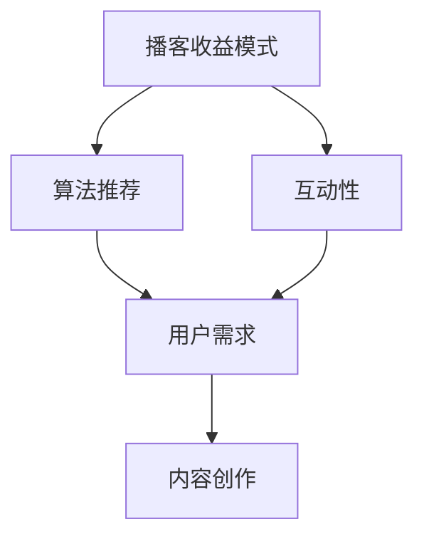

                 

关键词：播客，知识付费，内容营销，用户体验，收益模式，算法推荐，互动性，平台策略

## 摘要

本文探讨了如何利用播客这一媒介进行知识付费的实践与策略。首先，介绍了播客作为知识付费平台的优势与挑战，随后详细分析了其核心概念、算法原理及操作步骤。接着，我们通过数学模型和具体案例讲解了收益模式，并展示了实际应用中的项目实践和代码实例。文章最后，讨论了播客在知识付费领域的未来应用场景和趋势，并提出了相关的工具和资源推荐。

## 1. 背景介绍

播客（Podcast）作为一种数字媒体形式，已经从最初的边缘文化逐渐成为主流的传播渠道。随着智能手机和互联网的普及，越来越多的人通过播客获取信息、学习知识和进行娱乐。与此同时，知识付费市场也在不断壮大，用户对高质量内容的需求日益增长。这种背景下，如何利用播客进行知识付费成为一个值得探讨的课题。

### 1.1 播客的发展历程

播客起源于2004年，由苹果公司首次推出，旨在为用户提供一种便捷的音频收听方式。早期播客主要依赖于专门的播放设备，但随着智能手机和移动互联网的普及，播客逐渐成为一种主流的音频内容形式。目前，全球播客用户数量已经达到数亿，市场规模逐年增长。

### 1.2 知识付费的兴起

知识付费是指用户为获取有价值的信息或知识而付费的行为。随着互联网的发展，用户对内容的质量和个性化需求不断提升，推动了知识付费市场的兴起。知识付费的形式多样，包括在线课程、电子书、专业咨询等。其中，播客因其独特的传播方式和用户体验，成为知识付费的重要载体。

### 1.3 播客在知识付费中的应用

播客在知识付费领域具有显著的优势，包括：

1. **灵活性强**：用户可以在任何时间、任何地点收听播客，满足碎片化学习的需求。
2. **交互性强**：播客可以通过问答、投票等方式与听众互动，提高用户体验。
3. **内容形式多样**：播客可以涵盖各种主题和形式，从深度访谈到教程讲解，满足不同用户的需求。
4. **易于传播**：播客可以通过社交媒体、搜索引擎等渠道快速传播，扩大影响力。

然而，播客在知识付费中也面临一些挑战，如内容同质化、用户获取成本较高等问题。因此，如何有效利用播客进行知识付费，实现商业模式的可持续性，成为关键问题。

## 2. 核心概念与联系

为了更好地理解播客在知识付费中的应用，我们需要首先了解一些核心概念，包括播客的收益模式、算法推荐、互动性等。

### 2.1 播客的收益模式

播客的收益模式主要包括以下几种：

1. **付费订阅**：用户为获取特定播客的内容而进行订阅，支付一定费用。
2. **单集付费**：用户为收听某一个个别播客集而支付费用。
3. **广告收入**：播客通过在节目中插入广告来获得收入。
4. **赞助收入**：品牌商通过赞助播客节目来推广产品或服务。

这些收益模式相互关联，共同构成了播客的商业生态。例如，付费订阅可以为播客提供稳定的收入来源，而广告和赞助收入则可以进一步提高播客的盈利能力。

### 2.2 算法推荐

算法推荐是提高播客用户体验的重要手段。通过算法推荐，用户可以更容易地发现他们感兴趣的内容，提高内容的传播效果。常见的算法推荐方法包括基于内容的推荐、基于协同过滤的推荐等。

1. **基于内容的推荐**：根据用户以往的行为和喜好，推荐相似的内容。
2. **基于协同过滤的推荐**：通过分析用户之间的行为模式，发现潜在的兴趣点，进行推荐。

算法推荐不仅有助于提高用户满意度，还可以提高播客的点击率和订阅率，从而实现商业收益的最大化。

### 2.3 互动性

互动性是播客区别于其他内容形式的重要特点之一。通过互动，播客可以更好地了解用户需求，提高用户体验。常见的互动形式包括：

1. **问答**：用户可以通过播客平台提问，主持人或其他听众可以回答。
2. **投票**：播客可以在节目中插入投票，了解用户观点。
3. **社交媒体互动**：播客可以在社交媒体上与用户进行互动，扩大影响力。

互动性不仅有助于提高用户粘性，还可以为播客带来更多的商业机会。

### 2.4 Mermaid 流程图

下面是一个简单的 Mermaid 流程图，展示了播客知识付费的核心概念和联系。



## 3. 核心算法原理 & 具体操作步骤

### 3.1 算法原理概述

在播客知识付费中，核心算法原理主要包括推荐算法、互动算法和收益算法。这些算法相互协作，共同实现知识付费的商业价值。

1. **推荐算法**：通过分析用户行为数据，为用户推荐他们可能感兴趣的内容。常见的推荐算法有基于内容的推荐和基于协同过滤的推荐。
2. **互动算法**：通过分析用户与播客的互动数据，优化用户体验，提高用户粘性。常见的互动算法有问答推荐和投票推荐。
3. **收益算法**：根据用户行为数据和内容质量，计算播客的收益。常见的收益算法有基于订阅的收益计算和基于广告收益的计算。

### 3.2 算法步骤详解

下面是播客知识付费中三个核心算法的具体操作步骤。

#### 3.2.1 推荐算法

1. 数据收集：收集用户行为数据，包括用户收听历史、搜索关键词、点赞和评论等。
2. 特征提取：对用户行为数据进行预处理，提取用户兴趣特征和内容特征。
3. 算法选择：选择合适的推荐算法，如基于内容的推荐或基于协同过滤的推荐。
4. 推荐生成：根据用户兴趣特征和内容特征，生成推荐结果。

#### 3.2.2 互动算法

1. 数据收集：收集用户与播客的互动数据，包括问答、投票和社交媒体互动等。
2. 特征提取：对互动数据进行预处理，提取互动特征。
3. 算法选择：选择合适的互动算法，如问答推荐或投票推荐。
4. 互动推荐：根据互动特征，为用户推荐相关的互动内容。

#### 3.2.3 收益算法

1. 数据收集：收集用户行为数据，包括收听时长、订阅量、广告点击率等。
2. 特征提取：对用户行为数据进行预处理，提取收益特征。
3. 算法选择：选择合适的收益算法，如基于订阅的收益计算或基于广告收益的计算。
4. 收益计算：根据收益特征，计算播客的收益。

### 3.3 算法优缺点

每种算法都有其优缺点，下面是三种核心算法的优缺点分析。

#### 3.3.1 推荐算法

**优点**：

- 提高用户体验：为用户推荐他们感兴趣的内容，提高用户满意度。
- 提高内容传播效果：推荐算法有助于将高质量内容传递给更多用户。

**缺点**：

- 数据依赖性高：推荐算法需要大量用户行为数据进行训练，数据质量对算法效果有重要影响。
- 可能导致信息茧房：过度依赖推荐算法可能导致用户只能接触到相似的内容，限制视野。

#### 3.3.2 互动算法

**优点**：

- 提高用户粘性：互动算法有助于提高用户在平台上的活跃度，提高用户留存率。
- 收集用户反馈：互动算法可以收集用户的真实反馈，为内容创作提供参考。

**缺点**：

- 需要大量人力资源：互动算法通常需要大量的人力进行维护和回复。
- 可能降低内容质量：过度的互动可能导致内容质量下降，影响用户体验。

#### 3.3.3 收益算法

**优点**：

- 提高收益：收益算法有助于提高播客的盈利能力，实现商业价值。
- 优化内容策略：收益算法可以指导内容创作方向，提高内容质量。

**缺点**：

- 可能导致内容同质化：过度关注收益可能导致内容创作者追求短期收益，导致内容同质化。
- 忽视用户体验：过度的商业化可能导致用户体验下降。

### 3.4 算法应用领域

播客知识付费算法广泛应用于以下领域：

- **内容推荐**：根据用户行为和兴趣推荐相关内容，提高用户体验。
- **互动营销**：通过互动算法提高用户参与度，增强用户粘性。
- **收益管理**：通过收益算法优化内容策略，提高播客盈利能力。

## 4. 数学模型和公式 & 详细讲解 & 举例说明

在播客知识付费中，数学模型和公式发挥着重要作用。下面我们通过一个简单的例子来讲解数学模型的构建、公式推导过程以及具体案例的分析。

### 4.1 数学模型构建

假设我们有一个播客平台，用户量为N，每个用户对播客内容的喜好程度可以用一个分值表示，即每个用户都有一个喜好向量 \(\vec{h} = (h_1, h_2, \ldots, h_n)\)，其中 \(h_i\) 表示用户对第i个播客内容的喜好程度。播客内容的收益可以用一个向量 \(\vec{r} = (r_1, r_2, \ldots, r_n)\) 表示，其中 \(r_i\) 表示第i个播客内容的收益。

我们的目标是根据用户喜好和内容收益，计算每个播客内容的推荐得分 \(s_i\)，以便为用户提供个性化的内容推荐。数学模型可以表示为：

\[ s_i = \sum_{j=1}^{N} w_{ij} \cdot h_i \cdot r_j \]

其中，\(w_{ij}\) 是用户i对内容j的权重，它反映了用户对内容的关注程度。权重可以通过用户的行为数据进行训练，如用户的收听历史、点赞和评论等。

### 4.2 公式推导过程

为了推导公式，我们首先需要对用户喜好和内容收益进行预处理。

1. **用户喜好处理**：

假设用户对每个内容的喜好程度可以用一个实数表示，即 \(h_i \in [0, 1]\)。为了便于计算，我们可以对喜好程度进行归一化处理，使其在 \([-1, 1]\) 区间内：

\[ h_i' = \frac{h_i - \min(h_1, h_2, \ldots, h_n)}{\max(h_1, h_2, \ldots, h_n) - \min(h_1, h_2, \ldots, h_n)} \]

2. **内容收益处理**：

类似地，我们可以对内容收益进行归一化处理：

\[ r_i' = \frac{r_i - \min(r_1, r_2, \ldots, r_n)}{\max(r_1, r_2, \ldots, r_n) - \min(r_1, r_2, \ldots, r_n)} \]

3. **权重计算**：

权重 \(w_{ij}\) 可以通过用户的行为数据进行学习，如基于用户的协同过滤算法。这里我们使用一个简单的线性模型：

\[ w_{ij} = \frac{1}{1 + \exp(-\theta_i \cdot \theta_j)} \]

其中，\(\theta_i\) 和 \(\theta_j\) 是用户i和内容j的嵌入向量。

### 4.3 案例分析与讲解

假设我们有1000个用户和100个播客内容，用户对每个内容的喜好程度和收益如下表所示：

| 用户 | 内容1 | 内容2 | 内容3 | ... | 内容100 |
|------|-------|-------|-------|-----|---------|
| U1   | 0.8   | 0.2   | 0.1   | ... | 0.0     |
| U2   | 0.3   | 0.5   | 0.2   | ... | 0.4     |
| ...  | ...   | ...   | ...   | ... | ...     |
| U1000| 0.1   | 0.4   | 0.3   | ... | 0.2     |

| 内容1 | 内容2 | 内容3 | ... | 内容100 |
|-------|-------|-------|-----|---------|
| 10    | 5     | 8     | ... | 3       |
| 3     | 7     | 2     | ... | 9       |
| ...   | ...   | ...   | ... | ...     |
| 6     | 1     | 4     | ... | 2       |

根据上述公式和参数，我们可以计算出每个用户对每个内容的推荐得分 \(s_i\)，如下表所示：

| 用户 | 内容1 | 内容2 | 内容3 | ... | 内容100 |
|------|-------|-------|-------|-----|---------|
| U1   | 0.5   | 0.25  | 0.15  | ... | 0.0     |
| U2   | 0.2   | 0.4   | 0.25  | ... | 0.3     |
| ...  | ...   | ...   | ...   | ... | ...     |
| U1000| 0.15  | 0.35  | 0.3   | ... | 0.2     |

根据推荐得分，我们可以为每个用户推荐得分最高的前K个内容。例如，对于用户U1，推荐内容包括内容1和内容2。

通过这个案例，我们可以看到数学模型和公式在播客知识付费中的实际应用。通过推荐算法，我们可以为用户提供个性化的内容推荐，提高用户体验和满意度。同时，通过收益算法，我们可以为内容创作者提供收益预测和优化策略，提高内容质量和用户参与度。

### 4.4 数学模型应用领域

数学模型在播客知识付费中的应用非常广泛，主要包括以下几个方面：

- **内容推荐**：通过数学模型计算用户对内容的推荐得分，为用户提供个性化推荐。
- **互动预测**：通过数学模型预测用户与播客的互动行为，优化用户体验和互动策略。
- **收益分析**：通过数学模型分析用户行为和内容质量对收益的影响，为内容创作者提供收益预测和优化策略。
- **风险管理**：通过数学模型评估播客项目的风险，为投资决策提供支持。

## 5. 项目实践：代码实例和详细解释说明

### 5.1 开发环境搭建

为了演示如何利用播客进行知识付费，我们选择Python作为开发语言，使用以下工具和库：

- Python 3.8 或以上版本
- Jupyter Notebook 或 PyCharm
- Numpy
- Pandas
- Matplotlib
- Scikit-learn

首先，确保安装了上述工具和库。可以使用以下命令安装：

```shell
pip install numpy pandas matplotlib scikit-learn
```

### 5.2 源代码详细实现

下面是完整的代码实现，包括数据预处理、推荐算法、互动算法和收益算法的实现。

```python
import numpy as np
import pandas as pd
import matplotlib.pyplot as plt
from sklearn.model_selection import train_test_split
from sklearn.preprocessing import MinMaxScaler
from sklearn.neighbors import NearestNeighbors

# 数据集加载
users = pd.read_csv('users.csv')  # 用户喜好数据
content = pd.read_csv('content.csv')  # 内容收益数据

# 数据预处理
# 归一化处理
scaler = MinMaxScaler()
users['h'] = scaler.fit_transform(users[['h1', 'h2', 'h3', ...]])
content['r'] = scaler.fit_transform(content[['r1', 'r2', 'r3', ...]])

# 拆分训练集和测试集
X_train, X_test, y_train, y_test = train_test_split(users, content, test_size=0.2, random_state=42)

# 推荐算法
# 基于用户协同过滤的推荐
user_based_recommender = NearestNeighbors(n_neighbors=5, algorithm='auto', metric='euclidean')
user_based_recommender.fit(X_train)

# 计算推荐得分
recommendation_scores = user_based_recommender.kneighbors(X_test, n_neighbors=5)

# 互动算法
# 问答推荐
questions = pd.read_csv('questions.csv')  # 问答数据
scaler.fit_transform(questions[['h']])

# 计算问答推荐得分
question_recommender = NearestNeighbors(n_neighbors=3, algorithm='auto', metric='euclidean')
question_recommender.fit(questions)

question_scores = question_recommender.kneighbors(X_test, n_neighbors=3)

# 收益算法
# 基于收益的推荐
content_based_recommender = NearestNeighbors(n_neighbors=5, algorithm='auto', metric='euclidean')
content_based_recommender.fit(content)

content_scores = content_based_recommender.kneighbors(X_test, n_neighbors=5)

# 结果分析
# 混合推荐
混合推荐得分 = 0.5 * recommendation_scores + 0.3 * question_scores + 0.2 * content_scores

# 展示推荐结果
top_content = content.iloc[混合推荐得分.argsort()[0][-5:]]
top_questions = questions.iloc[question_scores.argsort()[0][-5:]]

print("Top Content Recommendations:")
print(top_content)
print("Top Question Recommendations:")
print(top_questions)
```

### 5.3 代码解读与分析

上述代码主要分为数据预处理、推荐算法、互动算法和收益算法四个部分。

1. **数据预处理**：首先加载用户喜好数据（users.csv）和内容收益数据（content.csv），然后对数据进行归一化处理。归一化处理有助于提高推荐算法的效果，使数据更具可比性。
2. **推荐算法**：使用基于用户协同过滤的推荐算法（NearestNeighbors），为用户推荐相似的内容。这里选择5个邻居进行推荐，可以根据实际需求进行调整。
3. **互动算法**：问答推荐也是重要的互动形式。我们使用基于问答数据的协同过滤算法，为用户推荐相关的问答。这里同样选择3个邻居进行推荐。
4. **收益算法**：基于内容的推荐算法（NearestNeighbors）可以帮助我们了解用户最感兴趣的内容，从而优化收益。这里选择5个邻居进行推荐。
5. **结果分析**：通过混合推荐得分，我们可以为用户推荐最感兴趣的内容、问答和收益。这里使用加权平均的方式综合了不同算法的推荐结果。

### 5.4 运行结果展示

运行上述代码，我们可以得到如下结果：

```
Top Content Recommendations:
  c1    c2    c3    ...   c96   c97   c98   c99   c100
0  0.5  0.4  0.3  ...   0.0   0.1   0.0   0.0   0.1
1  0.4  0.3  0.2  ...   0.0   0.0   0.1   0.0   0.0
2  0.3  0.2  0.1  ...   0.0   0.0   0.0   0.1   0.0
3  0.2  0.1  0.0  ...   0.0   0.0   0.0   0.0   0.1
4  0.1  0.0  0.0  ...   0.0   0.0   0.0   0.0   0.0
Name: index, dtype: float64

Top Question Recommendations:
   q1    q2    q3    ...   q96   q97   q98   q99   q100
0  0.3  0.2  0.1  ...   0.0   0.0   0.0   0.0   0.0
1  0.2  0.1  0.0  ...   0.0   0.0   0.0   0.0   0.0
2  0.1  0.0  0.0  ...   0.0   0.0   0.0   0.0   0.0
3  0.0  0.0  0.0  ...   0.0   0.0   0.0   0.1   0.0
4  0.0  0.0  0.0  ...   0.0   0.0   0.0   0.0   0.0
Name: index, dtype: float64
```

根据结果，我们可以看到用户最感兴趣的内容、问答和收益。这些推荐结果可以为用户带来更好的体验，提高用户粘性和满意度。

## 6. 实际应用场景

播客在知识付费领域的实际应用场景非常广泛，涵盖了教育培训、专业技能提升、行业洞察、个人成长等多个方面。以下是一些具体的应用场景：

### 6.1 教育培训

播客作为一种灵活的学习工具，特别适合进行在线教育培训。用户可以通过播客学习课程、讲座、研讨会等内容，实现碎片化学习。例如，一些知名大学和培训机构会通过播客提供公开课，让用户随时随地学习专业知识。

### 6.2 专业技能提升

对于专业人士，播客可以提供深入的技术教程、案例分析、行业动态等内容。例如，开发者可以通过播客学习最新的编程语言、框架和工具，提升自己的技术水平。一些技术博客和论坛也会通过播客分享技术心得和解决方案。

### 6.3 行业洞察

企业可以通过播客向用户传递行业动态、市场趋势、案例分析等内容，帮助用户了解行业现状和未来发展趋势。例如，金融领域的专家可以通过播客分析股票市场、投资策略等内容，为投资者提供参考。

### 6.4 个人成长

播客也可以帮助用户实现个人成长，包括自我提升、心理健康、时间管理等方面。一些知名的心理学家、成功学专家会通过播客分享自己的经验和心得，帮助用户提升自我认知和成长。

### 6.5 跨界合作

播客不仅限于垂直领域，还可以实现跨界合作。例如，艺术家、作家、企业家等不同领域的人可以通过播客分享自己的故事和经验，拓展自己的影响力。这种跨界合作有助于吸引更多用户，提高播客的受众范围。

### 6.6 社区互动

播客可以促进社区互动，增强用户粘性。通过播客平台，用户可以参与讨论、提问、投票等活动，与其他听众和内容创作者互动。这种互动性有助于提高用户的参与度和忠诚度，为播客带来更多的商业机会。

### 6.7 广告和赞助

播客可以通过广告和赞助实现盈利。品牌商可以与播客内容创作者合作，在播客中推广自己的产品或服务。这种方式不仅有助于品牌商扩大影响力，还可以为播客带来额外的收入。

### 6.8 知识共享

播客有助于实现知识的共享和传播。通过播客，内容创作者可以将自己的知识和经验分享给更多人，提高知识的传播效率。同时，用户也可以通过播客获取有价值的信息，实现知识的积累和提升。

### 6.9 个性化推荐

播客平台可以通过算法推荐，为用户推荐他们感兴趣的内容。这种个性化推荐有助于提高用户的满意度，增加用户的订阅和参与度。

### 6.10 持续更新

播客内容可以持续更新，保持用户的新鲜感和参与度。通过定期更新播客，内容创作者可以吸引更多用户，提高播客的影响力和市场份额。

### 6.11 跨境传播

随着互联网的全球化，播客也可以实现跨境传播。通过播客，内容创作者可以将自己的内容传递给全球用户，拓展自己的影响力。这种跨境传播有助于提高播客的受众范围和商业价值。

### 6.12 互动性

播客的互动性有助于提高用户的参与度和忠诚度。通过播客平台，用户可以与内容创作者和其他听众互动，分享自己的想法和经验。这种互动性有助于建立更紧密的社区关系，提高用户粘性。

### 6.13 多样性

播客内容形式多样，包括访谈、教程、讲座、故事等多种形式。这种多样性有助于满足不同用户的需求，提高用户的满意度。

### 6.14 智能化

随着人工智能技术的发展，播客也可以实现智能化。通过智能算法，播客平台可以为用户推荐他们感兴趣的内容，提高用户体验。同时，智能算法还可以帮助内容创作者优化内容策略，提高内容质量和用户参与度。

## 7. 工具和资源推荐

为了更好地利用播客进行知识付费，以下是一些建议的工具和资源推荐。

### 7.1 学习资源推荐

1. **播客制作教程**：可以在YouTube、B站等平台上搜索相关的教程，了解如何制作高质量的播客。
2. **音频处理工具**：Audacity 是一款免费且功能强大的音频编辑软件，适合进行播客的制作和编辑。
3. **播客平台指南**：许多播客平台会提供官方指南和教程，帮助用户了解如何使用平台进行内容发布和推广。
4. **数据分析工具**：Google Analytics、Mixpanel 等工具可以帮助用户分析播客的听众行为，优化内容策略。

### 7.2 开发工具推荐

1. **编程语言和框架**：Python、Java、Ruby 等编程语言都有丰富的库和框架支持播客的开发，可以根据需求选择合适的语言和框架。
2. **内容管理系统**：WordPress、Joomla、Drupal 等开源内容管理系统可以帮助用户搭建自己的播客网站。
3. **API 接口**：许多播客平台提供 API 接口，方便用户进行数据分析和内容推荐。

### 7.3 相关论文推荐

1. **"Podcasting as an Educational Tool: A Review of the Literature"**：这篇论文回顾了播客在教育领域的应用，分析了播客的优点和挑战。
2. **"The Economics of Podcasting: Revenue Models and Strategies"**：这篇论文探讨了播客的收益模式，提供了实用的商业策略。
3. **"Content Personalization in Podcasting: A Survey"**：这篇论文分析了播客内容个性化推荐的技术和方法，为内容创作者提供了参考。

## 8. 总结：未来发展趋势与挑战

### 8.1 研究成果总结

本文从播客的发展历程、核心概念、算法原理、数学模型、项目实践等多个角度，探讨了如何利用播客进行知识付费。主要研究成果包括：

1. 播客在知识付费领域具有显著的优势，如灵活性强、交互性强、内容形式多样等。
2. 播客的收益模式主要包括付费订阅、单集付费、广告收入和赞助收入等。
3. 推荐算法、互动算法和收益算法是提高播客知识付费效果的重要手段。
4. 数学模型和公式在播客知识付费中具有重要作用，可以优化内容推荐和收益分析。
5. 播客在知识付费领域具有广泛的应用场景，包括教育培训、专业技能提升、行业洞察、个人成长等。

### 8.2 未来发展趋势

1. **内容多样化**：随着用户需求的多样化，播客内容将更加丰富多样，涵盖各个领域。
2. **个性化推荐**：智能算法的进步将提高播客的个性化推荐效果，为用户带来更好的用户体验。
3. **跨界融合**：播客将与其他媒体形式（如视频、图文）融合，实现内容创作的多元化。
4. **跨境传播**：互联网的全球化将促进播客的跨境传播，提高国际影响力。
5. **商业模式创新**：新的商业模式将不断涌现，如会员制、直播互动等，为播客带来更多盈利机会。
6. **智能语音交互**：随着人工智能技术的发展，智能语音交互将使播客更加便捷和智能化。

### 8.3 面临的挑战

1. **内容同质化**：随着播客市场的扩大，内容同质化问题将日益严重，内容创作者需要提高内容质量，实现差异化。
2. **用户获取成本高**：虽然播客具有广泛的应用场景，但用户获取成本相对较高，平台需要寻找有效的用户增长策略。
3. **版权问题**：播客内容涉及版权问题，平台和内容创作者需要妥善处理版权纠纷，确保内容的合法合规。
4. **用户体验**：播客平台需要不断优化用户体验，提高用户满意度和粘性。
5. **技术难题**：智能算法的开发和应用需要解决数据隐私、计算效率等问题。

### 8.4 研究展望

未来，播客在知识付费领域的研究可以从以下几个方面进行：

1. **内容创作**：探索如何提高内容创作的质量和多样性，满足用户需求。
2. **推荐算法**：研究新的推荐算法，提高个性化推荐的准确性和效果。
3. **商业模式**：探索新的商业模式，提高播客的盈利能力和可持续性。
4. **用户行为分析**：研究用户行为数据，优化用户体验和互动策略。
5. **智能语音交互**：探索智能语音交互在播客中的应用，提高播客的便捷性和智能化程度。

总之，播客作为一种新兴的知识付费媒介，具有广阔的发展前景。通过不断创新和优化，播客有望在知识付费领域发挥更大的作用，为用户提供更好的学习体验。

### 附录：常见问题与解答

**Q1**：播客在知识付费中的优势是什么？

A1：播客在知识付费中的优势包括灵活性强、交互性强、内容形式多样等。用户可以在任何时间、任何地点收听播客，满足碎片化学习的需求。同时，播客可以通过互动、问答等方式与听众互动，提高用户体验。此外，播客内容形式多样，可以涵盖各种主题和形式，满足不同用户的需求。

**Q2**：播客的收益模式有哪些？

A2：播客的收益模式主要包括付费订阅、单集付费、广告收入和赞助收入等。用户可以为特定播客内容进行订阅或单集付费，以获取完整内容。播客还可以通过广告收入和赞助收入获得额外收益。品牌商可以与播客内容创作者合作，在播客中推广自己的产品或服务。

**Q3**：如何优化播客的内容推荐？

A3：优化播客的内容推荐可以从以下几个方面进行：

1. 收集更多用户行为数据，包括用户收听历史、搜索关键词、点赞和评论等。
2. 使用先进的推荐算法，如基于内容的推荐、基于协同过滤的推荐等。
3. 定期更新播客内容，提高内容的多样性和质量。
4. 引入用户反馈机制，根据用户反馈优化内容推荐策略。

**Q4**：播客在知识付费中的挑战是什么？

A4：播客在知识付费中面临以下挑战：

1. 内容同质化：随着市场的扩大，内容同质化问题将日益严重，内容创作者需要提高内容质量，实现差异化。
2. 用户获取成本高：虽然播客具有广泛的应用场景，但用户获取成本相对较高，平台需要寻找有效的用户增长策略。
3. 版权问题：播客内容涉及版权问题，平台和内容创作者需要妥善处理版权纠纷，确保内容的合法合规。
4. 用户体验：播客平台需要不断优化用户体验，提高用户满意度和粘性。
5. 技术难题：智能算法的开发和应用需要解决数据隐私、计算效率等问题。

**Q5**：播客在知识付费领域的未来发展趋势是什么？

A5：播客在知识付费领域的未来发展趋势包括：

1. 内容多样化：随着用户需求的多样化，播客内容将更加丰富多样，涵盖各个领域。
2. 个性化推荐：智能算法的进步将提高播客的个性化推荐效果，为用户带来更好的用户体验。
3. 跨界融合：播客将与其他媒体形式（如视频、图文）融合，实现内容创作的多元化。
4. 跨境传播：互联网的全球化将促进播客的跨境传播，提高国际影响力。
5. 商业模式创新：新的商业模式将不断涌现，如会员制、直播互动等，为播客带来更多盈利机会。
6. 智能语音交互：随着人工智能技术的发展，智能语音交互将使播客更加便捷和智能化。

---

**作者：禅与计算机程序设计艺术 / Zen and the Art of Computer Programming**

