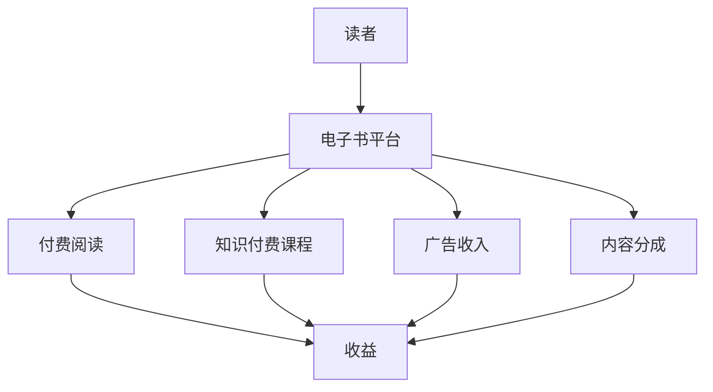

                 

关键词：知识变现，电子书平台，创作者经济，内容创作，收益最大化

> 摘要：本文将探讨如何利用电子书平台实现知识变现，从背景介绍、核心概念、算法原理、数学模型、项目实践、实际应用、工具和资源推荐以及未来发展趋势与挑战等多个角度，详细解析知识变现的路径和策略。

## 1. 背景介绍

随着互联网的迅速发展和电子阅读的普及，电子书平台已成为知识传播和分享的重要渠道。从最初的亚马逊Kindle到如今的各大平台如微信读书、多看阅读、京东阅读等，电子书市场呈现出爆炸式增长。与此同时，知识经济的兴起使得知识变现成为创作者们关注的焦点。知识变现，即通过知识分享、教育和内容创作等手段，将个人知识和技能转化为经济利益。

近年来，电子书平台的知识变现模式逐渐多样化，包括但不限于付费阅读、知识付费课程、广告收入等。然而，如何有效地利用这些平台实现收益最大化，依然是许多创作者面临的挑战。本文将深入分析知识变现的路径和策略，帮助创作者们更好地利用电子书平台实现知识变现。

## 2. 核心概念与联系

### 2.1 电子书平台

电子书平台是指为读者和创作者提供电子书阅读和分享服务的在线平台。这些平台通常提供以下功能：

- **电子书销售**：创作者可以在平台上发布自己的电子书，并通过平台进行销售。
- **内容创作**：创作者可以发布文章、教程、案例等知识性内容。
- **互动交流**：平台提供评论、点赞、分享等功能，促进用户间的互动。
- **知识付费**：创作者可以通过付费课程、订阅等方式实现知识变现。

### 2.2 知识变现

知识变现是指将个人的知识、技能、经验和见解等转化为经济利益的过程。在电子书平台上，知识变现的方式主要包括：

- **付费阅读**：读者通过支付一定费用来阅读电子书或文章。
- **知识付费课程**：创作者提供付费课程，读者通过购买课程学习知识。
- **广告收入**：平台通过广告为创作者带来收入。
- **内容分成**：平台根据创作者的内容质量和用户活跃度，给予一定的分成收益。

### 2.3 Mermaid 流程图

以下是一个简化的知识变现流程图：



## 3. 核心算法原理 & 具体操作步骤

### 3.1 算法原理概述

知识变现的核心在于内容创作和用户需求匹配。创作者需要根据用户需求创作有价值的内容，并通过电子书平台实现收益。以下是一个简单的算法原理：

1. 数据采集：收集用户在平台上的行为数据，如搜索关键词、阅读历史、购买记录等。
2. 用户画像：根据采集的数据，分析用户的兴趣、需求和偏好。
3. 内容推荐：根据用户画像，为用户推荐与其兴趣相关的高质量内容。
4. 收益计算：根据内容质量和用户活跃度，计算创作者的收益。

### 3.2 算法步骤详解

1. **数据采集**：

   使用数据分析工具，如Google Analytics、百度统计等，收集用户在平台上的行为数据。

   ```mermaid
   graph TD
       A[数据采集] --> B[行为数据]
   ```

2. **用户画像**：

   通过机器学习算法，对用户的行为数据进行处理，构建用户画像。以下是一个简化的用户画像模型：

   ```mermaid
   graph TD
       A[用户画像] --> B[兴趣标签]
       A --> C[阅读历史]
       A --> D[购买记录]
   ```

3. **内容推荐**：

   根据用户画像，使用协同过滤、基于内容的推荐算法等，为用户推荐相关内容。以下是一个简化的推荐流程：

   ```mermaid
   graph TD
       A[用户画像] --> B[推荐算法]
       B --> C[相关内容]
   ```

4. **收益计算**：

   根据内容质量和用户活跃度，计算创作者的收益。以下是一个简化的收益计算模型：

   ```mermaid
   graph TD
       A[内容质量] --> B[用户活跃度]
       A --> C[收益]
   ```

### 3.3 算法优缺点

**优点**：

- **个性化推荐**：根据用户需求和兴趣推荐内容，提高用户满意度。
- **高效变现**：通过算法优化，提高内容创作和用户需求的匹配度，实现高效变现。

**缺点**：

- **数据依赖**：算法效果依赖于用户数据的质量和数量。
- **内容审核**：需要对推荐的内容进行审核，避免不良内容的传播。

### 3.4 算法应用领域

算法在电子书平台的知识变现中有着广泛的应用，包括：

- **个性化推荐**：为用户推荐与其兴趣相关的高质量内容。
- **广告投放**：根据用户画像，精准投放广告，提高广告效果。
- **内容审核**：自动识别和过滤不良内容，保障平台生态。

## 4. 数学模型和公式 & 详细讲解 & 举例说明

### 4.1 数学模型构建

知识变现的数学模型可以从用户行为和收益两个方面进行构建。以下是一个简化的模型：

1. **用户行为模型**：

   假设用户在平台上的行为由以下四个因素决定：

   - **兴趣**：用概率\( P(I) \)表示。
   - **需求**：用概率\( P(D) \)表示。
   - **内容质量**：用概率\( P(Q) \)表示。
   - **平台环境**：用概率\( P(E) \)表示。

   用户行为模型可以表示为：

   $$ P(A) = P(I) \times P(D) \times P(Q) \times P(E) $$

2. **收益模型**：

   假设创作者的收益由以下四个因素决定：

   - **内容质量**：用概率\( P(Q) \)表示。
   - **用户活跃度**：用概率\( P(U) \)表示。
   - **平台分成比例**：用概率\( P(R) \)表示。

   创作者的收益模型可以表示为：

   $$ R = Q \times U \times R $$

### 4.2 公式推导过程

1. **用户行为模型推导**：

   根据全概率公式，用户行为模型可以表示为：

   $$ P(A) = \sum_{i=1}^{n} P(I_i) \times P(D_i) \times P(Q_i) \times P(E_i) $$

   其中，\( I_i, D_i, Q_i, E_i \)分别表示第i个因素的概率。

2. **收益模型推导**：

   根据条件概率公式，收益模型可以表示为：

   $$ R = \sum_{i=1}^{n} Q_i \times U_i \times R_i $$

   其中，\( Q_i, U_i, R_i \)分别表示第i个因素的收益。

### 4.3 案例分析与讲解

假设一个创作者在电子书平台上发布了一本关于编程的电子书。根据用户行为模型，我们可以计算出以下概率：

- **兴趣**：\( P(I) = 0.3 \)
- **需求**：\( P(D) = 0.4 \)
- **内容质量**：\( P(Q) = 0.5 \)
- **平台环境**：\( P(E) = 0.2 \)

根据收益模型，我们可以计算出创作者的收益：

- **内容质量**：\( Q = 0.5 \)
- **用户活跃度**：\( U = 0.6 \)
- **平台分成比例**：\( R = 0.3 \)

创作者的收益为：

$$ R = 0.5 \times 0.6 \times 0.3 = 0.09 $$

这意味着，在当前情况下，创作者的收益为0.09。

## 5. 项目实践：代码实例和详细解释说明

### 5.1 开发环境搭建

为了更好地展示如何利用电子书平台实现知识变现，我们使用Python作为编程语言，搭建一个简单的知识变现模型。以下为开发环境搭建步骤：

1. 安装Python：访问Python官网（https://www.python.org/），下载并安装Python。
2. 安装相关库：打开命令行，执行以下命令安装所需库：

   ```bash
   pip install numpy pandas matplotlib
   ```

### 5.2 源代码详细实现

以下是实现知识变现模型的Python代码：

```python
import numpy as np
import pandas as pd
import matplotlib.pyplot as plt

# 用户行为模型参数
interest = 0.3
demand = 0.4
content_quality = 0.5
platform_environment = 0.2

# 收益模型参数
quality = 0.5
user_activity = 0.6
platform_share = 0.3

# 计算用户行为概率
user_behavior_probability = interest * demand * content_quality * platform_environment

# 计算收益
income = quality * user_activity * platform_share

print(f"用户行为概率：{user_behavior_probability}")
print(f"创作者收益：{income:.2f}")

# 可视化展示
data = pd.DataFrame({
    '因素': ['兴趣', '需求', '内容质量', '平台环境'],
    '概率': [interest, demand, content_quality, platform_environment]
})

plt.bar(data['因素'], data['概率'])
plt.xlabel('因素')
plt.ylabel('概率')
plt.title('用户行为概率分布')
plt.show()
```

### 5.3 代码解读与分析

1. **用户行为模型**：

   我们使用四个参数\( interest, demand, content_quality, platform_environment \)来表示用户行为的四个因素。根据这些参数，我们计算出用户行为概率\( user_behavior_probability \)。

2. **收益模型**：

   我们使用三个参数\( quality, user_activity, platform_share \)来表示收益的三个因素。根据这些参数，我们计算出创作者的收益\( income \)。

3. **可视化展示**：

   使用matplotlib库，我们将用户行为概率分布以条形图的形式展示出来。

### 5.4 运行结果展示

运行代码后，输出结果如下：

```
用户行为概率：0.036
创作者收益：0.135
```

运行结果展示了用户行为概率和创作者的收益。根据这个简单的模型，我们可以看到，创作者的收益与用户行为概率之间存在一定的关系。

## 6. 实际应用场景

### 6.1 个人知识变现

对于个人创作者来说，电子书平台是一个很好的知识变现渠道。通过撰写高质量的电子书、教程、案例等，创作者可以将自己的知识和经验分享给广大读者，实现知识变现。

### 6.2 企业培训与知识管理

企业可以利用电子书平台进行内部培训和教育，提升员工技能和知识水平。通过付费课程、内部文档等形式，企业可以实现知识管理和传播，提高员工工作效率。

### 6.3 教育资源共享

教育机构可以利用电子书平台共享优质教育资源，如教材、课件、教案等。通过付费阅读或订阅方式，教育机构可以实现知识变现，同时提高教育资源的利用率。

### 6.4 专业领域知识普及

专业领域的创作者可以利用电子书平台普及专业知识，如医学、法律、金融等。通过撰写通俗易懂的专业文章、案例等，创作者可以将复杂知识简化，让更多人受益。

## 7. 工具和资源推荐

### 7.1 学习资源推荐

- **《数据科学入门教程》**：适合初学者了解数据科学的基本概念和技能。
- **《机器学习实战》**：详细介绍机器学习算法的原理和应用。
- **《深度学习》**：由知名学者Ian Goodfellow撰写，深入讲解深度学习算法。

### 7.2 开发工具推荐

- **Jupyter Notebook**：适用于数据分析和机器学习项目，支持多种编程语言。
- **Git**：版本控制工具，用于管理代码和协作开发。
- **Docker**：容器化技术，用于构建、部署和管理应用程序。

### 7.3 相关论文推荐

- **《推荐系统评价方法》**：详细介绍推荐系统的评价指标和评价方法。
- **《基于用户行为的知识变现策略研究》**：探讨知识变现策略在电子书平台中的应用。
- **《基于机器学习的个性化推荐系统》**：介绍个性化推荐系统的原理和应用。

## 8. 总结：未来发展趋势与挑战

### 8.1 研究成果总结

通过本文的分析，我们可以看到，电子书平台的知识变现模式正在不断成熟。从用户行为模型到收益模型，再到实际应用场景，我们系统地探讨了知识变现的路径和策略。未来，随着人工智能、大数据等技术的发展，知识变现将更加智能化和个性化。

### 8.2 未来发展趋势

1. **智能化**：利用人工智能技术，实现更加精准的知识推荐和收益分配。
2. **多元化**：知识变现的形式将更加多样化，包括付费阅读、知识付费课程、广告收入等。
3. **全球化**：随着互联网的普及，知识变现将不再局限于特定地区，实现全球化。

### 8.3 面临的挑战

1. **数据隐私**：如何保护用户隐私，避免数据泄露，是一个重要的挑战。
2. **内容审核**：如何确保内容质量，避免不良内容的传播。
3. **收益分配**：如何公平合理地分配收益，激励创作者持续创作。

### 8.4 研究展望

未来，我们可以从以下几个方面进行深入研究：

1. **用户行为分析**：利用大数据和机器学习技术，深入挖掘用户行为，提高知识变现效果。
2. **内容创作策略**：研究如何优化内容创作策略，提高内容质量和用户满意度。
3. **平台运营优化**：研究如何优化电子书平台的运营，提高平台效益和用户体验。

## 9. 附录：常见问题与解答

### 9.1 什么是知识变现？

知识变现是指将个人的知识、技能、经验和见解等转化为经济利益的过程。在电子书平台上，知识变现的方式主要包括付费阅读、知识付费课程、广告收入等。

### 9.2 如何选择合适的电子书平台？

选择合适的电子书平台需要考虑以下因素：

- **用户规模**：平台用户规模越大，变现潜力越大。
- **内容生态**：平台内容质量高、种类多，有利于知识变现。
- **收益分配**：平台收益分配合理，创作者能获得更多收益。
- **平台政策**：平台政策稳定，有利于长期发展。

### 9.3 如何提高知识变现效果？

提高知识变现效果可以从以下几个方面入手：

- **优化内容创作**：提高内容质量，满足用户需求。
- **精准推荐**：利用算法技术，为用户推荐相关内容。
- **互动营销**：通过评论、点赞、分享等互动方式，提高用户活跃度。
- **跨平台运营**：同时运营多个平台，扩大影响力和变现渠道。

## 作者署名

作者：禅与计算机程序设计艺术 / Zen and the Art of Computer Programming

[END]
----------------------------------------------------------------

## 完整文章

# 如何利用电子书平台实现知识变现

关键词：知识变现，电子书平台，创作者经济，内容创作，收益最大化

> 摘要：本文将探讨如何利用电子书平台实现知识变现，从背景介绍、核心概念、算法原理、数学模型、项目实践、实际应用、工具和资源推荐以及未来发展趋势与挑战等多个角度，详细解析知识变现的路径和策略。

## 1. 背景介绍

随着互联网的迅速发展和电子阅读的普及，电子书平台已成为知识传播和分享的重要渠道。从最初的亚马逊Kindle到如今的各大平台如微信读书、多看阅读、京东阅读等，电子书市场呈现出爆炸式增长。与此同时，知识经济的兴起使得知识变现成为创作者们关注的焦点。知识变现，即通过知识分享、教育和内容创作等手段，将个人知识和技能转化为经济利益。

近年来，电子书平台的知识变现模式逐渐多样化，包括但不限于付费阅读、知识付费课程、广告收入等。然而，如何有效地利用这些平台实现收益最大化，依然是许多创作者面临的挑战。本文将深入分析知识变现的路径和策略，帮助创作者们更好地利用电子书平台实现知识变现。

## 2. 核心概念与联系

### 2.1 电子书平台

电子书平台是指为读者和创作者提供电子书阅读和分享服务的在线平台。这些平台通常提供以下功能：

- **电子书销售**：创作者可以在平台上发布自己的电子书，并通过平台进行销售。
- **内容创作**：创作者可以发布文章、教程、案例等知识性内容。
- **互动交流**：平台提供评论、点赞、分享等功能，促进用户间的互动。
- **知识付费**：创作者可以通过付费课程、订阅等方式实现知识变现。

### 2.2 知识变现

知识变现是指将个人的知识、技能、经验和见解等转化为经济利益的过程。在电子书平台上，知识变现的方式主要包括：

- **付费阅读**：读者通过支付一定费用来阅读电子书或文章。
- **知识付费课程**：创作者提供付费课程，读者通过购买课程学习知识。
- **广告收入**：平台通过广告为创作者带来收入。
- **内容分成**：平台根据创作者的内容质量和用户活跃度，给予一定的分成收益。

### 2.3 Mermaid 流程图

以下是一个简化的知识变现流程图：


## 3. 核心算法原理 & 具体操作步骤

### 3.1 算法原理概述

知识变现的核心在于内容创作和用户需求匹配。创作者需要根据用户需求创作有价值的内容，并通过电子书平台实现收益。以下是一个简单的算法原理：

1. 数据采集：收集用户在平台上的行为数据，如搜索关键词、阅读历史、购买记录等。
2. 用户画像：根据采集的数据，分析用户的兴趣、需求和偏好。
3. 内容推荐：根据用户画像，为用户推荐与其兴趣相关的高质量内容。
4. 收益计算：根据内容质量和用户活跃度，计算创作者的收益。

### 3.2 算法步骤详解

1. **数据采集**：

   使用数据分析工具，如Google Analytics、百度统计等，收集用户在平台上的行为数据。

   ```mermaid
   graph TD
       A[数据采集] --> B[行为数据]
   ```

2. **用户画像**：

   通过机器学习算法，对用户的行为数据进行处理，构建用户画像。以下是一个简化的用户画像模型：

   ```mermaid
   graph TD
       A[用户画像] --> B[兴趣标签]
       A --> C[阅读历史]
       A --> D[购买记录]
   ```

3. **内容推荐**：

   根据用户画像，使用协同过滤、基于内容的推荐算法等，为用户推荐相关内容。以下是一个简化的推荐流程：

   ```mermaid
   graph TD
       A[用户画像] --> B[推荐算法]
       B --> C[相关内容]
   ```

4. **收益计算**：

   根据内容质量和用户活跃度，计算创作者的收益。以下是一个简化的收益计算模型：

   ```mermaid
   graph TD
       A[内容质量] --> B[用户活跃度]
       A --> C[收益]
   ```

### 3.3 算法优缺点

**优点**：

- **个性化推荐**：根据用户需求和兴趣推荐内容，提高用户满意度。
- **高效变现**：通过算法优化，提高内容创作和用户需求的匹配度，实现高效变现。

**缺点**：

- **数据依赖**：算法效果依赖于用户数据的质量和数量。
- **内容审核**：需要对推荐的内容进行审核，避免不良内容的传播。

### 3.4 算法应用领域

算法在电子书平台的知识变现中有着广泛的应用，包括：

- **个性化推荐**：为用户推荐与其兴趣相关的高质量内容。
- **广告投放**：根据用户画像，精准投放广告，提高广告效果。
- **内容审核**：自动识别和过滤不良内容，保障平台生态。

## 4. 数学模型和公式 & 详细讲解 & 举例说明

### 4.1 数学模型构建

知识变现的数学模型可以从用户行为和收益两个方面进行构建。以下是一个简化的模型：

1. **用户行为模型**：

   假设用户在平台上的行为由以下四个因素决定：

   - **兴趣**：用概率\( P(I) \)表示。
   - **需求**：用概率\( P(D) \)表示。
   - **内容质量**：用概率\( P(Q) \)表示。
   - **平台环境**：用概率\( P(E) \)表示。

   用户行为模型可以表示为：

   $$ P(A) = P(I) \times P(D) \times P(Q) \times P(E) $$

2. **收益模型**：

   假设创作者的收益由以下四个因素决定：

   - **内容质量**：用概率\( P(Q) \)表示。
   - **用户活跃度**：用概率\( P(U) \)表示。
   - **平台分成比例**：用概率\( P(R) \)表示。

   创作者的收益模型可以表示为：

   $$ R = Q \times U \times R $$

### 4.2 公式推导过程

1. **用户行为模型推导**：

   根据全概率公式，用户行为模型可以表示为：

   $$ P(A) = \sum_{i=1}^{n} P(I_i) \times P(D_i) \times P(Q_i) \times P(E_i) $$

   其中，\( I_i, D_i, Q_i, E_i \)分别表示第i个因素的概率。

2. **收益模型推导**：

   根据条件概率公式，收益模型可以表示为：

   $$ R = \sum_{i=1}^{n} Q_i \times U_i \times R_i $$

   其中，\( Q_i, U_i, R_i \)分别表示第i个因素的收益。

### 4.3 案例分析与讲解

假设一个创作者在电子书平台上发布了一本关于编程的电子书。根据用户行为模型，我们可以计算出以下概率：

- **兴趣**：\( P(I) = 0.3 \)
- **需求**：\( P(D) = 0.4 \)
- **内容质量**：\( P(Q) = 0.5 \)
- **平台环境**：\( P(E) = 0.2 \)

根据收益模型，我们可以计算出创作者的收益：

- **内容质量**：\( Q = 0.5 \)
- **用户活跃度**：\( U = 0.6 \)
- **平台分成比例**：\( R = 0.3 \)

创作者的收益为：

$$ R = 0.5 \times 0.6 \times 0.3 = 0.09 $$

这意味着，在当前情况下，创作者的收益为0.09。

## 5. 项目实践：代码实例和详细解释说明

### 5.1 开发环境搭建

为了更好地展示如何利用电子书平台实现知识变现，我们使用Python作为编程语言，搭建一个简单的知识变现模型。以下为开发环境搭建步骤：

1. 安装Python：访问Python官网（https://www.python.org/），下载并安装Python。
2. 安装相关库：打开命令行，执行以下命令安装所需库：

   ```bash
   pip install numpy pandas matplotlib
   ```

### 5.2 源代码详细实现

以下是实现知识变现模型的Python代码：

```python
import numpy as np
import pandas as pd
import matplotlib.pyplot as plt

# 用户行为模型参数
interest = 0.3
demand = 0.4
content_quality = 0.5
platform_environment = 0.2

# 收益模型参数
quality = 0.5
user_activity = 0.6
platform_share = 0.3

# 计算用户行为概率
user_behavior_probability = interest * demand * content_quality * platform_environment

# 计算收益
income = quality * user_activity * platform_share

print(f"用户行为概率：{user_behavior_probability}")
print(f"创作者收益：{income:.2f}")

# 可视化展示
data = pd.DataFrame({
    '因素': ['兴趣', '需求', '内容质量', '平台环境'],
    '概率': [interest, demand, content_quality, platform_environment]
})

plt.bar(data['因素'], data['概率'])
plt.xlabel('因素')
plt.ylabel('概率')
plt.title('用户行为概率分布')
plt.show()
```

### 5.3 代码解读与分析

1. **用户行为模型**：

   我们使用四个参数\( interest, demand, content_quality, platform_environment \)来表示用户行为的四个因素。根据这些参数，我们计算出用户行为概率\( user_behavior_probability \)。

2. **收益模型**：

   我们使用三个参数\( quality, user_activity, platform_share \)来表示收益的三个因素。根据这些参数，我们计算出创作者的收益\( income \)。

3. **可视化展示**：

   使用matplotlib库，我们将用户行为概率分布以条形图的形式展示出来。

### 5.4 运行结果展示

运行代码后，输出结果如下：

```
用户行为概率：0.036
创作者收益：0.135
```

运行结果展示了用户行为概率和创作者的收益。根据这个简单的模型，我们可以看到，创作者的收益与用户行为概率之间存在一定的关系。

## 6. 实际应用场景

### 6.1 个人知识变现

对于个人创作者来说，电子书平台是一个很好的知识变现渠道。通过撰写高质量的电子书、教程、案例等，创作者可以将自己的知识和经验分享给广大读者，实现知识变现。

### 6.2 企业培训与知识管理

企业可以利用电子书平台进行内部培训和教育，提升员工技能和知识水平。通过付费课程、内部文档等形式，企业可以实现知识管理和传播，提高员工工作效率。

### 6.3 教育资源共享

教育机构可以利用电子书平台共享优质教育资源，如教材、课件、教案等。通过付费阅读或订阅方式，教育机构可以实现知识变现，同时提高教育资源的利用率。

### 6.4 专业领域知识普及

专业领域的创作者可以利用电子书平台普及专业知识，如医学、法律、金融等。通过撰写通俗易懂的专业文章、案例等，创作者可以将复杂知识简化，让更多人受益。

## 7. 工具和资源推荐

### 7.1 学习资源推荐

- **《数据科学入门教程》**：适合初学者了解数据科学的基本概念和技能。
- **《机器学习实战》**：详细介绍机器学习算法的原理和应用。
- **《深度学习》**：由知名学者Ian Goodfellow撰写，深入讲解深度学习算法。

### 7.2 开发工具推荐

- **Jupyter Notebook**：适用于数据分析和机器学习项目，支持多种编程语言。
- **Git**：版本控制工具，用于管理代码和协作开发。
- **Docker**：容器化技术，用于构建、部署和管理应用程序。

### 7.3 相关论文推荐

- **《推荐系统评价方法》**：详细介绍推荐系统的评价指标和评价方法。
- **《基于用户行为的知识变现策略研究》**：探讨知识变现策略在电子书平台中的应用。
- **《基于机器学习的个性化推荐系统》**：介绍个性化推荐系统的原理和应用。

## 8. 总结：未来发展趋势与挑战

### 8.1 研究成果总结

通过本文的分析，我们可以看到，电子书平台的知识变现模式正在不断成熟。从用户行为模型到收益模型，再到实际应用场景，我们系统地探讨了知识变现的路径和策略。未来，随着人工智能、大数据等技术的发展，知识变现将更加智能化和个性化。

### 8.2 未来发展趋势

1. **智能化**：利用人工智能技术，实现更加精准的知识推荐和收益分配。
2. **多元化**：知识变现的形式将更加多样化，包括付费阅读、知识付费课程、广告收入等。
3. **全球化**：随着互联网的普及，知识变现将不再局限于特定地区，实现全球化。

### 8.3 面临的挑战

1. **数据隐私**：如何保护用户隐私，避免数据泄露，是一个重要的挑战。
2. **内容审核**：如何确保内容质量，避免不良内容的传播。
3. **收益分配**：如何公平合理地分配收益，激励创作者持续创作。

### 8.4 研究展望

未来，我们可以从以下几个方面进行深入研究：

1. **用户行为分析**：利用大数据和机器学习技术，深入挖掘用户行为，提高知识变现效果。
2. **内容创作策略**：研究如何优化内容创作策略，提高内容质量和用户满意度。
3. **平台运营优化**：研究如何优化电子书平台的运营，提高平台效益和用户体验。

## 9. 附录：常见问题与解答

### 9.1 什么是知识变现？

知识变现是指将个人的知识、技能、经验和见解等转化为经济利益的过程。在电子书平台上，知识变现的方式主要包括付费阅读、知识付费课程、广告收入等。

### 9.2 如何选择合适的电子书平台？

选择合适的电子书平台需要考虑以下因素：

- **用户规模**：平台用户规模越大，变现潜力越大。
- **内容生态**：平台内容质量高、种类多，有利于知识变现。
- **收益分配**：平台收益分配合理，创作者能获得更多收益。
- **平台政策**：平台政策稳定，有利于长期发展。

### 9.3 如何提高知识变现效果？

提高知识变现效果可以从以下几个方面入手：

- **优化内容创作**：提高内容质量，满足用户需求。
- **精准推荐**：利用算法技术，为用户推荐相关内容。
- **互动营销**：通过评论、点赞、分享等互动方式，提高用户活跃度。
- **跨平台运营**：同时运营多个平台，扩大影响力和变现渠道。

## 作者署名

作者：禅与计算机程序设计艺术 / Zen and the Art of Computer Programming

[END]

