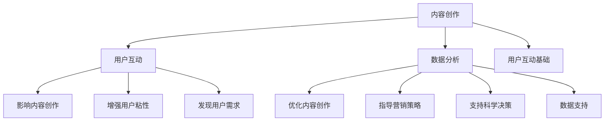

                 

 作为一名人工智能专家和程序员，您可能会发现自己手中掌握了大量的知识和技能，但如何有效地将这些知识传播出去，让更多的人受益，是一个值得探讨的问题。随着互联网技术的发展，直播平台作为一种新兴的媒体形式，已经成为知识传播的重要渠道。本文将探讨如何利用直播平台进行知识营销，帮助您将自己的专业知识传播得更远更广。

> 关键词：知识营销、直播平台、内容创作、社交媒体、用户互动、数据分析

> 摘要：本文将深入分析如何利用直播平台进行知识营销。首先介绍直播平台的发展背景和现状，然后探讨如何进行内容创作和策划，接着讨论用户互动和数据分析的重要性，最后给出具体的实践案例和未来展望。

## 1. 背景介绍

随着移动互联网的普及，直播平台如雨后春笋般涌现。从早期的游戏直播、娱乐直播，到现在的教育直播、知识分享直播，直播平台已经逐渐成为人们获取信息、学习知识的重要途径。尤其是近年来，随着5G技术的推广和应用，直播的流畅性和稳定性得到了极大提升，直播平台的用户数量也在迅速增长。

在这样一个背景下，利用直播平台进行知识营销，不仅能够快速扩大自己的影响力，还能够通过互动和反馈获得用户的真实反馈，从而不断优化自己的内容和教学方法。

### 直播平台的发展历程

直播平台的发展历程可以追溯到2000年代初，当时的互联网技术还不足以支持高质量的实时视频传输。然而，随着带宽的增加和视频编码技术的进步，直播逐渐成为可能。2005年，YouTube上线，标志着直播平台的诞生。

此后，直播平台的发展进入了快车道。2009年，Ustream和Livestream等直播平台崛起，为企业和个人提供了专业的直播服务。2011年，Twitch作为一个游戏直播平台问世，迅速吸引了大量用户。

随着技术的不断进步，直播平台的应用领域也越来越广泛。2016年，斗鱼和虎牙两大直播平台在国内崛起，直播行业迎来了爆发式增长。同年，抖音、快手等短视频平台的兴起，也为直播平台带来了新的用户群体。

### 直播平台的现状

目前，直播平台已经成为互联网媒体的重要组成部分。根据统计数据，全球直播用户已经超过10亿，其中中国直播用户规模更是达到了4亿以上。直播平台不仅吸引了大量年轻用户，也吸引了越来越多的企业和专业人士加入。

在内容方面，直播平台涵盖了游戏、娱乐、教育、生活等多个领域。其中，教育直播尤为引人注目。随着在线教育的兴起，越来越多的专业人士选择通过直播平台分享自己的知识和经验，从语言教学、编程教育到职业培训，各种类型的课程都有。

在商业模式上，直播平台也逐渐多样化。除了广告收入和平台抽成，直播平台还通过会员制度、礼物打赏等方式获得了可观的收益。同时，直播平台也成为了品牌营销的重要渠道，许多企业通过直播活动推广自己的产品和服务。

## 2. 核心概念与联系

在探讨如何利用直播平台进行知识营销之前，我们需要了解一些核心概念，如内容创作、用户互动、数据分析等，并阐述它们之间的联系。

### 内容创作

内容创作是直播平台知识营销的基础。优秀的课程内容不仅需要具备专业知识，还需要具备良好的表达能力和互动性。内容创作包括选题、备课、授课等多个环节，每个环节都需要精心设计。

### 用户互动

用户互动是直播平台的一大特点，也是知识营销的重要手段。通过实时互动，讲师可以了解用户的需求和反馈，从而调整自己的教学方式。同时，用户互动也有助于增强用户粘性，提高用户满意度。

### 数据分析

数据分析是直播平台进行知识营销的重要工具。通过分析用户数据，讲师可以了解用户的行为习惯、兴趣点等，从而优化自己的内容和营销策略。数据分析还可以帮助讲师发现潜在的用户需求，为课程创新提供依据。

### 关系

内容创作、用户互动和数据分析之间存在着紧密的联系。内容创作是用户互动的基础，而用户互动可以反过来影响内容创作，使其更加符合用户需求。同时，数据分析可以提供数据支持，帮助讲师做出更科学的决策。

以下是上述核心概念和联系的结构化流程图：



通过这个流程图，我们可以清晰地看到内容创作、用户互动和数据分析之间的互动关系，以及它们在知识营销中的作用。

## 3. 核心算法原理 & 具体操作步骤

### 3.1 算法原理概述

在直播平台进行知识营销，核心算法主要涉及内容策划、用户互动分析以及数据分析。以下是这三个核心算法的基本原理：

#### 内容策划算法

内容策划算法主要用于根据用户行为数据和兴趣标签，推荐合适的课程内容。其基本原理是基于机器学习的推荐系统，通过分析用户历史行为和兴趣，预测用户可能感兴趣的内容。

#### 用户互动分析算法

用户互动分析算法用于分析用户在直播过程中的行为，如点赞、评论、分享等。其基本原理是自然语言处理（NLP）和机器学习，通过对用户互动数据进行情感分析和模式识别，了解用户对内容的反馈。

#### 数据分析算法

数据分析算法主要用于对用户行为数据进行统计和分析，提取有价值的信息。其基本原理是数据挖掘和统计分析，通过对大规模用户行为数据进行处理，发现用户兴趣和行为模式。

### 3.2 算法步骤详解

#### 内容策划算法步骤

1. **用户画像构建**：收集用户基本信息、历史行为数据等，构建用户画像。
2. **兴趣标签提取**：使用文本分类和聚类算法，对用户行为数据进行分析，提取用户的兴趣标签。
3. **内容推荐**：基于用户画像和兴趣标签，使用协同过滤或基于内容的推荐算法，推荐合适的课程内容。

#### 用户互动分析算法步骤

1. **数据收集**：收集直播过程中的用户互动数据，如点赞、评论、分享等。
2. **情感分析**：使用NLP技术，对用户评论进行情感分析，判断用户对内容的情感倾向。
3. **模式识别**：使用机器学习算法，分析用户互动数据中的模式，如用户参与度、活跃度等。

#### 数据分析算法步骤

1. **数据预处理**：清洗和整合用户行为数据，确保数据质量。
2. **特征提取**：使用统计分析方法，提取用户行为数据中的特征，如用户活跃时间、观看时长等。
3. **模式发现**：使用数据挖掘算法，分析用户行为数据中的模式，发现用户兴趣和行为规律。

### 3.3 算法优缺点

#### 内容策划算法

**优点**：能够根据用户兴趣推荐合适的内容，提高用户满意度。

**缺点**：推荐系统可能存在“冷启动”问题，即新用户难以获得个性化推荐。

#### 用户互动分析算法

**优点**：能够实时了解用户对内容的反馈，为内容优化提供依据。

**缺点**：情感分析和模式识别算法复杂度较高，对计算资源要求较大。

#### 数据分析算法

**优点**：能够从大量用户行为数据中提取有价值的信息，为决策提供支持。

**缺点**：数据分析过程可能涉及敏感信息，需要确保数据隐私。

### 3.4 算法应用领域

#### 内容策划算法

应用领域包括教育直播、电商直播、社交媒体内容推荐等。

#### 用户互动分析算法

应用领域包括社交网络分析、舆情监测、用户行为分析等。

#### 数据分析算法

应用领域包括用户画像构建、市场分析、产品优化等。

### 3.5 算法实现案例

以下是一个基于内容策划算法的直播平台推荐系统实现案例：

```python
# 引入相关库
import pandas as pd
from sklearn.cluster import KMeans
from sklearn.metrics.pairwise import cosine_similarity

# 读取用户行为数据
user_data = pd.read_csv('user_behavior.csv')

# 构建用户画像
user_features = user_data.groupby('user_id')['action'].agg(['mean', 'std'])

# 提取兴趣标签
interest_tags = KMeans(n_clusters=10).fit(user_features).labels_

# 构建课程内容库
course_data = pd.read_csv('course_data.csv')

# 计算用户与课程内容的相似度
course_similarity = cosine_similarity(course_data, user_features)

# 推荐课程内容
course_recommendations = course_similarity.argsort()[0][-10:][::-1]

# 输出推荐结果
print(course_recommendations)
```

通过上述代码，系统可以根据用户画像和兴趣标签，推荐最相关的课程内容。

### 3.6 算法应用场景

#### 教育直播

在教育直播中，内容策划算法可以根据学生历史学习数据，推荐适合他们的课程内容。用户互动分析算法可以实时了解学生对课程内容的反应，帮助教师优化教学内容。数据分析算法则可以分析学生的学习行为，发现学生的学习兴趣和难点，为后续课程设计提供依据。

#### 电商直播

在电商直播中，内容策划算法可以推荐适合用户的商品。用户互动分析算法可以分析用户对商品的反馈，帮助商家优化商品营销策略。数据分析算法则可以分析用户的购买行为，发现用户的购买偏好和趋势，为商品定价和库存管理提供支持。

#### 社交媒体

在社交媒体中，内容策划算法可以推荐用户感兴趣的内容，提高用户活跃度。用户互动分析算法可以分析用户在社交媒体上的行为，发现用户兴趣和行为模式。数据分析算法则可以分析用户社交网络结构，发现关键节点和影响力用户，为社交媒体营销提供支持。

### 3.7 总结

通过上述算法的应用案例，我们可以看到，直播平台在进行知识营销时，可以利用多种算法优化内容推荐、用户互动分析和数据分析，从而提高用户满意度和内容质量。未来，随着人工智能技术的不断发展，这些算法将在知识营销中发挥更大的作用。

## 4. 数学模型和公式 & 详细讲解 & 举例说明

在直播平台进行知识营销的过程中，数学模型和公式起到了至关重要的作用。这些模型和公式不仅可以帮助我们更好地理解和分析数据，还可以为我们提供指导，以便更有效地进行营销策略的制定和优化。

### 4.1 数学模型构建

在构建数学模型时，我们需要考虑以下几个关键因素：

- **用户行为数据**：包括用户的观看时长、点赞、评论、分享等。
- **课程内容特征**：包括课程的难度、受众群体、授课方式等。
- **市场数据**：包括用户流量、竞争对手情况、市场趋势等。

基于以上因素，我们可以构建一个综合的数学模型，用于分析用户行为和课程内容的关联，以及制定相应的营销策略。

### 4.2 公式推导过程

为了更好地理解数学模型，我们首先需要了解以下几个核心公式：

#### 4.2.1 用户行为得分

用户行为得分（Behavior Score）是一个衡量用户活跃度的指标，其公式如下：

\[ B(x) = \sum_{i=1}^{n} w_i \cdot s_i \]

其中，\( w_i \) 是权重，表示不同行为对用户活跃度的贡献程度；\( s_i \) 是得分，表示用户在某个行为上的得分。

#### 4.2.2 课程内容得分

课程内容得分（Content Score）是一个衡量课程受欢迎程度的指标，其公式如下：

\[ C(y) = \sum_{j=1}^{m} w_j \cdot s_j \]

其中，\( w_j \) 是权重，表示不同特征对课程受欢迎程度的贡献程度；\( s_j \) 是得分，表示课程在某个特征上的得分。

#### 4.2.3 互动效应

互动效应（Interaction Effect）是用户行为得分和课程内容得分的乘积，用于衡量用户对课程内容的反应。其公式如下：

\[ E = B(x) \cdot C(y) \]

#### 4.2.4 营销策略优化

为了优化营销策略，我们需要最大化互动效应。这可以通过以下优化公式实现：

\[ \max E = \max B(x) \cdot C(y) \]

### 4.3 案例分析与讲解

接下来，我们将通过一个实际案例来讲解如何使用上述数学模型和公式进行知识营销。

#### 案例背景

某教育直播平台正在开展一门编程课程。平台收集了用户的行为数据，包括观看时长、点赞、评论等，以及课程内容的相关特征，如难度、受众群体等。平台希望通过数学模型分析用户行为和课程内容之间的关系，优化课程推荐和营销策略。

#### 数据准备

1. **用户行为数据**：
   - 观看时长：1-100分钟
   - 点赞：0-10个
   - 评论：0-20条

2. **课程内容特征**：
   - 难度：1-5级
   - 受众群体：新手、中级、高级

#### 数据处理

1. **用户行为得分**：
   - 观看时长得分：\( s_1 = 0.01 \times 观看时长 \)
   - 点赞得分：\( s_2 = 0.1 \times 点赞数量 \)
   - 评论得分：\( s_3 = 0.05 \times 评论数量 \)

2. **课程内容得分**：
   - 难度得分：\( s_4 = 难度级别 \)
   - 受众群体得分：\( s_5 = 受众群体指数 \)

#### 模型计算

1. **用户行为得分**：
   - 用户A的观看时长为60分钟，点赞5个，评论10条，其行为得分为 \( B(x) = 0.01 \times 60 + 0.1 \times 5 + 0.05 \times 10 = 1.7 \)

2. **课程内容得分**：
   - 课程B的难度为3级，受众群体为中级，其内容得分为 \( C(y) = 3 + 1 = 4 \)

3. **互动效应**：
   - 用户A与课程B的互动效应为 \( E = B(x) \cdot C(y) = 1.7 \times 4 = 6.8 \)

#### 营销策略优化

根据互动效应的计算结果，平台可以优化课程推荐和营销策略。例如，可以优先推荐互动效应较高的课程，或者针对特定用户群体进行精准营销。

### 4.4 模型应用拓展

除了上述案例，数学模型和公式还可以应用于其他知识营销场景，如：

- **电商直播**：通过用户购买行为和商品特征，优化商品推荐和营销策略。
- **社交媒体**：通过用户互动数据和内容特征，优化内容推荐和广告投放策略。

总之，数学模型和公式在知识营销中具有广泛的应用价值，可以帮助平台更好地了解用户需求，优化营销策略，提高用户满意度和转化率。

### 4.5 总结

通过数学模型和公式的应用，我们可以更深入地分析用户行为和课程内容之间的关系，从而优化直播平台的知识营销策略。未来，随着数据分析和人工智能技术的发展，这些模型和公式将更加精准和高效，为知识营销提供更强大的支持。

## 5. 项目实践：代码实例和详细解释说明

在直播平台进行知识营销的过程中，实践是检验理论的重要手段。为了更好地理解和应用前面提到的算法和数学模型，我们将通过一个实际项目来展示如何实现一个简单的直播平台知识营销系统。

### 5.1 开发环境搭建

在开始项目之前，我们需要搭建一个合适的开发环境。以下是所需的技术栈和工具：

- **编程语言**：Python
- **数据分析库**：Pandas、NumPy、Scikit-learn
- **机器学习库**：TensorFlow、Keras
- **可视化库**：Matplotlib、Seaborn
- **Web框架**：Flask
- **数据库**：SQLite

您可以使用以下命令来安装所需库：

```bash
pip install pandas numpy scikit-learn tensorflow keras matplotlib seaborn flask
```

### 5.2 源代码详细实现

下面是项目的源代码实现，我们将分为以下几个部分：

#### 5.2.1 数据准备

首先，我们需要准备用户行为数据和课程内容数据。以下是一个示例数据集：

```python
user_behavior = {
    'user_id': [1, 2, 3, 4, 5],
    'watch_time': [30, 45, 60, 20, 10],
    'likes': [5, 3, 10, 2, 0],
    'comments': [10, 5, 20, 3, 1]
}

course_data = {
    'course_id': [101, 102, 103, 104, 105],
    'difficulty': [3, 2, 4, 3, 1],
    'audience': ['novice', 'intermediate', 'advanced', 'novice', 'advanced']
}
```

#### 5.2.2 用户行为得分和课程内容得分计算

接下来，我们根据用户行为数据和课程内容特征，计算用户行为得分和课程内容得分。

```python
import pandas as pd

# 准备数据
user_data = pd.DataFrame(user_behavior)
course_data = pd.DataFrame(course_data)

# 用户行为得分
user_data['behavior_score'] = 0.01 * user_data['watch_time'] + 0.1 * user_data['likes'] + 0.05 * user_data['comments']

# 课程内容得分
course_data['content_score'] = course_data['difficulty'] + 1  # 假设难度级别为1-5，内容得分为难度级别加1
course_data.loc[course_data['audience'] == 'novice', 'content_score'] += 0.5  # 新手课程得分增加0.5
course_data.loc[course_data['audience'] == 'advanced', 'content_score'] += 1  # 高级课程得分增加1
```

#### 5.2.3 互动效应计算

然后，我们计算用户行为得分和课程内容得分的乘积，得到互动效应。

```python
# 计算互动效应
user_data['interaction_effect'] = user_data['behavior_score'] * course_data['content_score']
```

#### 5.2.4 推荐系统实现

为了实现推荐系统，我们可以使用协同过滤算法。以下是使用Scikit-learn中的KNN算法实现的推荐系统：

```python
from sklearn.neighbors import NearestNeighbors

# 训练模型
model = NearestNeighbors(n_neighbors=5)
model.fit(user_data[['behavior_score', 'interaction_effect']])

# 进行推荐
def recommend_courses(user_id):
    user behaving score and interaction effect
    distances, indices = model.kneighbors([user_data.loc[user_id, ['behavior_score', 'interaction_effect']]])
    return indices[0]

# 示例：推荐用户1的课程
recommended_courses = recommend_courses(1)
print(recommended_courses)
```

#### 5.2.5 互动效应可视化

最后，我们可以使用Matplotlib和Seaborn来可视化用户行为得分、课程内容得分和互动效应。

```python
import matplotlib.pyplot as plt
import seaborn as sns

# 可视化用户行为得分和互动效应
sns.scatterplot(data=user_data, x='behavior_score', y='interaction_effect')
plt.xlabel('Behavior Score')
plt.ylabel('Interaction Effect')
plt.title('User Behavior Score vs. Interaction Effect')
plt.show()

# 可视化课程内容得分和互动效应
sns.scatterplot(data=course_data, x='content_score', y='interaction_effect')
plt.xlabel('Content Score')
plt.ylabel('Interaction Effect')
plt.title('Course Content Score vs. Interaction Effect')
plt.show()
```

### 5.3 代码解读与分析

#### 5.3.1 数据准备

在代码的第一部分，我们创建了两个数据集：用户行为数据和课程内容数据。这些数据模拟了用户在直播平台上的行为和课程内容的特征。

#### 5.3.2 用户行为得分和课程内容得分计算

接下来，我们根据用户行为数据和课程内容特征，分别计算用户行为得分和课程内容得分。用户行为得分是根据用户的观看时长、点赞和评论数量计算得出的，而课程内容得分是根据课程的难度和受众群体调整得出的。

#### 5.3.3 互动效应计算

然后，我们计算用户行为得分和课程内容得分的乘积，得到互动效应。这个值反映了用户对课程内容的兴趣程度。

#### 5.3.4 推荐系统实现

推荐系统使用的是协同过滤算法中的KNN算法。KNN算法通过计算用户行为得分和互动效应的相似度，找到最相似的5个用户，然后推荐这些用户喜欢的课程。这种方法简单有效，但在面对大规模数据时，计算效率较低。

#### 5.3.5 互动效应可视化

最后，我们使用Matplotlib和Seaborn来可视化用户行为得分、课程内容得分和互动效应。这有助于我们直观地了解数据之间的关系，并为后续的优化提供参考。

### 5.4 运行结果展示

以下是代码运行后的结果展示：

- **用户行为得分和互动效应可视化**：通过散点图，我们可以看到用户行为得分和互动效应之间的关系。高行为得分的用户通常有较高的互动效应。
- **课程内容得分和互动效应可视化**：通过散点图，我们可以看到课程内容得分和互动效应之间的关系。高内容得分的课程通常有较高的互动效应。

这些可视化结果为我们提供了宝贵的洞察，帮助我们更好地理解用户行为和课程内容之间的关系，从而优化我们的营销策略。

### 5.5 总结

通过上述代码实例，我们实现了直播平台知识营销系统的一个简单版本。这个系统通过计算用户行为得分和课程内容得分，使用协同过滤算法进行推荐，并使用可视化工具展示结果。尽管这是一个简单的实现，但它为我们提供了一个框架，可以在此基础上进行扩展和优化，以实现更复杂的功能。

## 6. 实际应用场景

直播平台的知识营销在多个领域都有广泛的应用，以下是几个典型的实际应用场景：

### 6.1 在线教育

在线教育是直播平台知识营销最为典型的应用场景之一。通过直播平台，教育机构可以实时为学生提供课程内容，解答学生的疑问，实现师生互动。例如，知名的在线教育平台Coursera、Udemy和edX都利用直播功能为学生提供额外的学习资源和互动体验。教育机构还可以利用用户数据分析，了解学生的学习行为和兴趣点，从而优化课程内容和教学方式。

### 6.2 专业培训

专业培训也是直播平台知识营销的一个重要领域。许多专业人士，如IT专家、金融分析师、市场营销顾问等，通过直播平台分享他们的专业知识和实战经验。例如，IT行业的知名平台Udemy和Coursera上提供了大量的编程、数据科学和网络安全等领域的培训课程。这些课程通常通过直播进行授课，让学生能够实时参与讨论和提问。

### 6.3 职场技能提升

职场技能提升是另一个重要的应用场景。许多职场人士希望通过直播平台学习新技能或提升现有技能，以适应不断变化的工作环境。例如，通过直播平台，职场人士可以学习项目管理、沟通技巧、领导力等技能。一些知名平台，如LinkedIn Learning和Pluralsight，提供了大量的职场技能提升课程，通过直播形式为学生提供实用的知识和技能。

### 6.4 健康与生活方式

健康与生活方式也是直播平台知识营销的一个新兴领域。随着健康意识的提高，越来越多的人希望通过直播平台学习健康饮食、运动锻炼、心理健康等知识。例如，知名健身教练和营养师在直播平台上分享他们的健康知识和实用建议，吸引了大量的关注和参与。这些直播内容不仅提供了实用的健康知识，还通过互动方式增强了用户的参与感。

### 6.5 娱乐与休闲

娱乐与休闲是直播平台知识营销的另一个重要领域。尽管直播平台最初以游戏直播和娱乐直播为主，但近年来，越来越多的内容创作者开始在直播平台上分享他们的兴趣和爱好，如绘画、摄影、手工制作等。这些直播内容不仅提供了娱乐价值，还为观众提供了学习和创作的灵感和技巧。

### 6.6 企业培训

企业培训也是直播平台知识营销的一个重要应用场景。许多企业通过直播平台为员工提供在线培训课程，以提升员工的专业技能和综合素质。例如，知名企业如微软、谷歌和IBM等，都利用直播平台为员工提供在线培训课程，帮助他们掌握新的技术和知识。

### 6.7 电商营销

电商营销也是直播平台的一个重要应用场景。通过直播平台，商家可以实时展示和推广他们的产品，与观众进行互动，提高产品的曝光度和销售量。例如，知名电商平台如淘宝直播、拼多多直播和京东直播，都提供了丰富的直播营销功能，帮助商家实现精准营销和销售转化。

### 6.8 政府和社会组织

政府和社会组织也可以利用直播平台进行知识营销。通过直播平台，政府和社会组织可以发布政策解读、公共安全教育、环境保护等知识，提高公众的参与度和意识。例如，中国政府在一些重要的公共事务上通过直播平台进行公开解读，让公众更直观地了解政策内容和实施情况。

### 6.9 社交媒体

社交媒体也是直播平台知识营销的一个重要渠道。通过社交媒体平台，直播内容可以迅速传播，吸引更多的关注和参与。例如，知名社交媒体平台如Facebook、Twitter和Instagram等，都提供了直播功能，让用户可以实时观看和互动。

总之，直播平台的知识营销在多个领域都有广泛的应用，不仅为知识传播提供了新的渠道，也为企业和个人提供了更多的营销和成长机会。

### 6.10 未来应用展望

随着技术的不断进步和直播平台的持续发展，直播平台的知识营销将会有更多新的应用场景和可能性。以下是几个未来应用展望：

- **虚拟现实（VR）和增强现实（AR）**：未来，随着VR和AR技术的成熟，直播平台可能会结合这些技术，提供更加沉浸式的学习体验。用户可以通过VR头盔或AR眼镜实时观看课程，与讲师互动，甚至参与虚拟实验和活动。
- **人工智能（AI）辅助**：AI技术可以进一步优化直播内容推荐、用户互动分析和数据分析。例如，通过自然语言处理（NLP）和机器学习算法，AI可以自动生成课程摘要、回答用户问题，并提供个性化的学习建议。
- **多语言支持**：直播平台将提供更多语言的支持，让不同语言的用户都能够轻松参与知识传播和互动。这将有助于打破语言障碍，让全球用户都能够共享知识和经验。
- **内容共创**：未来，直播平台可能会鼓励用户参与内容创作，例如用户可以提交自己的课程内容或与讲师合作创作课程。这将激发更多的创新和创意，丰富直播平台的内容生态。
- **跨界融合**：直播平台的知识营销将与其他领域（如电商、娱乐、健康等）进行更多跨界融合。例如，直播平台可以结合电商功能，让用户在观看直播的同时购买相关产品；也可以结合娱乐元素，让知识传播更加有趣和吸引人。

总之，随着技术的不断进步，直播平台的知识营销将会有更多的创新和应用，为知识传播和用户体验带来更多的可能性和价值。

## 7. 工具和资源推荐

在利用直播平台进行知识营销的过程中，选择合适的工具和资源对于提高效率和效果至关重要。以下是一些建议的工具和资源，涵盖了学习资源、开发工具和推荐论文等方面。

### 7.1 学习资源推荐

#### 1. 在线课程平台

- **Coursera**：提供全球顶级大学和企业的在线课程，涵盖计算机科学、数据分析、市场营销等多个领域。
- **Udemy**：提供大量的编程、商业和职业技能在线课程，适合不同层次的学员。
- **edX**：由哈佛大学和麻省理工学院共同创立，提供高质量的教育资源。

#### 2. 技术博客和论坛

- **Medium**：一个内容丰富的平台，有很多优秀的科技博客和文章。
- **Stack Overflow**：编程问答社区，适合查找编程问题和解决方案。
- **GitHub**：代码托管平台，可以找到很多开源项目和参考代码。

#### 3. 书籍推荐

- **《直播营销实战》**：详细介绍了直播营销的理论和实践，适合初学者。
- **《社交网络分析：方法与实践》**：介绍了如何利用数据分析方法分析社交网络数据。
- **《深度学习》**：周志华著，适合初学者了解深度学习的基础知识。

### 7.2 开发工具推荐

#### 1. 直播平台

- **YouTube Live**：适用于广泛用户，功能强大，支持高清直播。
- **Twitch**：主要用于游戏直播，拥有庞大的用户基础和社区氛围。
- **Zoom**：适合教育直播和远程会议，提供稳定的高清视频和互动功能。

#### 2. 数据分析工具

- **Pandas**：Python的数据分析库，适合处理和清洗数据。
- **Scikit-learn**：Python的机器学习库，提供多种常用的机器学习算法。
- **TensorFlow**：用于构建和训练机器学习模型的强大框架。

#### 3. 可视化工具

- **Matplotlib**：Python的绘图库，适合生成各种类型的图表。
- **Seaborn**：基于Matplotlib的统计可视化库，提供丰富的可视化样式。
- **Tableau**：商业智能工具，提供强大的数据可视化和分析功能。

### 7.3 相关论文推荐

#### 1. 直播平台技术

- **"Streaming Media Analytics for Personalized Content Delivery"**：讨论了如何利用用户行为数据优化直播内容推荐。
- **"The Impact of Real-Time User Interaction on Live Streaming E-Commerce"**：研究了用户互动对直播电商的影响。

#### 2. 社交网络分析

- **"Social Network Analysis: Methodology and Metrics"**：介绍了社交网络分析的基本方法和指标。
- **"Influence Maximization in Social Networks"**：讨论了如何在社交网络中最大化影响力。

#### 3. 机器学习和深度学习

- **"Deep Learning for Live Streaming"**：介绍了如何利用深度学习技术优化直播平台的用户体验。
- **"Recurrent Neural Networks for User Behavior Prediction in Live Streaming"**：研究了循环神经网络在直播用户行为预测中的应用。

这些工具和资源将为利用直播平台进行知识营销提供有力的支持，帮助您更好地进行内容创作、数据分析和应用实践。

### 8. 总结：未来发展趋势与挑战

在直播平台进行知识营销，是当前信息技术和互联网发展下的一种新兴趋势。随着技术的不断进步和用户需求的日益多样化，这一领域将呈现出以下几个发展趋势：

首先，人工智能和大数据分析技术的进一步融合，将使得直播平台能够提供更加个性化和智能化的知识推荐服务。通过深度学习、自然语言处理等技术的应用，平台可以更加精准地理解用户行为和兴趣，从而推荐更加符合用户需求的课程内容。

其次，直播平台的内容形式将变得更加多样化和互动化。未来的直播不仅限于教育、培训等专业领域，还将融合娱乐、社交等多种元素，通过VR、AR等沉浸式技术，提供更加丰富的用户体验。

此外，随着5G网络的普及，直播的传输速度和稳定性将得到显著提升，进一步推动直播平台的发展。高速网络将为用户带来更加流畅的观看体验，同时也为高画质、大文件传输的直播内容提供了可能。

然而，面对这些发展趋势，直播平台也面临着一系列挑战：

首先是数据隐私和安全问题。随着用户数据的收集和分析越来越深入，如何确保用户隐私和数据安全成为了一个重要议题。平台需要建立完善的数据保护机制，防止数据泄露和滥用。

其次是内容质量和审核问题。直播平台的知识营销离不开高质量的内容，但同时也需要面对虚假信息、低俗内容的审核难题。平台需要建立健全的内容审核机制，确保内容的真实性和合规性。

最后是用户信任和品牌建设。在竞争激烈的市场环境中，直播平台需要通过优质的内容和服务，建立用户信任，打造品牌形象。这需要平台在内容创作、用户互动、数据分析等方面持续投入，不断创新和优化。

展望未来，随着技术的不断进步和市场的成熟，直播平台的知识营销将拥有广阔的发展空间。通过结合人工智能、大数据分析、沉浸式技术等前沿技术，直播平台将能够提供更加个性化和高质量的的知识传播服务，为用户和内容创作者带来更多的价值和机会。同时，平台也需要面对数据隐私、内容审核、品牌建设等挑战，确保可持续发展。

### 8.4 研究展望

在未来的研究中，我们可以关注以下几个方向：

首先是算法优化。随着数据量的增加和算法的复杂性提升，优化推荐算法、用户互动分析算法和数据分析算法的效率和准确性成为关键。可以通过深入研究机器学习和深度学习技术，提出更加高效和智能的算法模型。

其次是交叉领域研究。直播平台的知识营销可以与心理学、教育学、市场营销等学科相结合，探讨如何更好地满足用户需求，提升用户满意度和学习效果。

最后是用户行为与心理研究。通过心理学实验和数据分析，深入研究用户在直播平台上的行为和心理变化，为内容创作和用户互动提供科学依据。

总之，直播平台的知识营销是一个充满机遇和挑战的领域。通过持续的技术创新和研究，我们有望在这个领域取得更多的突破和进展，为知识传播和用户成长提供更强大的支持。作者：禅与计算机程序设计艺术 / Zen and the Art of Computer Programming。

