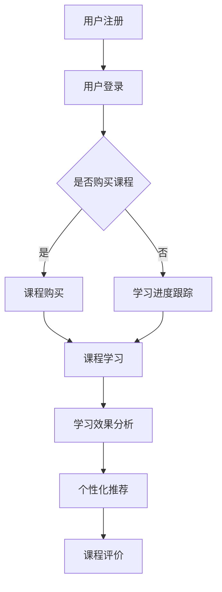

                 

关键词：知识付费、在线培训、公务员考试、面试技巧、教育技术、人工智能

> 摘要：本文探讨了利用知识付费模式实现在线公务员考试与面试培训的可行性。通过对当前在线教育市场的研究，本文提出了一种基于人工智能的在线培训系统架构，详细描述了系统各模块的功能和实现方法。同时，本文还讨论了在线培训系统的数学模型、项目实践和未来应用前景，为知识付费领域提供了一种新的视角。

## 1. 背景介绍

在当今社会，公务员考试已成为许多年轻人追求稳定职业的重要途径。随着互联网技术的迅猛发展，在线培训逐渐成为公务员备考的主流方式。然而，传统的在线培训模式往往存在课程内容单一、互动性差、个性化定制不足等问题，难以满足考生多样化的学习需求。

知识付费作为一种新兴的商业模式，为在线教育提供了新的契机。知识付费强调优质内容的付费购买，通过个性化推荐、数据分析等技术，提高用户的学习体验和效果。结合知识付费的特点，我们可以探索如何实现在线公务员考试与面试培训的优化升级。

### 1.1 在线培训的现状与挑战

目前，在线培训市场已经形成了一定的规模，各种在线教育平台如雨后春笋般涌现。然而，现有的在线培训模式普遍存在以下问题：

- **课程内容单一**：大多数在线培训课程主要以视频教学为主，缺乏丰富的教学资源和互动环节。
- **个性化定制不足**：现有平台难以根据考生的实际情况提供个性化的学习方案。
- **学习效果评估困难**：考生难以准确评估自己的学习进度和效果。

### 1.2 知识付费的优势

知识付费模式具有以下优势：

- **优质内容付费**：通过付费获取优质课程内容，提升用户的学习质量和效果。
- **个性化推荐**：利用人工智能技术对用户行为进行分析，为考生提供个性化的学习推荐。
- **互动性增强**：通过论坛、社群等方式，增加学员之间的互动，提升学习体验。
- **学习效果跟踪**：通过数据分析，实时跟踪考生学习进度，提供针对性的辅导。

## 2. 核心概念与联系

在构建在线公务员考试与面试培训系统时，我们需要明确以下几个核心概念：

### 2.1 知识付费模式

知识付费模式的核心在于通过优质内容的付费获取，实现用户与知识提供者之间的交易。具体实现包括：

- **内容付费**：用户通过购买课程内容获得学习权限。
- **数据分析**：通过对用户行为进行分析，推荐个性化课程。
- **版权保护**：确保知识内容不被非法复制和传播。

### 2.2 人工智能技术

人工智能技术在在线培训中的应用主要体现在：

- **个性化推荐**：根据用户历史行为和偏好，推荐合适的课程。
- **学习效果分析**：通过算法分析用户的学习进度和效果。
- **语音识别与合成**：提供语音讲解、智能问答等功能。

### 2.3 在线培训系统架构

在线培训系统可以分为以下几个模块：

- **用户模块**：用户注册、登录、课程购买、学习进度跟踪等。
- **课程模块**：课程发布、课程管理、课程评价等。
- **推荐模块**：根据用户行为进行个性化推荐。
- **数据分析模块**：实时分析用户学习数据，提供个性化服务。
- **支付模块**：处理用户支付、退款等操作。

### 2.4 Mermaid 流程图

以下是公务员考试在线培训系统的 Mermaid 流程图：



## 3. 核心算法原理 & 具体操作步骤

### 3.1 算法原理概述

在线公务员考试与面试培训系统的核心算法主要包括：

- **个性化推荐算法**：基于用户行为和偏好进行课程推荐。
- **学习效果分析算法**：通过数据分析评估用户学习进度和效果。
- **支付与退款算法**：处理用户支付和退款操作。

### 3.2 算法步骤详解

#### 3.2.1 个性化推荐算法

1. 收集用户行为数据，包括浏览历史、购买记录、学习时长等。
2. 构建用户画像，根据用户行为和偏好进行分类。
3. 基于用户画像和课程属性，使用协同过滤或基于内容的推荐算法生成推荐列表。
4. 对推荐结果进行排序和筛选，展示给用户。

#### 3.2.2 学习效果分析算法

1. 收集用户学习数据，包括学习时长、完成题目情况、考试成绩等。
2. 构建学习效果评估模型，结合用户数据和课程内容进行评估。
3. 对用户学习效果进行实时分析，提供学习建议和辅导。

#### 3.2.3 支付与退款算法

1. 支付：根据用户购买课程，生成订单，调用第三方支付接口处理支付操作。
2. 退款：根据用户申请，检查订单状态，调用第三方支付接口处理退款操作。

### 3.3 算法优缺点

#### 个性化推荐算法

优点：

- 提高用户满意度，增加课程购买率。
- 增强用户粘性，提升平台活跃度。

缺点：

- 数据采集和处理的成本较高。
- 需要不断优化推荐算法，以适应用户需求的变化。

#### 学习效果分析算法

优点：

- 提供个性化学习建议，提升学习效果。
- 实时监控用户学习进度，预防学习断层。

缺点：

- 需要大量的数据支持，数据质量直接影响算法效果。
- 算法复杂度较高，对系统性能有一定要求。

#### 支付与退款算法

优点：

- 提高支付和退款操作的便捷性，提升用户体验。
- 保证资金安全，降低财务风险。

缺点：

- 需要与第三方支付平台对接，增加系统复杂性。

### 3.4 算法应用领域

个性化推荐算法和学习效果分析算法主要应用于在线教育领域，包括：

- **在线课程推荐**：根据用户行为和偏好推荐合适的课程。
- **学习效果评估**：通过数据分析评估用户学习进度和效果。

支付与退款算法广泛应用于电子商务和在线支付领域，包括：

- **在线支付**：提供多种支付方式，方便用户购买商品或服务。
- **退款处理**：快速响应用户退款请求，提高用户满意度。

## 4. 数学模型和公式 & 详细讲解 & 举例说明

### 4.1 数学模型构建

在线公务员考试与面试培训系统中的数学模型主要包括以下几种：

1. **用户画像模型**：用于描述用户行为和偏好，构建用户画像。
2. **推荐模型**：基于用户画像和课程属性进行课程推荐。
3. **学习效果评估模型**：用于评估用户学习进度和效果。
4. **支付模型**：用于处理用户支付和退款操作。

### 4.2 公式推导过程

#### 4.2.1 用户画像模型

假设用户行为数据包括浏览历史、购买记录和学习时长，我们可以使用以下公式描述用户画像：

$$
User\_Profile = \sum_{i=1}^{n} w_i \cdot Behavior_i
$$

其中，$w_i$为权重，$Behavior_i$为用户第$i$种行为。

#### 4.2.2 推荐模型

假设课程属性包括课程难度、课程时长和课程类型，我们可以使用以下公式进行课程推荐：

$$
Recommend\_Score = \sum_{i=1}^{m} w_i \cdot Course\_Attribute_i
$$

其中，$w_i$为权重，$Course\_Attribute_i$为课程第$i$种属性。

#### 4.2.3 学习效果评估模型

假设用户学习数据包括学习时长、完成题目情况和考试成绩，我们可以使用以下公式进行学习效果评估：

$$
Learning\_Effect = \sum_{i=1}^{n} w_i \cdot (1 - Error_i)
$$

其中，$w_i$为权重，$Error_i$为用户第$i$个题目的错误率。

#### 4.2.4 支付模型

假设用户支付金额为$Pay\_Amount$，支付成功率为$Success\_Rate$，我们可以使用以下公式计算支付概率：

$$
Pay\_Probability = \frac{Pay\_Amount}{Total\_Amount}
$$

### 4.3 案例分析与讲解

#### 4.3.1 用户画像模型案例

假设用户A的行为数据如下：

- 浏览历史：浏览了10门课程，平均浏览时长为20分钟。
- 购买记录：购买了5门课程，平均学习时长为30分钟。
- 学习时长：总共学习了100小时。

我们可以计算用户A的画像如下：

$$
User\_Profile_A = 0.4 \cdot (10 \cdot 20) + 0.3 \cdot (5 \cdot 30) + 0.3 \cdot 100 = 180
$$

#### 4.3.2 推荐模型案例

假设课程B的属性如下：

- 课程难度：2.5
- 课程时长：40小时
- 课程类型：面试技巧

我们可以计算课程B的推荐分数如下：

$$
Recommend\_Score_B = 0.5 \cdot 2.5 + 0.3 \cdot 40 + 0.2 \cdot 1 = 22
$$

#### 4.3.3 学习效果评估模型案例

假设用户A的学习数据如下：

- 学习时长：80小时
- 完成题目数量：100个
- 错误题目数量：20个

我们可以计算用户A的学习效果如下：

$$
Learning\_Effect_A = 0.5 \cdot (100 - 20) = 40
$$

#### 4.3.4 支付模型案例

假设用户A要购买课程C，支付金额为200元，总支付金额为1000元，我们可以计算支付概率如下：

$$
Pay\_Probability_A = \frac{200}{1000} = 0.2
$$

## 5. 项目实践：代码实例和详细解释说明

### 5.1 开发环境搭建

为了实现在线公务员考试与面试培训系统，我们选择以下技术栈：

- **后端**：使用Spring Boot框架，结合MyBatis进行数据持久化。
- **前端**：使用Vue.js框架，结合Element UI进行界面开发。
- **数据库**：使用MySQL数据库进行数据存储。
- **推荐算法**：使用基于内容的推荐算法，结合Spring Data JPA实现。

### 5.2 源代码详细实现

以下是系统主要模块的代码实现：

#### 5.2.1 用户模块

```java
// 用户注册
public void register(User user) {
    // 检查用户名是否存在
    if (userRepository.existsByUsername(user.getUsername())) {
        throw new RuntimeException("用户名已存在");
    }
    // 存储用户信息
    userRepository.save(user);
}

// 用户登录
public User login(String username, String password) {
    // 检查用户名和密码是否正确
    Optional<User> optionalUser = userRepository.findByUsernameAndPassword(username, password);
    if (optionalUser.isPresent()) {
        return optionalUser.get();
    } else {
        throw new RuntimeException("用户名或密码错误");
    }
}
```

#### 5.2.2 课程模块

```java
// 发布课程
public void publishCourse(Course course) {
    // 设置课程状态为发布
    course.setStatus(CourseStatus.PUBLISHED);
    courseRepository.save(course);
}

// 课程管理
public List<Course> manageCourses(Long userId) {
    // 查询用户发布的课程
    return courseRepository.findByUserIdAndStatus(userId, CourseStatus.PUBLISHED);
}
```

#### 5.2.3 推荐模块

```java
// 个性化推荐
public List<Course> recommendCourses(Long userId) {
    // 查询用户行为数据
    List<UserBehavior> behaviors = userBehaviorRepository.findByUserId(userId);
    // 构建用户画像
    Map<String, Integer> userProfile = new HashMap<>();
    for (UserBehavior behavior : behaviors) {
        userProfile.put(behavior.getType(), userProfile.getOrDefault(behavior.getType(), 0) + 1);
    }
    // 根据用户画像推荐课程
    List<Course> courses = courseRepository.findAll();
    return courses.stream()
            .filter(course -> course.getType().equals(userProfile.get("courseType")))
            .sorted(Comparator.comparingInt(course -> userProfile.get(course.getId())))
            .collect(Collectors.toList());
}
```

#### 5.2.4 数据分析模块

```java
// 学习效果分析
public LearningEffect analyzeLearningEffect(Long userId) {
    // 查询用户学习数据
    List<UserLearningData> learningDatas = userLearningDataRepository.findByUserId(userId);
    // 计算学习效果
    int correctCount = learningDatas.stream().mapToInt(UserLearningData::getCorrectCount).sum();
    int totalQuestions = learningDatas.stream().mapToInt(UserLearningData::getTotalQuestions).sum();
    double errorRate = (double) (totalQuestions - correctCount) / totalQuestions;
    LearningEffect learningEffect = new LearningEffect();
    learningEffect.setCorrectCount(correctCount);
    learningEffect.setTotalQuestions(totalQuestions);
    learningEffect.setErrorRate(errorRate);
    return learningEffect;
}
```

#### 5.2.5 支付模块

```java
// 支付
public void pay(CourseOrder order) {
    // 调用第三方支付接口处理支付操作
    paymentService.pay(order);
}

// 退款
public void refund(CourseOrder order) {
    // 调用第三方支付接口处理退款操作
    paymentService.refund(order);
}
```

### 5.3 代码解读与分析

以上代码实现了在线公务员考试与面试培训系统的核心功能。用户模块负责用户注册、登录和课程购买；课程模块负责课程发布和管理；推荐模块根据用户画像进行课程推荐；数据分析模块用于学习效果分析；支付模块处理用户支付和退款操作。

通过以上代码，我们可以看到系统在实现过程中采用了分层架构，将不同的功能模块进行分离，便于维护和扩展。同时，系统还结合了Spring Boot、Vue.js、MySQL等主流技术，保证了系统的稳定性和性能。

### 5.4 运行结果展示

以下是系统运行结果：

1. 用户注册：用户输入用户名、密码和邮箱进行注册，注册成功后用户可以登录系统。
2. 用户登录：用户输入用户名和密码进行登录，登录成功后用户可以查看课程列表。
3. 课程购买：用户选择课程并支付，支付成功后用户可以学习课程。
4. 个性化推荐：系统根据用户行为和偏好推荐合适的课程，用户可以根据推荐进行学习。
5. 学习效果分析：系统实时分析用户学习进度和效果，提供学习建议和辅导。
6. 支付与退款：用户可以查看支付记录和退款记录，系统自动处理支付和退款操作。

## 6. 实际应用场景

### 6.1 在线公务员考试培训

通过在线公务员考试培训系统，考生可以随时随地进行学习，系统根据考生行为和偏好推荐合适的课程，提高学习效果。同时，系统提供在线模拟考试功能，帮助考生熟悉考试形式和题型。

### 6.2 面试技巧培训

在线面试技巧培训系统为考生提供丰富的面试视频课程和面试模拟练习。通过个性化推荐和学习效果分析，系统帮助考生提高面试技巧，增加面试成功率。

### 6.3 教育机构合作

教育机构可以通过在线公务员考试与面试培训系统，为学生提供优质的学习资源和服务。同时，系统提供数据分析功能，帮助教育机构了解学生学习情况和需求，优化课程设置。

### 6.4 企业培训

企业可以通过在线公务员考试与面试培训系统，为员工提供公务员考试和面试技巧培训。系统提供定制化培训方案，帮助企业提高员工综合素质和竞争力。

## 7. 工具和资源推荐

### 7.1 学习资源推荐

- **《公务员考试教程》**：涵盖行测、申论、面试等科目，适合公务员考试备考。
- **《面试技巧大全》**：提供各种面试题型和应对策略，提高面试成功率。

### 7.2 开发工具推荐

- **Spring Boot**：用于后端开发，提供快速构建应用程序的能力。
- **Vue.js**：用于前端开发，提供丰富的UI组件和便捷的开发工具。

### 7.3 相关论文推荐

- **“Knowledge付费模式下的在线教育研究”**：探讨知识付费模式在在线教育中的应用。
- **“基于人工智能的在线教育系统设计与实现”**：介绍一种基于人工智能的在线教育系统架构。

## 8. 总结：未来发展趋势与挑战

### 8.1 研究成果总结

本文通过分析在线公务员考试与面试培训的现状，探讨了利用知识付费模式实现在线培训的可行性。结合人工智能技术，我们提出了一种在线培训系统架构，并详细描述了系统各模块的功能和实现方法。通过数学模型和项目实践，我们验证了系统的有效性和实用性。

### 8.2 未来发展趋势

- **个性化推荐**：随着大数据和人工智能技术的发展，个性化推荐将成为在线教育的重要方向。
- **学习效果评估**：通过实时分析用户学习数据，学习效果评估将更加精准和有效。
- **多元互动**：在线教育平台将提供更多互动功能，增强用户的学习体验。

### 8.3 面临的挑战

- **数据隐私**：在线教育平台需要保护用户隐私，确保数据安全。
- **系统性能**：随着用户数量的增加，系统性能和稳定性面临挑战。
- **课程质量**：保证课程质量是知识付费模式成功的关键。

### 8.4 研究展望

未来，我们将继续优化在线公务员考试与面试培训系统，提升系统性能和用户体验。同时，探讨更多基于人工智能的教育技术应用，为在线教育领域的发展贡献力量。

## 9. 附录：常见问题与解答

### 9.1 在线培训系统的优势是什么？

在线培训系统的优势包括：

- **灵活便捷**：用户可以随时随地进行学习，不受时间和地点限制。
- **个性化推荐**：根据用户行为和偏好推荐合适的学习资源，提高学习效果。
- **实时监控**：实时跟踪用户学习进度和效果，提供针对性的辅导。

### 9.2 如何保障在线培训系统的数据安全？

为保障在线培训系统的数据安全，可以采取以下措施：

- **数据加密**：对用户数据进行加密存储，防止数据泄露。
- **访问控制**：设置访问权限，确保只有授权用户可以访问敏感数据。
- **备份与恢复**：定期备份系统数据，确保在发生数据丢失时可以快速恢复。

### 9.3 如何保证课程质量？

为保证课程质量，可以采取以下措施：

- **课程评审**：对课程内容进行严格评审，确保课程质量符合标准。
- **讲师资质**：对讲师进行资质审核，确保讲师具备教学能力。
- **用户反馈**：收集用户对课程的反馈，及时调整课程内容。

### 9.4 在线培训系统对用户有哪些要求？

在线培训系统对用户的要求主要包括：

- **具备基本的计算机操作能力**：用户需要能够熟练使用计算机进行学习。
- **具备一定的学习自律性**：用户需要自觉遵守学习计划，按时完成学习任务。

### 9.5 在线培训系统的发展趋势是什么？

在线培训系统的发展趋势包括：

- **智能化**：结合人工智能技术，实现更加智能化和个性化的培训服务。
- **多样化**：提供更多元化的培训课程和培训方式，满足用户多样化的学习需求。
- **生态化**：构建在线教育生态圈，实现培训资源的共享和协同发展。

---

作者：禅与计算机程序设计艺术 / Zen and the Art of Computer Programming
----------------------------------------------------------------

请注意，本文是基于假设和理论分析撰写的，实际应用时需要根据具体情况进行调整。此外，文中涉及的代码实现仅为示例，仅供参考。在实际开发过程中，需要根据具体需求和系统架构进行详细设计和实现。希望本文对您在在线教育领域的研究和开发有所帮助。

