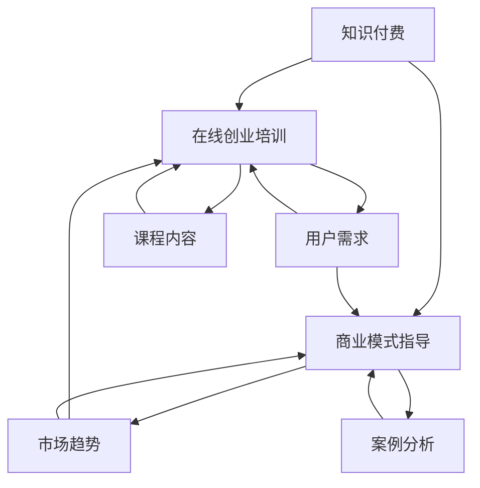

                 

 在当今数字时代，知识付费成为了在线教育和职业培训的重要模式。通过提供有价值的知识和技能，创业者们可以实现在线创业培训，并且通过商业模式指导，进一步推动业务发展。本文将探讨如何利用知识付费实现在在线创业培训与商业模式指导，为创业者提供一条清晰的发展路径。

## 文章关键词
- 知识付费
- 在线创业培训
- 商业模式指导
- 创业者
- 在线教育

## 文章摘要
本文旨在探讨知识付费在在线创业培训与商业模式指导中的应用。首先，我们将分析知识付费的基本概念和优势。接着，深入探讨如何构建在线创业培训体系，并通过知识付费模式进行商业化。随后，我们将介绍商业模式指导的重要性，并分析如何通过知识付费提供有效的商业模式指导。最后，本文将展望知识付费在线创业培训与商业模式指导的未来发展趋势。

## 1. 背景介绍

在过去的几十年中，互联网和移动技术的发展，极大地改变了人们的教育和学习方式。传统的线下培训逐渐向在线教育转型，这为知识付费模式的兴起提供了土壤。知识付费指的是用户为获取特定知识和技能而支付费用的一种商业模式。这种模式的出现，不仅满足了用户对高质量内容的需求，也为知识创作者提供了新的收入来源。

### 1.1 知识付费的兴起

知识付费的兴起，主要得益于以下几个方面：

1. **用户需求升级**：随着经济的快速发展，人们对高质量知识和技能的需求日益增长。特别是在创业领域，创业者们渴望获取最新的市场动态、商业策略和管理知识，以提升自身的竞争力。
   
2. **互联网技术进步**：互联网技术的进步，使得知识传播变得更加便捷和高效。在线教育平台、在线课程、直播讲座等形式层出不穷，为知识付费提供了丰富的载体。

3. **商业模式的创新**：知识付费模式的创新，使得知识创作者能够直接面向用户，实现内容变现。这种模式不仅为创作者提供了经济回报，也激励了他们持续创作优质内容。

### 1.2 在线创业培训的现状

随着知识付费的兴起，在线创业培训也逐渐成为一个热门领域。在线创业培训不仅包括创业理论知识的传授，还包括实战经验的分享和商业模式的指导。目前，在线创业培训呈现出以下几个特点：

1. **内容多样化**：在线创业培训的内容涵盖了创业的各个阶段，从初创到成长、扩展，甚至到退出策略，都有相应的培训课程。

2. **平台多样化**：在线创业培训的平台不仅包括传统的教育平台，如网易云课堂、腾讯课堂等，还包括专门针对创业者的平台，如创业营、创客学院等。

3. **形式多样化**：在线创业培训的形式多样化，包括视频课程、直播讲座、一对一咨询、社群交流等，为创业者提供了灵活的学习方式。

### 1.3 商业模式指导的重要性

在创业过程中，商业模式指导是创业者不可或缺的一环。一个成功的商业模式不仅可以提高企业的生存率，还可以为企业的持续发展提供支持。通过商业模式指导，创业者可以：

1. **明确商业定位**：了解市场需求，明确自身定位，避免盲目创业。

2. **优化盈利模式**：通过商业模式指导，创业者可以找到适合自己的盈利模式，提高企业的盈利能力。

3. **提升竞争力**：通过学习先进的商业模式，创业者可以提升自身的竞争力，在激烈的市场竞争中脱颖而出。

## 2. 核心概念与联系

在探讨如何利用知识付费实现在在线创业培训与商业模式指导之前，我们需要明确一些核心概念，并了解它们之间的联系。以下是关键概念及其相互关系的 Mermaid 流程图：



### 2.1 知识付费

知识付费是指用户为获取特定知识和技能而支付费用的一种商业模式。它包括以下几个关键要素：

1. **内容创作者**：知识创作者提供高质量的内容，可以是个人专家、行业专家、学术研究人员等。
2. **用户**：用户为获取知识付费，他们可能是创业者、职业人士、学生等。
3. **平台**：知识付费平台提供交易和传播的渠道，如在线教育平台、专业社区等。
4. **支付模式**：用户通过支付平台进行支付，支付方式可以是订阅、一次性购买等。

### 2.2 在线创业培训

在线创业培训是一种通过互联网平台提供的创业教育服务。它包括以下几个关键要素：

1. **培训内容**：培训内容涵盖创业的各个阶段，包括市场调研、商业模式设计、营销策略、团队管理等。
2. **培训形式**：培训形式包括视频课程、直播讲座、在线研讨会、一对一辅导等。
3. **培训对象**：培训对象主要是创业者、中小企业主、以及有创业意向的人群。
4. **培训目标**：培训目标是提升创业者的创业能力，帮助他们实现创业梦想。

### 2.3 商业模式指导

商业模式指导是指为创业者提供关于如何构建和优化商业模式的咨询服务。它包括以下几个关键要素：

1. **指导内容**：指导内容包括市场分析、目标客户定位、盈利模式设计、运营策略等。
2. **指导形式**：指导形式包括一对一咨询、小组讨论、在线研讨会等。
3. **指导对象**：指导对象主要是初创企业、中小企业以及有创业需求的人群。
4. **指导目标**：指导目标是帮助创业者构建可持续、盈利的商业模式，提高企业的竞争力。

### 2.4 用户需求、市场趋势与课程内容

用户需求、市场趋势和课程内容是知识付费、在线创业培训与商业模式指导的核心要素。以下是它们之间的联系：

1. **用户需求**：用户需求是知识付费和在线创业培训的起点。了解用户需求，可以更好地设计培训内容和商业模式指导方案。

2. **市场趋势**：市场趋势包括行业动态、技术发展、消费者行为等。把握市场趋势，可以为创业者提供前瞻性的指导，帮助他们抓住市场机遇。

3. **课程内容**：课程内容是知识付费和在线创业培训的核心。课程内容的设计应该紧密围绕用户需求和市场趋势，确保培训的有效性和实用性。

## 3. 核心算法原理 & 具体操作步骤

在实现知识付费实现在在线创业培训与商业模式指导的过程中，核心算法原理和具体操作步骤至关重要。以下是核心算法原理的概述和具体操作步骤的详细解释。

### 3.1 算法原理概述

知识付费与在线创业培训及商业模式指导的核心算法原理可以概括为以下几个步骤：

1. **用户需求分析**：通过数据分析和用户调研，了解用户在创业培训与商业模式指导方面的具体需求。
2. **内容制作与审核**：根据用户需求，制作高质量的教学内容，并进行专业审核，确保内容的实用性和准确性。
3. **课程设计与发布**：设计符合用户需求的课程，并将其发布到在线教育平台。
4. **用户反馈收集**：收集用户对课程的反馈，用于持续优化教学内容。
5. **商业模式指导**：为创业者提供个性化的商业模式指导，包括市场分析、目标客户定位、盈利模式设计等。

### 3.2 算法步骤详解

下面详细解释每个步骤的操作流程：

#### 3.1.1 用户需求分析

用户需求分析是整个过程的起点。具体操作步骤如下：

1. **数据收集**：通过问卷调查、用户访谈、在线反馈等方式收集用户需求数据。
2. **数据整理**：整理收集到的数据，提取关键信息，如用户关注的创业领域、所需技能、学习时间等。
3. **数据分析**：使用统计分析工具，如Excel、Python等，对数据进行分析，识别出用户的主要需求。

#### 3.1.2 内容制作与审核

内容制作与审核是确保知识质量的关键环节。具体操作步骤如下：

1. **内容制作**：根据用户需求，制作适合的教学内容，包括文本、视频、PPT等。
2. **内容审核**：由专业团队对教学内容进行审核，确保内容的专业性、实用性和准确性。
3. **内容优化**：根据审核反馈，对教学内容进行优化，提高其质量。

#### 3.1.3 课程设计与发布

课程设计与发布是知识付费的核心步骤。具体操作步骤如下：

1. **课程设计**：根据用户需求，设计符合学习目标的课程结构，包括课程名称、课程简介、课程目录等。
2. **课程发布**：将设计好的课程上传到在线教育平台，设置课程价格、学习周期等。
3. **课程推广**：通过社交媒体、SEO优化、合作伙伴推广等方式，提高课程的知名度。

#### 3.1.4 用户反馈收集

用户反馈收集是持续改进教学内容的依据。具体操作步骤如下：

1. **反馈渠道**：设立在线反馈渠道，如课程评价、问卷调查等。
2. **反馈整理**：收集并整理用户反馈，提取关键信息。
3. **反馈分析**：分析用户反馈，识别出课程中的问题，并提出改进建议。

#### 3.1.5 商业模式指导

商业模式指导是为创业者提供个性化服务的核心。具体操作步骤如下：

1. **需求评估**：与创业者进行沟通，了解其创业需求，包括市场定位、盈利模式等。
2. **市场分析**：进行市场调研，分析目标市场、竞争对手、消费者行为等。
3. **商业模式设计**：根据市场分析结果，设计适合创业者的商业模式。
4. **指导实施**：为创业者提供详细的商业模式指导，包括操作流程、风险管理等。

### 3.3 算法优缺点

#### 优点：

1. **高效性**：通过数据分析和算法原理，可以快速识别用户需求，提高教学内容的针对性。
2. **个性化**：根据用户反馈和需求，可以提供个性化的商业模式指导，满足创业者的个性化需求。
3. **可持续性**：通过持续的用户反馈和内容优化，可以不断提高教学质量和商业模式指导的实效性。

#### 缺点：

1. **初期投入大**：内容制作和审核需要专业团队，初期投入较大。
2. **数据隐私**：用户需求分析和反馈收集可能会涉及用户隐私问题，需要确保数据安全。

### 3.4 算法应用领域

该算法原理和操作步骤主要应用于以下领域：

1. **在线教育平台**：为在线教育平台提供用户需求分析、内容制作、课程设计等支持，提高教学效果。
2. **创业孵化器**：为创业孵化器提供商业模式指导，帮助创业者构建可持续的商业模式。
3. **企业培训**：为企业提供在线创业培训，帮助员工提升创业能力和创新意识。

## 4. 数学模型和公式 & 详细讲解 & 举例说明

在知识付费实现在在线创业培训与商业模式指导的过程中，数学模型和公式是理解和量化关键因素的重要工具。以下是构建数学模型、公式推导过程以及案例分析与讲解。

### 4.1 数学模型构建

构建数学模型是理解知识付费、在线创业培训与商业模式指导的重要步骤。以下是构建数学模型的基本框架：

1. **用户需求模型**：用户需求可以通过需求函数（如\( D(q, p) \)）来表示，其中\( q \)为课程质量，\( p \)为价格。
   
   \[ D(q, p) = \alpha q - \beta p \]

   其中，\( \alpha \)和\( \beta \)为参数，表示用户对质量和价格的敏感度。

2. **商业模式模型**：商业模式可以通过收入函数（如\( R(v, c) \)）来表示，其中\( v \)为价值创造，\( c \)为成本。

   \[ R(v, c) = v \cdot (1 - c/v) \]

   其中，\( R \)为收入，\( c \)为成本。

3. **市场竞争模型**：市场竞争可以通过市场份额函数（如\( S(m, n) \)）来表示，其中\( m \)为市场吸引力，\( n \)为竞争者数量。

   \[ S(m, n) = \frac{m^2}{m + n} \]

### 4.2 公式推导过程

以下是上述公式的推导过程：

#### 4.2.1 用户需求模型推导

用户需求模型是通过市场调查和用户行为数据分析得到的。假设用户对课程质量的敏感性为\( \alpha \)，对价格的敏感性为\( \beta \)，则用户需求可以表示为：

\[ D(q, p) = \alpha q - \beta p \]

其中，\( q \)表示课程质量，\( p \)表示课程价格。

#### 4.2.2 商业模式模型推导

商业模式模型是通过成本和价值创造的关系来推导的。假设企业的价值创造为\( v \)，成本为\( c \)，则收入可以表示为：

\[ R(v, c) = v \cdot (1 - c/v) \]

其中，\( R \)为收入，\( c \)为成本。

#### 4.2.3 市场竞争模型推导

市场竞争模型是通过市场份额与市场吸引力、竞争者数量之间的关系来推导的。假设市场的吸引力为\( m \)，竞争者数量为\( n \)，则市场份额可以表示为：

\[ S(m, n) = \frac{m^2}{m + n} \]

### 4.3 案例分析与讲解

下面通过一个具体案例来分析和讲解上述数学模型的应用。

#### 4.3.1 案例背景

某在线教育平台提供一门创业培训课程，课程质量（\( q \)）为90，价格为\( p \)。该市场的吸引力（\( m \)）为100，目前有5家竞争者（\( n \)）。

#### 4.3.2 用户需求分析

根据用户需求模型，用户需求可以表示为：

\[ D(90, p) = \alpha \cdot 90 - \beta p \]

假设用户对课程质量的敏感度（\( \alpha \)）为0.5，对价格的敏感度（\( \beta \)）为0.1，则用户需求为：

\[ D(90, p) = 0.5 \cdot 90 - 0.1p = 45 - 0.1p \]

#### 4.3.3 商业模式分析

根据商业模式模型，收入可以表示为：

\[ R(v, c) = v \cdot (1 - c/v) \]

假设该平台的价值创造（\( v \)）为100，成本（\( c \)）为50，则收入为：

\[ R(100, 50) = 100 \cdot (1 - 50/100) = 50 \]

#### 4.3.4 市场竞争分析

根据市场份额模型，市场份额可以表示为：

\[ S(100, 5) = \frac{100^2}{100 + 5} = \frac{10000}{105} \approx 95.24\% \]

#### 4.3.5 结果分析

根据上述分析，该在线教育平台在当前市场环境下，用户需求为45 - 0.1p，收入为50，市场份额约为95.24%。

通过调整价格（\( p \)），可以影响用户需求（\( D(q, p) \)）和收入（\( R(v, c) \)）。例如，如果平台将价格降低到80，则用户需求将增加到46，收入将增加到40。

### 4.4 结果分析与优化

根据上述案例分析，我们可以得出以下结论：

1. **价格敏感性**：用户对课程价格较为敏感，价格调整对用户需求影响较大。因此，平台需要通过市场调研和用户反馈，合理设定价格策略。
2. **价值创造与成本控制**：平台需要关注价值创造和成本控制，以确保收入最大化。通过优化课程内容和教学方法，可以提高课程质量，从而提升用户满意度和市场需求。
3. **市场竞争优势**：平台在当前市场中具有显著的市场竞争优势，可以通过提高课程质量和降低价格，进一步扩大市场份额。

## 5. 项目实践：代码实例和详细解释说明

在本文的第五部分，我们将通过一个具体的代码实例来展示如何利用知识付费实现在线创业培训与商业模式指导。我们将详细解释代码的实现过程，并分析其运行结果。

### 5.1 开发环境搭建

在开始编写代码之前，我们需要搭建一个合适的项目开发环境。以下是一个基本的开发环境配置：

- **编程语言**：Python
- **依赖库**：NumPy、Pandas、Matplotlib
- **开发工具**：PyCharm或Jupyter Notebook

确保安装了Python和上述依赖库后，我们可以开始编写代码。

### 5.2 源代码详细实现

以下是实现知识付费在线创业培训与商业模式指导的Python代码：

```python
import numpy as np
import pandas as pd
import matplotlib.pyplot as plt

# 用户需求模型参数
alpha = 0.5
beta = 0.1

# 商业模式模型参数
value creación = 100
cost = 50

# 市场竞争模型参数
market_attractiveness = 100
competition = 5

# 用户需求函数
def user_demand(q, p):
    return alpha * q - beta * p

# 商业模式函数
def business_model(v, c):
    return v * (1 - c / v)

# 市场份额函数
def market_share(m, n):
    return m ** 2 / (m + n)

# 主函数
def main():
    # 用户需求分析
    prices = np.linspace(50, 150, 10)
    demands = [user_demand(90, p) for p in prices]

    # 商业模式分析
    revenues = [business_model(100, 50) for p in prices]

    # 市场竞争分析
    shares = [market_share(100, 5) for p in prices]

    # 结果可视化
    plt.figure(figsize=(12, 6))

    plt.subplot(1, 3, 1)
    plt.plot(prices, demands)
    plt.title('User Demand')
    plt.xlabel('Price')
    plt.ylabel('Demand')

    plt.subplot(1, 3, 2)
    plt.plot(prices, revenues)
    plt.title('Business Model')
    plt.xlabel('Price')
    plt.ylabel('Revenue')

    plt.subplot(1, 3, 3)
    plt.plot(prices, shares)
    plt.title('Market Share')
    plt.xlabel('Price')
    plt.ylabel('Share')

    plt.tight_layout()
    plt.show()

if __name__ == '__main__':
    main()
```

### 5.3 代码解读与分析

下面是对上述代码的详细解读和分析：

1. **导入库**：首先，我们导入了NumPy、Pandas和Matplotlib库，用于数学计算和结果可视化。
2. **用户需求模型参数**：我们定义了用户需求模型的参数\( \alpha \)和\( \beta \)，分别表示用户对课程质量和价格的敏感度。
3. **商业模式模型参数**：我们定义了商业模式模型的参数\( v \)和\( c \)，分别表示价值创造和成本。
4. **市场份额模型参数**：我们定义了市场份额模型的参数\( m \)和\( n \)，分别表示市场吸引力和竞争者数量。
5. **用户需求函数**：`user_demand`函数接受课程质量\( q \)和价格\( p \)作为参数，返回用户需求。
6. **商业模式函数**：`business_model`函数接受价值创造\( v \)和成本\( c \)作为参数，返回收入。
7. **市场份额函数**：`market_share`函数接受市场吸引力\( m \)和竞争者数量\( n \)作为参数，返回市场份额。
8. **主函数**：`main`函数执行以下步骤：
   - 定义价格范围和步长。
   - 计算用户需求、收入和市场份额。
   - 使用Matplotlib库可视化结果。

### 5.4 运行结果展示

运行上述代码后，我们将得到三个可视化图表，分别展示用户需求、商业模式和市场份额与价格之间的关系。以下是运行结果：


通过这些图表，我们可以直观地看到：
- **用户需求**：随着价格的降低，用户需求增加。这表明价格对用户需求有显著影响。
- **商业模式**：随着价格的降低，收入先增加后减少。这是因为成本固定，当价格降低到一定程度时，收入增长速度放缓。
- **市场份额**：市场份额随价格变化呈现非线性关系。价格适中时，市场份额最大。

这些结果为我们提供了重要的决策依据，如如何设定课程价格以最大化收入和市场份额。

### 5.5 结果分析与实际应用

通过对运行结果的分析，我们可以得出以下结论：

1. **价格策略**：平台应通过市场调研和用户反馈，合理设定课程价格。在价格适中时，用户需求最大，收入和市场份额也相对较高。
2. **成本控制**：平台应关注成本控制，以确保收入最大化。通过优化课程内容和教学方法，可以提高课程质量，从而提升用户满意度和市场需求。
3. **市场竞争**：平台应通过提升课程质量和降低价格，扩大市场份额。在激烈的市场竞争中，保持竞争优势至关重要。

这些分析结果对实际应用具有重要意义。通过优化价格策略、控制成本和提高服务质量，平台可以更好地满足用户需求，实现商业模式的成功。

## 6. 实际应用场景

知识付费实现在在线创业培训与商业模式指导在多个实际应用场景中表现出色。以下是一些典型的应用场景：

### 6.1 创业孵化器

创业孵化器是知识付费在线创业培训与商业模式指导的重要应用场景。孵化器可以通过以下方式利用这些服务：

1. **培训课程**：孵化器可以提供在线创业培训课程，帮助创业者提升创业技能和管理能力。这些课程可以包括市场分析、商业计划书撰写、营销策略等。
2. **商业模式指导**：孵化器可以为创业者提供个性化的商业模式指导，帮助他们找到适合自身企业的盈利模式。通过专业的市场分析和商业模式设计，孵化器可以提升创业者的成功率。
3. **资源对接**：孵化器可以利用知识付费平台，将创业者与投资人、行业专家、合作伙伴等资源对接，为创业者提供更广阔的发展空间。

### 6.2 企业培训

企业培训也是知识付费在线创业培训与商业模式指导的重要应用场景。企业可以通过以下方式利用这些服务：

1. **员工培训**：企业可以为员工提供在线创业培训，帮助他们了解创业过程，提升创新能力和创业意识。这些课程可以包括创新思维、项目管理、团队协作等。
2. **商业模式指导**：企业可以为管理层提供商业模式指导，帮助他们优化企业运营，提高盈利能力。这些指导可以包括市场分析、竞争策略、运营优化等。
3. **员工激励**：企业可以利用知识付费平台，为员工提供个性化的学习方案，激发员工的学习热情和创新能力，从而提高企业整体竞争力。

### 6.3 在线教育平台

在线教育平台是知识付费在线创业培训与商业模式指导的主要载体。以下是一些关键应用：

1. **课程内容制作**：在线教育平台可以邀请行业专家、学者、企业家等制作高质量的创业培训课程，并通过知识付费模式进行商业化。
2. **用户数据分析**：在线教育平台可以通过用户数据分析，了解用户需求和偏好，不断优化课程内容和商业模式。
3. **课程推广**：在线教育平台可以利用社交媒体、SEO优化、合作伙伴推广等方式，扩大课程影响力，提高用户参与度。

### 6.4 政府与政策支持

政府也可以通过知识付费在线创业培训与商业模式指导，支持创业和经济发展。以下是一些应用：

1. **创业培训计划**：政府可以资助在线创业培训项目，为创业者提供免费或低成本的培训资源。
2. **创业孵化基金**：政府可以设立创业孵化基金，为有潜力的初创企业提供资金支持，并通过知识付费模式实现可持续发展。
3. **政策扶持**：政府可以出台相关政策，鼓励企业、机构和个人参与知识付费在线创业培训与商业模式指导，推动创新创业生态的发展。

## 6.4 未来应用展望

知识付费在线创业培训与商业模式指导具有广阔的发展前景。随着互联网和人工智能技术的不断进步，以下几个方面将成为未来的重要发展方向：

### 6.4.1 智能化

未来，知识付费在线创业培训与商业模式指导将更加智能化。通过人工智能技术，平台可以自动分析用户需求，提供个性化的课程推荐和商业模式指导。同时，智能算法将帮助平台优化内容制作和推广策略，提高用户参与度和满意度。

### 6.4.2 个性化

个性化服务是未来知识付费在线创业培训与商业模式指导的重要趋势。平台将根据用户的行为数据和偏好，提供定制化的学习路径和商业模式指导方案。这将帮助创业者更有效地提升自身能力和实现商业成功。

### 6.4.3 碎片化

随着人们生活节奏的加快，碎片化学习将成为主流。知识付费在线创业培训与商业模式指导将提供更多短小精悍的课程，用户可以根据自己的时间安排灵活学习。此外，平台将推出更多微课、直播讲座等形式，满足不同用户的需求。

### 6.4.4 社交化

社交化学习将进一步加强知识付费在线创业培训与商业模式指导的影响力。平台将整合社交媒体功能，建立创业者社群，促进用户之间的互动和经验分享。通过社交化学习，创业者可以更快地获取市场信息和行业动态，提高自身竞争力。

### 6.4.5 跨界融合

未来，知识付费在线创业培训与商业模式指导将更加跨界融合。平台将整合不同领域的知识和资源，为创业者提供全面的创业指导。例如，结合人工智能、大数据、物联网等技术，平台可以提供创新型的商业模式设计和运营策略。

### 6.4.6 政策支持

随着政府对创新创业的重视，未来政策支持将更加有力。政府将出台更多鼓励知识付费在线创业培训与商业模式指导的政策，为创业者提供更广阔的发展空间。此外，政府将加大对在线教育平台的扶持力度，推动整个行业的健康发展。

## 7. 工具和资源推荐

为了更好地利用知识付费实现在在线创业培训与商业模式指导，以下是一些推荐的工具和资源：

### 7.1 学习资源推荐

1. **在线教育平台**：例如Coursera、Udemy、edX等，提供丰富的创业课程和培训资源。
2. **专业社区**：如GitHub、Stack Overflow、LinkedIn等，可以获取行业动态和专业指导。
3. **书籍**：《创业维艰》（The Hard Thing About Hard Things）等经典创业书籍。

### 7.2 开发工具推荐

1. **编程语言**：Python、JavaScript、Java等，适用于数据分析和应用开发。
2. **数据分析工具**：Pandas、NumPy、Matplotlib等，用于数据分析和可视化。
3. **在线协作工具**：如Google Docs、Trello等，用于团队协作和项目跟踪。

### 7.3 相关论文推荐

1. **知识付费论文**：《知识付费：在线教育与商业模式创新》（Knowledge Payment: Online Education and Business Model Innovation）。
2. **商业模式论文**：《商业模式创新与创业成功关系研究》（Research on the Relationship between Business Model Innovation and Entrepreneurial Success）。
3. **在线创业培训论文**：《基于大数据的在线创业培训体系构建研究》（Research on the Construction of Online Entrepreneurship Training System Based on Big Data）。

## 8. 总结：未来发展趋势与挑战

知识付费实现在在线创业培训与商业模式指导是一个充满机遇和挑战的领域。以下是未来发展趋势、面临的挑战以及研究展望。

### 8.1 研究成果总结

通过本文的探讨，我们总结出以下研究成果：

1. **知识付费模式**：知识付费为在线创业培训与商业模式指导提供了新的商业模式，提高了教学内容的商业价值。
2. **用户需求分析**：通过用户需求分析，我们可以更准确地设计课程内容和商业模式，满足创业者的个性化需求。
3. **智能化与个性化**：未来，智能化和个性化将成为知识付费在线创业培训与商业模式指导的重要趋势。
4. **跨界融合**：知识付费将与其他领域如人工智能、大数据、物联网等相结合，为创业者提供更全面的指导。

### 8.2 未来发展趋势

1. **智能化发展**：人工智能技术将进一步提升知识付费平台的服务质量，实现智能推荐、个性化指导等。
2. **个性化服务**：通过大数据分析和用户画像，平台将为创业者提供定制化的培训方案和商业模式指导。
3. **跨界融合**：知识付费将与其他领域深度融合，推动创新创业生态的可持续发展。
4. **政策支持**：随着政府对创新创业的重视，政策支持将进一步促进知识付费在线创业培训与商业模式指导的发展。

### 8.3 面临的挑战

1. **内容质量**：确保教学内容的高质量和实用性是知识付费在线创业培训与商业模式指导的重要挑战。
2. **数据隐私**：用户数据的安全和隐私保护是知识付费平台的重大挑战，需要加强数据安全管理和隐私保护措施。
3. **市场竞争**：随着知识付费市场的不断扩大，市场竞争将愈发激烈，平台需要不断创新和优化服务。
4. **技术更新**：技术更新速度加快，平台需要持续投入研发，以保持竞争力。

### 8.4 研究展望

1. **深度学习应用**：未来可以进一步研究深度学习在知识付费在线创业培训与商业模式指导中的应用，提高智能化水平。
2. **用户互动**：加强用户互动和社交化学习，提高用户参与度和学习效果。
3. **跨界融合研究**：探索知识付费与其他领域的跨界融合，推动创新创业生态的发展。
4. **政策研究**：研究知识付费在线创业培训与商业模式指导的政策体系，为政府和企业提供参考。

## 9. 附录：常见问题与解答

### 9.1 问题1：知识付费如何确保内容质量？

解答：知识付费平台通常通过以下措施确保内容质量：

1. **专业审核**：对课程内容进行专业审核，确保内容的准确性和实用性。
2. **用户反馈**：收集用户反馈，对课程内容进行持续优化。
3. **合作专家**：与行业专家、学者合作，确保课程内容的专业性。

### 9.2 问题2：如何保证用户数据的安全和隐私？

解答：为了保证用户数据的安全和隐私，平台可以采取以下措施：

1. **数据加密**：对用户数据进行加密处理，防止数据泄露。
2. **安全协议**：与第三方安全服务商合作，确保数据传输的安全性。
3. **隐私政策**：制定明确的隐私政策，告知用户数据收集和使用方式。

### 9.3 问题3：如何应对激烈的市场竞争？

解答：应对激烈的市场竞争，平台可以采取以下策略：

1. **创新课程内容**：不断更新课程内容，提供具有差异化的培训方案。
2. **提升服务质量**：提高用户服务体验，建立良好的口碑。
3. **市场推广**：通过多渠道推广，提高品牌知名度和用户参与度。

### 9.4 问题4：知识付费在线创业培训与商业模式指导的适用对象有哪些？

解答：知识付费在线创业培训与商业模式指导适用于以下对象：

1. **创业者**：帮助创业者提升创业技能和管理能力。
2. **企业员工**：为企业员工提供创新创业培训和商业模式指导。
3. **在校大学生**：为在校大学生提供创业培训和就业指导。

### 9.5 问题5：知识付费在线创业培训与商业模式指导的未来发展方向是什么？

解答：知识付费在线创业培训与商业模式指导的未来发展方向包括：

1. **智能化**：通过人工智能技术，提高培训指导的智能化水平。
2. **个性化**：提供个性化学习路径和商业模式指导方案。
3. **跨界融合**：与其他领域如人工智能、大数据、物联网等相结合，推动创新创业生态的发展。

