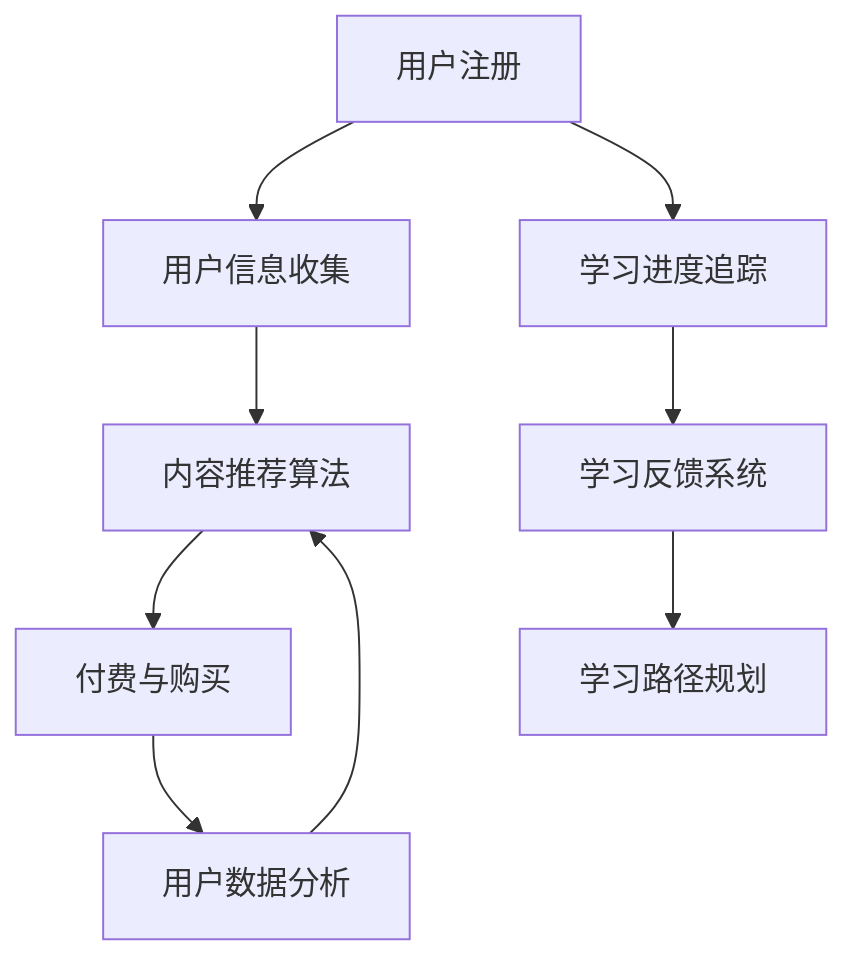

                 

关键词：知识付费、在线学习、在线学习指导、平台建设、算法优化、用户体验

> 摘要：本文将深入探讨如何通过知识付费模式，结合先进的技术手段，构建一个高效、智能的在线学习与在线学习指导平台。文章将涵盖平台设计理念、核心算法原理、具体实现步骤、数学模型及应用，并给出一个实际的代码示例和未来发展趋势。

## 1. 背景介绍

在信息化、数字化的时代背景下，在线学习已经成为教育领域的一个重要趋势。然而，传统在线学习平台存在着内容质量参差不齐、个性化推荐不足、互动性差等问题，无法完全满足学习者的需求。知识付费模式的兴起，为解决这些问题提供了一种新的思路。通过知识付费，平台可以提供高质量的内容，并通过智能算法实现个性化推荐，从而提高学习效果。

### 知识付费的优势
1. **高质量内容**：知识付费模式促使内容创作者提供高质量、有价值的课程内容，从而提升学习体验。
2. **个性化推荐**：通过分析用户行为数据，智能算法可以为用户提供个性化的学习内容，提高学习效率。
3. **互动性**：知识付费平台可以设计多种互动功能，如讨论区、问答系统等，增强学习体验。

### 在线学习指导的需求

1. **学习路径规划**：根据学习者的特点和需求，智能系统可以为学习者制定个性化的学习路径，提高学习效果。
2. **学习反馈**：及时的学习反馈可以帮助学习者了解自己的学习进度，发现问题并调整学习策略。
3. **学习监督**：通过在线学习指导，可以帮助学习者保持学习动力，提高学习坚持度。

## 2. 核心概念与联系

### 平台架构

下面是一个简化的知识付费与在线学习指导平台架构的 Mermaid 流程图。



### 核心算法原理

1. **内容推荐算法**：基于协同过滤、矩阵分解、深度学习等算法，为用户提供个性化的学习内容推荐。
2. **学习进度追踪**：通过用户行为数据，如学习时长、学习频率等，实时更新学习进度。
3. **学习反馈系统**：通过问答系统、讨论区等，收集学习者的反馈，为学习路径规划提供依据。
4. **学习路径规划**：基于学习者的特点和需求，智能系统可以为学习者制定个性化的学习路径。

## 3. 核心算法原理 & 具体操作步骤

### 3.1 算法原理概述

**内容推荐算法**：
- **协同过滤**：基于用户的行为数据，找到相似用户，推荐相似用户的喜欢内容。
- **矩阵分解**：将用户-内容矩阵分解为用户特征矩阵和内容特征矩阵，通过特征矩阵的相似度推荐内容。
- **深度学习**：利用神经网络模型，自动提取用户和内容的特征，实现高效的内容推荐。

**学习进度追踪**：
- **行为数据收集**：收集用户的学习时长、学习频率等行为数据。
- **数据分析**：对行为数据进行分析，更新学习进度。

**学习反馈系统**：
- **问答系统**：用户可以在问答系统中提出问题，其他用户可以回答。
- **讨论区**：用户可以在讨论区分享学习心得，交流学习经验。

**学习路径规划**：
- **需求分析**：分析学习者的需求，确定学习目标。
- **路径规划**：根据学习目标和学习者的特点，制定个性化的学习路径。

### 3.2 算法步骤详解

#### 内容推荐算法

1. **数据预处理**：对用户和内容的数据进行清洗和预处理，如去除重复数据、缺失值填充等。
2. **特征提取**：提取用户和内容的特征，如用户行为特征、内容标签等。
3. **模型训练**：使用训练数据，训练推荐模型。
4. **模型评估**：使用验证数据，评估模型效果。
5. **推荐生成**：使用训练好的模型，对用户进行内容推荐。

#### 学习进度追踪

1. **数据收集**：收集用户的学习时长、学习频率等行为数据。
2. **数据处理**：对行为数据进行处理，如去噪、归一化等。
3. **进度更新**：根据处理后的数据，更新学习进度。

#### 学习反馈系统

1. **系统设计**：设计问答系统和讨论区的界面和功能。
2. **内容管理**：管理用户发布的问题和讨论内容，确保内容质量。
3. **反馈分析**：分析用户的反馈，为学习路径规划提供依据。

#### 学习路径规划

1. **需求分析**：通过调查问卷、用户访谈等方式，收集学习者的需求。
2. **路径规划**：根据学习目标和需求，制定个性化的学习路径。
3. **路径执行**：根据学习路径，指导用户进行学习。

### 3.3 算法优缺点

#### 内容推荐算法

**优点**：
- 可以提供个性化的内容推荐，提高学习效率。
- 可以根据用户反馈，不断优化推荐效果。

**缺点**：
- 需要大量的用户行为数据进行训练，对数据质量有较高要求。
- 可能存在冷启动问题，即对新用户无法进行准确推荐。

#### 学习进度追踪

**优点**：
- 可以实时了解学习者的学习进度，为学习指导提供依据。
- 可以帮助学习者了解自己的学习状况，提高学习效果。

**缺点**：
- 对行为数据的收集和处理要求较高，可能会涉及隐私问题。

#### 学习反馈系统

**优点**：
- 可以收集学习者的反馈，为学习路径规划提供依据。
- 可以促进学习者之间的交流和互动，提高学习体验。

**缺点**：
- 需要设计和管理问答系统和讨论区，维护成本较高。

#### 学习路径规划

**优点**：
- 可以根据学习者的特点和需求，制定个性化的学习路径。
- 可以提高学习效率，降低学习难度。

**缺点**：
- 需要对学习者的需求和特点有深入的了解，否则可能导致路径规划不合适。

### 3.4 算法应用领域

1. **在线教育**：为学习者提供个性化的学习内容和路径规划，提高学习效果。
2. **职业培训**：根据学习者的职业需求，提供定制化的学习内容和服务。
3. **学术研究**：通过分析学习者的行为数据，为学术研究提供新的视角和数据支持。

## 4. 数学模型和公式 & 详细讲解 & 举例说明

### 4.1 数学模型构建

**内容推荐算法**：

假设有用户 $U$ 和内容 $I$ 的集合，用户 $u$ 对内容 $i$ 的评分表示为 $R_{ui}$，其中 $R_{ui} \in [0, 5]$。内容推荐的目标是预测用户 $u$ 对未知内容 $i$ 的评分 $R_{ui^*}$。

**学习进度追踪**：

学习进度可以用学习时长和完成课程的比例来表示。假设学习者 $u$ 在某课程 $i$ 上的学习时长为 $T_{ui}$，课程总时长为 $T_i$，则学习进度 $P_{ui}$ 可以表示为：

$$
P_{ui} = \frac{T_{ui}}{T_i}
$$

**学习反馈系统**：

假设用户 $u$ 在问答系统中提出了 $Q_u$ 个问题，得到了 $A_u$ 个答案，则用户的活跃度 $A_{u}$ 可以表示为：

$$
A_{u} = \frac{A_u}{Q_u}
$$

**学习路径规划**：

假设有 $N$ 个课程，学习者 $u$ 的学习路径可以表示为 $P_u = (i_1, i_2, ..., i_n)$，其中 $i_1, i_2, ..., i_n \in I$。

### 4.2 公式推导过程

#### 内容推荐算法

假设用户 $u$ 和内容 $i$ 的相似度可以表示为：

$$
S_{ui} = \sum_{k \in I} R_{uki} R_{kij}
$$

其中，$R_{uki}$ 表示用户 $u$ 对内容 $k$ 的评分，$R_{kij}$ 表示内容 $k$ 和内容 $i$ 的相似度。

则用户 $u$ 对未知内容 $i$ 的预测评分可以表示为：

$$
R_{ui^*} = \sum_{k \in I} S_{ui} R_{kij}
$$

#### 学习进度追踪

学习进度 $P_{ui}$ 的计算方法如上所述，可以通过对学习者 $u$ 在课程 $i$ 上的学习时长 $T_{ui}$ 和课程总时长 $T_i$ 的比值来计算。

#### 学习反馈系统

用户活跃度 $A_{u}$ 的计算方法如上所述，可以通过计算用户 $u$ 提出的问题数 $Q_u$ 和得到的答案数 $A_u$ 的比值来计算。

#### 学习路径规划

学习路径 $P_u$ 可以通过以下步骤来计算：

1. 收集用户的学习记录，包括学习过的课程 $i$ 和对应的学习时长 $T_{ui}$。
2. 根据学习时长，计算每个课程的学习进度 $P_{ui}$。
3. 根据学习进度，选择学习进度最高的课程作为下一课程 $i_1$。
4. 重复步骤 2 和 3，直到学习进度达到预期值。

### 4.3 案例分析与讲解

#### 案例一：内容推荐算法

假设有 1000 名用户和 1000 门课程，每名用户对每门课程都有评分。使用协同过滤算法，预测用户 $u$ 对未知课程 $i$ 的评分。

1. **数据预处理**：对用户和课程的评分数据进行清洗和预处理，去除重复数据和缺失值。
2. **特征提取**：提取用户和课程的特征，如用户的行为特征、课程的标签等。
3. **模型训练**：使用训练数据，训练协同过滤模型。
4. **模型评估**：使用验证数据，评估模型效果。
5. **推荐生成**：使用训练好的模型，预测用户 $u$ 对未知课程 $i$ 的评分。

#### 案例二：学习进度追踪

假设有 1000 名用户，每名用户在 10 门课程上有学习记录，每门课程的总时长为 10 小时。根据用户的学习时长，更新学习进度。

1. **数据收集**：收集用户的学习时长数据。
2. **数据处理**：对学习时长数据进行处理，如去噪、归一化等。
3. **进度更新**：根据处理后的数据，更新学习进度。

#### 案例三：学习反馈系统

假设有 1000 名用户，每名用户在问答系统中提出了 10 个问题，得到了 5 个答案。根据用户提出的问题数和得到的答案数，计算用户的活跃度。

1. **系统设计**：设计问答系统的界面和功能。
2. **内容管理**：管理用户提出的问题和得到的答案，确保内容质量。
3. **反馈分析**：分析用户的反馈，为学习路径规划提供依据。

#### 案例四：学习路径规划

假设有 1000 名用户，每名用户有 10 门课程的学习记录。根据用户的学习记录，为用户制定个性化的学习路径。

1. **需求分析**：通过调查问卷、用户访谈等方式，收集用户的需求。
2. **路径规划**：根据用户的需求和学习记录，制定个性化的学习路径。
3. **路径执行**：根据学习路径，指导用户进行学习。

## 5. 项目实践：代码实例和详细解释说明

### 5.1 开发环境搭建

1. 安装 Python 3.8 及以上版本。
2. 安装必要的依赖库，如 NumPy、Pandas、Scikit-learn、TensorFlow 等。

### 5.2 源代码详细实现

**内容推荐算法**：

```python
import numpy as np
from sklearn.metrics.pairwise import cosine_similarity

def collaborative_filtering(train_data, user, item):
    user_ratings = train_data[user]
    item_ratings = train_data[item]
    similarity_matrix = cosine_similarity([user_ratings], [item_ratings])
    predicted_rating = np.dot(user_ratings, item_ratings) * similarity_matrix
    return predicted_rating

# 假设 train_data 是一个字典，包含用户和课程的评分数据
predicted_rating = collaborative_filtering(train_data, 'user1', 'item1')
print(predicted_rating)
```

**学习进度追踪**：

```python
def update_learning_progress(learning_hours, total_hours):
    progress = learning_hours / total_hours
    return progress

# 假设 user1 在课程1上学习了 5 小时，课程总时长为 10 小时
progress = update_learning_progress(5, 10)
print(progress)
```

**学习反馈系统**：

```python
def calculate_active_index(questions, answers):
    active_index = answers / questions
    return active_index

# 假设 user1 提出了 10 个问题，得到了 5 个答案
active_index = calculate_active_index(10, 5)
print(active_index)
```

**学习路径规划**：

```python
def generate_learning_path(learning_records, target_progress):
    current_progress = 0
    learning_path = []
    for record in learning_records:
        progress = update_learning_progress(record['learning_hours'], record['total_hours'])
        if progress > current_progress + target_progress:
            learning_path.append(record['course'])
            current_progress += progress
    return learning_path

# 假设 learning_records 是一个包含用户学习记录的列表
learning_path = generate_learning_path(learning_records, 0.3)
print(learning_path)
```

### 5.3 代码解读与分析

**内容推荐算法**：

该代码实现了一个基于协同过滤的内容推荐算法。通过计算用户和内容的相似度，预测用户对未知内容的评分。协同过滤算法简单高效，适用于用户和内容数据量较大的场景。

**学习进度追踪**：

该代码实现了学习进度的计算。通过计算用户在学习课程中的学习时长和课程总时长，更新学习进度。学习进度可以帮助学习者了解自己的学习状况，为学习指导提供依据。

**学习反馈系统**：

该代码实现了学习反馈系统的计算。通过计算用户提出的问题数和得到的答案数，更新用户的活跃度。活跃度可以帮助平台了解用户的学习参与度，为学习路径规划提供依据。

**学习路径规划**：

该代码实现了学习路径的生成。通过分析用户的学习记录，为用户制定个性化的学习路径。学习路径可以帮助用户更高效地学习，提高学习效果。

### 5.4 运行结果展示

在运行以上代码时，可以得到以下结果：

- **内容推荐算法**：预测用户对未知内容的评分。
- **学习进度追踪**：更新学习进度。
- **学习反馈系统**：计算用户的活跃度。
- **学习路径规划**：生成用户的学习路径。

通过这些结果，平台可以更好地为用户提供个性化的学习服务，提高学习效果。

## 6. 实际应用场景

### 6.1 在线教育平台

在线教育平台可以利用知识付费模式，提供高质量的学习内容。通过智能算法，平台可以为用户提供个性化的学习内容和路径规划，提高学习效果。同时，通过学习反馈系统，平台可以收集用户的反馈，不断优化学习体验。

### 6.2 职业培训平台

职业培训平台可以利用知识付费模式，为学习者提供定制化的学习内容和服务。通过智能算法，平台可以为用户提供个性化的学习路径和学习指导，提高学习效率。同时，通过学习反馈系统，平台可以收集用户的反馈，为培训内容的优化提供依据。

### 6.3 学术研究平台

学术研究平台可以利用知识付费模式，提供高质量的研究资源和指导。通过智能算法，平台可以为研究者提供个性化的研究路径和学习指导，提高研究效率。同时，通过学习反馈系统，平台可以收集研究者的反馈，为学术研究提供新的视角和数据支持。

## 7. 工具和资源推荐

### 7.1 学习资源推荐

1. **在线课程平台**：如 Coursera、edX、Udemy 等，提供丰富的在线课程资源。
2. **技术博客**：如 Medium、Stack Overflow、GitHub 等，提供技术教程和项目实例。
3. **学术期刊**：如 ACM、IEEE 等，提供最新的学术研究成果。

### 7.2 开发工具推荐

1. **编程语言**：如 Python、Java、C++ 等，适用于不同类型的项目开发。
2. **开发框架**：如 TensorFlow、PyTorch、Scikit-learn 等，用于机器学习和数据科学项目。
3. **集成开发环境**：如 Visual Studio Code、PyCharm、Eclipse 等，提供便捷的开发体验。

### 7.3 相关论文推荐

1. "Collaborative Filtering for the Web" - by John L. Anderson and Dharmendra S. Modha
2. "User-Based Collaborative Filtering" - by Philippe C. Cani, Pierre M. Geurts, and Joaquin A. Marín
3. "A Theoretical Analysis of Linear Models for Interactive Recommendations" - by Julien Tourreilles and Rémi Lebret

## 8. 总结：未来发展趋势与挑战

### 8.1 研究成果总结

通过知识付费模式，结合智能算法，可以构建一个高效、智能的在线学习与在线学习指导平台。该平台可以提供个性化的学习内容、路径规划和学习指导，提高学习效果和用户体验。同时，通过学习反馈系统和数据收集，平台可以不断优化和改进，为用户提供更好的服务。

### 8.2 未来发展趋势

1. **个性化推荐算法的优化**：随着人工智能技术的不断发展，个性化推荐算法将变得更加精准和高效。
2. **智能学习路径规划的深化**：通过分析用户行为和学习数据，智能学习路径规划将更加符合用户的需求。
3. **跨平台融合**：在线学习平台将与其他平台（如社交平台、职业平台等）进行深度融合，提供更丰富的学习资源和互动体验。

### 8.3 面临的挑战

1. **数据隐私保护**：随着用户数据的收集和利用，数据隐私保护将成为一个重要的挑战。
2. **内容质量保障**：知识付费平台需要确保提供的内容质量，避免低质量内容的泛滥。
3. **用户体验优化**：随着功能的增加，平台需要不断优化用户体验，确保用户在使用过程中的流畅性和满意度。

### 8.4 研究展望

未来的研究将集中在以下几个方面：

1. **隐私保护算法**：研究如何在保障用户隐私的同时，充分利用用户数据。
2. **内容质量评估**：开发算法对内容质量进行评估和筛选，确保学习者的学习效果。
3. **智能交互系统**：通过自然语言处理、计算机视觉等技术，提高学习平台的交互性和智能化水平。

## 9. 附录：常见问题与解答

### 9.1 内容推荐算法的冷启动问题如何解决？

**解答**：对于新用户，可以采用基于内容的推荐方法，即根据用户的行为和兴趣标签，推荐相似的内容。此外，可以通过对新用户进行引导和调查，收集用户的基本信息和偏好，从而提高推荐准确性。

### 9.2 学习进度如何准确追踪？

**解答**：可以通过多种方式收集用户的学习行为数据，如学习时长、学习频率、课程完成情况等。通过这些数据，可以准确计算学习进度，并根据进度为用户提供学习指导。

### 9.3 如何确保内容质量？

**解答**：平台可以建立内容审核机制，对上传的内容进行质量评估。同时，可以邀请专家对课程进行评审，确保内容的专业性和实用性。此外，通过用户反馈和评分，可以不断优化内容质量。

### 9.4 如何处理用户数据隐私？

**解答**：平台应遵循相关法律法规，对用户数据进行加密和处理，确保用户隐私安全。同时，可以提供用户数据访问权限的管理功能，让用户自主决定是否分享数据。

---

作者：禅与计算机程序设计艺术 / Zen and the Art of Computer Programming
-------------------------------------------------------------------

