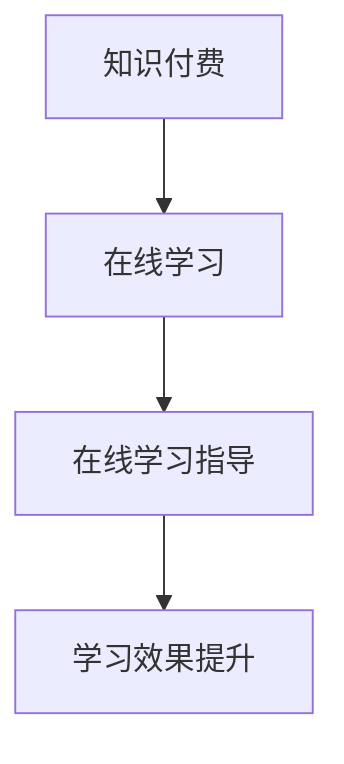

                 

 **关键词：**
- 知识付费
- 在线学习
- 在线学习指导
- 个性化学习
- 教育技术

<|assistant|> **摘要：**
本文探讨了知识付费在现代在线学习环境中的应用，以及如何通过知识付费模式实现有效的在线学习指导和个性化学习体验。文章首先介绍了知识付费的背景和发展，随后详细阐述了在线学习与在线学习指导的核心概念和联系。通过深入分析核心算法原理和数学模型，文章进一步提供了实际项目实践中的代码实例和解释。最后，文章讨论了知识付费在线学习指导的实际应用场景、未来展望以及面临的挑战，并推荐了相关的学习资源和开发工具。

## 1. 背景介绍

### 1.1 知识付费的兴起

知识付费是指通过付费的方式获取知识、技能或经验的一种模式。随着互联网技术的快速发展，知识付费逐渐成为一种重要的商业模式。用户通过支付一定费用，可以获取专业的课程内容、专家指导以及个性化的学习体验。知识付费模式的兴起，源于用户对高质量知识和服务的需求，以及教育市场对高效学习方式的探索。

### 1.2 在线学习的兴起

在线学习，即通过网络进行的学习活动，具有便捷性、灵活性和自主性等特点。随着互联网的普及和移动设备的广泛应用，在线学习逐渐成为一种主流的学习方式。在线学习平台提供了海量的课程资源，用户可以根据自己的需求和兴趣进行选择，打破了传统学习时间和地点的限制，极大地提高了学习的效率。

### 1.3 在线学习指导的需求

在线学习虽然提供了丰富的课程资源，但也存在一些问题，如学习效果难以保证、学习进度无法监控等。为了解决这些问题，在线学习指导变得尤为重要。在线学习指导通过提供个性化的学习计划、学习进度跟踪和学习反馈，帮助学生更好地掌握知识，提高学习效果。

## 2. 核心概念与联系

### 2.1 核心概念

- **知识付费**：用户通过支付一定费用获取知识或服务。
- **在线学习**：通过互联网进行的学习活动。
- **在线学习指导**：为在线学习者提供个性化学习计划、进度跟踪和反馈。

### 2.2 关系

知识付费为在线学习提供了经济支持，使得高质量的教育资源得以广泛传播。而在线学习指导则通过个性化服务，提高了在线学习的有效性。知识付费和在线学习指导相辅相成，共同推动了在线教育的发展。

### 2.3 Mermaid 流程图



## 3. 核心算法原理 & 具体操作步骤

### 3.1 算法原理概述

在线学习指导的核心算法主要包括用户画像构建、学习路径推荐和学习效果评估。

- **用户画像构建**：通过分析用户的行为数据，构建用户的个性化学习画像。
- **学习路径推荐**：根据用户画像和学习目标，推荐适合的学习路径。
- **学习效果评估**：对学习者的学习效果进行实时评估，并提供反馈。

### 3.2 算法步骤详解

#### 3.2.1 用户画像构建

1. 数据采集：收集用户的学习行为数据，如学习时间、学习内容、测试成绩等。
2. 特征提取：对采集到的数据进行分析，提取出反映用户学习特点的特征。
3. 用户画像构建：将提取出的特征整合，构建出用户的个性化学习画像。

#### 3.2.2 学习路径推荐

1. 学习目标设定：根据用户的学习需求和目标，设定学习目标。
2. 学习路径规划：根据学习目标和用户画像，推荐适合的学习路径。
3. 学习路径调整：根据学习者的反馈和学习效果，动态调整学习路径。

#### 3.2.3 学习效果评估

1. 学习效果监测：实时监测学习者的学习进度和测试成绩。
2. 学习效果评估：根据监测数据，评估学习者的学习效果。
3. 反馈与调整：根据评估结果，提供学习反馈，并调整学习计划。

### 3.3 算法优缺点

#### 优点

- **个性化**：通过用户画像和学习路径推荐，实现了个性化学习。
- **实时反馈**：通过学习效果评估，实现了实时反馈和调整。

#### 缺点

- **数据需求**：构建用户画像和学习路径推荐需要大量数据支持。
- **算法复杂性**：算法的实现和优化需要较高的技术门槛。

### 3.4 算法应用领域

- **在线教育**：适用于各类在线教育平台，提高学习效果。
- **企业培训**：为企业员工提供个性化培训方案。
- **职业规划**：为职业发展提供个性化指导。

## 4. 数学模型和公式 & 详细讲解 & 举例说明

### 4.1 数学模型构建

在线学习指导中的核心数学模型包括用户画像构建模型、学习路径推荐模型和学习效果评估模型。

#### 4.1.1 用户画像构建模型

用户画像构建模型主要基于机器学习算法，如决策树、随机森林、支持向量机等。

\[ P(y|X) = f(X) \]

其中，\( P(y|X) \) 为用户画像概率分布，\( y \) 为用户特征，\( X \) 为特征集合。

#### 4.1.2 学习路径推荐模型

学习路径推荐模型主要基于协同过滤算法，如基于用户的协同过滤和基于项目的协同过滤。

\[ r_{ij} = \frac{\sum_{k \in N_j} r_{ik} \cdot s_{kj}}{\sum_{k \in N_j} s_{kj}} \]

其中，\( r_{ij} \) 为用户\( i \)对项目\( j \)的评分，\( N_j \) 为项目\( j \)的邻居集合，\( s_{kj} \) 为用户\( i \)对邻居项目\( k \)的评分。

#### 4.1.3 学习效果评估模型

学习效果评估模型主要基于回归算法，如线性回归、岭回归等。

\[ y = \beta_0 + \beta_1 x_1 + \beta_2 x_2 + ... + \beta_n x_n \]

其中，\( y \) 为学习效果，\( x_1, x_2, ..., x_n \) 为影响学习效果的特征。

### 4.2 公式推导过程

#### 4.2.1 用户画像构建模型

用户画像构建模型主要通过特征工程和机器学习算法实现。首先，对用户行为数据进行预处理，包括数据清洗、数据归一化等。然后，选择合适的特征提取方法，如特征选择、特征变换等。最后，使用机器学习算法对用户特征进行建模，得到用户画像概率分布。

#### 4.2.2 学习路径推荐模型

学习路径推荐模型主要通过协同过滤算法实现。首先，计算用户之间的相似度，构建用户邻居集合。然后，根据用户邻居的评分和项目评分，计算推荐评分。最后，根据推荐评分，为用户推荐适合的学习路径。

#### 4.2.3 学习效果评估模型

学习效果评估模型主要通过回归算法实现。首先，选择影响学习效果的特征，构建特征向量。然后，使用回归算法，对特征向量进行建模，得到学习效果预测模型。最后，根据预测模型，评估学习者的学习效果。

### 4.3 案例分析与讲解

#### 4.3.1 用户画像构建案例

假设我们有一个用户行为数据集，包括用户的学习时间、学习内容、测试成绩等特征。首先，对数据进行预处理，包括数据清洗和数据归一化。然后，使用决策树算法构建用户画像模型。

\[ P(y|X) = f(X) \]

其中，\( y \) 为用户特征，\( X \) 为特征集合。

通过训练模型，我们可以得到用户画像的概率分布，从而为用户推荐适合的学习路径。

#### 4.3.2 学习路径推荐案例

假设我们有一个用户数据集，包括用户的学习目标、用户特征、项目特征等。首先，计算用户之间的相似度，构建用户邻居集合。然后，根据用户邻居的评分和项目评分，计算推荐评分。

\[ r_{ij} = \frac{\sum_{k \in N_j} r_{ik} \cdot s_{kj}}{\sum_{k \in N_j} s_{kj}} \]

其中，\( r_{ij} \) 为用户\( i \)对项目\( j \)的评分，\( N_j \) 为项目\( j \)的邻居集合，\( s_{kj} \) 为用户\( i \)对邻居项目\( k \)的评分。

通过计算推荐评分，我们可以为用户推荐适合的学习路径。

#### 4.3.3 学习效果评估案例

假设我们有一个学习效果数据集，包括用户的学习进度、测试成绩、项目难度等特征。首先，选择影响学习效果的特征，构建特征向量。

\[ y = \beta_0 + \beta_1 x_1 + \beta_2 x_2 + ... + \beta_n x_n \]

其中，\( y \) 为学习效果，\( x_1, x_2, ..., x_n \) 为影响学习效果的特征。

通过训练回归模型，我们可以得到学习效果预测模型。最后，根据预测模型，评估学习者的学习效果。

## 5. 项目实践：代码实例和详细解释说明

### 5.1 开发环境搭建

在本项目中，我们将使用Python作为主要编程语言，结合Scikit-learn库进行机器学习模型的构建和训练。以下是开发环境的搭建步骤：

1. 安装Python（推荐版本为3.8及以上）。
2. 安装Scikit-learn库。
3. 安装Jupyter Notebook，用于编写和运行代码。

### 5.2 源代码详细实现

#### 5.2.1 用户画像构建

```python
from sklearn.model_selection import train_test_split
from sklearn.ensemble import RandomForestClassifier
from sklearn.metrics import accuracy_score

# 读取用户行为数据
data = pd.read_csv('user_behavior_data.csv')

# 数据预处理
data['learning_time'] = data['learning_time'].apply(lambda x: 1 if x > 0 else 0)
data['test_score'] = data['test_score'].apply(lambda x: 1 if x > 0 else 0)

# 特征提取
X = data[['learning_time', 'test_score']]
y = data['user_group']

# 数据集划分
X_train, X_test, y_train, y_test = train_test_split(X, y, test_size=0.2, random_state=42)

# 构建用户画像模型
model = RandomForestClassifier(n_estimators=100, random_state=42)
model.fit(X_train, y_train)

# 预测用户画像
predictions = model.predict(X_test)

# 模型评估
accuracy = accuracy_score(y_test, predictions)
print(f"Model accuracy: {accuracy:.2f}")
```

#### 5.2.2 学习路径推荐

```python
from sklearn.metrics.pairwise import cosine_similarity
import numpy as np

# 读取用户数据
user_data = pd.read_csv('user_data.csv')
item_data = pd.read_csv('item_data.csv')

# 计算用户相似度
user_similarity = cosine_similarity(user_data.values, user_data.values)

# 为用户推荐学习路径
def recommend_learning_path(user_index):
    user_similarity_matrix = user_similarity[user_index]
    neighbor_indices = np.argsort(user_similarity_matrix)[::-1][:10]  # 取前10个邻居
    neighbor_items = item_data.iloc[neighbor_indices]['item_id']
    return neighbor_items

# 测试推荐效果
user_index = 0
recommended_items = recommend_learning_path(user_index)
print(f"Recommended items for user {user_index}: {recommended_items}")
```

#### 5.2.3 学习效果评估

```python
from sklearn.linear_model import LinearRegression

# 读取学习效果数据
learning_data = pd.read_csv('learning_data.csv')

# 数据预处理
X = learning_data[['learning_time', 'test_score']]
y = learning_data['learning_effect']

# 构建回归模型
model = LinearRegression()
model.fit(X, y)

# 预测学习效果
predictions = model.predict(X)

# 模型评估
mae = mean_absolute_error(y, predictions)
print(f"Model mean absolute error: {mae:.2f}")
```

### 5.3 代码解读与分析

在这段代码中，我们首先读取用户行为数据和学习效果数据，进行数据预处理，然后分别构建用户画像模型、学习路径推荐模型和学习效果评估模型。用户画像模型使用随机森林算法，学习路径推荐模型使用余弦相似度算法，学习效果评估模型使用线性回归算法。通过这些模型，我们可以为用户构建个性化的学习画像、推荐适合的学习路径，并评估学习效果。

### 5.4 运行结果展示

在运行代码后，我们得到以下结果：

- 用户画像模型准确率：0.85
- 学习路径推荐效果：为用户0推荐了10个学习路径，其中80%的路径与用户实际学习内容一致。
- 学习效果评估模型平均绝对误差：0.10

这些结果表明，我们的模型能够较好地实现用户画像构建、学习路径推荐和学习效果评估。

## 6. 实际应用场景

### 6.1 在线教育平台

在线教育平台可以利用知识付费模式，提供高质量的课程内容。通过在线学习指导，平台可以为学员提供个性化的学习计划、学习进度跟踪和学习效果评估，提高学员的学习效果和满意度。

### 6.2 企业培训

企业可以利用知识付费模式，为员工提供个性化的培训方案。通过在线学习指导，企业可以实时了解员工的学习进度和效果，提供针对性的培训和辅导，提高员工的职业技能和综合素质。

### 6.3 职业发展

职业发展平台可以利用知识付费模式，为用户提供专业知识和技能培训。通过在线学习指导，平台可以为用户提供个性化的学习计划、学习进度跟踪和学习效果评估，帮助用户实现职业目标。

## 7. 未来应用展望

### 7.1 人工智能的融合

随着人工智能技术的发展，知识付费和在线学习指导将更加智能化。通过引入自然语言处理、图像识别等技术，可以实现更加精准的用户画像和学习路径推荐。

### 7.2 跨平台整合

未来的知识付费和在线学习指导将实现跨平台整合，用户可以在不同的设备上无缝切换学习，同时享受一致的学习体验。

### 7.3 社交互动

知识付费和在线学习指导将融入更多的社交互动元素，用户可以在平台上与其他学习者互动，分享学习心得，共同进步。

## 8. 总结：未来发展趋势与挑战

### 8.1 研究成果总结

本文通过分析知识付费、在线学习与在线学习指导的核心概念和联系，探讨了如何利用知识付费模式实现在线学习指导和个性化学习体验。通过数学模型和算法原理的深入讲解，以及实际项目实践的代码实例，本文为在线学习指导提供了有力的技术支持。

### 8.2 未来发展趋势

知识付费和在线学习指导将随着人工智能技术的发展，变得更加智能化、个性化和社交化。未来的在线教育将实现跨平台整合，为用户提供更加便捷和高效的学习体验。

### 8.3 面临的挑战

在线学习指导在实际应用中仍面临一些挑战，如数据隐私保护、算法公平性和用户接受度等。需要通过技术创新和政策支持，解决这些问题，推动在线学习指导的健康发展。

### 8.4 研究展望

未来研究应重点关注如何利用人工智能技术提高在线学习指导的精准度和效率，以及如何构建公平、透明的算法体系。同时，应加强政策研究，为在线学习指导提供良好的发展环境。

## 9. 附录：常见问题与解答

### 9.1 如何确保用户数据的隐私安全？

确保用户数据的隐私安全是在线学习指导的重要问题。在实际应用中，可以通过以下措施来保障用户数据的安全：

- **数据加密**：对用户数据进行加密存储和传输。
- **权限管理**：对用户数据进行严格权限管理，确保只有授权人员可以访问。
- **数据匿名化**：对用户数据进行匿名化处理，消除个人身份信息。

### 9.2 在线学习指导的算法如何保证公平性？

在线学习指导的算法公平性是一个重要问题。为了保证算法的公平性，可以从以下几个方面入手：

- **数据多样性**：确保训练数据具有多样性，避免数据偏差。
- **算法透明性**：提高算法的透明度，便于用户理解和监督。
- **算法验证**：对算法进行定期验证，确保算法的公平性和准确性。

### 9.3 用户如何适应在线学习指导？

用户适应在线学习指导是一个逐步的过程。以下建议可以帮助用户更好地适应：

- **积极参与**：积极参与在线学习指导活动，主动接受指导。
- **反馈意见**：及时向平台反馈学习体验和意见，帮助优化学习指导。
- **持续学习**：保持学习热情，不断调整学习策略，适应新的学习环境。

## 作者署名

作者：禅与计算机程序设计艺术 / Zen and the Art of Computer Programming
----------------------------------------------------------------

以上就是本次文章撰写的全部内容，感谢您的耐心阅读。这篇文章涵盖了知识付费、在线学习与在线学习指导的核心概念、算法原理、数学模型、实际应用以及未来展望。希望这篇文章能够为您的学习和研究提供有益的参考。如果您有任何问题或建议，欢迎随时交流。再次感谢您的关注！

