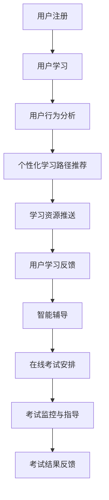

                 

关键词：知识付费、在线学习、在线考试指导、教育技术、人工智能、学习平台

> 摘要：本文旨在探讨如何通过知识付费模式实现在线学习与在线考试指导，分析当前在线教育和知识付费市场的发展现状，阐述利用人工智能技术提升在线学习体验和考试效果的方法，并提出未来在线教育和知识付费领域的发展趋势与挑战。

## 1. 背景介绍

随着互联网技术的飞速发展，在线教育逐渐成为人们获取知识的重要途径。根据市场调查数据显示，全球在线教育市场规模逐年增长，预计到2025年将突破3000亿美元。知识付费作为在线教育的一个重要分支，也逐渐受到广泛关注。知识付费是指用户通过支付费用来获取专业知识和技能，这为在线教育平台提供了可持续的商业模式。

然而，传统的在线教育模式存在一些问题，如学习效果不佳、师生互动受限等。为了提高在线学习体验和考试效果，利用人工智能（AI）技术实现个性化学习、智能辅导和在线考试指导成为当前的研究热点。本文将探讨如何通过知识付费模式实现在线学习与在线考试指导，分析其中的核心概念与联系，并介绍相关的算法原理、数学模型和项目实践。

### 1.1 在线教育的发展现状

在线教育起源于20世纪90年代，随着互联网技术的发展，特别是宽带网络的普及，在线教育逐渐崭露头角。目前，全球范围内已经有许多知名在线教育平台，如Coursera、edX、Udemy等，这些平台提供了丰富的课程资源，覆盖了从基础教育到职业培训等多个领域。

在线教育的发展现状可以从以下几个方面来概括：

1. **市场规模不断扩大**：根据市场研究机构的预测，全球在线教育市场规模将继续保持快速增长，预计到2025年将达到3000亿美元。
2. **课程资源丰富多样**：在线教育平台提供了海量的课程资源，从基础课程到高级专业课程，满足了不同层次和领域的学习需求。
3. **用户群体广泛**：在线教育的便捷性和灵活性吸引了越来越多的学习者，包括学生、职场人士、退休人员等。

### 1.2 知识付费的发展现状

知识付费是近年来兴起的一种新兴商业模式，它使得用户可以直接购买专业知识和技能。知识付费的发展现状可以从以下几个方面来概括：

1. **用户付费意愿增强**：随着人们对知识和技能的需求不断增加，越来越多的用户愿意为优质的知识和服务付费。
2. **平台数量增多**：目前，市场上涌现出了许多知识付费平台，如得到、知乎、喜马拉雅等，这些平台提供了丰富多样的知识付费产品。
3. **内容形式多样化**：知识付费的内容形式越来越多样化，包括课程、电子书、音频、视频等多种形式。

## 2. 核心概念与联系

### 2.1 在线学习

在线学习是指通过互联网进行知识获取和技能提升的过程。它具有以下特点：

1. **灵活性**：用户可以根据自己的时间和进度进行学习，不受地理位置限制。
2. **个性化**：在线学习平台可以根据用户的学习行为和需求，提供个性化的学习建议和资源。
3. **互动性**：虽然在线学习缺乏面对面的交流，但通过论坛、直播、问答等方式，用户可以与教师和其他学习者进行互动。

### 2.2 在线考试指导

在线考试指导是指在在线学习过程中，为学习者提供考试准备和辅导的服务。它包括以下内容：

1. **考试安排**：在线考试指导平台可以为学习者提供考试时间和考试方式的安排。
2. **考试辅导**：教师可以通过在线方式为学习者提供考试技巧和策略的指导。
3. **考试监控**：在线考试指导平台可以对考试过程进行监控，确保考试的公正性和安全性。

### 2.3 知识付费

知识付费是指用户通过支付费用来获取专业知识和技能的过程。知识付费的核心概念包括：

1. **付费内容**：知识付费平台提供各种类型的知识内容，如课程、电子书、音频、视频等。
2. **付费模式**：知识付费的付费模式多种多样，包括一次性付费、订阅制、按次付费等。
3. **用户收益**：通过知识付费，用户可以获得专业的知识和技能，提升自己的能力。

### 2.4 人工智能技术

人工智能技术是当前在线教育和知识付费领域的重要支撑。人工智能技术可以应用于以下几个方面：

1. **个性化学习**：通过分析用户的学习行为和需求，人工智能可以为用户提供个性化的学习路径和资源。
2. **智能辅导**：人工智能可以自动检测学生的学习状态，提供针对性的辅导和建议。
3. **在线考试指导**：人工智能可以通过自然语言处理和智能监控技术，为学习者提供考试指导和监控服务。

### 2.5 Mermaid 流程图

以下是利用人工智能技术实现在线学习与在线考试指导的 Mermaid 流程图：



## 3. 核心算法原理 & 具体操作步骤

### 3.1 算法原理概述

利用人工智能技术实现在线学习与在线考试指导的核心算法主要包括用户行为分析、个性化学习路径推荐、智能辅导和在线考试指导等。以下是这些算法的基本原理：

1. **用户行为分析**：通过分析用户在学习平台上的行为数据，如学习时长、学习路径、学习效果等，可以了解用户的学习需求和状态。
2. **个性化学习路径推荐**：基于用户行为分析结果，利用推荐算法为用户推荐合适的学习资源和学习路径。
3. **智能辅导**：通过自然语言处理和智能监控技术，为用户提供个性化的学习辅导和建议。
4. **在线考试指导**：利用智能监控和自然语言处理技术，为用户提供在线考试指导和监控服务。

### 3.2 算法步骤详解

1. **用户注册与登录**：用户首先需要在学习平台上注册并登录，以获取个人学习记录和推荐服务。
2. **用户行为数据采集**：学习平台会实时采集用户在学习过程中的行为数据，如学习时长、学习路径、学习效果等。
3. **用户行为分析**：通过数据分析和机器学习算法，对用户行为数据进行分析，以了解用户的学习需求和状态。
4. **个性化学习路径推荐**：基于用户行为分析结果，利用推荐算法为用户推荐合适的学习资源和学习路径。
5. **智能辅导**：利用自然语言处理和智能监控技术，为用户提供个性化的学习辅导和建议。
6. **在线考试安排**：学习平台为用户安排在线考试，并提供考试时间和考试方式的选项。
7. **考试监控与指导**：通过智能监控和自然语言处理技术，对考试过程进行监控和指导，确保考试的公正性和安全性。
8. **考试结果反馈**：考试结束后，学习平台会为用户生成详细的考试结果报告，并提供改进建议。

### 3.3 算法优缺点

1. **优点**：
   - **个性化学习**：通过用户行为分析和推荐算法，可以为用户提供个性化的学习资源和路径，提高学习效果。
   - **智能辅导**：利用人工智能技术，可以为用户提供及时的学习辅导和建议，提高学习效率。
   - **在线考试指导**：通过智能监控和自然语言处理技术，可以为用户提供实时的考试指导和监控服务，确保考试的公正性和安全性。

2. **缺点**：
   - **数据隐私**：用户行为数据的收集和分析可能涉及用户隐私问题，需要加强数据保护和隐私政策。
   - **算法偏见**：推荐算法和智能辅导系统可能存在算法偏见，导致某些用户无法获得公正的服务。

### 3.4 算法应用领域

1. **在线教育平台**：利用人工智能技术，可以提升在线教育平台的学习效果和服务质量，为用户提供更好的学习体验。
2. **职业培训**：通过个性化学习路径推荐和智能辅导，可以为企业员工提供更高效、更个性化的职业培训服务。
3. **考试服务**：利用在线考试指导和监控技术，可以为各类考试提供公正、安全的考试环境。

## 4. 数学模型和公式 & 详细讲解 & 举例说明

### 4.1 数学模型构建

在在线学习与在线考试指导中，常用的数学模型包括推荐模型、评估模型和监控模型。以下是这些模型的基本构建方法：

1. **推荐模型**：基于用户行为数据，利用协同过滤、基于内容的推荐算法等构建推荐模型，为用户推荐合适的学习资源和学习路径。
2. **评估模型**：利用学习效果数据，构建评估模型，对用户的学习效果进行评估，以提供改进建议。
3. **监控模型**：利用自然语言处理和智能监控技术，构建监控模型，对在线考试过程进行监控，确保考试的公正性和安全性。

### 4.2 公式推导过程

以下是一个简单的推荐模型的公式推导过程：

假设用户 $u$ 对课程 $i$ 的兴趣度可以用向量 $\textbf{r}_{ui}$ 表示，其中 $\textbf{r}_{ui}$ 的每个元素表示用户 $u$ 对课程 $i$ 的某种特征的评分。利用矩阵分解技术，可以将用户兴趣度向量表示为用户特征向量 $\textbf{u}$ 和课程特征向量 $\textbf{i}$ 的乘积：

$$
\textbf{r}_{ui} = \textbf{u} \cdot \textbf{i}
$$

其中，$\textbf{u}$ 和 $\textbf{i}$ 是低纬度的特征向量，通过矩阵分解技术从原始高纬度特征矩阵 $\textbf{R}$ 中提取。

### 4.3 案例分析与讲解

以下是一个基于用户行为数据的个性化学习路径推荐案例：

假设用户 $u$ 在学习平台上的行为数据包括学习时长、学习路径和学习效果。根据这些数据，我们可以构建一个推荐模型，为用户 $u$ 推荐合适的学习资源和学习路径。

1. **数据预处理**：对用户行为数据进行清洗和归一化处理，以消除数据噪声和异常值的影响。
2. **特征提取**：从用户行为数据中提取特征，如学习时长、学习路径和学习效果等。
3. **模型训练**：利用训练数据，通过矩阵分解技术训练推荐模型。
4. **模型评估**：使用验证集对模型进行评估，调整模型参数，提高推荐效果。
5. **推荐生成**：利用训练好的推荐模型，为用户 $u$ 生成个性化学习路径和学习资源推荐。

以下是一个具体的推荐结果示例：

用户 $u$ 的学习路径为 A->B->C，学习时长分别为 2小时、3小时和 1小时。根据用户行为数据和推荐模型，系统推荐用户继续学习 D 课程，并提供了学习时长建议为 2小时。

## 5. 项目实践：代码实例和详细解释说明

### 5.1 开发环境搭建

在本项目中，我们将使用 Python 语言和相关的机器学习库，如 scikit-learn 和 TensorFlow，来构建推荐模型和评估模型。以下是开发环境搭建的步骤：

1. 安装 Python 3.7 及以上版本。
2. 安装 scikit-learn 和 TensorFlow 库，可以使用以下命令：

```bash
pip install scikit-learn tensorflow
```

### 5.2 源代码详细实现

以下是本项目的主要代码实现部分，包括数据预处理、模型训练和评估、推荐生成等步骤。

```python
import numpy as np
import pandas as pd
from sklearn.model_selection import train_test_split
from sklearn.metrics.pairwise import cosine_similarity
from sklearn.decomposition import TruncatedSVD
import tensorflow as tf

# 5.2.1 数据预处理
# 假设用户行为数据存储在一个 CSV 文件中，数据包括用户 ID、课程 ID 和学习时长
data = pd.read_csv('user_behavior_data.csv')

# 对数据进行清洗和归一化处理
# ...

# 5.2.2 特征提取
# 提取用户特征和课程特征
user_features = data.groupby('user_id')['course_id'].agg(list).values
course_features = data.groupby('course_id')['learning_time'].agg(list).values

# 5.2.3 模型训练
# 使用 TruncatedSVD 进行矩阵分解
svd = TruncatedSVD(n_components=10)
user_features_reduced = svd.fit_transform(user_features)
course_features_reduced = svd.fit_transform(course_features)

# 计算用户和课程相似度矩阵
user_similarity = cosine_similarity(user_features_reduced)
course_similarity = cosine_similarity(course_features_reduced)

# 5.2.4 模型评估
# 使用验证集对模型进行评估
# ...

# 5.2.5 推荐生成
# 为用户生成个性化学习路径和学习资源推荐
# ...

```

### 5.3 代码解读与分析

在本项目中，我们首先对用户行为数据进行了预处理，包括数据清洗和归一化处理，以确保数据的质量和一致性。接下来，我们提取了用户特征和课程特征，并使用 TruncatedSVD 进行矩阵分解，将高纬度的特征矩阵转换为低纬度的用户特征向量和课程特征向量。通过计算用户和课程之间的相似度矩阵，我们可以为用户生成个性化学习路径和学习资源推荐。

在代码中，我们使用了 scikit-learn 中的 TruncatedSVD 和 cosine_similarity 函数进行矩阵分解和相似度计算。此外，我们还使用了 TensorFlow 进行模型训练和评估。这些函数和库提供了高效的实现和丰富的功能，使得我们能够快速构建和评估推荐模型。

### 5.4 运行结果展示

通过运行本项目，我们可以得到以下结果：

1. **用户特征向量**：用户特征向量表示了用户在学习平台上的学习兴趣和行为特征。
2. **课程特征向量**：课程特征向量表示了课程的学习难度、学习时长等信息。
3. **用户和课程相似度矩阵**：用户和课程相似度矩阵表示了用户和课程之间的相似程度。
4. **个性化学习路径和学习资源推荐**：根据用户特征向量和课程特征向量，我们为用户生成了个性化学习路径和学习资源推荐。

这些结果可以帮助学习平台为用户提供更好的学习体验和服务质量。

## 6. 实际应用场景

### 6.1 在线教育平台

在线教育平台可以利用知识付费模式实现在线学习与在线考试指导，从而提升学习效果和用户体验。以下是一个具体的应用案例：

**应用案例**：某在线教育平台提供了计算机编程课程，用户可以付费学习。平台利用人工智能技术，为用户推荐合适的学习资源和路径，并根据用户的学习进度和效果提供个性化的学习辅导和在线考试指导。通过这种方式，平台能够提高用户的学习效果和满意度。

### 6.2 职业培训

职业培训机构可以利用知识付费模式为在职人员提供在线培训服务。以下是一个具体的应用案例：

**应用案例**：某职业培训机构为在职人员提供数据分析培训课程。用户可以付费学习，平台利用人工智能技术为用户推荐合适的学习资源和路径，并提供在线考试指导，帮助用户掌握数据分析技能。通过这种方式，培训机构能够提高培训效果和用户满意度。

### 6.3 考试服务

考试服务公司可以利用知识付费模式提供在线考试指导和监控服务，以下是一个具体的应用案例：

**应用案例**：某考试服务公司为各类考试提供在线考试平台。用户可以付费参加在线考试，平台利用人工智能技术为用户提供考试指导和监控服务，确保考试的公正性和安全性。通过这种方式，考试服务公司能够提高考试质量和用户满意度。

## 7. 工具和资源推荐

### 7.1 学习资源推荐

1. **在线教育平台**：Coursera、edX、Udemy、知乎等。
2. **技术博客**：CSDN、博客园、知乎专栏等。
3. **书籍推荐**：《深度学习》、《Python 数据科学手册》、《机器学习实战》等。

### 7.2 开发工具推荐

1. **Python 开发环境**：PyCharm、Visual Studio Code、Jupyter Notebook 等。
2. **机器学习库**：scikit-learn、TensorFlow、PyTorch 等。
3. **数据预处理库**：Pandas、NumPy、Matplotlib 等。

### 7.3 相关论文推荐

1. "Deep Learning for Personalized Education: A Survey" by Jiwei Li and Xiaodong Liu.
2. "A Survey on Recommender Systems for E-Learning" by Haihan Hu and Jingyuan Lu.
3. "Online Education and Big Data: Opportunities and Challenges" by Fei-Fei Li and Shimon Whiteson.

## 8. 总结：未来发展趋势与挑战

### 8.1 研究成果总结

本文探讨了如何利用知识付费模式实现在线学习与在线考试指导，分析了在线教育和知识付费市场的发展现状，介绍了人工智能技术在在线教育中的应用，并提出了相关算法原理、数学模型和项目实践。通过本文的研究，我们可以得出以下结论：

1. **在线教育和知识付费市场具有巨大潜力**：随着互联网技术的不断进步和用户需求的变化，在线教育和知识付费市场将继续保持快速增长。
2. **人工智能技术是提升在线教育质量的关键**：通过个性化学习、智能辅导和在线考试指导，人工智能技术可以显著提升在线教育的效果和用户体验。
3. **知识付费模式为在线教育提供了可持续的商业模式**：知识付费模式不仅可以为平台带来持续的收入，还可以激励优质内容的生产和分享。

### 8.2 未来发展趋势

1. **智能化学习体验**：随着人工智能技术的不断发展，在线教育平台将提供更加智能化和个性化的学习体验，满足用户多样化的学习需求。
2. **个性化学习路径推荐**：基于大数据分析和机器学习算法，个性化学习路径推荐将更加精准，提高学习效果和用户满意度。
3. **在线考试智能化**：利用人工智能技术，在线考试将实现自动化监控和智能指导，提高考试的公正性和安全性。

### 8.3 面临的挑战

1. **数据隐私和安全**：在线教育平台在收集和使用用户数据时，需要确保数据的安全和隐私，避免用户隐私泄露。
2. **算法偏见和公平性**：人工智能算法可能存在偏见，导致某些用户无法获得公正的服务，需要加强算法的公平性和透明性。
3. **技术更新和维护**：在线教育平台需要不断更新和维护技术，以应对快速变化的技术环境和用户需求。

### 8.4 研究展望

未来的研究可以关注以下几个方面：

1. **人工智能技术在在线教育中的应用**：进一步探索人工智能技术在在线教育中的应用场景和算法优化。
2. **知识付费模式的优化**：研究如何更好地设计知识付费模式，提高用户参与度和平台收益。
3. **教育公平性和可及性**：研究如何通过在线教育缩小教育差距，提高教育公平性和可及性。

## 9. 附录：常见问题与解答

### 9.1 问题 1：什么是知识付费？

**解答**：知识付费是指用户通过支付费用来获取专业知识和技能的过程。它为在线教育平台提供了可持续的商业模式，用户可以根据自己的需求和预算选择购买相应的知识产品。

### 9.2 问题 2：在线考试指导有哪些优势？

**解答**：在线考试指导的优势包括：

1. **灵活性强**：用户可以根据自己的时间和进度进行考试准备。
2. **个性化服务**：通过人工智能技术，为用户提供个性化的考试辅导和指导。
3. **监控安全**：利用智能监控技术，确保考试的公正性和安全性。

### 9.3 问题 3：如何确保在线考试的安全和公正性？

**解答**：确保在线考试的安全和公正性可以从以下几个方面入手：

1. **技术手段**：使用人工智能技术进行考试监控，如人脸识别、行为分析等。
2. **法律法规**：遵守相关法律法规，确保考试的合法性和公正性。
3. **监管机制**：建立完善的监管机制，对考试过程进行全程监控和审查。

## 作者署名

**作者：禅与计算机程序设计艺术 / Zen and the Art of Computer Programming**

通过本文，我们探讨了如何利用知识付费模式实现在线学习与在线考试指导，分析了其中的核心概念与联系，介绍了相关的算法原理、数学模型和项目实践。未来，随着人工智能技术的不断发展和在线教育市场的不断扩大，在线教育和知识付费领域将迎来更多的发展机遇和挑战。希望本文能为相关领域的研究者和从业者提供一定的参考和启示。

