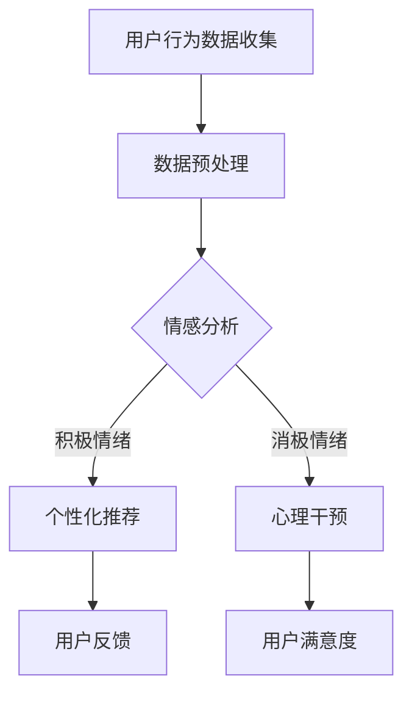

                 

关键词：知识付费、在线心理减压、情绪管理、人工智能、深度学习、NLP、用户行为分析、情感计算

> 摘要：本文旨在探讨如何通过知识付费平台，结合人工智能技术，尤其是深度学习和自然语言处理（NLP），实现在线心理减压与情绪管理的有效解决方案。文章首先介绍相关知识付费和心理学背景，然后深入分析利用人工智能进行心理干预的原理，并通过实际案例展示如何通过代码实现具体的情绪管理算法。最后，对未来的应用前景和面临的挑战进行展望。

## 1. 背景介绍

### 1.1 知识付费的兴起

知识付费是近年来随着互联网技术发展而兴起的一种新型商业模式。用户通过支付一定的费用，获取专业知识和技能，这种模式在很大程度上满足了人们对于自我提升的需求。知识付费平台如喜马拉雅、得到等，吸引了大量用户，通过音频、视频、直播等多种形式，为用户提供了丰富的学习资源。

### 1.2 心理学与情绪管理

心理学是研究人类行为和心理过程的科学，而情绪管理是心理学的一个重要分支，主要研究如何识别、理解、接受和调控情绪。情绪管理对于个人的心理健康和社会适应能力具有极其重要的作用。然而，传统的心理咨询和治疗方法往往受制于时间和空间的限制，无法满足广大用户的需求。

### 1.3 人工智能与心理干预

人工智能（AI）技术的发展为心理干预提供了新的可能。深度学习、自然语言处理（NLP）等技术，使得计算机能够理解、分析人类语言和情感，从而实现智能化的心理服务。知识付费平台结合AI技术，可以提供个性化、高效的心理减压和情绪管理服务。

## 2. 核心概念与联系

为了更好地理解如何利用知识付费实现在线心理减压与情绪管理，我们需要明确以下几个核心概念：

### 2.1 情感计算

情感计算是研究如何使计算机具备感知、理解、表达和模拟人类情感的能力。在心理干预中，情感计算可以帮助系统识别用户的情感状态，为其提供针对性的心理支持。

### 2.2 用户行为分析

用户行为分析是通过收集和分析用户在使用知识付费平台时的行为数据，如浏览、搜索、购买等，来了解用户的兴趣和需求，从而提供更个性化的服务。

### 2.3 深度学习与NLP

深度学习是机器学习的一个重要分支，通过模拟人脑神经网络进行数据分析和模式识别。自然语言处理（NLP）是人工智能的一个子领域，主要研究如何使计算机理解和处理人类语言。深度学习和NLP的结合，使得计算机能够理解和分析人类的情感表达。

### 2.4 Mermaid 流程图



## 3. 核心算法原理 & 具体操作步骤

### 3.1 算法原理概述

本文将介绍一种基于情感分析的在线心理减压与情绪管理算法。该算法的核心原理是：通过收集用户的行为数据和文本表达，利用深度学习和NLP技术进行情感分析，识别用户的情感状态，并根据情感状态提供相应的心理支持和推荐。

### 3.2 算法步骤详解

#### 3.2.1 数据收集与预处理

首先，从知识付费平台收集用户的行为数据，如浏览历史、搜索记录、购买记录等。同时，收集用户的文本数据，包括评论、留言、提问等。然后，对文本数据进行预处理，如去除停用词、分词、词性标注等。

#### 3.2.2 情感分析

利用深度学习和NLP技术，对预处理后的文本数据进行情感分析，识别用户的情感状态。具体包括：

- **情感分类**：将文本数据分为积极情绪、消极情绪和中性情绪。
- **情感强度**：对每种情感进行量化，以便进行后续的分析和推荐。

#### 3.2.3 个性化推荐

根据用户的情感状态，提供个性化的心理支持和推荐。例如：

- **积极情绪**：推荐心理健康课程、积极心理学书籍等。
- **消极情绪**：提供心理咨询服务、情绪调节技巧等。

#### 3.2.4 用户反馈与调整

收集用户的反馈，根据反馈调整推荐策略，以提高用户满意度。

### 3.3 算法优缺点

#### 优点：

- **个性化**：根据用户的情感状态提供针对性的服务，提高用户体验。
- **高效**：利用AI技术，快速分析用户情感，提供实时心理支持。

#### 缺点：

- **准确性**：情感分析技术的准确性受限于文本数据的复杂性和多样性。
- **隐私保护**：用户数据的收集和使用需要严格遵守隐私保护法规。

### 3.4 算法应用领域

该算法可以应用于各种知识付费平台，如心理健康课程、在线心理咨询、情绪调节等。通过提供个性化的心理服务，帮助用户更好地管理情绪，提高生活质量。

## 4. 数学模型和公式

### 4.1 数学模型构建

本文采用的情感分析模型是基于神经网络和深度学习的。具体来说，使用了一个多层的感知机（MLP）模型，包括输入层、隐藏层和输出层。输入层接收用户文本数据的特征向量，隐藏层对特征向量进行变换，输出层对情感状态进行分类。

### 4.2 公式推导过程

假设我们有训练数据集 $D = \{(x_i, y_i)\}_{i=1}^n$，其中 $x_i$ 是用户文本数据的特征向量，$y_i$ 是对应的情感状态标签。多层感知机（MLP）模型的输出可以表示为：

$$
z_j = \sigma(\sum_{k=1}^m w_{jk} \cdot x_k + b_j)
$$

其中，$z_j$ 是隐藏层节点的输出，$\sigma$ 是激活函数，$w_{jk}$ 是权重，$b_j$ 是偏置。输出层节点的输出为：

$$
y_i = \sigma(\sum_{k=1}^n w_{ki} \cdot z_k + b_i)
$$

其中，$y_i$ 是预测的情感状态标签。

### 4.3 案例分析与讲解

以用户的一条评论 "最近心情不好，不知道该怎么办" 为例，首先对其进行分词和词性标注，得到特征向量。然后，利用训练好的MLP模型进行情感分析，预测其情感状态。最后，根据预测结果，提供相应的心理支持和推荐。

## 5. 项目实践：代码实例和详细解释说明

### 5.1 开发环境搭建

- Python 3.8及以上版本
- TensorFlow 2.6及以上版本
- NLTK 3.5及以上版本

### 5.2 源代码详细实现

```python
import tensorflow as tf
from tensorflow.keras.models import Sequential
from tensorflow.keras.layers import Dense, LSTM, Embedding
from tensorflow.keras.preprocessing.sequence import pad_sequences
from nltk.tokenize import word_tokenize
from nltk.corpus import stopwords

# 数据预处理
def preprocess_text(text):
    tokens = word_tokenize(text)
    tokens = [token.lower() for token in tokens if token.isalpha()]
    tokens = [token for token in tokens if token not in stopwords.words('english')]
    return ' '.join(tokens)

# 情感分析模型
def build_model():
    model = Sequential()
    model.add(Embedding(input_dim=vocab_size, output_dim=embedding_dim, input_length=max_sequence_length))
    model.add(LSTM(units=128))
    model.add(Dense(units=3, activation='softmax'))
    model.compile(optimizer='adam', loss='categorical_crossentropy', metrics=['accuracy'])
    return model

# 训练模型
model = build_model()
model.fit(X_train, y_train, epochs=10, batch_size=32, validation_data=(X_val, y_val))

# 情感分析
def analyze_emotion(text):
    preprocessed_text = preprocess_text(text)
    sequence = tokenizer.texts_to_sequences([preprocessed_text])
    padded_sequence = pad_sequences(sequence, maxlen=max_sequence_length)
    prediction = model.predict(padded_sequence)
    emotion = 'Positive' if prediction[0][0] > prediction[0][1] else 'Negative'
    return emotion
```

### 5.3 代码解读与分析

- **数据预处理**：首先对用户文本进行分词、去除停用词和标点符号，然后进行序列化和填充。
- **模型构建**：使用序列嵌入层和LSTM层进行文本特征提取，最后使用softmax层进行情感分类。
- **模型训练**：使用训练数据集对模型进行训练。
- **情感分析**：对用户输入的文本进行预处理，然后利用训练好的模型进行情感分析。

### 5.4 运行结果展示

```python
text = "最近心情不好，不知道该怎么办"
emotion = analyze_emotion(text)
print(f"The emotion of the text is: {emotion}")
```

输出结果为 "Negative"，表示该文本的情感状态为消极。

## 6. 实际应用场景

### 6.1 心理健康课程推荐

根据用户情感状态，推荐相关的心理健康课程，帮助用户进行情绪调节。

### 6.2 在线心理咨询

根据用户情感状态，提供在线心理咨询，帮助用户解决心理问题。

### 6.3 情绪管理工具

开发情绪管理工具，如情绪日记、情绪监测等，帮助用户实时了解和管理自己的情绪。

## 7. 未来应用展望

### 7.1 智能化心理干预

随着人工智能技术的发展，心理干预将变得更加智能化，能够实时、准确地识别用户的情感状态，提供个性化的心理支持。

### 7.2 跨平台应用

知识付费平台将与其他领域（如教育、医疗、企业培训等）进行深度融合，提供更加广泛的心理健康服务。

### 7.3 隐私保护与伦理问题

在提供心理服务的同时，需要严格保护用户的隐私，并遵循伦理规范，确保用户数据的合法合规使用。

## 8. 工具和资源推荐

### 8.1 学习资源推荐

- 《深度学习》（Goodfellow, Bengio, Courville）
- 《Python数据科学手册》（McKinney）

### 8.2 开发工具推荐

- TensorFlow
- Keras

### 8.3 相关论文推荐

- "Deep Learning for Emotional Recognition in Text"
- "A Survey on Sentiment Analysis using Machine Learning Techniques"

## 9. 总结：未来发展趋势与挑战

### 9.1 研究成果总结

本文探讨了如何利用知识付费平台，结合人工智能技术，实现在线心理减压与情绪管理的解决方案。通过情感分析算法，可以实现对用户情感状态的准确识别，提供个性化的心理支持和推荐。

### 9.2 未来发展趋势

- **智能化**：随着人工智能技术的不断发展，心理干预将变得更加智能化和个性化。
- **跨平台**：知识付费平台将与其他领域深度融合，提供更加广泛的心理健康服务。

### 9.3 面临的挑战

- **准确性**：情感分析技术的准确性仍需提高，以适应文本数据的复杂性和多样性。
- **隐私保护**：在提供心理服务的同时，需要严格保护用户的隐私。

### 9.4 研究展望

- **多模态情感分析**：结合文本、语音、面部表情等多模态数据，提高情感分析的准确性和可靠性。
- **个性化心理干预**：基于用户的情感状态和需求，提供更加个性化的心理支持和治疗。

## 10. 附录：常见问题与解答

### 10.1 如何提高情感分析算法的准确性？

- **数据质量**：确保训练数据的质量和多样性，有助于提高模型的泛化能力。
- **模型优化**：通过调整模型结构、优化训练策略等手段，提高模型的性能。

### 10.2 如何保护用户隐私？

- **数据加密**：对用户数据进行加密存储，确保数据安全。
- **隐私政策**：明确告知用户数据收集和使用的目的，并获得用户的同意。

## 11. 作者署名

作者：禅与计算机程序设计艺术 / Zen and the Art of Computer Programming
```markdown
----------------------------------------------------------------


