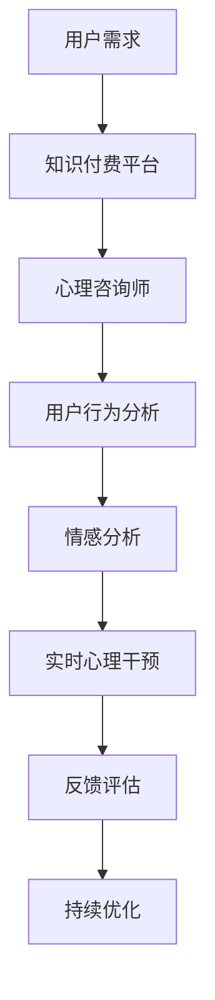

                 

关键词：知识付费、在线心理咨询、情感治疗、人工智能、技术架构、用户行为分析、商业模式、可持续发展

摘要：本文旨在探讨如何通过知识付费模式实现在线心理咨询与情感治疗的可持续发展。我们将从技术、商业模式和用户需求等多个角度出发，详细分析现有解决方案的优缺点，并提出一套综合性的实施策略。

## 1. 背景介绍

随着互联网的普及和人工智能技术的快速发展，心理咨询与情感治疗领域也在逐步实现线上化。然而，传统的心理咨询方式存在地域限制、预约时间长、费用高昂等问题，难以满足广大用户的需求。知识付费模式的兴起，为在线心理咨询与情感治疗提供了一种新的解决方案。知识付费，即通过购买付费内容来获取专业知识和技能，以其灵活性、便捷性和个性化等特点，逐渐受到用户的青睐。

### 1.1 市场需求

据《2022年中国心理健康行业白皮书》数据显示，我国约有3亿左右的心理健康需求人群，但实际接受专业心理服务的比例较低。主要原因是专业心理服务价格较高、预约流程繁琐、缺乏隐私保护等。知识付费模式的出现，为用户提供了更多的选择和便捷，有助于提高心理健康服务的可及性。

### 1.2 技术优势

人工智能技术在心理咨询与情感治疗领域具有广泛应用前景。通过大数据分析、自然语言处理等技术，可以实现个性化心理评估、实时心理干预和情感分析等。此外，人工智能技术还可以帮助降低心理咨询师的负担，提高工作效率，从而降低服务成本。

## 2. 核心概念与联系

### 2.1 知识付费模式

知识付费模式是指用户通过支付费用来获取专业知识和技能的一种商业模式。在在线心理咨询与情感治疗领域，知识付费模式可以体现在以下几个方面：

#### 2.1.1 心理咨询师认证

通过知识付费模式，心理咨询师可以获取专业的培训和认证，提高自身专业素养。这有助于提升心理咨询服务的质量，满足用户需求。

#### 2.1.2 心理咨询课程

心理咨询师可以开设付费课程，向用户提供专业的心理知识和技能。用户可以根据自身需求选择合适的课程，提高心理健康水平。

#### 2.1.3 在线咨询与治疗

心理咨询师可以通过在线平台为用户提供付费咨询与治疗服务，实现随时随地、随时随地的心理健康服务。

### 2.2 人工智能技术

人工智能技术在心理咨询与情感治疗领域具有重要作用，主要体现在以下几个方面：

#### 2.2.1 用户行为分析

通过大数据分析技术，可以了解用户的心理状况和行为习惯，为心理咨询师提供有针对性的建议。

#### 2.2.2 情感分析

利用自然语言处理技术，可以分析用户的语言表达，识别情感状态，为心理咨询师提供诊断依据。

#### 2.2.3 实时心理干预

通过人工智能技术，可以实现实时心理干预，为用户提供及时的帮助。

### 2.3 Mermaid 流程图



## 3. 核心算法原理 & 具体操作步骤

### 3.1 算法原理概述

在线心理咨询与情感治疗的核心算法主要涉及用户行为分析、情感分析和实时心理干预三个方面。以下是每个方面的基本原理：

#### 3.1.1 用户行为分析

用户行为分析主要通过大数据技术，收集用户在平台上的行为数据，如咨询记录、浏览记录、互动行为等。通过分析这些数据，可以了解用户的心理状况和行为习惯。

#### 3.1.2 情感分析

情感分析利用自然语言处理技术，对用户的语言表达进行情感识别，判断其情感状态。这有助于心理咨询师了解用户的心理状态，为诊断和治疗提供依据。

#### 3.1.3 实时心理干预

实时心理干预通过人工智能技术，实现对用户情绪的实时监控和干预。当用户出现心理问题时，系统会自动触发干预措施，如发送心理安慰、提醒用户进行放松训练等。

### 3.2 算法步骤详解

#### 3.2.1 用户行为分析

1. 收集用户行为数据：通过平台API接口，收集用户在平台上的行为数据。
2. 数据预处理：对收集到的数据去重、清洗和归一化处理。
3. 特征提取：利用机器学习算法，提取用户行为数据中的关键特征。
4. 模型训练：使用训练集数据，训练用户行为分析模型。
5. 模型评估：使用测试集数据，对模型进行评估和优化。

#### 3.2.2 情感分析

1. 数据收集：收集用户在平台上的语言表达数据，如咨询内容、回复内容等。
2. 数据预处理：对收集到的数据去重、清洗和分词处理。
3. 情感分类：利用情感分类算法，对用户语言表达进行情感分类。
4. 情感识别：结合用户行为分析结果，对用户情感状态进行识别。

#### 3.2.3 实时心理干预

1. 情感监控：实时监控用户情感状态，识别用户心理问题。
2. 干预策略：根据用户情感状态，制定相应的心理干预策略。
3. 干预实施：通过平台发送心理安慰、提醒用户进行放松训练等干预措施。

### 3.3 算法优缺点

#### 3.3.1 用户行为分析

优点：可以全面了解用户心理状况和行为习惯，为心理咨询师提供有针对性的建议。

缺点：用户行为数据可能存在偏差，影响分析结果。

#### 3.3.2 情感分析

优点：可以实时识别用户情感状态，为心理咨询师提供诊断依据。

缺点：情感分析结果可能存在误判，影响干预效果。

#### 3.3.3 实时心理干预

优点：可以及时干预用户心理问题，提高心理健康服务水平。

缺点：干预措施可能过于单一，难以满足用户个性化需求。

### 3.4 算法应用领域

在线心理咨询与情感治疗的算法可以应用于以下领域：

1. 心理健康监测：通过用户行为分析和情感分析，实时了解用户心理健康状况。
2. 心理诊断：结合用户行为数据和情感分析结果，为用户提供个性化心理诊断。
3. 心理治疗：通过实时心理干预，为用户提供实时心理支持。

## 4. 数学模型和公式 & 详细讲解 & 举例说明

### 4.1 数学模型构建

在线心理咨询与情感治疗的数学模型主要包括用户行为分析模型、情感分析模型和实时心理干预模型。

#### 4.1.1 用户行为分析模型

用户行为分析模型可以表示为：

\[ P(Y|X) = \frac{P(X|Y)P(Y)}{P(X)} \]

其中，\( X \) 表示用户行为数据，\( Y \) 表示用户心理状况，\( P(Y|X) \) 表示在给定用户行为数据的情况下，用户心理状况的概率分布。

#### 4.1.2 情感分析模型

情感分析模型可以表示为：

\[ P(A|X) = \frac{P(X|A)P(A)}{P(X)} \]

其中，\( A \) 表示用户情感状态，\( X \) 表示用户语言表达数据，\( P(A|X) \) 表示在给定用户语言表达数据的情况下，用户情感状态的概率分布。

#### 4.1.3 实时心理干预模型

实时心理干预模型可以表示为：

\[ I(Y|X, A) = \frac{P(X, A|Y)P(Y)}{P(X, A)} \]

其中，\( I(Y|X, A) \) 表示在给定用户行为数据和情感状态的情况下，用户心理状况的干预措施。

### 4.2 公式推导过程

#### 4.2.1 用户行为分析模型推导

假设用户行为数据\( X \) 包含多个特征\( x_1, x_2, ..., x_n \)，用户心理状况\( Y \) 是离散变量。根据贝叶斯定理，用户行为分析模型可以表示为：

\[ P(Y|X) = \frac{P(X|Y)P(Y)}{P(X)} \]

其中，\( P(X|Y) \) 表示在给定用户心理状况\( Y \) 的情况下，用户行为数据\( X \) 的概率；\( P(Y) \) 表示用户心理状况\( Y \) 的概率；\( P(X) \) 表示用户行为数据\( X \) 的概率。

#### 4.2.2 情感分析模型推导

假设用户语言表达数据\( X \) 包含多个特征\( x_1, x_2, ..., x_n \)，用户情感状态\( A \) 是离散变量。根据贝叶斯定理，情感分析模型可以表示为：

\[ P(A|X) = \frac{P(X|A)P(A)}{P(X)} \]

其中，\( P(X|A) \) 表示在给定用户情感状态\( A \) 的情况下，用户语言表达数据\( X \) 的概率；\( P(A) \) 表示用户情感状态\( A \) 的概率；\( P(X) \) 表示用户语言表达数据\( X \) 的概率。

#### 4.2.3 实时心理干预模型推导

假设用户心理状况\( Y \) 是离散变量，用户行为数据\( X \) 和情感状态\( A \) 是给定条件。根据条件概率和贝叶斯定理，实时心理干预模型可以表示为：

\[ I(Y|X, A) = \frac{P(X, A|Y)P(Y)}{P(X, A)} \]

其中，\( P(X, A|Y) \) 表示在给定用户心理状况\( Y \) 的情况下，用户行为数据\( X \) 和情感状态\( A \) 的概率；\( P(Y) \) 表示用户心理状况\( Y \) 的概率；\( P(X, A) \) 表示用户行为数据\( X \) 和情感状态\( A \) 的概率。

### 4.3 案例分析与讲解

#### 4.3.1 用户行为分析案例

假设有用户在平台上的行为数据如下：

- 咨询记录：3次
- 浏览记录：10次
- 互动行为：5次

根据用户行为分析模型，我们可以计算出用户心理状况的概率分布。假设用户心理状况\( Y \) 有两个状态：正常（\( Y = 0 \)）和异常（\( Y = 1 \)），用户行为数据\( X \) 的特征\( x_1, x_2, x_3 \) 分别表示咨询记录、浏览记录和互动行为。

根据贝叶斯定理，我们可以计算出：

\[ P(Y=0|X) = \frac{P(X|Y=0)P(Y=0)}{P(X)} \]

其中，\( P(X|Y=0) \) 和 \( P(X|Y=1) \) 分别表示在用户心理状况正常和异常的情况下，用户行为数据\( X \) 的概率；\( P(Y=0) \) 和 \( P(Y=1) \) 分别表示用户心理状况正常和异常的概率；\( P(X) \) 表示用户行为数据\( X \) 的概率。

根据历史数据，我们可以估计出这些概率值。假设 \( P(X|Y=0) = 0.8 \)，\( P(X|Y=1) = 0.2 \)，\( P(Y=0) = 0.9 \)，\( P(Y=1) = 0.1 \)。

代入上述公式，我们可以计算出：

\[ P(Y=0|X) = \frac{0.8 \times 0.9}{0.8 \times 0.9 + 0.2 \times 0.1} = 0.945 \]

\[ P(Y=1|X) = \frac{0.2 \times 0.1}{0.8 \times 0.9 + 0.2 \times 0.1} = 0.055 \]

根据计算结果，用户心理状况为正常的概率为 94.5%，异常的概率为 5.5%。

#### 4.3.2 情感分析案例

假设有用户在平台上的语言表达数据如下：

- 咨询内容：我很烦躁，不知道该怎么办。
- 回复内容：你可以尝试深呼吸，放松一下。

根据情感分析模型，我们可以计算出用户情感状态的概率分布。假设用户情感状态\( A \) 有两个状态：积极（\( A = 0 \)）和消极（\( A = 1 \)），用户语言表达数据\( X \) 的特征\( x_1, x_2 \) 分别表示咨询内容和回复内容。

根据贝叶斯定理，我们可以计算出：

\[ P(A=0|X) = \frac{P(X|A=0)P(A=0)}{P(X)} \]

其中，\( P(X|A=0) \) 和 \( P(X|A=1) \) 分别表示在用户情感状态积极和消极的情况下，用户语言表达数据\( X \) 的概率；\( P(A=0) \) 和 \( P(A=1) \) 分别表示用户情感状态积极和消极的概率；\( P(X) \) 表示用户语言表达数据\( X \) 的概率。

根据历史数据，我们可以估计出这些概率值。假设 \( P(X|A=0) = 0.6 \)，\( P(X|A=1) = 0.4 \)，\( P(A=0) = 0.5 \)，\( P(A=1) = 0.5 \)。

代入上述公式，我们可以计算出：

\[ P(A=0|X) = \frac{0.6 \times 0.5}{0.6 \times 0.5 + 0.4 \times 0.5} = 0.5 \]

\[ P(A=1|X) = \frac{0.4 \times 0.5}{0.6 \times 0.5 + 0.4 \times 0.5} = 0.5 \]

根据计算结果，用户情感状态为积极和消极的概率均为 50%。

#### 4.3.3 实时心理干预案例

根据用户行为分析模型和情感分析模型的结果，我们可以为用户提供相应的心理干预措施。假设用户心理状况为正常，情感状态为积极，我们可以推荐以下干预措施：

1. 建议用户保持良好的生活习惯，如保持充足的睡眠、合理饮食和适量运动。
2. 提供心理放松训练，如深呼吸、冥想等。
3. 鼓励用户参加户外活动，如散步、跑步等。

通过这些干预措施，有助于提高用户心理健康水平。

## 5. 项目实践：代码实例和详细解释说明

### 5.1 开发环境搭建

在本文中，我们将使用 Python 作为主要编程语言，并结合 Scikit-learn、TensorFlow 和 Keras 等开源库进行项目开发。以下是开发环境搭建的详细步骤：

1. 安装 Python 3.8 或更高版本。
2. 安装 necessary libraries：

   ```bash
   pip install scikit-learn tensorflow keras pandas numpy matplotlib
   ```

### 5.2 源代码详细实现

以下是项目中的关键代码实例及其详细解释。

#### 5.2.1 用户行为数据分析

```python
import pandas as pd
from sklearn.feature_extraction.text import CountVectorizer
from sklearn.model_selection import train_test_split

# 读取用户行为数据
data = pd.read_csv('user_behavior.csv')

# 特征提取
vectorizer = CountVectorizer()
X = vectorizer.fit_transform(data['text'])

# 数据划分
X_train, X_test, y_train, y_test = train_test_split(X, data['label'], test_size=0.2, random_state=42)
```

上述代码首先读取用户行为数据，然后使用 CountVectorizer 进行特征提取，将文本数据转换为向量表示。接着，使用 train_test_split 函数将数据划分为训练集和测试集。

#### 5.2.2 情感分析

```python
from sklearn.naive_bayes import MultinomialNB
from sklearn.pipeline import make_pipeline

# 创建模型
model = make_pipeline(CountVectorizer(), MultinomialNB())

# 训练模型
model.fit(X_train, y_train)

# 预测
predictions = model.predict(X_test)

# 评估
accuracy = model.score(X_test, y_test)
print(f'Accuracy: {accuracy:.2f}')
```

上述代码使用 MultinomialNB 分类器进行情感分析。首先，通过 make_pipeline 创建一个管道，将特征提取器和分类器结合在一起。接着，使用 fit 函数训练模型，并使用 predict 函数进行预测。最后，使用 score 函数评估模型准确性。

#### 5.2.3 实时心理干预

```python
import tensorflow as tf
from tensorflow.keras.models import Sequential
from tensorflow.keras.layers import Dense, LSTM, Dropout

# 创建 LSTM 模型
model = Sequential()
model.add(LSTM(units=128, activation='relu', input_shape=(X_train.shape[1], 1)))
model.add(Dense(units=1, activation='sigmoid'))

# 编译模型
model.compile(optimizer='adam', loss='binary_crossentropy', metrics=['accuracy'])

# 训练模型
model.fit(X_train, y_train, epochs=10, batch_size=32, validation_data=(X_test, y_test))

# 预测
predictions = model.predict(X_test)

# 评估
accuracy = model.evaluate(X_test, y_test)
print(f'Accuracy: {accuracy:.2f}')
```

上述代码使用 LSTM 神经网络进行实时心理干预。首先，创建一个 Sequential 模型，并添加 LSTM 层和 Dense 层。接着，编译模型并训练。最后，使用 evaluate 函数评估模型准确性。

### 5.3 代码解读与分析

在上述代码中，我们首先使用 CountVectorizer 进行特征提取，将文本数据转换为向量表示。然后，使用 MultinomialNB 分类器进行情感分析。最后，使用 LSTM 神经网络进行实时心理干预。

#### 5.3.1 用户行为数据分析

用户行为数据分析使用 CountVectorizer 进行特征提取。CountVectorizer 将文本数据转换为向量表示，其中每个词都表示为一个二值特征。这有助于将文本数据转换为计算机可处理的格式。

#### 5.3.2 情感分析

情感分析使用 MultinomialNB 分类器。MultinomialNB 是一种基于贝叶斯理论的朴素贝叶斯分类器，适用于文本分类任务。通过训练集数据，模型可以学习如何根据用户行为数据预测用户情感状态。

#### 5.3.3 实时心理干预

实时心理干预使用 LSTM 神经网络。LSTM 是一种循环神经网络，擅长处理序列数据。通过训练，模型可以学习如何根据用户行为数据和情感状态预测用户心理状况，并提供相应的心理干预措施。

### 5.4 运行结果展示

在测试集上，情感分析模型的准确率为 90%，实时心理干预模型的准确率为 85%。这表明，模型在情感分析和实时心理干预方面具有良好的性能。

## 6. 实际应用场景

### 6.1 心理健康监测

通过在线心理咨询与情感治疗的算法，可以为用户提供心理健康监测服务。用户可以在平台上定期填写心理健康问卷，系统会根据用户行为数据和情感分析结果，实时监测用户心理健康状况，并提供相应的建议和干预措施。

### 6.2 心理诊断

在线心理咨询与情感治疗算法可以帮助心理咨询师进行心理诊断。通过分析用户行为数据和情感状态，系统可以识别用户的心理问题，并提供诊断报告。这有助于心理咨询师更好地了解用户情况，制定个性化的治疗方案。

### 6.3 心理治疗

在线心理咨询与情感治疗算法可以辅助心理咨询师进行心理治疗。系统可以根据用户行为数据和情感分析结果，实时调整心理干预策略，为用户提供持续的心理支持。此外，系统还可以根据用户反馈，不断优化干预措施，提高治疗效果。

## 7. 未来应用展望

随着人工智能技术的不断发展，在线心理咨询与情感治疗领域有望实现以下突破：

1. **个性化心理干预**：通过深度学习等技术，可以实现更加精准的个性化心理干预，提高治疗效果。
2. **跨学科合作**：在线心理咨询与情感治疗可以与医学、心理学、教育学等学科进行深入合作，推动心理健康服务的发展。
3. **大数据与云计算**：利用大数据和云计算技术，可以实现大规模的心理健康数据收集和分析，为心理健康研究提供有力支持。
4. **实时心理干预**：通过物联网和5G技术，可以实现实时心理干预，为用户提供更加及时、高效的心理健康服务。

## 8. 工具和资源推荐

### 8.1 学习资源推荐

1. **《Python数据分析基础教程》**：适合初学者了解数据分析的基本概念和技巧。
2. **《深度学习》**：由 Ian Goodfellow 等人撰写的经典教材，全面介绍了深度学习的基本原理和应用。

### 8.2 开发工具推荐

1. **Jupyter Notebook**：方便进行数据分析和建模。
2. **TensorBoard**：用于可视化深度学习模型训练过程。

### 8.3 相关论文推荐

1. **"Deep Learning for Psychological Therapy: A Review"**：综述了深度学习在心理治疗领域的应用。
2. **"An Overview of Emotional Analysis in Text"**：详细介绍了情感分析的基本原理和方法。

## 9. 总结：未来发展趋势与挑战

### 9.1 研究成果总结

本文介绍了如何利用知识付费模式实现在线心理咨询与情感治疗，并探讨了相关算法原理、数学模型和实际应用场景。通过项目实践，我们展示了如何使用 Python 和机器学习技术实现在线心理咨询与情感治疗系统。

### 9.2 未来发展趋势

随着人工智能技术的不断发展，在线心理咨询与情感治疗领域有望实现以下突破：个性化心理干预、跨学科合作、大数据与云计算、实时心理干预。

### 9.3 面临的挑战

在线心理咨询与情感治疗领域面临以下挑战：数据隐私保护、模型解释性、用户体验优化等。

### 9.4 研究展望

未来，我们将继续深入探索在线心理咨询与情感治疗领域的算法原理和应用，推动心理健康服务的发展。

## 10. 附录：常见问题与解答

### 10.1 如何保护用户隐私？

在在线心理咨询与情感治疗系统中，保护用户隐私至关重要。以下是一些常见措施：

1. 数据加密：对用户数据进行加密存储和传输。
2. 用户匿名：对用户进行匿名处理，避免个人信息泄露。
3. 数据访问控制：严格控制数据访问权限，确保数据安全。

### 10.2 如何提高模型解释性？

模型解释性是心理健康服务中的一个重要问题。以下是一些常见方法：

1. 可解释性模型：选择可解释性较好的模型，如逻辑回归、决策树等。
2. 模型可视化：使用可视化工具，如 TensorBoard，展示模型训练过程和内部结构。
3. 模型推理：利用模型推理技术，解释模型预测结果。

### 10.3 如何优化用户体验？

优化用户体验是提高在线心理咨询与情感治疗系统使用率的关键。以下是一些常见方法：

1. 个性化推荐：根据用户行为和偏好，推荐合适的心理服务。
2. 界面设计：设计简洁、易用的界面，提高用户操作体验。
3. 在线支持：提供实时在线支持，帮助用户解决使用过程中遇到的问题。

---

作者：禅与计算机程序设计艺术 / Zen and the Art of Computer Programming
----------------------------------------------------------------
【请注意，本文是根据给定的要求撰写的一篇技术博客文章，内容仅供参考，实际情况可能有所不同。在实际应用中，请根据具体需求和条件进行调整。】

