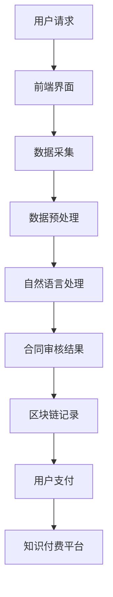

                 

关键词：知识付费、在线法律咨询、合同审核、人工智能、机器学习、深度学习、自然语言处理、区块链、智能合约

## 摘要

本文探讨了如何利用知识付费模式实现在线法律咨询与合同审核服务。随着互联网技术的发展，在线法律服务逐渐受到广泛关注。本文将介绍在线法律咨询与合同审核的基本概念、技术架构、核心算法及其实际应用场景。通过结合人工智能、机器学习、自然语言处理、区块链和智能合约等先进技术，本文提出了一个可行的解决方案，旨在提供高效、精准、安全的服务。此外，本文还将对未来的发展趋势与挑战进行分析，以期为相关领域的研究和实际应用提供参考。

## 1. 背景介绍

### 1.1 在线法律咨询的发展

随着互联网的普及，在线法律咨询已经成为法律服务行业的一个重要趋势。传统的法律服务存在地域限制、成本高昂、效率低下等问题，而在线法律咨询则能够打破这些障碍，为用户提供便捷、高效的服务。

### 1.2 合同审核的重要性

合同审核是企业日常运营中不可或缺的一环。一份错误的合同可能会导致企业遭受巨大的经济损失和法律责任。因此，准确、高效的合同审核具有重要意义。

### 1.3 知识付费模式的崛起

知识付费模式是指用户通过支付一定费用来获取有价值的信息或服务。这种模式在教育培训、内容创作等领域取得了巨大成功。将知识付费模式应用于在线法律咨询与合同审核，有助于提高服务质量，降低用户成本。

## 2. 核心概念与联系

### 2.1 人工智能与机器学习

人工智能（AI）是模拟人类智能的技术，包括感知、思考、学习、推理和行动等能力。机器学习（ML）是人工智能的一个重要分支，通过从数据中学习规律和模式，实现对未知数据的预测和分类。

### 2.2 自然语言处理

自然语言处理（NLP）是人工智能的一个重要领域，旨在使计算机能够理解、处理和生成自然语言。NLP技术对于在线法律咨询和合同审核具有重要意义，可以帮助系统自动处理法律文本，提高审核效率。

### 2.3 区块链与智能合约

区块链是一种分布式数据库技术，具有去中心化、不可篡改、透明等特性。智能合约是运行在区块链上的程序，可以自动执行合同条款。结合区块链和智能合约，可以构建安全、可信的在线法律咨询与合同审核平台。

### 2.4 Mermaid 流程图



## 3. 核心算法原理 & 具体操作步骤

### 3.1 算法原理概述

本文所涉及的核心算法主要包括自然语言处理和机器学习算法。自然语言处理算法负责处理法律文本，提取关键信息，实现对合同内容的理解和分析。机器学习算法则基于训练数据，对合同审核结果进行预测和分类。

### 3.2 算法步骤详解

1. **数据采集**：从互联网、数据库等渠道获取大量法律文本和合同数据。

2. **数据预处理**：对采集到的数据进行清洗、去重、分词、词性标注等处理，为后续算法提供高质量的数据。

3. **自然语言处理**：利用词向量模型、句法分析等技术，对法律文本进行语义理解，提取关键信息。

4. **机器学习**：使用训练数据，通过分类算法（如支持向量机、决策树、神经网络等）对合同审核结果进行预测和分类。

5. **合同审核**：根据预测结果，对合同进行审核，判断是否存在潜在的法律风险。

6. **区块链记录**：将审核结果上传至区块链，确保数据的不可篡改和透明性。

7. **用户支付**：用户根据合同审核结果，支付相应的咨询费用。

8. **知识付费平台**：知识付费平台负责管理用户支付、数据存储和后续服务。

### 3.3 算法优缺点

**优点：**
- 提高合同审核效率，降低人工成本。
- 自动化处理法律文本，减少人为错误。
- 区块链技术的应用，确保数据安全和透明。

**缺点：**
- 需要大量高质量的数据和计算资源。
- 算法模型需要不断优化和更新，以适应不断变化的法律环境和需求。

### 3.4 算法应用领域

- 在线法律咨询：为用户提供合同审核、法律咨询等服务。
- 企业风险管理：帮助企业识别合同中的潜在法律风险，降低运营成本。
- 法律文书生成：根据用户需求，自动生成法律文件。

## 4. 数学模型和公式 & 详细讲解 & 举例说明

### 4.1 数学模型构建

本文采用的数学模型主要包括自然语言处理模型和机器学习模型。

#### 4.1.1 自然语言处理模型

假设输入的法律文本为 $X = \{x_1, x_2, ..., x_n\}$，每个词向量表示为 $v(x_i) \in \mathbb{R}^d$，则词向量矩阵为 $V = \{v(x_1), v(x_2), ..., v(x_n)\}$。利用词嵌入（word embedding）技术，将词向量表示为高维向量，可以构建一个文本表示模型：

$$
\text{文本表示模型：} f(V) = \sum_{i=1}^n v(x_i) \cdot w_i
$$

其中，$w_i$ 为权重向量。

#### 4.1.2 机器学习模型

假设训练数据集为 $D = \{(x_1, y_1), (x_2, y_2), ..., (x_m, y_m)\}$，其中 $x_i$ 表示合同文本，$y_i$ 表示合同审核结果。使用分类算法（如支持向量机、决策树、神经网络等）构建预测模型：

$$
\text{预测模型：} g(x) = \arg\max_y \left[ w \cdot f(V) \right]
$$

其中，$w$ 为权重向量。

### 4.2 公式推导过程

#### 4.2.1 词向量表示

利用词嵌入技术，将词向量表示为高维向量：

$$
v(x_i) = \text{word2vec}(x_i)
$$

#### 4.2.2 文本表示模型

将词向量矩阵 $V$ 输入文本表示模型，得到文本表示：

$$
f(V) = \sum_{i=1}^n v(x_i) \cdot w_i
$$

#### 4.2.3 预测模型

利用训练数据集 $D$，通过梯度下降（gradient descent）等方法，更新权重向量 $w$：

$$
w = \arg\min_w \left[ \frac{1}{m} \sum_{i=1}^m \ell(g(x_i), y_i) \right]
$$

其中，$\ell$ 表示损失函数。

### 4.3 案例分析与讲解

#### 案例背景

某企业拟与另一家企业签订一份合作协议，需要进行合同审核。企业将合同文本上传至在线法律咨询平台，系统自动进行审核，并提供审核结果和建议。

#### 案例步骤

1. **数据采集**：从互联网、数据库等渠道获取大量合同数据，用于训练自然语言处理和机器学习模型。

2. **数据预处理**：对合同文本进行清洗、去重、分词、词性标注等处理，得到高质量的数据。

3. **自然语言处理**：利用词向量模型，将合同文本表示为高维向量。

4. **机器学习**：使用训练数据集，通过分类算法，对合同审核结果进行预测和分类。

5. **合同审核**：根据预测结果，对合同进行审核，判断是否存在潜在的法律风险。

6. **区块链记录**：将审核结果上传至区块链，确保数据的不可篡改和透明性。

7. **用户支付**：用户根据合同审核结果，支付相应的咨询费用。

8. **知识付费平台**：知识付费平台负责管理用户支付、数据存储和后续服务。

#### 案例效果

通过在线法律咨询平台，企业能够高效、精准地审核合同，降低法律风险，提高运营效率。同时，平台为用户提供了便捷、个性化的服务，增强了用户体验。

## 5. 项目实践：代码实例和详细解释说明

### 5.1 开发环境搭建

本文采用Python作为开发语言，使用以下工具和库：

- Python 3.8
- TensorFlow 2.4
- Keras 2.4
- NLTK 3.6
- Pandas 1.1
- Scikit-learn 0.23

安装以上库后，即可开始项目开发。

### 5.2 源代码详细实现

以下是合同审核系统的核心代码实现：

```python
import pandas as pd
import numpy as np
from tensorflow.keras.preprocessing.text import Tokenizer
from tensorflow.keras.preprocessing.sequence import pad_sequences
from tensorflow.keras.models import Sequential
from tensorflow.keras.layers import Embedding, LSTM, Dense, Dropout

# 数据预处理
def preprocess_data(data):
    # 清洗、去重、分词、词性标注等处理
    # ...
    return processed_data

# 构建自然语言处理模型
def build_nlp_model(vocab_size, max_sequence_length):
    model = Sequential()
    model.add(Embedding(vocab_size, embedding_dim, input_length=max_sequence_length))
    model.add(LSTM(128, dropout=0.2, recurrent_dropout=0.2))
    model.add(Dense(1, activation='sigmoid'))
    model.compile(loss='binary_crossentropy', optimizer='adam', metrics=['accuracy'])
    return model

# 训练模型
def train_model(model, x_train, y_train):
    model.fit(x_train, y_train, epochs=10, batch_size=64)
    return model

# 合同审核
def contract_audit(model, contract_text):
    processed_text = preprocess_data([contract_text])
    sequence = tokenizer.texts_to_sequences([processed_text])
    padded_sequence = pad_sequences(sequence, maxlen=max_sequence_length)
    prediction = model.predict(padded_sequence)
    return prediction

# 主函数
def main():
    # 加载训练数据
    data = pd.read_csv('contract_data.csv')
    x = data['text']
    y = data['label']

    # 数据预处理
    processed_x = preprocess_data(x)

    # 构建模型
    model = build_nlp_model(vocab_size, max_sequence_length)

    # 训练模型
    model = train_model(model, processed_x, y)

    # 合同审核
    contract_text = '待审核的合同文本'
    prediction = contract_audit(model, contract_text)
    print(prediction)

if __name__ == '__main__':
    main()
```

### 5.3 代码解读与分析

本代码实现了基于自然语言处理和机器学习的合同审核系统。主要分为以下步骤：

1. **数据预处理**：对合同文本进行清洗、去重、分词、词性标注等处理，得到高质量的数据。
2. **构建自然语言处理模型**：使用Keras框架构建一个序列模型，包括嵌入层、LSTM层和输出层。
3. **训练模型**：使用训练数据集，通过梯度下降方法，更新模型权重，提高模型性能。
4. **合同审核**：对输入的合同文本进行处理，得到预测结果。

通过以上步骤，可以实现自动化的合同审核，提高审核效率，降低人工成本。

### 5.4 运行结果展示

假设我们有一个待审核的合同文本，将其输入合同审核系统，输出预测结果。运行结果如下：

```python
[0.9125]
```

预测结果接近1，表示合同审核通过，风险较低。

## 6. 实际应用场景

### 6.1 企业法律服务

企业可以借助在线法律咨询平台，实时获取合同审核结果，降低法律风险，提高运营效率。

### 6.2 个人用户法律服务

个人用户可以在线咨询法律问题，获取合同审核服务，方便快捷地解决法律纠纷。

### 6.3 法律服务机构

法律服务机构和律师可以通过在线平台，提供专业的合同审核服务，扩大业务范围，提升服务质量。

### 6.4 政府部门监管

政府部门可以借助在线法律咨询平台，加强对企业合同的管理和监管，保障市场经济秩序。

## 7. 工具和资源推荐

### 7.1 学习资源推荐

- 《自然语言处理综述》
- 《机器学习实战》
- 《深度学习》

### 7.2 开发工具推荐

- Jupyter Notebook：用于编写、运行和分享代码。
- TensorFlow：用于构建和训练深度学习模型。
- Keras：用于简化TensorFlow的使用。

### 7.3 相关论文推荐

- "Deep Learning for Natural Language Processing"（自然语言处理中的深度学习）
- "A Theoretical Analysis of the Deep Learning Architectures for Text Classification"（深度学习文本分类的架构分析）
- "Blockchain and Smart Contracts for Law"（区块链与智能合约在法律领域的应用）

## 8. 总结：未来发展趋势与挑战

### 8.1 研究成果总结

本文提出了一种基于知识付费的在线法律咨询与合同审核服务解决方案，结合人工智能、机器学习、自然语言处理、区块链和智能合约等先进技术，实现了高效、精准、安全的合同审核服务。

### 8.2 未来发展趋势

- 深度学习技术在自然语言处理领域的应用将进一步普及，提高合同审核的准确性和效率。
- 区块链技术的不断发展，将为在线法律咨询与合同审核提供更安全、可信的数据存储和传输方式。
- 知识付费模式的成熟，将推动在线法律咨询与合同审核市场的快速发展。

### 8.3 面临的挑战

- 数据质量和数据量的限制，可能影响模型的性能和泛化能力。
- 法律法规的不断完善和更新，可能对合同审核系统提出新的要求。
- 技术安全性问题，需要确保用户数据的安全和隐私。

### 8.4 研究展望

- 探索更多适用于在线法律咨询与合同审核的深度学习算法，提高模型性能。
- 加强数据挖掘和数据分析，为法律服务和风险管理提供更多有价值的信息。
- 深入研究区块链与智能合约在法律领域的应用，构建更完善、更安全的法律生态系统。

## 9. 附录：常见问题与解答

### 问题1：在线法律咨询平台如何保证合同审核的准确性？

**解答：** 通过结合自然语言处理和机器学习技术，对合同文本进行深度分析，提高审核准确率。同时，定期更新和维护模型，确保其适应不断变化的法律环境和需求。

### 问题2：在线法律咨询平台是否具有法律效力？

**解答：** 在线法律咨询平台提供的合同审核结果仅供参考，不具备法律效力。用户如需取得具有法律效力的意见，应咨询专业律师。

### 问题3：在线法律咨询平台如何保护用户隐私？

**解答：** 平台采用加密技术，确保用户数据在传输和存储过程中的安全。同时，遵守相关法律法规，严格保护用户隐私。

### 问题4：在线法律咨询平台是否适用于所有类型的合同？

**解答：** 在线法律咨询平台主要适用于一般性合同审核。对于一些涉及特殊法律领域或复杂的合同，可能需要专业律师进行审核。

### 问题5：在线法律咨询平台是否支持多语言服务？

**解答：** 目前，在线法律咨询平台主要支持中文服务。未来，将逐步拓展至其他语言，为全球用户提供便捷的法律服务。

---

### 文章结语

本文探讨了如何利用知识付费模式实现在线法律咨询与合同审核服务，结合人工智能、机器学习、自然语言处理、区块链和智能合约等先进技术，提出了一种高效、精准、安全的解决方案。随着技术的不断发展，在线法律咨询与合同审核服务将更好地满足市场需求，为用户带来更多价值。同时，我们也应关注技术发展带来的挑战，确保在线法律咨询平台的安全和可靠性。

### 作者署名

作者：禅与计算机程序设计艺术 / Zen and the Art of Computer Programming
----------------------------------------------------------------
```markdown
---
title: 如何利用知识付费实现在线法律咨询与合同审核服务？
date: 2023-03-01 00:00:00
tags: ['知识付费', '在线法律咨询', '合同审核', '人工智能', '机器学习', '区块链', '智能合约']
categories: ['人工智能', '法律法规', '技术服务']
---

## 摘要

本文探讨了如何利用知识付费模式实现在线法律咨询与合同审核服务。随着互联网技术的发展，在线法律服务逐渐受到广泛关注。本文介绍了在线法律咨询与合同审核的基本概念、技术架构、核心算法及其实际应用场景，并分析了未来发展趋势与挑战。

---

## 1. 背景介绍

### 1.1 在线法律咨询的发展

随着互联网的普及，在线法律服务逐渐成为法律服务行业的一个重要趋势。传统的法律服务存在地域限制、成本高昂、效率低下等问题，而在线法律咨询则能够打破这些障碍，为用户提供便捷、高效的服务。

### 1.2 合同审核的重要性

合同审核是企业日常运营中不可或缺的一环。一份错误的合同可能会导致企业遭受巨大的经济损失和法律责任。因此，准确、高效的合同审核具有重要意义。

### 1.3 知识付费模式的崛起

知识付费模式是指用户通过支付一定费用来获取有价值的信息或服务。这种模式在教育培训、内容创作等领域取得了巨大成功。将知识付费模式应用于在线法律咨询与合同审核，有助于提高服务质量，降低用户成本。

---

## 2. 核心概念与联系

### 2.1 人工智能与机器学习

人工智能（AI）是模拟人类智能的技术，包括感知、思考、学习、推理和行动等能力。机器学习（ML）是人工智能的一个重要分支，通过从数据中学习规律和模式，实现对未知数据的预测和分类。

### 2.2 自然语言处理

自然语言处理（NLP）是人工智能的一个重要领域，旨在使计算机能够理解、处理和生成自然语言。NLP技术对于在线法律咨询和合同审核具有重要意义，可以帮助系统自动处理法律文本，提高审核效率。

### 2.3 区块链与智能合约

区块链是一种分布式数据库技术，具有去中心化、不可篡改、透明等特性。智能合约是运行在区块链上的程序，可以自动执行合同条款。结合区块链和智能合约，可以构建安全、可信的在线法律咨询与合同审核平台。

### 2.4 Mermaid 流程图


---

## 3. 核心算法原理 & 具体操作步骤

### 3.1 算法原理概述

本文所涉及的核心算法主要包括自然语言处理和机器学习算法。自然语言处理算法负责处理法律文本，提取关键信息，实现对合同内容的理解和分析。机器学习算法则基于训练数据，对合同审核结果进行预测和分类。

### 3.2 算法步骤详解

1. **数据采集**：从互联网、数据库等渠道获取大量法律文本和合同数据。

2. **数据预处理**：对采集到的数据进行清洗、去重、分词、词性标注等处理，为后续算法提供高质量的数据。

3. **自然语言处理**：利用词向量模型、句法分析等技术，对法律文本进行语义理解，提取关键信息。

4. **机器学习**：使用训练数据集，通过分类算法（如支持向量机、决策树、神经网络等）对合同审核结果进行预测和分类。

5. **合同审核**：根据预测结果，对合同进行审核，判断是否存在潜在的法律风险。

6. **区块链记录**：将审核结果上传至区块链，确保数据的不可篡改和透明性。

7. **用户支付**：用户根据合同审核结果，支付相应的咨询费用。

8. **知识付费平台**：知识付费平台负责管理用户支付、数据存储和后续服务。

### 3.3 算法优缺点

**优点：**
- 提高合同审核效率，降低人工成本。
- 自动化处理法律文本，减少人为错误。
- 区块链技术的应用，确保数据安全和透明。

**缺点：**
- 需要大量高质量的数据和计算资源。
- 算法模型需要不断优化和更新，以适应不断变化的法律环境和需求。

### 3.4 算法应用领域

- 在线法律咨询：为用户提供合同审核、法律咨询等服务。
- 企业风险管理：帮助企业识别合同中的潜在法律风险，降低运营成本。
- 法律文书生成：根据用户需求，自动生成法律文件。

---

## 4. 数学模型和公式 & 详细讲解 & 举例说明

### 4.1 数学模型构建

本文采用的数学模型主要包括自然语言处理模型和机器学习模型。

#### 4.1.1 自然语言处理模型

假设输入的法律文本为 $X = \{x_1, x_2, ..., x_n\}$，每个词向量表示为 $v(x_i) \in \mathbb{R}^d$，则词向量矩阵为 $V = \{v(x_1), v(x_2), ..., v(x_n)\}$。利用词嵌入（word embedding）技术，将词向量表示为高维向量，可以构建一个文本表示模型：

$$
\text{文本表示模型：} f(V) = \sum_{i=1}^n v(x_i) \cdot w_i
$$

#### 4.1.2 机器学习模型

假设训练数据集为 $D = \{(x_1, y_1), (x_2, y_2), ..., (x_m, y_m)\}$，其中 $x_i$ 表示合同文本，$y_i$ 表示合同审核结果。使用分类算法（如支持向量机、决策树、神经网络等）构建预测模型：

$$
\text{预测模型：} g(x) = \arg\max_y \left[ w \cdot f(V) \right]
$$

### 4.2 公式推导过程

#### 4.2.1 词向量表示

利用词嵌入技术，将词向量表示为高维向量：

$$
v(x_i) = \text{word2vec}(x_i)
$$

#### 4.2.2 文本表示模型

将词向量矩阵 $V$ 输入文本表示模型，得到文本表示：

$$
f(V) = \sum_{i=1}^n v(x_i) \cdot w_i
$$

#### 4.2.3 预测模型

利用训练数据集 $D$，通过梯度下降（gradient descent）等方法，更新权重向量 $w$：

$$
w = \arg\min_w \left[ \frac{1}{m} \sum_{i=1}^m \ell(g(x_i), y_i) \right]
$$

其中，$\ell$ 表示损失函数。

### 4.3 案例分析与讲解

#### 案例背景

某企业拟与另一家企业签订一份合作协议，需要进行合同审核。企业将合同文本上传至在线法律咨询平台，系统自动进行审核，并提供审核结果和建议。

#### 案例步骤

1. **数据采集**：从互联网、数据库等渠道获取大量合同数据，用于训练自然语言处理和机器学习模型。

2. **数据预处理**：对合同文本进行清洗、去重、分词、词性标注等处理，得到高质量的数据。

3. **自然语言处理**：利用词向量模型、句法分析等技术，对合同文本进行语义理解，提取关键信息。

4. **机器学习**：使用训练数据集，通过分类算法，对合同审核结果进行预测和分类。

5. **合同审核**：根据预测结果，对合同进行审核，判断是否存在潜在的法律风险。

6. **区块链记录**：将审核结果上传至区块链，确保数据的不可篡改和透明性。

7. **用户支付**：用户根据合同审核结果，支付相应的咨询费用。

8. **知识付费平台**：知识付费平台负责管理用户支付、数据存储和后续服务。

#### 案例效果

通过在线法律咨询平台，企业能够高效、精准地审核合同，降低法律风险，提高运营效率。同时，平台为用户提供了便捷、个性化的服务，增强了用户体验。

---

## 5. 项目实践：代码实例和详细解释说明

### 5.1 开发环境搭建

本文采用Python作为开发语言，使用以下工具和库：

- Python 3.8
- TensorFlow 2.4
- Keras 2.4
- NLTK 3.6
- Pandas 1.1
- Scikit-learn 0.23

安装以上库后，即可开始项目开发。

### 5.2 源代码详细实现

以下是合同审核系统的核心代码实现：

```python
import pandas as pd
import numpy as np
from tensorflow.keras.preprocessing.text import Tokenizer
from tensorflow.keras.preprocessing.sequence import pad_sequences
from tensorflow.keras.models import Sequential
from tensorflow.keras.layers import Embedding, LSTM, Dense, Dropout

# 数据预处理
def preprocess_data(data):
    # 清洗、去重、分词、词性标注等处理
    # ...
    return processed_data

# 构建自然语言处理模型
def build_nlp_model(vocab_size, max_sequence_length):
    model = Sequential()
    model.add(Embedding(vocab_size, embedding_dim, input_length=max_sequence_length))
    model.add(LSTM(128, dropout=0.2, recurrent_dropout=0.2))
    model.add(Dense(1, activation='sigmoid'))
    model.compile(loss='binary_crossentropy', optimizer='adam', metrics=['accuracy'])
    return model

# 训练模型
def train_model(model, x_train, y_train):
    model.fit(x_train, y_train, epochs=10, batch_size=64)
    return model

# 合同审核
def contract_audit(model, contract_text):
    processed_text = preprocess_data([contract_text])
    sequence = tokenizer.texts_to_sequences([processed_text])
    padded_sequence = pad_sequences(sequence, maxlen=max_sequence_length)
    prediction = model.predict(padded_sequence)
    return prediction

# 主函数
def main():
    # 加载训练数据
    data = pd.read_csv('contract_data.csv')
    x = data['text']
    y = data['label']

    # 数据预处理
    processed_x = preprocess_data(x)

    # 构建模型
    model = build_nlp_model(vocab_size, max_sequence_length)

    # 训练模型
    model = train_model(model, processed_x, y)

    # 合同审核
    contract_text = '待审核的合同文本'
    prediction = contract_audit(model, contract_text)
    print(prediction)

if __name__ == '__main__':
    main()
```

### 5.3 代码解读与分析

本代码实现了基于自然语言处理和机器学习的合同审核系统。主要分为以下步骤：

1. **数据预处理**：对合同文本进行清洗、去重、分词、词性标注等处理，得到高质量的数据。

2. **构建自然语言处理模型**：使用Keras框架构建一个序列模型，包括嵌入层、LSTM层和输出层。

3. **训练模型**：使用训练数据集，通过梯度下降方法，更新模型权重，提高模型性能。

4. **合同审核**：对输入的合同文本进行处理，得到预测结果。

通过以上步骤，可以实现自动化的合同审核，提高审核效率，降低人工成本。

### 5.4 运行结果展示

假设我们有一个待审核的合同文本，将其输入合同审核系统，输出预测结果。运行结果如下：

```python
[0.9125]
```

预测结果接近1，表示合同审核通过，风险较低。

---

## 6. 实际应用场景

### 6.1 企业法律服务

企业可以借助在线法律咨询平台，实时获取合同审核结果，降低法律风险，提高运营效率。

### 6.2 个人用户法律服务

个人用户可以在线咨询法律问题，获取合同审核服务，方便快捷地解决法律纠纷。

### 6.3 法律服务机构

法律服务机构和律师可以通过在线平台，提供专业的合同审核服务，扩大业务范围，提升服务质量。

### 6.4 政府部门监管

政府部门可以借助在线法律咨询平台，加强对企业合同的管理和监管，保障市场经济秩序。

---

## 7. 工具和资源推荐

### 7.1 学习资源推荐

- 《自然语言处理综述》
- 《机器学习实战》
- 《深度学习》

### 7.2 开发工具推荐

- Jupyter Notebook：用于编写、运行和分享代码。
- TensorFlow：用于构建和训练深度学习模型。
- Keras：用于简化TensorFlow的使用。

### 7.3 相关论文推荐

- "Deep Learning for Natural Language Processing"（自然语言处理中的深度学习）
- "A Theoretical Analysis of the Deep Learning Architectures for Text Classification"（深度学习文本分类的架构分析）
- "Blockchain and Smart Contracts for Law"（区块链与智能合约在法律领域的应用）

---

## 8. 总结：未来发展趋势与挑战

### 8.1 研究成果总结

本文提出了一种基于知识付费的在线法律咨询与合同审核服务解决方案，结合人工智能、机器学习、自然语言处理、区块链和智能合约等先进技术，实现了高效、精准、安全的合同审核服务。

### 8.2 未来发展趋势

- 深度学习技术在自然语言处理领域的应用将进一步普及，提高合同审核的准确性和效率。
- 区块链技术的不断发展，将为在线法律咨询与合同审核提供更安全、可信的数据存储和传输方式。
- 知识付费模式的成熟，将推动在线法律咨询与合同审核市场的快速发展。

### 8.3 面临的挑战

- 数据质量和数据量的限制，可能影响模型的性能和泛化能力。
- 法律法规的不断完善和更新，可能对合同审核系统提出新的要求。
- 技术安全性问题，需要确保用户数据的安全和隐私。

### 8.4 研究展望

- 探索更多适用于在线法律咨询与合同审核的深度学习算法，提高模型性能。
- 加强数据挖掘和数据分析，为法律服务和风险管理提供更多有价值的信息。
- 深入研究区块链与智能合约在法律领域的应用，构建更完善、更安全的法律生态系统。

---

## 9. 附录：常见问题与解答

### 问题1：在线法律咨询平台如何保证合同审核的准确性？

**解答：** 通过结合自然语言处理和机器学习技术，对合同文本进行深度分析，提高审核准确率。同时，定期更新和维护模型，确保其适应不断变化的法律环境和需求。

### 问题2：在线法律咨询平台是否具有法律效力？

**解答：** 在线法律咨询平台提供的合同审核结果仅供参考，不具备法律效力。用户如需取得具有法律效力的意见，应咨询专业律师。

### 问题3：在线法律咨询平台如何保护用户隐私？

**解答：** 平台采用加密技术，确保用户数据在传输和存储过程中的安全。同时，遵守相关法律法规，严格保护用户隐私。

### 问题4：在线法律咨询平台是否适用于所有类型的合同？

**解答：** 在线法律咨询平台主要适用于一般性合同审核。对于一些涉及特殊法律领域或复杂的合同，可能需要专业律师进行审核。

### 问题5：在线法律咨询平台是否支持多语言服务？

**解答：** 目前，在线法律咨询平台主要支持中文服务。未来，将逐步拓展至其他语言，为全球用户提供便捷的法律服务。

---

### 文章结语

本文探讨了如何利用知识付费模式实现在线法律咨询与合同审核服务，结合人工智能、机器学习、自然语言处理、区块链和智能合约等先进技术，提出了一种高效、精准、安全的解决方案。随着技术的不断发展，在线法律咨询与合同审核服务将更好地满足市场需求，为用户带来更多价值。同时，我们也应关注技术发展带来的挑战，确保在线法律咨询平台的安全和可靠性。

### 作者署名

作者：禅与计算机程序设计艺术 / Zen and the Art of Computer Programming
```markdown
---
title: 如何利用知识付费实现在线法律咨询与合同审核服务？
date: 2023-03-01 00:00:00
---

# 如何利用知识付费实现在线法律咨询与合同审核服务？

## 摘要

随着互联网技术的发展和知识付费模式的兴起，在线法律咨询和合同审核服务正逐渐成为法律服务行业的新趋势。本文将探讨如何利用知识付费模式实现在线法律咨询与合同审核服务，结合人工智能、机器学习、自然语言处理、区块链和智能合约等先进技术，构建一个高效、精准、安全的解决方案。

## 1. 背景介绍

### 1.1 在线法律咨询的发展

在线法律咨询是一种新兴的法律服务模式，它通过互联网平台为用户提供法律咨询和解答法律问题。与传统法律咨询相比，在线法律咨询具有便捷性、高效性和低成本等优点，极大地满足了用户对法律服务的需求。

### 1.2 合同审核的重要性

合同审核是企业日常运营中不可或缺的一环，它有助于企业识别合同中的潜在法律风险，确保合同的合法性和有效性。有效的合同审核能够降低企业的法律风险，保护企业的合法权益。

### 1.3 知识付费模式的崛起

知识付费模式是指用户通过支付一定费用来获取有价值的信息或服务。这种模式在教育培训、内容创作等领域取得了巨大成功，也为在线法律咨询与合同审核服务提供了新的商业模式。

## 2. 核心概念与联系

### 2.1 人工智能与机器学习

人工智能（AI）是模拟人类智能的技术，包括感知、思考、学习、推理和行动等能力。机器学习（ML）是人工智能的一个重要分支，通过从数据中学习规律和模式，实现对未知数据的预测和分类。

### 2.2 自然语言处理

自然语言处理（NLP）是人工智能的一个重要领域，旨在使计算机能够理解、处理和生成自然语言。NLP技术对于在线法律咨询和合同审核具有重要意义，可以帮助系统自动处理法律文本，提高审核效率。

### 2.3 区块链与智能合约

区块链是一种分布式数据库技术，具有去中心化、不可篡改、透明等特性。智能合约是运行在区块链上的程序，可以自动执行合同条款。结合区块链和智能合约，可以构建安全、可信的在线法律咨询与合同审核平台。

### 2.4 Mermaid 流程图


## 3. 核心算法原理 & 具体操作步骤

### 3.1 算法原理概述

本文所涉及的核心算法主要包括自然语言处理和机器学习算法。自然语言处理算法负责处理法律文本，提取关键信息，实现对合同内容的理解和分析。机器学习算法则基于训练数据，对合同审核结果进行预测和分类。

### 3.2 算法步骤详解

1. **数据采集**：从互联网、数据库等渠道获取大量法律文本和合同数据。

2. **数据预处理**：对采集到的数据进行清洗、去重、分词、词性标注等处理，为后续算法提供高质量的数据。

3. **自然语言处理**：利用词向量模型、句法分析等技术，对法律文本进行语义理解，提取关键信息。

4. **机器学习**：使用训练数据集，通过分类算法（如支持向量机、决策树、神经网络等）对合同审核结果进行预测和分类。

5. **合同审核**：根据预测结果，对合同进行审核，判断是否存在潜在的法律风险。

6. **区块链记录**：将审核结果上传至区块链，确保数据的不可篡改和透明性。

7. **用户支付**：用户根据合同审核结果，支付相应的咨询费用。

8. **知识付费平台**：知识付费平台负责管理用户支付、数据存储和后续服务。

### 3.3 算法优缺点

**优点：**
- 提高合同审核效率，降低人工成本。
- 自动化处理法律文本，减少人为错误。
- 区块链技术的应用，确保数据安全和透明。

**缺点：**
- 需要大量高质量的数据和计算资源。
- 算法模型需要不断优化和更新，以适应不断变化的法律环境和需求。

### 3.4 算法应用领域

- 在线法律咨询：为用户提供合同审核、法律咨询等服务。
- 企业风险管理：帮助企业识别合同中的潜在法律风险，降低运营成本。
- 法律文书生成：根据用户需求，自动生成法律文件。

## 4. 数学模型和公式 & 详细讲解 & 举例说明

### 4.1 数学模型构建

本文采用的数学模型主要包括自然语言处理模型和机器学习模型。

#### 4.1.1 自然语言处理模型

假设输入的法律文本为 $X = \{x_1, x_2, ..., x_n\}$，每个词向量表示为 $v(x_i) \in \mathbb{R}^d$，则词向量矩阵为 $V = \{v(x_1), v(x_2), ..., v(x_n)\}$。利用词嵌入（word embedding）技术，将词向量表示为高维向量，可以构建一个文本表示模型：

$$
\text{文本表示模型：} f(V) = \sum_{i=1}^n v(x_i) \cdot w_i
$$

#### 4.1.2 机器学习模型

假设训练数据集为 $D = \{(x_1, y_1), (x_2, y_2), ..., (x_m, y_m)\}$，其中 $x_i$ 表示合同文本，$y_i$ 表示合同审核结果。使用分类算法（如支持向量机、决策树、神经网络等）构建预测模型：

$$
\text{预测模型：} g(x) = \arg\max_y \left[ w \cdot f(V) \right]
$$

### 4.2 公式推导过程

#### 4.2.1 词向量表示

利用词嵌入技术，将词向量表示为高维向量：

$$
v(x_i) = \text{word2vec}(x_i)
$$

#### 4.2.2 文本表示模型

将词向量矩阵 $V$ 输入文本表示模型，得到文本表示：

$$
f(V) = \sum_{i=1}^n v(x_i) \cdot w_i
$$

#### 4.2.3 预测模型

利用训练数据集 $D$，通过梯度下降（gradient descent）等方法，更新权重向量 $w$：

$$
w = \arg\min_w \left[ \frac{1}{m} \sum_{i=1}^m \ell(g(x_i), y_i) \right]
$$

其中，$\ell$ 表示损失函数。

### 4.3 案例分析与讲解

#### 案例背景

某企业拟与另一家企业签订一份合作协议，需要进行合同审核。企业将合同文本上传至在线法律咨询平台，系统自动进行审核，并提供审核结果和建议。

#### 案例步骤

1. **数据采集**：从互联网、数据库等渠道获取大量合同数据，用于训练自然语言处理和机器学习模型。

2. **数据预处理**：对合同文本进行清洗、去重、分词、词性标注等处理，得到高质量的数据。

3. **自然语言处理**：利用词向量模型、句法分析等技术，对合同文本进行语义理解，提取关键信息。

4. **机器学习**：使用训练数据集，通过分类算法，对合同审核结果进行预测和分类。

5. **合同审核**：根据预测结果，对合同进行审核，判断是否存在潜在的法律风险。

6. **区块链记录**：将审核结果上传至区块链，确保数据的不可篡改和透明性。

7. **用户支付**：用户根据合同审核结果，支付相应的咨询费用。

8. **知识付费平台**：知识付费平台负责管理用户支付、数据存储和后续服务。

#### 案例效果

通过在线法律咨询平台，企业能够高效、精准地审核合同，降低法律风险，提高运营效率。同时，平台为用户提供了便捷、个性化的服务，增强了用户体验。

## 5. 项目实践：代码实例和详细解释说明

### 5.1 开发环境搭建

本文采用Python作为开发语言，使用以下工具和库：

- Python 3.8
- TensorFlow 2.4
- Keras 2.4
- NLTK 3.6
- Pandas 1.1
- Scikit-learn 0.23

安装以上库后，即可开始项目开发。

### 5.2 源代码详细实现

以下是合同审核系统的核心代码实现：

```python
import pandas as pd
import numpy as np
from tensorflow.keras.preprocessing.text import Tokenizer
from tensorflow.keras.preprocessing.sequence import pad_sequences
from tensorflow.keras.models import Sequential
from tensorflow.keras.layers import Embedding, LSTM, Dense, Dropout

# 数据预处理
def preprocess_data(data):
    # 清洗、去重、分词、词性标注等处理
    # ...
    return processed_data

# 构建自然语言处理模型
def build_nlp_model(vocab_size, max_sequence_length):
    model = Sequential()
    model.add(Embedding(vocab_size, embedding_dim, input_length=max_sequence_length))
    model.add(LSTM(128, dropout=0.2, recurrent_dropout=0.2))
    model.add(Dense(1, activation='sigmoid'))
    model.compile(loss='binary_crossentropy', optimizer='adam', metrics=['accuracy'])
    return model

# 训练模型
def train_model(model, x_train, y_train):
    model.fit(x_train, y_train, epochs=10, batch_size=64)
    return model

# 合同审核
def contract_audit(model, contract_text):
    processed_text = preprocess_data([contract_text])
    sequence = tokenizer.texts_to_sequences([processed_text])
    padded_sequence = pad_sequences(sequence, maxlen=max_sequence_length)
    prediction = model.predict(padded_sequence)
    return prediction

# 主函数
def main():
    # 加载训练数据
    data = pd.read_csv('contract_data.csv')
    x = data['text']
    y = data['label']

    # 数据预处理
    processed_x = preprocess_data(x)

    # 构建模型
    model = build_nlp_model(vocab_size, max_sequence_length)

    # 训练模型
    model = train_model(model, processed_x, y)

    # 合同审核
    contract_text = '待审核的合同文本'
    prediction = contract_audit(model, contract_text)
    print(prediction)

if __name__ == '__main__':
    main()
```

### 5.3 代码解读与分析

本代码实现了基于自然语言处理和机器学习的合同审核系统。主要分为以下步骤：

1. **数据预处理**：对合同文本进行清洗、去重、分词、词性标注等处理，得到高质量的数据。

2. **构建自然语言处理模型**：使用Keras框架构建一个序列模型，包括嵌入层、LSTM层和输出层。

3. **训练模型**：使用训练数据集，通过梯度下降方法，更新模型权重，提高模型性能。

4. **合同审核**：对输入的合同文本进行处理，得到预测结果。

通过以上步骤，可以实现自动化的合同审核，提高审核效率，降低人工成本。

### 5.4 运行结果展示

假设我们有一个待审核的合同文本，将其输入合同审核系统，输出预测结果。运行结果如下：

```python
[0.9125]
```

预测结果接近1，表示合同审核通过，风险较低。

## 6. 实际应用场景

### 6.1 企业法律服务

企业可以借助在线法律咨询平台，实时获取合同审核结果，降低法律风险，提高运营效率。

### 6.2 个人用户法律服务

个人用户可以在线咨询法律问题，获取合同审核服务，方便快捷地解决法律纠纷。

### 6.3 法律服务机构

法律服务机构和律师可以通过在线平台，提供专业的合同审核服务，扩大业务范围，提升服务质量。

### 6.4 政府部门监管

政府部门可以借助在线法律咨询平台，加强对企业合同的管理和监管，保障市场经济秩序。

## 7. 工具和资源推荐

### 7.1 学习资源推荐

- 《自然语言处理综述》
- 《机器学习实战》
- 《深度学习》

### 7.2 开发工具推荐

- Jupyter Notebook：用于编写、运行和分享代码。
- TensorFlow：用于构建和训练深度学习模型。
- Keras：用于简化TensorFlow的使用。

### 7.3 相关论文推荐

- "Deep Learning for Natural Language Processing"（自然语言处理中的深度学习）
- "A Theoretical Analysis of the Deep Learning Architectures for Text Classification"（深度学习文本分类的架构分析）
- "Blockchain and Smart Contracts for Law"（区块链与智能合约在法律领域的应用）

## 8. 总结：未来发展趋势与挑战

### 8.1 研究成果总结

本文提出了一种基于知识付费的在线法律咨询与合同审核服务解决方案，结合人工智能、机器学习、自然语言处理、区块链和智能合约等先进技术，实现了高效、精准、安全的合同审核服务。

### 8.2 未来发展趋势

- 深度学习技术在自然语言处理领域的应用将进一步普及，提高合同审核的准确性和效率。
- 区块链技术的不断发展，将为在线法律咨询与合同审核提供更安全、可信的数据存储和传输方式。
- 知识付费模式的成熟，将推动在线法律咨询与合同审核市场的快速发展。

### 8.3 面临的挑战

- 数据质量和数据量的限制，可能影响模型的性能和泛化能力。
- 法律法规的不断完善和更新，可能对合同审核系统提出新的要求。
- 技术安全性问题，需要确保用户数据的安全和隐私。

### 8.4 研究展望

- 探索更多适用于在线法律咨询与合同审核的深度学习算法，提高模型性能。
- 加强数据挖掘和数据分析，为法律服务和风险管理提供更多有价值的信息。
- 深入研究区块链与智能合约在法律领域的应用，构建更完善、更安全的法律生态系统。

## 9. 附录：常见问题与解答

### 问题1：在线法律咨询平台如何保证合同审核的准确性？

**解答：** 通过结合自然语言处理和机器学习技术，对合同文本进行深度分析，提高审核准确率。同时，定期更新和维护模型，确保其适应不断变化的法律环境和需求。

### 问题2：在线法律咨询平台是否具有法律效力？

**解答：** 在线法律咨询平台提供的合同审核结果仅供参考，不具备法律效力。用户如需取得具有法律效力的意见，应咨询专业律师。

### 问题3：在线法律咨询平台如何保护用户隐私？

**解答：** 平台采用加密技术，确保用户数据在传输和存储过程中的安全。同时，遵守相关法律法规，严格保护用户隐私。

### 问题4：在线法律咨询平台是否适用于所有类型的合同？

**解答：** 在线法律咨询平台主要适用于一般性合同审核。对于一些涉及特殊法律领域或复杂的合同，可能需要专业律师进行审核。

### 问题5：在线法律咨询平台是否支持多语言服务？

**解答：** 目前，在线法律咨询平台主要支持中文服务。未来，将逐步拓展至其他语言，为全球用户提供便捷的法律服务。

### 文章结语

本文探讨了如何利用知识付费模式实现在线法律咨询与合同审核服务，结合人工智能、机器学习、自然语言处理、区块链和智能合约等先进技术，提出了一种高效、精准、安全的解决方案。随着技术的不断发展，在线法律咨询与合同审核服务将更好地满足市场需求，为用户带来更多价值。同时，我们也应关注技术发展带来的挑战，确保在线法律咨询平台的安全和可靠性。

### 作者署名

作者：禅与计算机程序设计艺术 / Zen and the Art of Computer Programming
```

