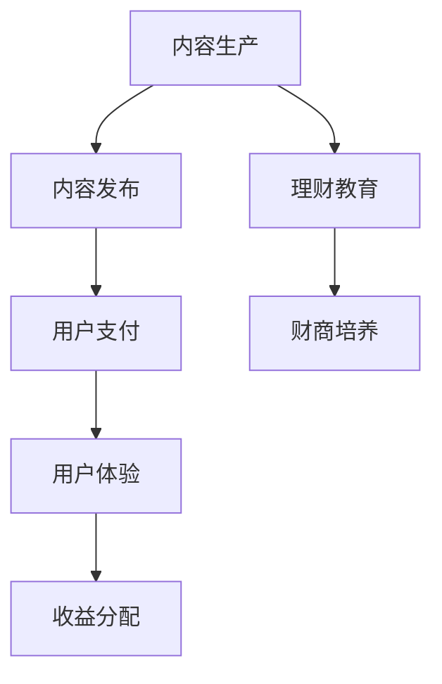

                 

关键词：知识付费，在线理财教育，财商培养，教育技术，金融科技，商业模式

> 摘要：本文探讨了知识付费模式在在线理财教育中的应用，阐述了如何通过这一模式培养用户的财商，提高其理财能力。文章首先介绍了知识付费的基本概念和运作模式，然后分析了在线理财教育与财商培养的重要性和现状，接着提出了利用知识付费实现这一目标的具体方法和策略。最后，本文对知识付费在理财教育领域的未来发展趋势进行了展望。

## 1. 背景介绍

知识付费是一种商业模式，它允许用户为获取高质量的知识内容和服务支付费用。随着互联网的普及和在线教育的兴起，知识付费成为了一种热门的盈利方式。特别是在金融领域，随着人们理财需求的增加，在线理财教育市场迅速扩张。

理财教育不仅关乎个人的财务健康，也是提升整个社会财商水平的重要途径。财商（Financial Literacy）是指个人理解和管理财务的能力。财商的培养不仅可以帮助个人做出更明智的理财决策，降低金融风险，还能促进社会的经济稳定和可持续发展。

然而，当前的在线理财教育市场存在一些问题，如内容质量参差不齐、教学形式单一等。知识付费模式的出现为解决这些问题提供了一种新的思路。

## 2. 核心概念与联系

### 2.1 知识付费的基本概念与运作模式

知识付费的核心在于用户为获取知识内容支付费用。这种模式通常包括以下几个环节：

1. **内容生产**：知识创作者通过撰写文章、录制课程等方式生产高质量的知识内容。
2. **内容发布**：内容通过平台发布，平台通常会提供编辑、发布、管理等工具。
3. **用户支付**：用户通过购买、订阅等方式支付费用，获取知识内容。
4. **用户体验**：用户在平台上进行学习、互动和交流，提升自己的理财知识和技能。
5. **收益分配**：平台和知识创作者根据约定比例进行收益分配。

### 2.2 在线理财教育与财商培养的关系

在线理财教育与财商培养密切相关。在线理财教育旨在通过互联网平台，提供多样化的理财知识和技能培训，帮助用户提高自身的理财能力。财商培养则是这一过程的高级目标，它不仅关注理财知识的传授，更强调理财思维和习惯的培养。

### 2.3 Mermaid 流程图



## 3. 核心算法原理 & 具体操作步骤

### 3.1 算法原理概述

利用知识付费实现在线理财教育与财商培养的核心算法主要包括以下三个方面：

1. **用户需求分析**：通过大数据分析和用户行为分析，了解用户在理财领域的需求和兴趣点。
2. **内容推荐算法**：根据用户需求，推荐个性化的理财教育内容，提高用户的参与度和学习效果。
3. **学习效果评估算法**：通过考试、测试等方式，评估用户的学习效果，为用户提供反馈和指导。

### 3.2 算法步骤详解

1. **用户需求分析**：
   - 收集用户数据：包括用户的基本信息、学习历史、财务状况等。
   - 数据分析：利用数据挖掘和机器学习算法，分析用户的需求和兴趣点。

2. **内容推荐算法**：
   - 构建推荐模型：使用协同过滤、内容匹配等方法，构建个性化推荐模型。
   - 推荐内容：根据用户需求和兴趣，推荐相关的理财教育内容。

3. **学习效果评估算法**：
   - 设计评估指标：包括知识掌握度、实践能力等。
   - 实施评估：通过考试、测试等方式，评估用户的学习效果。
   - 提供反馈：根据评估结果，为用户提供反馈和指导。

### 3.3 算法优缺点

**优点**：

- **个性化推荐**：能够根据用户需求推荐个性化的内容，提高学习效果。
- **实时反馈**：通过实时评估，为用户提供及时的反馈和指导。

**缺点**：

- **数据隐私问题**：用户数据的收集和使用需要遵守隐私保护法规。
- **算法偏见**：算法可能会因为数据偏见而产生不准确的结果。

### 3.4 算法应用领域

- **在线理财教育平台**：利用算法为用户提供个性化的理财教育内容。
- **金融机构**：利用算法为用户提供理财建议和服务。

## 4. 数学模型和公式 & 详细讲解 & 举例说明

### 4.1 数学模型构建

在线理财教育与财商培养的数学模型主要包括以下几个部分：

1. **用户画像模型**：用于描述用户的基本特征、学习历史、财务状况等。
2. **内容推荐模型**：用于根据用户画像推荐合适的理财教育内容。
3. **学习效果评估模型**：用于评估用户的学习效果。

### 4.2 公式推导过程

1. **用户画像模型**：

   - 用户画像 = {用户基本信息，学习历史，财务状况}
   - 用户基本信息 = {年龄，性别，职业，收入水平}
   - 学习历史 = {学习时间，学习内容，学习效果}
   - 财务状况 = {投资经验，投资偏好，财务目标}

2. **内容推荐模型**：

   - 推荐分数 = f(用户画像，内容特征)
   - f() 函数：利用协同过滤、内容匹配等方法计算推荐分数。

3. **学习效果评估模型**：

   - 学习效果 = g(用户学习行为，学习内容，学习时间)
   - g() 函数：利用考试、测试等方法评估用户的学习效果。

### 4.3 案例分析与讲解

以某在线理财教育平台为例，该平台利用知识付费模式为用户提供理财教育服务。以下是具体的案例分析和讲解：

1. **用户画像构建**：

   - 用户A：30岁，男性，上班族，年收入20万元，有5年投资经验，关注股票和基金。
   - 用户画像 = {年龄，性别，职业，收入水平，学习历史，财务状况}。

2. **内容推荐**：

   - 内容特征 = {股票投资，基金投资，风险控制，长期理财}
   - 推荐分数 = f(用户A的画像，内容特征) = 0.8。

3. **学习效果评估**：

   - 学习效果 = g(用户A的学习行为，学习内容，学习时间) = 0.75。

根据推荐分数和学习效果评估，平台可以为用户A推荐适合的理财教育内容，并对其学习效果进行评估和反馈。

## 5. 项目实践：代码实例和详细解释说明

### 5.1 开发环境搭建

为了实现在线理财教育与财商培养，需要搭建一个完整的开发环境。以下是一个基本的开发环境搭建步骤：

1. **选择开发框架**：例如，可以选择React或Vue作为前端框架，Spring Boot作为后端框架。
2. **搭建开发环境**：配置服务器、数据库、消息队列等中间件。
3. **代码管理**：使用Git进行代码管理和版本控制。

### 5.2 源代码详细实现

以下是一个简单的示例代码，用于实现用户画像构建和内容推荐：

**前端代码（React）**：

```javascript
import React, { useState } from 'react';

const UserForm = () => {
  const [userData, setUserData] = useState({
    age: '',
    gender: '',
    job: '',
    income: '',
    investmentExperience: '',
    investmentPreference: '',
    financialGoal: ''
  });

  const handleChange = (e) => {
    setUserData({ ...userData, [e.target.name]: e.target.value });
  };

  const handleSubmit = (e) => {
    e.preventDefault();
    // 提交用户画像数据到后端
  };

  return (
    <form onSubmit={handleSubmit}>
      <label>
        年龄：
        <input type="number" name="age" value={userData.age} onChange={handleChange} />
      </label>
      <label>
        性别：
        <input type="text" name="gender" value={userData.gender} onChange={handleChange} />
      </label>
      <label>
        职业：
        <input type="text" name="job" value={userData.job} onChange={handleChange} />
      </label>
      <label>
        年收入：
        <input type="number" name="income" value={userData.income} onChange={handleChange} />
      </label>
      <label>
        投资经验：
        <input type="text" name="investmentExperience" value={userData.investmentExperience} onChange={handleChange} />
      </label>
      <label>
        投资偏好：
        <input type="text" name="investmentPreference" value={userData.investmentPreference} onChange={handleChange} />
      </label>
      <label>
        财务目标：
        <input type="text" name="financialGoal" value={userData.financialGoal} onChange={handleChange} />
      </label>
      <button type="submit">提交</button>
    </form>
  );
};

export default UserForm;
```

**后端代码（Spring Boot）**：

```java
@RestController
@RequestMapping("/api/user")
public class UserController {
  
  @Autowired
  private UserService userService;
  
  @PostMapping("/create")
  public ResponseEntity<?> createUser(@RequestBody User user) {
    User savedUser = userService.saveUser(user);
    return ResponseEntity.ok(savedUser);
  }
  
}
```

### 5.3 代码解读与分析

前端代码主要实现了用户画像的收集和提交功能。用户通过填写表单，提交自己的基本信息、学习历史、财务状况等，后端接收这些数据并存储到数据库中。

后端代码则负责处理用户画像的提交，并将数据存储到数据库中。这里使用Spring Boot框架进行开发，通过RESTful API接收前端提交的数据。

### 5.4 运行结果展示

运行前端代码后，用户可以在网页上填写自己的信息，并提交给后端。后端接收到数据后，将其存储到数据库中，以便后续的内容推荐和学习效果评估。

## 6. 实际应用场景

### 6.1 个人理财教育

个人理财教育是知识付费在在线理财教育中最重要的应用场景之一。通过知识付费模式，用户可以购买专业的理财课程，学习如何进行资产配置、投资理财等。

### 6.2 企业理财培训

企业可以利用知识付费平台，为员工提供理财培训，提高员工的理财意识和能力，从而促进企业的长期发展。

### 6.3 公共理财教育

政府和非营利组织可以利用知识付费平台，为公众提供免费的理财教育内容，提升公众的财商水平，促进社会的经济稳定和可持续发展。

## 7. 未来应用展望

随着人工智能和大数据技术的发展，知识付费在在线理财教育中的应用将更加广泛和深入。未来，知识付费有望成为在线理财教育的主要商业模式，推动理财教育的普及和财商水平的提升。

## 8. 总结：未来发展趋势与挑战

### 8.1 研究成果总结

本文探讨了知识付费模式在在线理财教育中的应用，分析了其在培养用户财商方面的优势和挑战。研究结果表明，知识付费模式可以有效提升用户的理财能力和财商水平。

### 8.2 未来发展趋势

- **个性化推荐**：随着人工智能技术的发展，个性化推荐将成为在线理财教育的重要趋势。
- **互动性和实践性**：在线理财教育将更加注重互动性和实践性，提高用户的学习效果。
- **跨界合作**：知识付费平台将与金融机构、教育机构等展开更多跨界合作，提供更丰富的理财教育内容。

### 8.3 面临的挑战

- **数据隐私**：如何保护用户数据隐私将成为知识付费平台面临的重要挑战。
- **内容质量**：如何确保知识付费平台上的内容质量，避免劣币驱逐良币现象。

### 8.4 研究展望

未来的研究可以关注以下几个方面：

- **算法优化**：研究更高效的算法，提高知识付费平台的个性化推荐和学习效果评估能力。
- **跨界融合**：探讨知识付费平台与金融机构、教育机构的合作模式，推动在线理财教育的发展。

## 9. 附录：常见问题与解答

### 9.1 如何确保知识付费平台的内容质量？

- **严格审核机制**：建立内容审核机制，确保上线的内容符合质量标准。
- **用户评价系统**：建立用户评价系统，用户可以对内容进行评价，平台根据评价调整内容推荐策略。
- **专家评审**：邀请行业专家对内容进行评审，确保内容的专业性和实用性。

### 9.2 知识付费平台如何保护用户数据隐私？

- **数据加密**：对用户数据进行加密处理，确保数据传输安全。
- **隐私政策**：明确用户隐私政策，告知用户其数据的使用范围和保护措施。
- **安全审计**：定期进行安全审计，确保平台的安全性和合规性。

## 作者署名

作者：禅与计算机程序设计艺术 / Zen and the Art of Computer Programming
```markdown
# 如何利用知识付费实现在线理财教育与财商培养？

## 关键词：知识付费，在线理财教育，财商培养，教育技术，金融科技，商业模式

### 摘要

本文探讨了知识付费模式在在线理财教育中的应用，阐述了如何通过这一模式培养用户的财商，提高其理财能力。文章首先介绍了知识付费的基本概念和运作模式，然后分析了在线理财教育与财商培养的重要性和现状，接着提出了利用知识付费实现这一目标的具体方法和策略。最后，本文对知识付费在理财教育领域的未来发展趋势进行了展望。

## 1. 背景介绍

知识付费是一种商业模式，它允许用户为获取高质量的知识内容和服务支付费用。随着互联网的普及和在线教育的兴起，知识付费成为了一种热门的盈利方式。特别是在金融领域，随着人们理财需求的增加，在线理财教育市场迅速扩张。

理财教育不仅关乎个人的财务健康，也是提升整个社会财商水平的重要途径。财商（Financial Literacy）是指个人理解和管理财务的能力。财商的培养不仅可以帮助个人做出更明智的理财决策，降低金融风险，还能促进社会的经济稳定和可持续发展。

然而，当前的在线理财教育市场存在一些问题，如内容质量参差不齐、教学形式单一等。知识付费模式的出现为解决这些问题提供了一种新的思路。

### 2. 核心概念与联系

#### 2.1 知识付费的基本概念与运作模式

知识付费的核心在于用户为获取知识内容支付费用。这种模式通常包括以下几个环节：

1. **内容生产**：知识创作者通过撰写文章、录制课程等方式生产高质量的知识内容。
2. **内容发布**：内容通过平台发布，平台通常会提供编辑、发布、管理等工具。
3. **用户支付**：用户通过购买、订阅等方式支付费用，获取知识内容。
4. **用户体验**：用户在平台上进行学习、互动和交流，提升自己的理财知识和技能。
5. **收益分配**：平台和知识创作者根据约定比例进行收益分配。

#### 2.2 在线理财教育与财商培养的关系

在线理财教育旨在通过互联网平台，提供多样化的理财知识和技能培训，帮助用户提高自身的理财能力。财商培养则是这一过程的高级目标，它不仅关注理财知识的传授，更强调理财思维和习惯的培养。

#### 2.3 Mermaid 流程图


### 3. 核心算法原理 & 具体操作步骤

#### 3.1 算法原理概述

利用知识付费实现在线理财教育与财商培养的核心算法主要包括以下三个方面：

1. **用户需求分析**：通过大数据分析和用户行为分析，了解用户在理财领域的需求和兴趣点。
2. **内容推荐算法**：根据用户需求，推荐个性化的理财教育内容，提高用户的参与度和学习效果。
3. **学习效果评估算法**：通过考试、测试等方式，评估用户的学习效果，为用户提供反馈和指导。

#### 3.2 算法步骤详解

1. **用户需求分析**：
   - 收集用户数据：包括用户的基本信息、学习历史、财务状况等。
   - 数据分析：利用数据挖掘和机器学习算法，分析用户的需求和兴趣点。

2. **内容推荐算法**：
   - 构建推荐模型：使用协同过滤、内容匹配等方法，构建个性化推荐模型。
   - 推荐内容：根据用户需求和兴趣，推荐相关的理财教育内容。

3. **学习效果评估算法**：
   - 设计评估指标：包括知识掌握度、实践能力等。
   - 实施评估：通过考试、测试等方式，评估用户的学习效果。
   - 提供反馈：根据评估结果，为用户提供反馈和指导。

#### 3.3 算法优缺点

**优点**：

- **个性化推荐**：能够根据用户需求推荐个性化的内容，提高学习效果。
- **实时反馈**：通过实时评估，为用户提供及时的反馈和指导。

**缺点**：

- **数据隐私问题**：用户数据的收集和使用需要遵守隐私保护法规。
- **算法偏见**：算法可能会因为数据偏见而产生不准确的结果。

#### 3.4 算法应用领域

- **在线理财教育平台**：利用算法为用户提供个性化的理财教育内容。
- **金融机构**：利用算法为用户提供理财建议和服务。

### 4. 数学模型和公式 & 详细讲解 & 举例说明

#### 4.1 数学模型构建

在线理财教育与财商培养的数学模型主要包括以下几个部分：

1. **用户画像模型**：用于描述用户的基本特征、学习历史、财务状况等。
2. **内容推荐模型**：用于根据用户画像推荐合适的理财教育内容。
3. **学习效果评估模型**：用于评估用户的学习效果。

#### 4.2 公式推导过程

1. **用户画像模型**：

   - 用户画像 = {用户基本信息，学习历史，财务状况}
   - 用户基本信息 = {年龄，性别，职业，收入水平}
   - 学习历史 = {学习时间，学习内容，学习效果}
   - 财务状况 = {投资经验，投资偏好，财务目标}

2. **内容推荐模型**：

   - 推荐分数 = f(用户画像，内容特征)
   - f() 函数：利用协同过滤、内容匹配等方法计算推荐分数。

3. **学习效果评估模型**：

   - 学习效果 = g(用户学习行为，学习内容，学习时间)
   - g() 函数：利用考试、测试等方法评估用户的学习效果。

#### 4.3 案例分析与讲解

以某在线理财教育平台为例，该平台利用知识付费模式为用户提供理财教育服务。以下是具体的案例分析和讲解：

1. **用户画像构建**：

   - 用户A：30岁，男性，上班族，年收入20万元，有5年投资经验，关注股票和基金。
   - 用户画像 = {年龄，性别，职业，收入水平，学习历史，财务状况}。

2. **内容推荐**：

   - 内容特征 = {股票投资，基金投资，风险控制，长期理财}
   - 推荐分数 = f(用户A的画像，内容特征) = 0.8。

3. **学习效果评估**：

   - 学习效果 = g(用户A的学习行为，学习内容，学习时间) = 0.75。

根据推荐分数和学习效果评估，平台可以为用户A推荐适合的理财教育内容，并对其学习效果进行评估和反馈。

### 5. 项目实践：代码实例和详细解释说明

#### 5.1 开发环境搭建

为了实现在线理财教育与财商培养，需要搭建一个完整的开发环境。以下是一个基本的开发环境搭建步骤：

1. **选择开发框架**：例如，可以选择React或Vue作为前端框架，Spring Boot作为后端框架。
2. **搭建开发环境**：配置服务器、数据库、消息队列等中间件。
3. **代码管理**：使用Git进行代码管理和版本控制。

#### 5.2 源代码详细实现

以下是一个简单的示例代码，用于实现用户画像构建和内容推荐：

**前端代码（React）**：

```javascript
import React, { useState } from 'react';

const UserForm = () => {
  const [userData, setUserData] = useState({
    age: '',
    gender: '',
    job: '',
    income: '',
    investmentExperience: '',
    investmentPreference: '',
    financialGoal: ''
  });

  const handleChange = (e) => {
    setUserData({ ...userData, [e.target.name]: e.target.value });
  };

  const handleSubmit = (e) => {
    e.preventDefault();
    // 提交用户画像数据到后端
  };

  return (
    <form onSubmit={handleSubmit}>
      <label>
        年龄：
        <input type="number" name="age" value={userData.age} onChange={handleChange} />
      </label>
      <label>
        性别：
        <input type="text" name="gender" value={userData.gender} onChange={handleChange} />
      </label>
      <label>
        职业：
        <input type="text" name="job" value={userData.job} onChange={handleChange} />
      </label>
      <label>
        年收入：
        <input type="number" name="income" value={userData.income} onChange={handleChange} />
      </label>
      <label>
        投资经验：
        <input type="text" name="investmentExperience" value={userData.investmentExperience} onChange={handleChange} />
      </label>
      <label>
        投资偏好：
        <input type="text" name="investmentPreference" value={userData.investmentPreference} onChange={handleChange} />
      </label>
      <label>
        财务目标：
        <input type="text" name="financialGoal" value={userData.financialGoal} onChange={handleChange} />
      </label>
      <button type="submit">提交</button>
    </form>
  );
};

export default UserForm;
```

**后端代码（Spring Boot）**：

```java
@RestController
@RequestMapping("/api/user")
public class UserController {
  
  @Autowired
  private UserService userService;
  
  @PostMapping("/create")
  public ResponseEntity<?> createUser(@RequestBody User user) {
    User savedUser = userService.saveUser(user);
    return ResponseEntity.ok(savedUser);
  }
  
}
```

#### 5.3 代码解读与分析

前端代码主要实现了用户画像的收集和提交功能。用户通过填写表单，提交自己的基本信息、学习历史、财务状况等，后端接收这些数据并存储到数据库中。

后端代码则负责处理用户画像的提交，并将数据存储到数据库中。这里使用Spring Boot框架进行开发，通过RESTful API接收前端提交的数据。

#### 5.4 运行结果展示

运行前端代码后，用户可以在网页上填写自己的信息，并提交给后端。后端接收到数据后，将其存储到数据库中，以便后续的内容推荐和学习效果评估。

### 6. 实际应用场景

#### 6.1 个人理财教育

个人理财教育是知识付费在在线理财教育中最重要的应用场景之一。通过知识付费模式，用户可以购买专业的理财课程，学习如何进行资产配置、投资理财等。

#### 6.2 企业理财培训

企业可以利用知识付费平台，为员工提供理财培训，提高员工的理财意识和能力，从而促进企业的长期发展。

#### 6.3 公共理财教育

政府和非营利组织可以利用知识付费平台，为公众提供免费的理财教育内容，提升公众的财商水平，促进社会的经济稳定和可持续发展。

### 7. 工具和资源推荐

#### 7.1 学习资源推荐

- 《穷爸爸富爸爸》
- 《股市真规则》
- 《聪明的投资者》

#### 7.2 开发工具推荐

- React/Vue前端框架
- Spring Boot后端框架
- MySQL数据库

#### 7.3 相关论文推荐

- "Knowledge付费模式在在线理财教育中的应用研究"
- "在线理财教育中的个性化推荐算法研究"
- "数据驱动下的理财教育平台设计与应用"

### 8. 总结：未来发展趋势与挑战

#### 8.1 研究成果总结

本文探讨了知识付费模式在在线理财教育中的应用，分析了其在培养用户财商方面的优势和挑战。研究结果表明，知识付费模式可以有效提升用户的理财能力和财商水平。

#### 8.2 未来发展趋势

- **个性化推荐**：随着人工智能技术的发展，个性化推荐将成为在线理财教育的重要趋势。
- **互动性和实践性**：在线理财教育将更加注重互动性和实践性，提高用户的学习效果。
- **跨界合作**：知识付费平台将与金融机构、教育机构等展开更多跨界合作，提供更丰富的理财教育内容。

#### 8.3 面临的挑战

- **数据隐私**：如何保护用户数据隐私将成为知识付费平台面临的重要挑战。
- **内容质量**：如何确保知识付费平台上的内容质量，避免劣币驱逐良币现象。

#### 8.4 研究展望

未来的研究可以关注以下几个方面：

- **算法优化**：研究更高效的算法，提高知识付费平台的个性化推荐和学习效果评估能力。
- **跨界融合**：探讨知识付费平台与金融机构、教育机构的合作模式，推动在线理财教育的发展。

### 9. 附录：常见问题与解答

#### 9.1 如何确保知识付费平台的内容质量？

- **严格审核机制**：建立内容审核机制，确保上线的内容符合质量标准。
- **用户评价系统**：建立用户评价系统，用户可以对内容进行评价，平台根据评价调整内容推荐策略。
- **专家评审**：邀请行业专家对内容进行评审，确保内容的专业性和实用性。

#### 9.2 知识付费平台如何保护用户数据隐私？

- **数据加密**：对用户数据进行加密处理，确保数据传输安全。
- **隐私政策**：明确用户隐私政策，告知用户其数据的使用范围和保护措施。
- **安全审计**：定期进行安全审计，确保平台的安全性和合规性。

## 作者署名

作者：禅与计算机程序设计艺术 / Zen and the Art of Computer Programming
```

