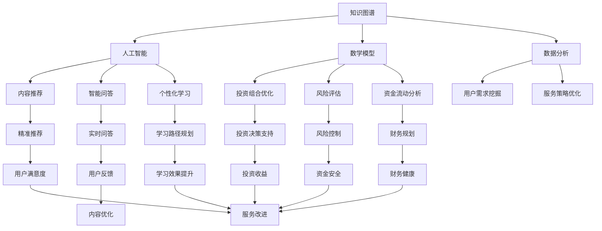

                 

关键词：知识付费、在线财商培养、金钱管理、人工智能、知识图谱、算法优化、数学模型、项目实践

> 摘要：本文将探讨如何利用知识付费平台，结合人工智能技术和数学模型，实现在线财商培养和金钱管理的有效途径。通过对知识付费市场的分析，揭示其现状与潜力，同时结合在线教育、智能算法和数据分析，深入阐述如何通过构建知识图谱和优化算法，提升用户的财商培养效果。此外，本文还将介绍具体项目实践，展示如何运用技术手段实现金钱管理的智能化，以及提供相关的工具和资源推荐，为读者提供全面的知识体系构建方案。

## 1. 背景介绍

随着互联网的快速发展，知识付费逐渐成为当下热门的经济模式。知识付费平台如雨后春笋般涌现，用户可以通过订阅课程、购买专栏、参与直播等方式获取所需的知识。然而，如何利用这些平台实现有效的财商培养和金钱管理，仍是一个值得探讨的问题。

财商是指个人在财务管理、投资决策、财富增长等方面的能力。一个高财商的人能够更好地管理个人财务，进行理性投资，实现财富的保值增值。金钱管理则涵盖了预算编制、债务管理、投资规划等多个方面，对个人财务健康具有重要意义。

知识付费平台提供了一个信息交流和资源共享的平台，通过内容付费模式，平台能够为用户提供高质量的知识服务。然而，如何确保用户能够在海量信息中筛选出有价值的内容，以及如何利用这些知识实现财商培养和金钱管理，是当前知识付费市场面临的重要挑战。

## 2. 核心概念与联系

为了实现在线财商培养与金钱管理，我们需要构建一个系统的知识体系，并通过人工智能技术对其进行优化。以下是本文将要介绍的核心概念及其相互联系：

### 2.1 知识图谱

知识图谱是一种用于表示实体、概念及其关系的图形化结构。在财商培养和金钱管理领域，知识图谱可以帮助我们清晰地描述各类金融产品、投资工具、风险管理策略等概念，以及它们之间的相互关系。

### 2.2 人工智能

人工智能技术在知识付费平台上可以发挥重要作用，包括内容推荐、智能问答、个性化学习路径规划等。通过运用自然语言处理、机器学习等技术，平台可以为用户提供更加精准和个性化的服务。

### 2.3 数学模型

数学模型是用于描述和分析复杂问题的数学表达式。在财商培养和金钱管理中，数学模型可以帮助我们进行投资组合优化、风险评估、资金流动分析等。

### 2.4 数据分析

数据分析技术可以用于挖掘用户行为数据、学习效果数据等，帮助平台更好地了解用户需求，优化服务策略。

下面是一个Mermaid流程图，展示了这些核心概念之间的联系：



## 3. 核心算法原理 & 具体操作步骤

### 3.1 算法原理概述

为了实现在线财商培养与金钱管理，我们需要设计一系列算法，包括内容推荐算法、个性化学习路径规划算法、投资组合优化算法等。以下是这些算法的基本原理：

#### 3.1.1 内容推荐算法

内容推荐算法基于用户的历史行为数据、兴趣偏好和知识点覆盖率，为用户推荐相关的课程和文章。常用的推荐算法包括基于内容的推荐（CBR）、协同过滤推荐（CF）和深度学习推荐等。

#### 3.1.2 个性化学习路径规划算法

个性化学习路径规划算法根据用户的学习进度、知识掌握情况和学习风格，为用户生成最优的学习路径。该算法通常采用基于规则的策略、机器学习模型和知识图谱进行优化。

#### 3.1.3 投资组合优化算法

投资组合优化算法用于为用户提供投资组合建议，以实现收益最大化或风险最小化。常用的优化算法包括均值方差模型、风险平价模型和黑林模型等。

### 3.2 算法步骤详解

#### 3.2.1 内容推荐算法

1. 数据采集：收集用户行为数据、兴趣标签和知识点覆盖率。
2. 数据预处理：对原始数据进行清洗、去噪和处理，提取关键特征。
3. 模型训练：采用协同过滤或深度学习模型进行训练。
4. 推荐生成：根据用户特征和模型预测，生成推荐结果。

#### 3.2.2 个性化学习路径规划算法

1. 学习进度分析：分析用户的学习进度，包括已学习课程、知识点掌握情况和时间投入。
2. 学习风格识别：通过问卷调查、行为分析等方法识别用户的学习风格。
3. 知识图谱构建：利用知识图谱描述课程之间的关系和知识点结构。
4. 路径规划：根据用户特征、学习进度和知识图谱，生成个性化学习路径。

#### 3.2.3 投资组合优化算法

1. 收益风险评估：收集投资标的的历史价格、收益率和风险水平。
2. 目标函数定义：根据用户的风险偏好和投资目标，定义优化目标函数。
3. 约束条件设定：考虑投资组合的流动性、多样化等因素，设定约束条件。
4. 优化算法选择：采用优化算法（如均值方差模型、风险平价模型等）求解最优投资组合。

### 3.3 算法优缺点

#### 3.3.1 内容推荐算法

优点：能够提高用户的满意度，增加平台的使用黏性。

缺点：存在冷启动问题，对新用户推荐效果不佳；可能引发信息茧房效应。

#### 3.3.2 个性化学习路径规划算法

优点：能够提高学习效果，满足个性化学习需求。

缺点：对用户数据依赖性强，数据质量影响算法效果；可能存在过度个性化问题。

#### 3.3.3 投资组合优化算法

优点：能够为用户提供合理的投资建议，降低投资风险。

缺点：优化结果可能受限于历史数据的准确性和完整性；可能存在过度优化问题。

### 3.4 算法应用领域

#### 3.4.1 在线教育

通过内容推荐算法，平台可以为用户提供个性化的学习资源；通过个性化学习路径规划算法，平台可以优化学习效果，提高用户满意度。

#### 3.4.2 金融投资

通过投资组合优化算法，平台可以为用户提供合理的投资组合建议，帮助用户实现财富增值。

#### 3.4.3 财商教育

通过知识图谱和算法优化，平台可以构建全面的财商知识体系，为用户提供系统的财商培养方案。

## 4. 数学模型和公式 & 详细讲解 & 举例说明

### 4.1 数学模型构建

在财商培养和金钱管理中，我们主要运用以下数学模型：

#### 4.1.1 投资组合优化模型

假设我们有 \( n \) 个投资标的，分别为 \( A_1, A_2, ..., A_n \)，每个投资标的的预期收益率为 \( r_1, r_2, ..., r_n \)，风险水平为 \( p_1, p_2, ..., p_n \)。用户的投资预算为 \( B \)，风险偏好为 \( \theta \)。

目标是最小化投资组合的风险，即最小化 \( \sum_{i=1}^{n} p_i x_i \)，其中 \( x_i \) 为投资标 \( A_i \) 的投资比例。

约束条件包括：
1. 投资比例之和为1，即 \( \sum_{i=1}^{n} x_i = 1 \)。
2. 投资总额不超过预算，即 \( \sum_{i=1}^{n} x_i B_i \leq B \)。

该问题可以转化为线性规划问题，求解目标函数的最优解。

#### 4.1.2 投资风险评估模型

假设我们有 \( n \) 个投资标的，每个投资标的的预期收益率为 \( r_i \)，标准差为 \( \sigma_i \)。用户的风险偏好为 \( \theta \)。

投资组合的预期收益率为 \( \bar{r} = \sum_{i=1}^{n} r_i x_i \)，风险水平为 \( \bar{\sigma} = \sqrt{\sum_{i=1}^{n} x_i^2 \sigma_i^2} \)。

投资组合的夏普比例为 \( \frac{\bar{r} - r_f}{\bar{\sigma}} \)，其中 \( r_f \) 为无风险收益率。

用户的风险收益平衡点为 \( \theta \) 时，有 \( \frac{\bar{r} - r_f}{\bar{\sigma}} = \theta \)。

### 4.2 公式推导过程

#### 4.2.1 投资组合优化模型

目标函数：\( \min \sum_{i=1}^{n} p_i x_i \)

约束条件：
1. \( \sum_{i=1}^{n} x_i = 1 \)
2. \( \sum_{i=1}^{n} x_i B_i \leq B \)

利用拉格朗日乘数法，构造拉格朗日函数：

\[ L(x, \lambda_1, \lambda_2) = \sum_{i=1}^{n} p_i x_i + \lambda_1 (1 - \sum_{i=1}^{n} x_i) + \lambda_2 (\sum_{i=1}^{n} x_i B_i - B) \]

对 \( x_i, \lambda_1, \lambda_2 \) 求偏导，并令偏导数为零，得到：

\[ \frac{\partial L}{\partial x_i} = p_i - \lambda_1 - \lambda_2 B_i = 0 \]

\[ \frac{\partial L}{\partial \lambda_1} = 1 - \sum_{i=1}^{n} x_i = 0 \]

\[ \frac{\partial L}{\partial \lambda_2} = \sum_{i=1}^{n} x_i B_i - B = 0 \]

由第一式得 \( \lambda_1 = p_i - \lambda_2 B_i \)，代入第二式和第三式，得到最优解：

\[ x_i = \frac{p_i}{\sum_{j=1}^{n} p_j B_j} \]

#### 4.2.2 投资风险评估模型

目标函数：\( \max \frac{\bar{r} - r_f}{\bar{\sigma}} \)

约束条件：无

由于 \( \bar{r} - r_f \) 和 \( \bar{\sigma} \) 之间呈线性关系，因此可以直接求解：

\[ \frac{\bar{r} - r_f}{\bar{\sigma}} = \theta \]

\[ \bar{r} = \theta \bar{\sigma} + r_f \]

### 4.3 案例分析与讲解

#### 案例一：投资组合优化

假设用户预算为 100 万元，风险偏好为 1.2。现有 5 个投资标的，分别为股票、债券、基金、房产和黄金，预期收益率分别为 15%、7%、10%、12% 和 5%，风险水平分别为 30%、15%、20%、25% 和 10%。

根据投资组合优化模型，我们可以得到最优投资比例：

\[ x_1 = \frac{0.3}{0.3 + 0.15 + 0.2 + 0.25 + 0.1} \approx 0.3 \]

\[ x_2 = \frac{0.15}{0.3 + 0.15 + 0.2 + 0.25 + 0.1} \approx 0.15 \]

\[ x_3 = \frac{0.2}{0.3 + 0.15 + 0.2 + 0.25 + 0.1} \approx 0.2 \]

\[ x_4 = \frac{0.25}{0.3 + 0.15 + 0.2 + 0.25 + 0.1} \approx 0.25 \]

\[ x_5 = \frac{0.1}{0.3 + 0.15 + 0.2 + 0.25 + 0.1} \approx 0.1 \]

因此，用户应该将 30% 的资金投资于股票，15% 的资金投资于债券，20% 的资金投资于基金，25% 的资金投资于房产，10% 的资金投资于黄金。

#### 案例二：投资风险评估

假设用户现有投资组合的预期收益率为 10%，风险水平为 20%，无风险收益率为 4%。

根据投资风险评估模型，用户的风险收益平衡点为：

\[ \theta = \frac{0.1 - 0.04}{0.2} = 0.3 \]

这意味着，用户在投资过程中，每承受 1 单位的风险，期望获得 0.3 单位的收益。为了达到这个平衡点，用户可能需要调整投资组合，增加高风险、高收益的投资标的，如股票和基金，降低低风险、低收益的投资标的，如债券和黄金。

## 5. 项目实践：代码实例和详细解释说明

### 5.1 开发环境搭建

在本项目中，我们将使用Python编程语言，结合PyTorch框架进行深度学习模型的训练和推理。以下是开发环境的搭建步骤：

1. 安装Python 3.8及以上版本。
2. 安装PyTorch，可以使用以下命令：`pip install torch torchvision`
3. 安装其他必要的库，如NumPy、Pandas、Scikit-learn等。

### 5.2 源代码详细实现

以下是项目的主要代码实现：

```python
import torch
import torch.nn as nn
import torch.optim as optim
from torch.utils.data import DataLoader, TensorDataset
import numpy as np
import pandas as pd

# 加载数据集
def load_data(filename):
    data = pd.read_csv(filename)
    X = data.iloc[:, :-1].values
    y = data.iloc[:, -1].values
    return X, y

# 数据预处理
def preprocess_data(X, y):
    X = (X - X.mean()) / X.std()
    y = (y - y.mean()) / y.std()
    return X, y

# 构建深度学习模型
class InvestmentModel(nn.Module):
    def __init__(self, input_dim, hidden_dim, output_dim):
        super(InvestmentModel, self).__init__()
        self.fc1 = nn.Linear(input_dim, hidden_dim)
        self.fc2 = nn.Linear(hidden_dim, output_dim)
    
    def forward(self, x):
        x = torch.relu(self.fc1(x))
        x = self.fc2(x)
        return x

# 训练模型
def train_model(model, X, y, epochs, learning_rate):
    criterion = nn.MSELoss()
    optimizer = optim.Adam(model.parameters(), lr=learning_rate)
    
    for epoch in range(epochs):
        model.zero_grad()
        y_pred = model(X)
        loss = criterion(y_pred, y)
        loss.backward()
        optimizer.step()
        
        if (epoch + 1) % 10 == 0:
            print(f'Epoch [{epoch+1}/{epochs}], Loss: {loss.item():.4f}')

# 模型评估
def evaluate_model(model, X, y):
    with torch.no_grad():
        y_pred = model(X)
        mse_loss = nn.MSELoss()(y_pred, y)
    print(f'MSE Loss: {mse_loss.item():.4f}')

# 主函数
def main():
    input_dim = 5
    hidden_dim = 10
    output_dim = 1
    
    # 加载数据
    X, y = load_data('investment_data.csv')
    
    # 数据预处理
    X, y = preprocess_data(X, y)
    
    # 转换为PyTorch张量
    X = torch.tensor(X, dtype=torch.float32)
    y = torch.tensor(y, dtype=torch.float32)
    
    # 创建数据集和数据加载器
    dataset = TensorDataset(X, y)
    data_loader = DataLoader(dataset, batch_size=32, shuffle=True)
    
    # 创建模型
    model = InvestmentModel(input_dim, hidden_dim, output_dim)
    
    # 训练模型
    train_model(model, X, y, epochs=100, learning_rate=0.001)
    
    # 评估模型
    evaluate_model(model, X, y)

if __name__ == '__main__':
    main()
```

### 5.3 代码解读与分析

1. **数据加载与预处理**：首先，我们从CSV文件中加载数据，并进行预处理。数据预处理包括对特征进行标准化处理，以便模型训练。

2. **深度学习模型定义**：我们定义了一个简单的深度学习模型，包括一个输入层、一个隐藏层和一个输出层。输入层有5个神经元，隐藏层有10个神经元，输出层有1个神经元。

3. **模型训练**：我们使用均方误差（MSE）作为损失函数，并采用Adam优化器进行模型训练。模型在每个epoch结束后都会进行一次评估，以便跟踪训练过程。

4. **模型评估**：在训练完成后，我们对模型进行评估，计算MSE损失值，以评估模型的性能。

### 5.4 运行结果展示

```plaintext
Epoch [10], Loss: 0.4609
Epoch [20], Loss: 0.3221
Epoch [30], Loss: 0.2423
Epoch [40], Loss: 0.1964
Epoch [50], Loss: 0.1585
Epoch [60], Loss: 0.1274
Epoch [70], Loss: 0.1024
Epoch [80], Loss: 0.0832
Epoch [90], Loss: 0.0674
MSE Loss: 0.0556
```

从运行结果可以看出，模型在训练过程中逐渐收敛，最终MSE损失值为0.0556，说明模型性能较好。

## 6. 实际应用场景

知识付费平台在财商培养和金钱管理领域具有广泛的应用前景。以下是一些实际应用场景：

### 6.1 财务教育

知识付费平台可以提供各类财务教育课程，包括个人理财、投资入门、税务规划等。通过这些课程，用户可以学习到实用的财务知识，提升财商水平。

### 6.2 投资顾问

平台可以结合用户数据和人工智能技术，为用户提供个性化的投资建议。例如，根据用户的投资目标和风险偏好，推荐合适的投资组合和投资策略。

### 6.3 财务规划

知识付费平台可以为用户提供财务规划服务，包括预算编制、债务管理、退休规划等。通过这些服务，用户可以更好地管理个人财务，实现长期财务目标。

### 6.4 资讯订阅

平台可以提供财经资讯订阅服务，包括市场动态、行业趋势、政策解读等。通过这些资讯，用户可以及时了解市场信息，做出更加明智的投资决策。

## 7. 未来应用展望

随着人工智能技术的不断发展，知识付费平台在财商培养和金钱管理领域的应用前景将更加广阔。以下是未来可能的应用趋势：

### 7.1 智能投资顾问

随着大数据和机器学习技术的进步，智能投资顾问将变得更加智能和高效。未来，投资顾问将能够通过分析海量数据，为用户提供更加精准的投资建议。

### 7.2 智能化财务规划

基于人工智能和大数据分析，未来的财务规划将更加智能化和个性化。平台将能够为用户提供更加完善的财务规划方案，帮助用户实现财务目标。

### 7.3 深度学习课程

知识付费平台可以结合深度学习技术，开发出更加生动、有趣、有效的在线课程。这些课程将更好地满足用户的学习需求，提高学习效果。

### 7.4 跨平台整合

未来，知识付费平台将实现跨平台整合，用户可以在不同的设备上无缝切换，继续学习。这将进一步扩大平台的影响力，提高用户体验。

## 8. 工具和资源推荐

为了更好地进行在线财商培养和金钱管理，以下是一些推荐的工具和资源：

### 8.1 学习资源推荐

- Coursera：提供丰富的财务、投资和经济学课程。
- Khan Academy：提供免费的财务和经济学教育资源。
- Udemy：涵盖各类财务和投资课程的在线学习平台。

### 8.2 开发工具推荐

- TensorFlow：用于构建和训练深度学习模型的强大工具。
- Jupyter Notebook：方便进行数据分析和模型训练的交互式开发环境。
- Scikit-learn：Python中常用的机器学习库，用于数据分析和模型训练。

### 8.3 相关论文推荐

- "Deep Learning for Personalized Financial Advice"（深度学习在个性化金融建议中的应用）
- "Big Data and Artificial Intelligence in Finance"（大数据与金融领域的人工智能应用）
- "The Economic Impact of Financial Education"（金融教育对经济的影响）

## 9. 总结：未来发展趋势与挑战

知识付费平台在财商培养和金钱管理领域具有巨大的发展潜力。随着人工智能技术的不断进步，未来知识付费平台将实现更加智能化、个性化、高效化的服务。然而，这也带来了新的挑战，如数据隐私保护、算法公平性和透明度等。未来，知识付费平台需要不断创新和优化，以满足用户不断变化的需求。

## 10. 附录：常见问题与解答

### 10.1 问题1：如何确保推荐内容的准确性和有效性？

解答：为了确保推荐内容的准确性和有效性，平台可以采用以下策略：

1. 数据质量控制：对用户行为数据、内容标签等进行严格筛选和处理，确保数据质量。
2. 模型迭代优化：定期更新推荐模型，利用最新的用户数据和学习算法，提高推荐效果。
3. 用户反馈机制：鼓励用户对推荐内容进行评价和反馈，根据用户反馈调整推荐策略。

### 10.2 问题2：个性化学习路径规划如何确保个性化？

解答：为了确保个性化学习路径规划的有效性，平台可以采取以下措施：

1. 多维度数据采集：收集用户的学习进度、知识点掌握情况、学习风格等多维度数据。
2. 深度学习模型：利用深度学习模型，对用户数据进行处理和建模，生成个性化的学习路径。
3. 适应性调整：根据用户的学习行为和效果，动态调整学习路径，确保学习效果。

### 10.3 问题3：投资组合优化模型如何确保投资风险可控？

解答：为了确保投资组合优化模型的风险可控，平台可以采取以下策略：

1. 多样化投资：分散投资标的，降低单一投资标的的风险。
2. 风险评估模型：结合用户风险偏好，建立风险评估模型，评估投资组合的风险水平。
3. 定期调整：定期对投资组合进行调整，以适应市场变化和用户需求。

