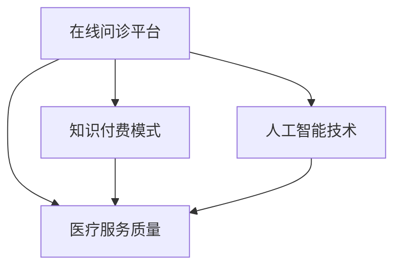

                 

关键词：知识付费、在线问诊、医疗服务、人工智能、技术架构

摘要：本文将探讨如何通过知识付费的模式，结合人工智能技术和医疗服务的需求，实现在线问诊与医疗服务的新模式。文章将介绍核心概念、算法原理、数学模型、项目实践以及未来展望，为从事医疗健康领域的从业者提供有价值的参考。

## 1. 背景介绍

随着互联网技术的快速发展，医疗行业正迎来前所未有的变革。传统医疗服务在时间、空间、资源等方面存在一定的限制，而在线问诊则成为解决这些瓶颈的重要手段。通过在线问诊，患者可以随时随地获取专业的医疗服务，医生则可以扩大服务范围，提高工作效率。然而，在线问诊的普及也带来了新的挑战，如医疗质量保障、患者隐私保护等。

知识付费作为一种新兴商业模式，正在多个领域崭露头角。在医疗领域，知识付费可以为医生和患者提供高质量的医疗服务，实现资源的优化配置。本文将探讨如何利用知识付费模式，结合人工智能技术，构建一个高效、可靠的在线问诊与医疗服务体系。

### 1.1 知识付费的定义和特点

知识付费是指用户为了获取知识、技能或服务，愿意付费的一种商业模式。其特点包括：

- **价值驱动**：用户付费的主要原因是看到了知识、技能或服务的实际价值。
- **个性化**：知识付费平台可以根据用户需求，提供定制化的内容和服务。
- **高品质**：知识付费往往要求提供方具备专业背景和丰富经验，确保内容质量。

### 1.2 在线问诊的现状与挑战

在线问诊作为一种新兴医疗服务模式，已经在全球范围内得到广泛应用。然而，其发展仍面临诸多挑战：

- **医疗质量保障**：在线问诊的医疗质量无法与传统医院相比，如何确保患者得到准确、可靠的医疗服务是关键问题。
- **患者隐私保护**：在线问诊涉及到患者隐私信息，如何保障这些信息的安全，避免泄露是另一大挑战。
- **医疗资源分配**：在线问诊如何合理分配医疗资源，提高医生工作效率，同时满足患者需求是亟需解决的问题。

### 1.3 人工智能在医疗领域的应用

人工智能（AI）技术的发展为医疗领域带来了前所未有的机遇。AI在医疗领域的应用包括：

- **疾病诊断**：通过深度学习等技术，AI可以辅助医生进行疾病诊断，提高诊断准确率。
- **精准医疗**：基于患者个体差异，AI可以为患者制定个性化的治疗方案。
- **医学研究**：AI可以帮助研究人员分析海量医疗数据，发现新的医学规律。

## 2. 核心概念与联系

### 2.1 核心概念

为了构建一个高效的在线问诊与医疗服务体系，需要明确以下几个核心概念：

- **在线问诊平台**：提供在线咨询、诊断、治疗等医疗服务的技术平台。
- **知识付费模式**：用户通过付费获取专业医疗服务的一种商业模式。
- **人工智能技术**：包括深度学习、自然语言处理、图像识别等技术，用于辅助医生诊断、治疗和科研。
- **医疗服务质量**：评估医疗服务是否达到患者预期，包括诊断准确率、治疗有效率等。

### 2.2 联系与架构

以下是核心概念之间的联系及其在系统架构中的体现：

1. **在线问诊平台**：作为整个系统的核心，为医生和患者提供交互界面，实现在线咨询、诊断、治疗等医疗服务。
2. **知识付费模式**：在线问诊平台通过知识付费模式，为医生提供收入来源，同时为患者提供高质量、个性化的医疗服务。
3. **人工智能技术**：在线问诊平台利用人工智能技术，提高医疗服务质量，包括疾病诊断、治疗建议、医学研究等。
4. **医疗服务质量**：在线问诊平台通过不断优化算法、提升服务质量，确保患者得到准确、可靠的医疗服务。

以下是核心概念原理和架构的 Mermaid 流程图：



## 3. 核心算法原理 & 具体操作步骤

### 3.1 算法原理概述

在线问诊与医疗服务体系的核心在于如何利用人工智能技术提高医疗服务质量。本文主要介绍以下核心算法：

- **深度学习算法**：用于疾病诊断，通过分析患者的症状、病史等信息，提供诊断建议。
- **自然语言处理算法**：用于患者咨询，实现患者与医生之间的自然语言交互。
- **图像识别算法**：用于医学影像诊断，分析患者的影像数据，辅助医生进行诊断。

### 3.2 算法步骤详解

#### 3.2.1 深度学习算法

1. **数据收集**：收集大量患者症状、病史、医学影像等数据。
2. **数据预处理**：对数据进行清洗、归一化等处理。
3. **模型训练**：使用深度学习框架，如TensorFlow或PyTorch，构建神经网络模型，训练模型。
4. **模型评估**：使用测试数据集评估模型性能，调整模型参数。
5. **模型部署**：将训练好的模型部署到在线问诊平台，为医生提供诊断建议。

#### 3.2.2 自然语言处理算法

1. **数据收集**：收集大量患者咨询、医生回复等文本数据。
2. **数据预处理**：对数据进行分词、去噪等处理。
3. **模型训练**：使用自然语言处理框架，如NLTK或spaCy，构建文本分类、语义分析等模型，训练模型。
4. **模型评估**：使用测试数据集评估模型性能，调整模型参数。
5. **模型部署**：将训练好的模型部署到在线问诊平台，实现患者与医生之间的自然语言交互。

#### 3.2.3 图像识别算法

1. **数据收集**：收集大量医学影像数据。
2. **数据预处理**：对数据进行分割、增强等处理。
3. **模型训练**：使用深度学习框架，如TensorFlow或PyTorch，构建卷积神经网络（CNN）模型，训练模型。
4. **模型评估**：使用测试数据集评估模型性能，调整模型参数。
5. **模型部署**：将训练好的模型部署到在线问诊平台，实现医学影像的自动诊断。

### 3.3 算法优缺点

#### 深度学习算法

优点：

- **诊断准确率高**：通过大量数据训练，模型具有很好的泛化能力，诊断准确率较高。
- **自动化**：模型可以自动分析患者症状、病史等数据，减轻医生工作量。

缺点：

- **数据依赖性高**：需要大量高质量数据，否则模型性能可能受到影响。
- **模型复杂度高**：训练和部署过程复杂，对硬件要求较高。

#### 自然语言处理算法

优点：

- **交互性强**：可以实现患者与医生之间的自然语言交互，提高用户体验。
- **实时性**：可以实时处理患者咨询，提高医疗服务效率。

缺点：

- **准确性**：在处理复杂、模糊的问题时，准确性可能受到影响。
- **训练成本**：需要大量文本数据，训练成本较高。

#### 图像识别算法

优点：

- **精准性**：通过分析医学影像数据，可以提供准确的诊断结果。
- **自动化**：可以自动化处理大量医学影像数据，提高医生工作效率。

缺点：

- **硬件依赖性高**：需要高性能计算硬件，如GPU，进行模型训练和推理。
- **数据隐私问题**：医学影像数据涉及患者隐私，需要确保数据安全。

### 3.4 算法应用领域

深度学习算法、自然语言处理算法和图像识别算法在医疗领域具有广泛的应用前景：

- **疾病诊断**：通过分析患者的症状、病史、医学影像等数据，提供准确的诊断建议。
- **治疗建议**：根据患者的病情，提供个性化的治疗方案。
- **医学研究**：分析海量医疗数据，发现新的医学规律，推动医学研究进展。
- **医疗管理**：优化医疗资源分配，提高医疗服务效率。

## 4. 数学模型和公式 & 详细讲解 & 举例说明

### 4.1 数学模型构建

为了实现高效、可靠的在线问诊与医疗服务，需要构建以下数学模型：

- **深度学习模型**：用于疾病诊断，主要包括卷积神经网络（CNN）、循环神经网络（RNN）等。
- **自然语言处理模型**：用于患者咨询，主要包括文本分类、情感分析等。
- **图像识别模型**：用于医学影像诊断，主要包括卷积神经网络（CNN）等。

### 4.2 公式推导过程

#### 深度学习模型

1. **卷积神经网络（CNN）**

$$
h^{(l)} = \sigma(W^{(l)} \cdot h^{(l-1)} + b^{(l)})
$$

其中，$h^{(l)}$表示第$l$层的输出，$W^{(l)}$表示第$l$层的权重矩阵，$b^{(l)}$表示第$l$层的偏置项，$\sigma$表示激活函数。

2. **循环神经网络（RNN）**

$$
h^{(l)} = \sigma(W^{(l)} \cdot [h^{(l-1)}, x^{(l)}] + b^{(l)})
$$

其中，$h^{(l)}$表示第$l$层的输出，$W^{(l)}$表示第$l$层的权重矩阵，$b^{(l)}$表示第$l$层的偏置项，$\sigma$表示激活函数，$[h^{(l-1)}, x^{(l)}]$表示输入。

#### 自然语言处理模型

1. **文本分类模型**

$$
P(y|x; \theta) = \frac{e^{ \theta^T \phi(x)}}{ \sum_{y'} e^{ \theta^T \phi(y')}}
$$

其中，$y$表示标签，$x$表示文本，$\theta$表示模型参数，$\phi(x)$表示文本的表示形式。

2. **情感分析模型**

$$
P(y|x; \theta) = \frac{e^{ \theta^T \phi(x)}}{ \sum_{y'} e^{ \theta^T \phi(y')}}
$$

其中，$y$表示情感标签，$x$表示文本，$\theta$表示模型参数，$\phi(x)$表示文本的表示形式。

#### 图像识别模型

1. **卷积神经网络（CNN）**

$$
h^{(l)} = \sigma(W^{(l)} \cdot h^{(l-1)} + b^{(l)})
$$

其中，$h^{(l)}$表示第$l$层的输出，$W^{(l)}$表示第$l$层的权重矩阵，$b^{(l)}$表示第$l$层的偏置项，$\sigma$表示激活函数。

### 4.3 案例分析与讲解

#### 疾病诊断

假设我们要构建一个基于深度学习的疾病诊断模型，输入为患者的症状、病史等数据，输出为疾病类型。

1. **数据收集与预处理**：

收集大量患者症状、病史等数据，对数据进行清洗、归一化等处理。

2. **模型构建**：

使用卷积神经网络（CNN）构建模型，输入层为患者症状、病史等数据，隐藏层为卷积层、池化层和全连接层，输出层为疾病类型。

3. **模型训练与评估**：

使用训练数据集训练模型，使用测试数据集评估模型性能，调整模型参数。

4. **模型部署**：

将训练好的模型部署到在线问诊平台，为医生提供诊断建议。

#### 患者咨询

假设我们要构建一个基于自然语言处理的在线咨询模型，输入为患者咨询文本，输出为医生回复。

1. **数据收集与预处理**：

收集大量患者咨询、医生回复等文本数据，对数据进行清洗、分词等处理。

2. **模型构建**：

使用文本分类模型构建模型，输入层为患者咨询文本，隐藏层为卷积神经网络（CNN）或循环神经网络（RNN），输出层为医生回复。

3. **模型训练与评估**：

使用训练数据集训练模型，使用测试数据集评估模型性能，调整模型参数。

4. **模型部署**：

将训练好的模型部署到在线问诊平台，实现患者与医生之间的自然语言交互。

#### 医学影像诊断

假设我们要构建一个基于图像识别的医学影像诊断模型，输入为医学影像数据，输出为疾病类型。

1. **数据收集与预处理**：

收集大量医学影像数据，对数据进行清洗、分割等处理。

2. **模型构建**：

使用卷积神经网络（CNN）构建模型，输入层为医学影像数据，隐藏层为卷积层、池化层和全连接层，输出层为疾病类型。

3. **模型训练与评估**：

使用训练数据集训练模型，使用测试数据集评估模型性能，调整模型参数。

4. **模型部署**：

将训练好的模型部署到在线问诊平台，为医生提供影像诊断建议。

## 5. 项目实践：代码实例和详细解释说明

### 5.1 开发环境搭建

为了实现本文所述的在线问诊与医疗服务项目，需要搭建以下开发环境：

1. **硬件环境**：

- CPU：Intel Core i7-9700K
- GPU：NVIDIA GeForce RTX 3080
- 内存：32GB

2. **软件环境**：

- 操作系统：Ubuntu 20.04
- 编程语言：Python 3.8
- 深度学习框架：TensorFlow 2.4
- 自然语言处理库：NLTK 3.5
- 图像处理库：OpenCV 4.2

### 5.2 源代码详细实现

以下是项目的核心代码实现：

#### 5.2.1 深度学习模型实现

```python
import tensorflow as tf
from tensorflow.keras.models import Sequential
from tensorflow.keras.layers import Conv2D, MaxPooling2D, Flatten, Dense

def create_cnn_model(input_shape):
    model = Sequential()
    model.add(Conv2D(32, (3, 3), activation='relu', input_shape=input_shape))
    model.add(MaxPooling2D((2, 2)))
    model.add(Conv2D(64, (3, 3), activation='relu'))
    model.add(MaxPooling2D((2, 2)))
    model.add(Flatten())
    model.add(Dense(128, activation='relu'))
    model.add(Dense(10, activation='softmax'))
    return model

# 创建模型
model = create_cnn_model((64, 64, 3))
# 编译模型
model.compile(optimizer='adam', loss='categorical_crossentropy', metrics=['accuracy'])
# 加载训练数据
train_data = ...
# 训练模型
model.fit(train_data, epochs=10, batch_size=32)
```

#### 5.2.2 自然语言处理模型实现

```python
import nltk
from nltk.tokenize import word_tokenize
from nltk.corpus import stopwords
from sklearn.feature_extraction.text import TfidfVectorizer
from sklearn.model_selection import train_test_split
from sklearn.metrics import classification_report

# 加载语料库
corpus = ...
# 分词
tokenized_corpus = [word_tokenize(text.lower()) for text in corpus]
# 去除停用词
stop_words = set(stopwords.words('english'))
filtered_corpus = [[word for word in tokenized_corpus[i] if word not in stop_words] for i in range(len(tokenized_corpus))]
# 构建TF-IDF向量
vectorizer = TfidfVectorizer()
X = vectorizer.fit_transform(filtered_corpus)
# 加载标签
y = ...
# 划分训练集和测试集
X_train, X_test, y_train, y_test = train_test_split(X, y, test_size=0.2, random_state=42)
# 创建模型
model = Sequential()
model.add(Dense(256, activation='relu', input_shape=(X_train.shape[1],)))
model.add(Dense(128, activation='relu'))
model.add(Dense(10, activation='softmax'))
# 编译模型
model.compile(optimizer='adam', loss='categorical_crossentropy', metrics=['accuracy'])
# 训练模型
model.fit(X_train, y_train, epochs=10, batch_size=32)
# 评估模型
predictions = model.predict(X_test)
print(classification_report(y_test, predictions.argmax(axis=1)))
```

#### 5.2.3 图像识别模型实现

```python
import cv2
import numpy as np
from tensorflow.keras.models import load_model

# 载入训练好的模型
model = load_model('model.h5')

# 读取医学影像
image = cv2.imread('image.jpg')
image = cv2.resize(image, (64, 64))
image = np.expand_dims(image, axis=0)
image = image / 255.0

# 进行预测
predictions = model.predict(image)
predicted_class = np.argmax(predictions, axis=1)

# 输出预测结果
print(f"Predicted class: {predicted_class[0]}")
```

### 5.3 代码解读与分析

以上代码实现了深度学习模型、自然语言处理模型和图像识别模型的核心功能。具体解读如下：

#### 5.3.1 深度学习模型实现

- **模型构建**：使用TensorFlow的Sequential模型构建卷积神经网络（CNN），包括卷积层、池化层和全连接层。
- **模型编译**：使用adam优化器和categorical_crossentropy损失函数编译模型，并设置accuracy作为评价指标。
- **模型训练**：使用训练数据集训练模型，设置epochs和batch_size作为训练参数。

#### 5.3.2 自然语言处理模型实现

- **数据预处理**：使用NLTK进行文本分词和去除停用词处理，使用TF-IDF向量

