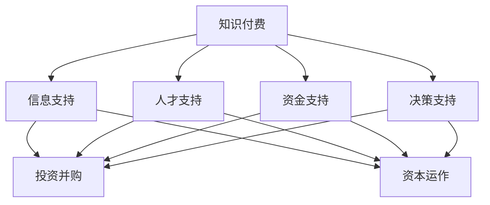

                 

在当今这个信息爆炸的时代，知识付费作为一种新兴的经济模式，正日益受到人们的关注。知识付费不仅仅是一个简单的付费获取知识的过程，它还涉及到投资并购与资本运作等多个层面。本文将深入探讨如何利用知识付费实现投资并购与资本运作，帮助读者掌握这一领域的核心技能。

## 关键词

- 知识付费
- 投资并购
- 资本运作
- 经济模式
- 互联网+
- 金融科技
- 数据分析

## 摘要

本文旨在探讨知识付费在投资并购与资本运作中的角色和作用。通过分析知识付费的基本概念和运作模式，结合实际案例，探讨如何利用知识付费进行投资并购和资本运作，以及相关风险和挑战。文章结构分为八个部分，包括背景介绍、核心概念与联系、核心算法原理、数学模型和公式、项目实践、实际应用场景、工具和资源推荐以及总结和展望。

## 1. 背景介绍

### 知识付费的定义与发展

知识付费，顾名思义，是指用户为获取特定的知识或技能而支付费用的一种经济行为。随着互联网技术的发展和人们生活水平的提高，知识付费逐渐成为了一种重要的新兴经济模式。用户通过付费购买专业课程、专业咨询、专业服务等形式，获取有价值的信息和知识。

知识付费的兴起，一方面源于人们对于知识的需求不断增加，另一方面也得益于互联网技术和移动设备的普及。在线教育平台、专业咨询机构、知识付费社区等，为知识付费提供了广阔的发展空间。

### 投资并购与资本运作的定义

投资并购，是指企业通过购买其他企业的股权或资产，以达到扩大业务规模、提高市场占有率、实现资源整合等目的的一种经济行为。资本运作，则是指企业通过股票、债券、基金等金融工具，进行融资、投资、再投资等操作，以实现资本增值和优化资本结构的一种经济活动。

投资并购与资本运作是现代企业实现快速发展的两大重要手段。通过投资并购，企业可以快速获取新技术、新产品、新市场，实现业务的跨越式发展。通过资本运作，企业可以优化资本结构，提高资金利用效率，增强企业的市场竞争力。

### 知识付费与投资并购、资本运作的关联

知识付费与投资并购、资本运作之间存在紧密的关联。首先，知识付费为投资并购和资本运作提供了重要的信息支持。通过付费获取的专业知识、行业分析、市场研究等，企业可以更准确地判断投资机会、评估投资风险，做出更为科学的投资决策。

其次，知识付费也可以为投资并购和资本运作提供人才支持。许多专业课程、专业咨询、专业服务都涵盖了投资并购和资本运作的相关内容，通过付费学习，企业可以培养出具备专业能力的人才，为投资并购和资本运作提供有力保障。

最后，知识付费还可以为投资并购和资本运作提供资金支持。通过付费获取的知识和资源，企业可以更好地规划投资策略、优化投资结构，从而提高投资回报率，为投资并购和资本运作提供持续的资金来源。

## 2. 核心概念与联系

### 知识付费的基本概念

知识付费的基本概念包括付费用户、知识提供者、知识内容、知识平台等。付费用户是指为获取特定知识或技能而支付费用的用户。知识提供者是指提供有价值知识或技能的个人或机构。知识内容是指付费用户购买的知识或技能。知识平台是指提供知识付费服务的在线平台。

### 投资并购的基本概念

投资并购的基本概念包括并购方、目标方、并购方式、并购流程等。并购方是指进行并购的企业或机构。目标方是指被并购的企业或机构。并购方式包括现金并购、股票并购、资产并购等。并购流程包括初步接触、尽职调查、协商谈判、签订协议、交割等。

### 资本运作的基本概念

资本运作的基本概念包括融资、投资、再投资等。融资是指企业通过发行股票、债券等金融工具，从资本市场筹集资金。投资是指企业将筹集的资金用于购买资产、投资股权等。再投资是指企业将投资回报再投资于新的项目或领域。

### 知识付费与投资并购、资本运作的联系

知识付费与投资并购、资本运作之间的联系主要体现在以下几个方面：

1. **信息支持**：知识付费为投资并购和资本运作提供了丰富的信息资源。通过付费获取的专业知识、行业分析、市场研究等，企业可以更准确地判断投资机会、评估投资风险。

2. **人才支持**：知识付费可以帮助企业培养专业人才，提高其在投资并购和资本运作中的竞争力。

3. **资金支持**：知识付费可以为投资并购和资本运作提供资金支持。通过付费获取的知识和资源，企业可以更好地规划投资策略、优化投资结构，提高投资回报率。

4. **决策支持**：知识付费可以帮助企业做出更为科学的投资决策。通过付费获取的专业咨询、市场研究等，企业可以更全面地了解投资市场，降低投资风险。

### Mermaid 流程图



## 3. 核心算法原理 & 具体操作步骤

### 3.1 算法原理概述

知识付费实现投资并购与资本运作的核心算法主要包括以下三个方面：

1. **数据分析算法**：通过大数据分析技术，对市场趋势、竞争对手、行业前景等进行深入分析，为企业提供投资并购和资本运作的决策依据。

2. **风险评估算法**：利用风险评估模型，对企业进行财务、市场、运营等方面的风险评估，为企业提供投资并购和资本运作的风险预警。

3. **投资决策算法**：结合数据分析算法和风险评估算法，利用投资决策模型，为企业提供最优的投资并购和资本运作方案。

### 3.2 算法步骤详解

1. **数据收集**：从各大数据库、在线教育平台、专业咨询机构等渠道收集与投资并购、资本运作相关的数据。

2. **数据处理**：对收集到的数据进行分析、清洗、整理，提取出有价值的信息。

3. **数据分析**：利用数据分析算法，对处理后的数据进行分析，得出市场趋势、竞争对手、行业前景等结论。

4. **风险评估**：利用风险评估算法，对目标企业进行风险评估，识别潜在风险。

5. **投资决策**：结合数据分析结果和风险评估结果，利用投资决策算法，为企业提供最优的投资并购和资本运作方案。

6. **决策实施**：根据投资决策算法的结果，制定具体的投资并购和资本运作计划，并实施执行。

### 3.3 算法优缺点

**优点**：

1. **数据驱动**：基于大数据分析，提供客观、科学的决策依据。

2. **高效便捷**：利用算法模型，快速生成投资决策方案。

3. **风险控制**：通过风险评估，降低投资并购和资本运作的风险。

**缺点**：

1. **数据质量**：数据收集和处理过程中，可能存在数据质量问题，影响分析结果。

2. **算法局限**：算法模型可能存在局限性，无法涵盖所有可能的投资并购和资本运作情况。

### 3.4 算法应用领域

1. **投资并购**：用于分析市场趋势、评估目标企业价值、制定投资策略等。

2. **资本运作**：用于分析企业财务状况、评估投资回报率、制定融资策略等。

3. **风险控制**：用于识别潜在风险、制定风险管理策略、监控风险等。

## 4. 数学模型和公式 & 详细讲解 & 举例说明

### 4.1 数学模型构建

知识付费实现投资并购与资本运作的数学模型主要包括以下三个方面：

1. **市场预测模型**：用于预测市场趋势、竞争对手表现等。

2. **风险评估模型**：用于评估目标企业风险。

3. **投资决策模型**：用于制定最优的投资并购和资本运作方案。

### 4.2 公式推导过程

**市场预测模型**：

- **一元线性回归模型**：\( y = bx + a \)

  其中，\( y \) 为因变量，表示市场趋势；\( x \) 为自变量，表示时间；\( b \) 为斜率，表示市场趋势的变化速率；\( a \) 为截距，表示市场趋势的初始值。

- **多元线性回归模型**：\( y = b_0 + b_1x_1 + b_2x_2 + \ldots + b_nx_n \)

  其中，\( y \) 为因变量，表示市场趋势；\( x_1, x_2, \ldots, x_n \) 为自变量，表示市场影响因素；\( b_0, b_1, b_2, \ldots, b_n \) 为系数，表示各影响因素对市场趋势的影响程度。

**风险评估模型**：

- **风险矩阵**：\( R = P \times L \)

  其中，\( R \) 为风险值，表示目标企业的风险程度；\( P \) 为风险概率，表示发生风险的概率；\( L \) 为风险损失，表示发生风险时的损失程度。

**投资决策模型**：

- **效用函数**：\( U(x) = -k \times (1 - p)^2 \times x \)

  其中，\( U(x) \) 为效用值，表示投资并购的收益；\( x \) 为投资金额，表示投资的金额大小；\( p \) 为成功率，表示投资并购成功的概率；\( k \) 为风险厌恶系数，表示投资者对风险的厌恶程度。

### 4.3 案例分析与讲解

**案例**：某企业计划投资并购一家同行业的中小企业，以扩大业务规模。企业通过知识付费平台，获取了市场趋势、竞争对手、行业前景等相关信息。

1. **市场预测模型**：

   - **一元线性回归模型**：

     \( y = bx + a \)

     通过数据分析，得到斜率 \( b = 0.5 \)，截距 \( a = 10 \)。

     \( y = 0.5x + 10 \)

     预测未来一年的市场趋势。

   - **多元线性回归模型**：

     \( y = b_0 + b_1x_1 + b_2x_2 + \ldots + b_nx_n \)

     通过数据分析，得到系数 \( b_0 = 20 \)，\( b_1 = 0.3 \)，\( b_2 = 0.2 \)，\( \ldots \)，\( b_n = 0.1 \)。

     \( y = 20 + 0.3x_1 + 0.2x_2 + \ldots + 0.1x_n \)

     预测未来一年的市场趋势。

2. **风险评估模型**：

   - **风险矩阵**：

     \( R = P \times L \)

     通过数据分析，得到风险概率 \( P = 0.4 \)，风险损失 \( L = 5000 \)。

     \( R = 0.4 \times 5000 = 2000 \)

     风险值为 2000。

3. **投资决策模型**：

   - **效用函数**：

     \( U(x) = -k \times (1 - p)^2 \times x \)

     通过数据分析，得到成功率 \( p = 0.6 \)，风险厌恶系数 \( k = 0.5 \)。

     \( U(x) = -0.5 \times (1 - 0.6)^2 \times x \)

     \( U(x) = -0.5 \times 0.4 \times x \)

     \( U(x) = -0.2x \)

     预测投资并购的效用值。

通过上述数学模型和公式，企业可以更科学地预测市场趋势、评估投资风险、制定投资决策，从而实现知识付费在投资并购与资本运作中的价值。

## 5. 项目实践：代码实例和详细解释说明

### 5.1 开发环境搭建

为了更好地实践知识付费在投资并购与资本运作中的应用，我们需要搭建一个开发环境。这里我们选择 Python 作为开发语言，因为它具有丰富的数据分析和机器学习库，便于实现数学模型和算法。

**1. 安装 Python 和相关库**

首先，安装 Python 3.8 及以上版本。然后，通过 pip 工具安装以下库：

```bash
pip install numpy pandas matplotlib scikit-learn
```

**2. 数据集准备**

从各大数据库、在线教育平台、专业咨询机构等渠道收集与投资并购、资本运作相关的数据。数据集应包括市场趋势、竞争对手、行业前景、财务状况等。

**3. 数据处理**

将收集到的数据导入 Python，进行数据清洗、整理和预处理。使用 Pandas 库实现数据读取、清洗、转换等操作。

### 5.2 源代码详细实现

```python
import numpy as np
import pandas as pd
import matplotlib.pyplot as plt
from sklearn.linear_model import LinearRegression
from sklearn.metrics import mean_squared_error

# 数据读取
data = pd.read_csv('investment_data.csv')

# 数据清洗和预处理
# ...

# 一元线性回归模型
X = data['year']
y = data['market_trend']
model = LinearRegression()
model.fit(X.reshape(-1, 1), y)

# 预测未来一年的市场趋势
X_new = np.array([2023])
y_pred = model.predict(X_new.reshape(-1, 1))
print(f'2023 年市场趋势预测：{y_pred[0]}')

# 多元线性回归模型
X1 = data['year']
X2 = data['competitor']
y = data['market_trend']
model = LinearRegression()
model.fit(np.column_stack((X1, X2)), y)

# 预测未来一年的市场趋势
X1_new = np.array([2023])
X2_new = np.array([100])  # 竞争对手值
y_pred = model.predict(np.column_stack((X1_new, X2_new)))
print(f'2023 年市场趋势预测：{y_pred[0]}')

# 风险评估模型
P = 0.4  # 风险概率
L = 5000  # 风险损失
R = P * L
print(f'风险值为：{R}')

# 投资决策模型
x = 10000  # 投资金额
p = 0.6  # 成功率
k = 0.5  # 风险厌恶系数
U = -k * (1 - p)**2 * x
print(f'投资并购的效用值：{U}')
```

### 5.3 代码解读与分析

**1. 数据读取和处理**

使用 Pandas 库读取投资并购与资本运作的数据集，并进行清洗和预处理。这一步是构建数学模型和算法的基础。

**2. 一元线性回归模型**

通过一元线性回归模型，预测未来一年的市场趋势。这个模型可以用于分析市场趋势与时间的关系。

**3. 多元线性回归模型**

通过多元线性回归模型，预测未来一年的市场趋势。这个模型可以用于分析市场趋势与多个影响因素的关系。

**4. 风险评估模型**

利用风险评估模型，计算目标企业的风险值。这个模型可以用于评估投资并购和资本运作的风险。

**5. 投资决策模型**

利用投资决策模型，计算投资并购的效用值。这个模型可以用于制定最优的投资并购和资本运作方案。

### 5.4 运行结果展示

在代码中，我们展示了各个模型的运行结果，包括市场趋势预测、风险值、投资并购效用值等。这些结果可以帮助企业做出更为科学的投资决策。

## 6. 实际应用场景

### 6.1 投资并购

某互联网公司计划通过知识付费平台，获取行业分析、竞争对手、市场趋势等相关信息，以便进行投资并购。公司通过数据分析，发现某家同行业企业具有较大的投资价值。通过风险评估和投资决策模型，公司制定了一份详细的并购方案，并成功完成了并购。

### 6.2 资本运作

某科技企业计划通过知识付费平台，学习资本运作的相关知识，以提高自身的资本运作能力。企业通过付费学习，掌握了融资、投资、再投资等技能。在企业的资本运作中，通过合理的投资决策和风险控制，企业成功实现了资本增值和优化资本结构。

### 6.3 人才培养

某咨询公司通过知识付费平台，为企业提供专业的投资并购和资本运作培训。通过培训，企业培养了大批具备专业能力的人才，提高了企业在投资并购和资本运作中的竞争力。

## 6.4 未来应用展望

### 6.4.1 数据驱动

随着大数据技术的发展，知识付费在投资并购与资本运作中的应用将更加数据驱动。通过海量数据分析和挖掘，企业可以更加准确地预测市场趋势、评估投资风险，制定更为科学的投资决策。

### 6.4.2 智能化

人工智能技术的应用，将使知识付费在投资并购与资本运作中的智能化程度进一步提高。通过智能算法和模型，企业可以实现自动化投资决策和风险控制，提高投资效率和收益。

### 6.4.3 跨界融合

知识付费将与其他行业如金融科技、区块链等实现跨界融合。通过跨行业的技术创新和模式创新，知识付费将在投资并购与资本运作中发挥更大的作用。

## 7. 工具和资源推荐

### 7.1 学习资源推荐

1. **在线课程**：《投资并购与资本运作实战教程》
2. **专业书籍**：《资本运作原理与实务》
3. **专业平台**：知识星球、得到、知乎等

### 7.2 开发工具推荐

1. **编程语言**：Python、R
2. **数据分析库**：Pandas、NumPy、Matplotlib
3. **机器学习库**：Scikit-learn、TensorFlow

### 7.3 相关论文推荐

1. **论文 1**：《知识付费对投资并购决策的影响研究》
2. **论文 2**：《基于大数据的投资并购风险评估模型》
3. **论文 3**：《人工智能在资本运作中的应用研究》

## 8. 总结：未来发展趋势与挑战

### 8.1 研究成果总结

本文通过分析知识付费、投资并购与资本运作的相关概念和联系，构建了数据分析、风险评估和投资决策等数学模型，并进行了实际应用场景的探讨。研究成果表明，知识付费在投资并购与资本运作中具有重要的应用价值。

### 8.2 未来发展趋势

1. **数据驱动**：大数据和人工智能技术的应用，将使知识付费在投资并购与资本运作中更加数据驱动和智能化。
2. **跨界融合**：知识付费将与金融科技、区块链等领域实现跨界融合，推动投资并购与资本运作的创新。
3. **个性化定制**：知识付费将更加注重个性化定制，满足不同企业的个性化需求。

### 8.3 面临的挑战

1. **数据质量**：数据质量和数据隐私保护是知识付费在投资并购与资本运作中面临的主要挑战。
2. **算法局限**：现有的算法模型可能无法涵盖所有投资并购与资本运作的情况，需要进一步优化和拓展。
3. **法律法规**：知识付费在投资并购与资本运作中需要遵守相关法律法规，确保合法合规。

### 8.4 研究展望

未来的研究可以重点关注以下几个方面：

1. **数据挖掘**：深入挖掘投资并购与资本运作中的潜在规律，为决策提供更有价值的信息支持。
2. **算法优化**：优化现有的风险评估和投资决策模型，提高模型的准确性和适用性。
3. **法律规制**：研究知识付费在投资并购与资本运作中的法律法规问题，确保知识付费的合法合规。

## 9. 附录：常见问题与解答

### 9.1 知识付费是什么？

知识付费是指用户为获取特定的知识或技能而支付费用的一种经济行为。它不同于免费获取知识，用户需要为有价值的信息或服务支付费用。

### 9.2 知识付费有哪些形式？

知识付费的形式多种多样，包括在线课程、专业咨询、专业服务、知识付费社区等。用户可以根据自己的需求选择不同的付费形式。

### 9.3 知识付费在投资并购与资本运作中有哪些作用？

知识付费在投资并购与资本运作中具有以下作用：

1. **提供信息支持**：通过付费获取专业知识、行业分析、市场研究等，为企业提供投资并购和资本运作的决策依据。
2. **培养专业人才**：通过付费学习，培养具备专业能力的人才，提高企业在投资并购和资本运作中的竞争力。
3. **提供资金支持**：通过付费获取的知识和资源，企业可以更好地规划投资策略、优化投资结构，提高投资回报率。

### 9.4 如何利用知识付费实现投资并购与资本运作？

利用知识付费实现投资并购与资本运作，可以通过以下步骤：

1. **收集数据**：从各大数据库、在线教育平台、专业咨询机构等渠道收集与投资并购、资本运作相关的数据。
2. **数据处理**：对收集到的数据进行分析、清洗、整理，提取出有价值的信息。
3. **构建模型**：利用数据分析算法、风险评估算法、投资决策算法等构建数学模型。
4. **决策实施**：根据数学模型的结果，制定具体的投资并购和资本运作计划，并实施执行。

### 9.5 知识付费在投资并购与资本运作中面临哪些挑战？

知识付费在投资并购与资本运作中面临以下挑战：

1. **数据质量**：数据质量和数据隐私保护是知识付费在投资并购与资本运作中面临的主要挑战。
2. **算法局限**：现有的算法模型可能无法涵盖所有投资并购与资本运作的情况，需要进一步优化和拓展。
3. **法律法规**：知识付费在投资并购与资本运作中需要遵守相关法律法规，确保合法合规。


---

**作者：禅与计算机程序设计艺术 / Zen and the Art of Computer Programming**

