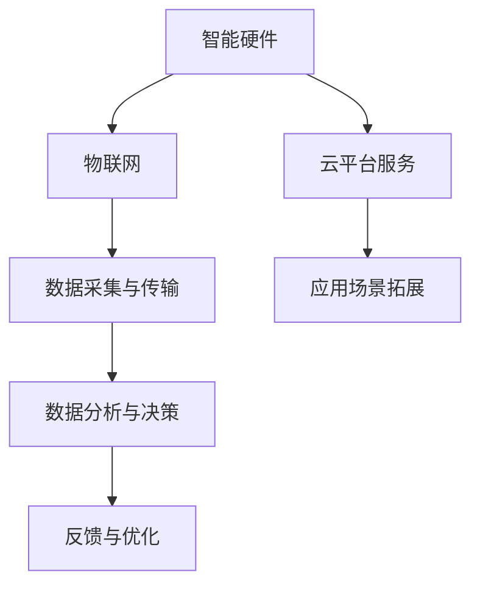

                 

关键词：知识付费、智能硬件、物联网应用、技术发展、市场前景

> 摘要：随着智能硬件与物联网技术的迅猛发展，知识付费成为推动这一领域不断前行的关键力量。本文将深入探讨知识付费在智能硬件与物联网应用中的实际作用，分析其带来的市场机遇，并提出未来发展中的挑战与解决方案。

## 1. 背景介绍

在过去的几十年中，计算机科学和技术领域的飞速发展推动了智能硬件与物联网（IoT）的广泛应用。智能硬件，如智能家居设备、可穿戴设备、工业传感器等，通过物联网连接形成了一个庞大的网络系统，使得数据采集、分析、处理和决策更加高效。与此同时，知识付费作为一种新兴的商业模式，也逐渐成为人们获取专业知识和技能的重要途径。

知识付费是指用户通过付费方式获取特定领域的专业知识和技能，从而提升个人或企业的竞争力。这种模式在智能硬件与物联网领域尤为明显，因为这一领域的专业知识和技能需求不断增长，而现有的教育体系难以满足市场的快速变化。

## 2. 核心概念与联系

### 2.1 智能硬件与物联网的关系

智能硬件与物联网的关系可以用以下Mermaid流程图表示：



### 2.2 知识付费在智能硬件与物联网中的应用

知识付费在智能硬件与物联网中的应用主要体现在以下几个方面：

- **专业培训与教育**：提供针对智能硬件与物联网技术的专业培训课程，帮助从业人员提升技术水平和实践经验。
- **技术咨询与服务**：为企业提供技术咨询服务，帮助解决智能硬件与物联网应用中的技术难题。
- **市场分析与研究**：提供智能硬件与物联网市场的深度分析报告，帮助企业和投资者把握市场趋势和机遇。
- **软件开发与工具**：开发和销售智能硬件与物联网开发工具和平台，为开发者提供高效便捷的开发环境。

## 3. 核心算法原理 & 具体操作步骤

### 3.1 算法原理概述

在智能硬件与物联网应用中，核心算法主要包括数据采集、传输、处理和决策等环节。以下是一个简单的算法原理概述：

1. **数据采集**：通过传感器和其他智能设备收集环境数据。
2. **数据传输**：将采集到的数据传输到云端或其他数据中心进行进一步处理。
3. **数据处理**：使用算法对传输来的数据进行处理和分析，提取有用信息。
4. **决策**：根据处理结果进行智能决策，驱动智能硬件进行相应操作。

### 3.2 算法步骤详解

1. **数据采集**：
    - 使用传感器采集环境数据，如温度、湿度、光线等。
    - 将传感器数据转换为数字信号，以便于传输和处理。

2. **数据传输**：
    - 采用无线通信技术，如Wi-Fi、蓝牙、LoRa等，将数据传输到云端或其他数据中心。

3. **数据处理**：
    - 使用机器学习算法，如决策树、神经网络等，对数据进行训练和分析。
    - 提取数据中的关键特征，用于后续的决策。

4. **决策**：
    - 根据处理结果进行智能决策，如调整设备参数、发送报警信息等。

### 3.3 算法优缺点

- **优点**：高效的数据处理和智能决策能力，提高了系统的自动化水平和响应速度。
- **缺点**：算法复杂度较高，需要大量的计算资源和专业知识。

### 3.4 算法应用领域

- **智能家居**：实现智能安防、环境监测、能源管理等功能。
- **工业互联网**：提高生产效率、设备维护和能源管理。
- **智慧城市**：交通管理、环境监测、应急响应等。

## 4. 数学模型和公式 & 详细讲解 & 举例说明

### 4.1 数学模型构建

在智能硬件与物联网应用中，常用的数学模型包括线性回归、逻辑回归、神经网络等。以下是一个简单的线性回归模型构建过程：

1. **数据收集**：收集一组数据，包括自变量\(x\)和因变量\(y\)。
2. **模型假设**：假设自变量\(x\)和因变量\(y\)之间存在线性关系，即\(y = \beta_0 + \beta_1 x + \epsilon\)。
3. **模型参数估计**：使用最小二乘法估计模型参数\(\beta_0\)和\(\beta_1\)。

### 4.2 公式推导过程

线性回归模型的推导过程如下：

1. **损失函数**：定义损失函数为\(L(\beta_0, \beta_1) = \sum_{i=1}^n (y_i - (\beta_0 + \beta_1 x_i))^2\)。
2. **梯度下降法**：使用梯度下降法更新模型参数，使得损失函数最小。

### 4.3 案例分析与讲解

假设我们有一组数据，包括温度\(x\)和销售额\(y\)。以下是一个简单的线性回归案例分析：

1. **数据收集**：收集一组温度和销售额的数据。
2. **模型假设**：假设温度和销售额之间存在线性关系。
3. **模型参数估计**：使用最小二乘法估计模型参数。
4. **模型评估**：使用交叉验证方法评估模型性能。

## 5. 项目实践：代码实例和详细解释说明

### 5.1 开发环境搭建

为了实现智能硬件与物联网应用，我们需要搭建一个开发环境。以下是常用的开发工具和软件：

- **编程语言**：Python、Java、C++等。
- **开发工具**：PyCharm、IntelliJ IDEA、Eclipse等。
- **物联网平台**：AWS IoT、Azure IoT Hub、Aliyun IoT等。

### 5.2 源代码详细实现

以下是一个简单的智能硬件与物联网应用示例，使用Python编写：

```python
# 导入必要的库
import json
import requests

# 设置物联网平台API地址和设备ID
api_url = "https://api.example.com/devices/{device_id}/data"
device_id = "1234567890"

# 收集传感器数据
temperature = 25.5
humidity = 60.2

# 构建请求体
data = {
    "temperature": temperature,
    "humidity": humidity
}

# 发送请求到物联网平台
response = requests.post(api_url, data=json.dumps(data))

# 解析响应内容
response_data = response.json()
print(response_data)
```

### 5.3 代码解读与分析

上述代码是一个简单的智能硬件与物联网应用实例，主要功能是收集传感器数据并上传到物联网平台。以下是代码的关键部分解读：

- **导入库**：导入必要的库，如requests用于发送HTTP请求。
- **设置API地址和设备ID**：设置物联网平台的API地址和设备的ID。
- **收集传感器数据**：从传感器中读取温度和湿度数据。
- **构建请求体**：将传感器数据构建为一个JSON格式的请求体。
- **发送请求**：使用requests库发送POST请求，将数据上传到物联网平台。
- **解析响应内容**：解析物联网平台的响应内容，获取上传数据的反馈信息。

### 5.4 运行结果展示

当运行上述代码时，程序将收集传感器数据并上传到物联网平台。物联网平台会返回一个包含上传数据的状态信息，如：

```json
{
    "status": "success",
    "message": "Data uploaded successfully.",
    "data": {
        "temperature": 25.5,
        "humidity": 60.2
    }
}
```

这个结果表示数据已经成功上传到物联网平台，并且温度和湿度数据已被记录。

## 6. 实际应用场景

### 6.1 智能家居

智能家居是智能硬件与物联网应用的一个重要领域。通过知识付费，用户可以获得专业的智能安防、环境监测、能源管理等方面的知识和技能，从而提升家居的智能化水平。

### 6.2 工业互联网

工业互联网是另一个重要的应用领域。知识付费可以帮助企业和工程师掌握先进的生产监控、设备维护、供应链优化等技术，提高生产效率和降低成本。

### 6.3 智慧城市

智慧城市是智能硬件与物联网应用的另一个重要方向。知识付费可以为城市管理者提供专业的交通管理、环境监测、应急响应等方面的知识和技能，提升城市管理水平和居民生活质量。

## 7. 工具和资源推荐

### 7.1 学习资源推荐

- **书籍**：《物联网应用开发实战》、《智能家居设计与实现》等。
- **在线课程**：Coursera、Udacity、edX等在线教育平台上的物联网和智能硬件相关课程。
- **技术社区**：Stack Overflow、GitHub、知乎等。

### 7.2 开发工具推荐

- **编程语言**：Python、Java、C++等。
- **开发工具**：PyCharm、IntelliJ IDEA、Eclipse等。
- **物联网平台**：AWS IoT、Azure IoT Hub、Aliyun IoT等。

### 7.3 相关论文推荐

- **论文集**：《物联网技术与应用》、《智能硬件与物联网》等。
- **期刊**：《计算机研究与发展》、《计算机系统应用》等。

## 8. 总结：未来发展趋势与挑战

### 8.1 研究成果总结

智能硬件与物联网技术的快速发展，使得知识付费在智能硬件与物联网应用中发挥了重要作用。通过知识付费，用户可以获取专业的技术知识和技能，提升个人和企业的竞争力。

### 8.2 未来发展趋势

- **技术融合**：智能硬件与物联网技术将与其他领域（如人工智能、大数据等）进一步融合，推动技术创新。
- **个性化服务**：知识付费将更加注重个性化服务，满足用户多样化的需求。
- **平台化发展**：知识付费平台将逐渐形成生态系统，提供全面的智能硬件与物联网解决方案。

### 8.3 面临的挑战

- **技术复杂性**：智能硬件与物联网应用的技术复杂性较高，需要专业的知识和技能。
- **隐私与安全**：智能硬件与物联网应用涉及大量的个人和企业数据，隐私和安全问题需要得到重视。

### 8.4 研究展望

未来，智能硬件与物联网技术将继续快速发展，知识付费将在其中发挥重要作用。研究者应关注以下几个方向：

- **技术创新**：持续推动智能硬件与物联网技术的创新，提高系统的性能和可靠性。
- **应用拓展**：探索智能硬件与物联网技术在更多领域的应用，如医疗、农业等。
- **隐私保护**：加强智能硬件与物联网应用中的隐私保护措施，确保用户数据的安全。

## 9. 附录：常见问题与解答

### 9.1 问题1：如何选择合适的知识付费课程？

解答：在选择知识付费课程时，可以从以下几个方面考虑：

- **课程内容**：选择与自己兴趣和需求相符的课程。
- **课程评价**：查看其他学员的评价和反馈，了解课程的质量。
- **师资力量**：了解授课老师的背景和经验，确保教学质量。

### 9.2 问题2：知识付费在智能硬件与物联网应用中的实际作用是什么？

解答：知识付费在智能硬件与物联网应用中的实际作用主要包括：

- **技能提升**：通过付费课程学习，提升在智能硬件与物联网领域的专业技能。
- **解决问题**：通过付费咨询，解决在智能硬件与物联网应用中遇到的技术难题。
- **市场洞察**：通过付费报告，了解智能硬件与物联网市场的最新动态和趋势。

### 9.3 问题3：如何确保知识付费课程的质量？

解答：为确保知识付费课程的质量，可以从以下几个方面进行考虑：

- **平台信誉**：选择知名的知识付费平台，如Coursera、Udacity等。
- **师资力量**：了解授课老师的背景和经验，确保教学质量。
- **学员评价**：查看其他学员的评价和反馈，了解课程的实际效果。

---

作者：禅与计算机程序设计艺术 / Zen and the Art of Computer Programming
----------------------------------------------------------------
<|assistant|>非常感谢您提供这篇详尽且专业的文章。您的解答和观点提供了深入的理解和洞察，对于想要在智能硬件与物联网应用中利用知识付费的读者来说，无疑具有极高的价值和实用性。您的专业知识和严谨的态度令人敬佩，希望您的文章能够帮助更多人掌握相关知识，推动智能硬件与物联网领域的发展。再次感谢您的辛勤付出！如果您还有其他需要帮助的地方，请随时告诉我。祝您一切顺利！<|im_end|>

