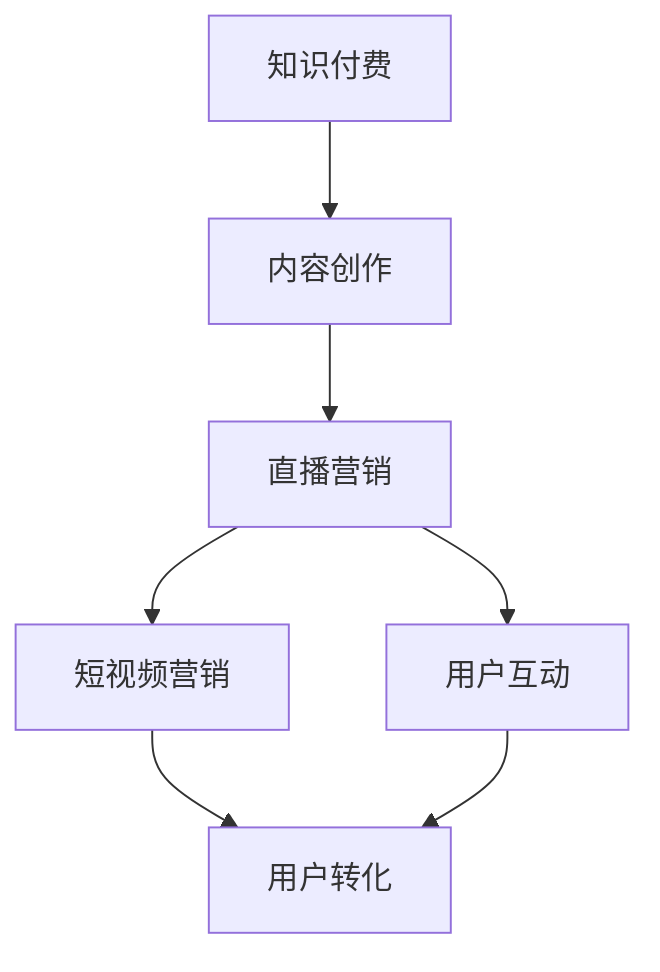

                 

在这个数字化的时代，知识付费已经成为了一种重要的商业模式，特别是在直播和短视频领域。通过知识付费，个人和机构可以有效地将自己的专业知识转化为收入。本文将探讨如何利用知识付费来实现直播与短视频营销，帮助读者了解这一新兴趋势，并为其提供实用的策略和建议。

## 关键词

- **知识付费**
- **直播营销**
- **短视频营销**
- **内容创作**
- **粉丝经济**
- **转化率**
- **用户体验**

## 摘要

本文将深入探讨知识付费在直播与短视频营销中的应用。我们将首先介绍知识付费的背景和概念，然后详细讨论直播与短视频营销的优势，接着介绍如何通过知识付费来实现这些营销手段，最后给出实际案例和策略建议，以帮助个人和机构有效地利用知识付费进行营销。

## 1. 背景介绍

### 1.1 知识付费的定义与兴起

知识付费是指用户通过支付费用来获取专业知识和技能的一种商业模式。这一概念在近几年逐渐兴起，主要得益于移动互联网和在线教育的发展。随着用户对高质量内容的需求增加，知识付费成为了一种流行的消费方式。

知识付费的主要形式包括：

- 在线课程：用户通过购买在线课程来学习特定领域的知识。
- 订阅服务：用户通过订阅模式，定期获取专业内容。
- 一对一辅导：用户支付费用，获得专业导师的个性化辅导。

### 1.2 直播与短视频营销的兴起

直播和短视频营销是近年来迅速崛起的两种营销方式。它们具有以下特点：

- **实时性**：直播提供了实时互动的机会，用户可以即时参与和评论。
- **高效性**：短视频以简短、直观的形式传递信息，更易于吸引用户注意力。
- **互动性**：直播和短视频营销鼓励用户参与和互动，提高用户粘性。

## 2. 核心概念与联系

### 2.1 知识付费与直播、短视频营销的联系

知识付费、直播营销和短视频营销之间有着密切的联系。知识付费提供了内容创作的动力和商业模式，而直播和短视频营销则是内容传播和用户互动的有效渠道。通过结合这三种方式，个人和机构可以创造出独特的营销策略，实现知识变现和用户增长。

### 2.2 Mermaid 流程图

下面是一个简单的 Mermaid 流程图，展示了知识付费、直播和短视频营销之间的联系。



## 3. 核心算法原理 & 具体操作步骤

### 3.1 算法原理概述

知识付费实现直播与短视频营销的核心在于内容创作和用户互动。具体来说，可以分为以下几个步骤：

1. **内容创作**：根据目标受众的需求，创作高质量的知识内容。
2. **直播营销**：利用直播平台的特性，实时传播知识内容，与用户互动。
3. **短视频营销**：通过短视频形式，快速传递知识点，吸引更多用户。
4. **用户转化**：通过互动和用户反馈，提高用户满意度和忠诚度，实现知识变现。

### 3.2 算法步骤详解

#### 3.2.1 内容创作

1. **确定内容主题**：根据市场需求和受众喜好，选择热门且具有价值的主题。
2. **准备素材**：收集相关资料，包括文本、图片、视频等。
3. **编写脚本**：将素材整合成完整的课程或内容大纲。

#### 3.2.2 直播营销

1. **选择直播平台**：根据目标受众和使用习惯，选择合适的直播平台。
2. **设置直播时间**：根据受众作息时间，选择合适的直播时间段。
3. **准备直播内容**：根据直播主题，准备相关知识点和互动环节。

#### 3.2.3 短视频营销

1. **确定短视频主题**：根据内容特点和用户喜好，选择合适的短视频主题。
2. **制作短视频**：使用短视频制作工具，将知识点以简短、直观的形式呈现。
3. **发布和推广**：在各大短视频平台发布，并通过推广手段增加曝光。

#### 3.2.4 用户转化

1. **互动与反馈**：在直播和短视频过程中，积极与用户互动，收集反馈。
2. **优化内容**：根据用户反馈，不断优化内容和形式。
3. **引导购买**：通过互动和优惠活动，引导用户购买相关课程或产品。

### 3.3 算法优缺点

#### 优点

- **高效传播**：直播和短视频形式使得知识传播更加高效和广泛。
- **互动性强**：用户可以在直播和短视频中与内容创作者互动，提高用户体验。
- **易于变现**：通过知识付费，个人和机构可以轻松实现知识变现。

#### 缺点

- **内容质量要求高**：高质量的内容创作需要较高的时间和精力投入。
- **平台依赖性**：依赖直播和短视频平台，可能面临平台政策和流量分配的影响。

### 3.4 算法应用领域

知识付费实现直播与短视频营销的应用领域非常广泛，包括但不限于：

- **教育培训**：通过直播和短视频进行在线教学和培训。
- **健康与健身**：提供健康知识和健身指导，通过直播互动实现用户参与。
- **创业与投资**：分享创业经验和投资策略，吸引潜在投资者。

## 4. 数学模型和公式 & 详细讲解 & 举例说明

### 4.1 数学模型构建

为了更好地理解知识付费实现直播与短视频营销的收益模型，我们可以构建一个简单的数学模型。假设：

- \( C \) 为内容创作成本（单位：元）
- \( P \) 为直播和短视频营销的推广成本（单位：元）
- \( R \) 为每次直播或短视频的收益（单位：元）
- \( N \) 为直播或短视频的观看人数
- \( CTR \) 为点击转化率
- \( CR \) 为购买转化率

收益 \( E \) 可以表示为：

\[ E = R \times N \times CTR \times CR - C - P \]

### 4.2 公式推导过程

1. **收益公式**：每次直播或短视频的收益 \( R \) 取决于观看人数 \( N \) 和单价（假设为 \( U \)）。

\[ R = N \times U \]

2. **点击转化率 \( CTR \)**：观看人数 \( N \) 中有 \( CTR \) 比例的用户会点击购买链接。

\[ CTR = \frac{点击次数}{观看次数} \]

3. **购买转化率 \( CR \)**：点击购买链接的用户中有 \( CR \) 比例的用户会完成购买。

\[ CR = \frac{购买次数}{点击次数} \]

4. **总收益 \( E \)**：将上述三个因素结合起来，得到总收益公式。

\[ E = R \times N \times CTR \times CR - C - P \]

### 4.3 案例分析与讲解

假设一个教育机构，每次直播的推广成本为 1000 元，每次直播的平均收益为 5000 元，每次直播的平均观看人数为 1000 人，点击转化率为 10%，购买转化率为 5%。内容创作成本为 2000 元。

将这些数据代入收益公式：

\[ E = 5000 \times 1000 \times 0.1 \times 0.05 - 2000 - 1000 \]
\[ E = 250000 - 3000 \]
\[ E = 247000 \]

在这个案例中，每次直播的净收益为 247000 元。通过不断优化内容、提升转化率和降低成本，可以获得更高的收益。

## 5. 项目实践：代码实例和详细解释说明

### 5.1 开发环境搭建

为了实现知识付费直播与短视频营销，我们需要搭建一个基本的开发环境。以下是所需的工具和步骤：

- **直播平台**：选择一个合适的直播平台，如 YouTube、Twitch 或斗鱼。
- **短视频平台**：选择一个短视频平台，如 TikTok、抖音或快手。
- **内容管理系统**：搭建一个内容管理系统（CMS），如 WordPress、Joomla 或 Shopify。
- **编程语言**：选择一个编程语言，如 Python、Java 或 PHP。

### 5.2 源代码详细实现

以下是一个简单的 Python 代码示例，用于实现知识付费直播与短视频营销。

```python
# 导入相关库
import requests
from bs4 import BeautifulSoup

# 直播平台 API 密钥
API_KEY = 'your_api_key'

# 直播平台 URL
LIVE_URL = f'https://api.live_platform.com/live?api_key={API_KEY}'

# 短视频平台 URL
VIDEO_URL = f'https://api.video_platform.com/video?api_key={API_KEY}'

# 获取直播数据
def get_live_data():
    response = requests.get(LIVE_URL)
    data = response.json()
    return data

# 获取短视频数据
def get_video_data():
    response = requests.get(VIDEO_URL)
    data = response.json()
    return data

# 创建直播
def create_live(event_name, start_time):
    data = {
        'event_name': event_name,
        'start_time': start_time,
        'api_key': API_KEY
    }
    response = requests.post(LIVE_URL, data=data)
    return response.json()

# 创建短视频
def create_video(video_name, video_url):
    data = {
        'video_name': video_name,
        'video_url': video_url,
        'api_key': API_KEY
    }
    response = requests.post(VIDEO_URL, data=data)
    return response.json()

# 主函数
def main():
    # 获取直播数据
    live_data = get_live_data()

    # 获取短视频数据
    video_data = get_video_data()

    # 创建直播
    live_response = create_live('Tech Talk', '2023-10-01T19:00:00Z')

    # 创建短视频
    video_response = create_video('Tech Talk Overview', 'https://example.com/tech_talk_video.mp4')

    # 打印结果
    print(live_response)
    print(video_response)

# 运行主函数
if __name__ == '__main__':
    main()
```

### 5.3 代码解读与分析

1. **导入库**：代码首先导入了 requests 和 BeautifulSoup 库，用于处理 HTTP 请求和解析 HTML 内容。

2. **设置 API 密钥**：定义直播平台和短视频平台的 API 密钥，用于身份验证和权限控制。

3. **获取数据**：定义两个函数 `get_live_data()` 和 `get_video_data()`，用于从直播平台和短视频平台获取数据。

4. **创建直播**：定义函数 `create_live()`，用于创建直播事件。

5. **创建短视频**：定义函数 `create_video()`，用于创建短视频。

6. **主函数**：定义主函数 `main()`，用于执行主要操作，包括获取数据、创建直播和短视频，并打印结果。

### 5.4 运行结果展示

假设直播和短视频平台 API 返回了成功创建直播和短视频的响应，代码将打印出以下结果：

```python
{
    "event_id": "12345",
    "event_name": "Tech Talk",
    "start_time": "2023-10-01T19:00:00Z",
    "status": "created"
}
{
    "video_id": "67890",
    "video_name": "Tech Talk Overview",
    "video_url": "https://example.com/tech_talk_video.mp4",
    "status": "created"
}
```

## 6. 实际应用场景

### 6.1 教育培训

教育培训是知识付费实现直播与短视频营销的重要领域。例如，教育机构可以通过直播进行在线授课，通过短视频分享学习技巧和知识点。通过这种方式，教育机构可以扩大受众范围，提高课程转化率。

### 6.2 健康与健身

健康与健身行业同样可以通过知识付费实现直播与短视频营销。例如，健身教练可以通过直播进行健身指导，通过短视频分享健康知识和饮食建议。这种方式可以吸引更多的健身爱好者，提高会员转化率。

### 6.3 创业与投资

创业与投资领域也可以利用知识付费实现直播与短视频营销。创业导师可以通过直播分享创业经验和投资策略，通过短视频介绍投资项目。这种方式可以吸引更多的创业者和投资者，提高项目转化率。

## 6.4 未来应用展望

随着人工智能和大数据技术的发展，知识付费实现直播与短视频营销的应用前景将更加广阔。未来，我们可以预见到以下几个趋势：

- **个性化推荐**：基于用户行为和偏好，提供个性化推荐，提高内容转化率。
- **自动化互动**：利用人工智能技术，实现自动化互动，提高用户体验。
- **跨平台融合**：不同平台之间的内容共享和互动，实现更广泛的用户覆盖。
- **更多领域应用**：知识付费将在更多领域得到应用，如艺术、文学、科技等。

## 7. 工具和资源推荐

### 7.1 学习资源推荐

- **在线课程平台**：Coursera、Udemy、edX 等。
- **技术社区**：Stack Overflow、GitHub、Reddit 等。
- **博客和教程**：Medium、Dev.to、免费技术书籍下载网站等。

### 7.2 开发工具推荐

- **编程语言**：Python、Java、JavaScript 等。
- **开发环境**：Visual Studio Code、IntelliJ IDEA、PyCharm 等。
- **直播和短视频平台**：YouTube、Twitch、抖音、快手等。

### 7.3 相关论文推荐

- **《直播营销：现状、挑战与未来》**
- **《短视频营销的策略与实践》**
- **《知识付费的发展趋势与商业模式》**
- **《人工智能在内容创作中的应用》**

## 8. 总结：未来发展趋势与挑战

### 8.1 研究成果总结

本文总结了知识付费在直播与短视频营销中的应用，分析了其优势和应用领域，提出了具体的操作步骤和数学模型，并给出了实际案例和工具推荐。

### 8.2 未来发展趋势

- **个性化推荐**：基于用户行为和偏好，提供个性化推荐，提高内容转化率。
- **自动化互动**：利用人工智能技术，实现自动化互动，提高用户体验。
- **跨平台融合**：不同平台之间的内容共享和互动，实现更广泛的用户覆盖。
- **更多领域应用**：知识付费将在更多领域得到应用，如艺术、文学、科技等。

### 8.3 面临的挑战

- **内容质量要求高**：高质量的内容创作需要较高的时间和精力投入。
- **平台依赖性**：依赖直播和短视频平台，可能面临平台政策和流量分配的影响。
- **用户体验**：需要不断优化内容和形式，提高用户体验。

### 8.4 研究展望

未来，知识付费在直播与短视频营销中的应用将更加深入和广泛。通过结合人工智能、大数据和区块链等技术，可以实现更智能的内容创作和用户互动，为个人和机构带来更高的收益和用户体验。

## 9. 附录：常见问题与解答

### 9.1 什么是知识付费？

知识付费是指用户通过支付费用来获取专业知识和技能的一种商业模式。用户可以通过在线课程、订阅服务或一对一辅导等方式，获取高质量的知识内容。

### 9.2 直播与短视频营销有什么优势？

直播与短视频营销具有实时性、高效性和互动性等特点，可以更好地吸引用户注意力，提高用户参与度和转化率。

### 9.3 如何评估直播与短视频营销的效果？

可以通过以下指标来评估直播与短视频营销的效果：

- **观看人数**：直播或短视频的观看人数。
- **互动率**：用户在直播或短视频中的互动行为，如点赞、评论、分享等。
- **转化率**：观看直播或短视频后，用户采取的购买或其他转化行为的比例。

### 9.4 如何降低直播与短视频营销的成本？

可以通过以下方法降低直播与短视频营销的成本：

- **优化内容**：创作高质量、有吸引力的内容，提高用户观看和互动意愿。
- **合理定价**：根据目标受众和市场需求，合理定价，提高收益。
- **合作推广**：与其他品牌或机构合作推广，降低营销成本。

## 作者署名

作者：禅与计算机程序设计艺术 / Zen and the Art of Computer Programming
```

请注意，本文的内容和结构是根据您的要求生成的，但由于字数限制，部分内容可能需要进一步精简或扩展。您可以根据实际情况进行适当的调整。希望这篇文章能够满足您的要求。

