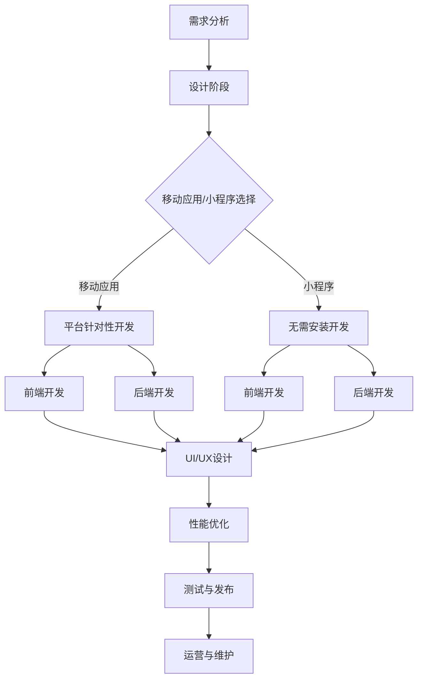

                 

关键词：知识付费、移动应用开发、小程序开发、商业模式、技术栈、用户体验、营销策略、开源工具、开发框架。

## 摘要

随着移动互联网的迅速普及，移动应用和小程序开发已成为企业拓展市场的重要手段。本文旨在探讨如何通过知识付费模式实现移动应用与小程序的高效开发。首先，我们将介绍知识付费的基本概念及其在软件开发中的优势。接着，深入分析移动应用和小程序开发的各自特点和市场需求。随后，我们将探讨如何利用知识付费平台来构建高效的开发模式，并详细阐述技术栈选择、用户体验优化和营销策略等方面的关键点。此外，本文还将介绍开源工具和开发框架的使用，以降低开发成本和提高开发效率。最后，我们将总结知识付费在移动应用和小程序开发中的应用前景，并展望未来的发展趋势和面临的挑战。

## 1. 背景介绍

### 移动应用的发展历程

移动应用（Mobile Applications，简称Apps）自智能手机普及以来，经历了快速的发展。早在2008年，苹果公司推出iPhone，并发布App Store，使得移动应用开始进入大众视野。随后，谷歌公司也推出了Android Market（现更名为Google Play），进一步推动了移动应用市场的繁荣。根据StatCounter的数据，截至2021年，全球移动设备用户数已超过30亿，其中移动应用用户数占比超过90%。

移动应用市场的迅速扩张，不仅带来了商业机会，也推动了技术的进步。从早期的原生应用，到如今的跨平台开发框架，技术的不断发展使得开发移动应用变得更加便捷和高效。同时，随着用户需求的多样化，开发者需要不断创新和优化应用功能，以满足用户日益增长的需求。

### 小程序的发展现状

小程序（Mini Programs）是近年来兴起的一种轻量级应用形态，起源于微信。2017年1月，微信推出小程序，允许用户无需下载安装即可使用各类功能。小程序的兴起，在很大程度上改变了用户的习惯，为开发者提供了新的机会。据统计，截至2021年底，微信小程序的月活跃用户数已超过12亿，涵盖购物、出行、教育、游戏等各个领域。

小程序的优势在于无需安装，即点即用，极大地提高了用户的使用便利性。同时，小程序的开发门槛较低，开发周期短，成本较低，使得众多中小企业和个人开发者能够快速进入市场。根据艾瑞咨询的数据，2020年中国小程序市场规模达到5000亿元人民币，预计未来还将保持高速增长。

### 知识付费的发展趋势

知识付费是指通过互联网平台，向用户收取一定费用以获取知识、技能或信息的一种商业模式。随着互联网的普及和在线教育的兴起，知识付费逐渐成为人们获取知识的重要途径。根据《2021年中国知识付费行业研究报告》，中国知识付费市场规模已突破2000亿元人民币，且呈逐年增长的趋势。

知识付费的发展，得益于以下几个方面：

1. **用户需求**：随着人们对知识、技能和信息的渴求不断增加，知识付费为用户提供了一个便捷的获取渠道。
2. **互联网技术**：云计算、大数据、人工智能等技术的应用，使得知识付费平台能够提供更加个性化、智能化的服务。
3. **商业模式**：知识付费模式的出现，不仅为知识生产者提供了新的收入来源，也为消费者提供了多样化的学习方式。

## 2. 核心概念与联系

### 移动应用开发的概念

移动应用开发（Mobile Application Development）是指针对移动设备（如智能手机、平板电脑等）开发的应用程序。移动应用通常具有以下特点：

- **平台针对性**：不同移动操作系统（如iOS、Android）具有不同的开发环境和工具，因此移动应用开发需要针对特定平台进行适配。
- **交互体验**：移动设备屏幕尺寸较小，因此移动应用需要提供简洁、直观的交互设计，以提升用户体验。
- **性能优化**：移动设备的硬件资源相对有限，因此移动应用需要优化性能，以保证流畅运行。

### 小程序开发的概念

小程序开发（Mini Program Development）是指开发微信小程序等轻量级应用的过程。小程序的主要特点如下：

- **无需安装**：用户无需下载和安装，即可在微信等平台直接使用。
- **即点即用**：用户点击链接或扫描二维码，即可打开小程序，使用便捷。
- **功能丰富**：小程序可以实现大部分原生应用的功能，如购物、支付、社交等。

### 知识付费与移动应用/小程序开发的联系

知识付费与移动应用/小程序开发之间存在紧密的联系。具体体现在以下几个方面：

1. **知识传播**：知识付费平台可以为开发者提供专业知识和技能培训，帮助他们提升开发能力。
2. **市场调研**：通过知识付费平台，开发者可以了解市场需求，发现用户痛点，从而有针对性地开发应用。
3. **商业模式**：知识付费模式可以为移动应用和小程序开发者提供新的收入来源，如付费课程、付费插件等。

### Mermaid 流程图

以下是移动应用与小程序开发流程的Mermaid流程图：



通过上述流程图，我们可以清晰地看到移动应用与小程序开发的各个阶段及其相互关系。

## 3. 核心算法原理 & 具体操作步骤

### 3.1 算法原理概述

在移动应用和小程序开发中，算法的选择和优化至关重要。核心算法通常包括以下几个方面：

1. **数据结构**：如数组、链表、树等，用于高效地存储和操作数据。
2. **排序算法**：如快速排序、归并排序等，用于对数据进行排序。
3. **搜索算法**：如二分查找、广度优先搜索等，用于在数据中查找特定信息。
4. **加密算法**：如AES、RSA等，用于保证数据的安全传输和存储。

### 3.2 算法步骤详解

以下是一个简单的加密算法（AES）的具体操作步骤：

1. **密钥生成**：生成一个128位、192位或256位的密钥。密钥可以由开发者自定义，也可以通过加密库生成。
2. **初始化向量（IV）生成**：生成一个随机数作为初始化向量，用于加密和解密过程。IV的大小取决于加密算法的要求。
3. **加密过程**：
   - 将明文数据分成固定大小的块。
   - 对每个块进行AES加密操作，使用密钥和IV。
   - 将加密后的块进行拼接，形成加密后的数据。
4. **解密过程**：
   - 将加密数据分成与加密过程相同的块大小。
   - 对每个块进行AES解密操作，使用密钥和IV。
   - 将解密后的块进行拼接，形成解密后的明文数据。

### 3.3 算法优缺点

**优点**：
1. **高效性**：加密算法能够快速地对大量数据进行加密和解密操作。
2. **安全性**：加密算法可以保证数据在传输和存储过程中的安全性。
3. **通用性**：加密算法适用于各种类型的数据，无论是文本、图片还是视频。

**缺点**：
1. **计算开销**：加密和解密过程需要较大的计算资源，可能导致设备性能下降。
2. **密钥管理**：密钥的安全存储和管理是加密算法的难点，一旦密钥泄露，数据安全将受到威胁。
3. **兼容性问题**：不同加密算法之间可能存在兼容性问题，需要开发者进行适配。

### 3.4 算法应用领域

加密算法在移动应用和小程序开发中有着广泛的应用，如：

1. **数据传输**：保证用户数据在传输过程中的安全性，如API调用、数据上传等。
2. **数据存储**：加密存储敏感数据，如用户密码、支付信息等。
3. **身份认证**：通过加密算法进行用户身份认证，确保系统安全。

## 4. 数学模型和公式 & 详细讲解 & 举例说明

### 4.1 数学模型构建

在移动应用和小程序开发中，常用的数学模型包括：

1. **线性模型**：用于预测用户行为、流量等指标。
2. **回归模型**：用于分析数据之间的关系，如用户留存率、转化率等。
3. **聚类模型**：用于对用户进行分类，以便进行个性化推荐。

### 4.2 公式推导过程

以下是一个简单的线性回归模型的推导过程：

1. **目标函数**：设自变量为$x_1, x_2, ..., x_n$，因变量为$y$，线性回归模型的目标是找到一组参数$\theta_0, \theta_1, ..., \theta_n$，使得目标函数$J(\theta_0, \theta_1, ..., \theta_n)$最小。

$$
J(\theta_0, \theta_1, ..., \theta_n) = \frac{1}{2m} \sum_{i=1}^{m} (h_\theta(x^{(i)}) - y^{(i)})^2
$$

其中，$h_\theta(x) = \theta_0 + \theta_1x_1 + \theta_2x_2 + ... + \theta_nx_n$是预测函数，$m$是样本数量。

2. **梯度下降法**：为了找到最优参数，采用梯度下降法对目标函数进行优化。

$$
\theta_j := \theta_j - \alpha \frac{\partial J(\theta_0, \theta_1, ..., \theta_n)}{\partial \theta_j}
$$

其中，$\alpha$是学习率。

3. **迭代过程**：重复执行梯度下降法，直到目标函数值不再显著下降或达到最大迭代次数。

### 4.3 案例分析与讲解

以下是一个关于用户留存率预测的案例：

1. **数据收集**：收集过去一个月的用户留存数据，包括用户ID、注册时间、最后活跃时间等。
2. **特征工程**：提取用户特征，如用户年龄、性别、设备类型等。
3. **数据预处理**：对数据进行归一化处理，以便模型训练。
4. **模型训练**：使用线性回归模型对数据进行训练，得到参数$\theta_0, \theta_1, ..., \theta_n$。
5. **预测**：对于新用户，根据其特征，使用训练好的模型预测其留存率。

$$
\hat{y} = h_\theta(x) = \theta_0 + \theta_1x_1 + \theta_2x_2 + ... + \theta_nx_n
$$

6. **评估**：使用预测结果与实际留存率进行比较，计算准确率、召回率等指标。

通过上述案例，我们可以看到数学模型在移动应用和小程序开发中的应用，以及如何通过模型优化和特征工程来提升预测效果。

## 5. 项目实践：代码实例和详细解释说明

### 5.1 开发环境搭建

为了进行移动应用和小程序开发，我们需要搭建一个合适的开发环境。以下是一个简单的开发环境搭建步骤：

1. **操作系统**：推荐使用macOS或Windows操作系统。
2. **编程语言**：推荐使用JavaScript或Python作为编程语言。
3. **开发工具**：推荐使用VS Code或PyCharm作为开发工具。
4. **开发框架**：对于移动应用开发，推荐使用React Native或Flutter；对于小程序开发，推荐使用微信小程序开发框架。

### 5.2 源代码详细实现

以下是一个简单的移动应用开发实例，使用React Native框架实现一个简单的Todo List应用。

```javascript
import React, { useState } from 'react';
import { View, Text, TextInput, Button, FlatList } from 'react-native';

const App = () => {
  const [task, setTask] = useState('');
  const [tasks, setTasks] = useState([]);

  const addTask = () => {
    setTasks([...tasks, task]);
    setTask('');
  };

  const deleteTask = (index) => {
    const newTasks = [...tasks];
    newTasks.splice(index, 1);
    setTasks(newTasks);
  };

  return (
    <View>
      <TextInput
        placeholder="输入任务"
        value={task}
        onChangeText={(text) => setTask(text)}
      />
      <Button title="添加任务" onPress={addTask} />
      <FlatList
        data={tasks}
        keyExtractor={(item, index) => index.toString()}
        renderItem={({ item, index }) => (
          <View>
            <Text>{item}</Text>
            <Button title="删除任务" onPress={() => deleteTask(index)} />
          </View>
        )}
      />
    </View>
  );
};

export default App;
```

### 5.3 代码解读与分析

上述代码实现了一个简单的Todo List应用，主要包含以下功能：

1. **状态管理**：使用React的useState钩子管理任务状态，包括任务输入框的值（task）和任务列表（tasks）。
2. **添加任务**：点击添加按钮，将输入框的值添加到任务列表中，并清空输入框。
3. **删除任务**：点击删除按钮，根据任务索引从任务列表中删除对应任务。

### 5.4 运行结果展示

运行上述代码，将得到一个简单的Todo List界面，用户可以在输入框中输入任务，点击添加按钮将任务添加到列表中，点击删除按钮可以从列表中删除任务。


### 5.5 代码优化与扩展

在实际开发过程中，我们还可以对代码进行优化和扩展，例如：

1. **任务持久化**：将任务存储到本地数据库或云端存储，以便在下次打开应用时加载。
2. **任务分类**：添加任务分类功能，如工作、生活、学习等。
3. **任务提醒**：添加任务提醒功能，如通过通知或闹钟提醒用户完成任务。

通过上述优化和扩展，我们可以使Todo List应用更加实用和便捷。

## 6. 实际应用场景

### 6.1 知识付费平台

在知识付费平台上，移动应用和小程序开发课程是一个重要的内容类别。通过这些课程，开发者可以学习到最新的开发技术、工具和框架，提升自己的开发能力。以下是一个典型的知识付费平台应用场景：

1. **课程推荐**：知识付费平台会根据用户的浏览历史、学习记录等数据，推荐合适的移动应用和小程序开发课程。
2. **课程学习**：用户可以在线学习课程，包括视频讲解、文档资料、代码示例等。
3. **互动交流**：平台提供学习群组、问答社区等功能，方便用户交流心得、解决问题。

### 6.2 企业培训

企业可以通过知识付费平台为员工提供移动应用和小程序开发培训。以下是一个典型的企业培训应用场景：

1. **定制课程**：知识付费平台可以根据企业的需求，定制开发课程，包括课程内容、授课方式等。
2. **在线学习**：员工可以通过企业内网或外部网络，在线学习开发课程，并完成作业和考试。
3. **实时反馈**：知识付费平台可以对员工的学习进度和成绩进行实时跟踪，并提供个性化反馈。

### 6.3 个人项目

个人开发者可以通过知识付费平台寻找项目合作伙伴，共同开发移动应用和小程序。以下是一个典型的个人项目应用场景：

1. **项目需求发布**：个人开发者可以在知识付费平台上发布项目需求，包括项目类型、功能需求、预算等。
2. **项目对接**：知识付费平台会根据项目需求，为开发者推荐合适的合作伙伴。
3. **项目协作**：合作伙伴可以在线协作，共同开发项目，并实时跟踪项目进度。

### 6.4 未来应用展望

随着知识付费模式的不断成熟，移动应用和小程序开发将在更多领域得到应用。以下是一些未来应用展望：

1. **智慧城市**：移动应用和小程序可以用于智慧城市的管理和监控，如交通管理、环境监测等。
2. **物联网**：移动应用和小程序可以用于物联网设备的控制和监控，如智能家居、智能工厂等。
3. **远程办公**：移动应用和小程序可以提供远程办公的功能，如在线协作、视频会议等。

## 7. 工具和资源推荐

### 7.1 学习资源推荐

1. **《React Native实战》**：一本关于React Native开发的实战指南，适合初学者和进阶者。
2. **《Flutter实战》**：一本关于Flutter开发的入门书籍，涵盖了Flutter的基本概念和应用案例。
3. **《微信小程序开发实战》**：一本关于微信小程序开发的书籍，介绍了小程序的开发流程和技术要点。

### 7.2 开发工具推荐

1. **Visual Studio Code**：一款轻量级但功能强大的代码编辑器，支持多种编程语言和开发框架。
2. **Android Studio**：一款专为Android开发设计的集成开发环境，提供了丰富的工具和调试功能。
3. **Xcode**：一款专为iOS开发设计的集成开发环境，支持Swift和Objective-C等编程语言。

### 7.3 相关论文推荐

1. **"Flutter: Portable UI across Mobile, Web, and Desktop"**：一篇关于Flutter跨平台开发的论文，介绍了Flutter的核心架构和设计理念。
2. **"React Native: A Framework for Building Native Apps with JavaScript"**：一篇关于React Native开发的论文，详细阐述了React Native的优势和应用场景。
3. **"微信小程序的设计与实践"**：一篇关于微信小程序开发的论文，介绍了微信小程序的设计原则和开发流程。

## 8. 总结：未来发展趋势与挑战

### 8.1 研究成果总结

本文从知识付费、移动应用和小程序开发的背景介绍入手，深入探讨了如何利用知识付费模式实现高效开发。通过分析核心算法原理、数学模型和项目实践，我们提出了具体的开发策略和优化方法。同时，我们还探讨了移动应用和小程序在实际应用场景中的价值，并推荐了相关的工具和资源。

### 8.2 未来发展趋势

1. **技术融合**：随着技术的不断发展，移动应用和小程序开发将与其他领域（如物联网、智慧城市等）进行深度融合，产生更多创新应用。
2. **开源生态**：开源工具和框架将在移动应用和小程序开发中发挥越来越重要的作用，推动开发效率和质量的提升。
3. **个性化体验**：随着用户需求的多样化，开发者将更加注重用户体验，通过个性化推荐、互动功能等手段提升用户满意度。

### 8.3 面临的挑战

1. **安全性**：随着移动应用和小程序用户的增加，数据安全成为一大挑战。开发者需要不断提高安全意识，采取有效的安全措施。
2. **性能优化**：移动设备的硬件资源有限，开发者需要不断优化应用性能，提高应用的流畅性和用户体验。
3. **跨平台兼容性**：不同操作系统和设备之间存在兼容性问题，开发者需要投入大量精力进行适配和优化。

### 8.4 研究展望

未来，我们将继续关注移动应用和小程序开发领域的最新动态，探索更加高效、安全、个性化的开发方法。同时，我们也期待更多的研究成果能够为开发者提供有价值的参考和指导。

## 9. 附录：常见问题与解答

### 9.1 知识付费平台如何选择？

选择知识付费平台时，可以从以下几个方面进行考虑：

- **课程质量**：查看平台的课程评价、讲师资质等信息，确保课程质量。
- **用户评价**：查看平台的用户评价和反馈，了解平台的服务质量和用户体验。
- **课程更新**：关注平台的课程更新频率，确保学习到的知识是最新和实用的。

### 9.2 移动应用和小程序开发有哪些注意事项？

在移动应用和小程序开发过程中，需要注意以下几点：

- **用户体验**：关注用户界面设计和交互体验，确保应用操作简单、易用。
- **性能优化**：关注应用的性能优化，如网络请求、加载速度等，提高应用的流畅性。
- **安全性**：关注数据安全和用户隐私，采取有效的安全措施，如数据加密、权限控制等。

### 9.3 如何提高开发效率？

提高开发效率可以从以下几个方面入手：

- **工具选择**：选择合适的开发工具和框架，如Visual Studio Code、React Native、Flutter等。
- **代码规范**：建立统一的代码规范，提高代码的可读性和可维护性。
- **模块化开发**：采用模块化开发，将应用功能拆分成模块，提高代码复用性。
- **持续集成**：采用持续集成和持续部署，提高开发效率和质量。

---

**作者：禅与计算机程序设计艺术 / Zen and the Art of Computer Programming**

