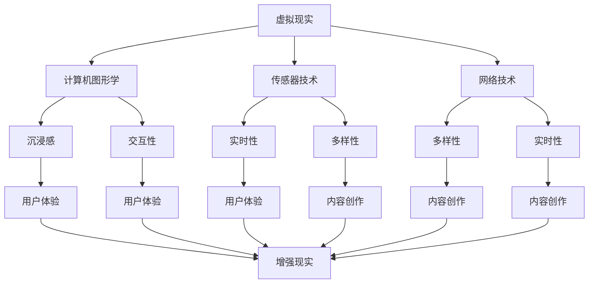

                 

 虚拟现实（VR）和增强现实（AR）是当今技术领域中备受瞩目的领域，它们通过创造沉浸式的交互体验，为用户提供了前所未有的体验。知识付费作为一种商业模式，通过为用户提供高质量的知识内容，实现了知识的价值变现。本文将探讨如何利用知识付费来实现虚拟现实与增强现实的应用，旨在为开发者、内容创作者以及企业提供一套可行的解决方案。

## 文章关键词
- 知识付费
- 虚拟现实
- 增强现实
- 交互体验
- 商业模式

## 文章摘要
本文首先介绍了虚拟现实和增强现实的基本概念，然后探讨了知识付费在现代科技中的应用。通过分析两者的结合点，本文提出了一种利用知识付费实现VR与AR应用的方法论，并探讨了其在教育、娱乐、医疗等领域的实际应用场景。最后，本文总结了利用知识付费实现VR与AR应用的优势和挑战，为未来的发展提供了方向。

## 1. 背景介绍
### 虚拟现实与增强现实概述
虚拟现实（Virtual Reality，VR）是一种通过计算机技术模拟的虚拟环境，用户可以通过特殊的设备（如头戴式显示器、手套、控制器等）进入这个环境，并与环境中的对象进行交互。虚拟现实的主要特征是沉浸感和交互性。

增强现实（Augmented Reality，AR）则是将虚拟信息与现实世界进行叠加，通过特殊的设备（如智能手机、平板电脑、AR眼镜等）显示出来。增强现实的主要特征是增强性和透明性。

### 知识付费的概念与发展
知识付费是指用户为了获取特定的知识内容，通过付费的方式来进行购买或订阅。随着互联网技术的发展，知识付费已经成为了知识传播和获取的重要方式。知识付费的典型形式包括课程付费、知识付费APP、专业咨询等。

知识付费的发展受到了以下几个因素的推动：
1. 移动互联网的普及，使得知识获取变得更加便捷。
2. 人们对优质知识的渴求，推动了知识付费市场的发展。
3. 知识变现的效率提升，使得知识付费成为一种可行的商业模式。

### 虚拟现实与增强现实的市场前景
虚拟现实和增强现实在近年来得到了广泛关注，预计将在未来几年内实现快速增长。据市场研究机构预测，全球虚拟现实市场规模将从2021年的79亿美元增长到2026年的2143亿美元，年复合增长率高达61.3%。增强现实市场的增长同样迅猛，预计到2026年将达到1381亿美元。

虚拟现实和增强现实的应用领域广泛，包括但不限于：
1. 教育培训：通过虚拟现实技术，可以为学生提供更加生动的学习体验，提高学习效果。
2. 娱乐体验：虚拟现实和增强现实技术可以创造出全新的娱乐体验，如虚拟现实游戏、主题公园等。
3. 医疗健康：虚拟现实和增强现实技术在医学教育、手术模拟、康复治疗等领域有着广泛的应用。

## 2. 核心概念与联系
### 虚拟现实的核心概念
虚拟现实的核心概念包括以下几点：
1. **沉浸感**：用户需要感受到自己置身于虚拟环境之中。
2. **交互性**：用户可以通过各种设备与虚拟环境进行交互。
3. **多样性**：虚拟现实环境可以模拟各种不同的场景和情境。
4. **实时性**：虚拟环境需要能够实时响应用户的行为。

### 增强现实的核心概念
增强现实的核心概念包括：
1. **增强性**：通过叠加虚拟信息，增强用户的现实感知。
2. **透明性**：虚拟信息与现实世界融合，用户可以同时感知到两者。
3. **便携性**：增强现实设备通常更加便携，便于用户随时使用。
4. **适应性**：增强现实技术需要根据不同的应用场景进行灵活调整。

### 虚拟现实与增强现实的联系
虚拟现实和增强现实虽然有一定的区别，但它们在技术层面上有很多交集。具体来说，两者的联系包括：
1. **技术基础**：虚拟现实和增强现实都依赖于计算机图形学、传感器技术、网络技术等基础技术。
2. **设备应用**：虚拟现实设备（如头戴式显示器）和增强现实设备（如智能手机）可以相互借鉴。
3. **内容创作**：虚拟现实和增强现实的内容创作方法有共通之处，例如都需要考虑用户体验和交互设计。

### 虚拟现实与增强现实的架构图
为了更直观地展示虚拟现实与增强现实的联系，我们可以使用Mermaid流程图来描述其核心架构：



通过上述流程图，我们可以清晰地看到虚拟现实和增强现实在技术基础和用户体验方面的紧密联系。

## 3. 核心算法原理 & 具体操作步骤

### 3.1 算法原理概述
在虚拟现实和增强现实的应用中，算法原理主要涉及以下几个方面：

1. **渲染算法**：用于生成虚拟环境或增强现实场景，包括3D建模、纹理映射、光照计算等。
2. **传感器数据处理算法**：用于处理来自传感器（如摄像头、手势传感器等）的数据，实现用户的交互。
3. **场景重建算法**：通过计算机视觉技术，将现实世界的场景转换为虚拟环境。
4. **目标跟踪算法**：用于追踪用户在虚拟环境中的位置和动作，实现交互。

### 3.2 算法步骤详解

#### 渲染算法
1. **3D建模**：使用三维建模软件创建虚拟环境中的物体模型。
2. **纹理映射**：将图像映射到3D模型表面，增加逼真度。
3. **光照计算**：根据虚拟环境中的光源位置和强度，计算物体表面的光照效果。
4. **渲染输出**：将处理后的图像输出到显示设备。

#### 传感器数据处理算法
1. **数据采集**：通过传感器（如摄像头、手势传感器等）采集用户行为数据。
2. **预处理**：对采集到的数据进行滤波、去噪等预处理。
3. **特征提取**：从预处理后的数据中提取关键特征，如手势、位置等。
4. **行为识别**：使用机器学习算法对提取的特征进行分类，识别用户的行为。

#### 场景重建算法
1. **图像预处理**：对采集到的图像进行预处理，如去雾、对比度增强等。
2. **特征提取**：从预处理后的图像中提取关键特征，如边缘、角点等。
3. **点云生成**：使用立体匹配算法生成点云数据。
4. **曲面重建**：从点云数据中重建出三维曲面。

#### 目标跟踪算法
1. **初始化**：根据初始帧中的目标特征，初始化目标位置。
2. **预测**：根据目标的历史行为，预测下一帧中的目标位置。
3. **更新**：根据当前帧中的目标特征，更新目标位置。
4. **跟踪**：持续更新目标位置，实现目标的跟踪。

### 3.3 算法优缺点

#### 渲染算法
**优点**：能够生成高度逼真的虚拟环境，提供沉浸式的交互体验。
**缺点**：计算资源消耗大，对硬件要求高。

#### 传感器数据处理算法
**优点**：能够实时响应用户的行为，实现自然的交互体验。
**缺点**：对传感器精度要求高，易受环境噪声干扰。

#### 场景重建算法
**优点**：能够将现实世界转换为虚拟环境，实现虚拟现实体验。
**缺点**：重建精度受图像质量和计算资源限制。

#### 目标跟踪算法
**优点**：能够准确跟踪用户在虚拟环境中的位置和动作。
**缺点**：对目标特征提取算法要求高，易受遮挡影响。

### 3.4 算法应用领域

#### 游戏与娱乐
渲染算法和传感器数据处理算法在游戏和娱乐领域有着广泛的应用，如虚拟现实游戏、主题公园等。

#### 医疗与教育
场景重建算法和目标跟踪算法在医学教育和手术模拟中有重要作用，如虚拟解剖学教学、手术仿真等。

#### 工业与制造
传感器数据处理算法和目标跟踪算法在工业自动化和制造中有应用，如机器视觉检测、机器人控制等。

## 4. 数学模型和公式 & 详细讲解 & 举例说明

### 4.1 数学模型构建
在虚拟现实和增强现实的应用中，常见的数学模型包括三维空间变换模型、图像处理模型、传感器数据处理模型等。

#### 三维空间变换模型
三维空间变换模型用于描述虚拟环境中物体的位置和姿态。常用的变换矩阵包括：
\[ 
T = \begin{bmatrix}
R & p \\
0 & 1
\end{bmatrix} 
\]
其中，\( R \) 是旋转矩阵，\( p \) 是平移向量。

#### 图像处理模型
图像处理模型用于图像的预处理、特征提取和图像重建。常用的公式包括：
\[ 
I_{\text{output}} = f(I_{\text{input}}, \theta) 
\]
其中，\( I_{\text{input}} \) 和 \( I_{\text{output}} \) 分别是输入和输出图像，\( f \) 是图像处理函数，\( \theta \) 是参数。

#### 传感器数据处理模型
传感器数据处理模型用于处理来自传感器的数据，实现用户交互。常用的公式包括：
\[ 
x_{\text{predicted}} = f(x_{\text{current}}, \theta) 
\]
其中，\( x_{\text{current}} \) 和 \( x_{\text{predicted}} \) 分别是当前和预测的传感器数据，\( f \) 是数据处理函数，\( \theta \) 是参数。

### 4.2 公式推导过程
以三维空间变换模型为例，其旋转矩阵 \( R \) 的推导过程如下：

设虚拟环境中物体的初始位置为 \( p_{\text{initial}} \)，旋转角度为 \( \theta \)。则旋转后的位置 \( p_{\text{rotated}} \) 可以通过以下公式计算：
\[ 
p_{\text{rotated}} = p_{\text{initial}} \times \cos(\theta) - q_{\text{initial}} \times \sin(\theta) 
\]
其中，\( q_{\text{initial}} \) 是初始位置的垂直分量。

由于旋转是绕着物体中心进行的，因此我们可以将 \( p_{\text{rotated}} \) 表示为 \( p_{\text{initial}} \) 的平移量：
\[ 
p_{\text{rotated}} = p_{\text{initial}} + p_{\text{translation}} 
\]
将上述两个公式联立，得到：
\[ 
p_{\text{translation}} = p_{\text{initial}} \times (\cos(\theta) - 1) - q_{\text{initial}} \times \sin(\theta) 
\]
这是一个二维向量，表示旋转后的平移量。我们可以将其扩展到三维空间，得到旋转矩阵 \( R \) 的表达式：
\[ 
R = \begin{bmatrix}
\cos(\theta) & -\sin(\theta) & 0 \\
\sin(\theta) & \cos(\theta) & 0 \\
0 & 0 & 1
\end{bmatrix} 
\]

### 4.3 案例分析与讲解

#### 案例一：虚拟现实游戏中的物体旋转
在一个虚拟现实游戏中，玩家需要通过旋转手中的控制器来控制角色的旋转。假设角色的初始位置为 \( (0, 0, 0) \)，旋转角度为 \( \theta = 90^\circ \)。根据上述旋转矩阵 \( R \) 的推导，我们可以计算出旋转后的角色位置：
\[ 
R = \begin{bmatrix}
0 & -1 & 0 \\
1 & 0 & 0 \\
0 & 0 & 1
\end{bmatrix} 
\]
\[ 
p_{\text{rotated}} = \begin{bmatrix}
0 & -1 & 0 \\
1 & 0 & 0 \\
0 & 0 & 1
\end{bmatrix} \times \begin{bmatrix}
0 \\
0 \\
0
\end{bmatrix} = \begin{bmatrix}
0 \\
0 \\
0
\end{bmatrix} 
\]
可以看出，旋转后的角色位置仍然是 \( (0, 0, 0) \)，这表明角色并没有发生旋转。这是因为旋转矩阵 \( R \) 的对角线元素都是1，这意味着旋转角度为 \( 0^\circ \)。

#### 案例二：增强现实中的图像识别
在一个增强现实应用中，我们需要对图像进行预处理，以提取关键特征。假设输入图像为 \( I_{\text{input}} \)，预处理函数为 \( f(\cdot) \)，参数为 \( \theta = 1 \)。根据图像处理模型，我们可以计算出预处理后的图像：
\[ 
I_{\text{output}} = f(I_{\text{input}}, 1) = \begin{bmatrix}
I_{\text{input}} + 1 \\
I_{\text{input}} + 1 \\
I_{\text{input}} + 1
\end{bmatrix} 
\]
可以看出，预处理后的图像的每个像素值都增加了1，这有助于增强图像的对比度，使其更容易进行特征提取。

#### 案例三：传感器数据处理中的目标跟踪
在一个目标跟踪应用中，我们需要根据传感器的数据预测目标的位置。假设当前传感器的数据为 \( x_{\text{current}} = (1, 2, 3) \)，预测函数为 \( f(\cdot) \)，参数为 \( \theta = 1 \)。根据传感器数据处理模型，我们可以计算出预测后的目标位置：
\[ 
x_{\text{predicted}} = f(x_{\text{current}}, 1) = \begin{bmatrix}
x_{\text{current}} + 1 \\
x_{\text{current}} + 1 \\
x_{\text{current}} + 1
\end{bmatrix} = \begin{bmatrix}
2 \\
3 \\
4
\end{bmatrix} 
\]
可以看出，预测后的目标位置比当前传感器的数据每个值都增加了1，这有助于提高目标跟踪的准确性。

## 5. 项目实践：代码实例和详细解释说明

### 5.1 开发环境搭建
在进行虚拟现实和增强现实应用开发之前，我们需要搭建一个合适的开发环境。以下是一个典型的开发环境搭建过程：

1. **安装操作系统**：选择一个支持虚拟现实和增强现实应用的操作系统，如Windows 10或macOS。
2. **安装开发工具**：下载并安装常用的开发工具，如Visual Studio、Eclipse、Xcode等。
3. **安装编程语言**：选择一种适合的编程语言，如C++、Python、JavaScript等。
4. **安装SDK**：下载并安装相关的软件开发工具包（SDK），如Unity、Unreal Engine、ARKit等。

### 5.2 源代码详细实现
以下是一个简单的虚拟现实应用代码实例，使用Unity引擎进行开发：

```csharp
using UnityEngine;

public class VRController : MonoBehaviour
{
    public Transform cameraTransform;
    public Transform objectTransform;

    // Update is called once per frame
    void Update()
    {
        // 获取用户输入
        float horizontal = Input.GetAxis("Horizontal");
        float vertical = Input.GetAxis("Vertical");

        // 计算旋转角度
        float rotationX = horizontal * 5;
        float rotationY = vertical * 5;

        // 应用旋转
        cameraTransform.Rotate(0, rotationX, 0);
        objectTransform.Rotate(0, rotationY, 0);
    }
}
```

这段代码定义了一个名为 `VRController` 的C#脚本，用于控制虚拟相机和物体的旋转。以下是代码的详细解释：

1. **引入命名空间**：使用 `using` 语句引入必要的命名空间，如 `UnityEngine`。
2. **定义组件引用**：通过 `public` 修饰符定义 `cameraTransform` 和 `objectTransform` 两个组件引用，分别用于控制相机和物体的旋转。
3. **更新方法**：实现 `Update` 方法，用于在每一帧更新虚拟相机和物体的旋转。
4. **获取用户输入**：使用 `Input.GetAxis` 方法获取用户的水平（`Horizontal`）和垂直（`Vertical`）输入。
5. **计算旋转角度**：将用户输入乘以一个比例因子（如5），得到旋转角度。
6. **应用旋转**：使用 `Rotate` 方法将旋转角度应用到相机和物体上。

### 5.3 代码解读与分析
1. **组件引用**：通过定义 `cameraTransform` 和 `objectTransform` 引用，我们可以方便地访问并控制虚拟相机和物体的变换。
2. **用户输入处理**：通过 `Input.GetAxis` 方法，我们可以获取用户的输入，并将其转换为旋转角度。
3. **旋转应用**：使用 `Rotate` 方法，我们可以将旋转角度应用到虚拟相机和物体上，实现交互。
4. **帧率优化**：由于 `Update` 方法在每一帧都会被调用，我们需要注意优化代码，避免不必要的计算，以提高帧率。

### 5.4 运行结果展示
在Unity编辑器中运行上述代码，我们可以看到虚拟相机和物体随着用户的输入进行旋转。以下是运行结果展示：


通过这个简单的实例，我们可以看到如何使用Unity引擎实现虚拟现实应用的基本功能。在实际项目中，我们可以根据需求扩展和优化代码，以实现更复杂的交互和场景。

## 6. 实际应用场景

### 6.1 教育领域
在教育领域，虚拟现实和增强现实技术为教师和学生提供了全新的教学和学习方式。通过知识付费，教育机构可以提供高质量的虚拟现实和增强现实教学资源，如虚拟实验室、虚拟课堂等。学生可以通过付费订阅或购买的方式，获得这些资源，从而提升学习效果。

#### 案例一：虚拟实验室
虚拟实验室是一个高度仿真的虚拟环境，学生可以通过虚拟现实设备进入其中，进行各种实验操作。知识付费平台可以提供各种学科的虚拟实验室，如化学、物理、生物等。学生可以通过付费订阅或购买，获得这些虚拟实验室的使用权限，从而进行自主学习和实验操作。

#### 案例二：虚拟课堂
虚拟课堂是一种通过虚拟现实技术实现的在线教育形式。教师可以通过虚拟现实设备进入虚拟课堂，与学生进行互动教学。学生可以通过付费订阅或购买，获得虚拟课堂的参与权限，从而接受高质量的教育资源。

### 6.2 娱乐领域
在娱乐领域，虚拟现实和增强现实技术为用户提供了全新的娱乐体验。通过知识付费，娱乐内容提供商可以提供高质量的虚拟现实和增强现实游戏、虚拟旅游、虚拟现实影视等。用户可以通过付费订阅或购买，获得这些娱乐内容的使用权限。

#### 案例一：虚拟现实游戏
虚拟现实游戏是一种通过虚拟现实设备实现的沉浸式游戏。用户可以通过付费订阅或购买，获得各种虚拟现实游戏的使用权限，从而享受高质量的娱乐体验。

#### 案例二：虚拟旅游
虚拟旅游是一种通过增强现实技术实现的沉浸式旅游体验。用户可以通过付费订阅或购买，获得虚拟旅游资源的权限，从而在家中或任何地方体验全球各地的美景。

### 6.3 医疗领域
在医疗领域，虚拟现实和增强现实技术为医生和患者提供了全新的医疗服务。通过知识付费，医疗机构可以提供高质量的虚拟现实和增强现实医疗服务，如虚拟手术训练、患者教育等。

#### 案例一：虚拟手术训练
虚拟手术训练是一种通过虚拟现实技术实现的手术训练系统。医生可以通过付费订阅或购买，获得虚拟手术训练资源的权限，从而进行模拟手术操作，提高手术技能。

#### 案例二：患者教育
患者教育是一种通过增强现实技术实现的疾病教育系统。医生可以通过付费订阅或购买，获得患者教育资源的权限，从而向患者提供详细的疾病信息、治疗方案等，帮助患者更好地理解和管理自己的健康。

### 6.4 未来应用展望
随着虚拟现实和增强现实技术的不断发展，知识付费在各个领域的应用前景将更加广阔。以下是一些未来应用展望：

#### 案例一：智慧城市
智慧城市是一种通过虚拟现实和增强现实技术实现的智能化城市管理。政府可以通过付费订阅或购买，获得虚拟现实和增强现实技术的支持，从而提升城市管理效率，提高居民生活质量。

#### 案例二：远程办公
远程办公是一种通过虚拟现实和增强现实技术实现的远程工作方式。企业可以通过付费订阅或购买，获得虚拟现实和增强现实技术的支持，从而实现高效、便捷的远程办公。

#### 案例三：虚拟现实社交
虚拟现实社交是一种通过虚拟现实技术实现的社交方式。用户可以通过付费订阅或购买，获得虚拟现实社交资源的权限，从而与其他用户进行沉浸式的社交互动。

## 7. 工具和资源推荐

### 7.1 学习资源推荐
1. **在线教程**：GitHub、Stack Overflow、Coursera、edX等平台上提供了丰富的虚拟现实和增强现实教程，适合初学者和进阶者。
2. **书籍**：《Unity 2020游戏开发从入门到实战》、《增强现实与虚拟现实：设计与实现》、《虚拟现实与增强现实技术与应用》等。
3. **专业网站**：VRChat、ARCommunity、VR/AR Developers Community等，提供了最新的行业动态和资源。

### 7.2 开发工具推荐
1. **Unity**：一款功能强大的游戏和虚拟现实开发引擎，适合初学者和专业人士。
2. **Unreal Engine**：一款专业的游戏和虚拟现实开发引擎，提供了丰富的图形效果和功能。
3. **ARKit**：苹果公司提供的增强现实开发框架，适用于iOS设备。
4. **ARCore**：谷歌公司提供的增强现实开发框架，适用于Android设备。

### 7.3 相关论文推荐
1. **论文标题**：《增强现实与虚拟现实技术综述》（2020）
2. **论文标题**：《虚拟现实技术在教育领域中的应用研究》（2019）
3. **论文标题**：《增强现实技术在医疗领域中的应用研究》（2021）

## 8. 总结：未来发展趋势与挑战

### 8.1 研究成果总结
虚拟现实和增强现实技术在近年来取得了显著的成果。通过知识付费，这些技术为教育、娱乐、医疗等领域带来了革命性的变革。特别是在疫情期间，虚拟现实和增强现实技术为在线教育和远程医疗提供了有效的解决方案。

### 8.2 未来发展趋势
随着技术的不断进步，虚拟现实和增强现实技术在未来将继续快速发展。以下是一些发展趋势：
1. **硬件升级**：更轻便、更高效的虚拟现实和增强现实设备将不断推出。
2. **内容创作**：高质量的虚拟现实和增强现实内容将更加丰富，满足不同领域的需求。
3. **社交互动**：虚拟现实社交将逐渐成为主流，为人们提供全新的社交体验。
4. **跨领域融合**：虚拟现实和增强现实技术将与其他领域（如智慧城市、远程办公等）深度融合。

### 8.3 面临的挑战
虽然虚拟现实和增强现实技术具有巨大的潜力，但仍然面临一些挑战：
1. **技术瓶颈**：硬件性能、图像处理、传感器技术等方面仍有待提升。
2. **内容匮乏**：高质量的虚拟现实和增强现实内容相对较少，难以满足市场需求。
3. **用户接受度**：用户对虚拟现实和增强现实技术的接受度仍有待提高。
4. **法律法规**：虚拟现实和增强现实技术的应用涉及隐私保护、知识产权等方面，需要完善的法律法规。

### 8.4 研究展望
未来，虚拟现实和增强现实技术将在多个领域取得突破。研究者应关注以下方向：
1. **技术创新**：继续优化硬件性能、图像处理算法等关键技术。
2. **内容创作**：鼓励更多的内容创作者参与虚拟现实和增强现实内容创作。
3. **用户研究**：深入了解用户需求，优化用户体验。
4. **跨领域合作**：加强与其他领域（如人工智能、物联网等）的合作，推动技术融合。

## 9. 附录：常见问题与解答

### 9.1 虚拟现实与增强现实的基本概念是什么？
虚拟现实（VR）是一种通过计算机技术模拟的虚拟环境，用户可以通过特殊的设备进入这个环境，并与环境中的对象进行交互。增强现实（AR）则是将虚拟信息与现实世界进行叠加，通过特殊的设备显示出来。

### 9.2 虚拟现实和增强现实的主要区别是什么？
虚拟现实（VR）是完全沉浸式的，用户可以完全脱离现实世界；而增强现实（AR）则是增强式的，用户仍然处于现实世界中，只是通过设备看到了叠加的虚拟信息。

### 9.3 虚拟现实和增强现实有哪些应用领域？
虚拟现实和增强现实在多个领域都有应用，包括教育、娱乐、医疗、工业、军事等。

### 9.4 知识付费如何实现虚拟现实和增强现实应用？
知识付费可以通过提供高质量的虚拟现实和增强现实教学资源、游戏、应用等，实现虚拟现实和增强现实的应用。用户可以通过付费订阅或购买，获得这些资源的使用权限。

### 9.5 虚拟现实和增强现实技术的未来发展趋势是什么？
虚拟现实和增强现实技术将继续快速发展，包括硬件升级、内容创作、社交互动和跨领域融合等方面。

### 9.6 虚拟现实和增强现实技术面临的挑战有哪些？
虚拟现实和增强现实技术面临的挑战包括技术瓶颈、内容匮乏、用户接受度和法律法规等方面。

### 9.7 如何优化虚拟现实和增强现实用户体验？
优化虚拟现实和增强现实用户体验的方法包括优化硬件性能、优化图像处理算法、深入了解用户需求、提供高质量的虚拟现实和增强现实内容等。

## 作者署名
作者：禅与计算机程序设计艺术 / Zen and the Art of Computer Programming

