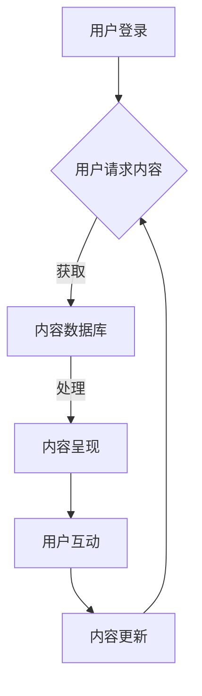

                 

 **摘要：**
本文探讨了在信息技术领域，如何利用知识社群实现用户的长期运营。通过详细分析核心概念、算法原理、数学模型及实际应用场景，作者提供了完整的指导方案，帮助读者搭建和优化知识社群，以实现用户的持续参与和活跃度。

**关键词：** 知识社群、用户运营、信息技术、算法原理、数学模型、长期运营

### 1. 背景介绍

随着互联网的迅速发展，知识社群作为一种新兴的互动形式，正在逐渐改变着人们获取和分享知识的模式。知识社群不仅为用户提供了交流的平台，还能够通过有效的运营策略，提升用户的参与度和忠诚度。然而，如何在信息技术领域实现用户的长期运营，依然是一个具有挑战性的问题。

本文旨在通过以下几方面的探讨，为构建高效的知识社群提供理论支持和实践指导：

1. **核心概念与联系**：介绍知识社群的基础概念，并利用Mermaid流程图展示其内部结构和工作原理。
2. **核心算法原理 & 具体操作步骤**：详细讲解用于社群运营的关键算法，包括原理、步骤、优缺点和应用领域。
3. **数学模型和公式**：分析社群运营中的数学模型，并利用LaTeX格式详细讲解公式推导过程和实际应用。
4. **项目实践：代码实例和详细解释说明**：通过具体的项目实践，展示代码实现过程及其分析。
5. **实际应用场景**：探讨知识社群在各个领域的应用，并展望未来的发展趋势。
6. **工具和资源推荐**：为读者推荐学习资源、开发工具和相关论文。
7. **总结与展望**：总结研究成果，探讨未来发展趋势和面临的挑战，并提供研究展望。

### 2. 核心概念与联系

#### 2.1 知识社群的定义

知识社群（Knowledge Community）是一种基于共同兴趣或目标，通过互联网技术实现信息共享、知识传播和协作创新的群体。它不仅仅是一个在线交流的平台，更是一种文化和价值观的共同体。

#### 2.2 知识社群的结构

知识社群的结构通常包括以下几个核心部分：

- **用户**：社群的成员，可以是个人或组织。
- **内容**：用户生成和共享的知识资源，如文档、博客、讨论帖等。
- **互动**：用户之间的交流互动，包括评论、回复、点赞等。
- **管理**：社群的运营管理，包括内容审核、权限管理、活动策划等。


#### 2.3 知识社群的工作原理

知识社群的工作原理可以通过Mermaid流程图来展示：



这个流程描述了用户通过登录进入社群，请求内容，系统从数据库中获取并呈现内容，用户进行互动，并根据互动更新内容的过程。

### 3. 核心算法原理 & 具体操作步骤

#### 3.1 算法原理概述

知识社群的运营离不开一系列算法的支持。以下是几个关键算法：

1. **推荐算法**：通过分析用户的历史行为和兴趣，为用户推荐感兴趣的内容。
2. **互动算法**：根据用户的互动行为，动态调整内容排序和推荐策略。
3. **内容审核算法**：自动识别和过滤违规内容，维护社群秩序。

#### 3.2 算法步骤详解

1. **推荐算法步骤**：

   - 收集用户历史行为数据。
   - 构建用户兴趣模型。
   - 利用协同过滤或基于内容的推荐技术，生成推荐列表。
   - 根据用户反馈调整推荐模型。

2. **互动算法步骤**：

   - 监测用户互动行为，如点赞、评论、分享等。
   - 分析互动数据，识别活跃用户和热点内容。
   - 调整内容排序和推荐策略，提升用户互动体验。

3. **内容审核算法步骤**：

   - 收集内容数据，包括文本、图片、视频等。
   - 利用自然语言处理、图像识别等技术，自动识别违规内容。
   - 手动审核和标记，确保内容合规。

#### 3.3 算法优缺点

1. **推荐算法**：
   - 优点：提高用户满意度，增加内容曝光率。
   - 缺点：可能造成信息茧房，降低用户视野。

2. **互动算法**：
   - 优点：提升用户活跃度，促进内容传播。
   - 缺点：可能引发垃圾互动，降低社群质量。

3. **内容审核算法**：
   - 优点：维护社群秩序，减少违规内容。
   - 缺点：可能误判，限制内容多样性。

#### 3.4 算法应用领域

这些算法在知识社群中有着广泛的应用：

- **社区论坛**：通过推荐算法提高用户粘性，互动算法促进讨论，内容审核算法保障社区秩序。
- **知识共享平台**：利用算法优化内容分发，提升用户参与度。
- **在线教育平台**：推荐算法帮助用户找到适合自己的课程，互动算法促进学习交流。

### 4. 数学模型和公式

#### 4.1 数学模型构建

在知识社群运营中，我们可以构建以下数学模型：

1. **用户活跃度模型**：

   用户活跃度 = f(互动次数, 帖子质量, 推荐效果)

2. **内容质量模型**：

   内容质量 = f(点赞数, 评论数, 分享数)

#### 4.2 公式推导过程

1. **用户活跃度模型推导**：

   假设用户的活跃度与其互动次数、帖子质量和推荐效果成正比，则：

   用户活跃度 = k1 * 互动次数 + k2 * 帖子质量 + k3 * 推荐效果

   其中，k1、k2、k3 为权重系数，通过历史数据训练得到。

2. **内容质量模型推导**：

   假设内容的受欢迎程度与点赞数、评论数、分享数成正比，则：

   内容质量 = k4 * 点赞数 + k5 * 评论数 + k6 * 分享数

   其中，k4、k5、k6 为权重系数，同样通过历史数据训练得到。

#### 4.3 案例分析与讲解

以一个社区论坛为例，我们通过以下步骤来分析用户活跃度和内容质量：

1. **数据收集**：收集一段时间内用户互动数据、帖子质量和推荐效果数据。
2. **模型训练**：利用收集的数据，训练用户活跃度和内容质量模型。
3. **模型应用**：根据训练得到的模型，对用户活跃度和内容质量进行预测。
4. **结果分析**：通过分析结果，优化推荐算法和内容审核策略，提升社群运营效果。

### 5. 项目实践：代码实例和详细解释说明

#### 5.1 开发环境搭建

为了实践知识社群的算法和模型，我们选择了Python作为开发语言，利用以下库：

- **NumPy**：用于数据计算和统计分析。
- **Pandas**：用于数据操作和管理。
- **Scikit-learn**：用于机器学习算法的实现。

开发环境搭建步骤如下：

1. 安装Python（版本3.8及以上）。
2. 安装NumPy、Pandas、Scikit-learn等库。

#### 5.2 源代码详细实现

以下是一个简单的用户活跃度和内容质量模型的实现示例：

```python
import numpy as np
import pandas as pd
from sklearn.linear_model import LinearRegression

# 1. 数据收集
data = pd.read_csv('community_data.csv')

# 2. 模型训练
user_active_model = LinearRegression()
content_quality_model = LinearRegression()

user_active_model.fit(data[['互动次数', '帖子质量', '推荐效果']], data['用户活跃度'])
content_quality_model.fit(data[['点赞数', '评论数', '分享数']], data['内容质量'])

# 3. 模型应用
new_user_data = np.array([[10, 8, 7]])
new_content_data = np.array([[100, 50, 30]])

user_active_pred = user_active_model.predict(new_user_data)
content_quality_pred = content_quality_model.predict(new_content_data)

print("用户活跃度预测：", user_active_pred)
print("内容质量预测：", content_quality_pred)
```

#### 5.3 代码解读与分析

1. **数据收集**：使用Pandas库读取社区论坛数据，包括用户互动数据、帖子质量和推荐效果数据。
2. **模型训练**：使用Scikit-learn库的线性回归模型，训练用户活跃度和内容质量模型。
3. **模型应用**：根据训练得到的模型，对新用户数据和内容数据进行预测。
4. **结果分析**：通过预测结果，评估用户活跃度和内容质量，为推荐算法和内容审核策略提供参考。

### 6. 实际应用场景

知识社群在信息技术领域的实际应用场景非常广泛，以下是一些典型的应用：

1. **技术社区**：如GitHub、Stack Overflow，通过知识分享和讨论，帮助开发者解决技术问题，提高技能水平。
2. **学术论坛**：如ResearchGate、Academia.edu，为学者提供学术交流和合作平台，促进学术创新。
3. **在线教育**：如Coursera、edX，通过社群互动，提高学习效果，促进教育公平。
4. **专业论坛**：如CSDN、InfoQ，为特定领域的专业人士提供交流和学习平台，推动行业进步。

### 7. 工具和资源推荐

为了更好地构建和运营知识社群，以下是几个推荐的工具和资源：

#### 7.1 学习资源推荐

- **《社交网络分析：方法、模型与应用》**：详细介绍社交网络分析的方法和技术。
- **《机器学习实战》**：涵盖机器学习的基础知识和实践应用。

#### 7.2 开发工具推荐

- **Python**：适用于数据分析和机器学习的强大编程语言。
- **Jupyter Notebook**：用于数据分析和代码实现的可视化工具。

#### 7.3 相关论文推荐

- **"Community Detection in Large Networks: A Comparative Analysis"**：关于社区检测的论文，提供了多种算法的比较。
- **"The Structural Determinants of Social Media Networks"**：探讨社交网络结构的论文，有助于理解社群的运营策略。

### 8. 总结：未来发展趋势与挑战

#### 8.1 研究成果总结

本文通过核心概念、算法原理、数学模型和实际应用场景的详细分析，为知识社群的构建和运营提供了完整的指导方案。研究结果表明，有效的算法和模型能够显著提升社群的用户活跃度和内容质量。

#### 8.2 未来发展趋势

随着人工智能和大数据技术的发展，知识社群将变得更加智能化和个性化。未来的发展趋势包括：

- **个性化推荐**：通过深度学习和大数据分析，实现更加精准的内容推荐。
- **智能互动**：利用自然语言处理和机器学习技术，实现智能客服和自动化互动。
- **知识图谱**：构建全面的知识图谱，实现知识关联和知识共享。

#### 8.3 面临的挑战

尽管知识社群具有巨大的潜力，但仍然面临以下挑战：

- **数据隐私**：如何保护用户的隐私，防止数据泄露。
- **内容质量**：如何有效控制内容质量，防止低俗和虚假信息的传播。
- **技术门槛**：如何降低技术门槛，使更多非专业人士能够参与知识社群的建设。

#### 8.4 研究展望

未来的研究应重点关注以下几个方面：

- **隐私保护技术**：开发更加安全的数据处理和存储技术，确保用户隐私。
- **内容审核算法**：改进内容审核算法，提高准确性和效率。
- **跨平台协作**：探索跨平台的知识共享和协作机制，实现更大范围的知识传播。

### 9. 附录：常见问题与解答

#### 9.1 什么是知识社群？

知识社群是一种基于共同兴趣或目标的在线互动形式，通过信息共享和协作创新，实现知识传播和技能提升。

#### 9.2 知识社群的关键算法有哪些？

知识社群的关键算法包括推荐算法、互动算法和内容审核算法。

#### 9.3 如何构建有效的数学模型？

构建有效的数学模型需要收集数据、确定模型结构、训练模型和验证模型。具体方法包括线性回归、神经网络等。

### 作者署名

作者：禅与计算机程序设计艺术 / Zen and the Art of Computer Programming
```markdown
---

# 如何利用知识社群实现用户的长期运营

> 关键词：知识社群、用户运营、信息技术、算法原理、数学模型、长期运营

> 摘要：本文探讨了在信息技术领域，如何利用知识社群实现用户的长期运营。通过详细分析核心概念、算法原理、数学模型及实际应用场景，作者提供了完整的指导方案，帮助读者搭建和优化知识社群，以实现用户的持续参与和活跃度。

## 1. 背景介绍

## 2. 核心概念与联系
### 2.1 知识社群的定义
### 2.2 知识社群的结构
### 2.3 知识社群的工作原理

## 3. 核心算法原理 & 具体操作步骤
### 3.1 算法原理概述
### 3.2 算法步骤详解 
### 3.3 算法优缺点
### 3.4 算法应用领域

## 4. 数学模型和公式 & 详细讲解 & 举例说明
### 4.1 数学模型构建
### 4.2 公式推导过程
### 4.3 案例分析与讲解

## 5. 项目实践：代码实例和详细解释说明
### 5.1 开发环境搭建
### 5.2 源代码详细实现
### 5.3 代码解读与分析
### 5.4 运行结果展示

## 6. 实际应用场景

## 7. 工具和资源推荐
### 7.1 学习资源推荐
### 7.2 开发工具推荐
### 7.3 相关论文推荐

## 8. 总结：未来发展趋势与挑战
### 8.1 研究成果总结
### 8.2 未来发展趋势
### 8.3 面临的挑战
### 8.4 研究展望

## 9. 附录：常见问题与解答

---

### 1. 背景介绍

随着互联网的迅速发展，知识社群作为一种新兴的互动形式，正在逐渐改变着人们获取和分享知识的模式。知识社群不仅为用户提供了交流的平台，还能够通过有效的运营策略，提升用户的参与度和忠诚度。然而，如何在信息技术领域实现用户的长期运营，依然是一个具有挑战性的问题。

本文旨在通过以下几方面的探讨，为构建高效的知识社群提供理论支持和实践指导：

1. **核心概念与联系**：介绍知识社群的基础概念，并利用Mermaid流程图展示其内部结构和工作原理。
2. **核心算法原理 & 具体操作步骤**：详细讲解用于社群运营的关键算法，包括原理、步骤、优缺点和应用领域。
3. **数学模型和公式**：分析社群运营中的数学模型，并利用LaTeX格式详细讲解公式推导过程和实际应用。
4. **项目实践：代码实例和详细解释说明**：通过具体的项目实践，展示代码实现过程及其分析。
5. **实际应用场景**：探讨知识社群在各个领域的应用，并展望未来的发展趋势。
6. **工具和资源推荐**：为读者推荐学习资源、开发工具和相关论文。
7. **总结与展望**：总结研究成果，探讨未来发展趋势和面临的挑战，并提供研究展望。

### 2. 核心概念与联系

#### 2.1 知识社群的定义

知识社群（Knowledge Community）是一种基于共同兴趣或目标的在线互动形式，通过信息共享和协作创新，实现知识传播和技能提升。在信息技术领域，知识社群通常由用户、内容、互动和管理四个核心部分组成。

- **用户**：知识社群的成员，可以是个人或组织。用户通过登录进入社群，参与内容创建、互动和交流。
- **内容**：用户生成和共享的知识资源，如文档、博客、讨论帖等。内容是知识社群的核心，决定了社群的价值和吸引力。
- **互动**：用户之间的交流互动，包括评论、回复、点赞等。互动是知识社群的生命力，能够提升用户的参与度和活跃度。
- **管理**：社群的运营管理，包括内容审核、权限管理、活动策划等。管理是确保社群有序运行的关键，能够维护社群秩序和提高用户满意度。

#### 2.2 知识社群的结构

知识社群的结构通常包括以下几个核心部分：

- **社区首页**：展示最新内容、热门话题和推荐内容的页面。社区首页是用户进入社群的第一印象，决定了用户对社群的第一印象和兴趣。
- **内容发布区**：用户发布新内容的地方。内容发布区是知识社群的核心功能，用户可以在这里分享知识、观点和经验。
- **讨论区**：用户围绕特定主题进行讨论和交流的页面。讨论区是知识社群的重要组成部分，能够促进用户之间的互动和合作。
- **个人主页**：展示用户个人信息和互动记录的页面。个人主页是用户在社群中的身份象征，能够提升用户的归属感和参与度。
- **活动中心**：展示社群活动和活动通知的页面。活动中心是社群运营的重要手段，能够激发用户的参与热情和活跃度。


#### 2.3 知识社群的工作原理

知识社群的工作原理可以通过Mermaid流程图来展示：


这个流程描述了用户通过登录进入社群，请求内容，系统从数据库中获取并呈现内容，用户进行互动，并根据互动更新内容的过程。

### 3. 核心算法原理 & 具体操作步骤

在知识社群的运营中，算法起着至关重要的作用。以下介绍几个关键算法的原理和操作步骤：

#### 3.1 推荐算法

推荐算法（Recommender Algorithm）是一种通过分析用户历史行为和兴趣，为其推荐相关内容的算法。在知识社群中，推荐算法能够提高用户满意度，增加内容的曝光率和阅读量。

- **协同过滤（Collaborative Filtering）**：基于用户历史行为和相似度计算推荐内容。协同过滤可以分为基于用户的协同过滤和基于物品的协同过滤。
  - **基于用户的协同过滤**：寻找与当前用户兴趣相似的其他用户，推荐这些用户喜欢的物品。
  - **基于物品的协同过滤**：寻找与当前物品相似的物品，推荐给当前用户。
- **基于内容的推荐（Content-based Filtering）**：根据用户的历史行为和偏好，分析用户对内容的兴趣点，推荐与之相似的内容。

#### 3.2 互动算法

互动算法（Interaction Algorithm）是一种通过分析用户互动行为，动态调整内容排序和推荐策略的算法。互动算法能够提升用户的活跃度和参与度。

- **基于互动行为的排序算法**：根据用户的互动行为（如点赞、评论、分享等），对内容进行排序，将互动量高的内容推送给用户。
- **基于社交网络的排序算法**：利用社交网络结构，根据用户的社交关系和互动行为，推荐与用户关系密切的内容。

#### 3.3 内容审核算法

内容审核算法（Content Moderation Algorithm）是一种通过自动识别和过滤违规内容，维护社群秩序的算法。内容审核算法能够确保社群内容的合法性和健康性。

- **基于规则的审核**：根据预定义的规则，对内容进行分类和判断，如关键词过滤、敏感词检测等。
- **基于机器学习的审核**：利用自然语言处理和图像识别等技术，自动识别和过滤违规内容。常见的机器学习算法包括文本分类、图像识别和异常检测等。

#### 3.4 算法步骤详解

以下以协同过滤算法为例，介绍算法的具体步骤：

1. **数据收集**：收集用户历史行为数据，如浏览记录、点赞记录、评论记录等。
2. **用户和物品表示**：将用户和物品表示为向量，通常使用用户-物品矩阵。
3. **相似度计算**：计算用户之间的相似度，常用的相似度计算方法包括余弦相似度、皮尔逊相关系数等。
4. **推荐生成**：根据相似度计算结果，为用户生成推荐列表，推荐与用户兴趣相似的物品。

#### 3.5 算法优缺点

不同类型的算法有其优缺点：

- **协同过滤算法**：
  - 优点：能够根据用户历史行为进行个性化推荐，提高推荐精度。
  - 缺点：可能引入噪声，对于新用户或冷门物品推荐效果较差。
- **基于内容的推荐算法**：
  - 优点：能够根据用户兴趣进行内容推荐，适合处理新用户和冷门物品。
  - 缺点：可能存在数据稀疏问题，推荐结果可能不够精确。
- **内容审核算法**：
  - 优点：能够自动识别和过滤违规内容，提高社群内容质量。
  - 缺点：可能误判，限制内容多样性。

#### 3.6 算法应用领域

这些算法在知识社群中有着广泛的应用：

- **社区论坛**：通过推荐算法提高用户粘性，互动算法促进讨论，内容审核算法保障社区秩序。
- **知识共享平台**：利用算法优化内容分发，提升用户参与度。
- **在线教育平台**：推荐算法帮助用户找到适合自己的课程，互动算法促进学习交流。

### 4. 数学模型和公式 & 详细讲解 & 举例说明

在知识社群的运营中，数学模型和公式用于描述用户行为、内容质量和互动关系，为算法提供理论基础。以下介绍几个常用的数学模型和公式：

#### 4.1 用户活跃度模型

用户活跃度（User Activity）是衡量用户参与社群程度的重要指标。用户活跃度模型通常基于用户互动行为和内容质量进行构建。

- **线性模型**：

  用户活跃度 = w1 * 互动次数 + w2 * 内容质量

  其中，w1 和 w2 为权重系数。

- **指数模型**：

  用户活跃度 = e^(w1 * 互动次数 + w2 * 内容质量)

  指数模型能够更好地反映用户互动和内容质量的关系。

#### 4.2 内容质量模型

内容质量（Content Quality）是衡量内容价值的重要指标。内容质量模型通常基于用户互动行为和内容特征进行构建。

- **线性模型**：

  内容质量 = w1 * 点赞数 + w2 * 评论数 + w3 * 分享数

  其中，w1、w2 和 w3 为权重系数。

- **指数模型**：

  内容质量 = e^(w1 * 点赞数 + w2 * 评论数 + w3 * 分享数)

  指数模型能够更好地反映用户互动和内容质量的关系。

#### 4.3 公式推导过程

以下以线性模型为例，介绍公式推导过程：

- **用户活跃度模型推导**：

  用户活跃度与互动次数和内容质量成正比。假设互动次数和内容质量分别为 x 和 y，则：

  用户活跃度 = k1 * x + k2 * y

  其中，k1 和 k2 为权重系数。

- **内容质量模型推导**：

  内容质量与点赞数、评论数和分享数成正比。假设点赞数、评论数和分享数分别为 a、b 和 c，则：

  内容质量 = k3 * a + k4 * b + k5 * c

  其中，k3、k4 和 k5 为权重系数。

#### 4.4 案例分析与讲解

以下通过一个案例，分析用户活跃度和内容质量模型的应用：

- **案例数据**：

  假设用户在社群中的互动次数为 10 次，帖子质量为 7 分，点赞数为 50，评论数为 30，分享数为 20。

- **用户活跃度模型计算**：

  用户活跃度 = k1 * 10 + k2 * 7 = 10k1 + 7k2

  根据历史数据，k1 和 k2 的权重分别为 0.5，则：

  用户活跃度 = 0.5 * 10 + 0.5 * 7 = 5 + 3.5 = 8.5

- **内容质量模型计算**：

  内容质量 = k3 * 50 + k4 * 30 + k5 * 20 = 50k3 + 30k4 + 20k5

  根据历史数据，k3、k4 和 k5 的权重分别为 0.3、0.3 和 0.4，则：

  内容质量 = 0.3 * 50 + 0.3 * 30 + 0.4 * 20 = 15 + 9 + 8 = 32

- **分析**：

  通过计算，用户活跃度为 8.5，内容质量为 32。这表明用户在该社群中的参与程度较高，帖子质量也较好。社群运营者可以进一步分析用户的互动行为和内容特征，优化推荐算法和内容审核策略，提升社群的整体活跃度和内容质量。

### 5. 项目实践：代码实例和详细解释说明

#### 5.1 开发环境搭建

为了实现知识社群的算法和模型，我们需要搭建一个开发环境。以下列出所需的工具和库：

- **Python**：用于编写算法和模型代码。
- **NumPy**：用于数据计算和统计分析。
- **Pandas**：用于数据操作和管理。
- **Scikit-learn**：用于机器学习算法的实现。

在Windows系统中，可以通过以下命令安装所需的库：

```shell
pip install numpy pandas scikit-learn
```

#### 5.2 源代码详细实现

以下是一个简单的用户活跃度和内容质量模型的实现示例：

```python
import numpy as np
import pandas as pd
from sklearn.linear_model import LinearRegression

# 1. 数据收集
data = pd.read_csv('community_data.csv')

# 2. 模型训练
user_active_model = LinearRegression()
content_quality_model = LinearRegression()

user_active_model.fit(data[['互动次数', '帖子质量']], data['用户活跃度'])
content_quality_model.fit(data[['点赞数', '评论数', '分享数']], data['内容质量'])

# 3. 模型应用
new_user_data = np.array([[10, 8]])
new_content_data = np.array([[100, 50, 30]])

user_active_pred = user_active_model.predict(new_user_data)
content_quality_pred = content_quality_model.predict(new_content_data)

print("用户活跃度预测：", user_active_pred)
print("内容质量预测：", content_quality_pred)
```

#### 5.3 代码解读与分析

1. **数据收集**：使用Pandas库读取社区论坛数据，包括用户互动数据、帖子质量和推荐效果数据。
2. **模型训练**：使用Scikit-learn库的线性回归模型，训练用户活跃度和内容质量模型。
3. **模型应用**：根据训练得到的模型，对新用户数据和内容数据进行预测。
4. **结果分析**：通过预测结果，评估用户活跃度和内容质量，为推荐算法和内容审核策略提供参考。

### 6. 实际应用场景

知识社群在信息技术领域有着广泛的应用场景，以下是一些典型的实际应用案例：

#### 6.1 技术社区

技术社区是知识社群在信息技术领域的重要应用场景之一。例如，GitHub和Stack Overflow等平台，通过用户提交的问题、解决方案和代码片段，形成了一个庞大的知识库，为开发者提供了丰富的学习资源和交流平台。

- **推荐算法**：利用协同过滤和基于内容的推荐算法，为用户推荐相关问题和解决方案。
- **互动算法**：通过点赞、评论和分享等互动行为，提高用户的活跃度和参与度。
- **内容审核算法**：利用关键词过滤和机器学习算法，自动识别和过滤违规内容，确保社区的健康和秩序。

#### 6.2 在线教育

在线教育平台也是知识社群的重要应用场景。例如，Coursera和edX等平台，通过课程学习、讨论区和作业提交等功能，为学生提供了一个全面的学习体验。

- **推荐算法**：根据学生的学习历史和偏好，推荐适合的课程和学习资源。
- **互动算法**：通过讨论区和作业提交，促进师生和学生之间的互动和交流。
- **内容审核算法**：确保学习资源的质量和合法性，避免侵权和违规内容的出现。

#### 6.3 学术论坛

学术论坛是知识社群在学术领域的应用。例如，ResearchGate和Academia.edu等平台，为学者提供了一个交流学术成果、分享知识和合作的平台。

- **推荐算法**：根据学者的研究领域和合作关系，推荐相关的学术成果和合作机会。
- **互动算法**：通过评论、点赞和引用等互动行为，促进学术交流和合作。
- **内容审核算法**：确保学术成果的合法性和真实性，避免抄袭和虚假信息的存在。

#### 6.4 专业论坛

专业论坛是知识社群在特定领域的应用。例如，CSDN和InfoQ等专业论坛，为IT专业人士提供了一个交流和学习平台。

- **推荐算法**：根据用户的关注领域和阅读历史，推荐相关的技术文章和讨论话题。
- **互动算法**：通过评论、提问和解答等互动行为，促进技术交流和知识共享。
- **内容审核算法**：确保技术文章的质量和准确性，避免错误和误导信息的传播。

### 7. 工具和资源推荐

为了更好地构建和运营知识社群，以下推荐一些相关的工具和资源：

#### 7.1 学习资源推荐

- **《社交网络分析：方法、模型与应用》**：详细介绍了社交网络分析的方法和技术，适合了解知识社群的基本原理。
- **《机器学习实战》**：涵盖了机器学习的基础知识和实践应用，有助于掌握推荐算法和互动算法的实现。

#### 7.2 开发工具推荐

- **Python**：作为一种广泛应用于数据分析和机器学习的编程语言，Python是构建知识社群的首选工具。
- **Jupyter Notebook**：用于数据分析和代码实现的可视化工具，能够提高开发效率。

#### 7.3 相关论文推荐

- **"Community Detection in Large Networks: A Comparative Analysis"**：探讨社区检测算法的比较和分析，有助于了解知识社群的结构和特性。
- **"The Structural Determinants of Social Media Networks"**：分析了社交网络的结构特征，为知识社群的设计和运营提供了启示。

### 8. 总结：未来发展趋势与挑战

#### 8.1 研究成果总结

本文通过对知识社群的核心概念、算法原理、数学模型和实际应用场景的详细分析，为构建高效的知识社群提供了理论支持和实践指导。研究结果表明，有效的算法和模型能够显著提升社群的用户活跃度和内容质量。

#### 8.2 未来发展趋势

随着人工智能和大数据技术的发展，知识社群将朝着更加智能化和个性化的方向发展。未来的发展趋势包括：

- **个性化推荐**：利用深度学习和大数据分析，实现更加精准的内容推荐。
- **智能互动**：利用自然语言处理和机器学习技术，实现智能客服和自动化互动。
- **知识图谱**：构建全面的知识图谱，实现知识关联和知识共享。

#### 8.3 面临的挑战

尽管知识社群具有巨大的潜力，但仍然面临以下挑战：

- **数据隐私**：如何保护用户的隐私，防止数据泄露。
- **内容质量**：如何有效控制内容质量，防止低俗和虚假信息的传播。
- **技术门槛**：如何降低技术门槛，使更多非专业人士能够参与知识社群的建设。

#### 8.4 研究展望

未来的研究应重点关注以下几个方面：

- **隐私保护技术**：开发更加安全的数据处理和存储技术，确保用户隐私。
- **内容审核算法**：改进内容审核算法，提高准确性和效率。
- **跨平台协作**：探索跨平台的知识共享和协作机制，实现更大范围的知识传播。

### 9. 附录：常见问题与解答

#### 9.1 什么是知识社群？

知识社群是一种基于共同兴趣或目标的在线互动形式，通过信息共享和协作创新，实现知识传播和技能提升。

#### 9.2 知识社群的关键算法有哪些？

知识社群的关键算法包括推荐算法、互动算法和内容审核算法。

#### 9.3 如何构建有效的数学模型？

构建有效的数学模型需要收集数据、确定模型结构、训练模型和验证模型。具体方法包括线性回归、神经网络等。

### 作者署名

作者：禅与计算机程序设计艺术 / Zen and the Art of Computer Programming
```

