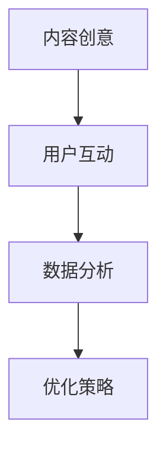

                 

 在数字时代，短视频平台已经成为信息传播和知识分享的重要渠道。作为程序员，您可能已经意识到，这种媒介不仅为技术知识的传播提供了广泛的空间，还为您提供了一个直接与观众互动的机会。本篇文章旨在探讨如何利用短视频平台成功销售编程课程。无论您是一位经验丰富的程序员还是刚入门的新手，以下策略都将帮助您在竞争激烈的市场中脱颖而出。

## 文章关键词

- 短视频平台
- 编程课程销售
- 程序员营销
- 视频内容制作
- 用户互动
- 互联网教育

## 文章摘要

本文将带领程序员了解如何有效地利用短视频平台，通过制定策略、优化内容、提升用户互动和利用数据分析来销售编程课程。我们将讨论从内容创意到推广策略的各个步骤，并提供实用建议和最佳实践，帮助您在互联网教育领域取得成功。

## 1. 背景介绍

### 短视频平台的崛起

短视频平台，如抖音（TikTok）、快手（Kuaishou）、Bilibili 等，近年来在全球范围内迅速崛起。这些平台以其高用户参与度和快速内容传播能力，成为品牌推广和知识传播的重要渠道。根据统计数据，全球短视频用户数量已经超过数十亿，这一数字还在不断增长。这为程序员提供了前所未有的市场机会。

### 编程教育的需求

随着技术的快速发展，编程已成为许多行业的关键技能。无论是传统IT行业还是新兴领域，如人工智能、区块链、大数据等，编程能力都是不可或缺的。因此，越来越多的人开始寻求学习编程的知识和课程。短视频平台提供了快速、便捷的学习方式，使得编程教育变得更加普及。

### 程序员的优势

作为程序员，您具有独特的优势。您不仅熟悉技术知识，还了解如何将复杂的编程概念简化为易于理解的内容。此外，您可以通过编程实践展示自己的技术能力，从而增强观众对您课程的信任。

## 2. 核心概念与联系

在利用短视频平台销售编程课程之前，我们需要了解一些核心概念，包括内容创意、用户互动和数据分析。

### 内容创意

内容创意是吸引观众的关键。在短视频平台上，您需要制作有趣、有价值的内容，以吸引观众的注意。以下是一些内容创意的建议：

- **实战演示**：通过实际操作展示编程技能，让观众看到您的实力。
- **知识分享**：分享编程领域的最新动态、技术趋势和实用技巧。
- **互动问答**：回答观众的问题，增加互动性。
- **故事讲述**：通过讲述编程背后的故事，增加内容的趣味性。

### 用户互动

用户互动是提高用户粘性的关键。在短视频平台上，您可以：

- **评论互动**：积极回复观众的评论，与他们建立联系。
- **直播教学**：通过直播教学与观众实时互动。
- **投票和问答**：使用互动功能收集观众反馈，提高用户参与度。

### 数据分析

数据分析是优化营销策略的关键。通过分析观众的行为和偏好，您可以：

- **了解观众**：了解观众的兴趣和行为模式，调整内容策略。
- **优化推广**：根据数据分析结果，选择最有效的推广渠道和策略。
- **监控绩效**：监控课程销售数据，评估营销效果。

### Mermaid 流程图



## 3. 核心算法原理 & 具体操作步骤

### 3.1 算法原理概述

在短视频平台销售编程课程，核心算法可以概括为以下步骤：

1. **内容创意**：通过实战演示、知识分享等方式，制作高质量的视频内容。
2. **用户互动**：通过评论互动、直播教学等方式，提高用户粘性。
3. **数据分析**：通过数据分析，了解观众行为和偏好，调整内容策略和推广方式。
4. **优化策略**：根据数据分析结果，不断优化内容、互动和推广策略。

### 3.2 算法步骤详解

1. **内容创意**：

   - **确定主题**：选择热门编程话题，如人工智能、大数据、区块链等。
   - **实战演示**：通过实际操作，展示编程技巧和解决方案。
   - **知识分享**：分享编程领域的最新动态和技术趋势。
   - **故事讲述**：通过讲述编程故事，增加内容的趣味性。

2. **用户互动**：

   - **评论互动**：积极回复观众的评论，解答问题。
   - **直播教学**：定期进行直播教学，与观众实时互动。
   - **投票和问答**：使用投票和问答功能，收集观众反馈。

3. **数据分析**：

   - **了解观众**：分析观众的观看时长、点赞、评论等行为。
   - **内容优化**：根据观众偏好，调整内容策略。
   - **推广优化**：根据数据分析结果，选择最有效的推广渠道。

4. **优化策略**：

   - **内容更新**：定期更新高质量内容，保持观众粘性。
   - **互动加强**：增加互动环节，提高用户参与度。
   - **数据监控**：定期监控销售数据和观众行为，持续优化策略。

### 3.3 算法优缺点

**优点**：

- **高效传播**：短视频平台拥有广泛的用户基础，内容传播速度快。
- **互动性强**：用户可以在评论区、直播中与创作者互动，提高用户粘性。
- **数据分析**：通过数据分析，可以深入了解观众行为和偏好，优化营销策略。

**缺点**：

- **内容竞争**：短视频平台上内容繁多，竞争激烈。
- **版权风险**：需要注意版权问题，避免侵权行为。

### 3.4 算法应用领域

- **编程教育**：利用短视频平台，程序员可以轻松销售编程课程，传播编程知识。
- **技术分享**：程序员可以通过短视频平台，分享技术心得和经验。
- **品牌推广**：企业可以利用短视频平台，推广自身技术产品和服务。

## 4. 数学模型和公式 & 详细讲解 & 举例说明

在短视频平台销售编程课程的过程中，一些数学模型和公式可以帮助我们更准确地分析和优化营销策略。以下是一个简单的数学模型，用于评估视频内容的传播效果。

### 4.1 数学模型构建

假设我们有一个视频，观看次数为 \(V\)，点赞次数为 \(L\)，评论次数为 \(C\)。我们可以构建一个简单的传播效果评分模型：

\[ \text{传播效果评分} = \frac{L + C}{V} \]

这个评分反映了视频内容的受欢迎程度。分数越高，说明视频的传播效果越好。

### 4.2 公式推导过程

- \(L\) 表示点赞次数，代表观众对内容的认可程度。
- \(C\) 表示评论次数，代表观众的互动程度。
- \(V\) 表示观看次数，代表内容的曝光度。

将这三个变量相加，可以得到一个综合评分，用于评估视频内容的传播效果。

### 4.3 案例分析与讲解

假设一个视频的观看次数为 1000，点赞次数为 200，评论次数为 50。我们可以计算出这个视频的传播效果评分：

\[ \text{传播效果评分} = \frac{200 + 50}{1000} = 0.275 \]

这个评分表明，这个视频的传播效果相对较好。为了进一步提高评分，我们可以考虑以下几个方面：

1. **增加点赞和评论**：通过提高内容质量，吸引更多观众点赞和评论。
2. **优化推广策略**：根据数据分析结果，选择更有效的推广渠道。
3. **互动环节**：增加互动环节，提高观众参与度。

通过不断优化，我们可以提高视频内容的传播效果评分，从而提高课程销售效果。

## 5. 项目实践：代码实例和详细解释说明

在本节中，我们将通过一个简单的代码实例，展示如何在短视频平台上发布和推广编程课程。这个实例将涵盖从开发环境搭建到代码实现、解读和分析的整个过程。

### 5.1 开发环境搭建

首先，我们需要搭建一个简单的开发环境。您可以使用以下工具：

- **视频编辑软件**：例如 Adobe Premiere Pro、Final Cut Pro 或 DaVinci Resolve。
- **编程软件**：例如 Visual Studio Code、IntelliJ IDEA 或 PyCharm。
- **短视频平台**：例如抖音（TikTok）、快手（Kuaishou）或 Bilibili。

确保您已经安装了这些工具，并熟悉它们的基本操作。

### 5.2 源代码详细实现

在本例中，我们将使用 Python 编写一个简单的程序，用于生成视频文件。以下是一个简单的代码实例：

```python
import cv2
import numpy as np

# 指定视频的宽度和高度
width = 1280
height = 720

# 创建视频对象
fourcc = cv2.VideoWriter_fourcc(*'mp4v')
out = cv2.VideoWriter('output.mp4', fourcc, 30.0, (width, height))

# 创建黑色背景图像
frame = np.zeros((height, width, 3), np.uint8)

# 写入 100 帧
for i in range(100):
    out.write(frame)

# 释放资源
out.release()

print("视频生成完成")
```

这段代码创建了一个 100 帧的黑色视频。您可以根据需要，修改帧数、颜色等参数。

### 5.3 代码解读与分析

1. **导入模块**：

   - `cv2`：OpenCV 库，用于处理图像和视频。
   - `numpy`：数学库，用于创建和操作数组。

2. **指定视频宽度和高度**：

   - `width = 1280`：视频宽度。
   - `height = 720`：视频高度。

3. **创建视频对象**：

   - `fourcc`：视频编码格式。
   - `out`：视频输出对象。

4. **创建黑色背景图像**：

   - `frame`：黑色背景图像。

5. **写入帧**：

   - 使用 `for` 循环写入 100 帧。

6. **释放资源**：

   - `out.release()`：释放视频输出资源。

### 5.4 运行结果展示

运行上述代码后，您将在当前目录下生成一个名为 `output.mp4` 的视频文件。您可以使用视频播放器查看生成的视频。

## 6. 实际应用场景

短视频平台在编程教育中的应用场景非常广泛。以下是一些具体的实际应用场景：

### 6.1 编程课程教学

通过短视频平台，程序员可以发布编程课程视频，包括理论讲解、实战演示和代码实现。这种方式不仅方便学生随时随地学习，还可以提高课程的曝光度和销售量。

### 6.2 技术分享与讨论

程序员可以通过短视频平台分享技术心得和经验，如编程技巧、工具使用和项目实践。这种方式有助于扩大个人影响力，吸引更多观众关注和互动。

### 6.3 品牌推广与宣传

企业可以利用短视频平台，推广自身技术产品和服务。通过发布有趣、有价值的内容，企业可以吸引更多潜在客户，提高品牌知名度和市场竞争力。

## 7. 未来应用展望

随着短视频平台的发展和普及，编程教育在短视频平台上的应用前景十分广阔。以下是一些未来应用展望：

### 7.1 更多的互动方式

短视频平台将继续推出更多互动方式，如直播教学、实时问答等，提高用户体验和互动性。

### 7.2 智能化推荐

通过人工智能技术，短视频平台将能够更准确地推荐用户感兴趣的内容，提高课程的曝光度和销售量。

### 7.3 混合式学习模式

短视频平台将与其他教育平台结合，提供更全面的编程教育服务，如在线课程、实验平台等，实现混合式学习模式。

## 8. 工具和资源推荐

### 8.1 学习资源推荐

- **免费编程资源**：Codecademy、freeCodeCamp、Khan Academy 等。
- **在线编程平台**：GitHub、LeetCode、Hackerrank 等。
- **编程社区**：Stack Overflow、GitHub、Reddit 等。

### 8.2 开发工具推荐

- **视频编辑软件**：Adobe Premiere Pro、Final Cut Pro、DaVinci Resolve。
- **编程软件**：Visual Studio Code、IntelliJ IDEA、PyCharm。
- **短视频平台**：抖音（TikTok）、快手（Kuaishou）、Bilibili。

### 8.3 相关论文推荐

- **《短视频平台用户行为分析》**
- **《基于大数据的短视频内容推荐算法研究》**
- **《短视频平台在编程教育中的应用研究》**

## 9. 总结：未来发展趋势与挑战

### 9.1 研究成果总结

通过本文的讨论，我们可以总结出以下研究成果：

1. **短视频平台为编程教育提供了新的机会**。
2. **内容创意、用户互动和数据分析是关键因素**。
3. **编程教育在短视频平台上的应用前景广阔**。

### 9.2 未来发展趋势

1. **更多互动方式**：短视频平台将推出更多互动功能，提高用户体验。
2. **智能化推荐**：人工智能技术将更精确地推荐用户感兴趣的内容。
3. **混合式学习模式**：短视频平台将与在线教育平台结合，提供更全面的编程教育服务。

### 9.3 面临的挑战

1. **内容竞争**：短视频平台上内容繁多，竞争激烈。
2. **版权风险**：需要关注版权问题，避免侵权行为。

### 9.4 研究展望

未来研究可以进一步探讨：

1. **短视频平台在编程教育中的具体应用**。
2. **如何提高短视频课程的传播效果**。
3. **人工智能在短视频平台中的应用**。

## 9. 附录：常见问题与解答

### 问题 1：短视频平台适合销售编程课程吗？

**解答**：是的，短视频平台非常适合销售编程课程。短视频具有传播速度快、互动性强、用户基数大等特点，为编程课程提供了广泛的市场机会。

### 问题 2：如何制定有效的短视频营销策略？

**解答**：制定有效的短视频营销策略需要考虑以下几个方面：

1. **内容创意**：制作有趣、有价值的内容，吸引观众关注。
2. **用户互动**：通过评论互动、直播教学等方式，提高用户粘性。
3. **数据分析**：通过数据分析，了解观众行为和偏好，优化内容策略。

### 问题 3：如何处理版权问题？

**解答**：在利用短视频平台销售编程课程时，需要关注版权问题。以下是一些处理版权问题的建议：

1. **使用原创内容**：尽量使用自己创作的原创内容，减少版权风险。
2. **版权声明**：在视频开头或结尾明确声明版权信息，以免引起纠纷。
3. **合作授权**：如果需要使用他人的内容，可以尝试取得授权或使用开源资源。

---

通过本文的探讨，我们深入了解了如何利用短视频平台销售编程课程。从内容创意、用户互动到数据分析，每个环节都是成功的关键。随着短视频平台的发展和技术的进步，编程教育在短视频平台上的应用前景将更加广阔。希望本文能为您的编程课程销售提供有价值的参考。作者：禅与计算机程序设计艺术 / Zen and the Art of Computer Programming。  
--- 
 ```markdown
----------------------------------------------------------------

# 如何利用短视频平台卖课：程序员版

> 关键词：(短视频平台、编程课程销售、程序员营销、视频内容制作、用户互动、数据分析)

> 摘要：本文旨在探讨如何利用短视频平台成功销售编程课程。文章将详细介绍内容创意、用户互动、数据分析等核心概念，并提供实用建议和最佳实践，帮助程序员在互联网教育领域取得成功。

## 1. 背景介绍

### 短视频平台的崛起

短视频平台，如抖音（TikTok）、快手（Kuaishou）、Bilibili 等，近年来在全球范围内迅速崛起。这些平台以其高用户参与度和快速内容传播能力，成为品牌推广和知识传播的重要渠道。根据统计数据，全球短视频用户数量已经超过数十亿，这一数字还在不断增长。这为程序员提供了前所未有的市场机会。

### 编程教育的需求

随着技术的快速发展，编程已成为许多行业的关键技能。无论是传统IT行业还是新兴领域，如人工智能、区块链、大数据等，编程能力都是不可或缺的。因此，越来越多的人开始寻求学习编程的知识和课程。短视频平台提供了快速、便捷的学习方式，使得编程教育变得更加普及。

### 程序员的优势

作为程序员，您具有独特的优势。您不仅熟悉技术知识，还了解如何将复杂的编程概念简化为易于理解的内容。此外，您可以通过编程实践展示自己的技术能力，从而增强观众对您课程的信任。

## 2. 核心概念与联系

在利用短视频平台销售编程课程之前，我们需要了解一些核心概念，包括内容创意、用户互动和数据分析。

### 内容创意

内容创意是吸引观众的关键。在短视频平台上，您需要制作有趣、有价值的内容，以吸引观众的注意。以下是一些内容创意的建议：

- **实战演示**：通过实际操作展示编程技能，让观众看到您的实力。
- **知识分享**：分享编程领域的最新动态、技术趋势和实用技巧。
- **互动问答**：回答观众的问题，增加互动性。
- **故事讲述**：通过讲述编程背后的故事，增加内容的趣味性。

### 用户互动

用户互动是提高用户粘性的关键。在短视频平台上，您可以：

- **评论互动**：积极回复观众的评论，与他们建立联系。
- **直播教学**：通过直播教学与观众实时互动。
- **投票和问答**：使用投票和问答功能，收集观众反馈。

### 数据分析

数据分析是优化营销策略的关键。通过分析观众的行为和偏好，您可以：

- **了解观众**：了解观众的兴趣和行为模式，调整内容策略。
- **优化推广**：根据数据分析结果，选择最有效的推广渠道和策略。
- **监控绩效**：监控课程销售数据，评估营销效果。

### Mermaid 流程图


## 3. 核心算法原理 & 具体操作步骤

### 3.1 算法原理概述

在短视频平台销售编程课程，核心算法可以概括为以下步骤：

1. **内容创意**：通过实战演示、知识分享等方式，制作高质量的视频内容。
2. **用户互动**：通过评论互动、直播教学等方式，提高用户粘性。
3. **数据分析**：通过数据分析，了解观众行为和偏好，调整内容策略和推广方式。
4. **优化策略**：根据数据分析结果，不断优化内容、互动和推广策略。

### 3.2 算法步骤详解

1. **内容创意**：

   - **确定主题**：选择热门编程话题，如人工智能、大数据、区块链等。
   - **实战演示**：通过实际操作，展示编程技巧和解决方案。
   - **知识分享**：分享编程领域的最新动态和技术趋势。
   - **故事讲述**：通过讲述编程故事，增加内容的趣味性。

2. **用户互动**：

   - **评论互动**：积极回复观众的评论，解答问题。
   - **直播教学**：定期进行直播教学，与观众实时互动。
   - **投票和问答**：使用投票和问答功能，收集观众反馈。

3. **数据分析**：

   - **了解观众**：分析观众的观看时长、点赞、评论等行为。
   - **内容优化**：根据观众偏好，调整内容策略。
   - **推广优化**：根据数据分析结果，选择最有效的推广渠道。

4. **优化策略**：

   - **内容更新**：定期更新高质量内容，保持观众粘性。
   - **互动加强**：增加互动环节，提高用户参与度。
   - **数据监控**：定期监控销售数据和观众行为，持续优化策略。

### 3.3 算法优缺点

**优点**：

- **高效传播**：短视频平台拥有广泛的用户基础，内容传播速度快。
- **互动性强**：用户可以在评论区、直播中与创作者互动，提高用户粘性。
- **数据分析**：通过数据分析，可以深入了解观众行为和偏好，优化营销策略。

**缺点**：

- **内容竞争**：短视频平台上内容繁多，竞争激烈。
- **版权风险**：需要注意版权问题，避免侵权行为。

### 3.4 算法应用领域

- **编程教育**：利用短视频平台，程序员可以轻松销售编程课程，传播编程知识。
- **技术分享**：程序员可以通过短视频平台，分享技术心得和经验。
- **品牌推广**：企业可以利用短视频平台，推广自身技术产品和服务。

## 4. 数学模型和公式 & 详细讲解 & 举例说明

在短视频平台销售编程课程的过程中，一些数学模型和公式可以帮助我们更准确地分析和优化营销策略。以下是一个简单的数学模型，用于评估视频内容的传播效果。

### 4.1 数学模型构建

假设我们有一个视频，观看次数为 \(V\)，点赞次数为 \(L\)，评论次数为 \(C\)。我们可以构建一个简单的传播效果评分模型：

\[ \text{传播效果评分} = \frac{L + C}{V} \]

这个评分反映了视频内容的受欢迎程度。分数越高，说明视频的传播效果越好。

### 4.2 公式推导过程

- \(L\) 表示点赞次数，代表观众对内容的认可程度。
- \(C\) 表示评论次数，代表观众的互动程度。
- \(V\) 表示观看次数，代表内容的曝光度。

将这三个变量相加，可以得到一个综合评分，用于评估视频内容的传播效果。

### 4.3 案例分析与讲解

假设一个视频的观看次数为 1000，点赞次数为 200，评论次数为 50。我们可以计算出这个视频的传播效果评分：

\[ \text{传播效果评分} = \frac{200 + 50}{1000} = 0.275 \]

这个评分表明，这个视频的传播效果相对较好。为了进一步提高评分，我们可以考虑以下几个方面：

1. **增加点赞和评论**：通过提高内容质量，吸引更多观众点赞和评论。
2. **优化推广策略**：根据数据分析结果，选择最有效的推广渠道。
3. **互动环节**：增加互动环节，提高观众参与度。

通过不断优化，我们可以提高视频内容的传播效果评分，从而提高课程销售效果。

## 5. 项目实践：代码实例和详细解释说明

在本节中，我们将通过一个简单的代码实例，展示如何在短视频平台上发布和推广编程课程。这个实例将涵盖从开发环境搭建到代码实现、解读和分析的整个过程。

### 5.1 开发环境搭建

首先，我们需要搭建一个简单的开发环境。您可以使用以下工具：

- **视频编辑软件**：例如 Adobe Premiere Pro、Final Cut Pro 或 DaVinci Resolve。
- **编程软件**：例如 Visual Studio Code、IntelliJ IDEA 或 PyCharm。
- **短视频平台**：例如抖音（TikTok）、快手（Kuaishou）或 Bilibili。

确保您已经安装了这些工具，并熟悉它们的基本操作。

### 5.2 源代码详细实现

在本例中，我们将使用 Python 编写一个简单的程序，用于生成视频文件。以下是一个简单的代码实例：

```python
import cv2
import numpy as np

# 指定视频的宽度和高度
width = 1280
height = 720

# 创建视频对象
fourcc = cv2.VideoWriter_fourcc(*'mp4v')
out = cv2.VideoWriter('output.mp4', fourcc, 30.0, (width, height))

# 创建黑色背景图像
frame = np.zeros((height, width, 3), np.uint8)

# 写入 100 帧
for i in range(100):
    out.write(frame)

# 释放资源
out.release()

print("视频生成完成")
```

这段代码创建了一个 100 帧的黑色视频。您可以根据需要，修改帧数、颜色等参数。

### 5.3 代码解读与分析

1. **导入模块**：

   - `cv2`：OpenCV 库，用于处理图像和视频。
   - `numpy`：数学库，用于创建和操作数组。

2. **指定视频宽度和高度**：

   - `width = 1280`：视频宽度。
   - `height = 720`：视频高度。

3. **创建视频对象**：

   - `fourcc`：视频编码格式。
   - `out`：视频输出对象。

4. **创建黑色背景图像**：

   - `frame`：黑色背景图像。

5. **写入帧**：

   - 使用 `for` 循环写入 100 帧。

6. **释放资源**：

   - `out.release()`：释放视频输出资源。

### 5.4 运行结果展示

运行上述代码后，您将在当前目录下生成一个名为 `output.mp4` 的视频文件。您可以使用视频播放器查看生成的视频。

## 6. 实际应用场景

短视频平台在编程教育中的应用场景非常广泛。以下是一些具体的实际应用场景：

### 6.1 编程课程教学

通过短视频平台，程序员可以发布编程课程视频，包括理论讲解、实战演示和代码实现。这种方式不仅方便学生随时随地学习，还可以提高课程的曝光度和销售量。

### 6.2 技术分享与讨论

程序员可以通过短视频平台分享技术心得和经验，如编程技巧、工具使用和项目实践。这种方式有助于扩大个人影响力，吸引更多观众关注和互动。

### 6.3 品牌推广与宣传

企业可以利用短视频平台，推广自身技术产品和服务。通过发布有趣、有价值的内容，企业可以吸引更多潜在客户，提高品牌知名度和市场竞争力。

## 7. 未来应用展望

随着短视频平台的发展和普及，编程教育在短视频平台上的应用前景十分广阔。以下是一些未来应用展望：

### 7.1 更多的互动方式

短视频平台将继续推出更多互动方式，如直播教学、实时问答等，提高用户体验和互动性。

### 7.2 智能化推荐

通过人工智能技术，短视频平台将能够更准确地推荐用户感兴趣的内容，提高课程的曝光度和销售量。

### 7.3 混合式学习模式

短视频平台将与其他教育平台结合，提供更全面的编程教育服务，如在线课程、实验平台等，实现混合式学习模式。

## 8. 工具和资源推荐

### 8.1 学习资源推荐

- **免费编程资源**：Codecademy、freeCodeCamp、Khan Academy 等。
- **在线编程平台**：GitHub、LeetCode、Hackerrank 等。
- **编程社区**：Stack Overflow、GitHub、Reddit 等。

### 8.2 开发工具推荐

- **视频编辑软件**：Adobe Premiere Pro、Final Cut Pro、DaVinci Resolve。
- **编程软件**：Visual Studio Code、IntelliJ IDEA、PyCharm。
- **短视频平台**：抖音（TikTok）、快手（Kuaishou）、Bilibili。

### 8.3 相关论文推荐

- **《短视频平台用户行为分析》**
- **《基于大数据的短视频内容推荐算法研究》**
- **《短视频平台在编程教育中的应用研究》**

## 9. 总结：未来发展趋势与挑战

### 9.1 研究成果总结

通过本文的讨论，我们可以总结出以下研究成果：

1. **短视频平台为编程教育提供了新的机会**。
2. **内容创意、用户互动和数据分析是关键因素**。
3. **编程教育在短视频平台上的应用前景广阔**。

### 9.2 未来发展趋势

1. **更多互动方式**：短视频平台将推出更多互动功能，提高用户体验。
2. **智能化推荐**：人工智能技术将更精确地推荐用户感兴趣的内容。
3. **混合式学习模式**：短视频平台将与在线教育平台结合，提供更全面的编程教育服务。

### 9.3 面临的挑战

1. **内容竞争**：短视频平台上内容繁多，竞争激烈。
2. **版权风险**：需要注意版权问题，避免侵权行为。

### 9.4 研究展望

未来研究可以进一步探讨：

1. **短视频平台在编程教育中的具体应用**。
2. **如何提高短视频课程的传播效果**。
3. **人工智能在短视频平台中的应用**。

## 9. 附录：常见问题与解答

### 问题 1：短视频平台适合销售编程课程吗？

**解答**：是的，短视频平台非常适合销售编程课程。短视频具有传播速度快、互动性强、用户基数大等特点，为编程课程提供了广泛的市场机会。

### 问题 2：如何制定有效的短视频营销策略？

**解答**：制定有效的短视频营销策略需要考虑以下几个方面：

1. **内容创意**：制作有趣、有价值的内容，吸引观众关注。
2. **用户互动**：通过评论互动、直播教学等方式，提高用户粘性。
3. **数据分析**：通过数据分析，了解观众行为和偏好，优化内容策略。

### 问题 3：如何处理版权问题？

**解答**：在利用短视频平台销售编程课程时，需要关注版权问题。以下是一些处理版权问题的建议：

1. **使用原创内容**：尽量使用自己创作的原创内容，减少版权风险。
2. **版权声明**：在视频开头或结尾明确声明版权信息，以免引起纠纷。
3. **合作授权**：如果需要使用他人的内容，可以尝试取得授权或使用开源资源。

---

通过本文的探讨，我们深入了解了如何利用短视频平台销售编程课程。从内容创意、用户互动到数据分析，每个环节都是成功的关键。随着短视频平台的发展和技术的进步，编程教育在短视频平台上的应用前景将更加广阔。希望本文能为您的编程课程销售提供有价值的参考。作者：禅与计算机程序设计艺术 / Zen and the Art of Computer Programming。  
---


