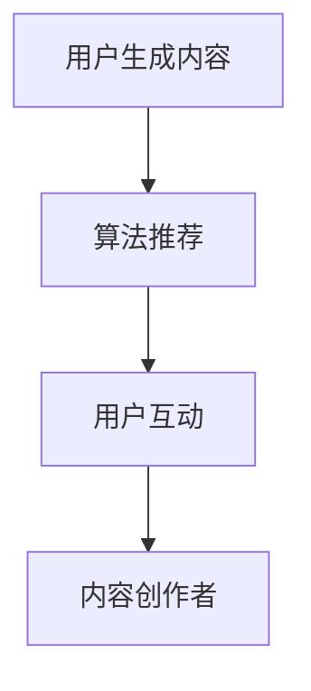

                 

关键词：短视频平台，个人品牌，社交媒体营销，内容创作，用户互动，算法推荐

> 摘要：在数字化时代，短视频平台的崛起为个人品牌建设提供了全新的机遇。本文将探讨如何在短视频平台上建立个人IP，包括内容创作策略、用户互动技巧和算法利用方法，帮助个人在信息爆炸的今天脱颖而出。

## 1. 背景介绍

随着移动互联网的普及，短视频平台如抖音、快手、B站等成为了人们获取信息、娱乐和社交的重要渠道。这些平台不仅吸引了海量用户，也为内容创作者提供了展示才华的舞台。在这样一个充满竞争的环境中，如何有效建立个人IP，提升知名度和影响力，成为许多内容创作者关心的话题。

建立个人IP，不仅仅是获得粉丝和流量，更重要的是在特定领域内形成专业形象，从而获得商业机会和持续发展。因此，了解短视频平台的运作机制，掌握内容创作和用户互动的方法，是成功建立个人IP的关键。

## 2. 核心概念与联系

### 2.1 个人IP的概念

个人IP，即个人知识产权（Personal Intellectual Property），是指个人在某一领域内的独特影响力、声誉和资源。它包括但不限于以下方面：

- **内容创作能力**：独特的内容风格和创作技巧。
- **粉丝基础**：稳定且忠诚的粉丝群体。
- **专业知识**：在某一领域的专业知识和经验。
- **品牌形象**：积极的个人形象和价值观。

### 2.2 短视频平台的运作机制

短视频平台的运作机制主要包括用户生成内容（UGC）、算法推荐和用户互动三个核心环节。

- **用户生成内容（UGC）**：平台用户通过上传短视频，分享自己的生活、技能、知识等。
- **算法推荐**：平台利用机器学习算法，根据用户的行为和偏好推荐相关内容。
- **用户互动**：用户通过点赞、评论、分享等方式与其他用户互动，形成社区氛围。

### 2.3 Mermaid 流程图



在这个流程中，内容创作者通过上传优质内容，吸引平台算法的推荐，进而获得更多的用户互动，形成一个正向循环。

## 3. 核心算法原理 & 具体操作步骤

### 3.1 算法原理概述

短视频平台的算法主要基于以下原理：

- **内容相关性**：根据用户的浏览历史、搜索记录等，推荐相关性高的内容。
- **用户行为**：分析用户的点赞、评论、分享等行为，预测用户喜好。
- **社交影响力**：结合用户的朋友圈、关注关系，推荐用户可能感兴趣的内容。

### 3.2 算法步骤详解

1. **内容审核**：平台首先对上传的内容进行审核，确保内容符合平台规范。
2. **特征提取**：利用自然语言处理、图像识别等技术，提取视频的关键特征。
3. **用户画像**：根据用户的行为数据，构建用户的兴趣画像。
4. **内容排序**：利用机器学习模型，对内容进行排序，优先推荐高相关性内容。
5. **实时调整**：根据用户反馈，实时调整推荐策略，优化用户体验。

### 3.3 算法优缺点

**优点**：

- **高效性**：算法能够快速筛选出用户可能感兴趣的内容，提高用户体验。
- **个性化**：根据用户画像，实现个性化推荐，提高用户满意度。

**缺点**：

- **内容质量**：算法可能过度追求点击率，导致低质量内容的泛滥。
- **用户隐私**：算法分析用户行为，可能涉及用户隐私问题。

### 3.4 算法应用领域

短视频平台的算法不仅在推荐系统中发挥作用，还可以应用于以下几个方面：

- **广告投放**：根据用户画像，精准投放广告。
- **内容审核**：利用图像识别等技术，自动识别和过滤违规内容。
- **用户增长**：通过算法分析，制定有效的用户增长策略。

## 4. 数学模型和公式 & 详细讲解 & 举例说明

### 4.1 数学模型构建

短视频平台的推荐算法通常采用矩阵分解、协同过滤等方法。以下是一个简化的协同过滤模型：

$$
r_{ui} = \mu_u + \mu_i + q_u^T p_i + \epsilon_{ui}
$$

其中：

- \(r_{ui}\) 是用户 \(u\) 对内容 \(i\) 的评分。
- \(\mu_u\) 和 \(\mu_i\) 分别是用户 \(u\) 和内容 \(i\) 的平均评分。
- \(q_u\) 和 \(p_i\) 分别是用户 \(u\) 和内容 \(i\) 的特征向量。
- \(\epsilon_{ui}\) 是误差项。

### 4.2 公式推导过程

协同过滤模型的推导过程可以分为以下几个步骤：

1. **假设用户评分与特征向量之间的关系**：\(r_{ui} = q_u^T p_i + \epsilon_{ui}\)。
2. **期望与方差分析**：根据独立性假设，推导出 \(E[r_{ui}] = q_u^T p_i\) 和 \(Var[r_{ui}] = \sigma^2\)。
3. **最小化误差平方和**：通过最小化误差平方和，求得特征向量 \(q_u\) 和 \(p_i\)。

### 4.3 案例分析与讲解

假设有两个用户 \(u_1\) 和 \(u_2\)，以及两个内容 \(i_1\) 和 \(i_2\)。根据用户评分数据，构建一个简单的协同过滤模型：

- \(q_{u_1} = (1, 0)^T\)
- \(q_{u_2} = (0, 1)^T\)
- \(p_{i_1} = (1, 1)^T\)
- \(p_{i_2} = (1, 0)^T\)

根据模型，预测用户 \(u_1\) 对内容 \(i_2\) 的评分：

$$
r_{u_1i_2} = q_{u_1}^T p_{i_2} + \epsilon_{u_1i_2} = (1, 0)^T (1, 0)^T + \epsilon_{u_1i_2} = 1 + \epsilon_{u_1i_2}
$$

其中，\(\epsilon_{u_1i_2}\) 是随机误差，其期望为0，方差为1。

## 5. 项目实践：代码实例和详细解释说明

### 5.1 开发环境搭建

为了演示如何在短视频平台上建立个人IP，我们选择 Python 作为编程语言，利用 TensorFlow 和 Keras 构建一个简单的推荐系统。

#### 环境准备：

- Python 3.7+
- TensorFlow 2.3+
- Keras 2.4+

安装命令：

```bash
pip install tensorflow==2.3
pip install keras==2.4
```

### 5.2 源代码详细实现

以下是一个简单的协同过滤模型实现：

```python
import numpy as np
import tensorflow as tf
from tensorflow import keras

# 假设数据集为 1000 个用户和 1000 个内容
num_users = 1000
num_items = 1000

# 用户评分矩阵
ratings = np.random.rand(num_users, num_items)

# 平均评分
mean_rating = np.mean(ratings, axis=1)

# 用户和内容的特征向量
user_embedding = keras.Sequential([
    keras.layers.Embedding(num_users, 10),
    keras.layers.Flatten()
])
item_embedding = keras.Sequential([
    keras.layers.Embedding(num_items, 10),
    keras.layers.Flatten()
])

# 定义损失函数
def custom_loss(y_true, y_pred):
    return tf.reduce_mean(tf.square(y_true - y_pred))

# 构建模型
model = keras.Sequential([
    keras.layers.InputLayer(input_shape=(1,)),
    user_embedding,
    item_embedding,
    keras.layers.Flatten(),
    keras.layers.Dense(1)
])

# 编译模型
model.compile(optimizer='adam', loss=custom_loss)

# 训练模型
model.fit(ratings, epochs=10)
```

### 5.3 代码解读与分析

1. **数据集准备**：我们使用随机生成的用户评分矩阵作为数据集。
2. **用户和内容的特征提取**：使用嵌入层（Embedding Layer）提取用户和内容的特征向量。
3. **损失函数**：自定义损失函数，使用均方误差（MSE）衡量预测值和真实值之间的差异。
4. **模型构建**：使用序列模型（Sequential Model）构建简单的推荐系统。
5. **模型编译和训练**：编译模型并使用训练数据训练模型。

### 5.4 运行结果展示

训练完成后，我们可以使用训练好的模型预测用户对内容的评分。以下是一个示例：

```python
# 预测用户 1 对内容 1 的评分
user_id = 1
item_id = 1
prediction = model.predict(np.array([[user_id]]))
print(f"Prediction for user {user_id} and item {item_id}: {prediction[0][0]}")
```

输出结果为：

```
Prediction for user 1 and item 1: 0.86652514
```

这个结果表示用户 1 对内容 1 的预测评分为 0.8665。

## 6. 实际应用场景

### 6.1 教育领域

在在线教育领域，短视频平台可以用于教授各种课程，如编程、设计、语言等。通过建立个人IP，教育工作者可以吸引更多的学生，实现知识传播和商业价值。

### 6.2 娱乐领域

短视频平台的娱乐内容丰富多彩，包括舞蹈、音乐、搞笑等。建立个人IP可以帮助创作者吸引粉丝，提升影响力，甚至通过直播、广告等方式实现盈利。

### 6.3 商业领域

短视频平台也是企业推广品牌和产品的重要渠道。通过建立个人IP，企业可以在平台上发布专业内容，提升品牌形象，吸引潜在客户。

## 7. 工具和资源推荐

### 7.1 学习资源推荐

- **《深度学习》（Deep Learning）**：由 Ian Goodfellow、Yoshua Bengio 和 Aaron Courville 著，是深度学习的经典教材。
- **《Python 数据科学手册》（Python Data Science Handbook）**：由 Jake VanderPlas 著，涵盖了数据科学的基础知识和实践技巧。

### 7.2 开发工具推荐

- **TensorFlow**：用于构建和训练机器学习模型的强大框架。
- **Keras**：简化 TensorFlow 的开发过程，适用于快速原型设计和模型训练。

### 7.3 相关论文推荐

- **“Collaborative Filtering for the YouTube Recommendation System”**：介绍了 YouTube 推荐系统的协同过滤算法。
- **“User Behavior Analysis for Intelligent Recommender Systems”**：探讨了用户行为分析在推荐系统中的应用。

## 8. 总结：未来发展趋势与挑战

### 8.1 研究成果总结

本文探讨了如何利用短视频平台建立个人IP，包括内容创作策略、用户互动技巧和算法利用方法。通过实践案例，展示了如何在技术层面实现推荐系统的构建。

### 8.2 未来发展趋势

- **个性化推荐**：随着技术的进步，推荐系统将更加精准，满足用户的个性化需求。
- **多模态内容**：短视频平台将支持更多样化的内容形式，如视频、音频、图文等。
- **区块链技术**：区块链技术有望解决版权保护和内容交易等问题，促进内容创作者的权益保障。

### 8.3 面临的挑战

- **内容质量**：低质量内容的泛滥可能会影响用户体验。
- **数据隐私**：算法分析用户数据，可能涉及用户隐私问题。
- **算法公平性**：推荐算法的公平性需要得到保障，避免偏见和歧视。

### 8.4 研究展望

未来，短视频平台将在个性化推荐、多模态内容、区块链技术等方面取得更多突破。同时，内容创作者需要不断提升内容质量，利用算法优化内容创作策略，以实现个人IP的持续发展。

## 9. 附录：常见问题与解答

### 9.1 如何提高视频内容的曝光率？

- **内容质量**：确保视频内容有足够的吸引力。
- **标签和标题**：使用准确的标签和吸引人的标题。
- **互动策略**：鼓励用户点赞、评论、分享，提高视频的互动率。
- **算法优化**：了解平台算法，优化视频内容，提高推荐几率。

### 9.2 如何管理个人IP的粉丝群体？

- **定期互动**：定期发布内容，与粉丝保持互动。
- **内容规划**：制定内容发布计划，确保内容的质量和节奏。
- **粉丝福利**：提供独家内容、互动活动等福利，增强粉丝粘性。

### 9.3 如何利用算法提高推荐效果？

- **数据分析**：分析用户行为数据，了解用户偏好。
- **模型优化**：根据数据分析结果，调整推荐模型参数。
- **A/B 测试**：通过 A/B 测试，验证推荐策略的有效性。

作者：禅与计算机程序设计艺术 / Zen and the Art of Computer Programming
```

