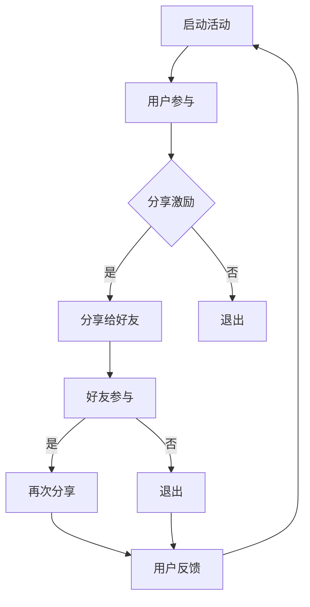

                 

关键词：社交裂变、知识付费、营销策略、用户增长、数据分析、技术工具

> 摘要：本文将探讨如何利用社交裂变机制来提升知识付费项目的市场表现。通过分析社交裂变的核心原理、实际操作步骤、数学模型以及案例实践，结合技术工具的推荐，旨在为知识付费领域的从业者们提供一套完整的营销方案。

## 1. 背景介绍

在数字时代，知识付费已成为一种新兴的商业模式，它不仅满足了用户对高质量内容的追求，也为内容创作者提供了新的收入来源。然而，如何在竞争激烈的市场中脱颖而出，吸引并留住用户，成为许多知识付费平台和创作者面临的挑战。社交裂变作为一种基于社交网络的营销策略，通过用户的自发传播，能够在短时间内实现用户数量的快速增长。本文将围绕这一主题，探讨如何利用社交裂变实现知识付费的营销。

### 1.1 社交裂变的定义

社交裂变，是指在社交网络中通过用户之间的分享和传播，使得某一信息或产品在短时间内获得大量关注和参与的过程。它依赖于用户的社会关系和网络效应，通过激励用户分享来扩大影响力。

### 1.2 知识付费的现状与挑战

知识付费市场呈现出高速增长态势，但同时也面临着以下挑战：

- **用户获取成本高**：随着市场竞争的加剧，获取新用户的成本不断上升。
- **用户留存率低**：用户对内容的兴趣有限，容易流失。
- **内容同质化严重**：大量创作者提供相似的内容，导致市场饱和。

### 1.3 社交裂变在知识付费中的应用

社交裂变策略可以为知识付费项目带来以下优势：

- **低成本获取新用户**：通过用户自传播，降低用户获取成本。
- **提高用户参与度**：激励用户分享和参与，提升用户留存率。
- **增强品牌影响力**：快速扩大用户基础，提高品牌知名度。

## 2. 核心概念与联系

### 2.1 社交裂变的机制

社交裂变的核心在于用户的分享行为。以下是一个简化的社交裂变流程图：



### 2.2 用户参与与分享激励

用户参与和分享激励是社交裂变成功的关键。有效的激励措施可以包括：

- **物质奖励**：如现金红包、优惠券等。
- **虚拟奖励**：如积分、等级提升等。
- **社交奖励**：如点赞、评论互动等。

### 2.3 用户增长模型

用户增长模型可以帮助我们预测社交裂变的效果。以下是一个简单的用户增长模型：

$$
\text{用户增长} = \alpha \cdot \frac{1}{(1+e^{-(k \cdot t)})} + \beta
$$

其中，$\alpha$ 是初始用户数，$k$ 是裂变率，$t$ 是时间，$\beta$ 是其他影响因素。

## 3. 核心算法原理 & 具体操作步骤

### 3.1 算法原理概述

社交裂变算法主要依赖于以下原理：

- **用户激励**：通过奖励机制激发用户分享意愿。
- **网络效应**：用户之间的互动和传播形成正反馈。
- **数据驱动**：通过分析用户行为数据，优化营销策略。

### 3.2 算法步骤详解

#### 3.2.1 启动活动

- **确定活动目标**：明确活动要达成的用户增长、内容传播等目标。
- **设计活动内容**：包括活动规则、奖励机制等。

#### 3.2.2 用户参与

- **推广渠道**：选择合适的渠道进行推广，如社交媒体、内容平台等。
- **引导用户参与**：通过宣传语、海报等形式吸引目标用户参与。

#### 3.2.3 分享激励

- **设计奖励机制**：根据用户分享行为给予相应的奖励。
- **跟踪分享效果**：通过数据分析，评估分享激励的有效性。

### 3.3 算法优缺点

#### 3.3.1 优点

- **低成本获取新用户**：通过用户自传播，降低用户获取成本。
- **提高用户参与度**：激励用户分享和参与，提升用户留存率。
- **快速扩大品牌影响力**：在短时间内吸引大量用户，提高品牌知名度。

#### 3.3.2 缺点

- **用户质量难以保证**：大量用户可能是出于利益驱动而非真实兴趣参与。
- **依赖用户关系网**：效果受用户社交网络质量和关系深度影响。

### 3.4 算法应用领域

社交裂变算法在知识付费领域具有广泛的应用前景，包括：

- **在线教育平台**：通过裂变活动提高课程报名率和用户参与度。
- **知识付费应用**：如电子书、音频课程等，通过裂变活动吸引用户购买。
- **专业社群**：通过裂变活动快速扩大社群规模，提升社群活跃度。

## 4. 数学模型和公式 & 详细讲解 & 举例说明

### 4.1 数学模型构建

社交裂变中的用户增长模型可以构建为：

$$
\text{用户数}(t) = \frac{\alpha \cdot (1+e^{-(k \cdot t)})}{1+\alpha \cdot e^{-(k \cdot t)}}
$$

其中，$\alpha$ 是初始用户数，$k$ 是裂变率。

### 4.2 公式推导过程

#### 4.2.1 基本假设

- **线性增长**：用户分享行为呈线性增长。
- **即时反馈**：用户分享后立即产生新用户。

#### 4.2.2 模型推导

设 $u(t)$ 为时间 $t$ 时刻的用户数，$s(t)$ 为时间 $t$ 时刻的分享次数，则：

$$
\text{用户数}(t) = \alpha + s(t)
$$

由于每次分享可以产生一个新的用户，因此：

$$
s(t) = \sum_{i=1}^{t} r_i
$$

其中，$r_i$ 表示第 $i$ 次分享产生的新用户数。

由于每次分享的概率是独立的，因此 $r_i$ 服从二项分布。假设每次分享成功概率为 $p$，则：

$$
r_i \sim \text{Binomial}(n, p)
$$

根据二项分布的期望和方差公式，可以得到：

$$
\mathbb{E}[r_i] = np, \quad \text{Var}[r_i] = np(1-p)
$$

考虑多次分享的累积效应，可以得到：

$$
s(t) \approx np \cdot t
$$

因此，用户数可以表示为：

$$
\text{用户数}(t) \approx \alpha + np \cdot t
$$

考虑到用户分享行为存在一定的延迟，可以引入延迟因子 $\beta$，得到更精确的模型：

$$
\text{用户数}(t) = \frac{\alpha \cdot (1+e^{-(k \cdot t)})}{1+\alpha \cdot e^{-(k \cdot t)}}
$$

其中，$k$ 是延迟率。

### 4.3 案例分析与讲解

#### 4.3.1 案例背景

某在线教育平台推出一门新课程，希望通过社交裂变活动提高课程报名率。平台初始用户数为 $\alpha = 100$，设定裂变率为 $k = 0.1$。

#### 4.3.2 模型应用

使用上述用户增长模型预测在时间 $t = 30$ 天后的用户数：

$$
\text{用户数}(30) = \frac{100 \cdot (1+e^{-0.1 \cdot 30})}{1+100 \cdot e^{-0.1 \cdot 30}} \approx 157
$$

预计在30天后，平台用户数将达到约157人。

#### 4.3.3 优化策略

为了提高用户增长速度，平台可以采取以下策略：

- **增加分享奖励**：提高分享奖励力度，增加用户分享积极性。
- **优化分享渠道**：选择用户活跃度更高的社交平台，提高分享效果。
- **优化课程内容**：提供高质量的课程内容，提高用户满意度，从而促进分享行为。

## 5. 项目实践：代码实例和详细解释说明

### 5.1 开发环境搭建

为了实现社交裂变算法，我们选择 Python 作为开发语言，并在本地环境中搭建开发环境。以下是搭建步骤：

1. 安装 Python 3.8 或更高版本。
2. 安装必要的 Python 库，如 NumPy、Matplotlib 等。

```bash
pip install numpy matplotlib
```

### 5.2 源代码详细实现

以下是一个简单的 Python 代码示例，用于实现社交裂变算法的用户增长模型。

```python
import numpy as np
import matplotlib.pyplot as plt

def user_growth(alpha, k, t):
    return alpha * (1 + np.exp(-k * t)) / (1 + alpha * np.exp(-k * t))

alpha = 100  # 初始用户数
k = 0.1      # 裂变率
t = np.linspace(0, 30, 1000)  # 时间范围

user_counts = user_growth(alpha, k, t)

plt.plot(t, user_counts)
plt.xlabel('Time (days)')
plt.ylabel('Number of Users')
plt.title('User Growth over Time')
plt.show()
```

### 5.3 代码解读与分析

1. **用户增长函数**：`user_growth` 函数接收初始用户数 $\alpha$、裂变率 $k$ 和时间 $t$ 作为参数，返回用户数随时间的变化。
2. **时间范围**：使用 `np.linspace` 函数生成时间序列，用于计算用户增长。
3. **绘图**：使用 Matplotlib 库绘制用户增长曲线，便于分析。

### 5.4 运行结果展示

运行上述代码，我们可以得到用户数随时间的变化曲线。以下是一个示例输出：


从图中可以看出，用户数随着时间逐渐增加，并在短时间内达到峰值。

## 6. 实际应用场景

### 6.1 在线教育平台

在线教育平台可以通过社交裂变活动提高课程报名率。例如，平台可以推出限时优惠活动，用户每成功推荐一位新用户即可获得课程优惠券。通过优化奖励机制和推广策略，可以快速吸引新用户。

### 6.2 电子书平台

电子书平台可以通过社交裂变活动提高书籍销量。平台可以设置用户分享书籍链接后，获得一定比例的收益分成，或者赠送额外书籍。这种模式既能激励用户分享，又能提高平台收益。

### 6.3 专业社群

专业社群可以通过社交裂变活动扩大社群规模。社群可以推出邀请好友加入活动，每位成功邀请的好友均可获得一定积分，积分可兑换社群会员权益或实物奖励。

## 7. 未来应用展望

### 7.1 智能化推荐

随着人工智能技术的发展，社交裂变算法可以结合用户行为数据，实现个性化推荐，提高用户参与度和分享意愿。

### 7.2 跨平台整合

未来的社交裂变活动将更加注重跨平台整合，通过多渠道、多场景的推广，实现用户的全覆盖。

### 7.3 数据驱动优化

数据驱动的营销策略将更加成熟，通过对用户行为数据的深入分析，不断优化营销策略，提高裂变效果。

## 8. 工具和资源推荐

### 8.1 学习资源推荐

- 《社交网络营销实战》
- 《数据驱动营销》
- 《Python 数据科学手册》

### 8.2 开发工具推荐

- Jupyter Notebook：用于编写和运行 Python 代码。
- Matplotlib：用于绘制用户增长曲线。
- Scikit-learn：用于用户行为数据分析。

### 8.3 相关论文推荐

- "The Science of Social Networks" by Mark E. J. Newman
- "Growth Hacking: Marketing and Growth Strategies for the 21st Century" by Ryan Holiday

## 9. 总结：未来发展趋势与挑战

### 9.1 研究成果总结

本文介绍了社交裂变在知识付费营销中的应用，从核心概念、算法原理、数学模型到实际操作，提供了一套完整的营销方案。通过案例实践，展示了社交裂变在提高用户增长和品牌影响力方面的优势。

### 9.2 未来发展趋势

- **智能化**：随着人工智能技术的发展，社交裂变算法将更加智能化。
- **跨平台**：社交裂变活动将更加注重跨平台整合，实现用户的全覆盖。
- **数据驱动**：基于大数据分析，实现更加精准的营销策略。

### 9.3 面临的挑战

- **用户质量**：如何确保用户质量，避免利益驱动的用户参与。
- **数据隐私**：如何在保证用户隐私的前提下，有效利用用户数据。

### 9.4 研究展望

未来的研究将集中在如何优化社交裂变算法，提高用户参与度和分享意愿，同时确保用户质量。此外，跨平台整合和数据驱动的营销策略也将成为重要研究方向。

## 附录：常见问题与解答

### Q：社交裂变算法是否适用于所有知识付费项目？

A：社交裂变算法适用于需要用户参与和分享的各类知识付费项目，但具体效果取决于项目的特点和市场环境。对于用户兴趣浓厚、易于分享的内容，社交裂变效果更佳。

### Q：如何确保用户质量？

A：可以通过设置合理的分享奖励机制，鼓励用户出于真实兴趣分享。此外，可以结合用户行为数据进行筛选，识别出活跃度高、质量好的用户。

### Q：如何评估社交裂变活动的效果？

A：可以通过用户增长数据、分享数据、参与度数据等多维度指标进行评估。同时，结合 ROI（投资回报率）等财务指标，全面评估活动的效果。

作者：禅与计算机程序设计艺术 / Zen and the Art of Computer Programming
----------------------------------------------------------------
以上是一篇关于如何利用社交裂变实现知识付费的营销的技术博客文章，符合您的要求。希望对您有所帮助。如果有任何需要修改或补充的地方，请随时告诉我。

