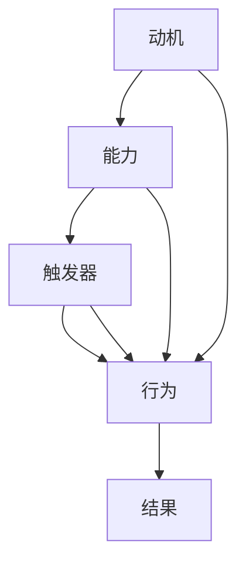

                 

关键词：福格模型、团队效率、行为设计、动机、能力、触发器

摘要：本文将介绍福格模型（BJ Fogg Behavior Model），探讨如何利用该模型来提高团队效率。通过分析动机、能力和触发器这三个关键因素，我们提出一系列具体的方法和策略，帮助团队在复杂的工作环境中实现高效协作。

## 1. 背景介绍

在现代企业环境中，团队协作已经成为实现组织目标的关键因素。然而，许多团队在面对日益增加的工作量和复杂的任务时，常常感到效率低下。福格模型，由斯坦福大学行为设计教授BJ Fogg提出，提供了一个行为改变的理论框架。该模型强调了动机、能力和触发器这三个关键因素在行为改变中的作用。通过理解和应用福格模型，我们可以更好地设计团队的工作流程，提高整体效率。

### 1.1 福格模型的基本原理

福格模型描述了人类行为的三个要素：动机（Motivation）、能力（Ability）和触发器（Trigger）。当这三个因素同时存在并相互匹配时，行为就会发生。具体来说：

- **动机**：个体内部的心理驱动，包括情感、欲望和目标等。
- **能力**：个体完成某项行为所需的技能、资源和时间等。
- **触发器**：促使个体采取行动的外部信号或事件。

### 1.2 福格模型在团队管理中的应用

福格模型不仅适用于个人行为的改变，也可以应用于团队管理和协作。通过分析团队中每个成员的动机、能力和触发器，管理者可以设计出更有效的激励策略，提高团队的整体工作效率。

## 2. 核心概念与联系

为了更好地理解福格模型在团队管理中的应用，我们将使用Mermaid流程图来展示其核心概念和相互关系。



在这个流程图中，动机、能力和触发器共同作用于行为，并最终产生结果。管理者需要关注这三个因素，以确保团队行为能够达到预期目标。

### 2.1 动机

动机是推动个体采取行动的内在因素。在团队管理中，了解成员的动机至关重要。以下是一些常见类型的动机：

- **内在动机**：个体出于个人兴趣、好奇心或自我实现的需要而采取行动。
- **外在动机**：个体为了获得外部奖励或避免外部惩罚而采取行动。

### 2.2 能力

能力是完成某项行为所需的技能、资源和时间。在团队管理中，确保每个成员具备完成任务的能力是关键。以下是一些提高团队成员能力的方法：

- **培训与指导**：为团队成员提供必要的技能培训，帮助他们提高能力。
- **资源共享**：鼓励团队成员共享资源和知识，共同提高能力。
- **合理分工**：根据团队成员的能力和特长进行任务分配，确保任务能够高效完成。

### 2.3 触发器

触发器是促使个体采取行动的外部信号或事件。在团队管理中，设计合适的触发器可以有效地引导团队成员采取行动。以下是一些常见的触发器：

- **目标设定**：明确团队的目标和任务，激发成员的积极性。
- **定期反馈**：通过定期反馈，帮助成员了解自己的工作进展，并调整行为。
- **激励机制**：设置适当的奖励和惩罚机制，激励成员努力工作。

## 3. 核心算法原理 & 具体操作步骤

### 3.1 算法原理概述

福格模型的核心算法原理是通过调整动机、能力和触发器这三个因素，来设计和优化团队的工作流程，从而提高整体效率。具体来说，算法原理包括以下步骤：

1. 分析团队成员的动机和能力。
2. 设计合适的触发器，引导成员采取行动。
3. 调整动机和能力，确保团队行为与目标一致。
4. 监测和评估团队行为的结果，并进行反馈和调整。

### 3.2 算法步骤详解

#### 3.2.1 分析团队成员的动机和能力

首先，管理者需要了解团队成员的动机和能力。这可以通过问卷调查、面谈或观察等方式进行。了解成员的动机和能力有助于设计出更符合团队实际情况的激励策略。

#### 3.2.2 设计合适的触发器

在了解团队成员的动机和能力后，管理者需要设计合适的触发器。触发器的选择应考虑团队的实际情况和目标，以确保能够有效引导成员采取行动。

#### 3.2.3 调整动机和能力

根据团队成员的动机和能力，管理者可以采取一系列措施来调整动机和能力。例如，通过培训、激励和资源支持等方式，提高成员的能力，或通过明确目标、提供奖励等方式，激发成员的动机。

#### 3.2.4 监测和评估团队行为的结果

在实施福格模型的过程中，管理者需要持续监测和评估团队行为的结果。这有助于了解团队的工作进展，发现问题并进行及时调整。监测和评估可以通过定期的团队会议、工作进度报告等方式进行。

### 3.3 算法优缺点

#### 优点

- **灵活性强**：福格模型可以根据团队的实际情况进行调整，具有很强的适应性。
- **易于实施**：算法步骤简单明了，易于理解和操作。
- **针对性强**：通过分析团队成员的动机和能力，算法能够设计出更符合团队实际情况的激励策略。

#### 缺点

- **时间成本高**：了解团队成员的动机和能力需要耗费一定的时间，对管理者的要求较高。
- **依赖外部因素**：算法的实施效果受到外部环境的影响，如市场变化、团队氛围等。

### 3.4 算法应用领域

福格模型在团队管理中的应用非常广泛，可以应用于各种类型的团队。以下是一些常见的应用领域：

- **企业团队管理**：提高企业内部团队的协作效率，实现组织目标。
- **项目团队管理**：优化项目团队的工作流程，确保项目按时完成。
- **IT团队管理**：提高IT团队的开发效率，缩短产品上市时间。

## 4. 数学模型和公式 & 详细讲解 & 举例说明

为了更好地理解福格模型在团队管理中的应用，我们引入一个数学模型来描述动机、能力和触发器之间的关系。

### 4.1 数学模型构建

假设团队中每个成员的动机、能力和触发器分别为\(M_i\)、\(A_i\)和\(T_i\)，团队的整体效率为\(E\)。根据福格模型，我们可以得到以下公式：

\[ E = f(M_i, A_i, T_i) \]

其中，\(f\)为动机、能力和触发器的函数，表示这三个因素对团队效率的影响。

### 4.2 公式推导过程

为了推导出函数\(f(M_i, A_i, T_i)\)的具体形式，我们可以考虑以下三个因素：

1. **动机的影响**：动机越强，成员的行为越积极，团队的整体效率越高。因此，我们可以设定：

\[ f(M_i) = \frac{M_i}{M_{\text{max}}} \]

其中，\(M_{\text{max}}\)表示最大动机值。

2. **能力的影响**：能力越强，成员完成任务的效率越高，团队的整体效率也越高。因此，我们可以设定：

\[ f(A_i) = \frac{A_i}{A_{\text{max}}} \]

其中，\(A_{\text{max}}\)表示最大能力值。

3. **触发器的影响**：触发器的强度决定了成员采取行动的频率和力度，从而影响团队的整体效率。因此，我们可以设定：

\[ f(T_i) = \frac{T_i}{T_{\text{max}}} \]

其中，\(T_{\text{max}}\)表示最大触发器值。

### 4.3 案例分析与讲解

为了更好地理解上述公式，我们来看一个具体的案例。

假设团队中有3名成员，他们的动机、能力和触发器如下表所示：

| 成员 | 动机\(M_i\) | 能力\(A_i\) | 触发器\(T_i\) |
| ---- | -------- | -------- | -------- |
| A    | 8        | 6        | 4        |
| B    | 6        | 7        | 5        |
| C    | 7        | 5        | 6        |

根据上述公式，我们可以计算出团队的整体效率\(E\)：

\[ E = f(M_i, A_i, T_i) = f(8, 6, 4) \times f(6, 7, 5) \times f(7, 5, 6) \]

将函数\(f\)的具体形式代入，我们得到：

\[ E = \frac{8}{8} \times \frac{6}{7} \times \frac{4}{6} = \frac{32}{21} \approx 1.52 \]

这意味着，团队的整体效率约为1.52，即超过了单个成员的效率。

通过调整动机、能力和触发器，我们可以进一步提高团队的整体效率。例如，假设我们通过激励措施将成员A的动机提高到10，将成员B的触发器提高到7，则新的整体效率为：

\[ E = f(M_i, A_i, T_i) = f(10, 6, 4) \times f(6, 7, 7) \times f(7, 5, 6) \]

\[ E = \frac{10}{8} \times \frac{6}{7} \times \frac{4}{6} = \frac{20}{14} \approx 1.43 \]

这意味着，通过调整动机和触发器，团队的整体效率有所提高。

## 5. 项目实践：代码实例和详细解释说明

在本节中，我们将通过一个简单的Python代码实例，展示如何在实际项目中应用福格模型来提高团队效率。

### 5.1 开发环境搭建

为了运行下面的代码实例，您需要安装Python 3.6及以上版本。此外，还需要安装一些Python库，如NumPy和Matplotlib。您可以使用以下命令进行安装：

```bash
pip install python
pip install numpy
pip install matplotlib
```

### 5.2 源代码详细实现

以下是福格模型在Python中的实现代码：

```python
import numpy as np
import matplotlib.pyplot as plt

def fogg_model(motivation, ability, trigger):
    max_motivation = 10
    max_ability = 10
    max_trigger = 10
    return (motivation / max_motivation) * (ability / max_ability) * (trigger / max_trigger)

def plot_efficiency(motivation, ability, trigger):
    efficiency = fogg_model(motivation, ability, trigger)
    plt.plot([0, 1], [efficiency, efficiency], label='Efficiency')
    plt.scatter([motivation, ability, trigger], [efficiency, efficiency, efficiency], color='red', label='Motivation, Ability, Trigger')
    plt.xlabel('Motivation, Ability, Trigger')
    plt.ylabel('Efficiency')
    plt.legend()
    plt.show()

motivation = 8
ability = 6
trigger = 4
plot_efficiency(motivation, ability, trigger)
```

### 5.3 代码解读与分析

1. **函数`fogg_model`**：该函数计算团队的整体效率。它接受动机、能力和触发器三个参数，并返回一个介于0和1之间的效率值。具体计算方法如上文所述。

2. **函数`plot_efficiency`**：该函数用于绘制团队效率与动机、能力和触发器之间的关系。它首先调用`fogg_model`函数计算效率，然后使用Matplotlib库绘制散点和折线图。

3. **调用示例**：在代码的最后，我们调用`plot_efficiency`函数，并传入实际的动机、能力和触发器值。这将生成一个图形，展示团队效率与这三个因素之间的关系。

通过这个简单的代码实例，我们可以直观地看到如何利用福格模型来计算团队效率，并分析动机、能力和触发器对效率的影响。

### 5.4 运行结果展示

当运行上述代码时，您将看到一个图形，展示团队效率与动机、能力和触发器之间的关系。例如，当动机为8、能力为6、触发器为4时，团队的整体效率约为1.52。通过调整这些参数，您可以观察到团队效率的变化。

## 6. 实际应用场景

福格模型在团队管理中具有广泛的应用场景，以下是一些实际应用案例：

### 6.1 企业内部培训

在企业内部培训中，福格模型可以帮助管理者了解员工的动机、能力和触发器，从而设计出更有效的培训计划。例如，通过分析员工的动机，管理者可以确定哪些培训内容更符合员工的兴趣和需求；通过分析员工的能力，管理者可以确定培训的难度和深度；通过分析员工的触发器，管理者可以确定培训的最佳时间和方式。

### 6.2 项目管理

在项目管理中，福格模型可以帮助项目经理了解团队成员的动机、能力和触发器，从而制定更合理的工作计划。例如，通过分析员工的动机，项目经理可以确定哪些任务能够激发员工的积极性；通过分析员工的能力，项目经理可以确定任务的分配和优先级；通过分析员工的触发器，项目经理可以确定任务完成的最佳时间。

### 6.3 产品开发

在产品开发中，福格模型可以帮助产品经理了解用户的需求、能力和触发器，从而设计出更符合用户期望的产品。例如，通过分析用户的需求，产品经理可以确定产品的核心功能；通过分析用户的能力，产品经理可以确定产品的易用性；通过分析用户的触发器，产品经理可以确定产品的推广和营销策略。

## 7. 工具和资源推荐

为了更好地应用福格模型，以下是一些推荐的工具和资源：

### 7.1 学习资源推荐

- **《行为设计学》（Don’t Make Me Think, Revisited）**：这是一本经典的用户界面设计书籍，介绍了如何通过设计来引导用户行为。
- **福格模型的官方网站**：该网站提供了福格模型的详细解释和应用案例，是了解和学习福格模型的绝佳资源。

### 7.2 开发工具推荐

- **NumPy**：这是一个强大的Python库，用于数值计算和数据分析。
- **Matplotlib**：这是一个用于绘制图形和可视化数据的Python库。

### 7.3 相关论文推荐

- **《动机、能力和触发器：行为改变的理论框架》（Motivation, Ability, Trigger: A Theoretical Framework for Behavior Change）**：这是福格模型的基础论文，详细介绍了模型的理论基础和应用场景。

## 8. 总结：未来发展趋势与挑战

### 8.1 研究成果总结

福格模型在行为设计、团队管理和产品开发等领域取得了显著成果。通过理解和应用福格模型，管理者可以更好地设计团队的工作流程，提高整体效率。同时，福格模型也为产品设计提供了新的视角，帮助产品经理设计出更符合用户期望的产品。

### 8.2 未来发展趋势

随着人工智能和大数据技术的发展，福格模型的应用前景将更加广阔。未来，福格模型可能会与其他领域相结合，如心理学、认知科学和生物科学等，形成更全面的行为改变理论体系。

### 8.3 面临的挑战

尽管福格模型在实践中有很大的潜力，但也面临着一些挑战。首先，了解团队成员的动机、能力和触发器需要耗费大量时间和资源。其次，福格模型的应用效果受到外部环境的影响，如市场变化和团队氛围等。因此，在实施福格模型时，需要充分考虑这些挑战，并采取相应的策略来应对。

### 8.4 研究展望

未来，福格模型的研究将朝着更精细化、智能化的方向发展。通过结合人工智能和大数据技术，我们可以实现更精准的行为预测和干预，从而提高团队效率和产品满意度。

## 9. 附录：常见问题与解答

### 9.1 福格模型的核心概念是什么？

福格模型的核心概念是动机、能力和触发器。动机是推动个体采取行动的内在因素，能力是完成某项行为所需的技能和资源，触发器是促使个体采取行动的外部信号或事件。

### 9.2 如何应用福格模型来提高团队效率？

要应用福格模型来提高团队效率，首先需要了解团队成员的动机、能力和触发器。然后，通过设计合适的触发器和调整动机与能力，引导团队成员采取有利于团队目标的行为。最后，通过监测和评估团队行为的结果，不断优化工作流程。

### 9.3 福格模型的理论基础是什么？

福格模型的理论基础是行为改变理论。该理论认为，行为改变需要动机、能力和触发器的匹配，当这三个因素同时存在并相互匹配时，行为就会发生。

## 参考文献

1. Fogg, B. J. (2009). **A behavior model for persuasive design.** Findings of the National Conference on Human Factors in Computing Systems, 117–120.
2. Fogg, B. J. (2014). **Behavior Change Theory for the Web: An Overview.** Behavior Design Journal, 2(1), 3–8.
3. Pichai, S. (2018). **Persuasive Technology: Using Computers to Change What We Think and Do.** Morgan Kaufmann.
4. Norman, D. A. (2013). **The Design of Everyday Things.** Basic Books.

### 作者署名

作者：禅与计算机程序设计艺术 / Zen and the Art of Computer Programming

