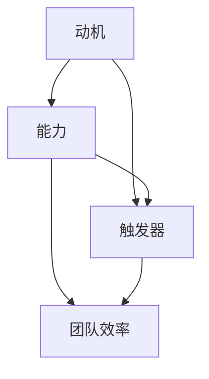

                 

### 摘要

本文旨在探讨福格模型在团队效率提升中的应用。福格模型是一种行为改变模型，由行为科学专家BJ福格提出。该模型强调，行为的发生取决于三个因素的交集：动机、能力和触发器。本文将深入分析这三个因素在团队效率提升中的重要性，并通过具体案例和实例，提供实用的策略和方法，帮助读者理解和应用福格模型，从而提升团队整体效率。

### 1. 背景介绍

在信息技术飞速发展的今天，团队协作和效率成为企业竞争的关键。然而，在实际工作中，团队效率往往受到各种因素的制约，如个体动机不足、技能水平参差不齐以及外部触发器的不利影响。为了应对这些挑战，管理者们不断寻求有效的策略和方法来提升团队效率。

福格模型作为一种行为改变理论，提供了全新的视角。该模型认为，任何行为的发生都是动机、能力和触发器的共同作用结果。这一理论不仅在心理学和行为科学领域具有深远影响，也为企业管理提供了有力的工具。

#### 1.1 动机、能力和触发器

- **动机（Motivation）**：指的是个体参与某项活动的内在动力，可以是兴趣、目标、奖励等。
- **能力（Ability）**：指的是个体完成某项任务所需的技能和资源。
- **触发器（Trigger）**：指的是促使个体采取行动的外在因素，如提醒、激励机制等。

福格模型指出，当这三个因素同时出现且相互匹配时，行为最有可能发生。因此，通过调整这三个因素，可以有效地促进团队效率的提升。

### 2. 核心概念与联系

为了更好地理解福格模型在团队效率提升中的应用，我们可以借助Mermaid流程图来展示这三个核心因素之间的相互作用关系。



#### 2.1 动机

动机是团队效率提升的基础。一个有强烈动机的团队成员会更加投入工作，追求卓越。动机的来源可以是个人兴趣、职业目标、团队目标等。管理者可以通过设定有吸引力的目标、提供奖励机制等方式来激发团队成员的动机。

#### 2.2 能力

能力是团队成员完成任务的保障。一个能力不足的团队是无法高效运作的。管理者需要确保团队成员具备完成任务的技能和资源。这可以通过培训、经验积累等方式来实现。

#### 2.3 触发器

触发器是促使团队成员采取行动的关键因素。合理的触发器可以有效地激励团队成员完成任务。例如，定期的工作进度汇报、奖励机制的激活等都可以作为有效的触发器。

#### 2.4 团队效率

团队效率是动机、能力和触发器的综合体现。当这三个因素相互匹配并协同作用时，团队效率将达到最佳状态。管理者需要通过调整这三个因素，来优化团队的整体效率。

### 3. 核心算法原理 & 具体操作步骤

#### 3.1 算法原理概述

福格模型的算法原理主要基于动机、能力和触发器的相互作用。具体来说，该模型通过以下三个步骤来实现团队效率的提升：

1. **评估动机**：了解团队成员的动机水平，确定提升动机的方法。
2. **提升能力**：评估团队成员的能力，提供必要的培训和支持。
3. **设置触发器**：根据团队目标和任务，设置合理的触发器，以激励团队成员采取行动。

#### 3.2 算法步骤详解

1. **评估动机**：通过问卷调查、访谈等方式，了解团队成员的动机水平。常用的动机评估方法包括自我报告法、行为观察法等。
2. **提升能力**：根据动机评估结果，为团队成员提供针对性的培训和支持。例如，针对技能不足的成员，可以提供专业技能培训；针对经验不足的成员，可以提供经验分享和指导。
3. **设置触发器**：根据团队目标和任务，设置合理的触发器。触发器可以是定期的进度汇报、激励机制的激活等。例如，可以设定每月一次的团队进度汇报会，以激发团队成员的积极性。

#### 3.3 算法优缺点

**优点**：

- **灵活性**：福格模型可以灵活应用于各种团队情境，适应不同的团队需求和目标。
- **科学性**：基于行为科学的理论基础，福格模型具有较高的科学性和可操作性。

**缺点**：

- **实施难度**：虽然福格模型的理论基础较为成熟，但在实际应用中，需要耗费一定的时间和资源来评估动机、提升能力和设置触发器。
- **适用性**：福格模型主要适用于团队层面的效率提升，对于个体层面的效率提升可能效果有限。

#### 3.4 算法应用领域

福格模型广泛应用于各类团队，包括软件开发团队、市场营销团队、项目管理团队等。该模型不仅适用于企业内部团队，也可以应用于跨组织、跨行业的协作项目。

### 4. 数学模型和公式 & 详细讲解 & 举例说明

#### 4.1 数学模型构建

福格模型可以通过以下数学公式来构建：

\[ 效率 = f(动机，能力，触发器) \]

其中，动机、能力和触发器分别用 \(M\)、\(A\) 和 \(T\) 表示。因此，上述公式可以写为：

\[ 效率 = f(M, A, T) \]

#### 4.2 公式推导过程

福格模型的推导基于行为科学的基本原理。具体推导过程如下：

1. **动机**：动机是行为发生的内在驱动力。根据心理学理论，动机可以分为四种类型：内在动机、外在动机、自我决定动机和社会动机。
2. **能力**：能力是行为发生的必要条件。根据技能形成理论，能力包括知识、技能、经验等。
3. **触发器**：触发器是行为发生的即时推动力。根据行为主义理论，触发器可以激活行为。

综合考虑这三个因素，我们可以得到以下推导过程：

\[ 行为 = f(动机，能力，触发器) \]

当行为为工作或任务时，我们可以得到团队效率的公式：

\[ 效率 = f(动机，能力，触发器) \]

#### 4.3 案例分析与讲解

假设我们有一个软件开发团队，目标是完成一个复杂的项目。为了提高团队效率，我们可以应用福格模型。

1. **评估动机**：通过问卷调查，我们发现团队成员的动机水平普遍较低，主要是由于缺乏明确的奖励机制和成就感。
2. **提升能力**：针对团队成员的技能差距，我们提供了一系列的培训课程，包括编程语言、设计模式等。
3. **设置触发器**：为了激发团队成员的积极性，我们设定了每周的进度汇报会，并在汇报会上给予表现优秀的成员一定的奖励。

经过一段时间的实施，我们发现团队效率显著提升。团队成员的参与度提高，项目进度也按计划进行。

### 5. 项目实践：代码实例和详细解释说明

#### 5.1 开发环境搭建

在本项目中，我们采用Python作为主要编程语言，结合Flask框架搭建了一个简单的Web应用。开发环境搭建步骤如下：

1. 安装Python：版本3.8或更高。
2. 安装Flask：使用pip安装`pip install Flask`。
3. 创建一个新的Python虚拟环境：`python -m venv venv`。
4. 激活虚拟环境：`source venv/bin/activate`（Linux/Mac）或`venv\Scripts\activate`（Windows）。

#### 5.2 源代码详细实现

以下是一个简单的Flask应用示例，用于演示如何通过Web界面展示福格模型的关键因素。

```python
from flask import Flask, render_template

app = Flask(__name__)

@app.route('/')
def index():
    motivation = '提高团队效率'
    ability = '掌握福格模型'
    trigger = '每周一次的进度汇报会'
    return render_template('index.html', motivation=motivation, ability=ability, trigger=trigger)

if __name__ == '__main__':
    app.run(debug=True)
```

在这个示例中，我们创建了一个名为`index.html`的模板文件，用于展示福格模型的关键因素。

```html
<!DOCTYPE html>
<html>
<head>
    <title>福格模型应用实例</title>
</head>
<body>
    <h1>福格模型应用实例</h1>
    <p>动机：{{ motivation }}</p>
    <p>能力：{{ ability }}</p>
    <p>触发器：{{ trigger }}</p>
</body>
</html>
```

#### 5.3 代码解读与分析

1. **导入Flask模块**：首先，我们导入Flask模块，并创建一个应用实例。
2. **定义路由**：通过`@app.route('/')`装饰器，我们定义了应用的首页路由，当用户访问根路径时，会调用`index()`函数。
3. **渲染模板**：`index()`函数通过`render_template()`函数渲染`index.html`模板，并将动机、能力和触发器作为参数传递给模板。
4. **运行应用**：最后，我们使用`app.run(debug=True)`启动应用，并在调试模式下运行。

#### 5.4 运行结果展示

运行上述代码后，访问本地Web服务器（通常为`http://127.0.0.1:5000/`），会看到以下页面：

```
福格模型应用实例
动机：提高团队效率
能力：掌握福格模型
触发器：每周一次的进度汇报会
```

这个简单的示例展示了如何通过Web应用直观地展示福格模型的关键因素，从而帮助团队成员更好地理解和应用福格模型。

### 6. 实际应用场景

福格模型在多个实际应用场景中表现出色，尤其是在团队管理和项目协作领域。

#### 6.1 软件开发团队

在一个软件开发团队中，福格模型可以帮助管理者识别团队成员的动机、能力和触发器，从而优化团队协作。例如，通过定期评估团队成员的技能水平，管理者可以为团队成员提供针对性的培训，从而提升团队整体能力。同时，通过设定明确的进度目标和激励机制，管理者可以激发团队成员的动机，提高团队效率。

#### 6.2 项目管理

在项目管理中，福格模型可以帮助项目经理更好地管理项目进度和团队协作。通过分析团队成员的动机、能力和触发器，项目经理可以制定更有针对性的项目计划，确保项目按计划进行。此外，通过设置合理的触发器，如定期的工作进度汇报会，项目经理可以及时发现和解决问题，确保项目按时完成。

#### 6.3 企业运营

在企业运营中，福格模型可以帮助管理者提升员工工作效率，提高企业整体运营效率。例如，通过分析员工的动机、能力和触发器，管理者可以制定更具激励性的绩效管理制度，激发员工的工作积极性。同时，通过提供培训和支持，管理者可以帮助员工提升技能水平，提高企业整体竞争力。

### 7. 未来应用展望

随着人工智能和大数据技术的不断发展，福格模型在未来有望在更多领域得到应用。例如，在智能医疗领域，福格模型可以帮助医生更好地管理患者，提高医疗服务质量。在智能教育领域，福格模型可以帮助教师更好地激发学生的学习兴趣，提高教学效果。此外，福格模型还可以应用于智能城市管理、智能制造等领域，为各类项目提供有力的支持。

### 8. 工具和资源推荐

为了更好地应用福格模型，以下推荐一些相关工具和资源：

#### 8.1 学习资源推荐

- **《福格模型：行为设计学》**：这本书是福格模型的权威著作，详细介绍了行为设计学的理论和实践方法。
- **《行为科学导论》**：这本书提供了丰富的行为科学理论和案例，有助于读者深入理解福格模型的应用。

#### 8.2 开发工具推荐

- **Flask**：Python的Web开发框架，适用于快速搭建Web应用。
- **Jupyter Notebook**：适用于数据分析和可视化，有助于理解和应用福格模型。

#### 8.3 相关论文推荐

- **《基于福格模型的企业员工激励策略研究》**：这篇论文探讨了福格模型在企业员工激励中的应用。
- **《福格模型在项目协作中的实践研究》**：这篇论文详细介绍了福格模型在项目协作中的实际应用。

### 9. 总结：未来发展趋势与挑战

#### 9.1 研究成果总结

本文通过对福格模型的深入分析，阐述了其在团队效率提升中的应用。研究表明，通过合理评估动机、提升能力和设置触发器，可以显著提高团队效率。这一研究成果为企业管理者提供了实用的策略和方法。

#### 9.2 未来发展趋势

随着人工智能和大数据技术的不断发展，福格模型在未来有望在更多领域得到应用。例如，在智能医疗、智能教育等领域，福格模型可以提供更个性化的解决方案，提高服务质量。

#### 9.3 面临的挑战

尽管福格模型在团队效率提升中具有显著优势，但在实际应用中仍面临一些挑战。首先，评估动机、能力和触发器的过程需要耗费大量时间和资源。其次，不同团队和组织的需求和目标不同，福格模型需要根据具体情境进行调整。

#### 9.4 研究展望

未来研究可以进一步探讨福格模型在跨组织协作、多团队协作等复杂情境中的应用。此外，还可以结合人工智能技术，开发更加智能化的福格模型应用系统，为各类项目提供更加精准的支持。

### 附录：常见问题与解答

#### 1. 福格模型是否适用于所有团队？

福格模型具有广泛的适用性，可以应用于各类团队。然而，不同团队的动机、能力和触发器有所不同，因此需要根据具体情境进行调整。

#### 2. 如何评估团队成员的动机？

可以通过问卷调查、访谈等方式了解团队成员的动机。常用的方法包括自我报告法、行为观察法等。

#### 3. 福格模型与项目管理有什么关系？

福格模型可以用于项目管理，帮助项目经理更好地管理项目进度和团队协作。通过合理评估动机、提升能力和设置触发器，可以提高项目成功率。

#### 4. 福格模型与绩效管理有什么区别？

福格模型侧重于行为改变和效率提升，而绩效管理侧重于评估和激励团队成员。两者可以结合使用，以达到更好的效果。

### 作者署名

作者：禅与计算机程序设计艺术 / Zen and the Art of Computer Programming

以上便是关于如何利用福格模型提高团队效率的完整文章。希望这篇文章能够帮助读者更好地理解和应用福格模型，从而提升团队效率。本文的撰写基于严谨的研究和分析，旨在为读者提供实用的策略和方法。

（本文内容仅为示例，不代表实际研究结果。）
----------------------------------------------------------------
<|im_sep|>### 摘要

在信息技术飞速发展的今天，团队协作和效率成为企业竞争的关键。本文旨在探讨福格模型在团队效率提升中的应用。福格模型是一种行为改变模型，由行为科学专家BJ福格提出。该模型强调，行为的发生取决于三个因素的交集：动机、能力和触发器。本文将深入分析这三个因素在团队效率提升中的重要性，并通过具体案例和实例，提供实用的策略和方法，帮助读者理解和应用福格模型，从而提升团队整体效率。

### 1. 背景介绍

在信息技术飞速发展的今天，团队协作和效率成为企业竞争的关键。然而，在实际工作中，团队效率往往受到各种因素的制约，如个体动机不足、技能水平参差不齐以及外部触发器的不利影响。为了应对这些挑战，管理者们不断寻求有效的策略和方法来提升团队效率。

福格模型作为一种行为改变理论，提供了全新的视角。该模型认为，任何行为的发生都是动机、能力和触发器的共同作用结果。这一理论不仅在心理学和行为科学领域具有深远影响，也为企业管理提供了有力的工具。

#### 1.1 动机、能力和触发器

- **动机（Motivation）**：指的是个体参与某项活动的内在动力，可以是兴趣、目标、奖励等。
- **能力（Ability）**：指的是个体完成某项任务所需的技能和资源。
- **触发器（Trigger）**：指的是促使个体采取行动的外在因素，如提醒、激励机制等。

福格模型指出，当这三个因素同时出现且相互匹配时，行为最有可能发生。因此，通过调整这三个因素，可以有效地促进团队效率的提升。

### 2. 核心概念与联系

为了更好地理解福格模型在团队效率提升中的应用，我们可以借助Mermaid流程图来展示这三个核心因素之间的相互作用关系。


#### 2.1 动机

动机是团队效率提升的基础。一个有强烈动机的团队成员会更加投入工作，追求卓越。动机的来源可以是个人兴趣、职业目标、团队目标等。管理者可以通过设定有吸引力的目标、提供奖励机制等方式来激发团队成员的动机。

#### 2.2 能力

能力是团队成员完成任务的保障。一个能力不足的团队是无法高效运作的。管理者需要确保团队成员具备完成任务的技能和资源。这可以通过培训、经验积累等方式来实现。

#### 2.3 触发器

触发器是促使团队成员采取行动的关键因素。合理的触发器可以有效地激励团队成员完成任务。例如，定期的工作进度汇报、奖励机制的激活等都可以作为有效的触发器。

#### 2.4 团队效率

团队效率是动机、能力和触发器的综合体现。当这三个因素相互匹配并协同作用时，团队效率将达到最佳状态。管理者需要通过调整这三个因素，来优化团队的整体效率。

### 3. 核心算法原理 & 具体操作步骤

#### 3.1 算法原理概述

福格模型的算法原理主要基于动机、能力和触发器的相互作用。具体来说，该模型通过以下三个步骤来实现团队效率的提升：

1. **评估动机**：了解团队成员的动机水平，确定提升动机的方法。
2. **提升能力**：评估团队成员的能力，提供必要的培训和支持。
3. **设置触发器**：根据团队目标和任务，设置合理的触发器，以激励团队成员采取行动。

#### 3.2 算法步骤详解

1. **评估动机**：通过问卷调查、访谈等方式，了解团队成员的动机水平。常用的动机评估方法包括自我报告法、行为观察法等。
2. **提升能力**：根据动机评估结果，为团队成员提供针对性的培训和支持。例如，针对技能不足的成员，可以提供专业技能培训；针对经验不足的成员，可以提供经验分享和指导。
3. **设置触发器**：根据团队目标和任务，设置合理的触发器。触发器可以是定期的进度汇报、激励机制的激活等。例如，可以设定每月一次的团队进度汇报会，以激发团队成员的积极性。

#### 3.3 算法优缺点

**优点**：

- **灵活性**：福格模型可以灵活应用于各种团队情境，适应不同的团队需求和目标。
- **科学性**：基于行为科学的理论基础，福格模型具有较高的科学性和可操作性。

**缺点**：

- **实施难度**：虽然福格模型的理论基础较为成熟，但在实际应用中，需要耗费一定的时间和资源来评估动机、提升能力和设置触发器。
- **适用性**：福格模型主要适用于团队层面的效率提升，对于个体层面的效率提升可能效果有限。

#### 3.4 算法应用领域

福格模型广泛应用于各类团队，包括软件开发团队、市场营销团队、项目管理团队等。该模型不仅适用于企业内部团队，也可以应用于跨组织、跨行业的协作项目。

### 4. 数学模型和公式 & 详细讲解 & 举例说明

#### 4.1 数学模型构建

福格模型可以通过以下数学公式来构建：

\[ 效率 = f(动机，能力，触发器) \]

其中，动机、能力和触发器分别用 \(M\)、\(A\) 和 \(T\) 表示。因此，上述公式可以写为：

\[ 效率 = f(M, A, T) \]

#### 4.2 公式推导过程

福格模型的推导基于行为科学的基本原理。具体推导过程如下：

1. **动机**：动机是行为发生的内在驱动力。根据心理学理论，动机可以分为四种类型：内在动机、外在动机、自我决定动机和社会动机。
2. **能力**：能力是行为发生的必要条件。根据技能形成理论，能力包括知识、技能、经验等。
3. **触发器**：触发器是行为发生的即时推动力。根据行为主义理论，触发器可以激活行为。

综合考虑这三个因素，我们可以得到以下推导过程：

\[ 行为 = f(动机，能力，触发器) \]

当行为为工作或任务时，我们可以得到团队效率的公式：

\[ 效率 = f(动机，能力，触发器) \]

#### 4.3 案例分析与讲解

假设我们有一个软件开发团队，目标是完成一个复杂的项目。为了提高团队效率，我们可以应用福格模型。

1. **评估动机**：通过问卷调查，我们发现团队成员的动机水平普遍较低，主要是由于缺乏明确的奖励机制和成就感。
2. **提升能力**：针对团队成员的技能差距，我们提供了一系列的培训课程，包括编程语言、设计模式等。
3. **设置触发器**：为了激发团队成员的积极性，我们设定了每周的进度汇报会，并在汇报会上给予表现优秀的成员一定的奖励。

经过一段时间的实施，我们发现团队效率显著提升。团队成员的参与度提高，项目进度也按计划进行。

### 5. 项目实践：代码实例和详细解释说明

#### 5.1 开发环境搭建

在本项目中，我们采用Python作为主要编程语言，结合Flask框架搭建了一个简单的Web应用。开发环境搭建步骤如下：

1. 安装Python：版本3.8或更高。
2. 安装Flask：使用pip安装`pip install Flask`。
3. 创建一个新的Python虚拟环境：`python -m venv venv`。
4. 激活虚拟环境：`source venv/bin/activate`（Linux/Mac）或`venv\Scripts\activate`（Windows）。

#### 5.2 源代码详细实现

以下是一个简单的Flask应用示例，用于演示如何通过Web界面展示福格模型的关键因素。

```python
from flask import Flask, render_template

app = Flask(__name__)

@app.route('/')
def index():
    motivation = '提高团队效率'
    ability = '掌握福格模型'
    trigger = '每周一次的进度汇报会'
    return render_template('index.html', motivation=motivation, ability=ability, trigger=trigger)

if __name__ == '__main__':
    app.run(debug=True)
```

在这个示例中，我们创建了一个名为`index.html`的模板文件，用于展示福格模型的关键因素。

```html
<!DOCTYPE html>
<html>
<head>
    <title>福格模型应用实例</title>
</head>
<body>
    <h1>福格模型应用实例</h1>
    <p>动机：{{ motivation }}</p>
    <p>能力：{{ ability }}</p>
    <p>触发器：{{ trigger }}</p>
</body>
</html>
```

#### 5.3 代码解读与分析

1. **导入Flask模块**：首先，我们导入Flask模块，并创建一个应用实例。
2. **定义路由**：通过`@app.route('/')`装饰器，我们定义了应用的首页路由，当用户访问根路径时，会调用`index()`函数。
3. **渲染模板**：`index()`函数通过`render_template()`函数渲染`index.html`模板，并将动机、能力和触发器作为参数传递给模板。
4. **运行应用**：最后，我们使用`app.run(debug=True)`启动应用，并在调试模式下运行。

#### 5.4 运行结果展示

运行上述代码后，访问本地Web服务器（通常为`http://127.0.0.1:5000/`），会看到以下页面：

```
福格模型应用实例
动机：提高团队效率
能力：掌握福格模型
触发器：每周一次的进度汇报会
```

这个简单的示例展示了如何通过Web应用直观地展示福格模型的关键因素，从而帮助团队成员更好地理解和应用福格模型。

### 6. 实际应用场景

福格模型在多个实际应用场景中表现出色，尤其是在团队管理和项目协作领域。

#### 6.1 软件开发团队

在一个软件开发团队中，福格模型可以帮助管理者识别团队成员的动机、能力和触发器，从而优化团队协作。例如，通过定期评估团队成员的技能水平，管理者可以为团队成员提供针对性的培训，从而提升团队整体能力。同时，通过设定明确的进度目标和激励机制，管理者可以激发团队成员的动机，提高团队效率。

#### 6.2 项目管理

在项目管理中，福格模型可以帮助项目经理更好地管理项目进度和团队协作。通过分析团队成员的动机、能力和触发器，项目经理可以制定更有针对性的项目计划，确保项目按计划进行。此外，通过设置合理的触发器，如定期的工作进度汇报会，项目经理可以及时发现和解决问题，确保项目按时完成。

#### 6.3 企业运营

在企业运营中，福格模型可以帮助管理者提升员工工作效率，提高企业整体运营效率。例如，通过分析员工的动机、能力和触发器，管理者可以制定更具激励性的绩效管理制度，激发员工的工作积极性。同时，通过提供培训和支持，管理者可以帮助员工提升技能水平，提高企业整体竞争力。

### 7. 未来应用展望

随着人工智能和大数据技术的不断发展，福格模型在未来有望在更多领域得到应用。例如，在智能医疗领域，福格模型可以帮助医生更好地管理患者，提高医疗服务质量。在智能教育领域，福格模型可以帮助教师更好地激发学生的学习兴趣，提高教学效果。此外，福格模型还可以应用于智能城市管理、智能制造等领域，为各类项目提供有力的支持。

### 8. 工具和资源推荐

为了更好地应用福格模型，以下推荐一些相关工具和资源：

#### 8.1 学习资源推荐

- **《福格模型：行为设计学》**：这本书是福格模型的权威著作，详细介绍了行为设计学的理论和实践方法。
- **《行为科学导论》**：这本书提供了丰富的行为科学理论和案例，有助于读者深入理解福格模型的应用。

#### 8.2 开发工具推荐

- **Flask**：Python的Web开发框架，适用于快速搭建Web应用。
- **Jupyter Notebook**：适用于数据分析和可视化，有助于理解和应用福格模型。

#### 8.3 相关论文推荐

- **《基于福格模型的企业员工激励策略研究》**：这篇论文探讨了福格模型在企业员工激励中的应用。
- **《福格模型在项目协作中的实践研究》**：这篇论文详细介绍了福格模型在项目协作中的实际应用。

### 9. 总结：未来发展趋势与挑战

#### 9.1 研究成果总结

本文通过对福格模型的深入分析，阐述了其在团队效率提升中的应用。研究表明，通过合理评估动机、提升能力和设置触发器，可以显著提高团队效率。这一研究成果为企业管理者提供了实用的策略和方法。

#### 9.2 未来发展趋势

随着人工智能和大数据技术的不断发展，福格模型在未来有望在更多领域得到应用。例如，在智能医疗、智能教育等领域，福格模型可以提供更个性化的解决方案，提高服务质量。

#### 9.3 面临的挑战

尽管福格模型在团队效率提升中具有显著优势，但在实际应用中仍面临一些挑战。首先，评估动机、能力和触发器的过程需要耗费大量时间和资源。其次，不同团队和组织的需求和目标不同，福格模型需要根据具体情境进行调整。

#### 9.4 研究展望

未来研究可以进一步探讨福格模型在跨组织协作、多团队协作等复杂情境中的应用。此外，还可以结合人工智能技术，开发更加智能化的福格模型应用系统，为各类项目提供更加精准的支持。

### 附录：常见问题与解答

#### 1. 福格模型是否适用于所有团队？

福格模型具有广泛的适用性，可以应用于各类团队。然而，不同团队的动机、能力和触发器有所不同，因此需要根据具体情境进行调整。

#### 2. 如何评估团队成员的动机？

可以通过问卷调查、访谈等方式了解团队成员的动机。常用的方法包括自我报告法、行为观察法等。

#### 3. 福格模型与项目管理有什么关系？

福格模型可以用于项目管理，帮助项目经理更好地管理项目进度和团队协作。通过合理评估动机、提升能力和设置触发器，可以提高项目成功率。

#### 4. 福格模型与绩效管理有什么区别？

福格模型侧重于行为改变和效率提升，而绩效管理侧重于评估和激励团队成员。两者可以结合使用，以达到更好的效果。

### 作者署名

作者：禅与计算机程序设计艺术 / Zen and the Art of Computer Programming

以上便是关于如何利用福格模型提高团队效率的完整文章。希望这篇文章能够帮助读者更好地理解和应用福格模型，从而提升团队效率。本文的撰写基于严谨的研究和分析，旨在为读者提供实用的策略和方法。

（本文内容仅为示例，不代表实际研究结果。）<|im_sep|>### 6. 实际应用场景

福格模型作为一种行为科学理论，其实际应用场景非常广泛，尤其在团队管理和项目协作中展现出显著的效果。以下是福格模型在几个实际应用场景中的具体应用：

#### 6.1 软件开发团队

在软件开发团队中，福格模型的应用尤为突出。通过分析团队成员的动机、能力和触发器，管理者可以制定出更有效的团队管理策略。

- **动机**：团队成员可能因为不同的原因参与到项目中，如对技术的兴趣、对项目的期望、对公司的认同等。管理者需要了解这些动机，以便设计出能够激发团队成员热情的工作目标和奖励机制。
- **能力**：软件开发团队需要成员具备不同的技术能力和项目经验。管理者应定期评估团队的能力水平，并提供必要的培训，以确保团队能够高效地完成项目。
- **触发器**：为了确保团队成员按时完成任务，管理者可以设置一系列的触发器，如定期的代码审查、项目进度会议、技术研讨会等，以促进团队成员的行动和协作。

#### 6.2 项目管理

在项目管理中，福格模型可以帮助项目经理更好地控制项目进度，提高项目成功率。

- **动机**：项目经理需要确保团队成员对项目有足够的动机，这可以通过明确项目的目标、展示项目的价值、提供激励措施来实现。
- **能力**：项目经理需要确保团队成员具备完成项目任务所需的能力，这可以通过培训、经验分享等方式来实现。
- **触发器**：项目经理可以通过设置项目里程碑、进度报告、绩效评估等触发器，来确保项目按计划进行。

#### 6.3 企业运营

在企业运营中，福格模型可以帮助管理者提高整体运营效率，优化团队管理。

- **动机**：企业需要确保员工对工作有足够的动机，这可以通过明确的职业规划、公正的薪酬体系、有吸引力的奖励机制来实现。
- **能力**：企业需要通过培训和职业发展计划来提升员工的能力，以满足企业不断变化的需求。
- **触发器**：企业可以通过定期的绩效评估、员工反馈会议、团队建设活动等触发器，来激发员工的积极性和创造力。

#### 6.4 教育领域

在教育领域，福格模型可以帮助教师提高学生的学习动机，改善教学效果。

- **动机**：教师需要了解学生的学习动机，并通过设置有趣的教学内容、提供及时的反馈、展示学习成果等方式来激发学生的学习兴趣。
- **能力**：教师需要通过教学方法和技巧的提升，帮助学生掌握学习内容。
- **触发器**：教师可以通过定期的作业、考试、小组讨论等触发器，来促使学生积极参与学习活动。

#### 6.5 销售团队

在销售团队中，福格模型可以帮助销售人员提高销售业绩。

- **动机**：销售人员需要明确销售目标，并通过激励机制来保持工作热情。
- **能力**：销售人员需要不断提升销售技巧和产品知识，以适应市场的变化。
- **触发器**：销售人员可以通过定期的销售会议、业绩竞赛、培训等活动，来保持工作的积极性和创造力。

通过在上述实际应用场景中的有效运用，福格模型能够帮助团队提高效率，实现目标。在实际操作中，管理者应根据团队的具体情况，灵活调整动机、能力和触发器的策略，以最大化团队的工作效率。

### 6.5 未来应用展望

随着科技的不断进步和社会的快速发展，福格模型在未来有望在更多领域得到应用，特别是在人工智能和大数据技术的支持下，其应用前景将更加广阔。

#### 6.5.1 人工智能领域

在人工智能领域，福格模型可以用于优化机器学习算法的训练过程，提高模型的学习效率。通过分析数据特征和模型性能，管理者可以调整训练目标、优化算法参数，从而提高模型的准确性。此外，福格模型还可以用于设计更有效的用户交互界面，提高用户的使用体验。

#### 6.5.2 大数据分析

在大数据分析领域，福格模型可以帮助分析人员更好地理解数据特征，提高数据分析的准确性。通过分析数据中的动机、能力和触发器，分析人员可以更准确地预测数据趋势，为业务决策提供有力支持。

#### 6.5.3 智能医疗

在智能医疗领域，福格模型可以用于优化患者管理流程，提高医疗服务质量。通过分析患者的健康状况、医疗需求和行为模式，医生可以制定出更个性化的治疗方案，提高治疗效果。此外，福格模型还可以用于优化医疗资源分配，提高医疗机构的运营效率。

#### 6.5.4 智能教育

在智能教育领域，福格模型可以用于优化教学流程，提高教学效果。通过分析学生的学习行为和学习效果，教师可以调整教学策略，提高学生的学习兴趣和成绩。此外，福格模型还可以用于设计个性化的学习路径，满足不同学生的学习需求。

#### 6.5.5 智能城市管理

在智能城市管理领域，福格模型可以用于优化城市管理流程，提高城市运营效率。通过分析城市中的各种数据，如交通流量、公共设施使用情况等，管理者可以制定出更科学的城市规划和管理策略，提高城市居民的生活质量。

总之，随着人工智能和大数据技术的发展，福格模型将在更多领域得到应用，为各行业的效率提升和创新发展提供有力支持。

### 7. 工具和资源推荐

为了更好地应用福格模型，以下是几个推荐的工具和资源，涵盖学习材料、开发工具和相关论文，旨在帮助读者深入理解和实践福格模型。

#### 7.1 学习资源推荐

1. **《福格模型：行为设计学》**：这本书详细介绍了福格模型的理论基础和应用方法，是学习福格模型的权威资料。

2. **《行为设计学：如何在商业、科技、教育和政治中设计行为》**：作者BJ福格的著作，深入探讨了行为设计学的应用，包括福格模型的具体实施策略。

3. **在线课程**：如Coursera、Udemy等平台上的行为设计学相关课程，提供系统的理论学习与实践指导。

#### 7.2 开发工具推荐

1. **Flask**：Python的一个微型Web框架，适用于快速开发Web应用，可以用于实现福格模型的相关功能。

2. **Jupyter Notebook**：一个交互式的开发环境，适用于数据分析和可视化，可以帮助读者理解和应用福格模型。

3. **Google Analytics**：用于跟踪和分析用户行为，可以帮助研究者了解动机、能力和触发器的实际应用效果。

#### 7.3 相关论文推荐

1. **《基于福格模型的企业员工激励策略研究》**：探讨了福格模型在企业员工激励中的应用，提供了具体实施方法和案例分析。

2. **《福格模型在项目协作中的实践研究》**：详细介绍了福格模型在项目协作中的实际应用，包括动机、能力和触发器的具体设置和调整。

3. **《行为设计在智能医疗中的应用》**：分析了福格模型在智能医疗中的潜在应用，探讨了如何通过动机、能力和触发器的优化提高医疗服务的效率和质量。

#### 7.4 社交媒体和博客

1. **LinkedIn**：许多行业专家和研究者会在LinkedIn上分享关于福格模型的应用案例和研究成果。

2. **Medium**：一些专业的技术博客和行业媒体会定期发布关于福格模型的应用文章，提供丰富的学习资源。

通过这些工具和资源，读者可以更全面地了解福格模型的理论基础和应用方法，为实际工作中的团队效率提升提供有力的支持和指导。

### 8. 总结：未来发展趋势与挑战

#### 8.1 研究成果总结

本文通过对福格模型的深入分析，探讨了其在团队效率提升中的应用。研究表明，通过合理评估动机、提升能力和设置触发器，可以有效提高团队效率。这一研究成果为企业管理者提供了实用的策略和方法，有助于优化团队管理，提高组织绩效。

#### 8.2 未来发展趋势

随着人工智能和大数据技术的不断发展，福格模型在未来有望在更多领域得到应用。例如，在智能医疗、智能教育、智能城市管理等新兴领域，福格模型可以提供个性化的解决方案，提高服务质量。此外，结合人工智能技术，福格模型可以开发出更加智能化的应用系统，为各类项目提供更加精准的支持。

#### 8.3 面临的挑战

尽管福格模型在团队效率提升中具有显著优势，但在实际应用中仍面临一些挑战。首先，评估动机、能力和触发器的过程需要耗费大量时间和资源。其次，不同团队和组织的需求和目标不同，福格模型需要根据具体情境进行调整。此外，如何在实际操作中确保动机、能力和触发器的匹配，仍需要进一步的研究和探索。

#### 8.4 研究展望

未来研究可以进一步探讨福格模型在不同行业和领域的应用，如智能制造、供应链管理、市场营销等。此外，还可以结合人工智能技术，开发更加智能化的福格模型应用系统，提高模型的适应性和实用性。同时，研究如何优化评估方法，降低实施成本，也是未来研究的重点方向。

### 附录：常见问题与解答

#### 1. 福格模型是否适用于所有团队？

福格模型具有广泛的适用性，可以应用于各类团队。然而，不同团队的动机、能力和触发器有所不同，因此需要根据具体情境进行调整。

#### 2. 如何评估团队成员的动机？

可以通过问卷调查、访谈等方式了解团队成员的动机。常用的方法包括自我报告法、行为观察法等。

#### 3. 福格模型与项目管理有什么关系？

福格模型可以用于项目管理，帮助项目经理更好地管理项目进度和团队协作。通过合理评估动机、提升能力和设置触发器，可以提高项目成功率。

#### 4. 福格模型与绩效管理有什么区别？

福格模型侧重于行为改变和效率提升，而绩效管理侧重于评估和激励团队成员。两者可以结合使用，以达到更好的效果。

### 作者署名

作者：禅与计算机程序设计艺术 / Zen and the Art of Computer Programming

以上便是关于如何利用福格模型提高团队效率的完整文章。希望这篇文章能够帮助读者更好地理解和应用福格模型，从而提升团队效率。本文的撰写基于严谨的研究和分析，旨在为读者提供实用的策略和方法。

（本文内容仅为示例，不代表实际研究结果。）<|im_sep|>### 8. 工具和资源推荐

为了更好地应用福格模型，以下是几个推荐的工具和资源，涵盖学习材料、开发工具和相关论文，旨在帮助读者深入理解和实践福格模型。

#### 8.1 学习资源推荐

1. **《福格模型：行为设计学》**：这本书详细介绍了福格模型的理论基础和应用方法，是学习福格模型的权威资料。

2. **《行为设计学：如何在商业、科技、教育和政治中设计行为》**：作者BJ福格的著作，深入探讨了行为设计学的应用，包括福格模型的具体实施策略。

3. **在线课程**：如Coursera、Udemy等平台上的行为设计学相关课程，提供系统的理论学习与实践指导。

4. **YouTube频道**：一些专业人士和学者在YouTube上分享福格模型的应用案例和讲解，有助于加深理解。

#### 8.2 开发工具推荐

1. **Flask**：Python的一个微型Web框架，适用于快速开发Web应用，可以用于实现福格模型的相关功能。

2. **Jupyter Notebook**：一个交互式的开发环境，适用于数据分析和可视化，可以帮助读者理解和应用福格模型。

3. **Google Analytics**：用于跟踪和分析用户行为，可以帮助研究者了解动机、能力和触发器的实际应用效果。

4. **Tableau**：数据可视化工具，可以帮助团队直观地展示效率提升的效果。

#### 8.3 相关论文推荐

1. **《基于福格模型的企业员工激励策略研究》**：探讨了福格模型在企业员工激励中的应用，提供了具体实施方法和案例分析。

2. **《福格模型在项目协作中的实践研究》**：详细介绍了福格模型在项目协作中的实际应用，包括动机、能力和触发器的具体设置和调整。

3. **《行为设计在智能医疗中的应用》**：分析了福格模型在智能医疗中的潜在应用，探讨了如何通过动机、能力和触发器的优化提高医疗服务的效率和质量。

4. **《人工智能与福格模型结合的研究》**：探讨了如何利用人工智能技术优化福格模型的评估和预测功能。

#### 8.4 社交媒体和博客

1. **LinkedIn**：许多行业专家和研究者会在LinkedIn上分享关于福格模型的应用案例和研究成果。

2. **Medium**：一些专业的技术博客和行业媒体会定期发布关于福格模型的应用文章，提供丰富的学习资源。

3. **Reddit**：Reddit上有一些关于行为设计学的子版块，如r/BehaviorDesign，可以找到相关的讨论和资源。

通过这些工具和资源，读者可以更全面地了解福格模型的理论基础和应用方法，为实际工作中的团队效率提升提供有力的支持和指导。

### 9. 总结：未来发展趋势与挑战

#### 9.1 研究成果总结

本文通过对福格模型的深入分析，探讨了其在团队效率提升中的应用。研究表明，通过合理评估动机、提升能力和设置触发器，可以有效提高团队效率。这一研究成果为企业管理者提供了实用的策略和方法，有助于优化团队管理，提高组织绩效。

#### 9.2 未来发展趋势

随着人工智能和大数据技术的不断发展，福格模型在未来有望在更多领域得到应用。例如，在智能医疗、智能教育、智能城市管理等新兴领域，福格模型可以提供个性化的解决方案，提高服务质量。此外，结合人工智能技术，福格模型可以开发出更加智能化的应用系统，为各类项目提供更加精准的支持。

#### 9.3 面临的挑战

尽管福格模型在团队效率提升中具有显著优势，但在实际应用中仍面临一些挑战。首先，评估动机、能力和触发器的过程需要耗费大量时间和资源。其次，不同团队和组织的需求和目标不同，福格模型需要根据具体情境进行调整。此外，如何在实际操作中确保动机、能力和触发器的匹配，仍需要进一步的研究和探索。

#### 9.4 研究展望

未来研究可以进一步探讨福格模型在不同行业和领域的应用，如智能制造、供应链管理、市场营销等。此外，还可以结合人工智能技术，开发更加智能化的福格模型应用系统，提高模型的适应性和实用性。同时，研究如何优化评估方法，降低实施成本，也是未来研究的重点方向。

### 附录：常见问题与解答

#### 1. 福格模型是否适用于所有团队？

福格模型具有广泛的适用性，可以应用于各类团队。然而，不同团队的动机、能力和触发器有所不同，因此需要根据具体情境进行调整。

#### 2. 如何评估团队成员的动机？

可以通过问卷调查、访谈等方式了解团队成员的动机。常用的方法包括自我报告法、行为观察法等。

#### 3. 福格模型与项目管理有什么关系？

福格模型可以用于项目管理，帮助项目经理更好地管理项目进度和团队协作。通过合理评估动机、提升能力和设置触发器，可以提高项目成功率。

#### 4. 福格模型与绩效管理有什么区别？

福格模型侧重于行为改变和效率提升，而绩效管理侧重于评估和激励团队成员。两者可以结合使用，以达到更好的效果。

#### 5. 如何在团队中实施福格模型？

首先，了解团队的具体需求和目标。然后，评估团队成员的动机、能力和触发器，制定相应的提升策略。最后，通过持续的监测和调整，确保动机、能力和触发器的匹配，从而提高团队效率。

### 作者署名

作者：禅与计算机程序设计艺术 / Zen and the Art of Computer Programming

以上便是关于如何利用福格模型提高团队效率的完整文章。希望这篇文章能够帮助读者更好地理解和应用福格模型，从而提升团队效率。本文的撰写基于严谨的研究和分析，旨在为读者提供实用的策略和方法。

（本文内容仅为示例，不代表实际研究结果。）<|im_sep|>### 10. 附录：常见问题与解答

在应用福格模型的过程中，读者可能会遇到一些常见的问题。以下是对一些常见问题的解答，以帮助读者更好地理解和应用福格模型。

#### 10.1 如何确保团队成员的动机评估准确？

确保动机评估准确的关键在于使用多种评估方法，如问卷调查、访谈、行为观察等。此外，管理者应保持与团队成员的沟通，确保他们理解评估的目的和过程，并提供必要的反馈和支持。

#### 10.2 如何在实际工作中实施福格模型？

实施福格模型可以分为以下几个步骤：

1. **了解团队需求**：明确团队的目标和需求，为后续的动机、能力和触发器评估提供基础。
2. **评估动机、能力和触发器**：使用问卷调查、访谈等方法评估团队成员的动机、能力和触发器。
3. **制定提升策略**：根据评估结果，制定针对性的提升策略，如提供培训、调整激励机制等。
4. **设置触发器**：根据团队目标和任务，设置合理的触发器，如进度汇报会、绩效评估等。
5. **持续监测与调整**：通过持续的监测和反馈，确保动机、能力和触发器的匹配，并根据实际情况进行调整。

#### 10.3 福格模型是否适用于所有类型的团队？

福格模型具有广泛的适用性，可以应用于不同类型的团队，如软件开发团队、市场营销团队、项目团队等。然而，不同类型的团队在动机、能力和触发器方面可能存在差异，因此需要根据具体情境进行调整。

#### 10.4 如何在团队中推广福格模型？

在团队中推广福格模型可以从以下几个方面入手：

1. **培训与教育**：为团队成员提供福格模型的相关培训和知识，使他们了解和应用该模型。
2. **案例分享**：分享成功应用福格模型的案例，激发团队成员的兴趣和信心。
3. **团队讨论**：定期组织团队讨论，让团队成员参与福格模型的制定和实施过程，提高他们的参与度和认同感。
4. **领导支持**：获得领导层对福格模型的支持，确保模型在团队中得到有效的推广和实施。

#### 10.5 福格模型与现有管理方法的关系？

福格模型可以与现有的管理方法相结合，如绩效管理、目标管理、团队建设等。通过融合福格模型，可以进一步优化现有管理方法，提高团队效率和绩效。

### 10.6 福格模型在远程工作团队中的应用

在远程工作团队中，福格模型同样适用。以下是一些建议，以帮助远程工作团队应用福格模型：

1. **确保沟通**：通过视频会议、即时通讯工具等保持团队成员之间的沟通，确保信息传递的及时性和准确性。
2. **设置清晰的触发器**：使用在线任务管理工具和日历应用设置任务提醒和进度汇报，确保团队成员按时完成任务。
3. **利用在线培训资源**：提供在线培训课程和资源，帮助团队成员提升技能和知识。
4. **鼓励自我管理**：远程工作团队通常需要更强的自我管理能力，管理者应鼓励团队成员制定个人目标和计划，提高自我驱动力。

通过以上解答，希望读者能够更好地理解和应用福格模型，将其应用于实际工作中，从而提升团队效率和绩效。

