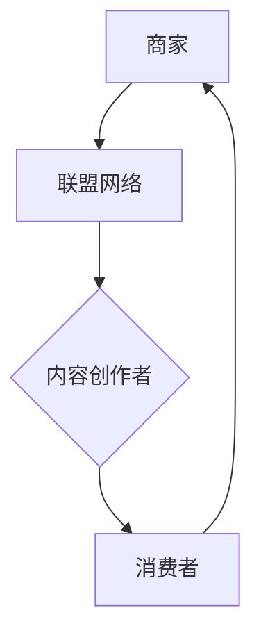

                 

 联盟营销是一种有效的推广策略，尤其在知识付费产品领域，它可以帮助内容创作者和商家扩大影响力，增加销售量。本文将深入探讨如何利用联盟营销来推广知识付费产品，包括策略选择、执行步骤、优化技巧等方面。

## 关键词 Keywords

- 联盟营销
- 知识付费
- 产品推广
- 佣金模式
- 营销策略
- 创作者变现

## 摘要 Abstract

本文旨在为知识付费产品的创作者和商家提供一套系统化的联盟营销推广策略。通过详细分析联盟营销的基本原理和实施步骤，结合实际案例，探讨如何在竞争激烈的市场中脱颖而出，实现产品的有效推广和销售。

### 1. 背景介绍 Background

随着互联网的快速发展，知识付费市场逐渐成熟。越来越多的创作者和商家通过知识付费产品实现了个人品牌价值的提升和商业变现。然而，在众多竞争者中如何脱颖而出，吸引目标用户，成为每个创作者和商家必须面对的挑战。

联盟营销作为一种高效的推广方式，通过合作伙伴之间的资源整合和优势互补，实现双赢。知识付费产品由于其独特的价值和内容，非常适合采用联盟营销进行推广。本文将围绕联盟营销的核心概念、策略和实施步骤，为知识付费产品的推广提供实用的指导。

### 2. 核心概念与联系 Core Concepts and Relationships

#### 2.1 联盟营销基本概念

联盟营销（Affiliate Marketing）是一种在线营销方式，通过合作伙伴（Affiliate）推广商家（Merchant）的产品，实现销售并获取佣金。联盟营销的核心在于三方协作：商家、联盟合作伙伴和消费者。

- **商家**：提供产品或服务的商家，希望通过联盟营销扩大市场影响力，增加销售。
- **联盟合作伙伴**：通常是内容创作者、博主、社交媒体影响者等，通过推广产品获取佣金。
- **消费者**：通过联盟合作伙伴的推广信息了解并购买产品。

#### 2.2 联盟营销与知识付费的结合

知识付费产品由于其高价值和独特性，非常适合采用联盟营销进行推广。以下是其主要结合点：

- **内容创作者优势**：内容创作者具有专业知识、用户信任和广泛的受众，可以通过高质量的内容推广产品。
- **目标受众匹配**：知识付费产品的目标受众往往具有特定的需求，与联盟合作伙伴的受众高度匹配。
- **高佣金回报**：由于知识付费产品的高价值，联盟营销可以提供较高的佣金比例，激励合作伙伴积极参与。

#### 2.3 Mermaid 流程图

以下是一个简化的联盟营销流程图，展示了各方的互动关系：



### 3. 核心算法原理 & 具体操作步骤 Core Algorithm & Implementation Steps

#### 3.1 算法原理概述

联盟营销的核心算法是基于用户行为分析和效果追踪。商家通过联盟平台为合作伙伴提供推广链接或代码，合作伙伴在推广过程中嵌入这些链接或代码，当消费者通过这些链接购买产品时，系统自动追踪并计算佣金。

#### 3.2 算法步骤详解

1. **商家注册联盟平台**：选择合适的联盟平台，注册成为商家，并申请加入联盟计划。
2. **生成推广链接或代码**：在联盟平台生成推广链接或代码，供合作伙伴使用。
3. **合作伙伴注册并申请**：合作伙伴在联盟平台注册并申请加入联盟计划，审核通过后开始推广。
4. **内容创作与推广**：合作伙伴利用自身渠道（如博客、社交媒体、视频等）发布推广内容，引导用户点击链接或使用代码。
5. **用户购买与追踪**：消费者通过推广链接或代码购买产品，联盟平台自动追踪并记录销售数据。
6. **佣金结算**：在销售完成后，联盟平台根据协议计算并支付佣金给合作伙伴。

#### 3.3 算法优缺点

**优点**：

- **低成本推广**：联盟营销无需直接投入广告费用，通过合作伙伴的资源和影响力进行推广，降低成本。
- **高转化率**：合作伙伴的推广内容更具信任度和针对性，提高用户购买意愿。
- **可追踪性**：联盟营销平台提供详细的数据追踪和分析功能，帮助商家了解推广效果。

**缺点**：

- **佣金成本**：需要向合作伙伴支付一定比例的佣金，降低利润空间。
- **管理复杂性**：需要维护与多个合作伙伴的关系，管理推广内容和链接。

#### 3.4 算法应用领域

联盟营销广泛应用于电商、教育、金融、健康等多个领域。在知识付费领域，尤其适用于以下场景：

- **在线课程**：创作者可以通过联盟营销推广自己的课程，吸引更多学员。
- **专业咨询**：专家可以与联盟平台合作，推广自己的咨询服务。
- **电子书**：作者可以通过联盟营销推广自己的电子书，增加销量。

### 4. 数学模型和公式 Mathematical Models and Formulas

#### 4.1 数学模型构建

在联盟营销中，常用的数学模型是转化率模型，用于预测推广效果和计算佣金。其基本公式为：

$$ 转化率 = \frac{购买用户数}{点击用户数} $$

#### 4.2 公式推导过程

转化率的推导基于以下假设：

- **点击用户数**：通过合作伙伴的推广链接或代码点击进入商家的产品页面。
- **购买用户数**：点击用户中最终完成购买的用户。

根据这些假设，转化率可以通过以下步骤推导：

1. 定义点击用户数为 \(I\)，购买用户数为 \(P\)。
2. 转化率 \(R\) 表示为购买用户数与点击用户数的比值。
3. 因此，转化率公式为：

$$ R = \frac{P}{I} $$

#### 4.3 案例分析与讲解

假设一个课程推广活动，共产生了100次点击，其中20次完成了购买。那么，该课程的转化率计算如下：

$$ R = \frac{20}{100} = 0.2 $$

转化率为20%，表明每5次点击中有1次转化为购买。

### 5. 项目实践：代码实例和详细解释说明 Project Practice: Code Examples and Detailed Explanations

#### 5.1 开发环境搭建

在实现联盟营销系统时，通常需要搭建以下开发环境：

- **后端开发环境**：使用Python、Java或Node.js等后端技术，搭建联盟营销平台。
- **前端开发环境**：使用HTML、CSS和JavaScript等技术，实现用户界面。
- **数据库**：使用MySQL、PostgreSQL等关系型数据库存储用户数据和销售记录。

#### 5.2 源代码详细实现

以下是一个简单的联盟营销系统的伪代码实现：

```python
# 用户注册
def register_user(username, email):
    # 存储用户信息到数据库
    save_to_database('users', {'username': username, 'email': email})

# 用户登录
def login_user(username, password):
    # 验证用户信息并返回登录状态
    return check_credentials('users', username, password)

# 生成推广链接
def generate_affiliate_link(product_id, affiliate_id):
    # 生成独特的推广链接
    return f"{base_url}/p/{product_id}?affiliate={affiliate_id}"

# 记录点击
def record_click(affiliate_link):
    # 记录点击事件到数据库
    save_to_database('clicks', {'affiliate_link': affiliate_link})

# 记录购买
def record_purchase(product_id, affiliate_id):
    # 更新销售记录并计算佣金
    update_sales_record(product_id, affiliate_id)
    calculate_commission(affiliate_id)

# 计算佣金
def calculate_commission(affiliate_id):
    # 根据销售记录计算佣金并支付给合作伙伴
    sales = get_sales_for_affiliate(affiliate_id)
    commission_rate = 0.2
    total_commission = sum(sales) * commission_rate
    pay_affiliate(affiliate_id, total_commission)
```

#### 5.3 代码解读与分析

上述代码实现了联盟营销系统的核心功能，包括用户注册、登录、生成推广链接、记录点击和购买、计算佣金等。

- **用户注册和登录**：使用数据库存储和验证用户信息，确保系统的安全性。
- **生成推广链接**：通过产品ID和合作伙伴ID生成独特的推广链接，方便追踪和记录。
- **记录点击和购买**：通过记录点击事件和购买记录，为后续的佣金计算提供数据支持。
- **计算佣金**：根据销售记录和佣金率，计算并支付佣金给合作伙伴。

#### 5.4 运行结果展示

假设有一个合作伙伴ID为1的用户，通过推广链接引导了10个用户点击，其中2个用户完成了购买。佣金计算如下：

1. 销售总额为 \(2 \times 100\) 元 = 200元。
2. 佣金率为20%，佣金金额为 \(200 \times 0.2\) 元 = 40元。

系统将向该合作伙伴支付40元佣金。

### 6. 实际应用场景 Real-world Applications

#### 6.1 在线教育平台

在线教育平台通常采用联盟营销来推广课程和培训班。通过邀请教育博主、名师和机构合作，利用他们的专业影响力和受众，提高课程曝光度和销售量。

#### 6.2 电子书销售

电子书作者可以通过联盟营销平台，与阅读平台和内容创作者合作，推广自己的书籍。合作伙伴可以在自己的网站、博客或社交媒体上推荐书籍，吸引读者购买。

#### 6.3 专业咨询服务

专业咨询机构和专家可以通过联盟营销，与专业领域的影响者合作，推广自己的咨询服务。通过影响者的推荐，吸引潜在客户并实现咨询销售。

### 7. 工具和资源推荐 Tools and Resources

#### 7.1 学习资源推荐

- **书籍**：《联盟营销实战手册》、《内容营销攻略：从零开始打造爆款内容》。
- **在线课程**：Udemy、Coursera上的联盟营销和内容营销相关课程。

#### 7.2 开发工具推荐

- **联盟营销平台**：ShareASale、ClickBank、Amazon Associates。
- **数据分析工具**：Google Analytics、KissMetrics。

#### 7.3 相关论文推荐

- **论文**：《联盟营销的激励机制研究》、《内容营销在知识付费领域的应用》。

### 8. 总结 Summary

联盟营销作为一种高效的推广策略，在知识付费领域具有广泛的应用前景。通过系统化的联盟营销策略，知识付费产品的创作者和商家可以实现产品的有效推广和销售。然而，联盟营销也面临一定的挑战，如佣金成本、管理复杂性等。未来的发展趋势包括更智能的算法应用、个性化推荐和跨平台合作等。

### 9. 附录：常见问题与解答 Appendices: Frequently Asked Questions and Answers

#### 9.1 联盟营销如何保证效果？

联盟营销的效果取决于多个因素，包括合作伙伴的质量、推广内容的质量和目标受众的匹配度。选择合适的联盟平台，制定明确的推广策略，并定期跟踪和分析数据，可以帮助优化推广效果。

#### 9.2 联盟营销有哪些风险？

联盟营销的主要风险包括佣金成本、合作伙伴的质量不稳定以及推广内容的真实性。商家需要制定合理的佣金策略，选择有信誉的联盟平台和合作伙伴，并确保推广内容真实可靠。

#### 9.3 如何选择合适的联盟平台？

选择合适的联盟平台需要考虑多个因素，包括平台的规模、佣金结构、合作伙伴的质量、数据追踪和分析功能等。商家可以根据自己的需求和目标，选择最适合自己的联盟平台。

---

**作者：禅与计算机程序设计艺术 / Zen and the Art of Computer Programming**

