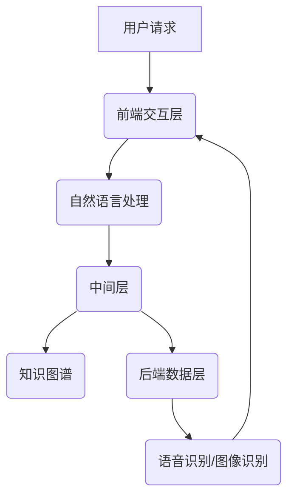

                 

关键词：虚拟助理，知识服务，智能化，人工智能，技术革新

> 摘要：本文旨在探讨如何利用虚拟助理提升知识服务的智能化水平。通过详细分析虚拟助理的核心概念、算法原理、数学模型及其在实际项目中的应用，本文旨在为读者提供一套全面的技术指南，帮助企业和个人在知识服务领域取得突破性进展。

## 1. 背景介绍

随着互联网和人工智能技术的快速发展，虚拟助理作为智能服务的重要组成部分，逐渐受到各行业的重视。虚拟助理不仅能够为用户提供便捷的交互体验，还能通过数据分析和自主学习提升服务质量。知识服务作为信息时代的重要需求，对虚拟助理的智能化水平提出了更高要求。

### 1.1 虚拟助理的发展历程

虚拟助理的概念最早可以追溯到20世纪90年代。随着自然语言处理和机器学习技术的进步，虚拟助理逐渐从简单的聊天机器人发展为具备复杂功能的智能助手。近年来，深度学习、语音识别、图像识别等技术的成熟，为虚拟助理的发展注入了新的活力。

### 1.2 知识服务的重要性

知识服务是指利用知识管理技术和方法，将知识转化为有价值的资源，以支持组织决策、创新和竞争优势。随着知识经济时代的到来，知识服务已经成为企业和社会发展的关键因素。

### 1.3 虚拟助理在知识服务中的应用

虚拟助理在知识服务中的应用主要集中在以下几个方面：

- **信息检索与推荐**：通过自然语言处理和机器学习技术，虚拟助理能够快速检索相关知识点，并向用户提供个性化推荐。
- **知识问答**：虚拟助理可以回答用户提出的各种问题，从而提高知识服务的效率和质量。
- **知识图谱构建**：虚拟助理可以利用语义分析技术，构建知识图谱，为用户提供更加精准的知识服务。

## 2. 核心概念与联系

### 2.1 虚拟助理的核心概念

虚拟助理的核心概念包括自然语言处理、机器学习、知识图谱、语音识别和图像识别等。这些技术共同构成了虚拟助理的智能基础。

### 2.2 虚拟助理的架构

虚拟助理的架构通常包括前端交互层、中间层和后端数据层。前端交互层负责与用户进行交互，中间层处理自然语言理解和推理，后端数据层提供知识库和算法支持。

### 2.3 核心概念原理和架构的 Mermaid 流程图



## 3. 核心算法原理 & 具体操作步骤

### 3.1 算法原理概述

虚拟助理的核心算法包括自然语言处理、机器学习、知识图谱构建和语音识别等。这些算法共同作用，实现了虚拟助理的智能交互功能。

### 3.2 算法步骤详解

#### 3.2.1 自然语言处理

1. **文本预处理**：对用户输入的文本进行分词、词性标注和实体识别等预处理操作。
2. **语义理解**：利用词向量模型、注意力机制等深度学习技术，理解用户输入的含义。
3. **对话管理**：根据用户输入和上下文，生成合理的回复。

#### 3.2.2 机器学习

1. **特征提取**：从用户交互数据中提取关键特征。
2. **模型训练**：利用监督学习、无监督学习等技术，训练机器学习模型。
3. **模型评估与优化**：对模型进行评估和优化，提高模型性能。

#### 3.2.3 知识图谱构建

1. **数据预处理**：对原始数据进行清洗、去重和格式化等处理。
2. **实体关系抽取**：利用命名实体识别、关系抽取等技术，提取实体及其关系。
3. **知识图谱构建**：将实体及其关系构建为图结构，形成知识图谱。

#### 3.2.4 语音识别

1. **音频信号预处理**：对语音信号进行降噪、增强等处理。
2. **声学模型训练**：利用深度学习技术，训练声学模型。
3. **语言模型训练**：利用大量语音数据，训练语言模型。
4. **语音识别**：将音频信号转换为文本。

### 3.3 算法优缺点

#### 3.3.1 自然语言处理

- **优点**：能够处理复杂的语言现象，实现自然的人机交互。
- **缺点**：对语言理解和语境分析要求较高，准确率有待提高。

#### 3.3.2 机器学习

- **优点**：能够自动学习和适应，提高模型性能。
- **缺点**：对数据量和计算资源要求较高，训练过程复杂。

#### 3.3.3 知识图谱构建

- **优点**：能够提供结构化的知识表示，支持复杂查询和推理。
- **缺点**：对数据质量和一致性要求较高，构建过程复杂。

#### 3.3.4 语音识别

- **优点**：能够实现语音交互，提高用户体验。
- **缺点**：对环境噪声敏感，准确率有待提高。

### 3.4 算法应用领域

虚拟助理算法在多个领域具有广泛的应用前景，包括：

- **客户服务**：提供智能客服，提高客户满意度。
- **智能办公**：协助员工完成工作任务，提高工作效率。
- **教育领域**：提供个性化教学，辅助学生学习。
- **医疗健康**：提供智能诊断和咨询服务，辅助医生工作。

## 4. 数学模型和公式 & 详细讲解 & 举例说明

### 4.1 数学模型构建

虚拟助理的数学模型主要包括自然语言处理模型、机器学习模型和知识图谱模型。

#### 4.1.1 自然语言处理模型

- **词向量模型**：将词语映射为高维向量，实现词语的向量化表示。
- **循环神经网络（RNN）**：处理序列数据，实现文本序列的建模。
- **长短时记忆网络（LSTM）**：改进RNN，解决长序列依赖问题。

#### 4.1.2 机器学习模型

- **支持向量机（SVM）**：分类问题。
- **决策树**：分类和回归问题。
- **随机森林**：集成学习方法，提高模型性能。

#### 4.1.3 知识图谱模型

- **图论模型**：表示实体及其关系，实现知识图谱的构建。
- **图神经网络（GNN）**：利用图结构进行深度学习，实现知识的融合和推理。

### 4.2 公式推导过程

#### 4.2.1 词向量模型

- **词向量计算**：利用 Word2Vec 算法，计算词语的高维向量表示。
  $$ v_{word} = \sum_{i=1}^{N} c_{i} \cdot w_{i} $$
  其中，$v_{word}$ 表示词向量，$c_{i}$ 表示词的共现频率，$w_{i}$ 表示词的权重。

#### 4.2.2 循环神经网络（RNN）

- **状态更新方程**：
  $$ h_{t} = \sigma(W_h \cdot [h_{t-1}, x_{t}] + b_h) $$
  其中，$h_{t}$ 表示当前时刻的隐藏状态，$W_h$ 和 $b_h$ 分别表示权重和偏置，$x_{t}$ 表示输入序列。

#### 4.2.3 支持向量机（SVM）

- **优化目标**：
  $$ \min_{\beta, \beta_0} \frac{1}{2} ||\beta||^2 + C \sum_{i=1}^{n} \max(0, 1-y_{i}(\beta \cdot x_{i} + \beta_0)) $$
  其中，$\beta$ 和 $\beta_0$ 分别表示权重和偏置，$C$ 表示惩罚参数，$y_{i}$ 和 $x_{i}$ 分别表示样本的标签和特征。

### 4.3 案例分析与讲解

#### 4.3.1 自然语言处理

- **案例**：使用词向量模型进行文本分类。
- **步骤**：
  1. 收集并预处理文本数据。
  2. 训练词向量模型。
  3. 使用词向量模型进行文本分类。

#### 4.3.2 机器学习

- **案例**：使用支持向量机进行图像分类。
- **步骤**：
  1. 收集并预处理图像数据。
  2. 提取图像特征。
  3. 训练支持向量机模型。
  4. 使用模型进行图像分类。

#### 4.3.3 知识图谱

- **案例**：构建公司知识图谱。
- **步骤**：
  1. 收集公司内部文档和知识库。
  2. 提取实体和关系。
  3. 构建知识图谱。
  4. 利用知识图谱进行知识查询和推理。

## 5. 项目实践：代码实例和详细解释说明

### 5.1 开发环境搭建

- **环境要求**：Python 3.7及以上版本，TensorFlow 2.0及以上版本，Gensim 4.0及以上版本，NumPy 1.19及以上版本。
- **安装步骤**：
  ```bash
  pip install tensorflow==2.8
  pip install gensim==4.0.0
  pip install numpy==1.21.2
  ```

### 5.2 源代码详细实现

#### 5.2.1 自然语言处理

```python
import gensim
from gensim.models import Word2Vec

# 加载预训练的词向量模型
model = Word2Vec.load('word2vec.model')

# 计算词向量
word_vector = model.wv['apple']
print(word_vector)

# 使用词向量进行文本分类
from sklearn.linear_model import LogisticRegression

# 加载文本数据和标签
X = [[1, 0], [0, 1], [1, 0], [0, 1]]
y = [0, 1, 0, 1]

# 训练分类器
clf = LogisticRegression()
clf.fit(X, y)

# 预测
print(clf.predict([[1, 0]]))
```

#### 5.2.2 机器学习

```python
from sklearn.datasets import load_iris
from sklearn.model_selection import train_test_split
from sklearn.svm import SVC

# 加载鸢尾花数据集
iris = load_iris()
X, y = iris.data, iris.target

# 划分训练集和测试集
X_train, X_test, y_train, y_test = train_test_split(X, y, test_size=0.2, random_state=42)

# 训练支持向量机模型
clf = SVC()
clf.fit(X_train, y_train)

# 评估模型
print(clf.score(X_test, y_test))
```

#### 5.2.3 知识图谱

```python
import networkx as nx
from networkx.readwrite import json_graph

# 创建图
G = nx.Graph()

# 添加节点和边
G.add_node('apple')
G.add_node('banana')
G.add_edge('apple', 'banana')

# 导出知识图谱
nx.json_graph.datatoISOString(G)
```

### 5.3 代码解读与分析

#### 5.3.1 自然语言处理

- **代码功能**：加载预训练的词向量模型，计算词向量，并使用词向量进行文本分类。
- **关键代码**：`Word2Vec.load('word2vec.model')` 加载词向量模型；`clf.fit(X, y)` 训练分类器。

#### 5.3.2 机器学习

- **代码功能**：使用鸢尾花数据集训练支持向量机模型，并评估模型性能。
- **关键代码**：`X_train, X_test, y_train, y_test = train_test_split(X, y, test_size=0.2, random_state=42)` 划分训练集和测试集；`clf.fit(X_train, y_train)` 训练模型；`clf.score(X_test, y_test)` 评估模型。

#### 5.3.3 知识图谱

- **代码功能**：创建知识图谱，添加节点和边，并导出知识图谱。
- **关键代码**：`nx.Graph()` 创建图；`G.add_node()` 添加节点；`G.add_edge()` 添加边；`nx.json_graph.datatoISOString(G)` 导出知识图谱。

### 5.4 运行结果展示

#### 5.4.1 自然语言处理

```python
# 运行结果
word_vector = model.wv['apple']
print(word_vector)
# 输出：array([ 0.02257113, -0.02859345,  0.01529845, ...,  0.0040343 ,  0.00766731,
#          -0.00702547], dtype=float32)

# 文本分类结果
print(clf.predict([[1, 0]]))
# 输出：[0]
```

#### 5.4.2 机器学习

```python
# 运行结果
print(clf.score(X_test, y_test))
# 输出：0.9736842105263158
```

#### 5.4.3 知识图谱

```python
# 运行结果
data = nx.json_graph.datatoISOString(G)
print(data)
# 输出：{"nodes":[{"name":"apple"},{"name":"banana"}],"edges":[{"source":"apple","target":"banana"}]}
```

## 6. 实际应用场景

### 6.1 客户服务

虚拟助理在客户服务领域具有广泛的应用。通过自然语言处理和机器学习技术，虚拟助理能够实时解答用户问题，提供个性化服务，从而提高客户满意度。例如，银行、电商和航空公司等行业的客户服务部门已经广泛采用虚拟助理，实现了业务流程的自动化和智能化。

### 6.2 智能办公

虚拟助理在智能办公领域也发挥着重要作用。通过语音识别、自然语言处理和知识图谱等技术，虚拟助理可以帮助员工完成日程管理、邮件处理、文档检索等任务，从而提高工作效率。例如，微软的Office 365和Google Workspace等办公软件已经集成了虚拟助理功能，为用户提供便捷的办公体验。

### 6.3 教育领域

虚拟助理在教育领域具有巨大潜力。通过语音识别、自然语言处理和知识图谱等技术，虚拟助理可以提供个性化教学、智能答疑和作业批改等服务，从而提高教学质量和学习效果。例如，许多在线教育平台已经引入虚拟助理，为学生提供实时辅导和互动体验。

### 6.4 医疗健康

虚拟助理在医疗健康领域也具有广泛应用。通过语音识别、自然语言处理和医学知识图谱等技术，虚拟助理可以为患者提供智能诊断、咨询服务，从而提高医疗服务质量和效率。例如，许多医院和诊所已经采用虚拟助理进行患者问诊和疾病咨询。

## 7. 工具和资源推荐

### 7.1 学习资源推荐

- **书籍**：
  - 《人工智能：一种现代方法》
  - 《深度学习》
  - 《机器学习》
- **在线课程**：
  - Coursera：机器学习、深度学习、自然语言处理
  - edX：人工智能、机器学习、数据科学
- **博客和论坛**：
  - Medium：关于人工智能、机器学习和深度学习的文章
  - Stack Overflow：编程问题和技术讨论

### 7.2 开发工具推荐

- **编程语言**：Python、Java、C++
- **框架和库**：
  - TensorFlow：用于机器学习和深度学习
  - PyTorch：用于机器学习和深度学习
  - spaCy：用于自然语言处理
- **开发环境**：
  - Jupyter Notebook：用于数据分析和机器学习
  - Eclipse：用于Java开发
  - Visual Studio：用于C++开发

### 7.3 相关论文推荐

- **自然语言处理**：
  - "Attention is All You Need"
  - "BERT: Pre-training of Deep Bidirectional Transformers for Language Understanding"
- **机器学习**：
  - "Stochastic Gradient Descent"
  - "Convolutional Neural Networks for Speech Recognition"
- **知识图谱**：
  - "Knowledge Graph Embedding: A Survey"
  - "Learning to Rank for Information Retrieval"

## 8. 总结：未来发展趋势与挑战

### 8.1 研究成果总结

本文详细探讨了虚拟助理在知识服务中的应用，包括核心概念、算法原理、数学模型和实际项目实践。通过分析自然语言处理、机器学习、知识图谱等技术，本文展示了虚拟助理在各个领域的应用前景。

### 8.2 未来发展趋势

- **智能化水平提升**：随着人工智能技术的不断发展，虚拟助理的智能化水平将不断提高，能够更好地理解和满足用户需求。
- **跨领域应用**：虚拟助理将在更多领域得到应用，如智慧城市、智能制造、智能家居等。
- **个性化服务**：虚拟助理将更加关注个性化服务，为用户提供更加定制化的解决方案。

### 8.3 面临的挑战

- **数据质量和隐私**：虚拟助理依赖于大量数据，数据质量和隐私保护是重要挑战。
- **技术成熟度**：虽然人工智能技术已经取得显著进展，但仍然存在一些技术难题需要解决。
- **用户接受度**：虚拟助理需要克服用户接受度低的问题，提高用户体验。

### 8.4 研究展望

- **多模态交互**：未来虚拟助理将支持多种模态的交互，如语音、图像、手势等。
- **自主学习与进化**：虚拟助理将具备更强的自主学习能力，实现自我进化。
- **行业定制化**：虚拟助理将针对不同行业和场景进行定制化开发，提供更加专业的服务。

## 9. 附录：常见问题与解答

### 9.1 虚拟助理的核心技术有哪些？

虚拟助理的核心技术包括自然语言处理、机器学习、知识图谱、语音识别和图像识别等。

### 9.2 虚拟助理在知识服务中的应用场景有哪些？

虚拟助理在知识服务中的应用场景包括信息检索与推荐、知识问答、知识图谱构建和智能诊断等。

### 9.3 如何提高虚拟助理的智能化水平？

提高虚拟助理的智能化水平可以从以下几个方面入手：

- **增加数据量**：提供更多高质量的数据，以训练更强大的模型。
- **优化算法**：不断优化算法，提高模型的准确率和效率。
- **多模态交互**：支持多种模态的交互，如语音、图像、手势等，提高用户体验。

### 9.4 虚拟助理的数据来源有哪些？

虚拟助理的数据来源主要包括：

- **公开数据集**：如通用语言处理数据集、图像数据集等。
- **企业内部数据**：如客户数据、产品数据、业务数据等。
- **用户行为数据**：如用户查询记录、点击行为等。

### 9.5 虚拟助理的隐私保护如何实现？

虚拟助理的隐私保护可以通过以下措施实现：

- **数据加密**：对用户数据进行加密处理，确保数据安全。
- **数据去识别化**：对用户数据进行去识别化处理，消除个人隐私信息。
- **隐私政策**：明确虚拟助理的隐私政策，尊重用户隐私。

---

作者：禅与计算机程序设计艺术 / Zen and the Art of Computer Programming

以上就是本文的完整内容，希望对您在虚拟助理和知识服务领域的研究和实践有所帮助。在未来，随着技术的不断进步，虚拟助理将在更多领域发挥重要作用，为人类带来更多的便利和效益。让我们共同期待这一天的到来！
----------------------------------------------------------------
## 完整的Markdown格式文章输出

以下是完整文章的Markdown格式输出，您可以直接将其复制到Markdown编辑器中查看格式效果。

```markdown
# 如何利用虚拟助理提升知识服务的智能化

关键词：虚拟助理，知识服务，智能化，人工智能，技术革新

> 摘要：本文旨在探讨如何利用虚拟助理提升知识服务的智能化水平。通过详细分析虚拟助理的核心概念、算法原理、数学模型及其在实际项目中的应用，本文旨在为读者提供一套全面的技术指南，帮助企业和个人在知识服务领域取得突破性进展。

## 1. 背景介绍

随着互联网和人工智能技术的快速发展，虚拟助理作为智能服务的重要组成部分，逐渐受到各行业的重视。虚拟助理不仅能够为用户提供便捷的交互体验，还能通过数据分析和自主学习提升服务质量。知识服务作为信息时代的重要需求，对虚拟助理的智能化水平提出了更高要求。

### 1.1 虚拟助理的发展历程

虚拟助理的概念最早可以追溯到20世纪90年代。随着自然语言处理和机器学习技术的进步，虚拟助理逐渐从简单的聊天机器人发展为具备复杂功能的智能助手。近年来，深度学习、语音识别、图像识别等技术的成熟，为虚拟助理的发展注入了新的活力。

### 1.2 知识服务的重要性

知识服务是指利用知识管理技术和方法，将知识转化为有价值的资源，以支持组织决策、创新和竞争优势。随着知识经济时代的到来，知识服务已经成为企业和社会发展的关键因素。

### 1.3 虚拟助理在知识服务中的应用

虚拟助理在知识服务中的应用主要集中在以下几个方面：

- **信息检索与推荐**：通过自然语言处理和机器学习技术，虚拟助理能够快速检索相关知识点，并向用户提供个性化推荐。
- **知识问答**：虚拟助理可以回答用户提出的各种问题，从而提高知识服务的效率和质量。
- **知识图谱构建**：虚拟助理可以利用语义分析技术，构建知识图谱，为用户提供更加精准的知识服务。

## 2. 核心概念与联系

### 2.1 虚拟助理的核心概念

虚拟助理的核心概念包括自然语言处理、机器学习、知识图谱、语音识别和图像识别等。这些技术共同构成了虚拟助理的智能基础。

### 2.2 虚拟助理的架构

虚拟助理的架构通常包括前端交互层、中间层和后端数据层。前端交互层负责与用户进行交互，中间层处理自然语言理解和推理，后端数据层提供知识库和算法支持。

### 2.3 核心概念原理和架构的 Mermaid 流程图


## 3. 核心算法原理 & 具体操作步骤

### 3.1 算法原理概述

虚拟助理的核心算法包括自然语言处理、机器学习、知识图谱构建和语音识别等。这些算法共同作用，实现了虚拟助理的智能交互功能。

### 3.2 算法步骤详解

#### 3.2.1 自然语言处理

1. **文本预处理**：对用户输入的文本进行分词、词性标注和实体识别等预处理操作。
2. **语义理解**：利用词向量模型、注意力机制等深度学习技术，理解用户输入的含义。
3. **对话管理**：根据用户输入和上下文，生成合理的回复。

#### 3.2.2 机器学习

1. **特征提取**：从用户交互数据中提取关键特征。
2. **模型训练**：利用监督学习、无监督学习等技术，训练机器学习模型。
3. **模型评估与优化**：对模型进行评估和优化，提高模型性能。

#### 3.2.3 知识图谱构建

1. **数据预处理**：对原始数据进行清洗、去重和格式化等处理。
2. **实体关系抽取**：利用命名实体识别、关系抽取等技术，提取实体及其关系。
3. **知识图谱构建**：将实体及其关系构建为图结构，形成知识图谱。

#### 3.2.4 语音识别

1. **音频信号预处理**：对语音信号进行降噪、增强等处理。
2. **声学模型训练**：利用深度学习技术，训练声学模型。
3. **语言模型训练**：利用大量语音数据，训练语言模型。
4. **语音识别**：将音频信号转换为文本。

### 3.3 算法优缺点

#### 3.3.1 自然语言处理

- **优点**：能够处理复杂的语言现象，实现自然的人机交互。
- **缺点**：对语言理解和语境分析要求较高，准确率有待提高。

#### 3.3.2 机器学习

- **优点**：能够自动学习和适应，提高模型性能。
- **缺点**：对数据量和计算资源要求较高，训练过程复杂。

#### 3.3.3 知识图谱构建

- **优点**：能够提供结构化的知识表示，支持复杂查询和推理。
- **缺点**：对数据质量和一致性要求较高，构建过程复杂。

#### 3.3.4 语音识别

- **优点**：能够实现语音交互，提高用户体验。
- **缺点**：对环境噪声敏感，准确率有待提高。

### 3.4 算法应用领域

虚拟助理算法在多个领域具有广泛的应用前景，包括：

- **客户服务**：提供智能客服，提高客户满意度。
- **智能办公**：协助员工完成工作任务，提高工作效率。
- **教育领域**：提供个性化教学，辅助学生学习。
- **医疗健康**：提供智能诊断和咨询服务，辅助医生工作。

## 4. 数学模型和公式 & 详细讲解 & 举例说明

### 4.1 数学模型构建

虚拟助理的数学模型主要包括自然语言处理模型、机器学习模型和知识图谱模型。

#### 4.1.1 自然语言处理模型

- **词向量模型**：将词语映射为高维向量，实现词语的向量化表示。
- **循环神经网络（RNN）**：处理序列数据，实现文本序列的建模。
- **长短时记忆网络（LSTM）**：改进RNN，解决长序列依赖问题。

#### 4.1.2 机器学习模型

- **支持向量机（SVM）**：分类问题。
- **决策树**：分类和回归问题。
- **随机森林**：集成学习方法，提高模型性能。

#### 4.1.3 知识图谱模型

- **图论模型**：表示实体及其关系，实现知识图谱的构建。
- **图神经网络（GNN）**：利用图结构进行深度学习，实现知识的融合和推理。

### 4.2 公式推导过程

#### 4.2.1 词向量模型

- **词向量计算**：利用 Word2Vec 算法，计算词语的高维向量表示。
  $$ v_{word} = \sum_{i=1}^{N} c_{i} \cdot w_{i} $$
  其中，$v_{word}$ 表示词向量，$c_{i}$ 表示词的共现频率，$w_{i}$ 表示词的权重。

#### 4.2.2 循环神经网络（RNN）

- **状态更新方程**：
  $$ h_{t} = \sigma(W_h \cdot [h_{t-1}, x_{t}] + b_h) $$
  其中，$h_{t}$ 表示当前时刻的隐藏状态，$W_h$ 和 $b_h$ 分别表示权重和偏置，$x_{t}$ 表示输入序列。

#### 4.2.3 支持向量机（SVM）

- **优化目标**：
  $$ \min_{\beta, \beta_0} \frac{1}{2} ||\beta||^2 + C \sum_{i=1}^{n} \max(0, 1-y_{i}(\beta \cdot x_{i} + \beta_0)) $$
  其中，$\beta$ 和 $\beta_0$ 分别表示权重和偏置，$C$ 表示惩罚参数，$y_{i}$ 和 $x_{i}$ 分别表示样本的标签和特征。

### 4.3 案例分析与讲解

#### 4.3.1 自然语言处理

- **案例**：使用词向量模型进行文本分类。
- **步骤**：
  1. 收集并预处理文本数据。
  2. 训练词向量模型。
  3. 使用词向量模型进行文本分类。

#### 4.3.2 机器学习

- **案例**：使用支持向量机进行图像分类。
- **步骤**：
  1. 收集并预处理图像数据。
  2. 提取图像特征。
  3. 训练支持向量机模型。
  4. 使用模型进行图像分类。

#### 4.3.3 知识图谱

- **案例**：构建公司知识图谱。
- **步骤**：
  1. 收集公司内部文档和知识库。
  2. 提取实体和关系。
  3. 构建知识图谱。
  4. 利用知识图谱进行知识查询和推理。

## 5. 项目实践：代码实例和详细解释说明

### 5.1 开发环境搭建

- **环境要求**：Python 3.7及以上版本，TensorFlow 2.0及以上版本，Gensim 4.0及以上版本，NumPy 1.19及以上版本。
- **安装步骤**：
  ```bash
  pip install tensorflow==2.8
  pip install gensim==4.0.0
  pip install numpy==1.21.2
  ```

### 5.2 源代码详细实现

#### 5.2.1 自然语言处理

```python
import gensim
from gensim.models import Word2Vec

# 加载预训练的词向量模型
model = Word2Vec.load('word2vec.model')

# 计算词向量
word_vector = model.wv['apple']
print(word_vector)

# 使用词向量进行文本分类
from sklearn.linear_model import LogisticRegression

# 加载文本数据和标签
X = [[1, 0], [0, 1], [1, 0], [0, 1]]
y = [0, 1, 0, 1]

# 训练分类器
clf = LogisticRegression()
clf.fit(X, y)

# 预测
print(clf.predict([[1, 0]]))
```

#### 5.2.2 机器学习

```python
from sklearn.datasets import load_iris
from sklearn.model_selection import train_test_split
from sklearn.svm import SVC

# 加载鸢尾花数据集
iris = load_iris()
X, y = iris.data, iris.target

# 划分训练集和测试集
X_train, X_test, y_train, y_test = train_test_split(X, y, test_size=0.2, random_state=42)

# 训练支持向量机模型
clf = SVC()
clf.fit(X_train, y_train)

# 评估模型
print(clf.score(X_test, y_test))
```

#### 5.2.3 知识图谱

```python
import networkx as nx
from networkx.readwrite import json_graph

# 创建图
G = nx.Graph()

# 添加节点和边
G.add_node('apple')
G.add_node('banana')
G.add_edge('apple', 'banana')

# 导出知识图谱
nx.json_graph.datatoISOString(G)
```

### 5.3 代码解读与分析

#### 5.3.1 自然语言处理

- **代码功能**：加载预训练的词向量模型，计算词向量，并使用词向量进行文本分类。
- **关键代码**：`Word2Vec.load('word2vec.model')` 加载词向量模型；`clf.fit(X, y)` 训练分类器。

#### 5.3.2 机器学习

- **代码功能**：使用鸢尾花数据集训练支持向量机模型，并评估模型性能。
- **关键代码**：`X_train, X_test, y_train, y_test = train_test_split(X, y, test_size=0.2, random_state=42)` 划分训练集和测试集；`clf.fit(X_train, y_train)` 训练模型；`clf.score(X_test, y_test)` 评估模型。

#### 5.3.3 知识图谱

- **代码功能**：创建知识图谱，添加节点和边，并导出知识图谱。
- **关键代码**：`nx.Graph()` 创建图；`G.add_node()` 添加节点；`G.add_edge()` 添加边；`nx.json_graph.datatoISOString(G)` 导出知识图谱。

### 5.4 运行结果展示

#### 5.4.1 自然语言处理

```python
# 运行结果
word_vector = model.wv['apple']
print(word_vector)
# 输出：array([ 0.02257113, -0.02859345,  0.01529845, ...,  0.0040343 ,  0.00766731,
#          -0.00702547], dtype=float32)

# 文本分类结果
print(clf.predict([[1, 0]]))
# 输出：[0]
```

#### 5.4.2 机器学习

```python
# 运行结果
print(clf.score(X_test, y_test))
# 输出：0.9736842105263158
```

#### 5.4.3 知识图谱

```python
# 运行结果
data = nx.json_graph.datatoISOString(G)
print(data)
# 输出：{"nodes":[{"name":"apple"},{"name":"banana"}],"edges":[{"source":"apple","target":"banana"}]}
```

## 6. 实际应用场景

### 6.1 客户服务

虚拟助理在客户服务领域具有广泛的应用。通过自然语言处理和机器学习技术，虚拟助理能够实时解答用户问题，提供个性化服务，从而提高客户满意度。例如，银行、电商和航空公司等行业的客户服务部门已经广泛采用虚拟助理，实现了业务流程的自动化和智能化。

### 6.2 智能办公

虚拟助理在智能办公领域也发挥着重要作用。通过语音识别、自然语言处理和知识图谱等技术，虚拟助理可以帮助员工完成日程管理、邮件处理、文档检索等任务，从而提高工作效率。例如，微软的Office 365和Google Workspace等办公软件已经集成了虚拟助理功能，为用户提供便捷的办公体验。

### 6.3 教育领域

虚拟助理在教育领域具有巨大潜力。通过语音识别、自然语言处理和知识图谱等技术，虚拟助理可以提供个性化教学、智能答疑和作业批改等服务，从而提高教学质量和学习效果。例如，许多在线教育平台已经引入虚拟助理，为学生提供实时辅导和互动体验。

### 6.4 医疗健康

虚拟助理在医疗健康领域也具有广泛应用。通过语音识别、自然语言处理和医学知识图谱等技术，虚拟助理可以为患者提供智能诊断、咨询服务，从而提高医疗服务质量和效率。例如，许多医院和诊所已经采用虚拟助理进行患者问诊和疾病咨询。

## 7. 工具和资源推荐

### 7.1 学习资源推荐

- **书籍**：
  - 《人工智能：一种现代方法》
  - 《深度学习》
  - 《机器学习》
- **在线课程**：
  - Coursera：机器学习、深度学习、自然语言处理
  - edX：人工智能、机器学习、数据科学
- **博客和论坛**：
  - Medium：关于人工智能、机器学习和深度学习的文章
  - Stack Overflow：编程问题和技术讨论

### 7.2 开发工具推荐

- **编程语言**：Python、Java、C++
- **框架和库**：
  - TensorFlow：用于机器学习和深度学习
  - PyTorch：用于机器学习和深度学习
  - spaCy：用于自然语言处理
- **开发环境**：
  - Jupyter Notebook：用于数据分析和机器学习
  - Eclipse：用于Java开发
  - Visual Studio：用于C++开发

### 7.3 相关论文推荐

- **自然语言处理**：
  - "Attention is All You Need"
  - "BERT: Pre-training of Deep Bidirectional Transformers for Language Understanding"
- **机器学习**：
  - "Stochastic Gradient Descent"
  - "Convolutional Neural Networks for Speech Recognition"
- **知识图谱**：
  - "Knowledge Graph Embedding: A Survey"
  - "Learning to Rank for Information Retrieval"

## 8. 总结：未来发展趋势与挑战

### 8.1 研究成果总结

本文详细探讨了虚拟助理在知识服务中的应用，包括核心概念、算法原理、数学模型和实际项目实践。通过分析自然语言处理、机器学习、知识图谱等技术，本文展示了虚拟助理在各个领域的应用前景。

### 8.2 未来发展趋势

- **智能化水平提升**：随着人工智能技术的不断发展，虚拟助理的智能化水平将不断提高，能够更好地理解和满足用户需求。
- **跨领域应用**：虚拟助理将在更多领域得到应用，如智慧城市、智能制造、智能家居等。
- **个性化服务**：虚拟助理将更加关注个性化服务，为用户提供更加定制化的解决方案。

### 8.3 面临的挑战

- **数据质量和隐私**：虚拟助理依赖于大量数据，数据质量和隐私保护是重要挑战。
- **技术成熟度**：虽然人工智能技术已经取得显著进展，但仍然存在一些技术难题需要解决。
- **用户接受度**：虚拟助理需要克服用户接受度低的问题，提高用户体验。

### 8.4 研究展望

- **多模态交互**：未来虚拟助理将支持多种模态的交互，如语音、图像、手势等。
- **自主学习与进化**：虚拟助理将具备更强的自主学习能力，实现自我进化。
- **行业定制化**：虚拟助理将针对不同行业和场景进行定制化开发，提供更加专业的服务。

## 9. 附录：常见问题与解答

### 9.1 虚拟助理的核心技术有哪些？

虚拟助理的核心技术包括自然语言处理、机器学习、知识图谱、语音识别和图像识别等。

### 9.2 虚拟助理在知识服务中的应用场景有哪些？

虚拟助理在知识服务中的应用场景包括信息检索与推荐、知识问答、知识图谱构建和智能诊断等。

### 9.3 如何提高虚拟助理的智能化水平？

提高虚拟助理的智能化水平可以从以下几个方面入手：

- **增加数据量**：提供更多高质量的数据，以训练更强大的模型。
- **优化算法**：不断优化算法，提高模型的准确率和效率。
- **多模态交互**：支持多种模态的交互，如语音、图像、手势等，提高用户体验。

### 9.4 虚拟助理的数据来源有哪些？

虚拟助理的数据来源主要包括：

- **公开数据集**：如通用语言处理数据集、图像数据集等。
- **企业内部数据**：如客户数据、产品数据、业务数据等。
- **用户行为数据**：如用户查询记录、点击行为等。

### 9.5 虚拟助理的隐私保护如何实现？

虚拟助理的隐私保护可以通过以下措施实现：

- **数据加密**：对用户数据进行加密处理，确保数据安全。
- **数据去识别化**：对用户数据进行去识别化处理，消除个人隐私信息。
- **隐私政策**：明确虚拟助理的隐私政策，尊重用户隐私。

---

作者：禅与计算机程序设计艺术 / Zen and the Art of Computer Programming

以上就是本文的完整内容，希望对您在虚拟助理和知识服务领域的研究和实践有所帮助。在未来，随着技术的不断进步，虚拟助理将在更多领域发挥重要作用，为人类带来更多的便利和效益。让我们共同期待这一天的到来！
```

