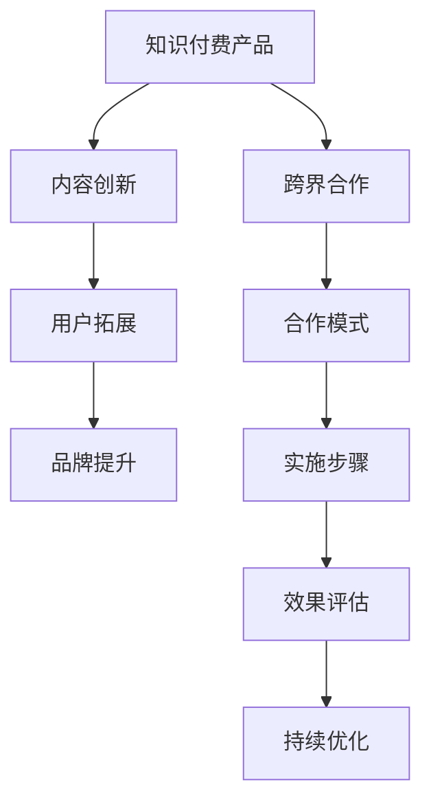

                 

关键词：知识付费、跨界合作、用户增长、营销策略、内容创新

> 摘要：在知识付费领域，跨界合作成为了一种重要的推广策略。本文将探讨如何通过跨界合作来推广知识付费产品，包括合作模式、实施步骤和成功案例，旨在为知识付费从业者提供有益的启示。

## 1. 背景介绍

随着互联网的普及和信息获取渠道的多样化，知识付费市场逐渐兴起。用户对专业知识和技能的需求不断增加，使得知识付费产品在市场上具备了一定的竞争力。然而，如何在众多竞争者中脱颖而出，吸引更多用户，成为知识付费从业者面临的一大挑战。

跨界合作作为一种创新的营销策略，可以帮助知识付费产品实现差异化定位，拓宽受众群体，提升品牌影响力。通过与其他领域的知名品牌或个人合作，知识付费产品可以借助对方的资源、渠道和影响力，实现互利共赢。

## 2. 核心概念与联系

### 2.1 跨界合作的概念

跨界合作是指不同领域的企业、组织或个人之间的合作，通过资源共享、优势互补，实现共同目标。在知识付费领域，跨界合作通常涉及内容创作、品牌推广、用户引流等方面。

### 2.2 知识付费产品与跨界合作的关系

知识付费产品与跨界合作之间的联系主要体现在以下几个方面：

1. **内容创新**：跨界合作可以激发知识付费产品在内容创作上的创新，通过与其他领域的知识相结合，打造出更具吸引力的课程或内容。
2. **用户拓展**：跨界合作有助于拓展知识付费产品的用户群体，通过与其他领域的知名品牌或个人合作，吸引更多潜在用户。
3. **品牌提升**：跨界合作可以提升知识付费产品的品牌影响力，借助合作方的品牌优势，增加用户对产品的信任度和认可度。

### 2.3 跨界合作的Mermaid流程图



## 3. 核心算法原理 & 具体操作步骤

### 3.1 算法原理概述

跨界合作的核心在于整合资源、发挥优势，实现双赢。其原理可以概括为：

1. **资源共享**：双方或多方在内容、渠道、用户等方面进行资源互换，实现优势互补。
2. **利益分配**：根据合作双方的贡献和预期收益，合理分配利益，确保合作持续稳定。
3. **风险共担**：在合作过程中，共同面对潜在的风险和挑战，共同承担责任。

### 3.2 算法步骤详解

1. **寻找合作伙伴**：首先，需要根据知识付费产品的特点和目标用户，寻找具有互补优势的合作伙伴。可以通过行业论坛、社交媒体、合作伙伴推荐等途径进行寻找。
2. **协商合作模式**：确定合作模式，包括内容创作、品牌推广、用户引流等方面。需要明确双方的权利和义务，以及利益分配方式。
3. **策划合作活动**：围绕合作主题，策划一系列合作活动，如线上直播、线下活动、联合推广等，以提升品牌影响力和用户参与度。
4. **实施合作计划**：按照策划的合作活动，逐步实施合作计划，确保各方资源和优势得到充分利用。
5. **效果评估与反馈**：在合作结束后，对合作效果进行评估，收集用户反馈，总结经验教训，为后续合作提供参考。

### 3.3 算法优缺点

**优点**：

1. **提升品牌影响力**：跨界合作可以借助合作方的品牌优势，提升知识付费产品的品牌影响力。
2. **拓展用户群体**：通过与其他领域的知名品牌或个人合作，可以吸引更多潜在用户，拓展用户群体。
3. **降低推广成本**：跨界合作可以共享资源、渠道和用户，降低知识付费产品的推广成本。

**缺点**：

1. **合作风险较大**：跨界合作需要面对不同领域之间的沟通和协调，风险相对较大。
2. **利益分配难度大**：在合作过程中，如何合理分配利益，确保各方满意，是一个挑战。
3. **合作时间较长**：跨界合作通常需要较长时间来实施和效果评估，不利于快速调整和优化。

### 3.4 算法应用领域

跨界合作在知识付费领域的应用较为广泛，如：

1. **教育行业**：知识付费平台与在线教育平台合作，共同推出专业课程。
2. **医疗行业**：医疗知识付费产品与医院、诊所合作，提供专业咨询服务。
3. **金融行业**：金融知识付费产品与金融机构合作，提供理财规划服务。

## 4. 数学模型和公式 & 详细讲解 & 举例说明

### 4.1 数学模型构建

假设知识付费产品A与合作伙伴B进行跨界合作，设A的初始用户数为N1，B的初始用户数为N2。在合作后，A的用户数增长率为r1，B的用户数增长率为r2。则合作后一段时间内，A的用户数为N1*(1+r1)，B的用户数为N2*(1+r2)。

### 4.2 公式推导过程

设知识付费产品A的初始用户数为N1，合作后一段时间内的用户数为N1'。设合作伙伴B的初始用户数为N2，合作后一段时间内的用户数为N2'。根据用户增长模型，可以推导出以下公式：

N1' = N1 * (1 + r1)  
N2' = N2 * (1 + r2)

其中，r1和r2分别为A和B的用户增长率。

### 4.3 案例分析与讲解

假设知识付费产品A的初始用户数为1000，合作后一段时间内的用户增长率为20%。合作伙伴B的初始用户数为500，合作后一段时间内的用户增长率为10%。根据上述公式，可以计算出合作后一段时间内A和B的用户数：

N1' = 1000 * (1 + 0.2) = 1200  
N2' = 500 * (1 + 0.1) = 550

合作后一段时间内，A的用户数为1200，B的用户数为550。通过跨界合作，A的用户数增长了20%，B的用户数增长了10%。

## 5. 项目实践：代码实例和详细解释说明

### 5.1 开发环境搭建

本案例使用Python语言进行跨界合作模型的分析和计算。首先，确保已经安装了Python环境，然后安装以下库：

```bash
pip install numpy matplotlib
```

### 5.2 源代码详细实现

```python
import numpy as np
import matplotlib.pyplot as plt

# 参数设置
N1 = 1000  # 知识付费产品A的初始用户数
N2 = 500   # 合作伙伴B的初始用户数
r1 = 0.2   # A的用户增长率
r2 = 0.1   # B的用户增长率
time = 12  # 分析时间（月）

# 计算用户数
N1_list = [N1 * (1 + r1)**i for i in range(time)]
N2_list = [N2 * (1 + r2)**i for i in range(time)]

# 绘图
plt.plot(range(1, time+1), N1_list, label='A的用户数')
plt.plot(range(1, time+1), N2_list, label='B的用户数')
plt.xlabel('时间（月）')
plt.ylabel('用户数')
plt.legend()
plt.show()
```

### 5.3 代码解读与分析

1. **参数设置**：首先设置知识付费产品A和合作伙伴B的初始用户数、用户增长率以及分析时间。
2. **计算用户数**：使用列表推导式计算合作后一段时间内A和B的用户数，存储在N1_list和N2_list中。
3. **绘图**：使用matplotlib库绘制用户数随时间变化的折线图，以便分析用户增长趋势。

通过上述代码，可以清晰地看到跨界合作对知识付费产品用户增长的影响。在合作期间，A的用户数呈指数级增长，而B的用户数也呈现出稳定的增长趋势。

## 6. 实际应用场景

### 6.1 教育行业

知识付费平台与在线教育平台合作，共同推出专业课程。例如，某在线教育平台与某知名高校合作，推出在线硕士课程。通过这种跨界合作，不仅提升了知识付费平台的内容质量，还吸引了大量高校学生报名学习。

### 6.2 医疗行业

医疗知识付费产品与医院、诊所合作，提供专业咨询服务。例如，某医疗知识付费平台与某知名医院合作，推出医生在线咨询服务。通过这种合作，用户可以方便地获取专业医疗咨询，而医院也可以通过平台扩大影响力，提高品牌知名度。

### 6.3 金融行业

金融知识付费产品与金融机构合作，提供理财规划服务。例如，某金融知识付费平台与某银行合作，推出理财产品推荐服务。通过这种跨界合作，用户可以方便地了解理财产品，金融机构也可以通过平台扩大客户群体。

## 7. 未来应用展望

随着知识付费市场的不断发展，跨界合作将成为一种重要的推广策略。未来，知识付费产品可以与更多领域的品牌或个人进行跨界合作，实现资源共享、优势互补，提升品牌影响力和用户满意度。同时，随着人工智能技术的应用，跨界合作的模式也将更加智能化、个性化，为知识付费市场带来更多创新和机遇。

## 8. 工具和资源推荐

### 8.1 学习资源推荐

1. 《跨界营销：如何实现品牌跨界与用户共赢》
2. 《用户增长实战：策略、案例与工具》
3. 《内容创业：打造爆款内容的方法与技巧》

### 8.2 开发工具推荐

1. Python编程语言
2. Numpy库：用于科学计算
3. Matplotlib库：用于数据可视化

### 8.3 相关论文推荐

1. "Crossover Strategies in Marketing: A Theoretical Framework"
2. "User Growth Strategies for Knowledge- Based Products"
3. "Collaborative Content Creation: A Research Agenda"

## 9. 总结：未来发展趋势与挑战

### 9.1 研究成果总结

本文通过分析跨界合作在知识付费领域的应用，探讨了如何利用跨界合作推广知识付费产品。研究发现，跨界合作有助于提升品牌影响力、拓展用户群体、降低推广成本，但在合作风险、利益分配和合作时间等方面也存在一定挑战。

### 9.2 未来发展趋势

1. **跨界合作模式多样化**：未来，知识付费产品将与更多领域的品牌或个人进行跨界合作，实现资源共享、优势互补。
2. **智能化、个性化跨界合作**：随着人工智能技术的应用，跨界合作的模式将更加智能化、个性化，为知识付费市场带来更多创新和机遇。
3. **跨界合作成为主流营销策略**：跨界合作将成为知识付费领域的主流营销策略，助力企业实现快速发展。

### 9.3 面临的挑战

1. **合作风险**：跨界合作需要面对不同领域之间的沟通和协调，风险相对较大。
2. **利益分配**：如何合理分配利益，确保各方满意，是一个挑战。
3. **合作时间**：跨界合作通常需要较长时间来实施和效果评估，不利于快速调整和优化。

### 9.4 研究展望

未来，可以从以下几个方面进行深入研究：

1. **跨界合作的定量分析**：通过建立数学模型，对跨界合作的效果进行定量分析，为决策提供科学依据。
2. **跨界合作的案例研究**：收集并分析成功和失败的跨界合作案例，总结经验教训，为实际应用提供指导。
3. **跨界合作的技术创新**：探索人工智能、大数据等技术在跨界合作中的应用，提高跨界合作的效率和质量。

## 附录：常见问题与解答

### 1. 跨界合作的优势是什么？

跨界合作的优势主要体现在以下几个方面：

1. **提升品牌影响力**：借助合作方的品牌优势，提升知识付费产品的品牌影响力。
2. **拓展用户群体**：通过与其他领域的知名品牌或个人合作，吸引更多潜在用户。
3. **降低推广成本**：跨界合作可以共享资源、渠道和用户，降低知识付费产品的推广成本。

### 2. 跨界合作的风险有哪些？

跨界合作的风险主要包括以下几个方面：

1. **沟通和协调**：不同领域之间的沟通和协调难度较大，可能导致合作效果不佳。
2. **利益分配**：如何合理分配利益，确保各方满意，是一个挑战。
3. **合作时间**：跨界合作通常需要较长时间来实施和效果评估，不利于快速调整和优化。

### 3. 跨界合作的实施步骤有哪些？

跨界合作的实施步骤主要包括：

1. **寻找合作伙伴**：根据知识付费产品的特点和目标用户，寻找具有互补优势的合作伙伴。
2. **协商合作模式**：确定合作模式，包括内容创作、品牌推广、用户引流等方面。
3. **策划合作活动**：围绕合作主题，策划一系列合作活动，以提升品牌影响力和用户参与度。
4. **实施合作计划**：按照策划的合作活动，逐步实施合作计划。
5. **效果评估与反馈**：在合作结束后，对合作效果进行评估，收集用户反馈，总结经验教训。

### 4. 跨界合作在哪些领域应用较多？

跨界合作在教育、医疗、金融等领域应用较多，如：

1. **教育行业**：知识付费平台与在线教育平台合作，共同推出专业课程。
2. **医疗行业**：医疗知识付费产品与医院、诊所合作，提供专业咨询服务。
3. **金融行业**：金融知识付费产品与金融机构合作，提供理财规划服务。

## 结语

跨界合作作为一种创新的营销策略，在知识付费领域具有重要的应用价值。通过跨界合作，知识付费产品可以实现差异化定位、拓展用户群体、提升品牌影响力。然而，跨界合作也面临一定的风险和挑战，需要各方共同努力，确保合作顺利进行。希望本文能为知识付费从业者提供有益的启示，助力企业实现持续发展。作者：禅与计算机程序设计艺术 / Zen and the Art of Computer Programming
```markdown
----------------------------------------------------------------
# 如何利用跨界合作推广知识付费产品

<|assistant|>关键词：知识付费、跨界合作、用户增长、营销策略、内容创新

> 摘要：在知识付费领域，跨界合作成为了一种重要的推广策略。本文将探讨如何通过跨界合作来推广知识付费产品，包括合作模式、实施步骤和成功案例，旨在为知识付费从业者提供有益的启示。

## 1. 背景介绍

随着互联网的普及和信息获取渠道的多样化，知识付费市场逐渐兴起。用户对专业知识和技能的需求不断增加，使得知识付费产品在市场上具备了一定的竞争力。然而，如何在众多竞争者中脱颖而出，吸引更多用户，成为知识付费从业者面临的一大挑战。

跨界合作作为一种创新的营销策略，可以帮助知识付费产品实现差异化定位，拓宽受众群体，提升品牌影响力。通过与其他领域的知名品牌或个人合作，知识付费产品可以借助对方的资源、渠道和影响力，实现互利共赢。

## 2. 核心概念与联系

### 2.1 跨界合作的概念

跨界合作是指不同领域的企业、组织或个人之间的合作，通过资源共享、优势互补，实现共同目标。在知识付费领域，跨界合作通常涉及内容创作、品牌推广、用户引流等方面。

### 2.2 知识付费产品与跨界合作的关系

知识付费产品与跨界合作之间的联系主要体现在以下几个方面：

1. **内容创新**：跨界合作可以激发知识付费产品在内容创作上的创新，通过与其他领域的知识相结合，打造出更具吸引力的课程或内容。
2. **用户拓展**：跨界合作有助于拓展知识付费产品的用户群体，通过与其他领域的知名品牌或个人合作，吸引更多潜在用户。
3. **品牌提升**：跨界合作可以提升知识付费产品的品牌影响力，借助合作方的品牌优势，增加用户对产品的信任度和认可度。

### 2.3 跨界合作的Mermaid流程图


## 3. 核心算法原理 & 具体操作步骤
### 3.1 算法原理概述

跨界合作的核心在于整合资源、发挥优势，实现双赢。其原理可以概括为：

1. **资源共享**：双方或多方在内容、渠道、用户等方面进行资源互换，实现优势互补。
2. **利益分配**：根据合作双方的贡献和预期收益，合理分配利益，确保合作持续稳定。
3. **风险共担**：在合作过程中，共同面对潜在的风险和挑战，共同承担责任。

### 3.2 算法步骤详解

1. **寻找合作伙伴**：首先，需要根据知识付费产品的特点和目标用户，寻找具有互补优势的合作伙伴。可以通过行业论坛、社交媒体、合作伙伴推荐等途径进行寻找。
2. **协商合作模式**：确定合作模式，包括内容创作、品牌推广、用户引流等方面。需要明确双方的权利和义务，以及利益分配方式。
3. **策划合作活动**：围绕合作主题，策划一系列合作活动，如线上直播、线下活动、联合推广等，以提升品牌影响力和用户参与度。
4. **实施合作计划**：按照策划的合作活动，逐步实施合作计划，确保各方资源和优势得到充分利用。
5. **效果评估与反馈**：在合作结束后，对合作效果进行评估，收集用户反馈，总结经验教训，为后续合作提供参考。

### 3.3 算法优缺点

**优点**：

1. **提升品牌影响力**：跨界合作可以借助合作方的品牌优势，提升知识付费产品的品牌影响力。
2. **拓展用户群体**：通过与其他领域的知名品牌或个人合作，可以吸引更多潜在用户，拓展用户群体。
3. **降低推广成本**：跨界合作可以共享资源、渠道和用户，降低知识付费产品的推广成本。

**缺点**：

1. **合作风险较大**：跨界合作需要面对不同领域之间的沟通和协调，风险相对较大。
2. **利益分配难度大**：在合作过程中，如何合理分配利益，确保各方满意，是一个挑战。
3. **合作时间较长**：跨界合作通常需要较长时间来实施和效果评估，不利于快速调整和优化。

### 3.4 算法应用领域

跨界合作在知识付费领域的应用较为广泛，如：

1. **教育行业**：知识付费平台与在线教育平台合作，共同推出专业课程。
2. **医疗行业**：医疗知识付费产品与医院、诊所合作，提供专业咨询服务。
3. **金融行业**：金融知识付费产品与金融机构合作，提供理财规划服务。

## 4. 数学模型和公式 & 详细讲解 & 举例说明

### 4.1 数学模型构建

假设知识付费产品A与合作伙伴B进行跨界合作，设A的初始用户数为N1，B的初始用户数为N2。在合作后，A的用户数增长率为r1，B的用户数增长率为r2。则合作后一段时间内，A的用户数为N1*(1+r1)，B的用户数为N2*(1+r2)。

### 4.2 公式推导过程

设知识付费产品A的初始用户数为N1，合作后一段时间内的用户数为N1'。设合作伙伴B的初始用户数为N2，合作后一段时间内的用户数为N2'。根据用户增长模型，可以推导出以下公式：

N1' = N1 * (1 + r1)    
N2' = N2 * (1 + r2)

其中，r1和r2分别为A和B的用户增长率。

### 4.3 案例分析与讲解

假设知识付费产品A的初始用户数为1000，合作后一段时间内的用户增长率为20%。合作伙伴B的初始用户数为500，合作后一段时间内的用户增长率为10%。根据上述公式，可以计算出合作后一段时间内A和B的用户数：

N1' = 1000 * (1 + 0.2) = 1200    
N2' = 500 * (1 + 0.1) = 550

合作后一段时间内，A的用户数为1200，B的用户数为550。通过跨界合作，A的用户数增长了20%，B的用户数增长了10%。

## 5. 项目实践：代码实例和详细解释说明

### 5.1 开发环境搭建

本案例使用Python语言进行跨界合作模型的分析和计算。首先，确保已经安装了Python环境，然后安装以下库：

```bash
pip install numpy matplotlib
```

### 5.2 源代码详细实现

```python
import numpy as np
import matplotlib.pyplot as plt

# 参数设置
N1 = 1000  # 知识付费产品A的初始用户数
N2 = 500   # 合作伙伴B的初始用户数
r1 = 0.2   # A的用户增长率
r2 = 0.1   # B的用户增长率
time = 12  # 分析时间（月）

# 计算用户数
N1_list = [N1 * (1 + r1)**i for i in range(time)]
N2_list = [N2 * (1 + r2)**i for i in range(time)]

# 绘图
plt.plot(range(1, time+1), N1_list, label='A的用户数')
plt.plot(range(1, time+1), N2_list, label='B的用户数')
plt.xlabel('时间（月）')
plt.ylabel('用户数')
plt.legend()
plt.show()
```

### 5.3 代码解读与分析

1. **参数设置**：首先设置知识付费产品A和合作伙伴B的初始用户数、用户增长率以及分析时间。
2. **计算用户数**：使用列表推导式计算合作后一段时间内A和B的用户数，存储在N1_list和N2_list中。
3. **绘图**：使用matplotlib库绘制用户数随时间变化的折线图，以便分析用户增长趋势。

通过上述代码，可以清晰地看到跨界合作对知识付费产品用户增长的影响。在合作期间，A的用户数呈指数级增长，而B的用户数也呈现出稳定的增长趋势。

## 6. 实际应用场景

### 6.1 教育行业

知识付费平台与在线教育平台合作，共同推出专业课程。例如，某在线教育平台与某知名高校合作，推出在线硕士课程。通过这种跨界合作，不仅提升了知识付费平台的内容质量，还吸引了大量高校学生报名学习。

### 6.2 医疗行业

医疗知识付费产品与医院、诊所合作，提供专业咨询服务。例如，某医疗知识付费平台与某知名医院合作，推出医生在线咨询服务。通过这种合作，用户可以方便地获取专业医疗咨询，而医院也可以通过平台扩大影响力，提高品牌知名度。

### 6.3 金融行业

金融知识付费产品与金融机构合作，提供理财规划服务。例如，某金融知识付费平台与某银行合作，推出理财产品推荐服务。通过这种跨界合作，用户可以方便地了解理财产品，金融机构也可以通过平台扩大客户群体。

## 7. 未来应用展望

随着知识付费市场的不断发展，跨界合作将成为一种重要的推广策略。未来，知识付费产品可以与更多领域的品牌或个人进行跨界合作，实现资源共享、优势互补，提升品牌影响力和用户满意度。同时，随着人工智能技术的应用，跨界合作的模式也将更加智能化、个性化，为知识付费市场带来更多创新和机遇。

## 8. 工具和资源推荐

### 8.1 学习资源推荐

1. 《跨界营销：如何实现品牌跨界与用户共赢》
2. 《用户增长实战：策略、案例与工具》
3. 《内容创业：打造爆款内容的方法与技巧》

### 8.2 开发工具推荐

1. Python编程语言
2. Numpy库：用于科学计算
3. Matplotlib库：用于数据可视化

### 8.3 相关论文推荐

1. "Crossover Strategies in Marketing: A Theoretical Framework"
2. "User Growth Strategies for Knowledge- Based Products"
3. "Collaborative Content Creation: A Research Agenda"

## 9. 总结：未来发展趋势与挑战

### 9.1 研究成果总结

本文通过分析跨界合作在知识付费领域的应用，探讨了如何利用跨界合作推广知识付费产品。研究发现，跨界合作有助于提升品牌影响力、拓展用户群体、降低推广成本，但在合作风险、利益分配和合作时间等方面也存在一定挑战。

### 9.2 未来发展趋势

1. **跨界合作模式多样化**：未来，知识付费产品将与更多领域的品牌或个人进行跨界合作，实现资源共享、优势互补。
2. **智能化、个性化跨界合作**：随着人工智能技术的应用，跨界合作的模式将更加智能化、个性化，为知识付费市场带来更多创新和机遇。
3. **跨界合作成为主流营销策略**：跨界合作将成为知识付费领域的主流营销策略，助力企业实现快速发展。

### 9.3 面临的挑战

1. **合作风险**：跨界合作需要面对不同领域之间的沟通和协调，风险相对较大。
2. **利益分配**：如何合理分配利益，确保各方满意，是一个挑战。
3. **合作时间**：跨界合作通常需要较长时间来实施和效果评估，不利于快速调整和优化。

### 9.4 研究展望

未来，可以从以下几个方面进行深入研究：

1. **跨界合作的定量分析**：通过建立数学模型，对跨界合作的效果进行定量分析，为决策提供科学依据。
2. **跨界合作的案例研究**：收集并分析成功和失败的跨界合作案例，总结经验教训，为实际应用提供指导。
3. **跨界合作的技术创新**：探索人工智能、大数据等技术在跨界合作中的应用，提高跨界合作的效率和质量。

## 附录：常见问题与解答

### 1. 跨界合作的优势是什么？

跨界合作的优势主要体现在以下几个方面：

1. **提升品牌影响力**：借助合作方的品牌优势，提升知识付费产品的品牌影响力。
2. **拓展用户群体**：通过与其他领域的知名品牌或个人合作，吸引更多潜在用户。
3. **降低推广成本**：跨界合作可以共享资源、渠道和用户，降低知识付费产品的推广成本。

### 2. 跨界合作的风险有哪些？

跨界合作的风险主要包括以下几个方面：

1. **沟通和协调**：不同领域之间的沟通和协调难度较大，可能导致合作效果不佳。
2. **利益分配**：如何合理分配利益，确保各方满意，是一个挑战。
3. **合作时间**：跨界合作通常需要较长时间来实施和效果评估，不利于快速调整和优化。

### 3. 跨界合作的实施步骤有哪些？

跨界合作的实施步骤主要包括：

1. **寻找合作伙伴**：根据知识付费产品的特点和目标用户，寻找具有互补优势的合作伙伴。
2. **协商合作模式**：确定合作模式，包括内容创作、品牌推广、用户引流等方面。
3. **策划合作活动**：围绕合作主题，策划一系列合作活动，以提升品牌影响力和用户参与度。
4. **实施合作计划**：按照策划的合作活动，逐步实施合作计划。
5. **效果评估与反馈**：在合作结束后，对合作效果进行评估，收集用户反馈，总结经验教训，为后续合作提供参考。

### 4. 跨界合作在哪些领域应用较多？

跨界合作在教育、医疗、金融等领域应用较多，如：

1. **教育行业**：知识付费平台与在线教育平台合作，共同推出专业课程。
2. **医疗行业**：医疗知识付费产品与医院、诊所合作，提供专业咨询服务。
3. **金融行业**：金融知识付费产品与金融机构合作，提供理财规划服务。

## 结语

跨界合作作为一种创新的营销策略，在知识付费领域具有重要的应用价值。通过跨界合作，知识付费产品可以实现差异化定位、拓展用户群体、提升品牌影响力。然而，跨界合作也面临一定的风险和挑战，需要各方共同努力，确保合作顺利进行。希望本文能为知识付费从业者提供有益的启示，助力企业实现持续发展。作者：禅与计算机程序设计艺术 / Zen and the Art of Computer Programming
```

