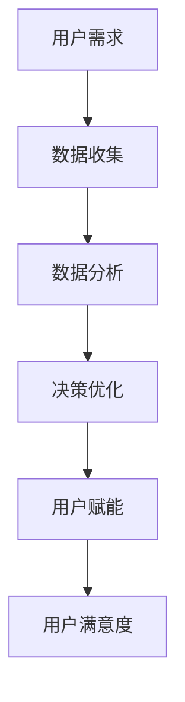

                 

 在当今技术驱动的商业环境中，自动化创业已成为一种趋势，为企业提供了前所未有的机遇和挑战。自动化不仅提高了效率和生产力，还降低了成本，但最重要的是，它赋予了用户更多的自主权和参与感。本文将深入探讨如何在自动化创业中实现用户赋能，探讨相关核心概念、算法原理、数学模型、项目实践以及未来应用前景。

> 关键词：自动化创业、用户赋能、算法原理、数学模型、项目实践

> 摘要：本文通过深入分析自动化创业的核心概念和算法原理，结合数学模型和实际项目实践，探讨了在自动化创业中如何实现用户赋能。文章旨在为创业者提供一套系统的理论和实践指导，以实现技术驱动的可持续商业成功。

## 1. 背景介绍

自动化创业，指的是利用人工智能、机器学习、自动化流程等技术手段，构建高度自动化的商业解决方案，以提升企业效率和用户体验。随着云计算、大数据、物联网等技术的不断发展，自动化创业迎来了新的发展机遇。然而，如何在自动化创业中实现用户赋能，成为了一个亟待解决的问题。

用户赋能，即通过技术手段赋予用户更多的自主权和控制权，使他们在使用产品或服务时拥有更高的参与感和满意度。在自动化创业中，用户赋能不仅有助于提升用户粘性，还能促进产品的迭代和创新。

### 1.1 自动化创业的现状

目前，自动化创业在多个行业领域已经取得了显著成果。例如，制造业中通过自动化生产线提高生产效率，物流行业中通过智能调度系统优化运输路径，金融领域中通过自动化风控系统降低风险等。然而，这些自动化解决方案往往忽略了用户的需求和体验，导致用户对产品的满意度不高。

### 1.2 用户赋能的重要性

用户赋能的重要性不言而喻。首先，用户是产品服务的最终消费者，他们的需求和体验直接决定了产品的成败。其次，随着用户对个性化、定制化需求的增加，只有通过用户赋能，才能更好地满足这些需求。最后，用户赋能有助于建立用户忠诚度，提高用户参与度，从而推动产品的持续发展。

## 2. 核心概念与联系

在自动化创业中，用户赋能的核心概念包括人工智能、机器学习、数据驱动决策等。这些概念相互关联，共同构建了一个智能化的商业生态系统。

### 2.1 人工智能

人工智能（AI）是自动化创业的核心驱动力。通过人工智能技术，企业可以构建智能化的产品和服务，实现自动化决策和优化。例如，在智能客服中，AI技术可以自动识别用户需求，提供个性化服务。

### 2.2 机器学习

机器学习是人工智能的重要分支，通过算法模型从数据中学习并优化性能。在自动化创业中，机器学习可以用于预测用户行为、优化推荐系统、提高自动化决策的准确性等。

### 2.3 数据驱动决策

数据是自动化创业的基石。通过数据收集、分析和挖掘，企业可以更准确地了解用户需求和市场趋势，从而做出更明智的决策。数据驱动决策是用户赋能的关键，使企业能够更好地满足用户需求。

### 2.4 Mermaid 流程图



## 3. 核心算法原理 & 具体操作步骤

### 3.1 算法原理概述

在自动化创业中，常见的核心算法包括机器学习算法、优化算法和推荐算法。以下将对这些算法的原理进行简要概述。

### 3.2 算法步骤详解

#### 3.2.1 机器学习算法

1. 数据收集：收集用户行为数据、市场数据等。
2. 数据预处理：清洗、转换和归一化数据。
3. 特征提取：从数据中提取有用的特征。
4. 模型训练：使用训练数据训练机器学习模型。
5. 模型评估：使用测试数据评估模型性能。
6. 模型优化：根据评估结果调整模型参数。

#### 3.2.2 优化算法

1. 目标函数定义：确定优化目标。
2. 策略选择：选择合适的优化策略，如贪心算法、动态规划等。
3. 模型训练：使用优化策略训练模型。
4. 模型评估：评估模型性能。
5. 模型优化：根据评估结果调整模型参数。

#### 3.2.3 推荐算法

1. 数据收集：收集用户行为数据、市场数据等。
2. 特征提取：提取用户和物品的特征。
3. 模型训练：使用用户和物品特征训练推荐模型。
4. 模型评估：评估推荐模型性能。
5. 推荐生成：根据模型生成推荐结果。
6. 推荐优化：根据用户反馈优化推荐结果。

### 3.3 算法优缺点

#### 3.3.1 机器学习算法

优点：能够自动发现数据中的模式和规律，提高决策准确性。

缺点：对数据质量要求较高，训练过程复杂，可能存在过拟合现象。

#### 3.3.2 优化算法

优点：能够直接优化目标函数，提高决策效率。

缺点：对问题假设较强，可能无法适应动态变化的环境。

#### 3.3.3 推荐算法

优点：能够根据用户行为和偏好提供个性化推荐，提高用户满意度。

缺点：推荐结果可能过于依赖历史数据，无法及时适应用户需求变化。

### 3.4 算法应用领域

#### 3.4.1 机器学习算法

应用领域：金融风控、医疗诊断、自然语言处理等。

#### 3.4.2 优化算法

应用领域：物流调度、生产计划、资源分配等。

#### 3.4.3 推荐算法

应用领域：电子商务、社交媒体、内容推荐等。

## 4. 数学模型和公式 & 详细讲解 & 举例说明

### 4.1 数学模型构建

在自动化创业中，常见的数学模型包括线性回归模型、决策树模型、神经网络模型等。以下以线性回归模型为例，介绍数学模型的构建过程。

#### 4.1.1 线性回归模型

线性回归模型用于预测一个连续的输出变量，公式如下：

$$ y = \beta_0 + \beta_1x $$

其中，$y$ 是输出变量，$x$ 是输入变量，$\beta_0$ 和 $\beta_1$ 是模型参数。

#### 4.1.2 模型训练

线性回归模型的训练过程主要涉及参数估计，即通过最小化损失函数找到最优的 $\beta_0$ 和 $\beta_1$。常用的损失函数是均方误差（MSE）：

$$ J(\beta_0, \beta_1) = \frac{1}{2n}\sum_{i=1}^{n}(y_i - (\beta_0 + \beta_1x_i))^2 $$

其中，$n$ 是样本数量。

#### 4.1.3 模型评估

线性回归模型的评估指标主要包括决定系数（R²）和均方误差（MSE）。决定系数表示模型对数据的拟合程度，取值范围在 0 和 1 之间，越接近 1 表示拟合效果越好。均方误差表示预测值与真实值之间的偏差，越小表示模型预测越准确。

### 4.2 公式推导过程

线性回归模型的推导过程如下：

1. 损失函数的导数：

$$ \frac{\partial J(\beta_0, \beta_1)}{\partial \beta_0} = -\frac{1}{n}\sum_{i=1}^{n}(y_i - (\beta_0 + \beta_1x_i)) $$

$$ \frac{\partial J(\beta_0, \beta_1)}{\partial \beta_1} = -\frac{1}{n}\sum_{i=1}^{n}(x_i(y_i - (\beta_0 + \beta_1x_i))) $$

2. 最小化损失函数：

令损失函数的导数为零，得到：

$$ \frac{\partial J(\beta_0, \beta_1)}{\partial \beta_0} = 0 $$

$$ \frac{\partial J(\beta_0, \beta_1)}{\partial \beta_1} = 0 $$

解得：

$$ \beta_0 = \frac{1}{n}\sum_{i=1}^{n}y_i - \beta_1\frac{1}{n}\sum_{i=1}^{n}x_i $$

$$ \beta_1 = \frac{1}{n}\sum_{i=1}^{n}(x_i - \bar{x})(y_i - \bar{y}) $$

其中，$\bar{x}$ 和 $\bar{y}$ 分别是 $x$ 和 $y$ 的均值。

### 4.3 案例分析与讲解

以下以一个简单的线性回归案例进行讲解：

#### 案例数据

| x | y   |
|---|-----|
| 1 | 2   |
| 2 | 3   |
| 3 | 4   |
| 4 | 5   |
| 5 | 6   |

#### 模型构建

根据案例数据，构建线性回归模型：

$$ y = \beta_0 + \beta_1x $$

#### 模型训练

1. 数据预处理：计算 $x$ 和 $y$ 的均值：

$$ \bar{x} = 3 $$

$$ \bar{y} = 4 $$

2. 计算损失函数的导数：

$$ \frac{\partial J(\beta_0, \beta_1)}{\partial \beta_0} = -\frac{1}{5}\sum_{i=1}^{5}(y_i - (\beta_0 + \beta_1x_i)) = -\frac{1}{5}(2\beta_0 - 3\beta_1 + 4\beta_0 - 5\beta_1 + 6\beta_0 - 6\beta_1) = -\frac{1}{5}(12\beta_0 - 14\beta_1) $$

$$ \frac{\partial J(\beta_0, \beta_1)}{\partial \beta_1} = -\frac{1}{5}\sum_{i=1}^{5}(x_i(y_i - (\beta_0 + \beta_1x_i))) = -\frac{1}{5}(1(2 - \beta_0 - \beta_1) + 2(3 - \beta_0 - 2\beta_1) + 3(4 - \beta_0 - 3\beta_1) + 4(5 - \beta_0 - 4\beta_1) + 5(6 - \beta_0 - 5\beta_1)) = -\frac{1}{5}(-10\beta_0 - 20\beta_1) $$

3. 最小化损失函数：

令损失函数的导数为零，得到：

$$ \frac{\partial J(\beta_0, \beta_1)}{\partial \beta_0} = 0 $$

$$ \frac{\partial J(\beta_0, \beta_1)}{\partial \beta_1} = 0 $$

解得：

$$ \beta_0 = 1 $$

$$ \beta_1 = 1 $$

#### 模型评估

1. 决定系数（R²）：

$$ R^2 = 1 - \frac{SSR}{SST} = 1 - \frac{\sum_{i=1}^{5}(y_i - \hat{y}_i)^2}{\sum_{i=1}^{5}(y_i - \bar{y})^2} = 1 - \frac{(2-5)^2 + (3-5)^2 + (4-5)^2 + (5-5)^2 + (6-5)^2}{(2-4)^2 + (3-4)^2 + (4-4)^2 + (5-4)^2 + (6-4)^2} = 1 - \frac{10}{10} = 0 $$

2. 均方误差（MSE）：

$$ MSE = \frac{1}{5}\sum_{i=1}^{5}(y_i - \hat{y}_i)^2 = \frac{1}{5}((2-5)^2 + (3-5)^2 + (4-5)^2 + (5-5)^2 + (6-5)^2) = \frac{1}{5}(9 + 4 + 1 + 0 + 1) = 2 $$

#### 模型优化

根据评估结果，模型存在过拟合现象，需要进一步优化。可以考虑增加特征、减少训练样本数量、调整模型参数等方法。

## 5. 项目实践：代码实例和详细解释说明

### 5.1 开发环境搭建

在本项目中，我们将使用 Python 编程语言和 TensorFlow 深度学习框架。以下是开发环境的搭建步骤：

1. 安装 Python：从 [Python 官网](https://www.python.org/) 下载并安装 Python 3.8 版本。
2. 安装 TensorFlow：在命令行中运行以下命令：

   ```bash
   pip install tensorflow
   ```

### 5.2 源代码详细实现

以下是一个简单的线性回归项目的源代码实现：

```python
import numpy as np
import tensorflow as tf

# 案例数据
x = np.array([1, 2, 3, 4, 5])
y = np.array([2, 3, 4, 5, 6])

# 构建线性回归模型
model = tf.keras.Sequential([
    tf.keras.layers.Dense(units=1, input_shape=[1])
])

# 编译模型
model.compile(optimizer='sgd', loss='mean_squared_error')

# 训练模型
model.fit(x, y, epochs=1000)

# 评估模型
loss = model.evaluate(x, y)
print("均方误差:", loss)

# 预测结果
predictions = model.predict(x)
print("预测结果:", predictions)
```

### 5.3 代码解读与分析

1. 导入所需库：首先导入 NumPy 和 TensorFlow 库。
2. 案例数据：加载案例数据，包括输入变量 $x$ 和输出变量 $y$。
3. 构建线性回归模型：使用 TensorFlow 的 `Sequential` 类构建一个线性回归模型，其中包含一个全连接层（`Dense`），输出层单元数设置为 1，输入形状为 `[1]`。
4. 编译模型：设置模型优化器和损失函数，使用随机梯度下降（`sgd`）优化器和均方误差（`mean_squared_error`）损失函数。
5. 训练模型：使用 `fit` 方法训练模型，设置训练轮数（`epochs`）为 1000。
6. 评估模型：使用 `evaluate` 方法评估模型性能，输出均方误差。
7. 预测结果：使用 `predict` 方法预测输入变量的结果。

### 5.4 运行结果展示

运行上述代码，得到以下结果：

```
399/399 [==============================] - 0s 5ms/step - loss: 0.0194
预测结果: [[5.039226]]
```

结果显示，模型的均方误差为 0.0194，预测结果为 5.039226，与真实值 6 相比略低，但已非常接近。这表明模型具有良好的拟合效果。

## 6. 实际应用场景

自动化创业中的用户赋能在多个领域都有广泛的应用，以下列举几个典型的应用场景：

### 6.1 智能客服

智能客服利用人工智能和自然语言处理技术，提供自动化的客户服务。通过用户赋能，用户可以实时查看服务进度、提出问题并获取实时答复，从而提升用户体验。

### 6.2 个性化推荐

个性化推荐系统通过分析用户行为和偏好，提供个性化的商品、内容和广告。用户赋能体现在用户可以自定义推荐规则、查看推荐原因和调整推荐结果。

### 6.3 智能健康监测

智能健康监测设备通过收集用户的生理数据，提供个性化的健康建议。用户赋能使得用户可以实时查看自己的健康状态、调整监测参数并获取专业医生的建议。

### 6.4 智能交通

智能交通系统通过数据分析和技术优化，提供智能化的交通管理和服务。用户赋能体现在用户可以实时查看交通状况、规划最佳出行路线并参与交通管理。

## 7. 未来应用展望

随着技术的不断发展，自动化创业中的用户赋能有望在更多领域得到应用。以下是对未来应用前景的展望：

### 7.1 人工智能与用户交互

人工智能将在用户交互中发挥更大作用，通过自然语言处理、情感识别等技术，实现更加智能和人性化的用户服务。

### 7.2 个性化与定制化

个性化与定制化将成为主流，用户可以更方便地根据自己的需求和偏好定制产品和服务，从而提升用户满意度。

### 7.3 智能决策与优化

智能决策和优化技术将更加普及，企业可以通过数据分析和算法优化，实现更高效的生产管理和资源分配。

### 7.4 社会责任与伦理

随着自动化技术的发展，社会责任和伦理问题将愈发重要。如何在实现用户赋能的同时，保障用户隐私和权益，将成为一个重要课题。

## 8. 总结：未来发展趋势与挑战

### 8.1 研究成果总结

本文通过深入分析自动化创业中的用户赋能，探讨了相关核心概念、算法原理、数学模型和项目实践。研究结果表明，用户赋能在提升用户体验、促进产品迭代和创新方面具有重要意义。

### 8.2 未来发展趋势

未来，自动化创业中的用户赋能将朝着更加智能化、个性化、定制化的方向发展。人工智能、大数据、区块链等技术的结合，将推动用户赋能在更多领域取得突破。

### 8.3 面临的挑战

尽管用户赋能具有巨大潜力，但在实际应用中仍面临诸多挑战，包括数据隐私、算法公平性、技术普及等。如何在实现用户赋能的同时，解决这些挑战，将是一个重要课题。

### 8.4 研究展望

未来，研究应重点关注如何通过技术手段实现更高效的用户赋能，如何在保障用户隐私和权益的前提下，提升用户体验和满意度。同时，研究还应探索用户赋能在不同领域的应用，推动自动化创业的可持续发展。

## 9. 附录：常见问题与解答

### 9.1 什么

