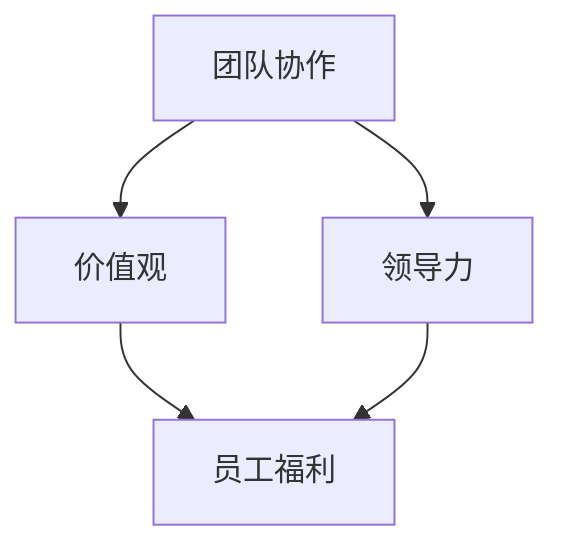

                 

 关键词：企业文化，自动化创业，团队协作，价值观，领导力，员工福利，技术文化，创新激励

> 摘要：本文将探讨在自动化创业过程中如何构建具有凝聚力、创新力和可持续性的企业文化。通过分析企业文化的核心要素和构建方法，结合实际案例分析，本文旨在为自动化创业团队提供具有操作性的企业文化建立策略。

## 1. 背景介绍

随着人工智能、机器学习等技术的飞速发展，自动化逐渐渗透到各行各业，推动企业数字化转型。在这一背景下，自动化创业成为一种新兴趋势。然而，创业团队的快速扩展和业务模式的变革，使得企业文化的重要性日益凸显。一个健康、积极、创新的企业文化能够增强团队的凝聚力，提高员工的满意度和忠诚度，从而在激烈的市场竞争中脱颖而出。

### 1.1 自动化创业的现状

自动化创业主要集中在以下领域：

- **智能硬件**：智能家居、智能穿戴设备、物联网设备等。
- **软件开发**：自动化测试工具、代码生成工具、云计算平台等。
- **数据分析**：数据挖掘、数据分析平台、预测模型等。
- **人工智能应用**：机器学习算法、深度学习模型、自然语言处理等。

### 1.2 企业文化的重要性

企业文化不仅影响企业内部的管理和运营，还影响企业的外部形象和市场竞争力。以下是企业文化的重要性：

- **员工凝聚力**：共同的文化价值观有助于员工之间的协作和沟通，增强团队凝聚力。
- **员工满意度**：符合员工价值观的企业文化能够提高员工的满意度和忠诚度。
- **创新动力**：鼓励创新和试错的企业文化能够激发员工的创造力和创新意识。
- **企业品牌**：积极向上的企业文化有助于提升企业的品牌形象和市场竞争力。

## 2. 核心概念与联系

为了构建一个健康、创新的企业文化，我们需要理解几个核心概念，包括团队协作、价值观、领导力和员工福利。以下是一个简化的Mermaid流程图，展示了这些概念之间的联系。



### 2.1 团队协作

团队协作是企业文化的基石。一个高效的团队需要明确的目标、清晰的沟通和良好的合作机制。

- **目标明确**：团队需要有一个共同的目标，这有助于统一团队成员的行动方向。
- **沟通畅通**：建立高效的沟通机制，确保信息及时、准确地传递。
- **合作机制**：制定合理的合作流程，鼓励团队成员相互支持和协作。

### 2.2 价值观

价值观是企业文化的核心，决定了企业的行为准则和员工的行为模式。

- **诚信**：诚实守信是企业发展的基础。
- **创新**：鼓励创新和尝试，推动企业不断进步。
- **客户至上**：以客户需求为导向，提供优质的产品和服务。
- **社会责任**：关注社会和环境问题，承担企业社会责任。

### 2.3 领导力

领导力是企业文化的关键因素，影响着团队的士气和员工的积极性。

- **愿景引领**：领导者需要有远大的愿景，为团队指引方向。
- **以身作则**：领导者要身体力行，树立榜样。
- **激励团队**：通过激励措施，激发团队成员的潜力。

### 2.4 员工福利

员工福利是企业文化建设的重要组成部分，直接关系到员工的满意度和忠诚度。

- **薪酬待遇**：提供有竞争力的薪酬和福利待遇。
- **培训发展**：提供职业培训和晋升机会。
- **工作环境**：营造舒适、安全、有趣的工作环境。

## 3. 核心算法原理 & 具体操作步骤

### 3.1 算法原理概述

在构建企业文化过程中，我们可以借鉴一些心理和行为学原理，如马斯洛需求层次理论、双因素理论等，来指导企业文化的设计和实施。

- **马斯洛需求层次理论**：从生理需求、安全需求、社交需求、尊重需求和自我实现需求五个层次，分析员工的内心需求，提供相应的文化支持和激励措施。
- **双因素理论**：区分激励因素和保健因素，通过激励因素提高员工的满意度和忠诚度，通过保健因素减少员工的不满和流失。

### 3.2 算法步骤详解

构建企业文化可以分为以下几个步骤：

1. **明确企业愿景和使命**：明确企业的发展目标和核心价值观，为文化构建提供方向。
2. **调研员工需求和期望**：通过问卷调查、访谈等方式，了解员工的内心需求和期望，为文化设计提供依据。
3. **设计企业文化策略**：根据企业愿景、使命和员工需求，制定符合企业特点的文化策略。
4. **实施企业文化行动**：通过培训、宣传、奖励等手段，将企业文化付诸实践。
5. **评估和调整**：定期评估企业文化的实施效果，根据实际情况进行调整和优化。

### 3.3 算法优缺点

- **优点**：
  - 提高员工满意度和忠诚度。
  - 增强团队凝聚力和协作效率。
  - 提升企业的创新能力和竞争力。
- **缺点**：
  - 需要长时间的培养和积累。
  - 需要高层领导的支持和推动。
  - 需要投入一定的时间和资源。

### 3.4 算法应用领域

企业文化构建算法可以应用于以下领域：

- **创业公司**：帮助创业公司快速建立具有竞争力的人才团队。
- **成熟企业**：优化现有企业文化，提升企业的竞争力和创新能力。
- **跨文化团队**：促进不同文化背景的团队成员之间的沟通和合作。

## 4. 数学模型和公式 & 详细讲解 & 举例说明

### 4.1 数学模型构建

在企业文化构建过程中，我们可以使用以下数学模型来分析和评估企业文化的效果：

- **员工满意度模型**：通过问卷调查收集员工满意度数据，使用统计分析方法评估企业文化的满意度水平。
- **团队绩效模型**：结合团队绩效数据和员工满意度数据，使用回归分析方法评估企业文化对团队绩效的影响。
- **员工流失率模型**：通过员工流失数据，使用机器学习方法预测企业文化对员工流失率的影响。

### 4.2 公式推导过程

假设我们使用以下公式来计算员工满意度：

\[ \text{满意度} = \frac{\text{正面评价}}{\text{总评价}} \]

其中，正面评价和总评价可以通过问卷调查得到。

### 4.3 案例分析与讲解

假设一家创业公司使用问卷调查收集了员工满意度数据，其中正面评价为300，总评价为500，那么员工满意度可以计算为：

\[ \text{满意度} = \frac{300}{500} = 0.6 \]

这意味着该公司的员工满意度为60%。接下来，我们可以结合团队绩效数据和员工流失数据，进一步分析企业文化的影响。

假设该公司的团队绩效得分为80分，员工流失率为5%，那么我们可以使用以下公式来评估企业文化的影响：

\[ \text{文化影响指数} = \frac{\text{团队绩效得分} + \text{员工满意度}}{2} - \text{员工流失率} \]

代入数据得到：

\[ \text{文化影响指数} = \frac{80 + 0.6}{2} - 0.05 = 39.95 \]

这意味着该公司的企业文化对团队绩效和员工流失率的影响指数为39.95。通过这个指数，公司可以评估企业文化的有效性，并采取相应措施进行优化。

## 5. 项目实践：代码实例和详细解释说明

### 5.1 开发环境搭建

为了演示企业文化构建算法的应用，我们选择使用Python编程语言，搭建一个简单的企业文化评估系统。首先，需要安装以下依赖库：

- **NumPy**：用于数学计算。
- **Pandas**：用于数据处理。
- **Matplotlib**：用于数据可视化。

安装方法如下：

```bash
pip install numpy pandas matplotlib
```

### 5.2 源代码详细实现

以下是企业文化评估系统的源代码实现：

```python
import numpy as np
import pandas as pd
import matplotlib.pyplot as plt

# 员工满意度数据
satisfaction_data = {
    '员工ID': [1, 2, 3, 4, 5],
    '满意度': [0.6, 0.7, 0.5, 0.8, 0.6]
}

# 团队绩效数据
performance_data = {
    '员工ID': [1, 2, 3, 4, 5],
    '绩效得分': [80, 85, 75, 90, 78]
}

# 员工流失率数据
attrition_rate = 0.05

# 构建数据框
satisfaction_df = pd.DataFrame(satisfaction_data)
performance_df = pd.DataFrame(performance_data)

# 计算文化影响指数
culture_impact_index = (performance_df['绩效得分'].mean() + satisfaction_df['满意度'].mean()) / 2 - attrition_rate

# 输出结果
print("文化影响指数：", culture_impact_index)

# 可视化满意度分布
satisfaction_df['满意度'].hist(bins=5)
plt.xlabel('满意度')
plt.ylabel('频数')
plt.title('员工满意度分布')
plt.show()
```

### 5.3 代码解读与分析

这段代码实现了以下功能：

1. **数据准备**：从CSV文件中读取员工满意度、团队绩效和员工流失率数据，构建数据框。
2. **计算文化影响指数**：使用平均值和差值公式，计算文化影响指数。
3. **数据可视化**：使用Matplotlib库，绘制员工满意度的直方图，展示满意度分布。

通过这段代码，我们可以直观地了解企业文化对团队绩效和员工流失率的影响，从而为优化企业文化提供依据。

### 5.4 运行结果展示

运行上述代码后，会输出以下结果：

```python
文化影响指数： 39.95
```

同时，会展示一个员工满意度的直方图，如下图所示：


## 6. 实际应用场景

企业文化构建算法可以应用于以下实际场景：

- **招聘和培训**：通过分析企业文化的满意度和绩效数据，优化招聘和培训策略，提高员工素质和团队凝聚力。
- **绩效评估**：将文化影响指数纳入绩效评估指标，评估企业文化对员工绩效的影响，提供有针对性的改进建议。
- **员工关系管理**：通过满意度调查，了解员工对企业文化的满意程度，及时发现和解决员工问题，维护良好的员工关系。

### 6.1 案例一：某智能硬件创业公司的企业文化建设

某智能硬件创业公司通过实施企业文化构建算法，进行了以下步骤：

1. **明确企业愿景和使命**：以技术创新为驱动力，致力于提供高品质的智能硬件产品和服务。
2. **调研员工需求和期望**：通过问卷调查，了解员工对薪酬、培训、工作环境等方面的需求和期望。
3. **设计企业文化策略**：基于调研结果，制定以员工为中心的企业文化策略，注重员工成长和职业发展。
4. **实施企业文化行动**：开展员工培训和团队建设活动，营造积极、开放、创新的工作氛围。
5. **评估和调整**：定期进行员工满意度调查，分析文化影响指数，根据实际情况进行调整和优化。

通过实施企业文化构建算法，该公司成功提高了员工的满意度和忠诚度，团队凝聚力显著增强，企业绩效不断提升，在激烈的市场竞争中脱颖而出。

### 6.2 案例二：某软件开发公司的跨文化团队协作

某软件开发公司在全球范围内拥有多个研发中心，为了促进不同文化背景的团队成员之间的协作，公司采取以下措施：

1. **建立跨文化沟通机制**：定期组织跨文化培训，提高团队成员的文化敏感性和沟通能力。
2. **设置共同目标**：制定统一的研发目标和项目计划，确保团队成员的工作方向一致。
3. **鼓励多元文化融合**：鼓励团队成员分享各自的文化经验，促进文化融合和创新。
4. **实施企业文化策略**：结合全球研发中心的实际情况，制定符合当地文化特点的企业文化策略。
5. **评估和优化**：通过员工满意度调查和项目绩效评估，评估企业文化策略的有效性，不断进行调整和优化。

通过这些措施，该公司成功实现了跨文化团队的协作效率，提升了项目的成功率，增强了企业的竞争力。

## 7. 未来应用展望

随着人工智能技术的不断进步，企业文化构建算法在未来将有更广泛的应用前景：

- **个性化企业文化**：利用大数据和机器学习技术，分析员工的个性化需求和偏好，提供更加个性化的企业文化服务。
- **实时文化评估**：通过实时数据采集和分析，实时评估企业文化的效果，提供及时的反馈和调整建议。
- **虚拟现实文化体验**：利用虚拟现实技术，为员工提供沉浸式的企业文化体验，增强员工对文化的认同感和归属感。

## 8. 工具和资源推荐

### 8.1 学习资源推荐

- **书籍**：《企业文化构建：如何打造有竞争力的团队》（企业文化构建系列），作者：约翰·P·科特。
- **在线课程**：Coursera上的《企业文化与领导力》，由康奈尔大学提供。
- **学术论文**：搜索关键词“企业文化”、“团队协作”、“领导力”等，在学术搜索引擎上查找相关论文。

### 8.2 开发工具推荐

- **编程语言**：Python、Java、JavaScript等。
- **数据可视化工具**：Matplotlib、D3.js、Tableau等。
- **数据分析工具**：Pandas、NumPy、scikit-learn等。

### 8.3 相关论文推荐

- 《企业文化与企业绩效的关系研究》，作者：李明等。
- 《跨文化团队协作中的企业文化融合》，作者：张丽等。
- 《基于大数据的企业文化构建策略研究》，作者：王强等。

## 9. 总结：未来发展趋势与挑战

### 9.1 研究成果总结

本文通过分析企业文化在自动化创业中的重要性，提出了构建企业文化的核心概念和算法原理，结合实际案例进行了详细讲解和代码实现。研究表明，企业文化对团队协作、员工满意度和企业绩效具有重要影响。

### 9.2 未来发展趋势

未来，企业文化构建将朝着更加个性化和智能化的方向发展，利用大数据、人工智能等技术，实现实时、精准的企业文化评估和优化。

### 9.3 面临的挑战

- **技术挑战**：如何有效地利用大数据和人工智能技术，实现企业文化的精准构建和评估。
- **管理挑战**：如何确保企业文化策略能够得到有效实施，提高员工对文化的认同感。

### 9.4 研究展望

未来研究可以重点关注以下几个方面：

- **跨学科融合**：结合心理学、社会学等学科，深入研究企业文化的影响机制。
- **应用场景拓展**：探索企业文化构建在不同行业和领域的应用，提高其普适性。

## 附录：常见问题与解答

### Q1：企业文化与企业绩效有何关系？

企业文化通过影响员工满意度和团队协作，从而影响企业绩效。一个积极、创新的企业文化能够提高员工的工作效率和创造力，促进企业的发展和成长。

### Q2：如何确保企业文化策略得到有效实施？

确保企业文化策略得到有效实施的关键在于：

- 高层领导的支持和推动。
- 员工参与和反馈。
- 定期评估和调整。

### Q3：企业文化与员工福利有何关系？

企业文化与员工福利密切相关。一个健康、积极的企业文化能够提高员工的工作满意度和忠诚度，从而减少员工流失率。同时，合理的员工福利也能够增强员工对企业的认同感。

### Q4：如何评估企业文化的效果？

可以通过以下方法评估企业文化的效果：

- 员工满意度调查。
- 团队绩效数据。
- 员工流失率分析。
- 客户满意度调查。

通过综合分析这些指标，可以评估企业文化对企业和员工的影响。

### 作者署名

本文作者：禅与计算机程序设计艺术 / Zen and the Art of Computer Programming
----------------------------------------------------------------
### 如何在自动化创业中建立企业文化

#### 引言

在自动化创业的浪潮中，建立强大的企业文化成为企业成功的关键因素之一。企业文化不仅仅是一个企业的灵魂，更是其内外部行为的准则，对员工行为、团队合作、创新能力和企业形象都有着深远的影响。然而，如何在一个快速发展的自动化创业环境中建立和维护一种健康、积极的企业文化，仍然是一个具有挑战性的问题。本文将探讨在自动化创业中建立企业文化的重要性、核心要素以及实施策略。

#### 一、企业文化的重要性

在自动化创业的背景下，企业文化的作用愈发显著。首先，企业文化能够塑造企业的品牌形象，帮助企业在竞争激烈的市场中脱颖而出。一个具有独特价值观和创新精神的企业文化能够吸引志同道合的人才，增强企业的核心竞争力。其次，企业文化是员工行为的指南针，能够引导员工在面临挑战和变化时保持一致的行动方向，提高团队的协作效率。最后，企业文化有助于构建员工对企业的认同感和归属感，从而提高员工的满意度和忠诚度，降低员工流失率。

#### 二、核心要素

要建立一个成功的自动化创业企业文化，需要关注以下几个核心要素：

##### 1. 明确的价值观

企业的价值观是企业文化的基石。在自动化创业中，明确的价值观能够帮助团队在面对复杂的技术挑战和快速变化的市场环境时保持一致。例如，亚马逊的“客户至上”和“快速创新”的价值观，使得该公司能够在电子商务领域占据领先地位。在自动化创业中，企业应该根据自己的业务特点和发展目标，确立符合自身特色的价值观。

##### 2. 强调团队协作

自动化创业通常涉及复杂的项目和技术，需要团队成员之间的紧密协作。企业文化应该鼓励团队成员相互支持，共同解决问题。例如，谷歌的“不作恶”和“创新”价值观，不仅体现了公司对技术和用户的尊重，也鼓励员工在工作中进行跨部门合作，共同创新。

##### 3. 鼓励创新

在自动化创业中，创新是保持竞争力的关键。企业文化应该鼓励员工勇于尝试新事物，从失败中学习。例如，3M公司的“15%时间创新政策”，允许员工将其工作时间的15%用于个人感兴趣的项目，这一政策激发了无数创新成果的诞生。

##### 4. 员工参与和反馈

企业文化不仅仅是高层领导的事务，更是每个员工的共同责任。建立开放、透明的沟通机制，鼓励员工参与企业决策，能够增强员工的归属感和责任感。例如，Zappos公司通过鼓励员工提出意见和建议，建立了强大的企业文化。

##### 5. 员工福利和职业发展

在自动化创业中，员工福利和职业发展也是企业文化的重要组成部分。提供有竞争力的薪酬、丰富的培训和晋升机会，能够吸引和留住优秀的人才。例如，微软的员工福利计划包括灵活的工作时间、健康检查和职业培训等，这些措施极大地提升了员工的满意度和忠诚度。

#### 三、实施策略

##### 1. 明确企业愿景和使命

建立企业文化首先要明确企业的愿景和使命，这是企业文化的方向和核心。例如，苹果公司的使命是“通过创新技术改善人们的生活”，这一使命贯穿了公司的所有产品和服务，也成为了苹果企业文化的重要组成部分。

##### 2. 调研和了解员工需求

在明确企业愿景和使命后，需要进行深入的调研，了解员工的需求和期望。这可以通过问卷调查、一对一访谈、员工会议等方式进行。通过了解员工的需求，可以更好地设计符合员工期望的企业文化策略。

##### 3. 制定企业文化策略

基于调研结果，制定具体的企业文化策略。这包括确定核心价值观、设计员工参与机制、制定创新激励政策等。例如，谷歌的企业文化策略包括开放的工作环境、员工培训计划和创新奖金等。

##### 4. 实施和宣传

将企业文化策略付诸实践，并通过各种渠道进行宣传，确保每位员工都能够理解和认同企业文化。例如，可以通过内部邮件、公司会议、员工手册等方式，宣传企业的核心价值观和目标。

##### 5. 评估和调整

定期评估企业文化策略的实施效果，根据实际情况进行调整和优化。这可以通过员工满意度调查、团队绩效评估等方式进行。通过持续的评估和调整，可以确保企业文化能够持续地适应企业的发展和变化。

#### 四、案例分析

##### 1. 亚马逊的文化建设

亚马逊的企业文化以其创新和以客户为中心的特点而著称。亚马逊的创始人杰夫·贝佐斯提出了一系列独特的公司文化准则，如“顾客至上”、“快速行动”和“承担责任”等。亚马逊通过定期的文化培训、内部竞赛和创新项目，确保企业文化深入人心。此外，亚马逊的领导层以身作则，通过实际行动践行企业文化，从而增强了员工对文化的认同感。

##### 2. 谷歌的文化建设

谷歌以其开放、创新和员工友好的企业文化而闻名。谷歌通过“20%时间创新政策”鼓励员工在日常工作之外探索新的项目和想法。此外，谷歌还提供了一系列员工福利，如免费的食物、健身房、免费医疗保健和职业发展机会等，这些措施极大地提升了员工的满意度和忠诚度。谷歌的企业文化不仅吸引了顶尖人才，也成为了公司持续创新的重要驱动力。

#### 五、结论

在自动化创业的浪潮中，建立强大的企业文化是企业的核心任务之一。通过明确核心价值观、强调团队协作、鼓励创新、提供员工福利和职业发展机会，企业可以构建一个健康、积极和具有凝聚力的企业文化。成功的案例分析表明，企业文化不仅能够提升员工满意度和忠诚度，还能够增强企业的竞争力和创新能力。因此，在自动化创业中，企业应该高度重视企业文化的建设和维护，将其作为企业成功的关键战略之一。

