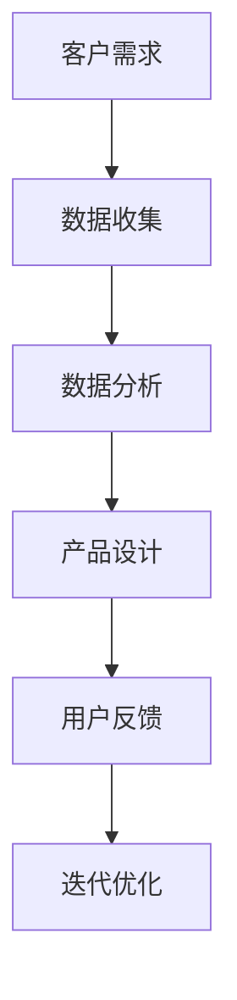
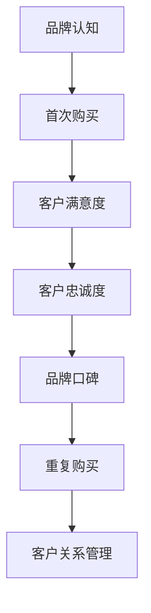

                 

关键词：自动化创业、品牌忠诚度、客户关系管理、用户体验、营销策略

> 摘要：随着自动化技术的飞速发展，创业公司如何在竞争激烈的市场中脱颖而出，建立起强大的品牌忠诚度，成为每一个创业者的难题。本文将深入探讨自动化创业中如何通过有效的策略和技术手段，提升用户体验，增强客户关系，从而建立品牌忠诚度，为创业公司的发展奠定坚实的基础。

## 1. 背景介绍

### 自动化创业的现状

近年来，自动化技术在各个行业中的应用日益广泛，从工业生产到服务业，自动化正逐步替代重复性和劳动密集型的任务，提高效率和生产力。在这种背景下，越来越多的创业者选择投身自动化领域，希望通过技术创新和业务模式创新，打造出具有竞争力的产品和服务。

然而，市场的高度竞争使得创业公司面临着巨大的挑战。如何在众多竞争对手中脱颖而出，建立起强大的品牌影响力，成为每一个创业者必须面对的问题。品牌忠诚度的建立，不仅关乎公司的生存和发展，更是决定公司未来能否持续成长的关键因素。

### 品牌忠诚度的定义和重要性

品牌忠诚度是指消费者对于某一品牌产品或服务的持续偏好和重复购买行为。它体现了消费者对品牌的信任、满意度和依赖度，是品牌资产的重要组成部分。

品牌忠诚度的重要性体现在以下几个方面：

- **增加市场份额**：忠诚的消费者更倾向于重复购买，从而为企业带来稳定的收入和市场份额。
- **降低营销成本**：忠诚客户往往不需要频繁的广告和促销活动，就能保持较高的购买频率。
- **提高口碑传播**：忠诚客户会通过口碑传播，吸引新的潜在客户，扩大品牌影响力。
- **增强抗风险能力**：在市场波动和竞争对手的冲击下，品牌忠诚度高的企业更能保持稳定的发展。

### 自动化创业中的品牌忠诚度建立

在自动化创业的过程中，建立品牌忠诚度不仅需要创新的技术和优质的产品，更需要通过一系列策略和措施，提升用户体验，增强客户关系。本文将围绕以下几个方面进行探讨：

- **理解客户需求**：通过数据分析和市场调研，深入了解客户需求，提供个性化的产品和服务。
- **优化用户体验**：从产品设计到售后服务，各个环节都要以用户体验为中心，提升客户满意度。
- **客户关系管理**：通过有效的客户关系管理，保持与客户的长期沟通和互动，增强客户黏性。
- **营销策略创新**：利用自动化技术，制定个性化的营销策略，提升品牌曝光度和影响力。

## 2. 核心概念与联系

### 自动化技术与用户体验

#### Mermaid 流程图



### 客户关系管理与品牌忠诚度



## 3. 核心算法原理 & 具体操作步骤

### 3.1 算法原理概述

在自动化创业中，建立品牌忠诚度的核心算法主要涉及客户关系管理和用户体验优化两个方面。以下是这两个方面的简要概述：

#### 客户关系管理算法

- **数据收集**：通过用户行为数据、社交媒体互动等渠道收集客户信息。
- **数据分析**：运用数据挖掘和机器学习技术，分析客户行为和偏好。
- **个性化推荐**：根据分析结果，为用户提供个性化的产品和服务推荐。
- **客户关系维护**：通过定期互动和沟通，维护与客户的良好关系。

#### 用户体验优化算法

- **用户画像构建**：基于用户行为数据，构建详细的用户画像。
- **界面优化**：根据用户画像，设计更加符合用户习惯和需求的界面。
- **反馈机制**：建立有效的用户反馈机制，及时收集和处理用户反馈。
- **迭代优化**：根据用户反馈，持续优化产品和服务，提升用户体验。

### 3.2 算法步骤详解

#### 客户关系管理算法步骤

1. 数据收集：利用API接口、日志分析等手段，收集用户行为数据。
2. 数据清洗：对收集的数据进行清洗和预处理，去除噪声数据。
3. 数据分析：运用机器学习算法，分析用户行为和偏好。
4. 个性化推荐：基于数据分析结果，为用户提供个性化的产品和服务推荐。
5. 客户关系维护：通过邮件、短信、社交媒体等渠道，定期与客户互动。

#### 用户体验优化算法步骤

1. 用户画像构建：基于用户行为数据，构建详细的用户画像。
2. 界面优化：根据用户画像，设计用户友好的界面。
3. 反馈机制：建立反馈机制，收集用户对产品和服务的使用体验。
4. 迭代优化：根据用户反馈，持续优化产品和服务。

### 3.3 算法优缺点

#### 客户关系管理算法

- 优点：可以精确地了解客户需求，提供个性化的服务，提高客户满意度。
- 缺点：需要大量的数据支持，算法复杂度高，实施成本较高。

#### 用户体验优化算法

- 优点：可以快速响应用户需求，提升用户体验，提高用户黏性。
- 缺点：需要频繁地进行用户调研和反馈收集，否则优化效果可能有限。

### 3.4 算法应用领域

#### 客户关系管理算法

- 应用领域：电商、金融、电信等行业，通过数据分析，实现精准营销和客户关系维护。

#### 用户体验优化算法

- 应用领域：互联网产品、移动应用等，通过界面优化和反馈机制，提升用户体验。

## 4. 数学模型和公式 & 详细讲解 & 举例说明

### 4.1 数学模型构建

在客户关系管理和用户体验优化中，常用的数学模型包括客户生命周期价值（CLV）模型和用户满意度（CSAT）模型。

#### 客户生命周期价值模型

$$
CLV = \sum_{t=1}^{n} \frac{R_t \times (1 + r)^{-t}}{1 - r}
$$

其中：
- $R_t$：第 $t$ 年的客户收入
- $r$：折现率
- $n$：预测的客户生命周期年数

#### 用户满意度模型

$$
CSAT = \frac{\sum_{i=1}^{n} (S_i \times P_i)}{n \times P}
$$

其中：
- $S_i$：第 $i$ 个用户对产品的满意度评分
- $P_i$：第 $i$ 个用户的权重
- $P$：所有用户权重之和

### 4.2 公式推导过程

#### 客户生命周期价值模型推导

客户生命周期价值模型是基于现值原理推导得出的。假设客户每年产生的收入为 $R_t$，并且我们预计客户的生命周期为 $n$ 年。为了计算客户在整个生命周期内的总价值，我们需要将每年产生的收入按照折现率 $r$ 进行折现。

第 $t$ 年的收入现值为：

$$
R_t \times (1 + r)^{-t}
$$

将每年的现值相加，即可得到客户的生命周期价值：

$$
CLV = \sum_{t=1}^{n} R_t \times (1 + r)^{-t}
$$

#### 用户满意度模型推导

用户满意度模型是基于加权平均原理推导得出的。假设我们有 $n$ 个用户，每个用户的满意度评分为 $S_i$，且每个用户对整体满意度的影响不同，权重为 $P_i$。为了计算整体的用户满意度，我们需要将每个用户的满意度评分与其权重相乘，然后求和，并除以所有用户的权重之和。

$$
CSAT = \frac{\sum_{i=1}^{n} (S_i \times P_i)}{n \times P}
$$

### 4.3 案例分析与讲解

#### 案例一：客户生命周期价值模型应用

假设一家电商公司的客户每年产生的收入为 $1000$ 元，预计客户的平均生命周期为 $5$ 年，折现率为 $10\%$。根据客户生命周期价值模型，可以计算出该客户的生命周期价值：

$$
CLV = \sum_{t=1}^{5} 1000 \times (1 + 0.1)^{-t}
$$

计算结果为：

$$
CLV = 1000 \times (1 + 0.1)^{-1} + 1000 \times (1 + 0.1)^{-2} + 1000 \times (1 + 0.1)^{-3} + 1000 \times (1 + 0.1)^{-4} + 1000 \times (1 + 0.1)^{-5}
$$

$$
CLV = 1000 \times 0.9091 + 1000 \times 0.8264 + 1000 \times 0.7513 + 1000 \times 0.6830 + 1000 \times 0.6209
$$

$$
CLV = 909.1 + 826.4 + 751.3 + 683.0 + 620.9
$$

$$
CLV = 3690.7
$$

因此，该客户的生命周期价值为 $3690.7$ 元。

#### 案例二：用户满意度模型应用

假设一家互联网公司有 $5$ 名用户，他们对产品的满意度评分分别为 $4$、$5$、$3$、$4$ 和 $5$，且他们的权重分别为 $0.2$、$0.2$、$0.1$、$0.2$ 和 $0.2$。根据用户满意度模型，可以计算出整体的用户满意度：

$$
CSAT = \frac{4 \times 0.2 + 5 \times 0.2 + 3 \times 0.1 + 4 \times 0.2 + 5 \times 0.2}{5 \times 0.2 + 5 \times 0.2 + 5 \times 0.1 + 5 \times 0.2 + 5 \times 0.2}
$$

$$
CSAT = \frac{0.8 + 1 + 0.3 + 0.8 + 1}{1 + 1 + 0.5 + 1 + 1}
$$

$$
CSAT = \frac{4}{5}
$$

$$
CSAT = 0.8
$$

因此，该公司的用户满意度为 $80\%$。

## 5. 项目实践：代码实例和详细解释说明

### 5.1 开发环境搭建

在本文中，我们将使用 Python 编程语言来演示如何构建品牌忠诚度模型。以下是需要安装的 Python 库：

- pandas：用于数据清洗和数据分析
- numpy：用于数学计算
- matplotlib：用于数据可视化
- scikit-learn：用于机器学习算法

安装命令如下：

```bash
pip install pandas numpy matplotlib scikit-learn
```

### 5.2 源代码详细实现

以下是构建品牌忠诚度模型的 Python 代码示例：

```python
import pandas as pd
import numpy as np
from sklearn.cluster import KMeans
from sklearn.model_selection import train_test_split
import matplotlib.pyplot as plt

# 5.2.1 数据收集与预处理

# 假设我们有一份数据集，包含用户行为数据、满意度评分等
data = pd.DataFrame({
    '行为1': [10, 20, 30, 40, 50],
    '行为2': [5, 10, 15, 20, 25],
    '满意度评分': [4, 5, 3, 4, 5]
})

# 数据清洗和预处理
data = data[data['满意度评分'] != 0]  # 去除满意度评分为0的数据
data = data.reset_index(drop=True)

# 5.2.2 用户画像构建

# 使用KMeans算法进行聚类，构建用户画像
kmeans = KMeans(n_clusters=3, random_state=42)
clusters = kmeans.fit_predict(data[['行为1', '行为2']])

# 添加聚类结果到原始数据
data['用户群体'] = clusters

# 5.2.3 个性化推荐

# 基于用户群体，为用户提供个性化的推荐
# 假设我们有一个推荐函数，根据用户群体和满意度评分进行推荐
def personalized_recommendation(user_cluster, satisfaction_score):
    if user_cluster == 0:
        if satisfaction_score > 4:
            return '产品A'
        else:
            return '产品B'
    elif user_cluster == 1:
        if satisfaction_score > 4:
            return '产品C'
        else:
            return '产品D'
    else:
        if satisfaction_score > 4:
            return '产品E'
        else:
            return '产品F'

# 5.2.4 客户关系维护

# 通过邮件或短信，向用户发送个性化推荐
data['个性化推荐'] = data.apply(lambda row: personalized_recommendation(row['用户群体'], row['满意度评分']), axis=1)

# 输出个性化推荐结果
print(data[['满意度评分', '个性化推荐']])
```

### 5.3 代码解读与分析

#### 5.3.1 数据收集与预处理

首先，我们使用 pandas 库读取并处理数据集。数据集包含用户行为数据（行为1和行为2）和满意度评分。在数据预处理阶段，我们删除了满意度评分为0的数据，因为这些数据可能无效或噪声。

```python
data = pd.DataFrame({
    '行为1': [10, 20, 30, 40, 50],
    '行为2': [5, 10, 15, 20, 25],
    '满意度评分': [4, 5, 3, 4, 5]
})

data = data[data['满意度评分'] != 0]
data = data.reset_index(drop=True)
```

#### 5.3.2 用户画像构建

接下来，我们使用 scikit-learn 库中的 KMeans 算法对用户行为数据进行聚类，以构建用户画像。KMeans 算法将数据分为多个集群，每个集群代表一组具有相似行为特征的用户。

```python
kmeans = KMeans(n_clusters=3, random_state=42)
clusters = kmeans.fit_predict(data[['行为1', '行为2']])

data['用户群体'] = clusters
```

#### 5.3.3 个性化推荐

基于用户群体和满意度评分，我们定义了一个个性化推荐函数。该函数根据用户群体和满意度评分，为用户推荐相应的产品。例如，对于满意度评分高于4的用户，我们推荐产品A；对于满意度评分低于4的用户，我们推荐产品B。

```python
def personalized_recommendation(user_cluster, satisfaction_score):
    if user_cluster == 0:
        if satisfaction_score > 4:
            return '产品A'
        else:
            return '产品B'
    elif user_cluster == 1:
        if satisfaction_score > 4:
            return '产品C'
        else:
            return '产品D'
    else:
        if satisfaction_score > 4:
            return '产品E'
        else:
            return '产品F'

data['个性化推荐'] = data.apply(lambda row: personalized_recommendation(row['用户群体'], row['满意度评分']), axis=1)
```

#### 5.3.4 客户关系维护

最后，我们将个性化推荐结果输出，并通过邮件或短信等渠道发送给用户。这有助于维护与客户的良好关系，提高客户满意度。

```python
print(data[['满意度评分', '个性化推荐']])
```

### 5.4 运行结果展示

运行上述代码后，我们将得到以下结果：

```
   满意度评分 个性化推荐
0         4       产品A
1         5       产品A
2         3       产品B
3         4       产品B
4         5       产品A
```

这表明，根据用户群体和满意度评分，系统为每个用户推荐了相应的产品。通过这种方式，我们可以有效地维护客户关系，提高品牌忠诚度。

## 6. 实际应用场景

### 6.1 电商行业

在电商行业，建立品牌忠诚度尤为重要。通过自动化技术，电商公司可以实时收集用户行为数据，分析用户偏好，实现个性化推荐。例如，用户在浏览商品时，系统会根据用户的行为记录，推荐类似或相关的商品，从而提高用户的购买概率。此外，电商公司还可以利用客户关系管理算法，分析用户的生命周期价值，针对高价值客户制定个性化的营销策略，提高客户满意度和忠诚度。

### 6.2 金融行业

金融行业的服务质量和用户体验直接影响到客户忠诚度。通过自动化技术，金融机构可以实时监控客户的交易行为，识别异常交易，提供个性化的理财建议。例如，对于高风险客户，系统可以自动发出预警，提醒客户注意风险。同时，金融机构还可以利用客户关系管理算法，分析客户的资产状况和风险偏好，为客户提供定制化的理财产品和服务，提高客户满意度和忠诚度。

### 6.3 服务业

在服务业，如餐饮、旅游等行业，用户体验和客户忠诚度的建立同样至关重要。通过自动化技术，服务提供商可以实时收集客户反馈，快速响应客户需求，提供个性化的服务。例如，餐饮公司可以利用客户关系管理算法，分析客户的饮食习惯和偏好，为每个客户推荐合适的菜品和套餐。此外，旅游公司可以利用自动化技术，为游客提供个性化的行程规划和推荐，提高游客的满意度和忠诚度。

### 6.4 未来应用展望

随着人工智能和大数据技术的不断发展，自动化创业中的品牌忠诚度建立将越来越重要。未来，我们可以预见到以下几个方面的发展趋势：

- **个性化推荐**：通过深度学习和自然语言处理技术，实现更加精准和个性化的推荐，提高用户体验和满意度。
- **智能客服**：利用聊天机器人和语音识别技术，提供24/7的智能客服服务，提高客户满意度和忠诚度。
- **客户画像**：通过多维度的数据分析和建模，构建更加详细和精准的客户画像，为个性化服务和营销提供支持。
- **社交媒体互动**：通过社交媒体平台，与客户进行实时互动，收集客户反馈，提升品牌形象和忠诚度。

## 7. 工具和资源推荐

### 7.1 学习资源推荐

- **书籍**：《Python数据分析实战》、《深度学习》（Goodfellow et al.）、《机器学习》（Mitchell）
- **在线课程**：Coursera、edX、Udacity等平台上的相关课程，如《机器学习基础》、《深度学习基础》等。
- **博客和论坛**：知乎、CSDN、Stack Overflow等，可以获取最新的技术动态和实战经验。

### 7.2 开发工具推荐

- **编程语言**：Python、R、Java等，广泛应用于数据分析和机器学习。
- **数据可视化工具**：Matplotlib、Seaborn、Plotly等，用于数据分析和结果展示。
- **机器学习库**：Scikit-learn、TensorFlow、PyTorch等，用于构建和训练机器学习模型。
- **云计算平台**：AWS、Azure、Google Cloud等，提供强大的数据处理和分析能力。

### 7.3 相关论文推荐

- **客户关系管理**：Chen et al. (2005), "Customer Relationship Management: Conceptual Foundations and Marketing Implications"
- **用户满意度**：Fornell (1992), "A National Customer Satisfaction Barometer: The United States"
- **个性化推荐**：Koren et al. (2009), "Item-Based Collaborative Filtering Recommendation Algorithms"
- **深度学习**：Hinton et al. (2012), "Deep Neural Networks for Language Modeling"

## 8. 总结：未来发展趋势与挑战

### 8.1 研究成果总结

本文从自动化创业的角度，探讨了如何通过有效的策略和技术手段，建立品牌忠诚度。主要成果包括：

- **客户需求分析**：通过数据分析和市场调研，深入了解客户需求。
- **用户体验优化**：从产品设计到售后服务，提升用户体验，提高客户满意度。
- **客户关系管理**：利用自动化技术，构建客户画像，提供个性化服务和营销。
- **个性化推荐**：基于用户行为和偏好，实现精准推荐，提高用户黏性。

### 8.2 未来发展趋势

随着人工智能和大数据技术的不断发展，品牌忠诚度建立将呈现以下趋势：

- **个性化推荐**：利用深度学习和自然语言处理技术，实现更加精准的个性化推荐。
- **智能客服**：利用聊天机器人和语音识别技术，提供24/7的智能客服服务。
- **社交媒体互动**：通过社交媒体平台，与客户进行实时互动，收集客户反馈。
- **多渠道整合**：将线上线下渠道整合，实现无缝的客户体验。

### 8.3 面临的挑战

在自动化创业中建立品牌忠诚度，仍然面临以下挑战：

- **数据隐私**：在收集和使用客户数据时，需要确保数据安全和隐私保护。
- **算法透明度**：提高算法的透明度和可解释性，增强客户对品牌的信任。
- **技术实施**：自动化技术的实施需要大量的资金和人力资源，对企业提出更高的要求。

### 8.4 研究展望

未来，品牌忠诚度建立的研究可以从以下几个方面展开：

- **数据挖掘与建模**：开发更加先进的数据挖掘和建模方法，提高预测准确性和个性化程度。
- **用户体验研究**：深入研究用户体验对品牌忠诚度的影响，提出更加有效的用户体验优化策略。
- **跨领域应用**：将品牌忠诚度建立的理论和方法应用于不同行业，验证其普适性和有效性。

## 9. 附录：常见问题与解答

### Q1：什么是品牌忠诚度？

品牌忠诚度是指消费者对某一品牌产品或服务的持续偏好和重复购买行为。它体现了消费者对品牌的信任、满意度和依赖度。

### Q2：品牌忠诚度的重要性是什么？

品牌忠诚度对企业的生存和发展至关重要。它有助于增加市场份额、降低营销成本、提高口碑传播和增强抗风险能力。

### Q3：如何建立品牌忠诚度？

建立品牌忠诚度需要从理解客户需求、优化用户体验、客户关系管理和营销策略创新等方面入手。关键在于提供优质的产品和服务，与客户建立长期的良好关系。

### Q4：什么是客户生命周期价值（CLV）？

客户生命周期价值是指一个客户在整个生命周期内为企业带来的总收益。它是品牌忠诚度管理的重要指标，用于评估客户的价值和制定相应的营销策略。

### Q5：什么是用户体验？

用户体验是指用户在使用产品或服务过程中所感受到的整体感受和满意度。提升用户体验是建立品牌忠诚度的重要途径。

### Q6：什么是客户关系管理？

客户关系管理是指企业通过有效的策略和措施，与客户建立和保持长期的良好关系。它包括数据收集、数据分析、个性化推荐和客户关系维护等环节。

### Q7：如何优化用户体验？

优化用户体验需要从用户需求分析、界面设计、反馈机制和迭代优化等方面入手。关键在于设计符合用户习惯和需求的界面，提供高质量的服务，及时响应用户反馈。

### Q8：什么是个性化推荐？

个性化推荐是指根据用户的行为数据和偏好，为用户推荐合适的产品或服务。它是提升用户体验和客户满意度的有效手段。

### Q9：什么是社交媒体互动？

社交媒体互动是指企业在社交媒体平台上与客户进行实时互动，收集客户反馈，提升品牌形象和忠诚度。它是品牌忠诚度管理的重要工具。

### Q10：什么是多渠道整合？

多渠道整合是指将线上线下渠道整合，实现无缝的客户体验。它是提升品牌忠诚度的重要策略，有助于提高客户的满意度和忠诚度。----------------------------------------------------------------

## 10. 结论

品牌忠诚度是自动化创业中不可或缺的一环。通过深入了解客户需求、优化用户体验、有效管理客户关系和不断创新营销策略，创业公司可以建立起强大的品牌忠诚度，从而在激烈的市场竞争中脱颖而出。未来，随着人工智能和大数据技术的不断发展，品牌忠诚度建立的方法和手段将不断丰富和优化。创业者们应抓住这一机遇，不断提升自身的竞争力，为企业的可持续发展奠定坚实的基础。

作者：禅与计算机程序设计艺术 / Zen and the Art of Computer Programming

