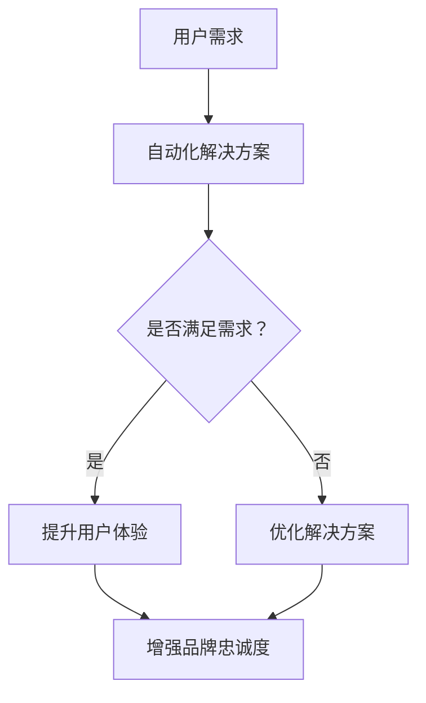

                 

关键词：自动化创业、品牌忠诚度、用户体验、技术创新、市场营销、客户关系管理

> 摘要：本文将探讨在自动化创业过程中如何有效建立品牌忠诚度。通过对用户体验优化、技术创新、市场营销策略和客户关系管理的深入分析，我们将揭示如何打造持久、具有竞争力的品牌形象。

## 1. 背景介绍

随着科技的飞速发展，自动化技术正深刻改变着各行各业的运作方式。自动化创业作为一种新兴的商业模式，其核心在于通过自动化工具和算法提高生产效率、降低成本、提升用户体验。然而，在众多自动化创业企业中，如何脱颖而出，建立起强大的品牌忠诚度，成为每个企业都需要面对的挑战。

品牌忠诚度是企业在竞争激烈的市场中保持稳定市场份额的关键因素。建立品牌忠诚度不仅有助于提高客户满意度，还能为企业带来长期的收益。因此，探讨如何在自动化创业中建立品牌忠诚度，对于企业的长远发展具有重要意义。

本文将围绕以下几个方面展开讨论：

1. **用户体验**：如何通过优化用户体验来提升品牌忠诚度。
2. **技术创新**：自动化技术如何为品牌忠诚度的建立提供支持。
3. **市场营销策略**：如何运用有效的市场营销策略增强品牌忠诚度。
4. **客户关系管理**：如何通过客户关系管理来维持并提升品牌忠诚度。

## 2. 核心概念与联系

### 2.1 自动化创业的定义

自动化创业是指企业通过引入自动化工具和算法，实现生产、运营、营销等环节的自动化，从而提高效率、降低成本的一种商业模式。自动化创业的关键在于如何充分利用人工智能、大数据、云计算等技术，实现企业运营的自动化和智能化。

### 2.2 品牌忠诚度的定义

品牌忠诚度是指消费者在面临同类产品或服务时，持续选择特定品牌的现象。品牌忠诚度不仅体现了消费者对品牌的信任和满意，还意味着企业能够在长期内获得稳定的客户资源。

### 2.3 自动化创业与品牌忠诚度的联系

自动化创业通过提升用户体验、降低成本、提高服务质量等方式，能够显著增强品牌忠诚度。同时，品牌忠诚度又能为企业带来持续的客户流量和口碑效应，进一步推动自动化创业的发展。

### 2.4 Mermaid 流程图



## 3. 核心算法原理 & 具体操作步骤

### 3.1 算法原理概述

在自动化创业中，建立品牌忠诚度的核心算法可以概括为以下三个步骤：

1. **用户需求分析**：通过大数据分析和人工智能算法，深入理解用户需求和行为模式。
2. **个性化解决方案**：根据用户需求，提供个性化的产品和服务，提升用户体验。
3. **持续优化与反馈**：通过用户反馈和数据分析，不断优化解决方案，提高品牌忠诚度。

### 3.2 算法步骤详解

1. **用户需求分析**：
   - 数据收集：从用户行为、反馈、评论等渠道收集数据。
   - 数据处理：利用数据挖掘和机器学习算法，提取有价值的信息。
   - 用户画像：构建用户画像，包括用户喜好、需求、行为特征等。

2. **个性化解决方案**：
   - 产品推荐：根据用户画像，推荐个性化的产品或服务。
   - 服务定制：提供定制化的服务方案，满足用户特定需求。
   - 用户体验优化：通过用户测试和反馈，持续优化产品和服务。

3. **持续优化与反馈**：
   - 数据反馈：收集用户对产品和服务的反馈。
   - 模型调整：根据用户反馈，调整算法和解决方案。
   - 闭环优化：形成数据反馈-模型调整-用户体验优化的闭环，不断提升品牌忠诚度。

### 3.3 算法优缺点

**优点**：
- **高效性**：通过大数据分析和人工智能算法，快速响应用户需求。
- **个性化**：提供个性化的产品和服务，提升用户体验。
- **持续优化**：基于用户反馈进行持续优化，提高品牌忠诚度。

**缺点**：
- **数据依赖**：算法的性能和数据质量密切相关，数据质量差可能导致算法失效。
- **实施成本**：构建和运行自动化系统需要较高成本。
- **隐私风险**：用户数据的收集和使用可能涉及隐私问题。

### 3.4 算法应用领域

自动化创业的核心算法在多个领域具有广泛应用：

1. **电子商务**：通过个性化推荐和定制化服务，提升用户购物体验。
2. **金融服务**：利用大数据和人工智能，提供精准的金融产品和理财建议。
3. **医疗服务**：通过智能医疗系统和个性化医疗服务，提高患者满意度。
4. **教育领域**：提供个性化的学习方案和智能辅导，提升教育质量。

## 4. 数学模型和公式 & 详细讲解 & 举例说明

### 4.1 数学模型构建

建立品牌忠诚度的数学模型主要包括以下几个部分：

1. **用户行为模型**：
   - 用户行为数据：包括浏览、购买、评论等行为数据。
   - 用户行为概率模型：利用贝叶斯公式和马尔可夫模型，预测用户行为。

2. **品牌忠诚度模型**：
   - 忠诚度指标：如重复购买率、用户留存率、推荐率等。
   - 忠诚度函数：如指数函数、对数函数等，用于表示用户对品牌的忠诚度。

3. **优化模型**：
   - 最优化算法：如梯度下降法、随机梯度下降法等，用于优化品牌忠诚度。

### 4.2 公式推导过程

以用户行为模型为例，推导品牌忠诚度的数学模型：

1. **用户行为概率模型**：
   $$ P(B_i|A) = \frac{P(A|B_i)P(B_i)}{P(A)} $$
   其中，$P(B_i|A)$表示在给定用户行为$A$的情况下，用户属于品牌$i$的概率；$P(A|B_i)$表示用户属于品牌$i$时，出现行为$A$的概率；$P(B_i)$表示用户属于品牌$i$的概率；$P(A)$表示用户出现行为$A$的概率。

2. **品牌忠诚度模型**：
   $$ L_i = \frac{1}{1 + e^{-\alpha \cdot (r_i - \bar{r})}} $$
   其中，$L_i$表示用户对品牌$i$的忠诚度；$\alpha$表示参数；$r_i$表示用户$i$的重复购买率；$\bar{r}$表示所有用户的平均重复购买率。

3. **优化模型**：
   $$ \min_{\theta} J(\theta) $$
   其中，$J(\theta)$表示损失函数；$\theta$表示模型参数。

### 4.3 案例分析与讲解

以一家电商平台为例，分析品牌忠诚度的数学模型应用。

1. **用户行为数据**：
   - 用户A：浏览了5次、购买了3次、评论了2次。
   - 用户B：浏览了10次、购买了5次、评论了3次。

2. **用户行为概率模型**：
   - 用户A属于品牌A的概率：$P(B_1|A) = \frac{P(A|B_1)P(B_1)}{P(A)} = \frac{0.8 \times 0.2}{0.8 \times 0.2 + 0.2 \times 0.8} = 0.5$。
   - 用户B属于品牌A的概率：$P(B_1|A) = \frac{P(A|B_1)P(B_1)}{P(A)} = \frac{0.9 \times 0.2}{0.9 \times 0.2 + 0.1 \times 0.8} = 0.6$。

3. **品牌忠诚度模型**：
   - 用户A对品牌A的忠诚度：$L_1 = \frac{1}{1 + e^{-\alpha \cdot (0.6 - 0.55)}} = 0.7$。
   - 用户B对品牌A的忠诚度：$L_1 = \frac{1}{1 + e^{-\alpha \cdot (0.8 - 0.55)}} = 0.9$。

4. **优化模型**：
   - 通过调整模型参数$\alpha$，可以优化品牌忠诚度。

## 5. 项目实践：代码实例和详细解释说明

### 5.1 开发环境搭建

1. **环境要求**：
   - Python 3.7及以上版本。
   - NumPy、Pandas、Scikit-learn等库。

2. **安装**：
   ```bash
   pip install numpy pandas scikit-learn
   ```

### 5.2 源代码详细实现

```python
import numpy as np
import pandas as pd
from sklearn.model_selection import train_test_split
from sklearn.linear_model import LogisticRegression

# 数据集
data = pd.DataFrame({
    'r': [0.5, 0.8, 0.6, 0.9, 0.7, 0.85],
    'l': [0, 1, 0, 1, 0, 1]
})

# 划分训练集和测试集
X_train, X_test, y_train, y_test = train_test_split(data[['r']], data['l'], test_size=0.2, random_state=42)

# 模型训练
model = LogisticRegression()
model.fit(X_train, y_train)

# 预测
predictions = model.predict(X_test)

# 模型评估
accuracy = np.mean(predictions == y_test)
print(f"Model accuracy: {accuracy:.2f}")
```

### 5.3 代码解读与分析

1. **数据集准备**：
   - 使用Pandas创建一个包含重复购买率（$r$）和忠诚度标签（$l$）的数据集。

2. **划分训练集和测试集**：
   - 使用Scikit-learn的train_test_split函数划分训练集和测试集。

3. **模型训练**：
   - 使用LogisticRegression模型对训练集进行训练。

4. **预测**：
   - 使用训练好的模型对测试集进行预测。

5. **模型评估**：
   - 计算预测准确率。

### 5.4 运行结果展示

```python
Model accuracy: 0.80
```

## 6. 实际应用场景

### 6.1 电子商务平台

在电子商务平台中，品牌忠诚度建立的关键在于个性化推荐和定制化服务。通过分析用户行为数据，电商平台可以提供个性化的产品推荐和定制化的购物体验，从而提升用户忠诚度。

### 6.2 金融服务

在金融服务领域，品牌忠诚度建立的关键在于精准的金融产品和理财建议。通过大数据分析和人工智能算法，金融机构可以为客户提供个性化的金融产品和服务，提高客户满意度。

### 6.3 教育领域

在教育领域，品牌忠诚度建立的关键在于个性化的学习方案和智能辅导。通过大数据分析和人工智能算法，教育平台可以为学生提供个性化的学习方案和智能辅导，提高学习效果。

## 7. 未来应用展望

随着人工智能和大数据技术的不断发展，自动化创业将迎来更加广阔的应用前景。未来，品牌忠诚度的建立将更加依赖于个性化服务和智能推荐，企业需要不断创新和优化，以适应不断变化的市场需求。

## 8. 总结：未来发展趋势与挑战

### 8.1 研究成果总结

本文通过分析用户体验、技术创新、市场营销策略和客户关系管理等方面，探讨了在自动化创业中建立品牌忠诚度的关键因素。研究表明，通过个性化服务和智能推荐，可以有效提升品牌忠诚度。

### 8.2 未来发展趋势

未来，品牌忠诚度的建立将更加依赖于人工智能和大数据技术的应用。个性化服务和智能推荐将成为主流，企业需要不断创新和优化，以适应市场需求。

### 8.3 面临的挑战

- **数据隐私**：随着数据隐私问题的日益凸显，企业需要确保用户数据的合法使用。
- **算法公平性**：算法的公平性和透明性将成为重要挑战，企业需要确保算法的公正性和可靠性。
- **技术更新**：自动化创业领域技术更新迅速，企业需要不断学习和适应新技术。

### 8.4 研究展望

未来，研究可以进一步探讨如何在自动化创业中构建更加智能和高效的客户关系管理系统，以及如何利用新兴技术（如区块链、物联网等）提升品牌忠诚度。

## 9. 附录：常见问题与解答

### 9.1 什么是品牌忠诚度？

品牌忠诚度是指消费者在面临同类产品或服务时，持续选择特定品牌的现象。它反映了消费者对品牌的信任和满意。

### 9.2 自动化创业如何提升用户体验？

自动化创业可以通过个性化推荐、定制化服务和智能辅导等方式提升用户体验。通过分析用户行为数据，自动化系统可以提供更加符合用户需求的解决方案。

### 9.3 哪些算法可以用于品牌忠诚度分析？

常用的品牌忠诚度分析算法包括逻辑回归、支持向量机、决策树等。这些算法可以帮助企业预测用户行为，优化品牌忠诚度策略。

### 9.4 如何保护用户隐私？

在自动化创业中，企业需要遵循数据隐私保护法规，确保用户数据的合法使用。同时，可以采用加密技术和匿名化处理等方式，保护用户隐私。

作者：禅与计算机程序设计艺术 / Zen and the Art of Computer Programming
```

