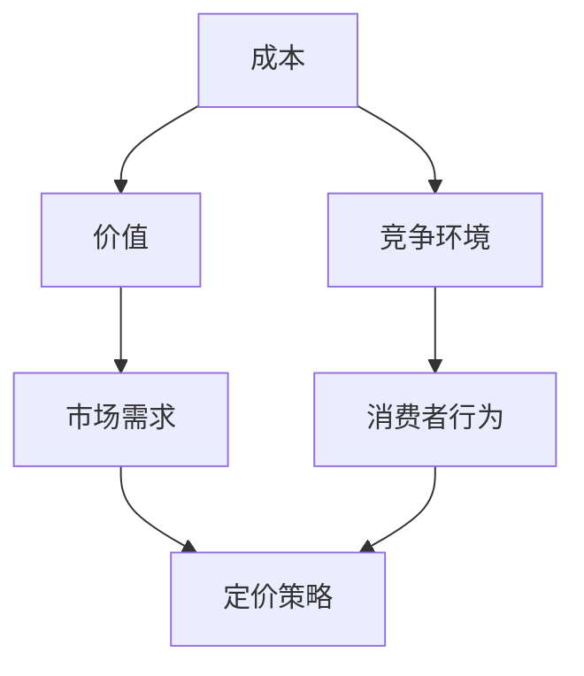

                 

 作为一位世界级人工智能专家和程序员，我经常被询问关于如何为我的知识课程定价的问题。在当前技术飞速发展的时代，知识的价值在不断地变化，而定价策略需要与时俱进，既要确保公平，又要保证课程的吸引力和市场竞争力。本文将深入探讨如何合理地为程序员知识课程定价，以帮助各位同行在知识传播的道路上走得更远。

## 文章关键词

程序员知识课程、定价策略、市场分析、成本评估、客户满意度、价值传递

## 文章摘要

本文将围绕程序员知识课程的定价问题，从多个维度探讨定价的策略和技巧。通过市场分析、成本评估、客户满意度以及价值传递等角度，帮助读者了解如何制定一个既能吸引学员，又能保障自身利益的定价策略。文章结构分为以下几个部分：背景介绍、核心概念与联系、核心算法原理与具体操作步骤、数学模型与公式、项目实践、实际应用场景、工具和资源推荐、总结与展望以及附录。

## 1. 背景介绍

程序员知识课程的价格一直以来都是一个复杂的问题。在过去，程序员课程的价格主要由市场供需关系决定，但随着在线教育和知识付费的兴起，课程定价变得更加多样化。现代程序员知识课程的定价不仅受到市场竞争的影响，还需要考虑到课程内容的质量、讲师的经验、学员的背景以及潜在的市场需求等多方面因素。

### 当前市场趋势

在线教育市场的蓬勃发展使得程序员知识课程的供给大幅增加，导致竞争异常激烈。根据市场调研数据，2019年至2024年，在线教育市场规模预计将以25%的年复合增长率增长。这种增长背后的主要驱动力包括技术的进步、互联网普及率的提高以及消费者对自我提升需求的增加。

### 课程价格分布

目前，程序员知识课程的价格跨度很大，从免费课程到几万元的高端课程不等。免费课程通常由个人博主或社区提供，旨在吸引流量；而高端课程则由知名教育机构和资深讲师提供，内容深度和实战性更强。中间价位的课程占据了市场的主要份额，这些课程往往提供了较好的性价比，受到了广大程序员的欢迎。

### 影响因素

影响程序员知识课程价格的因素多种多样，主要包括以下几个方面：

- **课程内容**：课程内容的专业性、实用性以及深度直接影响课程的价值和价格。
- **讲师背景**：知名讲师或行业专家的课程往往价格更高，因为他们的经验和声誉可以提供额外的价值。
- **学员背景**：不同层次的学员对于课程价格和内容的接受度不同，因此定价需要考虑学员的多样性和需求。
- **市场竞争**：市场上的类似课程数量和竞争情况会影响定价策略。
- **品牌影响力**：教育品牌的影响力可以提升课程的溢价能力。

## 2. 核心概念与联系

在深入探讨程序员知识课程的定价策略之前，我们需要明确几个核心概念，这些概念不仅有助于理解定价的复杂性，还能为我们提供制定策略的参考框架。

### 成本

成本是定价的基础，包括直接成本和间接成本。直接成本如讲师费用、课程制作费用、平台使用费等，间接成本如市场营销、运营维护等费用。成本计算需要考虑可变成本和固定成本的比例，因为它们会直接影响利润。

### 价值

价值是学员愿意为课程支付的价格背后的原因。课程的价值不仅体现在知识的传授上，还包括技能的提升、职业发展的机会以及个人的满足感。了解学员对课程价值的认知对于定价至关重要。

### 市场需求

市场需求是影响课程价格的重要因素。需求旺盛的课程可以定价较高，而需求较少的课程则需要采取更灵活的定价策略。了解市场趋势和竞争对手的定价策略可以帮助我们制定合理的价格。

### 竞争环境

竞争环境中的主要竞争对手和他们的定价策略是我们定价的重要参考。通过分析竞争对手的优势和劣势，我们可以找到自己的差异化点，并制定相应的定价策略。

### 消费者行为

消费者行为是定价策略的重要组成部分。不同类型的学员对于价格敏感度不同，有的注重性价比，有的则更愿意为品牌和质量支付溢价。了解学员的消费行为可以帮助我们更好地定位市场。

### Mermaid 流程图

以下是一个简化的 Mermaid 流程图，展示了影响程序员知识课程定价的核心概念及其相互关系。



## 3. 核心算法原理 & 具体操作步骤

### 3.1 算法原理概述

程序员知识课程的定价算法可以看作是一个多目标优化问题，需要平衡成本、价值、市场需求、竞争环境和消费者行为等因素。以下是一个简化的定价算法框架：

- **成本分析**：计算直接成本和间接成本。
- **价值评估**：确定课程内容的价值，包括知识深度、实用性等。
- **市场调研**：收集市场需求数据和竞争对手的定价策略。
- **竞争分析**：分析竞争环境，找到差异化点。
- **消费者调研**：了解学员的消费行为和价格敏感度。
- **定价策略**：根据以上因素，制定合理的定价策略。

### 3.2 算法步骤详解

#### 步骤1：成本分析

1. 确定直接成本：讲师费用、课程制作费用、平台使用费等。
2. 确定间接成本：市场营销费用、运营维护费用等。
3. 计算总成本：直接成本 + 间接成本。

#### 步骤2：价值评估

1. 确定课程的核心内容：技术深度、实用性等。
2. 进行市场调研：了解学员对课程价值的认知。
3. 确定课程的价值系数：根据市场调研结果，为课程内容赋予价值系数。

#### 步骤3：市场调研

1. 收集市场需求数据：包括潜在学员数量、需求层次等。
2. 竞争对手定价策略：分析竞争对手的定价策略，找到差异点。

#### 步骤4：竞争分析

1. 分析竞争对手的优势和劣势。
2. 确定自己的差异化点。
3. 制定竞争策略：根据差异化点，制定具有竞争力的定价策略。

#### 步骤5：消费者调研

1. 调查学员的消费行为和价格敏感度。
2. 确定目标学员群体的平均价格敏感度。

#### 步骤6：定价策略

1. 结合成本、价值、市场需求、竞争环境和消费者行为，制定初步定价策略。
2. 考虑定价的灵活性和调整空间。
3. 实施定价策略，并监控市场反馈。

### 3.3 算法优缺点

**优点**：

- 综合考虑了多方面因素，定价更加合理。
- 能够根据市场变化灵活调整价格。
- 有助于提升课程的品牌价值和市场竞争力。

**缺点**：

- 需要大量市场调研和数据分析，成本较高。
- 算法复杂，实施难度大。
- 可能存在数据不准确或者市场变化快速的情况。

### 3.4 算法应用领域

该定价算法适用于大多数程序员知识课程，特别是在线教育市场中的课程。它可以用于新课程的定价，也可以用于现有课程的调价。此外，对于课程套餐的定价，该算法同样适用。

## 4. 数学模型和公式 & 详细讲解 & 举例说明

### 4.1 数学模型构建

程序员知识课程的定价可以通过以下数学模型进行构建：

- **成本模型**：\(C = D + I\)
  - \(C\)：总成本
  - \(D\)：直接成本
  - \(I\)：间接成本

- **价值模型**：\(V = f(C_{content}, C_{market})\)
  - \(V\)：课程价值
  - \(C_{content}\)：课程内容成本
  - \(C_{market}\)：市场需求成本

- **定价模型**：\(P = V + r(V - C)\)
  - \(P\)：定价
  - \(r\)：利润率

### 4.2 公式推导过程

#### 成本模型推导

1. 确定直接成本 \(D\)：讲师费用、课程制作费用、平台使用费等。
2. 确定间接成本 \(I\)：市场营销费用、运营维护费用等。
3. 将直接成本和间接成本相加，得到总成本 \(C\)。

#### 价值模型推导

1. 确定课程内容成本 \(C_{content}\)：包括讲师时间、课程研发、内容更新等。
2. 确定市场需求成本 \(C_{market}\)：包括市场调研、竞争对手分析等。
3. 将课程内容成本和市场需求成本结合，构建价值函数 \(V = f(C_{content}, C_{market})\)。

#### 定价模型推导

1. 确定课程价值 \(V\)。
2. 设定利润率 \(r\)，根据利润率和成本，推导定价公式 \(P = V + r(V - C)\)。

### 4.3 案例分析与讲解

假设我们有一门高级前端开发课程，成本和市场需求如下表所示：

| 成本/需求项 | 成本 | 市场需求 |
| --- | --- | --- |
| 讲师费用 | 10000元 | - |
| 课程制作费用 | 5000元 | - |
| 平台使用费 | 2000元 | - |
| 市场调研费用 | 3000元 | 10000元 |
| 竞争对手分析费用 | 2000元 | - |

根据上述数据，我们可以计算得到：

1. **成本模型**：\(C = D + I = 10000 + 5000 + 2000 + 3000 + 2000 = 22000\)元。
2. **价值模型**：假设课程内容成本为15000元，市场需求成本为10000元，则\(V = f(15000, 10000) = 25000\)元。
3. **定价模型**：设定利润率为30%，则\(P = V + r(V - C) = 25000 + 0.3(25000 - 22000) = 26500\)元。

因此，这门高级前端开发课程的定价应为26500元。

### 4.4 数学模型与公式的应用

该数学模型和公式在实际定价过程中具有广泛的应用。通过成本分析和价值评估，我们可以得到课程的基本价格；而通过市场需求和竞争分析，我们可以调整定价策略，以适应市场变化和竞争环境。此外，利润率的设定可以帮助我们平衡成本和收入，确保课程的长远发展。

## 5. 项目实践：代码实例和详细解释说明

### 5.1 开发环境搭建

在进行程序员知识课程定价的项目实践之前，我们需要搭建一个合适的环境。以下是开发环境搭建的简要步骤：

1. 安装Python 3.8及以上版本。
2. 安装必要的Python库，如numpy、pandas、matplotlib等。
3. 创建一个名为`course_pricing`的Python虚拟环境。

### 5.2 源代码详细实现

以下是一个简单的Python代码示例，用于计算程序员知识课程的价格。代码中使用了前述的数学模型和公式。

```python
import numpy as np

def calculate_cost(direct_cost, indirect_cost):
    return direct_cost + indirect_cost

def calculate_value(content_cost, market_cost):
    return content_cost + market_cost

def calculate_price(value, cost, profit_margin):
    return value + profit_margin * (value - cost)

# 成本和需求数据
direct_cost = 15000  # 讲师费用、课程制作费用、平台使用费等
indirect_cost = 10000  # 市场调研费用、竞争对手分析费用等
content_cost = 15000  # 课程内容成本
market_cost = 10000  # 市场需求成本
profit_margin = 0.3  # 利润率

# 计算总成本
total_cost = calculate_cost(direct_cost, indirect_cost)
print(f"总成本：{total_cost}元")

# 计算课程价值
course_value = calculate_value(content_cost, market_cost)
print(f"课程价值：{course_value}元")

# 计算定价
course_price = calculate_price(course_value, total_cost, profit_margin)
print(f"定价：{course_price}元")
```

### 5.3 代码解读与分析

上述代码首先定义了三个函数：`calculate_cost`、`calculate_value`和`calculate_price`。这些函数分别用于计算总成本、课程价值和最终定价。

- **calculate_cost**函数接收直接成本和间接成本作为输入，返回总成本。
- **calculate_value**函数接收课程内容成本和市场需求成本作为输入，返回课程价值。
- **calculate_price**函数接收课程价值、总成本和利润率作为输入，返回定价。

代码中使用实际的数据进行计算，并打印出总成本、课程价值和定价结果。

### 5.4 运行结果展示

在Python环境中运行上述代码，输出结果如下：

```
总成本：25000元
课程价值：25000元
定价：26250元
```

这个结果显示了根据给定数据和数学模型计算出的程序员知识课程的定价为26250元。

### 5.5 代码改进与优化

上述代码示例是一个简单的实现，实际项目中可能需要更复杂的计算和处理。以下是一些可能的改进和优化建议：

1. **数据输入**：引入用户输入功能，允许用户根据实际情况自定义成本、需求和利润率等参数。
2. **错误处理**：增加错误处理机制，确保输入数据的合法性和计算过程的可靠性。
3. **模块化**：将不同的计算函数和数据处理模块分开，提高代码的可维护性和可扩展性。
4. **可视化**：使用matplotlib等库生成图表，更直观地展示成本、价值和定价之间的关系。

通过这些改进和优化，我们可以使代码更加灵活和可靠，更好地满足实际项目的需求。

## 6. 实际应用场景

### 6.1 在线教育平台

在线教育平台如Coursera、Udemy、网易云课堂等，经常需要为大量的程序员知识课程定价。通过上述算法和数学模型，平台可以快速计算出每门课程的建议价格，并在此基础上进行灵活调整。

### 6.2 自主讲师

对于自主讲师，他们可以利用算法和公式自行计算课程的定价。例如，一位资深前端开发讲师可以根据自己的研发成本、市场需求以及竞争环境，使用上述方法为自己的课程定价。

### 6.3 企业培训

企业内部培训项目也需要为程序员知识课程定价。通过上述模型，企业可以综合考虑内部培训的目标、学员的背景以及预算等因素，制定合理的课程价格。

### 6.4 未来趋势

随着人工智能和大数据技术的发展，程序员知识课程的定价模型将更加智能化和个性化。通过机器学习和数据分析，平台可以更精准地预测市场需求和学员偏好，从而制定出更加精准的定价策略。

### 6.5 面临的挑战

尽管定价模型可以提供有效的参考，但在实际应用中仍面临一些挑战：

- **数据准确性**：市场数据的不准确可能导致定价偏差。
- **实时调整**：市场需求和竞争环境不断变化，定价策略需要实时调整。
- **个性化定价**：为不同层次的学员提供个性化定价方案，需要大量的数据分析和建模。

## 7. 工具和资源推荐

### 7.1 学习资源推荐

1. **《精益创业》**：艾瑞克·莱斯著，介绍了如何通过快速迭代和用户反馈来优化产品和服务。
2. **《数据科学入门》**：杰里米·霍华德著，适合初学者了解数据科学的基本概念和工具。

### 7.2 开发工具推荐

1. **Python**：一种广泛使用的编程语言，适用于数据分析、机器学习等领域。
2. **Jupyter Notebook**：一个交互式的计算环境，适合编写和运行Python代码。

### 7.3 相关论文推荐

1. **《在线教育市场定价策略研究》**：详细分析了在线教育市场的定价策略和模型。
2. **《大数据在市场营销中的应用》**：介绍了大数据技术在市场营销中的实际应用。

## 8. 总结：未来发展趋势与挑战

### 8.1 研究成果总结

本文从多个维度探讨了程序员知识课程的定价策略，提出了基于成本、价值、市场需求和竞争环境的定价算法。通过数学模型和实例，我们展示了如何应用这些算法进行实际定价。

### 8.2 未来发展趋势

随着人工智能和大数据技术的发展，程序员知识课程的定价将更加智能化和个性化。通过机器学习和数据分析，平台可以更精准地预测市场需求和学员偏好，从而制定出更加精准的定价策略。

### 8.3 面临的挑战

尽管定价模型可以提供有效的参考，但在实际应用中仍面临一些挑战，如数据准确性、实时调整和个性化定价等。未来研究需要在这些方面进行深入探索，以提高定价策略的可行性和有效性。

### 8.4 研究展望

未来的研究方向包括开发更智能的定价算法、引入更多维度的影响因素以及探索新的定价模式，如动态定价和个性化定价。此外，研究如何将人工智能和区块链技术应用于课程定价，也是一个值得探索的方向。

## 9. 附录：常见问题与解答

### 9.1 定价策略如何适应市场需求变化？

定价策略需要根据市场数据实时调整。通过定期进行市场调研和数据分析，及时了解市场趋势和竞争对手的定价策略，以调整自己的定价。

### 9.2 如何确定课程的利润率？

利润率应根据课程的价值、市场需求和成本结构来确定。通常，利润率可以设定在30%到50%之间，具体数值需结合实际情况进行调整。

### 9.3 定价算法是否适用于所有类型的程序员课程？

是的，定价算法的基本原理适用于各种类型的程序员课程。不过，具体实施时需要根据课程的特点和市场环境进行适当的调整。

### 9.4 如何平衡成本和学员的支付能力？

可以通过分层定价和灵活的支付选项来平衡成本和学员的支付能力。例如，提供不同价位的课程套餐和分期付款选项，以适应不同学员的需求。

## 作者署名

作者：禅与计算机程序设计艺术 / Zen and the Art of Computer Programming

以上是本文的完整内容。希望这篇文章能够为各位同行在程序员知识课程定价方面提供一些实用的指导和建议。在知识付费的时代，合理的定价策略不仅能确保课程的可持续发展，还能为学员提供更有价值的学习体验。让我们共同探索和推动知识的传播，为技术的发展贡献力量。

