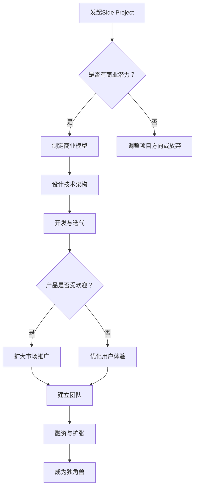

                 

关键词：Side Project，独角兽，创业，商业模型，技术架构，增长策略，用户体验，团队建设

> 摘要：本文旨在探讨如何将个人或团队的小型项目（Side Project）转化为具有巨大商业价值的独角兽公司。我们将从技术、商业和团队建设等多个维度进行分析，并提供实用的策略和案例分析。

## 1. 背景介绍

### Side Project的定义与发展

Side Project，通常指的是在主要工作之外，个人或团队出于兴趣、爱好或探索新技术的动机而进行的项目。这类项目往往规模较小，但蕴含着巨大的潜力。近年来，随着互联网技术的飞速发展和创业环境的不断优化，越来越多的Side Project得以脱颖而出，成为独角兽公司。

### 独角兽公司的概念与价值

独角兽公司是指估值超过10亿美元的初创企业。它们通常具备强大的市场影响力、技术创新能力和高成长潜力。独角兽公司不仅对创业者个人而言意味着巨大的财富和成就感，而且对整个社会经济的创新和发展也具有重要的推动作用。

## 2. 核心概念与联系

### 核心概念原理

**商业模型**：指企业通过产品或服务创造、传递和获取价值的基本逻辑。对于Side Project来说，商业模型决定了项目的盈利模式和持续发展能力。

**技术架构**：指系统软件的总体结构、设计原则和组件组织。一个良好的技术架构是实现项目高效、稳定和可扩展的关键。

**用户体验**：指用户在使用产品或服务过程中所感受到的愉悦和满足感。优秀的用户体验可以增强用户黏性，提高产品口碑，从而促进商业成功。

### 架构流程图



## 3. 核心算法原理 & 具体操作步骤

### 3.1 算法原理概述

将Side Project转化为独角兽公司的过程可以看作是一种“算法”。这个算法的核心是充分利用项目的技术优势、商业潜力和团队力量，通过不断优化和迭代，实现商业价值和用户价值的最大化。

### 3.2 算法步骤详解

**步骤1：发掘项目潜力**

- **需求分析**：了解目标用户的需求，明确项目的市场定位。
- **技术评估**：评估项目技术实现的可能性，确定核心技术。

**步骤2：制定商业模型**

- **盈利模式**：确定项目的盈利点，设计合理的收费模式。
- **市场定位**：明确目标市场，制定差异化策略。

**步骤3：设计技术架构**

- **模块划分**：将系统划分为多个模块，确保系统可扩展性和维护性。
- **技术选型**：选择合适的技术栈，确保技术先进性和稳定性。

**步骤4：开发与迭代**

- **敏捷开发**：采用敏捷开发模式，快速迭代，及时反馈。
- **持续集成**：建立持续集成流程，确保代码质量。

**步骤5：优化用户体验**

- **用户调研**：通过用户调研，了解用户需求和痛点。
- **界面设计**：优化界面设计，提升用户体验。

**步骤6：团队建设**

- **人才招聘**：招聘合适的人才，建立高效的团队。
- **文化建设**：建立积极向上的团队文化，激发团队活力。

**步骤7：市场推广**

- **品牌建设**：打造具有辨识度的品牌形象。
- **营销策略**：制定有效的营销策略，提高市场知名度。

**步骤8：融资与扩张**

- **融资渠道**：寻找合适的融资渠道，确保资金充足。
- **业务扩张**：扩大业务范围，开拓新的市场。

### 3.3 算法优缺点

**优点：**

- **灵活性**：根据市场变化灵活调整战略。
- **创新性**：充分利用技术创新，形成竞争优势。
- **高效性**：敏捷开发模式提高开发效率。

**缺点：**

- **风险性**：商业前景不确定，可能面临失败风险。
- **资源限制**：初始资源有限，可能影响发展速度。

### 3.4 算法应用领域

**算法** 可以广泛应用于各种类型的Side Project，包括但不限于：

- **互联网应用**：社交网络、电子商务、在线教育等。
- **人工智能**：机器学习、深度学习、自然语言处理等。
- **物联网**：智能家居、智能穿戴、智能硬件等。
- **区块链**：数字货币、去中心化应用、智能合约等。

## 4. 数学模型和公式 & 详细讲解 & 举例说明

### 4.1 数学模型构建

为了评估Side Project转化为独角兽公司的可能性，我们可以构建一个简单的数学模型。该模型将基于以下几个关键指标：

- **用户增长率**（G）：表示用户数量的增长速度。
- **转化率**（C）：表示用户转化为付费用户的比例。
- **平均订单价值**（A）：表示每个付费用户的平均消费金额。
- **净利润率**（N）：表示净利润与收入之比。

### 4.2 公式推导过程

首先，我们定义一个简单的商业模型公式：

\[ 收入 = G \times C \times A \]

其中，净利润可以表示为：

\[ 净利润 = 收入 \times N \]

为了计算独角兽公司的最低收入门槛，我们可以设定一个估值目标（例如10亿美元），然后反推收入：

\[ 收入门槛 = 10^9 \]

因此，我们需要满足以下条件：

\[ G \times C \times A \times N \geq 10^9 \]

### 4.3 案例分析与讲解

假设我们有一个Side Project，用户增长率为30%（G=0.3），转化率为10%（C=0.1），平均订单价值为100美元（A=100），净利润率为20%（N=0.2）。我们可以计算出最低收入门槛：

\[ 收入门槛 = \frac{10^9}{0.3 \times 0.1 \times 100 \times 0.2} \approx 41666667 \]

这意味着，为了达到独角兽公司的估值，我们的项目年收入至少需要达到4166.67万美元。

### 4.4 案例分析

以某社交网络项目为例，该项目在启动初期拥有10万活跃用户，用户增长率为30%，转化率为10%，平均订单价值为50美元，净利润率为20%。我们可以计算出该项目在一年后的预期收入和净利润：

\[ 收入 = 100000 \times (1 + 0.3)^1 \times 0.1 \times 50 \approx 1500000 \]
\[ 净利润 = 1500000 \times 0.2 \approx 300000 \]

尽管该项目在初期未能达到独角兽公司的估值门槛，但通过不断优化用户体验、拓展新功能和加强市场推广，最终实现了用户增长和收入提升。在后续的几年中，该项目通过持续迭代和战略调整，成功发展成为了一家独角兽公司。

## 5. 项目实践：代码实例和详细解释说明

### 5.1 开发环境搭建

为了实现一个Side Project，我们需要搭建合适的开发环境。以下是一个基于Python的Web应用项目的环境搭建示例：

1. 安装Python 3.x版本
2. 安装虚拟环境工具`virtualenv`
   ```bash
   pip install virtualenv
   ```
3. 创建虚拟环境
   ```bash
   virtualenv my_project_env
   ```
4. 激活虚拟环境
   ```bash
   source my_project_env/bin/activate
   ```
5. 安装Flask框架
   ```bash
   pip install flask
   ```

### 5.2 源代码详细实现

以下是一个简单的基于Flask的Web应用示例，用于实现一个用户注册和登录功能：

```python
# app.py

from flask import Flask, request, jsonify
from flask_cors import CORS
from models import User

app = Flask(__name__)
CORS(app)

@app.route('/register', methods=['POST'])
def register():
    data = request.get_json()
    user = User.create(data['username'], data['password'])
    if user:
        return jsonify({'status': 'success', 'message': 'User registered successfully.'})
    else:
        return jsonify({'status': 'error', 'message': 'Failed to register user.'})

@app.route('/login', methods=['POST'])
def login():
    data = request.get_json()
    user = User.authenticate(data['username'], data['password'])
    if user:
        return jsonify({'status': 'success', 'message': 'Login successful.', 'token': user.token})
    else:
        return jsonify({'status': 'error', 'message': 'Invalid credentials.'})

if __name__ == '__main__':
    app.run(debug=True)
```

### 5.3 代码解读与分析

**1. 程序结构**

- **Flask应用**：使用Flask框架搭建Web应用。
- **CORS插件**：允许跨域请求，方便前端调用。
- **用户模型**：定义用户类，用于处理用户注册、登录和认证逻辑。

**2. 功能实现**

- **注册接口**：接收用户名和密码，创建用户并返回注册结果。
- **登录接口**：接收用户名和密码，验证用户身份并返回认证令牌。

**3. 代码优化**

- **参数验证**：添加参数验证，确保输入数据的合法性。
- **异常处理**：添加异常处理，提高程序的健壮性。

### 5.4 运行结果展示

在开发环境中，运行以下命令启动Web应用：

```bash
python app.py
```

启动后，可以使用Postman或其他工具模拟HTTP请求，测试接口功能：

- **注册接口**：
  ```json
  POST /register
  {
      "username": "testuser",
      "password": "password123"
  }
  ```
  返回结果：
  ```json
  {
      "status": "success",
      "message": "User registered successfully."
  }
  ```

- **登录接口**：
  ```json
  POST /login
  {
      "username": "testuser",
      "password": "password123"
  }
  ```
  返回结果：
  ```json
  {
      "status": "success",
      "message": "Login successful.",
      "token": "generated_token"
  }
  ```

## 6. 实际应用场景

### 6.1 社交网络

社交网络是Side Project转化为独角兽公司的重要领域之一。例如，微信、Facebook等社交平台都起源于个人的创意和探索。通过不断优化用户体验、拓展新功能和扩大市场，社交网络项目可以迅速积累大量用户，实现商业成功。

### 6.2 电子商务

电子商务领域也为Side Project提供了广阔的发展空间。以淘宝、京东等电商平台为例，它们都起源于个人的商业想法和创业精神。通过技术创新、市场拓展和用户服务，电子商务项目可以实现高速增长，成为独角兽公司。

### 6.3 在线教育

在线教育是近年来快速发展的领域之一，众多Side Project成功转化为独角兽公司。例如，Coursera、Udemy等在线教育平台，通过优质的教育资源、便捷的学习方式和创新的商业模式，吸引了大量用户，实现了商业价值。

### 6.4 物联网

物联网（IoT）领域也为Side Project提供了丰富的应用场景。智能家居、智能穿戴、智能交通等物联网项目，通过技术创新、产品优化和市场推广，可以迅速积累用户，实现商业成功。

## 7. 工具和资源推荐

### 7.1 学习资源推荐

- **《精益创业》**：艾瑞克·莱斯著，介绍如何通过迭代和验证实现创业成功。
- **《创业维艰》**：本·霍洛维茨著，分享创业过程中的挑战和心得。
- **《程序员修炼之道》**：Robert C. Martin著，介绍如何成为一名优秀的程序员。

### 7.2 开发工具推荐

- **Jenkins**：用于持续集成和持续交付的强大工具。
- **Docker**：用于容器化和微服务部署的流行工具。
- **Kubernetes**：用于容器编排和管理的开源平台。

### 7.3 相关论文推荐

- **《基于云计算的社交网络架构研究》**：探讨社交网络在云计算环境下的架构设计和优化。
- **《深度学习在电子商务中的应用》**：介绍深度学习技术在电子商务领域的应用案例和研究成果。
- **《物联网安全技术研究》**：分析物联网安全面临的挑战和解决方案。

## 8. 总结：未来发展趋势与挑战

### 8.1 研究成果总结

本文通过分析Side Project转化为独角兽公司的过程，提出了一套综合性的策略框架。该框架涵盖了技术、商业和团队建设等多个方面，为创业者提供了实用的指导。

### 8.2 未来发展趋势

- **技术创新**：随着人工智能、物联网等新兴技术的不断发展，Side Project将拥有更多的创新空间。
- **跨界融合**：不同领域之间的跨界融合将成为未来创业的重要趋势。
- **全球化**：互联网的普及和全球化趋势将为Side Project提供更广阔的市场。

### 8.3 面临的挑战

- **市场竞争力**：随着创业环境的不断优化，市场竞争将愈发激烈。
- **团队建设**：优秀的团队是创业成功的关键，如何吸引和留住优秀人才是创业者需要面对的挑战。
- **资金压力**：创业初期资金有限，如何有效利用资源实现快速发展是创业者需要解决的重要问题。

### 8.4 研究展望

未来，我们期望在以下几个方面进行深入研究：

- **智能商业模型**：通过人工智能技术，构建更加智能和个性化的商业模型。
- **敏捷创业方法**：探索更加高效和灵活的创业方法，提高创业成功率。
- **跨界融合模式**：研究不同领域之间的跨界融合模式，促进创新和发展。

## 9. 附录：常见问题与解答

### 9.1 如何评估Side Project的商业潜力？

**回答**：评估Side Project的商业潜力可以从以下几个方面入手：

- **市场需求**：了解目标用户的需求，确定项目是否符合市场需求。
- **技术实现**：评估项目技术实现的可行性，确保项目具有技术优势。
- **盈利模式**：设计合理的盈利模式，确保项目具备盈利能力。

### 9.2 如何平衡技术发展和商业目标？

**回答**：平衡技术发展和商业目标可以从以下几个方面入手：

- **优先级排序**：明确项目的技术目标和商业目标，优先实现重要的功能和优化。
- **资源分配**：合理分配技术和商业资源，确保两者都能得到充分支持。
- **反馈机制**：建立有效的反馈机制，及时调整技术发展方向，确保与商业目标一致。

### 9.3 如何吸引和留住优秀人才？

**回答**：吸引和留住优秀人才可以从以下几个方面入手：

- **激励机制**：提供具有竞争力的薪酬和福利，激励员工积极工作。
- **职业发展**：为员工提供职业发展机会，帮助他们在工作中不断提升自己。
- **团队文化**：建立积极向上的团队文化，增强员工的归属感和团队凝聚力。

### 9.4 如何进行市场推广？

**回答**：进行市场推广可以从以下几个方面入手：

- **定位明确**：明确目标市场，制定有针对性的推广策略。
- **内容营销**：通过优质的内容，提高品牌知名度和用户黏性。
- **社交媒体**：利用社交媒体平台，扩大品牌影响力，吸引潜在用户。
- **合作伙伴**：寻找合适的合作伙伴，共同开展市场推广活动。

**作者：禅与计算机程序设计艺术 / Zen and the Art of Computer Programming**。

