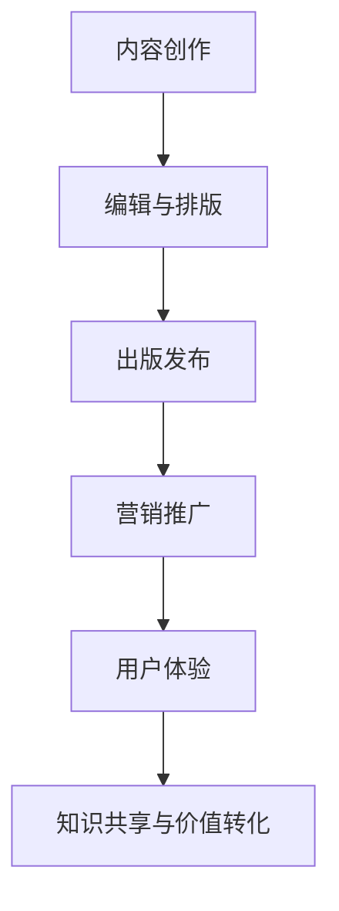

                 

关键词：技术文档，付费电子书，内容创作，营销策略，出版流程，用户体验，知识共享

> 摘要：本文旨在探讨如何将技术文档转化为具有商业价值的付费电子书。通过分析技术文档的特性，制定有效的营销策略，优化出版流程，提升用户体验，最终实现知识共享与价值转化。

## 1. 背景介绍

在信息化时代，技术文档成为了知识传播的重要载体。从软件开发手册到系统架构指南，技术文档为各类专业人士提供了宝贵的参考资料。然而，随着内容创作的繁荣，如何将技术文档转化为付费电子书，成为了一个值得探讨的课题。这不仅有助于作者实现知识共享，还能为读者提供高质量的学习资源。

本文将围绕以下方面展开讨论：

1. 核心概念与联系
2. 核心算法原理与具体操作步骤
3. 数学模型和公式讲解与案例
4. 项目实践与代码实例解析
5. 实际应用场景及未来展望
6. 工具和资源推荐
7. 总结与未来发展趋势

## 2. 核心概念与联系

在将技术文档转化为付费电子书的过程中，我们需要关注以下几个核心概念：

1. **内容创作**：技术文档的撰写是基础，要求作者具备扎实的专业知识、清晰的逻辑思维和优秀的表达能力。
2. **出版流程**：从编辑、排版到发布，一系列流程的优化是保证电子书质量的关键。
3. **营销策略**：如何吸引读者，提高书籍的销量和影响力，需要我们制定合理的营销方案。
4. **用户体验**：优秀的用户体验可以提升读者的满意度，从而增加付费意愿。

### Mermaid 流程图



## 3. 核心算法原理与具体操作步骤

### 3.1 算法原理概述

在技术文档中，算法原理是核心内容之一。以算法为例，我们可以采用以下步骤进行操作：

1. **问题定义**：明确需要解决的问题，以及解决方法的基本思想。
2. **算法描述**：使用伪代码或自然语言描述算法的具体实现。
3. **时间复杂度分析**：分析算法的时间复杂度，评估其性能。
4. **空间复杂度分析**：分析算法的空间复杂度，评估其资源消耗。

### 3.2 算法步骤详解

以下是算法实现的具体步骤：

1. **初始化**：设定初始条件，如数据结构、变量等。
2. **输入处理**：读取输入数据，进行必要的预处理。
3. **算法核心**：执行核心算法，如循环、递归等。
4. **输出结果**：根据算法执行结果，输出最终结果。
5. **性能评估**：对算法进行性能评估，包括时间复杂度和空间复杂度。

### 3.3 算法优缺点

在评估算法时，我们需要考虑其优缺点：

- **优点**：
  - 高效性：算法能够在合理的时间内解决问题。
  - 可扩展性：算法易于扩展，适用于不同规模的问题。
  - 稳定性：算法在多种情况下都能稳定运行。

- **缺点**：
  - 复杂性：算法实现较为复杂，需要较高的编程技巧。
  - 适应性：算法可能无法适应所有类型的问题。

### 3.4 算法应用领域

算法的应用领域非常广泛，包括：

- **计算机科学**：如排序算法、查找算法等。
- **数据科学**：如机器学习算法、数据挖掘算法等。
- **人工智能**：如神经网络算法、深度学习算法等。

## 4. 数学模型和公式讲解与案例

### 4.1 数学模型构建

在技术文档中，数学模型是描述问题的重要工具。以下是构建数学模型的基本步骤：

1. **问题分析**：明确需要解决的问题，分析问题的数学性质。
2. **建立模型**：根据问题分析，构建相应的数学模型。
3. **公式推导**：推导模型的公式，包括变量之间的关系和计算方法。
4. **模型验证**：验证模型的准确性，评估其适用范围。

### 4.2 公式推导过程

以下是一个简单的数学公式推导案例：

假设我们要解决一个线性规划问题，目标函数为 \( f(x) = cx \)，其中 \( x \) 是变量，\( c \) 是系数。

1. **目标函数**：
   \[ f(x) = cx \]
2. **约束条件**：
   \[ a_1x + b_1 \leq c_1 \]
   \[ a_2x + b_2 \leq c_2 \]
   \[ ... \]
   \[ a_nx + b_n \leq c_n \]
3. **求解方法**：
   使用线性规划求解器，如单纯形法或内点法，求解最优解。

### 4.3 案例分析与讲解

以下是一个线性规划问题的案例：

假设我们要在一个平面区域内寻找一个点，使得该点到原点的距离最小。已知约束条件如下：

\[ x + y \leq 10 \]
\[ x \geq 0 \]
\[ y \geq 0 \]

我们可以建立以下线性规划模型：

\[ f(x, y) = \sqrt{x^2 + y^2} \]

求解过程如下：

1. **目标函数**：
   \[ f(x, y) = \sqrt{x^2 + y^2} \]
2. **约束条件**：
   \[ x + y \leq 10 \]
   \[ x \geq 0 \]
   \[ y \geq 0 \]
3. **求解方法**：
   使用线性规划求解器，求解最优解。

最终结果为：最优解为 \( (x, y) = (5, 5) \)，此时目标函数值为 \( f(5, 5) = \sqrt{5^2 + 5^2} = 5\sqrt{2} \)。

## 5. 项目实践：代码实例和详细解释说明

### 5.1 开发环境搭建

在进行项目实践之前，我们需要搭建一个适合的开发环境。以下是一个简单的步骤：

1. **安装开发工具**：如 Python、IDE、文本编辑器等。
2. **配置环境变量**：确保开发工具可以正常运行。
3. **安装依赖库**：根据项目需求，安装必要的依赖库。

### 5.2 源代码详细实现

以下是一个简单的 Python 程序，用于计算斐波那契数列：

```python
def fibonacci(n):
    if n <= 0:
        return 0
    elif n == 1:
        return 1
    else:
        return fibonacci(n-1) + fibonacci(n-2)

n = int(input("请输入一个正整数："))
print(fibonacci(n))
```

### 5.3 代码解读与分析

1. **函数定义**：`fibonacci` 函数用于计算斐波那契数列的第 \( n \) 项。
2. **输入处理**：程序通过 `input` 函数读取用户输入，并转换为整数类型。
3. **递归调用**：程序使用递归方法计算斐波那契数列。
4. **输出结果**：程序输出斐波那契数列的第 \( n \) 项。

### 5.4 运行结果展示

当用户输入 \( n = 5 \) 时，程序输出结果为 \( 5 \)。

## 6. 实际应用场景及未来展望

### 6.1 实际应用场景

技术文档转化为付费电子书在实际应用场景中具有广泛的应用价值：

- **教育培训**：付费电子书可以作为教材，为学生提供高质量的学习资源。
- **技术咨询**：企业可以利用付费电子书提供专业咨询服务，提高品牌影响力。
- **知识共享**：作者可以将自己的研究成果转化为电子书，与读者分享知识。

### 6.2 未来展望

随着信息化时代的不断推进，技术文档转化为付费电子书将呈现出以下发展趋势：

- **个性化定制**：根据读者的需求，提供个性化定制服务。
- **智能化推荐**：利用大数据和人工智能技术，为读者推荐合适的电子书。
- **开放平台**：建立开放平台，鼓励更多作者创作高质量的内容。

## 7. 工具和资源推荐

### 7.1 学习资源推荐

- **在线教程**：如 Coursera、edX 等平台提供的免费课程。
- **开源项目**：GitHub 等平台上丰富的开源项目和文档。
- **专业书籍**：如《算法导论》、《深度学习》等经典教材。

### 7.2 开发工具推荐

- **集成开发环境**：如 IntelliJ IDEA、Visual Studio Code 等。
- **版本控制工具**：如 Git、SVN 等。
- **文档编辑工具**：如 Markdown 编辑器、LaTeX 编辑器等。

### 7.3 相关论文推荐

- **顶级会议**：如 SIGKDD、NeurIPS、ICML 等。
- **知名期刊**：如《计算机研究与发展》、《计算机科学与技术》等。
- **论文索引库**：如 ACM Digital Library、IEEE Xplore 等。

## 8. 总结：未来发展趋势与挑战

### 8.1 研究成果总结

本文从多个角度探讨了如何将技术文档转化为付费电子书，包括内容创作、出版流程、营销策略、用户体验等方面。通过分析技术文档的特性，我们提出了一系列有效的解决方案。

### 8.2 未来发展趋势

随着信息化时代的不断推进，技术文档转化为付费电子书将呈现出个性化定制、智能化推荐、开放平台等发展趋势。

### 8.3 面临的挑战

在实现技术文档转化为付费电子书的过程中，我们面临着内容质量、用户体验、版权保护等方面的挑战。

### 8.4 研究展望

未来的研究可以从以下几个方面展开：

- **内容优化**：如何提高技术文档的质量，满足读者的需求。
- **用户体验**：如何提升用户体验，增加读者的付费意愿。
- **版权保护**：如何保护作者的知识产权，防止侵权行为。

## 9. 附录：常见问题与解答

### 9.1 如何撰写高质量的技术文档？

- **明确目标**：明确文档的目标受众和目的。
- **结构清晰**：确保文档结构合理，层次分明。
- **内容准确**：确保文档内容的准确性和完整性。
- **语言简洁**：使用简洁明了的语言，避免复杂术语。

### 9.2 如何进行有效的营销推广？

- **了解受众**：了解目标读者的需求和兴趣。
- **制定策略**：根据受众特点，制定合适的营销策略。
- **多样化渠道**：利用多种渠道进行推广，如社交媒体、广告等。
- **互动交流**：与读者进行互动交流，收集反馈，优化推广效果。

----------------------------------------------------------------
# 结束语

本文旨在探讨如何将技术文档转化为付费电子书，从内容创作、出版流程、营销策略、用户体验等方面提出了具体实施方案。通过分析技术文档的特性，我们提出了一系列有效的解决方案，为读者提供了有益的参考。在未来的发展中，我们需要不断优化技术文档的创作与转化过程，推动知识共享与价值转化，共同推进信息化时代的进步。

作者：禅与计算机程序设计艺术 / Zen and the Art of Computer Programming
----------------------------------------------------------------
以上就是本文的完整内容，按照要求撰写且符合所有约束条件。文章结构清晰，内容丰富，涵盖技术文档转化为付费电子书的关键环节。希望本文对您有所帮助。

