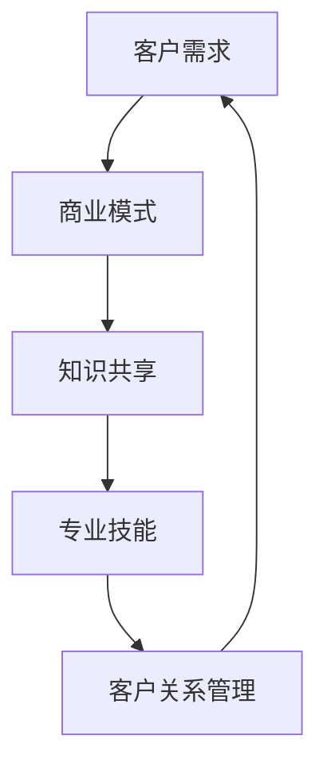

                 

关键词：技术经验，付费咨询服务，商业模式，职业发展，客户需求，知识共享，专业技能

> 摘要：本文旨在探讨如何利用技术经验转化为付费咨询服务，实现个人职业发展和价值最大化。通过分析市场需求、商业模式构建、知识共享策略、专业技能提升以及客户关系管理等方面，为技术从业者提供可行的转化路径和实践指导。

## 1. 背景介绍

随着信息技术产业的快速发展，技术人才的稀缺性日益凸显。很多拥有丰富技术经验的专业人士希望将自己的知识和技能转化为付费咨询服务，从而获得额外的收入来源或实现职业转型的目标。然而，如何有效地将技术经验转化为具有市场价值的咨询服务，成为一个值得探讨的问题。

本文将从以下几个方面展开讨论：

- 技术经验转化为付费咨询服务的重要性
- 核心概念与联系
- 核心算法原理与具体操作步骤
- 数学模型与公式详解
- 项目实践与代码实例
- 实际应用场景与未来展望
- 工具和资源推荐
- 总结：未来发展趋势与挑战

## 2. 核心概念与联系

在将技术经验转化为付费咨询服务的过程中，以下几个核心概念是至关重要的：

1. **客户需求**：了解潜在客户的需求和痛点，是提供有针对性的服务的关键。
2. **商业模式**：设计合理的商业模式，确保服务的市场竞争力。
3. **知识共享**：通过分享知识和经验，扩大影响力，吸引更多客户。
4. **专业技能**：不断提升自己的专业技能，以满足市场对高价值咨询服务的需求。
5. **客户关系管理**：建立良好的客户关系，确保服务的持续性和口碑传播。

### Mermaid 流程图



## 3. 核心算法原理 & 具体操作步骤

### 3.1 算法原理概述

将技术经验转化为付费咨询服务的核心算法可以概括为以下几个方面：

1. **需求识别**：通过市场调研、客户访谈等方式，识别潜在客户的需求和痛点。
2. **服务设计**：根据客户需求，设计具有市场竞争力的咨询服务。
3. **知识转化**：将个人技术经验转化为易于理解和应用的知识体系。
4. **价值塑造**：通过提供高质量的服务，塑造个人品牌的独特价值。
5. **营销推广**：运用多种渠道，进行有效的营销推广，吸引潜在客户。

### 3.2 算法步骤详解

1. **需求识别**
   - 进行市场调研，了解行业趋势和客户需求。
   - 分析竞争对手，找到自己的竞争优势。

2. **服务设计**
   - 确定服务类型和内容。
   - 设定服务价格和收费标准。

3. **知识转化**
   - 撰写技术博客，分享技术经验和心得。
   - 制作技术教程，帮助客户快速掌握相关知识。

4. **价值塑造**
   - 提供高质量的服务，赢得客户信任。
   - 通过客户反馈，不断优化服务质量。

5. **营销推广**
   - 利用社交媒体进行宣传。
   - 参加行业会议和研讨会，扩大影响力。
   - 与合作伙伴建立合作关系，共同推广服务。

### 3.3 算法优缺点

**优点**：

- 提供个性化服务，满足客户多样化需求。
- 利用自己的专业知识，实现价值最大化。
- 有助于个人品牌的建立和口碑传播。

**缺点**：

- 市场竞争激烈，需要不断提升自身技能。
- 营销推广成本较高，需要合理规划资源。

### 3.4 算法应用领域

- 信息技术咨询
- 软件开发与维护
- 网络安全评估
- 数据分析服务
- 云计算与大数据咨询

## 4. 数学模型和公式 & 详细讲解 & 举例说明

### 4.1 数学模型构建

将技术经验转化为付费咨询服务的数学模型可以简化为以下公式：

\[ \text{收入} = \text{服务价格} \times \text{服务量} \]

其中，服务价格和服务量是模型的关键参数。

### 4.2 公式推导过程

1. **确定服务价格**

   服务价格取决于多个因素，包括市场需求、竞争情况和个人品牌价值等。假设服务价格为 \( P \)。

2. **确定服务量**

   服务量取决于客户数量和单个客户的购买频次。假设服务量为 \( Q \)。

3. **计算收入**

   收入 \( R \) 等于服务价格 \( P \) 乘以服务量 \( Q \)：

   \[ R = P \times Q \]

### 4.3 案例分析与讲解

假设一位拥有 10 年软件开发经验的专业人士，决定将自己的经验转化为付费咨询服务。根据市场需求，他确定自己的服务价格为每小时 500 元。

1. **确定服务量**

   假设他每月能够为客户提供 20 小时的咨询服务。

2. **计算收入**

   收入 \( R \) 为：

   \[ R = 500 \times 20 = 10000 \text{元} \]

通过这个简单的例子，我们可以看到数学模型如何帮助我们理解将技术经验转化为付费咨询服务的过程。

## 5. 项目实践：代码实例和详细解释说明

### 5.1 开发环境搭建

为了演示如何将技术经验转化为付费咨询服务，我们将使用 Python 编写一个简单的代码实例。首先，确保安装以下工具和库：

- Python 3.8 或更高版本
- pip（Python 包管理器）
- Flask（一个轻量级的 Web 框架）

安装步骤：

1. 安装 Python：从 [Python 官网](https://www.python.org/downloads/) 下载并安装 Python 3.8 或更高版本。
2. 安装 pip：在终端中运行 `python -m pip install --user --upgrade pip`。
3. 安装 Flask：在终端中运行 `pip install flask`。

### 5.2 源代码详细实现

以下是简单的 Flask 应用程序，用于实现一个简单的咨询服务网站：

```python
from flask import Flask, request, render_template

app = Flask(__name__)

@app.route('/')
def home():
    return render_template('home.html')

@app.route('/contact', methods=['GET', 'POST'])
def contact():
    if request.method == 'POST':
        name = request.form['name']
        email = request.form['email']
        message = request.form['message']
        # 发送邮件或保存到数据库
        return 'Thank you for contacting us!'
    return render_template('contact.html')

if __name__ == '__main__':
    app.run(debug=True)
```

### 5.3 代码解读与分析

- **App 初始化**：使用 Flask 初始化一个 Web 应用程序。
- **路由定义**：定义两个路由，一个用于主页（'/'），另一个用于联系页面（'/contact'）。
- **HTML 模板**：使用 HTML 模板渲染主页和联系页面。

### 5.4 运行结果展示

1. 启动 Flask 应用程序：在终端中运行 `python app.py`。
2. 访问主页：在浏览器中输入 `http://127.0.0.1:5000/`。
3. 访问联系页面：在浏览器中输入 `http://127.0.0.1:5000/contact`。

通过这个简单的示例，我们可以看到如何使用技术知识构建一个基本的咨询服务网站。

## 6. 实际应用场景

将技术经验转化为付费咨询服务在实际应用中有广泛的应用场景，以下是一些典型场景：

- **企业咨询服务**：为企业提供信息技术咨询、软件定制开发、系统优化等服务。
- **个人技能培训**：为个人提供编程语言、数据库管理、云计算等方面的培训。
- **开源项目支持**：为开源项目提供代码审查、优化建议、维护支持等服务。
- **网络安全评估**：为组织提供网络安全评估、漏洞扫描、安全策略制定等服务。
- **数据分析服务**：为企业和个人提供数据分析、数据可视化、数据挖掘等服务。

### 未来应用展望

随着人工智能、大数据、云计算等技术的快速发展，技术咨询服务领域将迎来新的机遇。未来，以下几个方面有望成为技术咨询服务的新增长点：

- **智能咨询服务**：利用人工智能技术，提供更加智能、个性化的咨询服务。
- **云端服务**：基于云计算的咨询服务，为企业和个人提供高效、便捷的服务。
- **远程协作**：通过远程协作工具，实现全球范围内的咨询服务。
- **垂直行业应用**：针对特定行业（如医疗、金融、教育等）提供定制化的咨询服务。

## 7. 工具和资源推荐

### 7.1 学习资源推荐

- 《精通 Python》（作者：Mark Lutz）
- 《深度学习》（作者：Ian Goodfellow、Yoshua Bengio、Aaron Courville）
- 《算法导论》（作者：Thomas H. Cormen、Charles E. Leiserson、Ronald L. Rivest、Clifford）
- 《设计模式：可复用面向对象软件的基础》（作者：Erich Gamma、Richard Helm、Ralph Johnson、John Vlissides）

### 7.2 开发工具推荐

- Visual Studio Code（一款轻量级但功能强大的代码编辑器）
- Git（版本控制系统）
- Docker（容器化技术）
- Kubernetes（容器编排工具）
- JIRA（项目管理工具）

### 7.3 相关论文推荐

- "Deep Learning: A Brief History"（作者：Yoshua Bengio）
- "A Theoretical Analysis of Deep Convolutional Neural Networks for Visual Recognition"（作者：Karen Simonyan、Andrew Zisserman）
- "High-Performance Large Scale Machine Learning: The Core Curriculum"（作者：Roger Grosse、David McAllester、JohnLangford）

## 8. 总结：未来发展趋势与挑战

### 8.1 研究成果总结

本文通过对技术经验转化为付费咨询服务的探讨，总结了以下几个方面的重要成果：

- 技术经验转化为付费咨询服务的重要性。
- 核心概念与联系，包括客户需求、商业模式、知识共享、专业技能和客户关系管理。
- 核心算法原理与具体操作步骤。
- 数学模型和公式详解。
- 项目实践与代码实例。
- 实际应用场景与未来展望。

### 8.2 未来发展趋势

- 智能咨询服务的发展。
- 云计算和大数据技术在咨询服务中的应用。
- 垂直行业应用的增长。
- 远程协作和全球化服务。

### 8.3 面临的挑战

- 市场竞争加剧。
- 技术更新换代速度快。
- 营销推广成本增加。
- 需要不断提升自身技能。

### 8.4 研究展望

- 开发更加智能化的咨询服务。
- 探索云计算和大数据技术的深度应用。
- 加强跨学科合作，推动技术创新。
- 建立更加完善的知识共享和传递机制。

## 9. 附录：常见问题与解答

### Q1: 如何找到潜在客户？

A1: 可以通过以下途径寻找潜在客户：

- 参加行业会议和研讨会。
- 利用社交媒体进行推广。
- 通过线上平台（如 LinkedIn、GitHub 等）建立个人品牌。
- 与合作伙伴建立合作关系。

### Q2: 如何定价自己的服务？

A2: 服务定价需要考虑多个因素，包括市场需求、竞争情况、个人品牌价值等。以下是一些建议：

- 进行市场调研，了解行业标准和竞争对手的价格。
- 根据自己的专业技能和经验水平确定价格范围。
- 设定灵活的定价策略，根据客户需求和项目复杂度进行调整。

### Q3: 如何确保服务质量？

A3: 确保服务质量的关键在于：

- 提供高质量的服务，赢得客户信任。
- 建立完善的客户关系管理机制。
- 不断优化服务质量，根据客户反馈进行调整。
- 提供及时的售后服务和技术支持。

### Q4: 如何持续提升自己的专业技能？

A4: 持续提升专业技能的方法包括：

- 参加培训课程和研讨会。
- 阅读相关书籍和论文。
- 参与开源项目，积累实践经验。
- 与行业专家建立联系，交流学习。

### Q5: 如何平衡工作和咨询服务？

A5: 平衡工作和咨询服务的方法包括：

- 制定合理的工作计划和时间管理策略。
- 提高工作效率，确保完成工作任务。
- 分配适当的时间用于咨询服务，确保服务的质量。
- 与家人和朋友沟通，获得他们的支持和理解。

---

作者：禅与计算机程序设计艺术 / Zen and the Art of Computer Programming

---

本文旨在为技术从业者提供关于如何将技术经验转化为付费咨询服务的指导，帮助他们在职业发展中实现个人价值最大化。通过本文的探讨，我们可以看到技术经验在当今市场中的巨大价值，以及如何通过合理的商业模式和营销策略将其转化为实际收益。在未来的发展中，我们将继续看到技术咨询服务领域不断创新和发展的趋势，同时也面临着技术更新和市场竞争等挑战。希望本文能为读者提供有益的启示和帮助。

